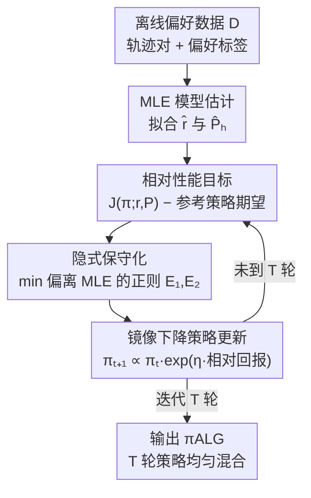

# Toward Conservative Planning from Human-AI Preferences in Reinforcement Learning

**会议**: ICLR 2026  
**OpenReview**: [https://openreview.net/forum?id=yzHwT3gfaE](https://openreview.net/forum?id=yzHwT3gfaE)  
**代码**: https://github.com/Rshias/MCP (有)  
**领域**: 强化学习 / 偏好强化学习 / 离线RL  
**关键词**: 偏好强化学习, 离线RL, 保守规划, 部分覆盖, 样本复杂度

## 一句话总结
本文提出 MCP（Model-based Conservative Planning），一个基于模型规划的离线偏好强化学习算法：它用「相对参考策略的性能差」做目标、用「与最大似然模型的偏差正则」隐式编码保守性，从而在**部分数据覆盖**且**不知道真实转移动态**的条件下，第一次同时做到「可证明样本高效」和「计算可解」，在 Meta-World 真实人类反馈基准上与 SOTA 相当甚至更好。

## 研究背景与动机
**领域现状**：偏好强化学习（PbRL）不依赖逐步的显式奖励，而是让人类或大模型对两条轨迹做相对偏好标注，再从偏好里反推策略，回避了奖励函数难设计、易被 reward hacking 的问题。离线 PbRL 进一步只用预先收集好的「轨迹对 + 偏好标签」数据集学习，避免了在线交互的采样成本和安全风险，在医疗、金融等交互昂贵的场景更实用。

**现有痛点**：现有离线 PbRL 大多假设数据**完全覆盖**了所有比较策略的轨迹分布，一旦只是**部分覆盖**（offline 数据只覆盖了部分而非全部好策略诱导的轨迹分布）就难以学到接近最优的策略。少数能处理部分覆盖的工作又各有硬伤：Principled-RLHF 只能用线性奖励模型；FREEHAND / Sim-OPRL 通过显式构造置信集来做保守学习，置信集的构造和优化在实践中**计算不可解**；并发工作 APPO 虽然能落地，却要么假设转移动态已知、要么要额外拟合一个依赖学到的转移模型的价值函数，靠价值函数去「局部平滑」覆盖空洞——这要求价值函数的 realizability 假设，且在部分覆盖下并不保证近最优 regret。

**核心矛盾**：保守性（conservatism）是离线 RL 对抗数据覆盖不足、避免对未见区域过度乐观的关键，但「编码保守性」和「计算可解 + 不依赖额外假设」之间存在张力——显式置信集保守得彻底却不可解，价值函数平滑可解却要额外的 realizability 假设、且不保证部分覆盖下的 regret。

**本文目标**：在通用函数逼近、**不知道真实转移动态**的设定下，给出一个既有 PAC 样本复杂度保证、又能真正跑起来的离线 PbRL 算法，并把覆盖条件从「全覆盖」放松到「只需覆盖（最优）比较策略诱导的轨迹分布」（即单策略 concentrability，离线数据覆盖的最弱条件）。

**切入角度**：作者从**基于模型（model-based）**的视角切入，提出一种**隐式**编码保守性的方式——不去显式刻画「置信集的宽度」，而是把保守性塞进「目标函数对模型偏离最大似然估计的惩罚」里；同时用「相对参考策略的性能差」做规划目标，避免依赖不可靠的绝对价值估计、也省掉额外的价值函数建模。

**核心 idea**：用「与 MLE 模型的偏差正则（隐式保守）+ 相对参考策略的性能差（model-based 规划目标）+ 镜像下降更新策略」三者组合，替代「显式置信集 / 额外价值函数」，在部分覆盖下既可证又可解。

## 方法详解

### 整体框架
MCP 要解决的是：给定一批带偏好标签的轨迹对 $D=\{(\tau^{n,0},\tau^{n,1},y^n)\}_{n=1}^N$（轨迹对采自参考策略 $\mu$，标签由人类/AI 给出，偏好概率由 BTL 模型 $P(y=1|\tau^0,\tau^1)=\Phi(r^\star(\tau^1)-r^\star(\tau^0))$ 决定），在不知道真实奖励 $r^\star$ 和真实转移 $P^\star$ 的情况下，学出一个能与「数据覆盖范围内最好的比较策略」竞争的策略。

整体流程是「先估计，再迭代优化」：先用极大似然从数据里拟合出参考奖励模型 $\hat r$ 和转移模型 $\hat P_h$；然后进入一个 $T$ 轮的循环，每轮做两件事——先在「与 MLE 模型一致」的模型类里，**悲观地（min）挑出一组让当前策略表现最差的奖励/转移模型**（隐式保守），再在这组最坏模型下用**镜像下降**把策略往「相对参考策略更好」的方向更新一步；最后把 $T$ 轮里所有策略**均匀混合**输出。整个过程没有显式置信集、没有额外的价值函数、也不在策略函数类里显式搜索。

### 关键设计

**1. 相对性能目标：用参考策略当锚点，绕开不可靠的绝对价值估计**

离线 PbRL 直接拿学到的奖励/转移模型去做策略优化时，会因为数据覆盖不足而**高估**未见区域的回报。MCP 没有去最大化绝对回报，而是最大化候选策略相对一个参考分布 $\mu_{\text{ref}}$（通常就取诱导离线数据的分布）的**性能差**：

$$\max_{\pi} \; J(\pi; r, \{P_h\}) - \mathbb{E}_{\tau\sim\mu_{\text{ref}}}[r(\tau)].$$

这样做有两个好处：一是把「绝对值估计」换成「相对参考策略的提升」，参考项 $\mathbb{E}_{\tau\sim\mu_{\text{ref}}}[r(\tau)]$ 在数据覆盖内是可靠的，于是即便绝对回报估计有偏，相对比较仍然稳健，天然导向「在参考策略基础上做改进」；二是这个相对目标可以纯靠 model-based planning（在模型里 rollout 算回报）来评估，**不需要再单独建一个价值函数**，省掉了 APPO 那类方法对价值函数 realizability 的依赖。这也是后文 Corollary 4.2 能给出「安全策略改进」（学到的策略不差于产生数据的行为策略）保证的来源。

**2. 隐式保守化：用与 MLE 模型的偏差正则替代不可解的显式置信集**

现有可证方法靠显式构造置信集来保守，但置信集宽度不可测、要解约束优化，计算不可解。MCP 把保守性**隐式**地塞进一个 minimax 目标里：在「与离线数据一致」的模型类里，对奖励 $r$ 和转移 $\{P_h\}$ 取 $\min$（即在最坏情形模型下评估当前策略），同时用两个正则项把候选模型**拽住、不让它偏离 MLE 模型太远**：

$$\max_{\pi}\min_{r,\{P_h\}} \; J(\pi; r, \{P_h\}) - \mathbb{E}_{\tau\sim\mu_{\text{ref}}}[r(\tau)] + \lambda_1 \mathcal{E}_1(r;D) + \lambda_2 \mathcal{E}_2(\{P_h\};D).$$

其中 $\mathcal{E}_1$ 惩罚候选奖励在每个轨迹对上的「偏好差」 $r(\tau^{n,1})-r(\tau^{n,0})$ 偏离 MLE 奖励的程度，$\mathcal{E}_2$ 惩罚候选转移在数据样本上偏离 MLE 转移 $\hat P_h$ 的 total-variation 距离。$\lambda_1,\lambda_2$ 是用户指定的「保守强度旋钮」。直觉是：内层 $\min$ 让评估对「数据没覆盖到、模型说不准」的区域天然悲观（避免高估），而正则把搜索限制在「数据支持的可信模型」附近（避免悲观过头）。关键是——这里的保守完全由「对 MLE 的可度量偏差」控制，不涉及置信集那种不可测的量，因此**计算可解**。消融实验证实 $\lambda_1=0$ 或 $\lambda_2=0$ 时算法几乎学不动，说明这两个保守正则是稳定性的核心。

**3. 纯模型规划 + 镜像下降策略更新：不学价值函数、不显式搜策略**

确定了当轮的最坏情形模型 $r^t,\{P_h^t\}$ 后，MCP 不在策略函数类 $\Pi$ 里显式搜索，而是做一步**镜像下降（mirror descent）**式的乘性更新：

$$\pi^{t+1}(a|s) \;\propto\; \pi^{t}(a|s)\,\exp\!\Big(\eta\,\mathbb{E}_{d^{\pi^t}_{\{P_h^t\}}}\big[r^t(\tau)\,\big|\,s,a\big]\Big).$$

这一步把「策略空间」和「奖励/转移模型类」桥接起来：策略的更新方向直接由当前最坏情形模型下的相对回报决定，因此策略不再独立于 $R$ 和 $\{P_h\}$ 被搜索，整套算法在「悲观选模型 → 镜像下降改策略」之间交替。所有评估都靠在模型里规划（model-based planning）完成，避免了拟合额外价值函数带来的模型误差偏置；消融里的「Value-based MCP」变体早期能涨、后期崩坏，正说明纯靠 value-based 更新会引入显著的模型误差偏置。最终输出 $\pi_{\text{ALG}}=\text{MixIter}(\{\pi^t\}_{t=1}^T)$，即把 $T$ 轮策略均匀混合，理论上对应 $O(R_{\max}\sqrt{\log|A|/T})$ 的优化误差，可随迭代数 $T$ 增大而消去。

**4. 结构化动态精化：把覆盖系数收紧成更自然的量，换取更紧的 regret**

通用函数逼近下的 regret 依赖「集中度系数」 $C_R(\pi),C_P(\pi)$（刻画离线数据对比较策略轨迹分布的覆盖好坏）。本文进一步指出：当转移动态具备特定结构时，可以把这些系数精化成更可解释、更小的量，从而得到更紧的界。具体两类：**核化非线性调节器（KNR）** 假设下一状态是当前状态-动作非线性嵌入 $\phi(s,a)$ 的线性变换加高斯噪声，此时把 $C_P(\pi)$ 换成相对条件数 $C_P^K(\pi)=\sup_x \frac{x^\top\Sigma_\pi x}{x^\top\Sigma_\mu x}$，界里出现的是数据协方差的秩 $\mathrm{rank}(\Sigma_\mu)$ 而非特征维度 $d$，**即便 $d$ 无穷大、只要数据集中在低维子空间**界依然成立；**因子化模型（Factored）** 假设每个状态分量只依赖一小撮父变量 $P_i$，把全局密度比换成逐因子的局部集中度 $C_P^F(\pi)=\max_i\mathbb{E}_{(s,a)\sim\mu}\big[(\frac{d^\pi(s[P_i],a)}{\mu(s[P_i],a)})^2\big]$，于是样本复杂度只随因子数和父集大小（$L_p$）增长，**避免了对状态维度 $d$ 的指数依赖**。这部分是对基础算法的理论延伸（对应变体 MCP-KNR、MCP-Factored），不改变主流程，只是修改了 MLE 估计步并换用结构化的集中度系数。

### 损失函数 / 训练策略
- 奖励/转移 MLE：$\hat r=\arg\max_r \sum_n \log P_r(o=o^n|\tau^{n,1},\tau^{n,0})$，$\hat P_h=\arg\max_{P_h}\sum_n\sum_i \log P_h(s^{n,i}_{h+1}|s^{n,i}_h,a^{n,i}_h)$。
- 学习率取 $\eta=\sqrt{\log|A|/(2R_{\max}^2 T)}$；正则系数理论取 $\lambda_1=O(C_R(\pi))$、$\lambda_2=O(R_{\max}\sqrt{C_P(\pi)M_P})$，其中 $M_P$ 度量镜像下降轨迹上各轮策略相对 $\mu$ 的分布偏移。
- 主定理（Theorem 4.1）：以至少 $1-\delta$ 概率，$J(\pi)-J(\pi_{\text{ALG}})$ 被「优化误差 $O(R_{\max}\sqrt{\log|A|/T})$ + 奖励统计误差 + 转移统计误差」三项之和上界，统计误差随覆盖系数和样本量 $N$ 调整；样本复杂度为 $O(\epsilon^{-2})$，相比 APPO 的 $O(\epsilon^{-4})$ 更优，且能处理无穷函数类。⚠️ 公式细节以原文为准。

## 实验关键数据

### 主实验
在 Meta-World 带真实人类偏好反馈的 medium-replay 基准上，用 500 / 1000 条偏好样本、8 个任务、3 个随机种子评测成功率（%）。基线含 Oracle（IQL 用真值奖励训练，作为上界参考）、MR、PT、DPPO、IPL、APPO。下表摘录 1000 偏好下的代表性任务与平均排名：

| 任务（1000 偏好） | MR | PT | DPPO | IPL | APPO | MCP |
|------|------|------|------|------|------|------|
| BPT | 8.48 | 18.27 | 3.20 | 36.67 | 59.04 | **62.93** |
| BPT-wall | 0.48 | 2.13 | 0.27 | 14.07 | 62.96 | **69.73** |
| drawer-open | 98.40 | 95.32 | 36.47 | 28.53 | 98.56 | **99.07** |
| lever-pull | 88.96 | 72.93 | 8.53 | 40.40 | 76.96 | **83.33** |
| sweep-into | 26.00 | 20.27 | 23.33 | 30.40 | 18.16 | **34.13** |
| 平均排名(500/1000/总) | 3.00/2.75/2.88 | 3.50/4.13/3.81 | 5.25/5.38/5.31 | 4.00/3.88/3.94 | 2.88/2.75/2.81 | **2.38/2.13/2.25** |

MCP 取得最好的总体平均排名（2.25），在 8 个任务多数上优于同为 model-based 的 APPO——作者归因于 APPO 靠价值函数「平滑」覆盖空洞，在覆盖差的场景仍不够稳健。但 MCP 并非全面碾压：在 box-close、sweep、dial-turn 等任务上明显弱于 APPO 或 MR（如 dial-turn-1000 上 MCP 48.40 vs APPO 81.44），说明优势集中在覆盖更差、更需要保守性的任务上。

### 消融实验
在 lever-pull-1000 上逐一去掉各设计组件（Figure 2a）：

| 配置 | 表现 | 说明 |
|------|------|------|
| Full MCP | 快速收敛到高成功率 | 完整模型 |
| 去奖励正则 ($\lambda_1=0$) | 几乎学不动 | 保守模型项缺失→过度乐观/不稳定 |
| 去转移正则 ($\lambda_2=0$) | 几乎学不动 | 同上 |
| No Relative Performance | 方差大、学习不稳定 | 失去安全策略改进保证 |
| Value-based MCP | 早期涨后期崩 | 纯价值更新引入模型误差偏置 |

### 关键发现
- **两个保守正则（$\lambda_1,\lambda_2$）是稳定性的命根子**：去掉任一个算法几乎不前进，印证「隐式保守化」设计的必要性。
- **相对性能目标负责稳定**：去掉它后方差剧增、训练不稳，对应理论上「安全策略改进」保证的丢失。
- **小数据稳健**：偏好样本从 100 到 2000，即便 $N=100$ 时 MCP 仍保持较高成功率，适合医疗/金融这类标注稀缺场景。
- **抗标签噪声**：在 drawer-open 上随机翻转标签概率 $p$ 增大时，MCP 成功率衰减比 MR 更慢，保守设计带来对噪声偏好的鲁棒性。
- **超参不敏感**：$\lambda_1,\lambda_2$ 跨数个数量级变化时（Table 3），drawer-open / sweep-into 的成功率只温和波动，调参负担小。

## 亮点与洞察
- **「隐式保守」的优雅之处**：把保守性从「显式置信集的不可测宽度」改写成「对 MLE 模型的可度量偏差正则」，一招同时拿下「可证」和「可解」——这是离线 PbRL 里此前没能兼得的两点。
- **相对性能目标 = 省掉价值函数 + 自带安全改进**：用「相对参考策略的提升」当目标，既避开绝对价值估计的高估，又把 model-based planning 直接当评估器用，顺带得到「不差于行为策略」的安全保证，一个设计解决多个问题。
- **可迁移思路**：「用对 MLE 的偏差正则隐式编码悲观」这个 trick，思路上可迁移到其他需要保守性、但又嫌置信集不可解的离线学习问题（如离线 RLHF、离线 IL）。
- **结构换紧界**：KNR 下界依赖 $\mathrm{rank}(\Sigma_\mu)$ 而非维度 $d$、Factored 下避免对 $d$ 的指数依赖，提示「数据本身的低维/因子结构」可以被算法主动利用来打破维度诅咒。

## 局限与展望
- **偏好模型受限于 BTL**：方法默认 Bradley-Terry-Luce sigmoid 链接函数，作者也把「扩展到 Thurstone 等其他偏好模型」列为未来方向，对非 BTL 的人类偏好分布是否稳健未验证。
- **实验规模与可比性**：只在 Meta-World 8 个机械臂任务上评测；不同任务难度差异大，MCP 在部分任务（box-close、dial-turn）明显落后，横向比平均排名时需注意任务难度不可直接通约。
- **理论假设**：仍需 realizability（$r^\star\in R$、$P_h^\star\in P_h$）和有界性假设；$\lambda_1,\lambda_2$ 的理论取值依赖未知的集中度系数 $C_R,C_P$，实践中只能当超参调，理论与实现之间存在 gap。
- **改进思路**：把结构化精化（KNR/Factored）与实际深度网络实现结合、或在线-离线混合，可能进一步放松覆盖要求。

## 相关工作与启发
- **vs Principled-RLHF (Zhu et al. 2023)**：都处理部分覆盖且可证可解，但前者只支持线性奖励模型；MCP 走通用函数逼近，表达力更强。
- **vs FREEHAND / Sim-OPRL (Zhan 2023a / Pace 2024)**：都用通用函数逼近 + 保守学习且有 PAC 保证，但它们靠显式构造置信集，计算不可解；MCP 用隐式正则做到可解，样本复杂度同阶。
- **vs APPO (Kang & Oh 2025)**：都是 model-based、可证可解，但 APPO 要么假设转移已知、要么额外拟合价值函数靠 Bellman 递归做平滑（需价值 realizability 且不保证部分覆盖下近最优 regret），样本复杂度 $O(\epsilon^{-4})$ 且限于有限类；MCP 不需已知动态、不建额外价值函数，$O(\epsilon^{-2})$ 且能处理无穷类。
- **vs OPRL / IPL (Shin 2023 / Hejna & Sadigh 2023)**：后两者可解但要求全覆盖、无样本高效保证；MCP 把覆盖放松到单策略 concentrability。

## 评分
- 新颖性: ⭐⭐⭐⭐⭐ 首个在部分覆盖 + 未知动态下同时可证样本高效与计算可解的离线 PbRL 算法，「隐式保守」思路新颖。
- 实验充分度: ⭐⭐⭐⭐ 含主表 + 消融 + 数据量/噪声/超参敏感性多维分析，但任务域较窄、部分任务落后。
- 写作质量: ⭐⭐⭐⭐ 理论与算法动机讲得清楚，表格与定理对应明确。
- 价值: ⭐⭐⭐⭐⭐ 把离线 PbRL 的「可证 vs 可解」长期张力收拢到一个统一框架，理论贡献扎实。

<!-- RELATED:START -->

## 相关论文

- [\[ICLR 2026\] Trajectory Generation with Conservative Value Guidance for Offline Reinforcement Learning](trajectory_generation_with_conservative_value_guidance_for_offline_reinforcement.md)
- [\[ICLR 2026\] Improving Human-AI Coordination through Online Adversarial Training and Generative Models](improving_human-ai_coordination_through_online_adversarial_training_and_generati.md)
- [\[ICLR 2026\] Peng's Q($\lambda$) for Conservative Value Estimation in Offline Reinforcement Learning](pengs_qlambda_for_conservative_value_estimation_in_offline_reinforcement_learnin.md)
- [\[ICLR 2026\] Using Reinforcement Learning to Train Large Language Models to Explain Human Decisions](using_reinforcement_learning_to_train_large_language_models_to_explain_human_dec.md)
- [\[ICLR 2026\] Learning Human Habits with Rule-Guided Active Inference](learning_human_habits_with_rule-guided_active_inference.md)

<!-- RELATED:END -->
