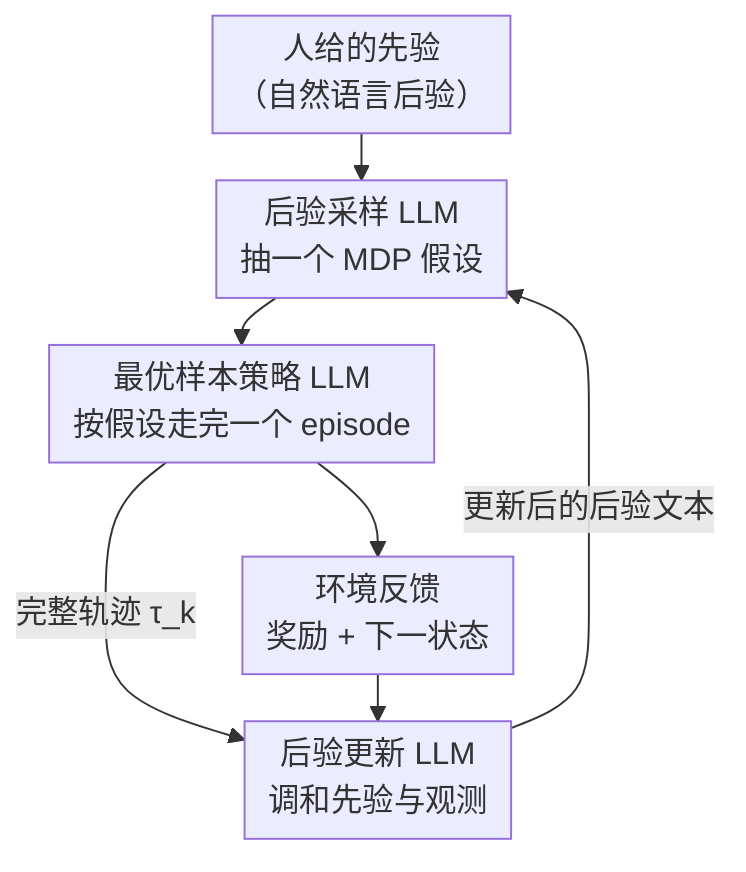

# Toward Efficient Exploration by Large Language Model Agents

**会议**: ICLR 2026  
**OpenReview**: [https://openreview.net/forum?id=M3vwnscpL2](https://openreview.net/forum?id=M3vwnscpL2)  
**领域**: 强化学习 / LLM Agent  
**关键词**: 高效探索, 后验采样, Thompson 采样, PSRL, LLM 智能体

## 一句话总结
与其设计新的 LLM 智能体架构去隐式地"涌现"探索能力，本文主张直接用 LLM 显式实现一个已被理论证明探索高效的经典 RL 算法——后验采样强化学习（PSRL），把它的三个核心步骤分别外包给三个 LLM，在 bandit、tabular MDP 以及 Wordle/组合锁这类纯自然语言任务上都拿到了远超主流 LLM 智能体基线的累积遗憾曲线。

## 研究背景与动机

**领域现状**：围绕大语言模型构建序贯决策智能体（LLM agent）是当前 RL 的一个热门方向。主流做法是"堆架构"——用一个或多个 LLM 互相协作（如 ReAct、Reflexion、In-Context RL、In-Context Policy Iteration），靠 in-context learning 或自我反思，让智能体在与环境的试错交互中"隐式地"学会最优行为。

**现有痛点**：这些智能体本质上仍处在经典 RL 设定里，必须面对数据效率的三大基本障碍——泛化、探索、信用分配。本文用实验证明：在探索是成败关键的简单自然语言任务上，这些新潮的智能体设计普遍探索得很差。它们要么把"如何探索"完全甩给 LLM 自己临场发挥，要么指望 in-context learning 能模仿出某个 RL/bandit 算法的探索行为，而当下的 LLM 还做不到。

**核心矛盾**：RL 文献里早有能优雅处理探索的经典算法（如 PSRL），它们带有可证明的统计高效性保证。但这些算法需要维护对环境（MDP 的转移/奖励函数）的贝叶斯后验、并对后验样本求最优策略——这套技术机器在纯自然语言环境里几乎无法操作：高维 MDP 的认知状态空间随horizon 指数膨胀，共轭先验只覆盖少数几个统计分布，Langevin 动力学这类近似手段也很难和 LLM 嫁接。于是出现一个割裂：好算法用不上语言任务，语言智能体又不会探索。

**本文目标**：不再发明新算法，而是回头审视现有 RL 算法，问一句"LLM 能不能去实现它们，从而把这些算法的足迹拓展到它们原本完全够不着的自然语言环境？"

**切入角度**：一个 RL 算法抽象来看，无非是"指定输入 + 一串确定行为的步骤"。LLM 的出现并不该改变智能体设计的基本原理。作者的观察是：PSRL 的每一步（采后验样本、对样本求最优行为、更新后验）都可以拆成 LLM 擅长的"原子函数"，用自然语言来承载本来需要精确统计分布才能表达的东西。

**核心 idea**：用 LLM 显式地"实现"一个已知高效的 RL 算法（PSRL），而不是用 LLM 架构去隐式地"替代"它——前者继承了 Thompson 采样几十年被研究透的探索保证，后者只能祈祷探索能力自己涌现。

## 方法详解

### 整体框架

本文要解决的是"在自然语言任务里做统计高效的探索"。整体思路是把后验采样强化学习（PSRL）这个经典算法搬进 LLM。先回顾经典 PSRL：它把对真实 MDP $M$ 的不确定性建模为一个后验分布 $P(M\mid H_k)$，在每个 episode 开始时用 Thompson 采样从后验里抽一个"统计上合理"的 MDP 假设，然后对这个采样 MDP 求最优策略并执行整个 episode，episode 结束后再用完整轨迹 $\tau_k$ 一次性更新后验。它的妙处在于：后验在 episode 内固定、只在结尾懒更新，却足以驱动有方向的探索（不断削减认知不确定性），并在 tabular MDP 等问题类上满足贝叶斯遗憾上界。

本文的核心动作是：把 PSRL 算法里的三个步骤分别外包给三个独立的 LLM，让 PSRL 这套"流程骨架"去编排 LLM 的输出，而不是让 LLM 自己去想怎么探索。整条流水线如下图：先由人给出一个用自然语言写的先验（即初始"后验"文本），后验采样 LLM 据此生成一个关于转移/奖励如何展开的合理假设，最优样本策略 LLM 在这个假设下逐步选动作走完一个 episode，后验更新 LLM 再拿完整轨迹去调和先验与观测、产出新的后验文本，如此循环 $K$ 个 episode。

整套设计的关键在于：三个 LLM 各自只负责一个"原子函数"，没有任何一个被提示去"鼓励探索"——探索行为是 PSRL 这个算法骨架自然带来的，而不是 LLM 临场发挥出来的。

### 关键设计

**1. 设计原则：显式"实现"经典 RL 算法，而非用 LLM 架构隐式"替代"它**

这是全文的元层面贡献，也是和所有基线最本质的分野。现有 LLM 智能体（ICPI、ICRL、Reflexion 等）都是在"组合若干 LLM、寄望探索能力涌现"，本文反其道而行：既然一个 RL 算法只是"输入 + 一串步骤"，那就把这串步骤老老实实搬过来、用 LLM 去填每个步骤的空。这样做的直接好处是，PSRL 几十年积累的探索理论保证（Thompson 采样的贝叶斯遗憾上界）被原封不动地继承下来——哪怕 LLM 实现的每一步都是"不精确"的近似，经典 PSRL 在策略只是近似最优时仍有遗憾上界（Osband 2016a, §5.4），让人有理由期待 LLM 版本在实践中也有类似的鲁棒性。作者还强调一个常被忽略的区分：是"LLM 去实现一个 RL 算法"，还是"一个 RL 算法被 LLM 实现"——前者能把经典算法的适用范围拓展到自然语言这种原本完全不可行的领域，后者（如让 LLM 模仿某 RL 方法的输出）仍被困在传统问题类里。

**2. 三个 LLM 子程序编排出 PSRL 的完整循环**

PSRL 需要三件事：从后验采样、对样本求最优策略、用轨迹更新后验。本文把这三件事分给三个 LLM。**后验采样 LLM**：给定当前后验文本（首轮即人给的先验），生成一个对转移与奖励如何展开的合理假设；在 tabular MDP 里它可以是逐个 state-action 对的奖励与转移清单，在更实际的任务里则只需描述足以决定（近）最优行为的关键信息。**最优样本策略 LLM**：拿着这个采样假设和当前状态，选出"如果假设为真则最优"的动作，简单任务里直接问它要动作即可，复杂任务里可用思维链提示来提高选到最优动作的概率。**后验更新 LLM**：episode 结束后，拿到正好 $H$ 个 state-action 对的奖励与转移轨迹，去调和"episode 开始时的先验知识"与"环境里观测到的交互"，产出更新后的后验。三个 LLM 一旦各就各位，PSRL 的循环就能整体跑起来。值得注意的是，作者发现后验采样的温度 $\kappa_{\text{sampling}}$ 对探索质量影响极大（见实验），而最优样本策略和后验更新的温度通常固定为 1。

**3. 文本化的认知状态 + 环境代理：让"维护后验"在语言里变得可行**

经典 PSRL 在 tabular 之外的最大障碍，是高维环境里根本表示不了对 MDP 的不确定性。本文的破解办法是：把后验直接写成一段**自然语言文本**，它既总结真实 MDP 转移/奖励中"已知"与"不确定"的部分，又显式地表达智能体对这些部分还有多少不确定性——这段文本就是 PSRL 智能体的认知状态（epistemic state）表示。这带来两个好处：一是设计者能用语言的全部表达力来注入先验知识，不再被"只有少数几个共轭先验分布算得动"所束缚；比如在 tabular MDP 里把下一状态转移分布用语言描述成 Dirichlet 分布，就能自然地诱导 LLM 去维护访问计数。二是引入**环境代理（environment proxy）**：对很多任务，不必事无巨细地维护每个 state-action 对的统计量，只需盯住一个"充分统计量"。例如 Wordle 这个 MDP 的转移与奖励完全由一个未知的五字母目标词决定，那个目标词就是环境代理——LLM 版 PSRL 只要对"目标词"维护不确定性即可，组合锁里的解锁码同理。这一招把维护后验的成本从指数级压回可操作的范围。

## 实验关键数据

实验都挑选"探索是唯一/主要数据效率障碍"的任务，并尽量剥离泛化和信用分配的干扰。评价指标是累积遗憾曲线（越低越平越好）。除特别说明外所有 LLM 都用 GPT-4o。

### 主实验

| 任务 | 类型 | 本文 LLM-PSRL 表现 | 对照 |
|------|------|--------------------|------|
| 5 臂 Bernoulli bandit | bandit | $\kappa_{\text{sampling}}=1.2$ 时累积遗憾优于经典 TS（$T=100$） | 经典 Thompson 采样 |
| 客服 bandit（真实数据，超大动作空间） | 自然语言 bandit | well-specified 先验下远超所有基线 | ICPI / ICRL / Reflexion |
| RiverSwim（截断到 3 状态，$H=6$） | tabular MDP | 用 o1-mini 时拿到次线性遗憾，与 vanilla PSRL 相当 | vanilla PSRL / Reflexion / ICRL |
| 组合锁（$H=3$ 位、$K=8$，随机选码概率 <0.14%） | 自然语言 MDP | 探索效率最佳，逼近贝叶斯最优策略 | ICPI / ICRL / Reflexion |
| Wordle（$K=6$、$H=5$） | 自然语言 MDP | 即便用较弱的 GPT-4o 也优于所有基线 | ICPI / ICRL / Reflexion |

### 消融 / 关键分析

| 配置 | 关键现象 | 说明 |
|------|---------|------|
| 后验采样温度 $\kappa_{\text{sampling}}$ | 1.2 优于 1.0/更低 | 温度 ≤1 时后验样本偏向"目前成功最多的臂"，退化为贪心；>1 时才逼近 TS 的渐进探索 |
| RiverSwim：GPT-4o → o1-mini | 从线性遗憾变次线性 | 更强的模型让 LLM-PSRL 在随机转移下"优雅扩展"，印证 §3.2 的论断 |
| 同样升级用在 Reflexion/ICRL 上 | 几乎无改善，ICRL 反而变差 | 探索能力来自 PSRL 骨架而非模型强度；ICRL 退化疑因随机转移叠加大量 ICL 示例与 o1-mini 推理不合拍 |
| Wordle：GPT-4o → DeepSeek-R1 | 所有智能体都涨，但基线即便用 R1 也无法显著超过用 GPT-4o 的 LLM-PSRL | 强推理无法替代算法层面的探索结构 |

### 关键发现
- **探索来自算法骨架，不来自提示**：三个 LLM 没有一个被提示去"鼓励探索"，但把它们摆进 PSRL 的编排里就涌现出高效探索——这是与"靠提示诱导探索"的基线最本质的区别。
- **模型能力与算法结构正交且互补**：换更强的 LLM 能让 PSRL 在随机环境里从"线性遗憾"跨到"次线性遗憾"，但同样的升级对基线几乎无用甚至有害；说明该补的是探索的"结构"，模型变强只能锦上添花。
- **先验误设是软肋也是诚实之处**：客服任务里直接让 GPT-4o 给先验时，真解可能不在先验支撑集内（prior misspecification），PSRL 本身按假设不处理这种情况；但即便如此基线仍无法显著超过它，而把先验修成 well-specified 后 PSRL 优势进一步拉大。
- **随机转移 + 大状态空间是当前边界**：RiverSwim 放大后 LLM 的规划能力短板重新暴露，这是方法目前的主要失效模式。

## 亮点与洞察
- **"实现 vs 替代"是一个可迁移的设计哲学**：与其为 LLM 重新发明 RL 算法，不如把 LLM 当作"实现经典算法所需子程序"的执行器。这个视角可推广到 PSRL 之外的任何带有清晰步骤、且有理论保证的经典算法（如 UCB、信息导向采样 IDS——作者在附录 F 已有 IDS 的初步结果）。
- **用自然语言承载认知状态**是把贝叶斯方法搬进语言任务的关键 trick：把"后验"写成一段同时表达已知与不确定性的文本，绕开了共轭先验的束缚，还能用语言措辞直接注入先验（如"按 Dirichlet 来描述"就诱导出访问计数）。
- **环境代理**把"维护整张 MDP 的后验"压缩成"维护一个充分统计量的不确定性"，是让方法在 Wordle/组合锁这类组合爆炸任务上仍可行的核心。
- 一个反直觉的"啊哈"点：让基线用上更强的推理模型（DeepSeek-R1）也追不上用弱模型的 PSRL——证明探索是结构问题，不是算力问题。

## 局限与展望
- **随机转移下 LLM 规划能力是瓶颈**：作者坦承在随机转移、状态-动作空间变大时性能会随规模退化，根源是 LLM 在随机动力学下的规划能力差（附录 D）。展望用容忍不精确转移模型的正则化方法（Jiang 2015、Arumugam 2018、Rathnam 2023）来缓解。
- **先验误设无显式机制处理**：PSRL 按假设要求先验 well-specified，真解不在支撑集时没有内建的补救手段，本文只能靠"换一种先验生成方式"绕过。
- **评测任务偏简单且刻意剥离了泛化与信用分配**：为了隔离探索，任务都给了逐步即时反馈（消除信用分配），状态空间也不大；方法在同时存在泛化/信用分配挑战的复杂任务上是否成立尚未验证。
- **成本与可复现性**：高度依赖 LLM API，难以拿到细粒度算力数据，财务成本不低（ICPI 因成本只跑 10 trial），只能给 token/美元的粗略估计。

## 相关工作与启发
- **vs ICPI（In-Context Policy Iteration）**: 同样用三个 LLM，但 ICPI 实现的是策略迭代且预设数据已采好、靠 ICL 平衡数据集；在需要探索的任务里它从没观测到非零奖励、坍缩成随机策略。本文实现的是 PSRL，探索是其内生属性。
- **vs ICRL（In-Context RL）**: ICRL 靠"对 ICL 数据敏感导致的 LLM 回答随机性"来探索（用 Bernoulli($p$) 决定回放哪些 episode），本质是把探索寄托在采样噪声上；本文则把探索交给 Thompson 采样这一有保证的机制，且 ICRL 降低保留概率 $p$ 反而更差。
- **vs Reflexion**: Reflexion 靠自我反思 LLM 生成口头指导来改进决策，但其反思在早期只会泛泛地"鼓励尝试没试过的选项"（假设智能体被告知就会探索），只有不确定性基本消除后才给出具体建议；本文不依赖这种"会探索"的前提。
- **vs 经典 PSRL / vanilla TS**: 经典版本被局限在 tabular 或有共轭先验的小规模域；本文用 LLM 把它拓展到自然语言任务，同时在 bandit/RiverSwim 上证明它能复现甚至超过经典版本的遗憾曲线，是对 PSRL 这个"长期偏理论"的算法难得的经验支持扩展。

## 评分
- 新颖性: ⭐⭐⭐⭐⭐ "实现而非替代经典 RL 算法"是一个清晰、可迁移且少有人走的设计哲学。
- 实验充分度: ⭐⭐⭐⭐ 覆盖 bandit→tabular→自然语言四类任务并与三种主流基线对比，但任务规模偏小、刻意剥离了泛化与信用分配。
- 写作质量: ⭐⭐⭐⭐⭐ 问题动机、算法映射、失效边界都讲得诚实清晰。
- 价值: ⭐⭐⭐⭐⭐ 给"LLM 智能体不会探索"开出一剂结构性的药方，并打通经典 RL 理论与语言任务。

<!-- RELATED:START -->

## 相关论文

- [\[ICLR 2026\] Squeeze the Soaked Sponge: Efficient Off-Policy RFT for Large Language Model](squeeze_the_soaked_sponge_efficient_off-policy_rft_for_large_language_model.md)
- [\[ICLR 2026\] Structured In-context Environment Scaling for Large Language Model Reasoning](structured_in-context_environment_scaling_for_large_language_model_reasoning.md)
- [\[ICLR 2026\] Learning to Orchestrate Agents in Natural Language with the Conductor](learning_to_orchestrate_agents_in_natural_language_with_the_conductor.md)
- [\[ICLR 2026\] On Predictability of Reinforcement Learning Dynamics for Large Language Models](on_predictability_of_reinforcement_learning_dynamics_for_large_language_models.md)
- [\[ICLR 2026\] Sample-efficient and Scalable Exploration in Continuous-Time RL](sample-efficient_and_scalable_exploration_in_continuous-time_rl.md)

<!-- RELATED:END -->
