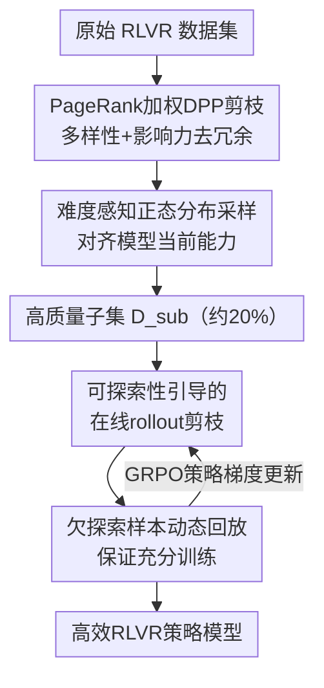

# Towards High Data Efficiency in Reinforcement Learning with Verifiable Reward

**会议**: ICLR 2026  
**OpenReview**: [https://openreview.net/forum?id=sruA4AZmZI](https://openreview.net/forum?id=sruA4AZmZI)  
**代码**: https://github.com/RUCAIBox/DEPO  
**领域**: 强化学习 / RLVR / LLM推理  
**关键词**: RLVR, 数据效率, 数据选择, 可探索性, GRPO

## 一句话总结
DEPO 把"离线选数据"和"在线选 rollout"两件事第一次合到一个 RLVR 流程里：离线用 PageRank 加权 DPP + 难度感知正态采样挑出多样、有影响力、难度适中的子集，在线用样本级可探索性指标跳过低潜力样本的 rollout 并回放欠探索样本，结果只用 20% 数据、40% rollout 就能在 AIME24/25 上达到全量 GRPO 的水平，训练提速约 1.6–1.85 倍。

## 研究背景与动机

**领域现状**：用可验证奖励的强化学习（RLVR，如 DeepSeek-R1 的 GRPO）是当前提升 LLM 推理能力的主流手段——模型对一道题采样多条 rollout，按最终答案对错给二元奖励，迭代打磨推理策略。提升 RLVR 效果的常规做法就是"加数据 + 加 rollout"。

**现有痛点**：这种 scaling 思路代价极高。一方面训练数据规模和 rollout 数量直接拉高算力成本；另一方面数据效率很低——很多样本要么太简单要么太难，几乎不提供学习信号，却照样占用 rollout 预算。已有的提效工作分两类：离线方法（LIMR、Learnalign 等）只靠单一指标（reward 趋势、reward 方差、梯度对齐）选数据，且大多要先把数据集训几个 epoch 才能算出指标，本身就贵；在线方法（GRESO）只过滤"历史 reward 方差为零"的样本，对所有非零方差样本一视同仁，缺乏更细粒度的潜力评估。

**核心矛盾**：现有方法要么只从离线、要么只从在线单一视角省数据，导致数据效率始终次优；而离线的单指标选择又无法刻画训练数据的复杂特性（多样性、代表性、难度往往要一起看）。

**本文目标**：在不修改/不增广原数据集的前提下，"用更少数据 + 更少 rollout 达到可比性能"，需要同时解决两个子问题——(a) 离线如何选出高质量子集；(b) 在线如何把 rollout 算力花在真正有探索价值的样本上。

**切入角度**：作者观察到 rollout 生成才是 RLVR 训练速度的真正瓶颈，而样本价值随训练动态变化——一个样本现在低价值不代表后期没用。于是把数据效率拆成"先在离线一次性砍掉冗余、对齐难度"，再在"在线按实时训练动态动态分配 rollout"。

**核心 idea**：第一次把离线数据精选和在线 rollout 剪枝端到端整合进同一个 RLVR 流程，用多维度离线 curation 把数据"选对"，再用样本级可探索性把 rollout "花对"。

## 方法详解

### 整体框架

DEPO（Data-Efficient Policy Optimization）是套在标准 GRPO 之上的两阶段数据效率框架。输入是一个完整 RLVR 数据集，输出是用极小数据/rollout 预算训出的强推理策略模型。

第一阶段是**离线 curation**：把原始数据先做表征建图、用 PageRank 加权 DPP 剪掉冗余、再按难度做正态采样，得到一个又小又"营养均衡"的子集 $D_{sub}$（论文取 20%）。第二阶段是**在线 rollout 剪枝**：在 $D_{sub}$ 上跑 GRPO 训练时，每个 batch 都用样本级可探索性指标排序，只对高潜力样本生成 rollout 并更新策略，同时回放长期被冷落的欠探索样本，保证收敛质量。两个阶段一前一后串成端到端流程。

### 关键设计

**1. PageRank 加权 DPP 数据剪枝：用多样性 + 影响力一次性砍掉冗余**

这一步针对"离线单指标选不准、数据大量冗余"的痛点。作者先用模型最后一层、最后一个 token 的 embedding 作为每个样本的表征（它聚合了整段输入语义），据此建一张样本图 $G=(V,E,P)$，$P$ 是样本两两相似度矩阵。然后同时优化两个目标：**多样性**用行列式点过程（DPP），即选一个子集 $Y$ 让相似度子矩阵的行列式 $\det(Y)$ 最大——行列式越大代表这些样本在特征空间张成的体积越大、越互不重复；**影响力**用 PageRank 给每个样本算权重 $w_i$，刻画它在图里的代表性。两者被统一进一个核矩阵：

$$\max_{Y\subseteq P}\left(\det(Y)\cdot\prod_{i\in Y}w_i\right)=\max_{Y\subseteq P}\det\left(\mathrm{diag}(w_Y^{1/2})\cdot Y\cdot\mathrm{diag}(w_Y^{1/2})\right)$$

由于该优化是 NP-hard，作者用贪心算法近似：每轮按动态更新的概率分布选样本，再用 Gram-Schmidt 正交化更新其余样本的概率。和"只看 reward 方差/梯度"的旧方法相比，它把"互不冗余"和"有代表性"两件事在一个目标里同时管住，且不需要先训练整个数据集就能算。

**2. 难度感知的正态分布采样：把训练难度对齐到模型当前能力**

剪枝后的子集 $Y$ 仍可能塞满对当前模型"太简单"或"太难"的题，这两类几乎不产生学习信号。作者用当前策略 $\pi_\theta$ 对每个样本离线生成 $G$ 条轨迹，用验证器 $V$ 算它的准确率作为难度分：$Acc_i=\mathbb{E}_{\{o_j\}\sim\pi_\theta}[V(o_j,a_i)]$。然后**不是**取中位数，而是按正态分布 $\mathcal{N}(\mu,\sigma^2)$ 采样——采样概率正比于标准正态密度，离均值难度越近的样本被选中概率越高：

$$p_i=\frac{\phi\!\left(\frac{Acc_i-\mu}{\sigma}\right)}{\sum_{k\in Y}\phi\!\left(\frac{Acc_k-\mu}{\sigma}\right)},\qquad \phi(x)=\frac{1}{\sqrt{2\pi}}e^{-x^2/2}$$

这样得到的最终子集 $D_{sub}$ 以中等难度为主、又保留少量难样本。消融显示中等难度题加速早期学习，而掺入挑战性难题对最终收敛峰值至关重要——单纯 easy-to-hard 课程或分层采样都不如这个分布。

**3. 可探索性引导的在线 rollout 剪枝：把 rollout 算力只花在有探索潜力的样本上**

rollout 生成是 RLVR 训练的最大算力瓶颈。作者定义样本级**可探索性**来量化"这个样本现在还值不值得探索"。直觉是高熵 rollout 鼓励探索、低熵容易过拟合，但极高熵的错误 rollout（病态轨迹）会引入噪声，所以先用阈值 $\lambda$ 过滤：保留所有正确 rollout，以及熵不超过正样本平均熵 $\lambda$ 倍的错误 rollout（指示函数 $I$）。单条 rollout 的可探索性再用绝对优势 $|\hat A_i|$ 加权：

$$E(q,a,o_i^t)=|\hat A_i|\cdot e(o_i^t)\cdot I(q,a,o_i^t),\qquad \hat A_i=\frac{r_i-\mathrm{mean}(\{r_i\})}{\mathrm{std}(\{r_i\})}$$

把熵（探索潜力）和绝对优势（难度，全对/全错的样本优势为零会被自然滤掉）耦合在一起。最后在最近 $s$ 个 epoch 的滑动窗口上对一组 $G$ 条 rollout 取平均，得到样本级可探索性 $E$。训练时只对高可探索性样本生成 rollout 并做策略更新，跳过低潜力样本——这比 GRESO 仅过滤零方差样本更细粒度，尤其在零方差样本稀少时优势明显。

**4. 欠探索样本的动态回放：防止"暂时低潜力"的样本被永久埋没**

只靠可探索性排序会让一些"现在低潜力、后期可能升值"的样本被长期跳过。作者让每个剪枝后的 batch $B_{Pruned}$ 由两部分构成：按可探索性排名取 top-$\alpha_e\%$，再按"历史被探索频次"取 bottom-$\rho\%$（即至今被选次数最少的那批）。其中高可探索性配额随训练线性衰减 $\alpha_e=\alpha_0-d\cdot e$（$e$ 为当前 epoch），从而把训练重心从早期的"广泛探索"逐步转向后期的"专精打磨"。整体优化目标在 GRPO 的 clip + KL 项外面套上这个 batch 选择指示函数。消融里去掉回放后，难题 AIME25 从 50.9 掉到 48.4，说明回放对补足难题训练尤为关键。

### 损失函数 / 训练策略

底层算法是 GRPO，DEPO 的目标函数在标准 clip-ratio 优势项和 KL 正则外，乘上一个 batch 级指示函数 $\mathbb{I}[\cdot]$ 来决定哪些样本进入本轮 rollout 与更新：top-$\alpha_e\%$ 高可探索性样本 + bottom-$\rho\%$ 欠探索样本置 1，其余置 0。可探索性按滑动窗口 $s$ 聚合，$\alpha_e$ 随 epoch 线性衰减。训练用 DAPO-Math 数据集，模型为 DeepSeek-R1-Distill-Qwen-7B / Llama-8B 和 Qwen2.5-Math-7B。

## 实验关键数据

### 主实验

五个推理 benchmark（AIME24、AIME25、MATH500、GPQA、LiveCodeBench），DeepSeek-R1-Distill-Qwen-7B 上的平均准确率（重复测 32 次取均值）：

| 方法 | 数据比 | rollout 比 | 训练时间 | 平均准确率 |
|------|--------|-----------|---------|-----------|
| Full（全量 GRPO） | 100% | 100% | 100% | 61.7 |
| LIMR（离线） | 20% | 100% | 99% | 58.2 |
| Learnalign（离线） | 20% | 100% | 102% | 58.7 |
| **DEPO-Offline** | 20% | 100% | 99% | **61.4** |
| + GRESO（在线） | 20% | 40% | 55% | 58.1 |
| **+ DEPO（在线）** | 20% | 40% | 57% | **61.1** |

只用 20% 数据，DEPO-Offline（61.4）几乎追平全量 GRPO（61.7），远超 Learnalign（58.7）；再叠加在线剪枝后，仅用 40% rollout、57% 训练时间仍保持 61.1。论文图示在 AIME24 上提速约 1.85 倍、AIME25 上约 1.66 倍。三个模型上结论一致。

### 消融实验

DeepSeek-R1-Distill-Qwen-7B，AIME24 / AIME25 / MATH500：

| 配置 | AIME24 | AIME25 | MATH500 | 说明 |
|------|--------|--------|---------|------|
| DEPO（完整） | 62.8 | 50.9 | 95.9 | — |
| w/o PageRank-DPP | 62.1 | 50.0 | 95.6 | 去离线去冗余 |
| w/o 难度感知采样 | 60.3 | 47.8 | 95.1 | 离线掉点最多 |
| w/o 可探索性度量 | 58.7 | 45.3 | 93.1 | 在线掉点最多 |
| w/o 绝对优势 | 61.9 | 49.5 | 95.5 | 可探索性少难度项 |
| w/o 熵 | 60.6 | 48.4 | 94.6 | 可探索性少探索项 |
| w/o 欠探索回放 | 62.3 | 48.4 | 95.2 | 难题 AIME25 掉最狠 |

### 关键发现
- **离线最关键的是难度感知采样**：去掉后 AIME24 从 62.8 掉到 60.3，说明把数据难度对齐到模型能力比单纯去冗余更重要。
- **在线最关键的是可探索性度量**：用随机过滤替换后 AIME24 掉到 58.7，证明可探索性确实抓住了样本价值。
- **回放专治难题**：去掉回放后 AIME25 从 50.9 掉到 48.4，而简单题 MATH500 几乎不受影响——回放主要补足难且欠训练样本。
- **20% 是甜点**：离线采样比从 5% 升到 20% 性能持续提升，之后趋于平台，说明数据集存在大量冗余/低价值样本。
- **难度分布形状有讲究**：均值偏易（$\mu=0.75$）收敛低，偏难（$\mu=0.25$）最终更好但学得慢；标准差小（$\sigma=0.05$）早期快但封顶低，标准差大（$\sigma=0.5$）早期慢但收敛高——印证"中等难度加速 + 少量难题提峰值"。
- **数据质量 > 数据量**：在 HARP(5k)/DAPO(17k)/Open-R1(30k) 三个数据集上，DAPO 反而最好，说明高质量比大体量更有益。

## 亮点与洞察
- **离线 + 在线第一次端到端整合**：以往工作只在单一侧省数据，DEPO 把"选哪些题"和"对哪些题花 rollout"统一进一条流程，两侧增益叠加，这是它能把预算压到 20% 数据/40% rollout 的根本原因。
- **可探索性把熵和优势耦合成一个值**：$|\hat A|\cdot e(o)\cdot I$ 既抓探索潜力（熵）又抓难度（绝对优势），且全对/全错样本优势天然为零被自动滤掉，比 GRESO 的二元零方差过滤细腻得多——这个指标可直接迁移到任何 GRPO-style 训练里做 rollout 调度。
- **正态分布采样替代课程学习**：不靠"由易到难"的人工课程，而用一个以中等难度为均值的正态分布同时保证早期速度和后期峰值，思路简单、可调（调 $\mu,\sigma$ 即可控制学习曲线形状）。
- **动态衰减 $\alpha_e$ 暗合"先探索后利用"**：高可探索性配额随 epoch 线性下降，自然实现训练重心迁移，无需额外调度器。

## 局限与展望
- **难度采样本身很贵**：Table 1 显示难度感知采样在 4×RTX3090 上耗时 44.33 小时（占离线总时间绝大部分，是 DPP 的约 492 倍），因为要对剪枝后子集离线 rollout 算难度分——虽然比对全量做 rollout 省，但仍是离线阶段的主要开销，论文未深入优化这一项。
- **超参较多**：$\lambda$（熵过滤阈值）、$\mu,\sigma$（难度分布）、$\alpha_0,d,\rho,s$（在线剪枝与回放）都需调，跨模型/数据集的鲁棒性只在三个模型上验证。
- **依赖表征质量**：样本图建在"最后一层最后 token embedding"上，若该表征对某些任务刻画不足，DPP 的多样性/影响力估计可能失真；论文未讨论换表征的影响。
- **局限于可验证奖励**：方法绑定二元正确性奖励，对没有明确验证器的开放式生成任务是否适用未知。

## 相关工作与启发
- **vs LIMR / Learnalign（离线单指标）**: 它们靠 reward 趋势或梯度对齐选数据，且需先训练几个 epoch 才能算指标；DEPO 用多样性 + 影响力 + 难度三维度且不需预训练数据集，离线平均分 61.4 vs Learnalign 58.7。
- **vs GRESO（在线零方差过滤）**: GRESO 只剔除历史零方差样本、对非零方差样本一视同仁；DEPO 用连续的可探索性给样本细粒度排序，在零方差样本稀少时更稳，在线 61.1 vs GRESO 58.1。
- **vs PPL-Top / PPL-Middle（SFT 困惑度选择）**: 困惑度对 SFT 是天然难度指标，但和 RL 的目标不匹配，表现垫底（57.3/57.5）；DEPO 用 RL 视角的准确率难度对齐模型能力。

## 评分
- 新颖性: ⭐⭐⭐⭐ 首个把离线数据精选与在线 rollout 剪枝端到端整合的 RLVR 框架，可探索性指标设计新颖
- 实验充分度: ⭐⭐⭐⭐⭐ 五 benchmark × 三模型 × 多数据集 + 离线/在线分项消融 + 难度分布敏感性分析，覆盖全面
- 写作质量: ⭐⭐⭐⭐ 结构清晰、图示直观，但难度采样的高耗时只在附表点到为止
- 价值: ⭐⭐⭐⭐⭐ 20% 数据/40% rollout 达全量水平、提速 1.6–1.85 倍，对降低 RLVR 训练成本有直接实用价值

<!-- RELATED:START -->

## 相关论文

- [\[ICLR 2026\] From Verifiable Dot to Reward Chain: Harnessing Verifiable Reference-based Rewards for RL of Open-ended Generation](from_verifiable_dot_to_reward_chain_harnessing_verifiable_reference-based_reward.md)
- [\[ICLR 2026\] Rubrics as Rewards: Reinforcement Learning Beyond Verifiable Domains](rubrics_as_rewards_reinforcement_learning_beyond_verifiable_domains.md)
- [\[ICLR 2026\] The Choice of Divergence: A Neglected Key to Mitigating Diversity Collapse in Reinforcement Learning with Verifiable Reward](the_choice_of_divergence_a_neglected_key_to_mitigating_diversity_collapse_in_rei.md)
- [\[ICLR 2026\] Reinforcement Learning with Verifiable Rewards Implicitly Incentivizes Correct Reasoning in Base LLMs](reinforcement_learning_with_verifiable_rewards_implicitly_incentivizes_correct_r.md)
- [\[ICLR 2026\] LongRLVR: Long-Context Reinforcement Learning Requires Verifiable Context Rewards](longrlvr_long-context_reinforcement_learning_requires_verifiable_context_rewards.md)

<!-- RELATED:END -->
