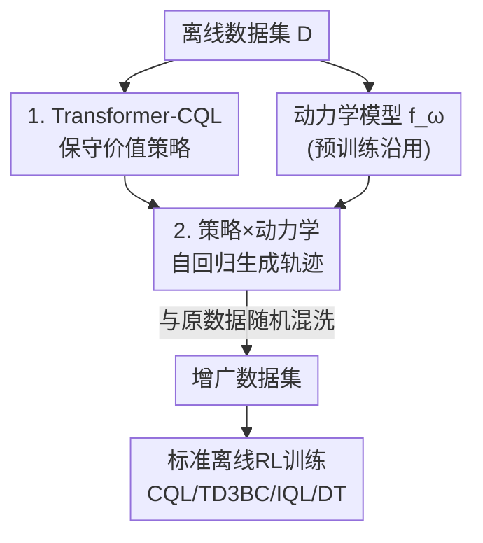

# Trajectory Generation with Conservative Value Guidance for Offline Reinforcement Learning

**会议**: ICLR 2026  
**OpenReview**: [https://openreview.net/forum?id=eTThjhjzwZ](https://openreview.net/forum?id=eTThjhjzwZ)  
**代码**: https://github.com/wangtieru2/TGCVG  
**领域**: 离线强化学习 / 数据增强 / 轨迹生成  
**关键词**: 离线RL, 数据增强, 保守Q学习, Transformer策略, 动力学模型

## 一句话总结
用一个 Transformer + 保守 Q 学习（CQL）训练的策略去和预训练动力学模型交互、自回归地"采"出一批合成轨迹，再把它们并进原数据集训练标准离线 RL 算法；保守价值惩罚保证生成样本不跑出数据分布，因此既比基于扩散的数据增强（GTA）更高质量，又把训练和生成时间砍掉一大截。

## 研究背景与动机
**领域现状**：离线 RL 只能从一份固定数据集里学策略，不能再和环境交互。近年的高分方法越堆越复杂——上 Diffusion、Decision Transformer 这类强生成架构，benchmark 分数好看，但推理成本高、难落地。于是另一条路线兴起：**数据增强**，把算力从"在线决策"搬到"离线数据准备"，先把数据集扩充好，再用简单的离线 RL 算法（CQL/TD3BC/IQL）去训。

**现有痛点**：早期数据增强只是给状态加噪声（S4RL），多样性受限；近期主流改用 Diffusion 来合成"动力学一致"的转移（SynthER、GTA）。但 Diffusion 有两个硬伤：训练贵、生成时要多步去噪极慢；而且它通常**缺乏朝高价值区域的显式引导**，合成数据质量提升有限，下游策略只能小涨。

**核心矛盾**：要让合成轨迹"既高质量又贴近原分布"，这两个目标本身存在张力——一味追高回报会把样本推到数据集没覆盖的区域（OOD），造成分布漂移和外推误差，反而毒害下游训练；而过度保守又生成不出有用的新数据。Diffusion 的回报放大引导（GTA）偏向前者，容易越界。

**本文目标**：① 找一个比 Diffusion 更轻量的序列生成器；② 给生成过程加上"既往高价值、又别出分布"的显式约束。

**切入角度**：作者注意到，离线数据本来就是"在线策略和环境交互采出来的"。那不如**模仿这个采集过程**：用一个学好的策略去和一个学好的动力学模型交互，一步步 rollout 出 $(s,a,r,s')$。关键在于策略本身要"保守"——CQL 的价值惩罚天然会压低 OOD 动作的 Q 值，正好可以把每一步动作约束在数据分布内。

**核心 idea**：用 **Transformer-CQL 策略 + 动力学模型的自回归交互** 代替 Diffusion 来合成轨迹，并用 **保守价值引导（CQL 惩罚）** 把每一步的 OOD 风险限制在单步、阻止其沿 rollout 累积。

## 方法详解

### 整体框架
TGCVG 分两个阶段。**第一阶段（训模型）**：并行地训练两个部件——一个 Transformer-CQL 策略网络（负责生成高质量动作）和一个动力学模型 $f_\omega$（直接沿用 model-based RL 里 Lin et al. 2024 的预训练动力学模型，负责预测奖励和下一状态）。**第二阶段（生轨迹）**：让策略和动力学模型交互，模仿在线采集过程——策略给当前状态序列输出动作，动力学模型预测下一状态和奖励，把新状态拼回序列，自回归地滚出整条轨迹。最后把生成轨迹和原数据随机混洗成增广数据集，喂给任意标准离线 RL 算法（CQL/TD3BC/IQL/DT）训练。

整条流水线清晰、单向，画成框架图：

> 第 3 个关键设计（为什么选 CQL 而非 TD3BC）是对节点「1」内部"保守"二字的论证，不单独占框架节点。

### 关键设计

**1. Transformer-CQL：把保守价值引导塞进序列策略**

要让生成的动作"高于数据集平均水平、又不出分布"，作者不直接拿 Diffusion，而是训一个 Transformer 当动作合成器，并把 CQL 的保守价值估计嵌进去。和 Decision Transformer 不同，这里**只保留状态 token**：根据 DD 和附录消融，作者去掉了 action token 和 return-to-go(RTG) token——因为一旦用 Q 值正则，RTG 就变得多余。轨迹表示简化为 $\tau_t=(s_{t-L+1},\cdots,s_{t-1},s_t)$。

价值侧用五网络组合（两个 Q 网络 $Q_{\phi_1},Q_{\phi_2}$、两个 target 网络、一个策略 $\pi_\theta$），Q 网络的训练目标里第一项就是 CQL 的保守惩罚——压低 OOD 状态-动作对的 Q 值、保留分布内样本的值：

$$\min_\phi \lambda\,\mathbb{E}_{s_i\sim D,a_i\sim\mu}\Big[\log\textstyle\sum_{a_i}\exp(Q_{\phi_i}(s_i,a_i))-\mathbb{E}_{a_i\sim\hat\pi_\beta}[Q_{\phi_i}(s_i,a_i)]\Big]+\tfrac12\,\mathbb{E}\big[(\hat Q_m-Q_{\phi_i})^2\big]$$

其中 TD target 用 **n-step Bellman backup** $\hat Q_m=\sum_{j=m}^{t}\gamma^{j-m}r_j+\gamma^{t+1-m}\min_{i}Q_{\phi'_i}(s_{t+1},\hat a_{t+1})$，比 1-step 更准（沿用 Hu et al. 2024）。策略侧用 SAC 框架的目标 $L(\theta)=\mathbb{E}[\alpha\log\pi_\theta(\hat a_i|s_i)-\min_i Q_{\phi_i}(s_i,\hat a_i)]$，温度 $\alpha$ 自动调，兼顾改进与探索。这样训出的策略既会挑高 Q 动作（往高回报走），又因为 CQL 惩罚而不敢挑 OOD 动作（不出分布），把"高质量"和"贴近分布"这对矛盾在策略层面就调和了。

**2. 策略与动力学模型自回归交互、滚出整条轨迹**

有了保守策略，生成阶段就纯粹模仿在线采集。先从原数据集采一段长度 $K$ 的状态序列 $\tilde\tau=(s_{t-K+1},\cdots,s_t)$ 当种子，取前 $L$ 个状态喂进策略得到动作 $\hat a_{t-K+L}$，再交给动力学模型一步预测：

$$\hat s_{t-K+L+1},\,\hat r_{t-K+L}=f_\omega(s_{t-K+L},\hat a_{t-K+L})$$

把预测出的新状态 $\hat s$ 追加进序列、滑动窗口，再次喂策略——如此自回归循环，直到拼出完整生成轨迹 $\hat\tau$（含状态/动作/奖励三行）。终止标志等辅助信息直接继承原序列对应时间步，保留原始 episode 终止信号。

这一步的价值在于把 OOD 风险"切片化"：因为每次只让策略走一步、马上由保守策略约束，**单次交互的 OOD 风险只限于这一步，不会沿 rollout 累积放大**——这正是 model-based 方法常吃亏的"复合误差(compounding error)"被规避的地方。同时，用 Transformer 自回归代替 Diffusion 的多步去噪，生成快得多。

**3. 价值惩罚 vs 策略约束：为什么是 Transformer-CQL 而不是 Transformer-TD3BC**

"保守"有两种实现路线，作者专门论证了为什么必须选 CQL 这一路。一是 **价值惩罚**（CQL，本文采用）：直接压 OOD 动作的 Q 值；二是 **策略约束**（TD3BC，作为对照的 Transformer-TD3BC）：靠行为克隆把策略拉向行为策略。实验发现，Transformer-CQL 生成的数据无论拿去训 CQL 还是 TD3BC 都稳；而 Transformer-TD3BC 生成的数据训 TD3BC 还行，**训 CQL 却直接崩溃**。

t-SNE 可视化给出了根因：TD3BC 对 Q 值约束更弱，会生成一簇簇落在原分布支撑外的离群点；到了下游 CQL 训练时，由于 CQL 的保守性，这些**密集的离群簇反被当成分布内数据**，而原本稀疏的真实样本反被当成 OOD 罚掉，价值估计彻底错位、性能崩盘。CQL 的价值惩罚则把生成样本牢牢锁在原分布内，不会制造这种"假高密度"陷阱。这条分析把"为什么保守价值引导要用价值惩罚式"讲透了，也是 TGCVG 区别于一般 model-based 增强的核心。

### 损失函数 / 训练策略
Q 网络按式 (2) 优化（CQL 保守惩罚 + n-step Bellman 回归）；策略按式 (3) 的 SAC 目标优化，温度 $\alpha$ 自适应、目标熵 $H_{target}$ 由动作空间预设；target 网络软更新 $\phi'_i=\rho\phi'_i+(1-\rho)\phi_i$。动力学模型与策略**并行训练**，是生成阶段提速的关键之一。

## 实验关键数据

### 主实验
D4RL 上对比 S4RL（加噪）、SynthER（Diffusion）、GTA（回报引导 Diffusion）三种数据增强基线，归一化分数（5 seeds 平均）。

**MuJoCo Gym 域（9 任务平均）**：

| 离线算法 | None | GTA(扩散SOTA) | TGCVG | 增益 |
|---------|------|--------------|-------|------|
| TD3BC | 76.92 | 84.63 | **89.30** | +4.67 vs GTA |
| CQL | 78.55 | 85.27 | **90.50** | +5.23 vs GTA |
| IQL | 78.52 | 86.11 | **87.09** | +0.98 vs GTA |
| DT | 74.47 | 75.36 | **78.09** | +2.73 vs GTA |

在 suboptimal 数据集（medium、medium-replay）上提升最显著——这正是最需要"轨迹缝合(stitching)"的场景，印证 Transformer-CQL 在不完美数据下的优势。

**Maze2D + AntMaze 域（IQL，9 任务平均）**：

| Aug. | 平均分 |
|------|-------|
| None | 52.04 |
| GTA | 59.17 |
| **TGCVG** | **64.97** |

稀疏奖励、高维状态的 AntMaze 上 TGCVG 仍让 model-free 算法有竞争力，作者据此认为"把重心放在策略学习上，可能比单纯打磨动力学模型更划算"。

### 消融实验

| 配置 | hopper-m | walker2d-m | halfcheetah-m | 说明 |
|------|----------|-----------|---------------|------|
| 动作合成器=原 CQL(MLP) | 60.66 | 84.98 | 48.43 | MLP 策略 |
| 动作合成器=Transformer-CQL | **90.47** | **87.50** | **68.14** | 换 Transformer 大涨 |

（均以 TD3BC 训练增广数据后的分数计）。另有 Transformer-CQL vs Transformer-TD3BC、λ 敏感性、数据质量（novelty/optimality/dynamic MSE）、时间开销四组分析。

### 关键发现
- **Transformer backbone 是涨点主力**：换成 Transformer-CQL，hopper-medium 从 60.66 飙到 90.47，归功于 Transformer 更强的表征能力。
- **价值惩罚式保守不可替换**：Transformer-TD3BC 生成的数据训 CQL 会崩，因为离群簇被 CQL 误判为分布内（见关键设计 3）。
- **λ 越小（保守度越低）下游往往越好**，但影响因任务而异（walker-medium 几乎不敏感，hopper-medium 很敏感）；λ 的作用是通过影响 Transformer-CQL 的决策能力间接决定合成数据质量——**早期把策略训强，生成数据质量更高**。
- **动态一致性 > 回报幅度**：相比 GTA，TGCVG 的 dynamic MSE 更好（合成态更贴真实动力学），即便 optimality 略低，整体数据质量仍最佳；且 novelty 不为零，说明生成样本不是原样本的复制。
- **时间大幅下降**：halfcheetah-medium-v2、$2\times10^5$ 步、$5\times10^6$ 个合成样本、单卡 RTX TITAN 下，TGCVG 因动力学/策略可并行训练、且生成阶段无多步去噪，训练与生成时间都远低于 GTA。

## 亮点与洞察
- **"模仿数据采集"这个视角很顺**：把数据增强重新理解成"用学好的策略 + 动力学模型重走一遍在线采集流程"，比起 Diffusion"凭空建模转移分布"更直觉，也更容易加价值引导。
- **保守性一物两用**：CQL 的保守惩罚既是训练策略的标准手段，又恰好充当了"生成时别出分布"的护栏——一个机制同时服务两个目的，省掉了 Diffusion 那种额外的引导设计。
- **单步 OOD 切片**：每次只走一步、立即被保守策略约束，把 model-based rollout 的复合误差压成单步误差，这个思路可迁移到任何"策略×模型自回归生成"的合成数据场景。
- **价值惩罚 vs 策略约束的崩溃分析**：t-SNE 揭示"离群簇被下游 CQL 误当分布内"的失效机制，是少见的把"增强器选型"讲到数据分布层面的分析，对做数据增强的人很有警示价值。

## 局限与展望
- **依赖现成的动力学模型**：直接沿用 Lin et al. 2024 的预训练动力学模型，动力学模型本身的质量上限没在本文内解决；高维/复杂动力学下模型误差仍可能传导。
- **λ 需按任务调**：λ 敏感性因数据集而异，缺乏自动选取机制，部署时仍要调参。
- **DT 作为下游时增益偏小**（75.36→78.09），AntMaze-umaze 上 TGCVG 反而不如 GTA（41.20 vs 66.50），说明在某些稀疏/特定结构任务上保守约束可能过紧。
- **生成质量上限受策略能力封顶**：作者自己指出"合成数据质量高度依赖动作合成器的决策能力"，意味着策略训不好时增强收益有限。

## 相关工作与启发
- **vs GTA（扩散 + 回报放大引导）**：GTA 用 Diffusion 的部分加噪-去噪 + 放大回报信号生成高回报轨迹，强但贵、且回报引导易把样本推出分布；本文用轻量 Transformer 自回归替代 Diffusion，用 CQL 价值惩罚替代回报放大，在保高回报的同时把样本锁在分布内，速度与动态一致性都更优。
- **vs SynthER（Diffusion 学转移分布）**：SynthER 无显式高价值引导，提升有限；TGCVG 显式朝高 Q 区域走又不越界。
- **vs S4RL（状态加噪）**：S4RL 多样性受扰动范围限制，novelty≈0；TGCVG 靠策略×模型交互获得真正的新状态-动作对。
- **vs model-based 离线 RL（MOPO/Lin et al. 等）**：传统 model-based 把数据生成与策略学习耦合、易吃复合误差；TGCVG 解耦生成与学习，合成数据可被任意 model-free 算法复用，泛化与可扩展性更好。

## 评分
- 新颖性: ⭐⭐⭐⭐ 用 Transformer-CQL 替 Diffusion 做轨迹级增强、并把 CQL 保守性当生成护栏，组合清晰但部件多为已有
- 实验充分度: ⭐⭐⭐⭐ 三大任务域 × 四种下游算法 + 数据质量/时间/λ 多维消融，CQL-vs-TD3BC 的崩溃分析尤其扎实
- 写作质量: ⭐⭐⭐⭐ 动机—方法—失效分析逻辑顺，框架两阶段交代清楚
- 价值: ⭐⭐⭐⭐ 既提性能又大幅省时，对"低成本部署离线 RL"有实用意义

<!-- RELATED:START -->

## 相关论文

- [\[ICLR 2026\] Peng's Q($\lambda$) for Conservative Value Estimation in Offline Reinforcement Learning](pengs_qlambda_for_conservative_value_estimation_in_offline_reinforcement_learnin.md)
- [\[ICLR 2026\] Offline Reinforcement Learning with Adaptive Feature Fusion](offline_reinforcement_learning_with_adaptive_feature_fusion.md)
- [\[ICLR 2026\] Toward Conservative Planning from Human-AI Preferences in Reinforcement Learning](toward_conservative_planning_from_human-ai_preferences_in_reinforcement_learning.md)
- [\[ICML 2026\] Counterfactual Transport Flows for Offline Conservative Trajectory Refinement](../../ICML2026/reinforcement_learning/counterfactual_transport_flows_for_offline_conservative_trajectory_refinement.md)
- [\[ICLR 2026\] MAGE: Multi-scale Autoregressive Generation for Offline Reinforcement Learning](mage_multi-scale_autoregressive_generation_for_offline_reinforcement_learning.md)

<!-- RELATED:END -->
