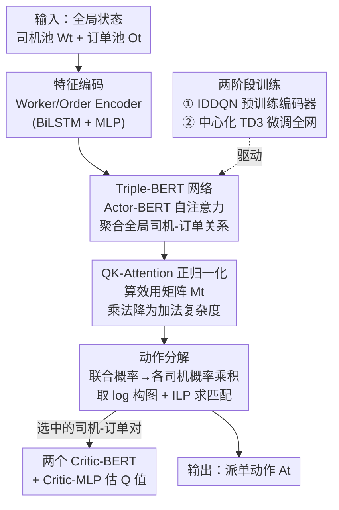

# Triple-BERT：在网约车派单上我们真的需要 MARL 吗？

**会议**: ICLR 2026  
**OpenReview**: [https://openreview.net/forum?id=symgW6FhA6](https://openreview.net/forum?id=symgW6FhA6)  
**代码**: https://github.com/RS2002/Triple-BERT (有)  
**领域**: 强化学习  
**关键词**: 网约车派单, 单智能体强化学习, 动作分解, BERT, TD3

## 一句话总结
针对网约车实时派单这一"本质上是中心化、却长期被当成多智能体问题硬解"的任务，本文用一个中心化的单智能体强化学习框架 Triple-BERT（变体 TD3 + 动作分解 + BERT 网络 + 两阶段训练）取代主流 MARL，在曼哈顿真实打车数据上比当前最优方法整体提升约 11.95%，服务订单数 +4.26%、接驾时间 -22.25%。

## 研究背景与动机
**领域现状**：Uber、Lyft 这类按需网约车平台每个时间步都要把一批起点/终点各异的乘客订单，捆绑（拼车）并匹配给可用司机。由于司机数和订单数都很大，观测空间和动作空间都极其庞大，主流做法几乎都用多智能体强化学习（MARL）：把整个派单问题拆成"每个司机一个 agent"的小子问题来解。

**现有痛点**：MARL 这条路有两种典型形态，各有硬伤。独立式 MARL（如 Independent Double DQN、Independent SAC）计算便宜，但每个 agent 只看自己、抓不到全局信息，司机之间协作很差；引入 GNN 让 agent 看邻居只能部分缓解。集中训练分散执行（CTDE，如 QMIX、CoPO）想兼顾全局，却在上千个 agent 的大规模场景里被"维度灾难"（Curse of Dimensionality）压垮，收敛慢、效果差。

**核心矛盾**：派单"本质上是一个中心化任务"——平台手里握着所有司机和订单的全局信息，最优解需要全局协调。但因为观测/动作空间太大，研究者被迫把它拆成多智能体来回避复杂度，结果反而丢掉了全局协调能力。换句话说，是"为了对付大空间而被迫多智能体化"，而不是问题本身需要多智能体。

**本文目标**：直接用一个中心化的单智能体（SARL）来做派单，让模型充分利用全局信息提升司机间协作；同时还要解决随之而来的三个工程障碍——动作空间巨大（1000 司机 × 10 订单可达约 $10^{30}$）、观测空间随司机/订单数增长而爆炸、以及 SARL 特有的样本稀缺（多个司机的记录被合并成单一训练流，样本骤减）。

**切入角度**：既然派单本质中心化，那就别绕弯子。作者从一个关键观察出发：巨大的"联合动作"概率可以结构性地分解成"每个司机各自选哪个订单"的独立概率乘积，再用整数线性规划（ILP）求全局最优匹配——这样既保留了中心化全局视角，又把不可枚举的动作空间变得可计算。

**核心 idea**：用"中心化 SARL + 动作分解"代替 MARL 来做全局派单，配一个参数复用的 BERT 网络吃下大观测空间，并用 MARL 预训练来给 SARL 暖启动、补足样本。论文标题自问自答："我们真的需要 MARL 吗？——不需要（推理/决策阶段），但还需要（用它做预训练打底）。"

## 方法详解

### 整体框架
Triple-BERT 是一个中心化 actor-critic 框架，底座是变体 TD3。每个时间步，平台把全部司机状态 $W_t$ 和订单状态 $O_t$ 作为整体输入。先用 Worker Encoder / Order Encoder 把每个司机、每个订单各自编码到同一特征空间（司机的在途订单序列用双向 LSTM 编、其余信息用 MLP），拼成一条序列喂给 **Actor-BERT**：靠双向自注意力一次性聚合所有司机和订单之间的全局关系，再经 **QK-Attention** 算出"每个司机选每个订单"的效用矩阵 $M_t \in \mathbb{R}^{n \times m_t}$。基于这个矩阵，**动作分解**把联合策略写成各司机选择概率的乘积，推理时取 log 后构图、用 ILP 求最大化全局匹配的动作。被选中的司机-订单对特征再送入两个 **Critic-BERT**（TD3 需要双 critic）算 Q 值。整套网络靠**两阶段训练**：先用 IDDQN 这种简单 MARL 把编码器预训练好，再整体用中心化 TD3 微调。

"Triple"指的就是这一个 Actor-BERT + 两个 Critic-BERT 的三 BERT 结构。下图给出从状态到动作再到价值评估的完整数据流：

### 关键设计

**1. 动作分解：把不可枚举的联合动作拆成每司机的独立选择概率**

派单最棘手的地方是动作空间——它既随订单数 $m_t$ 动态变化（无法用固定维度的动作概率向量表示），又大到约 $10^{30}$ 量级无法枚举采样，而且司机之间存在依赖（同一订单不能派给两个司机），不能简单当独立个体各自采样。本文的解法是给策略函数强加结构假设：定义 $P_{i,j,t}$ 为司机 $i$ 在 $t$ 时刻选订单 $j$ 的概率（基于 logit 模型，由效用矩阵过 Softmax 得到，并额外拼一列"不接单"效用 $N_t$），再假设联合策略正比于这些概率的乘积：$\pi^{T}_{\Theta}(A_t|S_t) = z\!\left(\prod_{i,j \in h(A_t)} P_{i,j,t}\right)$，其中 $z(\cdot)$ 是一个递增函数、$h(A_t)$ 是动作里被置 1 的司机-订单对集合。

这个乘积结构带来一个关键便利：因为 $z(\cdot)$ 和 $\log(\cdot)$ 都单调递增，求最优动作等价于最大化 $\sum_{i,j} \log P_{i,j,t}$。于是可以把每个可用司机和订单建成二部图、边权设为 $\log P_{i,j,t}$，再用 ILP 解最大权二部匹配即可拿到全局最优派单（不可用司机的效用置 $-\infty$ 即排除）。训练时则往概率矩阵注入随机噪声、同法选动作——噪声大策略趋于随机、噪声为零趋于贪心，从而完成探索。这样既保留了中心化全局协调，又把天文数字的动作空间压成一个可求解的匹配问题。注意作者明说概率 $P$ "在现实中并不存在、只是人为构造的虚拟量"，用它把网络输出 $M_t$ 和策略连接起来，本质是把策略空间限制到一个更易优化的小类。

**2. Triple-BERT 网络：用参数复用的自注意力吃下随规模膨胀的观测空间**

观测空间会随司机/订单数增长而爆炸，传统 MLP 编码器参数量跟着输入长度涨，撑不住。本文设计了一个以 BERT 为核心的网络：司机和订单各自编码后拼成一条序列，送进 Actor-BERT 做双向自注意力。BERT 的参数复用机制让参数量不随司机/订单数增加，而自注意力能同时捕捉司机间、订单间、以及司机-订单间的复杂关系——这正好补上了传统派单"逐对评估、忽略订单之间关系"的盲区。由于输入序列具有置换不变性（司机/订单的排列顺序不应影响结果），BERT 里特意去掉了位置编码。

与 MARL 里"每个 agent 只编码自己加邻居状态"不同，Actor-BERT 直接聚合全局司机信息，因此能做出更有效的协作派单。Critic 端则把"被选中的司机-订单对"组成新序列 $\dot{S}_t$，再过两个独立的 Critic-BERT + Critic-MLP 输出两个 Q 值（TD3 的双 critic 取 min 抑制高估）。这一个 Actor-BERT 加两个 Critic-BERT 就是"Triple"的由来，三者共享 Actor-BERT 抽出的特征但各自处理。

**3. QK-Attention 正归一化：把逐对评估的乘法复杂度降为加法、并修掉参数冗余**

逐个评估司机-订单对 $F(w_{i,t}, o_{j,t})$ 复杂度是 $O(|F| \cdot n \cdot m_t)$，太贵。本文借鉴 LoRA"用两个小网络逼近一个大网络"的思路，引入 QK-Attention：$\text{QK-Attention}(w_{i,t}, o_{j,t}) := f(w_{i,t}) \cdot g(o_{j,t})^{T} \approx F(w_{i,t}, o_{j,t})$。司机侧 $f$ 和订单侧 $g$ 各算一次再做内积，复杂度降到 $O(|f|\cdot n + |g|\cdot m_t + d\cdot n\cdot m_t)$，由于输出维度 $d$ 很小，整体从"乘法复杂度"成功变成"加法复杂度"。

但式 (2) 存在参数冗余：因为 $f' = \alpha f,\ g' = g/\alpha$ 对任意非零向量 $\alpha$ 都是合法解，存在无穷多组解，训练时会不稳。受 Dueling DQN 启发，本文加了一个正归一化：$\text{QK-Attention-Norm}(w_{i,t}, o_{j,t}) := f(w_{i,t}) \cdot \dfrac{\text{Softplus}(g(o_{j,t}))^{T}}{\lVert \text{Softplus}(g(o_{j,t}))\rVert_2}$。Softplus 保证订单侧向量元素恒非负、再做 L2 归一化使其范数为 1。虽然这不能保证唯一解，但实验证明它显著提升了训练稳定性——消融里去掉这个归一化，模型表现甚至差于所有对比方法，正是参数冗余导致剧烈波动、学不动。

**4. 两阶段训练：先用 MARL 预训练暖启动，再中心化 TD3 微调，补足 SARL 的样本稀缺**

SARL 相比 MARL 有个独有难题：多个司机的记录被合并成单一训练流，样本量骤减，直接练会因样本不足而不收敛。本文用两阶段缓解。**第一阶段**把派单当多智能体场景、采用"所有 agent 共享同一策略"的独立假设，于是不同司机的记录可以互相共享、撑出一个很大的经验回放池；再用最简单高效的 IDDQN 预训练上游的 Worker/Order Encoder，让它们学到通用的特征提取能力（同样用 QK-Attention-Norm 算每个司机-订单对的 Q 值，ILP 求最大全局 Q）。作者坦承独立假设并不可靠、这也正是独立 MARL 表现不好的根因，但它简单有效，足以给中心化 SARL 提供一个好的起点。**第二阶段**再用中心化 TD3 微调整个网络（actor 与 critic 共享架构、第一阶段参数 $\Phi$ 是其一部分），此时彻底不再依赖独立假设，转而靠全局信息实现司机间真正的协作。消融显示：没有第一阶段预训练，模型不收敛、后期奖励还会因样本不足而下滑。

### 损失函数 / 训练策略
第二阶段是变体 TD3。Actor 优化的难点在于动作空间可变、且动作概率与最终选中动作之间存在不可微的间隙（梯度传不过去），因此采用近似策略梯度：$\nabla_{\Theta} J(\Theta) \propto \mathbb{E}\big[(Q^{TD3}(S_t, A_t) - B)\,\nabla_{\Theta} \sum_{i,j \in h(A_t)} \log P_{i,j,t}\big]$，基线 $B$ 简化取 0，actor 损失即 $L_A = -\nabla J(\Theta)$。Critic 端沿用 TD3：$L_C = \sum_{i=1,2}\mathbb{E}\big[Q^{TD3}_{\Theta^-}(S_{t+1}, R_{t+1}) - Q^{TD3}_{\Theta,i}(S_t, A_t)\big]$，目标 $Q^{TD3}_{\Theta^-}(S_{t+1}) = R_{t+1} + \gamma\,\min_{i=1,2} Q^{TD3}_{\Theta^-,i}(S_{t+1}, \text{Actor}(S_{t+1}))$，用慢更新的目标网络 $\Theta^-$ 和概率矩阵上的小噪声 $\xi$ 提供稳定目标。奖励函数按司机分解、全局奖励为各司机之和，综合考虑平台收入 $p^{in}$、司机报酬 $p^{out}$、超时订单数 $\chi$ 与额外行驶时间 $\rho$。

## 实验关键数据

数据集为纽约曼哈顿真实黄色出租车打车记录（训练），并用 2024-07-18 全天 FHV（High Volume For-Hire Vehicle）数据做跨分布泛化测试。对比 5 类 MARL 方法，覆盖独立式 / CTDE / 中心化三种范式。

### 主实验

| 方法 | 类型 | 网络骨干 | 模型大小 | 平均奖励 ($10^3$) |
|------|------|---------|---------|------|
| DeepPool | 独立 MARL | MLP | 20K | 12.72 |
| BMG-Q | 独立 MARL | GAT | 117K | 13.04 |
| HIVES | CTDE (QMIX) | GRU | 16M | 12.37 |
| Enders et al. | 独立 MARL (MASAC) | MLP+Attention | 118K | 12.04 |
| CEVD | 中心化 (VD2) | MLP | 23K | 13.16 |
| **Triple-BERT** | **中心化 SARL** | **BERT** | 16M | **14.73** |

相比最强对比方法 CEVD（13.16），Triple-BERT 平均奖励 14.73，整体提升约 **11.95%**；训练曲线上累计奖励超过次优方法约 15%。服务订单数 +4.26%、接驾时间 -22.25%。

FHV 跨分布泛化（每集 30 分钟、订单量 734–5989 波动）：

| 方法 | 奖励 | 服务率 | 接驾时间 | 确认时间 |
|------|------|-------|---------|---------|
| CEVD | 12556.74 | 0.80 | 8.02 | 0.09 |
| **Triple-BERT** | **14329.74** | **0.88** | **7.02** | 0.34 |

Triple-BERT 主要靠优化接驾时间把服务率从 0.80 提到 0.88，代价是更多拼车带来的略高送达/绕路时间。它在高订单量场景优势尤为明显（低订单量时各方法都能服务完、差别不大），因此奖励标准差也更大。

### 消融实验

| 配置 | 现象 | 说明 |
|------|------|------|
| Full model | 稳定收敛、最优 | 完整 Triple-BERT |
| w/o 第一阶段预训练 | 不收敛、后期奖励下滑 | 样本稀缺导致剧烈波动 |
| w/o QK-Attention 正归一化 | 差于所有对比方法 | 参数冗余引发不稳定 |

### 关键发现
- **第一阶段 MARL 预训练不可省**：去掉后样本不足、模型不收敛且后期奖励反降——这也回答了标题："决策阶段不需要 MARL，但预训练阶段仍然需要它打底"。
- **正归一化是 QK-Attention 能用的前提**：去掉它会因 $f' = \alpha f,\ g' = g/\alpha$ 的解不唯一造成参数冗余，训练剧烈波动，效果直接垫底。
- **中心化全局视角换来真协作**：在高订单量、需要司机协同拼车的拥挤场景，Triple-BERT 才显出对 MARL 的显著优势。

## 亮点与洞察
- **"派单本质中心化、却被习惯性多智能体化"这一反思很到位**：本文没有在 MARL 框架内继续打补丁，而是退回问题本质，用 SARL 直接吃全局信息——这是把研究惯性识别出来并掀翻的典型范例。
- **动作分解 + ILP 是核心巧思**：把 $10^{30}$ 的联合动作通过"概率乘积 → 取 log → 最大权二部匹配"压成一个可解的 ILP，既绕开了不可枚举的采样、又天然处理了"一单不能派两人"的约束，可迁移到任何"大规模一对一/多对一分配"的 RL 任务（如外卖调度、云资源分配）。
- **QK-Attention 把乘法降为加法**：用 LoRA 式双小网络逼近大网络，让逐对评估从 $O(n m_t)$ 的乘法复杂度降到加法复杂度，是处理"海量配对评估"的通用提速技巧；而 Dueling-DQN 式正归一化修复解不唯一，是一个值得记住的稳定化小手段。
- **用简单 MARL 给复杂 SARL 暖启动**：把"难训的中心化大模型"拆成"先用便宜的 IDDQN 喂大量共享样本练编码器、再中心化微调"，是缓解 SARL 样本稀缺的实用范式。

## 局限与展望
- **对单点故障更敏感**（作者承认）：因为决策依赖所有司机和订单的全局信息，某个司机/订单信息异常会比分散式 MARL 更容易拖累整体——这是中心化范式的固有代价，作者把鲁棒化留作未来工作。
- **仍依赖 MARL 预训练**：标题的"不需要 MARL"只对决策阶段成立，整套方法离不开第一阶段的 IDDQN 暖启动，并未真正摆脱 MARL；作者提出未来可用离线训练替换预训练阶段。
- **联合策略的乘积假设是人为构造**：$P$ 被作者明确说成"现实中不存在的虚拟量"，乘积形式只是为便于优化而施加的结构限制，是否会限制可表达的最优策略类、损失多少最优性，论文未深入量化。
- **模型偏大、评测单城**：16M 参数与最大的 HIVES 持平，且实验集中在曼哈顿一地，跨城市/跨平台的泛化仍待验证；作者也提到可探索 off-policy 策略梯度里的重要性采样进一步改进。

## 相关工作与启发
- **vs 独立式 MARL（DeepPool / BMG-Q / Enders et al.）**：它们让每个司机独立决策、抓不到全局，靠 GNN 看邻居也只是局部缓解；Triple-BERT 用 Actor-BERT 直接聚合全局司机-订单关系，协作更强、服务订单更多。
- **vs CTDE / 中心化 MARL（HIVES-QMIX / CEVD-VD2）**：CTDE 在上千 agent 时受困于维度灾难、收敛慢；中心化值分解 CEVD 是最强 baseline 但仍被 Triple-BERT 全面超越（奖励 14.73 vs 13.16）。本文用 SARL + 动作分解换掉值分解，绕开了 agent 数膨胀带来的复杂度。
- **vs 传统逐对评估派单**：传统做法逐个评估司机-订单对、忽略订单之间的关系；本文用 BERT 自注意力同时建模司机间/订单间/跨类关系，并用 QK-Attention 把逐对评估的复杂度降下来。

## 评分
- 新颖性: ⭐⭐⭐⭐⭐ 把长期被 MARL 主导的派单问题重构为中心化 SARL，动作分解 + ILP 的组合是真正的范式切换
- 实验充分度: ⭐⭐⭐⭐ 真实曼哈顿数据 + FHV 跨分布泛化 + 关键消融齐全，但仅单城评测、缺更多规模/城市的压力测试
- 写作质量: ⭐⭐⭐⭐ 标题自问自答抓人、动机链条清晰；公式较密，部分推导压在附录
- 价值: ⭐⭐⭐⭐⭐ 直接服务真实网约车派单，动作分解 + QK-Attention 提速思路可迁移到广义大规模分配类 RL

<!-- RELATED:START -->

## 相关论文

- [\[ICLR 2026\] Who Matters Matters: Agent-Specific Conservative Offline MARL](who_matters_matters_agent-specific_conservative_offline_marl.md)
- [\[AAAI 2026\] Partial Action Replacement: Tackling Distribution Shift in Offline MARL](../../AAAI2026/reinforcement_learning/partial_action_replacement_tackling_distribution_shift_in_offline_marl.md)
- [\[NeurIPS 2025\] Oryx: a Scalable Sequence Model for Many-Agent Coordination in Offline MARL](../../NeurIPS2025/reinforcement_learning/oryx_a_scalable_sequence_model_for_many-agent_coordination_in_offline_marl.md)
- [\[ICLR 2026\] Solving General-Utility Markov Decision Processes in the Single-Trial Regime with Online Planning](solving_general-utility_markov_decision_processes_in_the_single-trial_regime_wit.md)
- [\[ICLR 2026\] RLP: Reinforcement as a Pretraining Objective](rlp_reinforcement_as_a_pretraining_objective.md)

<!-- RELATED:END -->
