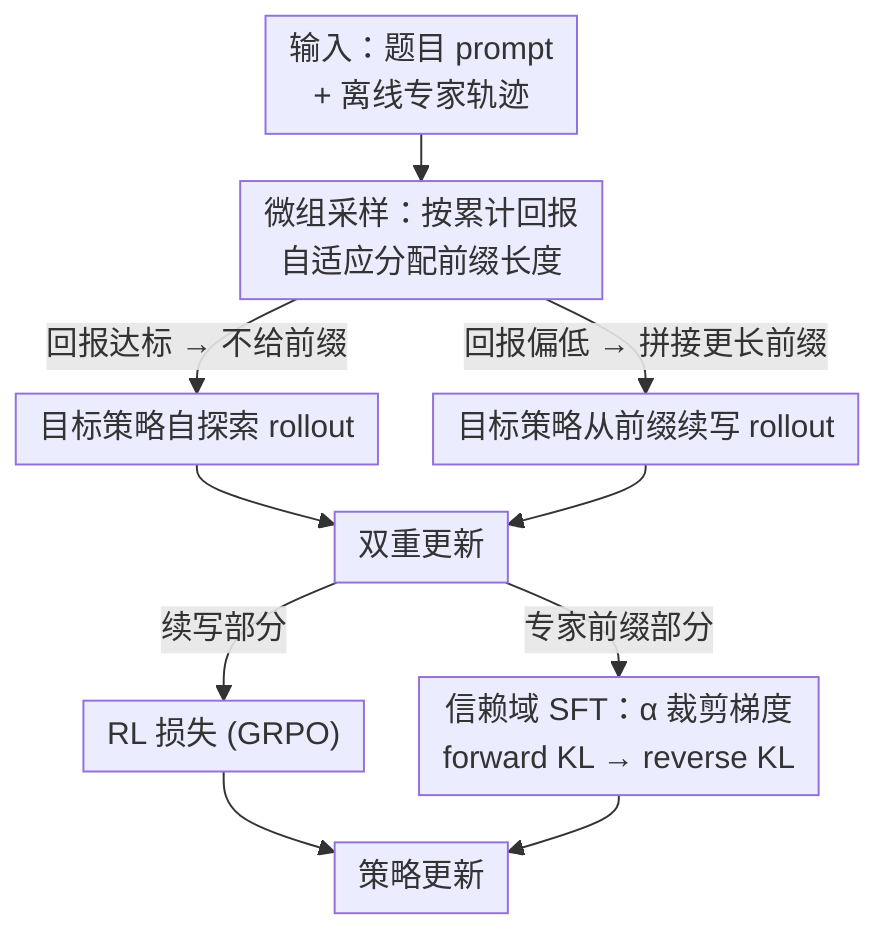

# TRAPO: Trust-Region Adaptive Policy Optimization

**会议**: ICLR 2026  
**OpenReview**: [https://openreview.net/forum?id=oXlSEcxD6N](https://openreview.net/forum?id=oXlSEcxD6N)  
**代码**: https://github.com/Su-my/TRAPO  
**领域**: LLM推理 / 强化学习 / 后训练  
**关键词**: 后训练, SFT-RL 融合, 信赖域, 自适应专家引导, 数学推理

## 一句话总结
TRAPO 把 SFT 和 RL 从「先 SFT 再 RL」的两阶段串行拆开，改为在**每条样本内部**交错进行——专家轨迹的前缀用 SFT 学、模型自己续写的部分用 RL 学，并用一个信赖域版的 SFT（TrSFT）把 forward KL 偷偷掰向 reverse KL 以稳住训练，再用自适应前缀长度按题目难度发放引导，在五个数学推理 benchmark 上平均 56.6 分，超过 SFT、纯 RL 和 SFT-then-RL。

## 研究背景与动机

**领域现状**：当前提升 LLM 复杂推理能力的主流后训练管线是「SFT → RL」两阶段串行：先用精选专家示范做监督微调让模型学会模仿，再用 RL 在试错中打磨推理。代表工作如 DeepSeek-R1、OpenAI-o1 都遵循这个范式。

**现有痛点**：这个串行设计有个根本矛盾。一方面 SFT 把模型锁进死板的模仿模式，压制了 RL 阶段急需的探索能力；另一方面 SFT 容易引发灾难性遗忘，让 RL 无法再调用预训练里积累的知识。更要命的是，SFT loss 降得越低，并不代表对后续 RL 是个越好的起点——过度 SFT 反而会把模型推出适合 RL 的区域，而**当下没有任何信号能即时衡量这一点**。

**核心矛盾**：SFT 的「知识蒸馏收益」和 RL 的「探索能力 + 预训练知识」之间存在 trade-off，而两阶段串行让这个 trade-off 被推到极端：SFT 阶段一旦做完，损害就已固化，RL 无从挽回。

**本文目标**：如何把 SFT 的专家知识蒸馏收益融进 RL，同时**不**牺牲模型的探索力和预训练知识？这要解决两个子问题：(1) 引导内化——怎么有效地从专家前缀里学；(2) 引导选择——每道题该给多长的专家前缀。

**切入角度**：作者做了个观察实验（图 2）——给 Qwen2.5-3B 喂入不同长度的 DeepSeek-R1 前缀，发现前缀越长，模型完成后续推理的准确率越高，且「回溯」「逆向链」等高级推理行为出现得越频繁。这说明专家前缀既能即时引导探索、又能内化推理技能，关键是怎么把它和 RL 在**最细粒度**上结合。

**核心 idea**：在每条样本内部交错 SFT 与 RL——只在专家轨迹的前缀上做 SFT，模型从前缀续写的部分做 RL；再用信赖域改造 SFT 的梯度让它从「模式覆盖」转向「模式寻找」，并按题目难度自适应分配前缀长度。

## 方法详解

### 整体框架

TRAPO 的整体目标是实现一个「边练边学」（learn-while-practicing）的后训练范式：对每道训练题，模型先尝试**无引导**自探索，失败了再逐步获得专家前缀作为上下文，续写完成后做一次「双重更新」——续写部分走标准 RL（GRPO），专家前缀部分走 TrSFT 监督。这样专家示范既当「在上下文里的演示」引导探索，又当「直接监督信号」内化技能，二者在每条轨迹里融在一起。

整条管线由两个核心组件支撑：**微组采样**（Micro-Group Sampling）负责按难度自适应决定给多长前缀，**信赖域 SFT**（TrSFT）负责让前缀监督稳定不破坏 RL。

### 关键设计

**1. 每条样本内交错 SFT 与 RL：把两阶段拆成最细粒度的混合**

针对「两阶段串行让 SFT 的损害无法被 RL 挽回」这个根本痛点，TRAPO 不再让 SFT 整体先行，而是在**每条训练样本**里同时做两件事：取离线专家轨迹的一段前缀 $y_{\le n}$ 做监督学习，让目标策略从前缀末尾续写出 $y_{>n}$ 再做 RL。专家前缀在这里身兼二职——它是放在上下文里的「演示」，把模型引向高回报的解题路径；同时它本身又是「直接监督」，让模型把专家的核心解题技能蒸馏进参数里。

这样做的好处是 SFT 和 RL 不再彼此割裂：监督信号和自探索信号在同一条轨迹、同一次反向传播里融合，模型一边练自己的高概率推理路径、一边内化专家的低概率但有价值的技能。作者特别指出，**朴素地**把标准 SFT loss 和 RL loss 直接相加是灾难性的——实验里这种 naive 组合比纯 RL 还低 18 分以上，这正是后两个设计存在的理由。

**2. 信赖域 SFT（TrSFT）：把 forward KL 偷偷掰成 reverse KL**

naive 组合崩溃的根因藏在标准 SFT 的梯度里。标准 SFT 等价于最小化逐 token 的 forward KL 散度，其梯度为

$$\nabla_\theta L_{\text{SFT}} = -\frac{1}{N}\sum_{i=1}^{N}\sum_{n=1}^{|y_i|} \frac{1}{p_\theta^T(y_{in}|x_i, y_{<n}^i)} \nabla_\theta p_\theta^T(y_n^i|x_i, y_{<n}^i).$$

其中权重项 $\frac{1}{p_\theta^T}$ 在某个 token 来自「离当前策略很远」的专家模式时会变得极大，把策略概率先推进到两个策略都不支持的「空洞区域」（void regions），表现为重复、错误解码等退化输出。标准 SFT 训练足够久能自行修复这种「分布混合」（distribution-blending），但在 TRAPO 里 SFT 与 RL 交错，**任何分配到空洞区域的概率都会立刻引发退化 rollout**，因此必须改造 SFT 目标。

TrSFT 的做法是给梯度权重加一个信赖域下界 $\alpha \in [0,1]$：

$$\nabla_\theta L_{\text{TrSFT}}^\alpha = -\frac{1}{N}\sum_{i=1}^{N}\sum_{n=1}^{|y_i|} \frac{1}{\max\big(p_\theta^T(y_{in}|x_i, y_{<n}^i),\ \alpha\big)} \nabla_\theta p_\theta^T(y_n^i|x_i, y_{<n}^i).$$

在信赖域内（$p_\theta^T \ge \alpha$，即目标策略自己也认可的 token），权重照旧、放手模仿专家；在域外（$p_\theta^T < \alpha$），权重被常数 $1/\alpha$ 钳住，大幅削弱那些「冲向遥远专家模式」的暴力梯度。作者进一步给出 Proposition 1：这个梯度对应的最优解会把专家策略里低概率区域直接剪掉（$p_T^*(c)=0$）、把主模式按 $p_E(c)/\lambda$ 重标定，等价于**把目标从 forward KL 的模式覆盖变成了 reverse KL 式的模式寻找**——只在专家策略明显区别于当前策略时去抓最显著的那个模式，而不盲目铺满整个空间。这正是为 RL 提供稳定起点的关键。

**3. 微组采样：按回报自适应发放专家引导**

「给多长前缀」如果一刀切，要么在简单题上过度引导、扼杀本可独立完成的探索，要么在难题上引导不足、导致 rollout 全失败。微组采样用一种「脚手架」思路解决：每道题按顺序切成 $N$ 个微组，每个微组 $g_i$ 由三个超参刻画——前缀长度比例 $L_i$、回报阈值 $t_i$、采样预算 $n_i$。处理 $g_i$ 时先算前面所有微组的平均回报，若低于 $t_i$ 就给一段长度为 $L_i$ 比例的专家前缀再采 $n_i$ 个续写，否则不给前缀直接采 $n_i$ 个自探索 rollout。

作者设 $0 = L_1 < L_2 < \cdots < L_N = 1$：$L_1=0$ 保证每道题永远从**无引导自探索 RL** 起步，$L_N=1$ 让模型在最难的情况下能拿到完整专家推理路径。递增的 $L_i$ 意味着「只有当短前缀被证明不够时，才发放更长的引导」，从而把专家引导用在刀刃上，在自探索与专家引导之间形成动态平衡。实现上总组大小为 8，切成 $\{4,2,1,1\}$ 四个微组，前缀比例 $(0, 0.2, 0.5, 1.0)$，阈值 $(-1, 0.5, 0.7, 0.9)$，$t_1=-1$ 确保第一个微组永远无引导。

### 损失函数 / 训练策略
RL 部分采用去掉 KL 惩罚的 GRPO（Dr.GRPO 风格），batch size 128，恒定学习率 $5\times10^{-6}$；TrSFT 的信赖域参数 $\alpha=0.1$。基座模型为 Qwen2.5-Math-7B，训练数据为 OpenR1-Math-46k-8192（DeepSeek-R1 生成的已验证推理轨迹），并额外配一条 OpenR1-Math-200k 的轨迹增加引导多样性。注意为公平比较，统计 reward 和生成长度时会排除由专家前缀引导的轨迹。

## 实验关键数据

### 主实验

| 数据集 | 指标 | TRAPO | 之前最优 | 提升 |
|--------|------|-------|----------|------|
| 五数学 benchmark 平均 | avg | **56.6** | 55.5 (LUFFY) | +1.1 |
| vs SFT | avg | 56.6 | 50.3 | +6.3 |
| vs GRPO（纯 RL） | avg | 56.6 | 50.4 | +6.2 |
| vs SFT-then-RL | avg | 56.6 | 54.3 | +2.3 |
| MATH-500 | pass@1 | **89.2** | 88.4 (LUFFY) | +0.8 |
| OlympiadBench | pass@1 | **57.6** | 56.0 (LUFFY) | +1.6 |
| 通用域（ARC-c + MMLU-Pro）平均 | pass@1 | **68.3** | 66.7 (LUFFY) | +1.6 |

TRAPO 在数学推理五项平均 56.6 全面领先，且通用域平均 68.3 也超过所有 baseline——后者尤其说明 TRAPO 在借用外部引导的同时**没把模型困进死板的推理模式**，泛化反而更强（相比之下 SFT、SFT-then-RL 在通用域明显掉点，分别只有 42.3、44.5）。

### 消融实验

| 配置 | 五数学平均 | 说明 |
|------|-----------|------|
| GRPO（基线） | 50.4 | 纯 RL 起点 |
| + 微组采样 | 52.7 | 仅自适应前缀长度，已 +2.3 |
| + 微组采样 + 标准 SFT Loss | **32.3** | naive 组合崩溃，比基线掉 18 分 |
| + 微组采样 + LUFFY Loss | 53.6 | 离线 RL loss，增益有限 |
| + 微组采样 + TrSFT Loss（完整） | **56.6** | 完整模型 |

### 关键发现
- **TrSFT 是稳定融合的命门**：微组采样单独就能给 GRPO 带来 +2.3 的提升（仅靠自适应分配前缀长度增强 reward 密度），但一旦换成标准 SFT loss 直接组合，性能从 50.4 暴跌到 32.3——验证了「naive 相加会因分布混合而崩溃」的假设；只有 TrSFT 才能真正内化专家前缀并涨到 56.6。
- **TRAPO 扩展了模型的解空间，而非只重排已有知识**：pass@k 分析显示，纯 GRPO 在 $k$ 足够大时甚至被基座模型反超，说明标准 RL 只是从已有知识里挑更好的解、并未拓展能力边界；而 TRAPO 和 SFT 类方法都随 $k$ 增大稳定 scaling，且 TRAPO 最优，证明它成功把专家轨迹的外部知识内化进了模型的内在能力。
- **训练动态三优势**：相比 GRPO，TRAPO 全程更高 reward 并收敛到更高水平；早期就快速拉长输出（迅速内化专家的长推理模式，而 GRPO 始终难以产生长解）；策略熵稳定在更高水平，反映它既精炼自己的高概率路径、又对低概率专家引导保持开放。
- **泛化到通用 LLM**：在 Qwen2.5-7B-Instruct 上，TRAPO 平均 45.2 仍高于 Base(39.7)、SFT(33.0)、GRPO(40.6)，说明方法不绑定数学专用基座。

## 亮点与洞察
- **「SFT 是 forward KL、可被信赖域掰向 reverse KL」这个视角很巧**：作者没有发明全新损失，而是从 SFT 梯度里那个 $1/p_\theta^T$ 权重切入，用一个 $\max(\cdot,\alpha)$ 钳位就把模式覆盖的行为变成模式寻找，还配了 Proposition 1 给出剪枝 + 重标定的闭式最优解——理论和工程改动都极小，却直击「空洞区域引发退化」的要害。
- **「先裸考、考砸了再发提示」的脚手架式课程**：微组采样把前缀长度和回报阈值绑定，本质是一个 instance-level 的动态难度调度——简单题省下引导预算去探索，难题逐级加码到完整专家路径，这个思路可迁移到任何「示范 + 自探索」的混合训练场景。
- **最让人「啊哈」的对照**：naive SFT+RL 组合不是「略差」而是直接崩 18 分，这个负面结果反而最有说服力地证明了 TrSFT 的必要性——它告诉你融合 SFT 与 RL 的真正难点不在「要不要融」，而在「怎么融才不互相破坏」。

## 局限与展望
- 实验集中在**数学推理**与少量通用推理 benchmark，对代码生成、多步决策等其他推理域的效果未充分验证。
- 微组采样引入了前缀比例、回报阈值、采样预算等多组超参（$L_i, t_i, n_i$），论文用的是手工设定的固定档位（如 $(0,0.2,0.5,1.0)$），这些档位的最优性和对新任务的迁移成本未深入讨论。
- 方法依赖**高质量离线专家轨迹**（DeepSeek-R1 生成），在没有强专家可蒸馏的场景下，TrSFT 的模式寻找优势可能减弱。
- 信赖域参数 $\alpha=0.1$ 的敏感性虽在附录分析，但正文未给出跨任务的鲁棒区间，实际调参仍需经验。

## 相关工作与启发
- **vs SFT-then-RL（两阶段串行）**：标准管线先 SFT 后 RL，SFT 的损害一旦固化无法挽回；TRAPO 在每条样本内交错二者，+2.3 分证明细粒度融合优于割裂的两阶段。
- **vs LUFFY**：LUFFY 给每组 8 个 rollout 加一条专家轨迹做离线 RL，前缀长度和组结构固定；TRAPO 用微组采样自适应分配前缀，并用 TrSFT 而非离线 RL loss 内化，消融里 TrSFT(56.6) 明显高于 LUFFY loss(53.6)。
- **vs ReLIFT**：ReLIFT 在不同 batch 间交替 SFT 与 RL，仍是 batch 级切换；TRAPO 下沉到 instance 级、token 级前缀粒度，融合更细。
- **vs GRPO/DAPO/Dr.GRPO 等 RL 优化方法**：这些工作改进 RL 目标本身（裁剪、组优势估计），TRAPO 与之正交——它通过自适应注入专家示范来同时提升 reward 密度和推理能力，可叠加在这些 RL 算法之上。

## 评分
- 新颖性: ⭐⭐⭐⭐⭐ 把 SFT 重解为可被信赖域掰向 reverse KL 的对象、并在 instance 内交错 SFT/RL，视角和落地都新颖
- 实验充分度: ⭐⭐⭐⭐ 五数学 + 两通用 benchmark、消融、pass@k、训练动态、跨基座都覆盖，但任务域偏窄
- 写作质量: ⭐⭐⭐⭐⭐ 从痛点到 GMM 训练动态实验再到理论命题层层递进，naive 组合的负面结果用得很有力
- 价值: ⭐⭐⭐⭐⭐ 给 SFT+RL 融合提供了一个稳定、可复现且有理论支撑的新范式，对推理 LLM 后训练有直接借鉴

<!-- RELATED:START -->

## 相关论文

- [\[ICLR 2026\] BAPO: Stabilizing Off-Policy Reinforcement Learning for LLMs via Balanced Policy Optimization with Adaptive Clipping](bapo_stabilizing_off-policy_reinforcement_learning_for_llms_via_balanced_policy_.md)
- [\[ICLR 2026\] Heterogeneous Agent Q-weighted Policy Optimization](heterogeneous_agent_q-weighted_policy_optimization.md)
- [\[ICML 2025\] Embedding Safety into RL: A New Take on Trust Region Methods](../../ICML2025/reinforcement_learning/embedding_safety_into_rl_a_new_take_on_trust_region_methods.md)
- [\[ICLR 2026\] Single-stream Policy Optimization](single-stream_policy_optimization.md)
- [\[ICLR 2026\] Relative Entropy Pathwise Policy Optimization](relative_entropy_pathwise_policy_optimization.md)

<!-- RELATED:END -->
