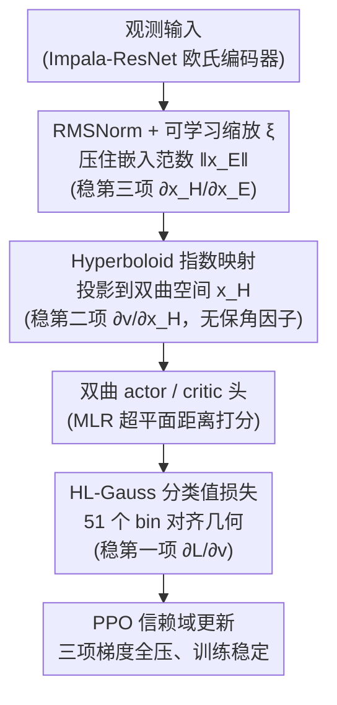

# Understanding and Improving Hyperbolic Deep Reinforcement Learning

**会议**: ICLR 2026  
**arXiv**: [2512.14202](https://arxiv.org/abs/2512.14202)  
**代码**: [GitHub](https://github.com/Probabilistic-and-Interactive-ML/hyper-rl)  
**领域**: 强化学习  
**关键词**: hyperbolic geometry, PPO, gradient analysis, RMSNorm, categorical value loss

## 一句话总结
通过闭式梯度分析揭示双曲深度 RL 中 Poincaré Ball 保角因子爆炸和大范数嵌入导致 PPO 信赖域失效的根源，提出 Hyper++（RMSNorm + 可学习缩放 + HL-Gauss + Hyperboloid）四组件方案，在 ProcGen 16 环境和 Atari-5 上全面超越先前基线。

## 研究背景与动机

**领域现状**：序贯决策过程天然产生层级数据——每个状态分支为指数多个后续状态，形成树状结构。欧几里得空间体积仅多项式增长（$V_d(r) \propto r^d$），与层级结构的指数增长存在根本几何失配。双曲空间体积指数增长，已在分类、度量学习、图像-文本对齐中取得成功。

**现有痛点**：双曲深度 RL 面临严重优化困难——Cetin et al. (2023) 首次将双曲几何引入 RL，但训练不稳定，依赖 SpectralNorm + S-RYM（$\mathbf{x}_E \mapsto \mathbf{x}_E / \sqrt{d}$）缓解，限制整个编码器表达能力。

**核心矛盾**：双曲空间的几何优势（低失真层级嵌入）vs 训练稳定性（保角因子爆炸 + 梯度病态）之间的根本冲突。

**本文目标** 1）形式化分析双曲 PPO 的梯度病态来源；2）设计既保证稳定性又保持表达力的双曲 RL agent。

**切入角度**：从 Poincaré Ball 和 Hyperboloid 两种双曲模型的闭式梯度推导出发，定位不稳定来源，再逐一设计对应组件。

**核心 idea**：大范数嵌入是双曲 PPO 崩溃的根源，通过 RMSNorm 约束范数 + Hyperboloid 避免保角因子 + 分类损失对齐几何即可根治。

## 方法详解

### 整体框架

这篇论文要解决的是双曲深度 RL「几何上更适合层级数据、却训不稳」的老大难问题。作者没有继续堆经验性的稳定化技巧，而是先把双曲 PPO 的梯度按链式法则拆开看——方程 (3) 把值函数对编码器嵌入的梯度写成三段连乘 $\frac{\partial L}{\partial v} \cdot \frac{\partial v}{\partial \mathbf{x}_H} \cdot \frac{\partial \mathbf{x}_H}{\partial \mathbf{x}_E}$，逐项定位谁在爆炸，再**针对每一项各设计一个组件**去压住它。

落到网络上，Hyper++ 是一个欧氏-双曲混合架构（hybrid Euclidean-hyperbolic，Impala-ResNet 主干）：底层共享欧几里得编码器，顶上接双曲的 actor/critic 头。真正的改动都集中在「欧几里得编码器最后一层 → 双曲层 → 值损失」这条前向链路上，数据依次经过 RMSNorm + 可学习缩放（压住嵌入范数）→ Hyperboloid 指数映射（投影到双曲空间）→ 双曲 MLR actor/critic 头 → HL-Gauss 分类值损失。下面三个关键设计正好按这条链路的顺序，分别压住链式法则的第三、第二、第一项。

### 关键设计

**1. RMSNorm + 可学习缩放：先把欧氏嵌入范数压住，再把被压掉的双曲容积撑回来**

链式法则最右一项 $\frac{\partial \mathbf{x}_H}{\partial \mathbf{x}_E}$ 来自双曲指数映射，当欧几里得嵌入范数 $\|\mathbf{x}_E\|$ 过大时它会把梯度放大到爆炸。先前工作（Cetin et al.）用 SpectralNorm 来压范数，但 Lemma 4.1 指出它必须施加到编码器的**所有层**才能真正约束输出范数，代价是把整个编码器的 Lipschitz 常数和表达力都锁死了。作者改用 RMSNorm，只在最后一个线性层的预激活输出上做归一化再乘 $1/\sqrt{d}$ 缩放：Proposition 4.2 证明，只要后续激活是 1-Lipschitz（ReLU/TanH），就有 $\|\hat{\mathbf{x}}\|_2 < 1$，从而把保角因子压在 $\lambda < 2\cosh^2(\sqrt{c})$ 以内，且约束只花在最后一层、前面各层自由度全部保留。

但这一压带来副作用——Poincaré Ball 的可用半径被压到 0.76（$c=1$ 时），嵌入挤在球心、可用体积大幅缩水。所以紧接着加一个可学习标量 $\xi_\theta$ 把嵌入重新放大：

$$\hat{\mathbf{x}}_E^{\text{rescale}} = \rho_{\max} \cdot \sigma(\xi_\theta) \cdot \hat{\mathbf{x}}_E, \quad \rho_{\max} = \operatorname{atanh}(\alpha)/\sqrt{c},\ \alpha=0.95$$

$\sigma(\cdot)$ 把缩放限制在安全上界 $\rho_{\max}$ 内，让网络自己学要用到多大半径。由于双曲可用体积随半径指数增长（$\propto r^d$），把半径从 0.76 撑到 0.95、在 $d=32$ 时就带来 $(0.95/0.76)^{32} \approx 1200\times$ 的体积增益。归一化负责稳、缩放负责撑，两者必须配套使用，单独用任一个都不行（消融里去掉缩放 IQM 从 0.40 掉到 0.33）。

**2. Hyperboloid 模型：换一个不含保角因子的双曲模型，从几何上拆掉第二项的爆炸源**

链式法则中间一项 $\frac{\partial v}{\partial \mathbf{x}_H}$ 的隐患出在双曲模型本身。Poincaré Ball 的 MLR 输出梯度正比于 $(1-c\|\mathbf{x}_H\|^2)^{-2}$，嵌入一旦靠近球边界这一项就爆炸——这正是先前双曲 PPO 训练崩溃时观察到的「保角因子爆炸」。作者改用 Hyperboloid 模型，它的值输出 $v^{\text{HB}}$ 公式里根本不含 $(1-c\|\mathbf{x}\|^2)^{-1}$ 这类保角因子项，对大范数天然更鲁棒。Hyperboloid 自己的指数映射在远离原点时仍可能不稳，但 Corollary 4.3 用 Poincaré Ball 与 Hyperboloid 之间的等距，把设计 1 在 Poincaré 侧得到的范数约束直接传递过来，保证时间分量 $x_0^{\max}$ 有界——于是无论用哪种双曲模型，前面的稳定性结论都成立。

**3. HL-Gauss 分类值损失：把回归换成分类，对齐双曲 MLR 的「距离打分」几何，稳住第一项**

链式法则最左一项 $\frac{\partial L}{\partial v}$ 的隐患来自损失与几何的不匹配。欧氏线性层天然适配 MSE 回归，但双曲 MLR 层输出的是「到超平面的距离」这种分类导向的分数，用 MSE 去拟合连续回报与这套几何并不对齐，在 actor-critic 的非平稳目标下 critic 梯度尤其噪。作者把值函数学习改成 HL-Gauss——将连续回报离散成 51 个 bin 当作分类问题来学，目标形式正好和双曲 MLR 的超平面距离输出对齐。这个匹配关系是双曲专属的：消融显示欧几里得 + HL-Gauss 反而不如欧几里得 + MSE，说明分类损失只有配上双曲几何才有效。

### 损失函数 / 训练策略

PPO 的 clipped surrogate objective 保持不变。Critic 改用 HL-Gauss 损失（51 bins，区间 $[-10, 10]$），并用 TanH 替代 ReLU 作为最后一层激活以满足 Proposition 4.2 所需的 1-Lipschitz 条件。同样的 RMSNorm + 缩放正则也用在 Hyperboloid 训练上（依据设计 2 的 Corollary 4.3）。

## 实验关键数据

### 主实验 — ProcGen（PPO, 16 环境, 25M steps, 6 seeds）

| 指标 | Hyper++ | Hyper+S-RYM | Euclidean | Hyper(无正则) |
|------|---------|-------------|-----------|-------------|
| Test IQM ↑ | **0.41** | 0.27 | 0.26 | 0.19 |
| Train IQM ↑ | **0.55** | 0.46 | 0.45 | 0.37 |
| 前向时间 | 14.7ms | 19.3ms | 14ms | — |
| NameThisGame 全程 | 35h25m | 58h21m | 17h52m | — |

### 消融实验（ProcGen Test IQM, 6 seeds + bootstrap CI）

| 配置 | Test IQM | 说明 |
|------|---------|------|
| Hyper++ (完整) | **0.40** | 基线 |
| −RMSNorm | 0.00 | 完全学习失败，范数爆炸 |
| −Scaling | 0.33 | 可用体积不足 |
| +MSE (替代 HL-Gauss) | 0.33 | 几何不匹配 |
| +C51 | 0.27 | 分布式损失不如 HL-Gauss |
| +Poincaré (替代 Hyperboloid) | 0.34 | 保角因子轻微影响 |
| +SN Full / +SN Penult. | 0.00 / 0.00 | SpectralNorm 均失败 |
| Euclidean + 全套正则化 | 0.35 | 接近但不如双曲 |

### 关键发现
- Hyper++ 在 PPG（更强基线）上同样有效：PPG IQM 0.52 vs Hyper+S-RYM 0.34 vs Euclidean 0.47
- Atari-5（DDQN, 10M steps）：Hyper++ 在所有 5 个游戏的 IQM/median/mean/optimality gap 全面最优
- 欧几里得 + HL-Gauss 反而不如欧几里得 + MSE → 分类损失需要双曲几何配合才有效
- 每个消融都不如完整 Hyper++，证明组件间存在协同效应

## 亮点与洞察
- **梯度分析驱动设计**：不是经验性尝试，而是先推导 $\partial v / \partial \mathbf{x}_H$ 和 $\partial \mathbf{x}_H / \partial \mathbf{x}_E$ 的闭式表达式，定位 $(1-c\|\mathbf{x}\|^2)^{-2}$ 为罪魁祸首，再针对性设计 RMSNorm
- **一个理论结果解决多个问题**：Proposition 4.2 同时保证了嵌入范数有界、保角因子有界、梯度稳定——一石三鸟
- **组件分工清晰**：categorical loss 稳定 $\partial L / \partial v$，Hyperboloid 稳定 $\partial v / \partial \mathbf{x}_H$，RMSNorm+scaling 稳定 $\partial \mathbf{x}_H / \partial \mathbf{x}_E$——方程 (3) 的链式法则每一项都有对应组件
- **性能+效率双赢**：回报提升 52% 的同时前向时间减少 ~30%（去掉了 SpectralNorm 的 power iteration）

## 局限与展望
- 聚焦优化视角，未分析双曲表示实际学到了什么层级结构
- 未研究哪些环境最适合双曲表示（哪些 MDP 的状态空间更"树形"）
- 几何选择（曲率 $c$、维度 $d$）与不同 RL 算法设计的交互未探索
- ProcGen Phoenix 上 Hyper++ 出现可塑性丧失（plasticity loss），与基线表现相似

## 相关工作与启发
- **vs Cetin et al. (2023) Hyper+S-RYM**：消除 SpectralNorm 的稳定性-表达力权衡，test IQM 从 0.27 → 0.41
- **vs Farebrother et al. (2024) HL-Gauss**：他们发现 HL-Gauss 在欧几里得 RL 中不一致地有效，本文揭示其与双曲几何的特殊协同
- **vs Mishne et al. (2023) 双曲数值稳定性**：他们分析了一般双曲网络的数值稳定性，本文扩展到 RL 的 actor-critic 训练

## 评分
- 新颖性: ⭐⭐⭐⭐ 梯度分析驱动的双曲 RL 修复方案，理论与实践紧密结合
- 实验充分度: ⭐⭐⭐⭐⭐ ProcGen 16环境 + Atari-5 + PPO/PPG/DDQN 三算法 + 大量消融
- 写作质量: ⭐⭐⭐⭐⭐ 理论推导严谨，方程-组件-实验三线呼应
- 价值: ⭐⭐⭐⭐ 为双曲深度 RL 提供了首个可靠的实践方案

<!-- RELATED:START -->

## 相关论文

- [\[ICLR 2026\] CUDA-L1: Improving CUDA Optimization via Contrastive Reinforcement Learning](cuda-l1_improving_cuda_optimization_via_contrastive_reinforcement_learning.md)
- [\[ICLR 2026\] Self-Improving Skill Learning for Robust Skill-based Meta-Reinforcement Learning](self-improving_skill_learning_for_robust_skill-based_meta-reinforcement_learning.md)
- [\[ICLR 2026\] Mastering Sparse CUDA Generation through Pretrained Models and Deep Reinforcement Learning](mastering_sparse_cuda_generation_through_pretrained_models_and_deep_reinforcemen.md)
- [\[ICLR 2026\] Robust Deep Reinforcement Learning against Adversarial Behavior Manipulation](robust_deep_reinforcement_learning_against_adversarial_behavior_manipulation.md)
- [\[ICLR 2026\] XQC: Well-Conditioned Optimization Accelerates Deep Reinforcement Learning](xqc_well-conditioned_optimization_accelerates_deep_reinforcement_learning.md)

<!-- RELATED:END -->
