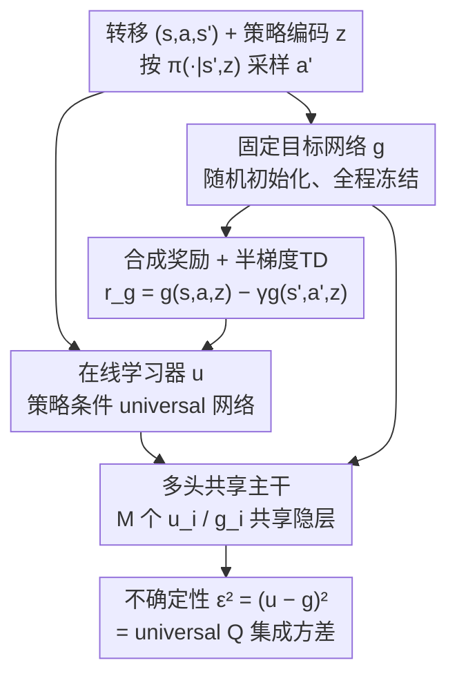

# Universal Value-Function Uncertainties

**会议**: ICLR 2026  
**OpenReview**: [https://openreview.net/forum?id=NeAzH9u2jh](https://openreview.net/forum?id=NeAzH9u2jh)  
**代码**: https://github.com/anyboby/universal-value-function-uncertainties  
**领域**: 强化学习  
**关键词**: 认识不确定性, 价值函数, 随机网络蒸馏, 神经正切核, 离线RL  

## 一句话总结
本文提出 UVU（Universal Value-Function Uncertainties），用一个在线网络与一个固定随机目标网络之间的预测误差来度量价值函数的认识不确定性——关键在于在线网络不是直接回归目标输出（那只能得到 RND 式的"近视"不确定性），而是用目标网络生成的合成奖励做 TD 学习，从而让预测误差自动累积"未来轨迹上的不确定性"；理论上在无限宽度极限下该误差严格等于一个 universal Q 函数集成的方差，实验上在离线多任务任务拒绝场景里以单模型达到大集成的性能且大幅省算力。

## 研究背景与动机
**领域现状**：在强化学习里，对价值函数 $Q^\pi(s,a)$ 的认识不确定性（epistemic uncertainty，即"因数据不足而产生的不知道"）是高效探索、安全决策和离线 RL 的核心。目前最可靠的做法是**深度集成**（deep ensembles）：独立随机初始化训练多个 Q 网络，用它们之间的方差 $\sigma_q^2(s,a)=\mathbb{V}_{\theta_0}[Q(s,a,\theta_t)]$ 当作不确定性，这个估计经验上和真实估计误差高度相关。

**现有痛点**：集成要训练 $K$ 个网络，算力和显存随 $K$ 倍增，模型一大就难以扩展。单模型方法（RND、伪计数、内在好奇心）算力友好，但它们度量的是**近视不确定性**（myopic uncertainty）——只看当前状态/动作"见没见过"，不管沿着策略往后走会遇到多少未知。要把近视不确定性变成价值不确定性，得额外套一层"沿轨迹传播"的机制（如贝叶斯后验上的 Bellman 式递归上界），这些机制往往是启发式的、缺乏严谨理论，还容易在函数逼近下低估上界。

**核心矛盾**：可靠的价值不确定性（集成）算力贵，便宜的单模型（RND）只能给近视不确定性、需要额外传播且理论薄弱。**既要单模型的低成本，又要直接拿到依赖策略的、考虑长期后果的价值不确定性，且有扎实理论保证**——这三者此前没有被同时满足。

**切入角度**：作者注意到 RND 的"在线网络去逼近一个固定随机网络、逼近不上的地方就是没见过的数据"这个机制本身很优雅，问题只出在 RND 用的是**直接回归**目标输出，所以误差天然只反映单点的数据覆盖。如果把在线网络的训练目标从"回归 $g$ 的输出"换成"用 $g$ 派生出的合成奖励做 TD 学习"，那么在线网络要恢复 $g$ 就必须沿轨迹拿到足够数据，未来数据缺口就会以预测误差的形式显现出来。

**核心 idea**：用目标网络 $g$ 自己生成一个合成奖励 $r_g$（使得 $g$ 恰好是这个奖励下的价值函数），让在线网络 $u$ 通过 TD 学习去恢复 $g$；恢复不上的差距 $(u-g)^2$ 就是依赖策略的价值不确定性。

## 方法详解

### 整体框架
UVU 围绕两个结构相同的神经网络运转：一个**固定的、随机初始化的目标网络** $g(s,a,z;\psi_0)$（权重 $\psi_0$ 训练全程冻结），一个**在线学习器** $u(s,a,z;\vartheta_t)$。三者都接收状态 $s$、动作 $a$ 和**策略编码 $z$**（指定当前要评估哪个策略 $\pi(\cdot|s,z)$，类似 UVFA 的 goal/task 编码）。

整条管线是：给定一个转移 $(s,a,s')$ 和策略编码 $z$，先按 $\pi(\cdot|s',z)$ 采样下一动作 $a'$；用固定的 $g$ 算出**合成奖励** $r_g^z(s,a,s',a') = g(s,a,z;\psi_0) - \gamma\, g(s',a',z;\psi_0)$；在线网络 $u$ 用这个合成奖励做**半梯度 TD 学习**去拟合；最后在任意查询点 $(s,a,z)$ 上，用 $u$ 与 $g$ 的平方差 $\epsilon^2=(u-g)^2$ 作为该策略下的价值不确定性。直觉上：$g$ 按构造恰好是 $r_g$ 的解（它满足对应的 Bellman 方程），所以只要数据充分覆盖 $\pi$ 诱导的动态，$u$ 就能把 $g$ 精确恢复、误差归零；一旦策略偏离了数据（轨迹被"截断"），TD 更新无法唯一确定 $g$，$u$ 就停在初始化附近恢复不出 $g$，差距即不确定性。

### 关键设计

**1. 合成奖励 + 半梯度 TD：把"近视预测误差"改造成"价值不确定性"**

这是 UVU 与 RND 的根本分水岭。RND 直接最小化回归损失 $\frac12(u(X)-g(X))^2$，误差只反映"这个点在不在训练集里"，是单点的近视信号。UVU 改成让 $g$ 先生成一个合成奖励
$$r_g^z(s,a,s',a') = g(s,a,z;\psi_0) - \gamma\, g(s',a',z;\psi_0),$$
然后在线网络 $u$ 最小化半梯度 TD 损失
$$\mathcal{L}(\vartheta_t)=\frac{1}{2N_D}\sum_i\Big(\gamma\,[u(s'_i,a'_i,z_i;\vartheta_t)]_{sg}+r_g^z(s_i,a_i,s'_i,a'_i)-u(s_i,a_i,z_i;\vartheta_t)\Big)^2,$$
其中 $[\cdot]_{sg}$ 是 stop-gradient。这个奖励定义的巧妙之处在于：把 $r_g$ 代回 Bellman 方程，固定网络 $g$ 本身就是它的解、TD 损失为零。于是"恢复 $g$"这件事变成了一个价值学习问题——$u$ 想拟合上 $g$，就必须像学真实价值函数一样把奖励沿轨迹 bootstrap 回来。当策略 $\pi(\cdot|s,z)$ 在某状态选了数据里没出现过的动作（如链式 MDP 里在 $s_3$ 选动作 b），轨迹被有效截断，上游状态的 TD 更新只能从停在初始化的下游条目取值，永远恢复不出 $g$。正是这种"长期数据缺口"导致的恢复失败，被 $(u-g)^2$ 捕捉成依赖策略的价值不确定性，而不是 RND 那种只看当前点的近视新颖度。

**2. 策略条件化的 universal 不确定性网络：一个模型评估任意策略的不确定性**

价值不确定性的本质是"沿哪条策略走"决定了会累积多少未知，所以它必须依赖策略。UVU 借鉴 UVFA（universal value function approximator）的思路，把策略编码 $z$ 作为额外输入喂给 $u$ 和 $g$，即 $u,g:\mathcal{S}\times\mathcal{A}\times\mathcal{Z}\to\mathbb{R}$，其中 $z$ 是对某个具体策略 $\pi(\cdot|s,z)$ 的参数化/索引。这样训练出来的模型不是只对某个固定策略报不确定性，而是**对任意被 $z$ 编码的策略**都能输出 $\epsilon(s,a,z)^2$。论文在链式 MDP 上展示了一整族策略（以概率 $1-z$ 选未探索动作 b）的不确定性曲面：早期状态、$z$ 偏小（更可能选未知动作）时不确定性高，接近终止态、$z\to1$ 时不确定性低——与 128 个 universal Q 函数集成的方差曲面高度吻合。它和 RND/ICM 的另一个结构差异是：UVU 不需要单独再养一套价值模型 + 不确定性模型，一个策略条件网络就够。

**3. 多头共享主干：单模型在分布上等价于集成方差**

为了既省算力又拿到稳定的方差估计，UVU 把 $u$ 和 $g$ 实现为**共享隐层、$M$ 个独立输出头** $u_i,g_i$ 的结构，不确定性取各头平方误差的样本均值 $\frac12\bar\epsilon^2=\frac{1}{2M}\sum_{i=1}^M\epsilon_i^2$。理论上（Corollary 2）这个 $M$ 头单模型估计量，在分布上与 $M+1$ 个独立训练的 universal Q 函数的**样本方差**完全相同，二者都服从同一个缩放卡方分布 $\bar\sigma_Q^2\sim\frac{\sigma_Q^2}{M}\chi^2(M)$。更强的是期望层面的等价（Theorem 1 + Corollary 1）：在无限宽度极限下，用 NTK 理论给出半梯度 TD 训练后收敛函数的闭式分布，可证明
$$\mathbb{E}_{\vartheta_0,\psi_0}\!\Big[\tfrac12\epsilon(x,\vartheta_\infty,\psi_0)^2\Big]=\mathbb{V}_{\theta_0}\big[Q(x,\theta_\infty)\big],$$
即 UVU 的期望平方预测误差精确等于 universal Q 函数集成的方差。这给了"单模型为什么能替代集成"一个严格的理论落点，而不是经验上的近似类比——也是相比 RND 等单模型方法"缺理论"的核心补强。

### 损失函数 / 训练策略
在线网络 $u$ 唯一的训练目标就是上文的半梯度 TD 损失（合成奖励 $r_g$ 来自冻结的 $g$，$g$ 不更新）。理论分析建立在无限宽度 + 梯度流（无穷小步长梯度下降）的 NTK 范式下，闭式收敛解为
$$f(x,\theta_\infty)=f(x,\theta_0)-\Theta_{xX}(\Theta_{XX}-\gamma\Theta_{X'X})^{-1}\big(f(X,\theta_0)-(\gamma f(X',\theta_0)+r)\big),$$
其中 $\Theta$ 是 NTK。实验中用有限宽度网络验证理论是否落地。

## 实验关键数据

### 主实验
环境是 Minigrid 的离线 GoToDoor 多任务变体：智能体要根据任务编码 $z$（目标门颜色）导航开门，数据由一个"专家但系统性失败"的策略采集（如永远开不了北墙的门）。协议是**任务拒绝**：初始状态下智能体可以拒绝一批任务，再从未拒绝的任务里随机分一个，按完成回报打分——只有靠可靠的价值不确定性识别"数据/策略不匹配"的任务并拒绝，才能拿高分；近视不确定性不足以胜任。所有方法用 DQN 架构，按最高不确定性拒绝任务。

| 网格尺寸 | DQN | BDQNP(3) | BDQNP(15) | BDQNP(35) | DQN-RND | DQN-RND-P | UVU (本文) |
|--------|------|----------|-----------|-----------|---------|-----------|-----------|
| 5 | 5.50 | 8.69 | 10.50 | 10.58 | 3.94 | 10.41 | **10.54** |
| 6 | 4.93 | 7.66 | 9.39 | 9.57 | 1.99 | 9.28 | **9.54** |
| 7 | 4.58 | 6.61 | 8.49 | 8.75 | 2.66 | 8.12 | **8.73** |
| 8 | 4.06 | 5.91 | 7.68 | 7.92 | 2.53 | 7.40 | **8.03** |
| 9 | 3.66 | 5.04 | 6.69 | 7.03 | 2.39 | 6.39 | **7.29** |
| 10 | 3.39 | 4.64 | 6.09 | 6.53 | 2.25 | 5.64 | **6.72** |

UVU 以**单模型**达到甚至超过大集成 BDQNP(35)（35 个网络）的水平，且在多个尺寸上以统计显著性领先许多基线。在较大网格（8/9/10）上 UVU 反而稳定超过 BDQNP(35)，显示其价值不确定性在难任务上更可靠。运行时分析（Fig. 4b）显示集成随规模线性增加耗时，UVU 接近单个 DQN 的成本。纯 DQN（随机拒绝）显著垫底，说明学到的 Q 函数泛化不足以弥补缺失的不确定性估计；原始 DQN-RND（近视）甚至比随机拒绝还差，印证近视不确定性不胜任此协议。

### 消融实验

| 配置 | 关键现象 | 说明 |
|------|---------|------|
| 网络宽度 64→2048 | UVU 随宽度提升的曲线与 DQN/BDQNP 趋势一致 | 有限宽度只要容量够即可给出有效不确定性 |
| UVU vs BDQNP(1/3/8/15/35) | UVU 单模型 ≈ 大集成 | 单模型多头等价集成方差（Corollary 2）在实践成立 |
| 运行时 (100k 梯度步) | UVU ≈ 单模型成本，集成随规模线性增长 | 大幅省算力是核心卖点 |

### 关键发现
- **TD 学习（设计 1）是把近视误差变价值不确定性的关键**：DQN-RND（直接回归）在该协议下甚至不如随机拒绝，而换成合成奖励 + TD 后效果跃升到集成水平，说明改造训练目标是决定性的。
- **有限宽度不破坏理论**：宽度消融显示 UVU 在实际（远非无限宽）网络上性能随宽度平滑提升、与基线趋势一致，NTK 范式的洞见能迁移到实践。
- **难任务上更稳**：网格越大、数据缺口越严重时，UVU 相对集成的优势越明显，反映其策略条件价值不确定性在长程未知上的捕捉更扎实。

## 亮点与洞察
- **"用目标网络自造奖励"是极简又深刻的一招**：让固定随机网络 $g$ 既当目标又当奖励源，使 $g$ 天然是该奖励的零损失解，于是"恢复 $g$ 的失败程度"自动等价于"价值学习的数据不足程度"——一个网络同时承担了价值模型和不确定性模型两个角色。
- **把单模型不确定性钉死在集成方差上**：通过 NTK 给半梯度 TD 学习推出闭式收敛分布，证明 UVU 误差期望 = universal Q 集成方差、有限样本下同分布于缩放卡方，这是少见的"单模型替代集成"有严格等价证明而非经验近似。
- **可迁移的设计模式**：合成奖励 + TD 这套"把监督式新颖度升级成轨迹感知不确定性"的思路，可迁移到在线探索（用 UVU 误差当内在奖励）、安全 RL（拒绝高不确定动作）等场景；作者也指出与自预测表示学习、无监督 RL 的策略发现天然互补。

## 局限与展望
- **理论建立在无限宽度 + 梯度流的 NTK 理想化假设上**：作者承认这是理想条件，虽然有限宽度实验稳健，但弥合理论与实践的缺口仍是未来工作。
- **NTK 范式通常不涉及特征学习**：这意味着分析没覆盖表示随训练变化的情形；作者建议把 UVU 与自预测辅助损失等表示学习方法结合，去攻更难的探索问题。
- **只估计给定策略的不确定性、不负责产生策略**：UVU 需要外部提供策略编码 $z$，本身不给出如何获得多样化策略及其编码；与无监督 RL 的策略/编码发现方法整合是自然的下一步。
- **评测域较窄**：实验集中在 Minigrid GoToDoor 离线任务拒绝这一类网格世界设置，在连续控制、像素观测等更复杂域上的有效性尚待验证。

## 相关工作与启发
- **vs RND（随机网络蒸馏）**：两者都用"在线网络 vs 固定随机网络"的预测误差当不确定性，但 RND 用直接回归损失、只给单点近视不确定性、要价值化还得额外传播机制；UVU 把训练目标换成合成奖励上的 TD 学习，误差直接反映依赖策略的长期价值不确定性，且无需另设价值模型。
- **vs 深度集成 / Bootstrapped DQN (BDQNP)**：集成靠训练多个独立 Q 网络取方差，可靠但算力随规模线性增长；UVU 用单模型多头在分布上等价于集成方差，达到 BDQNP(35) 的性能而成本接近单网络。
- **vs 近视不确定性传播方法（O'Donoghue/Janz/Zhou 等）**：这类方法在贝叶斯/模型视角下用类 Bellman 递归把近视不确定性传播成价值不确定性，但面临边界紧致性、函数逼近下低估等开放问题；UVU 直接在单模型里端到端得到价值不确定性，并用 NTK 给出闭式理论支撑。

## 评分
- 新颖性: ⭐⭐⭐⭐⭐ 用合成奖励 + TD 改造 RND，把单模型预测误差升级为策略条件价值不确定性，思路简洁且此前未见。
- 实验充分度: ⭐⭐⭐⭐ 任务拒绝协议设计巧妙、对比基线齐全且有显著性，但评测域局限于 Minigrid 网格世界。
- 写作质量: ⭐⭐⭐⭐⭐ 直觉示例 + NTK 闭式推导层层递进，理论与方法衔接清晰。
- 价值: ⭐⭐⭐⭐⭐ 给"便宜的单模型价值不确定性"提供了有严格理论保证的方案，对探索/离线/安全 RL 有广泛潜在影响。

<!-- RELATED:START -->

## 相关论文

- [\[ICLR 2026\] Replicable Reinforcement Learning with Linear Function Approximation](replicable_reinforcement_learning_with_linear_function_approximation.md)
- [\[ICLR 2026\] Value Flows](value_flows.md)
- [\[ICLR 2026\] Transitive RL: Value Learning via Divide and Conquer](transitive_rl_value_learning_via_divide_and_conquer.md)
- [\[ICLR 2026\] Relative Value Learning](relative_value_learning.md)
- [\[ICLR 2026\] Is Pure Exploitation Sufficient in Exogenous MDPs with Linear Function Approximation?](is_pure_exploitation_sufficient_in_exogenous_mdps_with_linear_function_approxima.md)

<!-- RELATED:END -->
