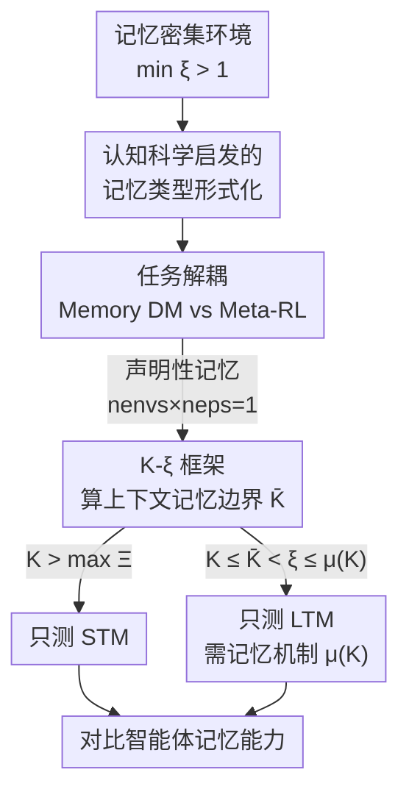

# 解构强化学习智能体中的记忆：一套分类与评估方法

**会议**: ICLR 2026  
**OpenReview**: [https://openreview.net/forum?id=lJKdOYFF5W](https://openreview.net/forum?id=lJKdOYFF5W)  
**代码**: 无  
**领域**: 强化学习  
**关键词**: 智能体记忆, 长时/短时记忆, POMDP, 评估方法论, 相关视界  

## 一句话总结
这篇论文不提新模型，而是给强化学习里被滥用的"记忆"一词做了一套形式化定义和评估方法：用相关视界 $\xi$ 与智能体上下文长度 $K$ 把短时/长时记忆（STM/LTM）严格区分开，并提出一个可操作的实验配置算法，实证表明不遵守这套方法论会让评估结论严重失真。

## 研究背景与动机
**领域现状**：在部分可观测（POMDP）任务里，智能体要靠"记忆"处理交互历史。大量工作把记忆能力归功于循环网络、注意力等架构特性，benchmark 和"记忆增强智能体"层出不穷。

**现有痛点**："记忆"这个词在 RL 文献里没有统一定义。有人把它定义为在固定上下文内处理依赖的能力（如 Transformer 的上下文窗口），有人定义为利用上下文之外信息的能力，Meta-RL 又把它定义为适应新环境的能力。同一个词指代了完全不同的东西，导致"某智能体有长时记忆"这类断言往往含糊甚至误导。

**核心矛盾**：缺乏定义的直接后果是评估失控。一个智能体可能仅仅因为任务配置允许走捷径、或事件恰好落在短时上下文内，就"看起来"具备长时记忆。没有把记忆效应隔离出来，很多实证评估会把不同记忆机制混为一谈，也检测不出架构的真实上限，阻碍公平、可复现的比较。

**本文目标**：把 RL 中的记忆概念形式化，拆成两个可测的子问题——(1) 怎么从认知科学借来"短时/长时""声明性/程序性"这些概念并给出 RL 下的精确定义；(2) 怎么设计实验把这些记忆类型隔离开来评估。

**切入角度**：作者把记忆看作记忆增强智能体的内在属性，直接把记忆类型分类绑定到智能体的内部机制和任务的时间结构上。关键观察是：记忆是相对的——同一个事件对一个上下文长 $K$ 的智能体是"短时"，对另一个更短的智能体就是"长时"，所以必须同时刻画智能体参数 $K$ 和环境参数 $\xi$。

**核心 idea**：用"相关视界 $\xi$ 是否超出上下文长度 $K$"这一个可计算判据来定义 STM 与 LTM，并据此给出一套保证只测目标记忆类型的实验配置算法。

## 方法详解

### 整体框架
这篇论文的产物是一套"分类 + 评估"的方法论，而不是一个网络。整体逻辑分四步推进：先从认知科学借来记忆概念并形式化；再在任务层面把需要记忆的 POMDP 任务解耦成 Memory DM（单环境单回合内的决策记忆）和 Meta-RL（跨任务的技能迁移）两类；然后在 Memory DM 框架内用相关视界 $\xi$ 与上下文长度 $K$ 的关系精确划出 STM 与 LTM 的边界；最后把这套定义落地成一个实验配置算法（Algorithm 1），并实证它一旦被违反会带来什么误判。

下图给出 Algorithm 1 的评估流程——给定一个记忆密集环境，如何一步步配置出"只测 STM"或"只测 LTM"的实验。

### 关键设计

**1. 认知科学启发的记忆类型形式化：把模糊的口头概念变成可判定的定义**

针对"记忆一词没有统一定义"这个根本痛点，作者明确表示目标不是复刻人类记忆的全部复杂性，而是选择性地把神经科学里已经被 RL 非正式使用、却缺乏形式化的几个概念——短时/长时、声明性/程序性——翻译成 RL 下可测的判据。声明性记忆指智能体在单个环境、单个回合内迁移知识（如物体位置、事实），程序性记忆指跨多个环境或多个回合复用技能（策略）。作者用训练环境数 $n_{envs}$ 和每环境回合数 $n_{eps}$ 给出一刀切的判据：

$$\text{声明性记忆} \iff n_{envs} \times n_{eps} = 1, \qquad \text{程序性记忆} \iff n_{envs} \times n_{eps} > 1.$$

这条判据的妙处在于，它把一个原本靠直觉判断的语义问题，变成了只看任务配置就能机械判定的问题，从而让"这个实验到底在测哪类记忆"不再有争议。

**2. 任务层面解耦 Memory DM 与 Meta-RL：分清记忆的行为角色**

很多工作把"长时记忆"放在基于 MDP 的 Meta-RL 设置里评估，却没有把"从过去信息做决策"和"跨任务适应"这两件事隔离开。作者定义智能体上下文长度 $K$ 为时刻 $t$ 能处理的历史三元组 $(o,a,r)$ 的最大步数，并据此区分两个框架：Memory DM 是一类 POMDP，策略 $\pi^*(a_t \mid o_t, h_{0:t-1})$ 基于当前观测和历史在单个环境内决策，对应声明性记忆；Meta-RL 则是学会学习、把多任务的共性结构记下来以快速适应新任务，对应程序性记忆。作者进一步把 Meta-RL 任务按内循环是否为 POMDP 拆成"绿色"（内循环也需记忆，可当作 Memory DM）与"蓝色"（内循环是 MDP，只在外循环需要记忆）两类。本文聚焦声明性记忆的 Memory DM，正是因为只有先把决策记忆从技能迁移里剥离出来，STM/LTM 的讨论才有意义。

**3. K-ξ 框架与上下文记忆边界：用一个数判定该测 STM 还是 LTM**

这是全文最核心的可操作设计。作者引入相关视界 $\xi = t_r - t_e - \Delta t + 1$，即支撑某次决策的事件 $\alpha^{\Delta t}_{t_e}$ 与其被回忆的时刻 $\beta_{t_r}$ 之间的最小时间延迟。由此给出干净的判据：$\xi \le K$ 时事件落在上下文内，属短时记忆（STM）；$\xi > K$ 时事件在上下文之外，属长时记忆（LTM）。一个环境被称为记忆密集环境 $\tilde{M}_P$，当且仅当所有事件-回忆对的相关视界满足 $\min_n \xi_n > 1$。

在此基础上，作者证明了上下文记忆边界（context memory border）$\bar K = \min_n \Xi - 1$：当 $K \le \bar K$ 时，没有任何相关视界落入智能体历史，于是该环境只能验证 LTM。配合相关视界集合 $\Xi$ 的上界，得到完整划分——$K \in [1, \bar K]$ 只测 LTM；$K \in (\bar K, \max_n \Xi)$ 同时测 STM 与 LTM（此时无法干净估计 LTM）；$K \in [\max_n \Xi, \infty)$ 只测 STM。要让上下文长 $K$ 的智能体真正解决 LTM，还需要记忆机制 $\mu(K) = K_{eff} \ge K$（如 RNN 的隐状态递归更新）把有效上下文 $K_{eff}$ 撑大，使得 $\tilde{M}_P: \bar K \le K < \xi \le K_{eff} = \mu(K)$。换句话说，验证 LTM 等价于验证智能体的记忆机制 $\mu(K)$，这正是旧评估常常漏掉的一环。

**4. Algorithm 1 评估协议：把方法论变成可照做的步骤，并暴露朴素评估的陷阱**

有了上面的定义，作者把整套配置流程固化成 Algorithm 1：① 估计环境中事件-回忆对的数量 $n$（$n=0$ 则该环境不适合测记忆）；② 对每个事件-回忆对算出 $\xi_i$，求上下文记忆边界 $\bar K = \min_n \Xi - 1$；③ 要测 STM 就设 $K > \bar K$，要测 LTM 就设 $\bar K \le K \le K_{eff} = \mu(K)$；④ 分析结果。这套协议的价值不只是"规范"，更在于它能揭示朴素评估的失真：如果不控制 $\xi$ 相对 $K$ 的大小、用混合视界（variable $\xi$）的任务去测，短时记忆效应会盖过长时记忆缺陷，让一个其实没有 LTM 的智能体"看起来"记忆良好——只有固定 $\xi > K$ 的配置才能把真实上限逼出来。

### 一个例子：在 Passive T-Maze 上测记忆
Passive T-Maze 里，智能体在走廊起点看到一个线索，必须在岔路口正确转向，回合长 $T = L+1$（$L$ 为走廊长度）。按 Algorithm 1：① 只有一个事件-回忆对（$n=1$），所以该任务既能测 STM 也能测 LTM；② 事件只持续一步（$\Delta t = 0$），于是 $\xi = T$，上下文记忆边界 $\bar K = T-1$；③ 调节 $T$ 或上下文 $K$ 即可——$K > \bar K$ 测 STM，$\bar K \le K \le \mu(K)$ 测 LTM。理论上 $K = \bar K$ 就够，但取更小的 $K$ 能更清楚地暴露记忆机制的作用。

## 实验关键数据

作者在线上评估 DTQN、DQN-GPT-2、SAC-GPT-2（注意力记忆），线下评估 DT 与 BC-LSTM（对比注意力 vs 循环），任务覆盖 Passive T-Maze、Minigrid-Memory、POPGym-Autoencode、POPGym-RepeatPrevious。核心做法是变动 $K$ 与 $\xi$ 来隔离记忆类型、暴露模型上限。

### 主实验：记忆是相对的（$K$-$\xi$ 框架）

| 配置 | 现象 | 结论 |
|--------|------|------|
| $\xi \le K$（STM） | DTQN / DQN-GPT-2 表现高 | 事件在上下文内，靠短时记忆即可解 |
| $\xi > K$（LTM） | 性能急剧下降 | 长程依赖必须依赖显式记忆机制 |
| 同一智能体、不同任务 | 同一 agent 既可呈现 STM 也可呈现 LTM | 记忆不是孤立属性，由 $K$ 与 $\xi$ 共同决定 |

### 常见记忆任务的相关视界（Table 2，节选）

| 任务 | $\Xi$ | $\xi$ | $K <$ 时为 LTM |
|------|-------|-------|----------------|
| Passive T-Maze | $\{L+1\}$ | $L+1$ | $L+1$ |
| Minigrid-Memory (固定) | $\{L+1\}$ | $L+1$ | $L+1$ |
| Minigrid-Memory (可变) | $[7, L+1]$ | $7$ | $7$ |
| Memory Maze 15×15 | $[45, 4000]$ | $45$ | $45$ |
| POPGym-Autoencode | $[2, 104]$ | $2$ | $2$ |
| POPGym-RepeatPrevious | $\{5\}$ | $5$ | $5$ |

### 消融/诊断实验

| 配置 | 关键现象 | 说明 |
|------|---------|------|
| SAC-GPT-2, Minigrid-Memory, 可变 $L$ | STM/LTM 设置成功率都高 | 混合视界掩盖了记忆缺陷，误以为记忆良好 |
| SAC-GPT-2, Minigrid-Memory, 固定 $L=21$, $K=14$ | LTM 失败 | 固定 $\xi > K$ 才暴露真实长时记忆上限 |
| DT, T-Maze 验证长度 $>90$ | 失败 | 固定注意力窗口 = 短时记忆，无法外推 |
| BC-LSTM, T-Maze 较长序列 | 泛化良好 | 循环隐状态 = 真正长时记忆 |
| 训练长度 300 / 600 / 900 | DT 仍 100%，BC-LSTM 跌到 0.87 乃至崩溃 | 若只看长训练长度会误把 STM 当 LTM 的优势 |

### 关键发现
- **记忆的相对性是核心结论**：性能在 $\xi \le K$ 时高、$\xi > K$ 时骤降，证明长时记忆同时取决于时间距离和智能体设计，脱离 $K$、$\xi$ 谈记忆都不可靠。
- **混合视界会骗人**：可变 $\xi$ 的任务里短时记忆效应会盖过长时缺陷；只有固定 $\xi > K$ 才能把真实上限逼出来（SAC-GPT-2 在 Minigrid-Memory 固定模式 $K=14$ 下 LTM 失败即为铁证）。
- **架构差异被框架照出来**：DT 的固定注意力窗口本质是 STM，验证长度超出上下文（$L>90$）即崩；BC-LSTM 的循环状态是真正的 LTM，能外推到更长序列——但若只在短验证长度或长训练长度上比较，反而会得出"DT 更强"的误导结论。

## 亮点与洞察
- **用一个可计算量统一了混乱的术语**：相关视界 $\xi$ 与上下文 $K$ 的比较，把"短时/长时记忆"从形容词变成了判据，任何人拿到任务都能机械判定该测哪类记忆——这是把概念辩论变成工程规范的关键一步。
- **"记忆是相对的"这一洞察很有冲击力**：同一个智能体在不同 $K$-$\xi$ 配置下可表现为 STM 或 LTM，说明此前大量"某架构有长时记忆"的断言都缺少前提条件。
- **诊断协议可直接迁移**：Algorithm 1 不依赖具体模型，任何记忆增强 RL 工作都能拿它来自检评估配置是否会把 STM 误当 LTM，尤其是 benchmark 设计者应据此固定 $\xi$。
- **把 LTM 验证归约为验证记忆机制 $\mu(K)$**：明确指出"长时记忆能力"本质是"上下文外建立相关性的机制"，从而把评估对象从"架构标签"精准定位到"机制"。

## 局限与展望
- **只覆盖声明性记忆**：本文聚焦 Memory DM（单环境单回合的决策记忆），程序性记忆 / Meta-RL 外循环只做了分类层面的解耦，没有给出对应的实证评估协议。
- **依赖能算出 $\xi$ 的任务**：相关视界需要明确的事件-回忆对结构，对那些事件边界模糊、$\Delta t$ 难以界定的真实任务，$\bar K$ 的估计会变得困难，方法的可操作性下降。
- **不提新方法，只提评估**：论文价值在规范评估而非提升性能，实际记忆机制的设计仍留给后续工作；如何据这套框架反过来指导架构改进，是值得跟进的方向。
- **基线偏经典**：评估对象集中在 DTQN / GPT-2 系 / DT / LSTM，尚未覆盖近期更复杂的外部存储 / 状态空间模型类记忆架构。

## 相关工作与启发
- **vs Ni et al. (2023)**：他们区分"记忆"与"信用分配"两种时间推理，本文则把二者都视为"建立时间依赖"的能力而合并处理，并进一步用 $\xi$ 给出可测判据，把概念区分落到实验配置上。
- **vs Yue et al. (2024)（记忆依赖对 $(p,q)$）**：他们用依赖对建模演示中的回忆，对模仿学习有用，但缺少对 RL 记忆的理论处理，也没有覆盖更广的记忆类型分类；本文从时间依赖和任务结构出发给出统一 taxonomy。
- **vs 各类记忆 benchmark（POPGym、Memory Maze 等）**：以往 benchmark 提供任务但术语不一致、常与实验真正测的东西错位；本文不造新环境，而是给现有环境算出 $\Xi$、$\xi$、$\bar K$，让它们能被正确地用于 STM 或 LTM 评估。

## 评分
- 新颖性: ⭐⭐⭐⭐ 不提新模型，但把"记忆"这一被滥用的概念形式化成可判定判据，视角新颖且切中要害。
- 实验充分度: ⭐⭐⭐⭐ 跨在线/离线、多任务多架构系统验证了方法论的必要性，诊断性实验有说服力；但偏定性、未覆盖程序性记忆。
- 写作质量: ⭐⭐⭐⭐ 定义层层递进、定理与算法清晰，但符号密集，初读门槛较高。
- 价值: ⭐⭐⭐⭐⭐ 为整个记忆增强 RL 领域提供了统一术语和自检协议，是基础设施级别的贡献。

<!-- RELATED:START -->

## 相关论文

- [\[ICLR 2026\] PAMDP: Interact to Persona Alignment via a Partially Observable Markov Decision Process](pamdp_interact_to_persona_alignment_via_a_partially_observable_markov_decision_p.md)
- [\[ICLR 2026\] Geometry of Uncertainty: Learning Metric Spaces for Multimodal State Estimation in RL](geometry_of_uncertainty_learning_metric_spaces_for_multimodal_state_estimation_i.md)
- [\[ICLR 2026\] Information-based Value Iteration Networks for Decision Making Under Uncertainty](information-based_value_iteration_networks_for_decision_making_under_uncertainty.md)
- [\[ICLR 2026\] Solving General-Utility Markov Decision Processes in the Single-Trial Regime with Online Planning](solving_general-utility_markov_decision_processes_in_the_single-trial_regime_wit.md)
- [\[ICLR 2026\] Guided Policy Optimization under Partial Observability](guided_policy_optimization_under_partial_observability.md)

<!-- RELATED:END -->
