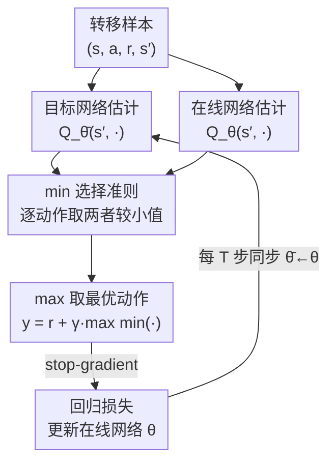

# Use the Online Network If You Can: Towards Fast and Stable Reinforcement Learning

**会议**: ICLR 2026  
**OpenReview**: [https://openreview.net/forum?id=rFLuaG9Yq6](https://openreview.net/forum?id=rFLuaG9Yq6)  
**代码**: https://github.com/AhmedMagdyHendawy/MINTO  
**领域**: 强化学习 / 值函数估计 / 离线RL  
**关键词**: 目标网络, 在线网络, 过估计偏差, Bellman 更新, 自举目标

## 一句话总结
本文提出 MINTO，把 TD 自举目标从「只用目标网络」改成「对目标网络和在线网络的估计取最小值」，从而在使用新鲜的在线估计加速学习的同时，用 min 操作压住在线网络带来的过估计偏差，几乎零成本地嵌入 DQN / IQN / CQL / SAC 等一众算法并普遍提升性能。

## 研究背景与动机

**领域现状**：深度 RL 里估计值函数的标准做法是引入「目标网络」——用在线网络的一份滞后拷贝 $Q_{\bar\theta}$ 来计算回归目标 $y = r + \gamma \max_{a'} Q_{\bar\theta}(s', a')$，每隔 $T$ 步才把 $\bar\theta$ 同步成 $\theta$。这是 DQN 用来缓解「致命三要素」（函数逼近 + off-policy 数据 + 自举）的关键技巧。

**现有痛点**：目标网络虽然换来了稳定性，但本质是一种妥协——它让目标"缓慢移动"，在线网络只能去追一个过时的估计，于是学习被人为拖慢。反过来，如果直接拿在线网络 $Q_\theta$ 当自举目标，能用上最新估计、学得更快，但众所周知会引发训练不稳定。

**核心矛盾**：稳定性（目标网络）与学习速度（在线网络）之间存在一个 trade-off。更关键的是，直接用在线网络自举会放大值函数里固有的**过估计偏差**——$\max$ 操作作用在含噪声的自举估计上，使 $Q$ 值随训练单调虚高，最终发散。

**本文目标**：找到一个合适的选择准则，能在引入在线网络新鲜估计的同时，不牺牲目标网络提供的稳定性。

**切入角度**：作者观察到，前人工作里"去掉目标网络只用在线网络"和"重新加回目标网络"反复横跳，说明两者各有价值，不该二选一。那能不能让两个网络**并肩工作**、联合计算回归目标？关键问题是用什么准则来组合二者。

**核心 idea**：对目标网络和在线网络的下一状态估计**取最小值**作为自举目标——当在线估计偏高（很可能是过估计）时退回目标网络保稳定，当在线估计偏低时采纳它的新鲜信息加速学习。

## 方法详解

### 整体框架

MINTO（MINimum between Target and Online）是对 TD 自举目标计算的一行式修改。标准 DQN 的目标是 $y = r + \gamma \max_{a'} Q_{\bar\theta}(s',a')$，只用目标网络；MINTO 在对动作取 $\max$ 之前，先对**每个候选动作**在目标网络与在线网络两个估计之间取 $\min$：

$$y = r + \gamma \max_{a'\in A} \min\big(Q_{\bar\theta}(s',a'),\, Q_\theta(s',a')\big).$$

随后用与 DQN 相同的回归损失训练，并对目标做 stop-gradient（防止梯度通过 $Q_\theta$ 回传到目标里）：

$$L(\theta) = \tfrac{1}{2}\big(\lceil y\rceil - Q_\theta(s,a)\big)^2.$$

整条流程可以看成「双源估计 → 逐动作取小 → 取最优动作 → 回归」，下游可无缝接到任意基于 TD 的算法上。实现代价只是对下一状态多跑一次在线网络的前向，在 JAX 这类框架里开销可忽略。

### 关键设计

**1. min(目标, 在线) 自举：用「取小」把新鲜估计安全地放进目标**

痛点直白说就是：在线网络给的估计最新、能加速学习，但它在 $\max$ 作用下容易系统性虚高、把目标越拉越大直到发散。MINTO 的机制是在逐动作层面取 $\min(Q_{\bar\theta}(s',a'), Q_\theta(s',a'))$——当在线估计**高于**目标估计时（最可能发生过估计的情形），自动退回到更保守、更稳定的目标网络；当在线估计**低于**目标估计时，则采纳这个更新鲜的值。这样既挑出了在线网络里"可信的新信息"，又把"危险的乐观"挡在门外。和"换一个 max 算子换一种正则"的做法不同，MINTO 不改网络结构、不加超参，只换了一个选算子，却同时缓解了移动目标问题和过估计偏差。

**2. 为什么是 min 而不是 max/mean/random：用对照实验确立选择准则**

一个自然的质疑是：组合两个估计有很多方式，凭什么是 min？作者在 15 个 Atari 游戏上把候选算子摆在一起做了对照（图 1）：Online Only（只用在线）因为追逐快速变化的目标而训练不稳、表现最差之一；Max（取大）最糟，因为它专挑更高的估计、把过估计偏差推到极致导致目标值失控暴涨；Mean（取平均）和 Random（等概率二选一）都退化成接近 Target Only（即 DQN）、没有额外收益；唯有 Min 显著领先。这组实验回答了两个问题——min 确实是合适的组合准则（Q1），且其优势正源于"以稳定的方式纳入在线估计、同时抑制它们引入的过估计"这一机理（Q2）。换句话说，min 的有效性不是巧合，而是和过估计偏差的方向严格对齐。

**3. 即插即用 + 收敛保证：一行修改通吃 value-based 与 actor-critic、在线与离线**

MINTO 只动 Bellman 目标的计算，因此能以极低成本嵌入各类 off-policy 算法：在 DQN、分布式 RL 的 IQN 上直接替换目标；在离线 RL 的 CQL 上改回归目标即可（仍保留 CQL 对 OOD 动作的惩罚）；在 actor-critic 的 SAC（SimbaV1/V2 架构）里也能用，只是依 critic 数量不同有几种接法。理论上，作者把 MINTO 算子写成 $G_{\text{MINTO}}(Q_s)=\max_{a}\min_{j\in T} Q_{sa}(j)$（$T$ 为一组历史时间索引），证明它满足 Lan et al. (2020) 的 Generalized Q-learning 框架对算子的非扩张条件，从而在表格设定下保证 $Q$ 值收敛到最优 $Q^*$（Corollary 1）。这让 MINTO 与同样用 min 的 Maxmin Q-learning 形成对照：后者要训练一个 Q 网络**集成**、付出额外显存和计算，而 MINTO 只在目标网络与在线网络之间取 min，无需任何额外网络。

### 一个完整示例

以 IQN 在 Breakout 上的训练为例，作者追踪了"在线网络被 min 选中"的频率随训练的变化（图 4 右）：训练**极早期**在线网络与目标网络几乎一致、且在线估计噪声大偏高，于是 min 几乎总是退回目标网络（在线选择比例接近 0），表现为保守稳定；随着训练推进、在线参数逐渐偏离上一次同步的目标参数，在线网络给出更低（更可信）估计的机会变多，被选中的比例稳步上升；训练后期，在线网络约有 **45%** 的时间被采纳。每个数据点取自两次目标网络同步之间的平均——这段时间里在线网络与目标网络的分歧最大，正是新鲜估计最有价值的窗口。这条曲线直观说明 MINTO 不是静态地偏向某一个网络，而是随训练动态地、自适应地在"稳"和"快"之间切换。

## 实验关键数据

### 主实验

MINTO 在在线/离线、离散/连续、value-based/actor-critic 多个维度全面评测，统一用 IQM 聚合的 AUC 指标（同时反映学习速度与渐近性能），5 个种子。

| 设定 / 基座 | 架构 | 指标 | MINTO 相对基座提升 |
|------|------|------|------|
| 在线·离散 / DQN | CNN | AUC | ≈ +17% |
| 在线·离散 / DQN | IMPALA+LN | AUC | ≈ +22% |
| 分布式 / IQN | CNN | AUC | ≈ +7% |
| 分布式 / IQN | IMPALA+LN | AUC | ≈ +10% |
| 离线 / CQL | CNN | AUC | ≈ +125% |
| 离线 / CQL | IMPALA+LN | AUC | ≈ +20% |
| 在线·连续 / SimbaV1·V2 (SAC) | — | IQM 归一化回报 | MuJoCo/HBench 样本效率明显提升，DMC-Hard 持平或略降 |

### 消融实验

| 配置 | 关键现象 | 说明 |
|------|---------|------|
| Min（本文） | AUC 最高 | min 准则，以稳定方式纳入在线估计 |
| Max | 最差 | 专挑高估计，过估计失控、目标暴涨 |
| Mean | ≈ Target Only | 平均无额外收益 |
| Random | ≈ Target Only | 等概率二选一退化为 DQN |
| Online Only | 较差 | 追逐快速变化目标、训练不稳 |
| Target Only | = DQN | 基准 |

与同类基线对比（15 个 Atari，CNN，在线）：MINTO 一致优于 Double DQN、FR-DQN、ScDQN 这些专门治过估计的方法，也优于 Maxmin DQN（$N{=}2$ 集成）；且 ScDQN/FR-DQN 都引入额外超参，而 MINTO **零新增超参**。离线设定下，单估计器基线（$N{=}1$）依旧被 MINTO 全面压制；唯一例外是 Maxmin CQL（$N{=}2$）因其保守性在离线场景反而高于 MINTO，但把 MINTO 接进 Maxmin CQL 后还能进一步涨点。

### 关键发现
- **min 算子的优势与过估计偏差方向严格对齐**：Max 最差、Min 最好这一对称结果，是 MINTO 机理最有力的证据——收益不来自"换个更新规则"，而来自"按正确方向裁剪在线估计"。
- **离线 RL 收益最大（CNN 下 +125%）**：原始 CQL 完全忽视了新鲜的在线估计，MINTO 补上这块短板，且 min 正好压住离线场景里 OOD 动作的过估计，二者叠加收益巨大。
- **在线选择比例随训练上升至 ~45%**：证实 MINTO 确实在用在线网络，而非名义上的双网络、实则退化为 DQN；且选择是自适应的。
- **架构越强、相对增益的来源不同**：IMPALA+LN 上 DQN/IQN 增益反而更大，而连续控制 DMC-Hard 上略降，说明 MINTO 与归一化、探索强度等因素存在交互。

## 亮点与洞察
- **一行公式、零超参、可忽略开销**：核心改动只是 $\max$ 前加一个 $\min$，多一次在线网络前向，却能横扫 value-based / actor-critic、在线 / 离线四类设定——这种"极简却普适"的设计极具迁移价值。
- **把 trade-off 变成自适应选择**：MINTO 没有在"稳"和"快"之间硬选一个折中系数，而是让 min 算子按估计值大小逐样本自动决定走哪条路，训练早期偏稳、后期偏快，trade-off 被机制本身消化掉了。
- **min 的双重身份**：它同时治"移动目标"（退回滞后但稳定的目标网络）和"过估计偏差"（裁掉虚高的在线估计），一个算子解决两个长期难题，思路可迁移到任何"想用新鲜但有偏估计"的自举场景。
- **诚实的对照设计**：用 Max/Mean/Random/Online/Target 五个对照把"为什么偏偏是 min"钉死，而不是只报一个 SOTA 数字，方法论上很扎实。

## 局限与展望
- 作者承认：纯 min 在**低噪声环境**可能过于保守，导致轻微低估；且抑制乐观估计可能与探索策略发生尚不完全清楚的交互（连续控制 DMC-Hard 上略降可能与此相关）。
- 收敛证明只在**表格设定**下成立，函数逼近下的收敛性仍是开放问题（这也是 RL 理论的通病）。
- 增益幅度跨设定差异很大（IQN +7% vs CQL +125%），不同基座/架构/任务难度下不可直接横向比大小；何时大涨、何时持平缺乏先验判据。
- 改进方向：作者提出**自适应算子选择**——根据不确定性或学习动态在 min/在线/目标之间动态切换，而非永远取 min；并展望在多任务、多智能体 RL 上验证可扩展性。

## 相关工作与启发
- **vs Clipped Double Q-Learning (CDQ) / Maxmin Q-learning**: 它们在**多个独立 critic** 之间取 min 来压过估计，需要训练并维护额外网络；MINTO 在**已有的目标网络与在线网络**之间取 min，不引入任何新网络，且目的不只是降偏差，更是为了安全地引入新鲜估计。
- **vs FR-DQN / ScDQN（混合方法）**: 它们完全用在线网络自举、再用目标网络做正则（FR-DQN）或用 target+online 组合挑动作（ScDQN），都需额外超参；MINTO 用一个无参的 min 准则直接调控在线估计的贡献，更简单且实验上更优。
- **vs Online Only / target-free 路线（如 MellowMax、CrossQ）**: 这类工作试图彻底去掉目标网络，但后续研究普遍发现"加回目标网络更好"；MINTO 顺势保留目标网络、与之协同，而非对抗，定位与这些 orthogonal 方法互补。

## 评分
- 新颖性: ⭐⭐⭐⭐ 想法极简（max 前加 min），但视角新颖（让两网络协同而非二选一），且把"用新鲜估计"和"压过估计"统一在一个算子里。
- 实验充分度: ⭐⭐⭐⭐⭐ 覆盖在线/离线、离散/连续、value-based/actor-critic，多基座多架构多基线，对照算子实验扎实。
- 写作质量: ⭐⭐⭐⭐⭐ 动机—机理—实验逻辑清晰，Q1/Q2 对照设计把"为什么是 min"讲透。
- 价值: ⭐⭐⭐⭐⭐ 零超参、可忽略开销、即插即用且普遍涨点，实用性极强。

<!-- RELATED:START -->

## 相关论文

- [\[ICML 2026\] You Can Learn Tokenization End-to-End with Reinforcement Learning](../../ICML2026/reinforcement_learning/you_can_learn_tokenization_end-to-end_with_reinforcement_learning.md)
- [\[ICLR 2026\] ComputerRL: Scaling End-to-End Online Reinforcement Learning for Computer Use Agents](computerrl_scaling_end-to-end_online_reinforcement_learning_for_computer_use_age.md)
- [\[ICLR 2026\] ReTool: Reinforcement Learning for Strategic Tool Use in LLMs](retool_reinforcement_learning_for_strategic_tool_use_in_llms.md)
- [\[ICLR 2026\] EXPO: Stable Reinforcement Learning with Expressive Policies](expo_stable_reinforcement_learning_with_expressive_policies.md)
- [\[ICLR 2026\] Principled Fast and Meta Knowledge Learners for Continual Reinforcement Learning](principled_fast_and_meta_knowledge_learners_for_continual_reinforcement_learning.md)

<!-- RELATED:END -->
