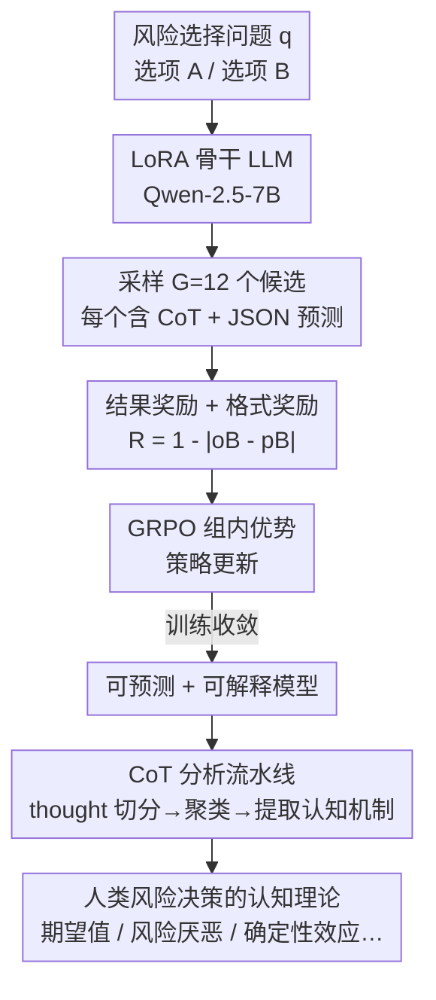

# Using Reinforcement Learning to Train Large Language Models to Explain Human Decisions

**会议**: ICLR 2026  
**OpenReview**: [https://openreview.net/forum?id=coJPBEZ9Te](https://openreview.net/forum?id=coJPBEZ9Te)  
**领域**: 强化学习 / 认知建模  
**关键词**: 强化学习, GRPO, 认知模型, 思维链, 风险决策

## 一句话总结
用基于结果奖励的强化学习（GRPO）后训练一个 LLM，让它在预测人类风险决策比例的同时，把推理过程显式写成思维链——这些思维链就成了关于人类如何决策的「可解释认知理论」，预测精度与监督微调（SFT）相当，但额外给出了 SFT 拿不到的自然语言解释。

## 研究背景与动机
**领域现状**：认知建模的目标是既能**预测**人类行为、又能**解释**背后的认知机制。近年来用神经网络（乃至直接对 LLM 做监督微调，如 Centaur 模型）拟合大规模行为数据，预测精度节节攀升，已经超过了文献里的领域专用认知模型。

**现有痛点**：这些模型预测强、解释弱。它们是黑箱——你知道它能预测 71% 的人会选某个选项，但不知道「为什么」，拿不到关于人类心理过程的可读理论。Centaur 这类 SFT 模型直接学着输出一个数字，中间没有任何可供认知科学家检视的推理。

**核心矛盾**：预测准确 ≠ 理解认知。要深化对人类心智的理论认识，光靠「行为对得上」是不够的，必须有可被人检视、可解释的中间机制。

**本文目标**：让一个 LLM 同时充当「预测器 + 解释器」——既准确预测人类风险选择的群体比例，又用自然语言把它的推理（即认知机制）讲出来。

**切入角度**：会推理的 LLM 在给出最终答案前会生成一段思维链（CoT）。作者的关键假设是：**把这段 CoT 当作对潜在认知机制的「口头化记述」**。如果训练能让 CoT 既改善预测、又言之有物，那认知科学家就能直接读这些 CoT 来获得人类决策的理论。

**核心 idea**：用「结果奖励」的强化学习（RLVR）代替监督微调——把人类选择比例直接接到 RL 的奖励函数上，逼着 LLM 自发产生**有用的**推理链；CoT 不是副产品，而是被奖励信号筛选出来的、能解释数据的认知理论。

## 方法详解

### 整体框架
作者在最大的人类风险选择数据集 choices13k（13,102 训练 / 1,462 测试问题）上，比较三种后训练策略，骨干统一为 Qwen-2.5-7B-Instruct，统一挂同一套 LoRA（rank=alpha=32，约 80.74M 可训练参数，占 1.05%）：（i）标准 SFT；（ii）Centaur 式 SFT（只对人类数据 token 计损失）；（iii）基于 GRPO 的 RL。前两者直接学着输出 JSON 数字预测，没有中间推理；只有 RL 模型被训练成「先写一段 CoT 推理、再给 JSON 预测」，并且每个候选回答按它对人类比例的预测好坏来打奖励。训练完成后，再对 RL 模型产出的 CoT 做一套分析流水线（切分 thought → 句向量嵌入 → 聚类 → 提取认知机制），把「模型学到的推理」翻译成「人类风险决策的认知理论」。

整条 RL 管线如下：

### 关键设计

**1. 把人类选择比例直接做成 RL 奖励，用 GRPO 逼出有用的 CoT**

痛点是：SFT 让模型直接背一个数字，无法产生可解释的中间推理。本文改用 GRPO 后训练——对同一个问题 $q$，模型采样 $G=12$ 个候选回答 $o_1,\dots,o_G$（每个最长 1024 token，含 CoT + JSON 预测），并用一个**基于结果**的奖励来评分：奖励等于「1 减去模型预测的选项 B 概率与人类实际选 B 比例之差的绝对值」，

$$R(q,o) = \begin{cases} 1 - |o_B - p_B| & \text{若 } o \text{ 合法} \\ 0 & \text{否则}\end{cases}$$

其中 $o_B$ 是模型预测的选 B 概率，$p_B$ 是人类选 B 的真实比例；合法要求 $0\le o_A,o_B\le 1$ 且 $o_A+o_B=1$。另加一个**格式奖励**（最高 0.5）：恰好输出一个 JSON 加 0.25，行为预测出现在推理 token 之后再加 0.25，鼓励「先推理后预测」的结构。优势函数采用 GRPO Done Right 的写法，只减组内均值、**不除标准差**：$A_i = R(q,o_i) - \text{mean}(\{R(q,o_1),\dots,R(q,o_G)\})$，再用 token 级裁剪的 PPO 代理损失更新（非对称裁剪 $\epsilon_{low}=0.2,\epsilon_{high}=0.28$，KL 惩罚 $\beta=10^{-4}$）。

它和 Centaur 式 SFT 的本质区别在于：Centaur 式 SFT 仍在「下一个 token 预测」框架内，作用于数字的**分词表示**；而 RL 用预测出的**数值本身**算奖励，再用奖励加权策略更新。这种「奖励加权的策略优化」被认为有更好的下游泛化，也正是它能在不喂任何推理标注的情况下，自发涌现出有意义 CoT 的原因。

**2. 把 CoT 当认知理论：切分 thought、聚类、提取认知机制**

光产生 CoT 不够，还得证明它是**可解释、可被认知科学利用**的。RL 模型的 CoT 通常是条目化的（一段段清晰步骤），作者用正则解析把每条 CoT 切成更小的「thought」单元，用 SBERT 的 all-MiniLM-L6-v2 做句向量嵌入，t-SNE 降到二维，再用 k-means 聚出 9 个簇，每簇用质心 thought 的摘要打标签。结果显示 RL 模型的推理可归为五类策略：精确计算两个选项的期望值、基于期望值做粗比较、考虑心理偏差、纳入风险偏好与结果波动性、以及依据期望值差异大小给出最终预测。

更进一步，作者用 GPT-4.1 对 CoT 做主题归纳，统计训练过程中「认知机制」的占比演化：**期望值计算**和**风险厌恶**是最高频的两类（各约占 29%–36% 的 thought），还涌现出损失厌恶、确定性效应、概率加权、框架效应、模糊厌恶等经典行为经济学概念。这一点本身就是对认知科学的洞见——它提示：相比文献里大量聚焦「偏离理性的启发式与偏差」，模型反而把「算期望值 + 风险厌恶」这类**偏理性**的力量当作解释人类风险选择的主导因素，暗示值得发展基于理性原则的新理论。

**3. 数据控制 + 模型控制：验证 CoT 是被数据塑造、且依赖骨干能力**

为说明 CoT 不是模型乱编、而是真正被训练数据结构塑造，作者做了两组控制实验。**数据控制**：把人类真实选择比例换成「期望值最大化模型」生成的合成比例（B 期望值更大则选 B 概率设为 1，更小设为 0，相等设 0.5），用它当奖励信号。RL 模型很快学会把 CoT 集中到「计算并比较期望值」上，风险厌恶虽不再必要却偶有残留（可能源于 prompt 里仍暗示这是人类风险任务），并正确识别出理性选择理论、非黑即白思维等与合成数据匹配的机制——说明 RL 会**自适应地把推理策略对齐到训练数据的结构**。**模型控制**：换更弱的 Gemma-2-2B-Instruct 重做，RL 反而**显著差于** SFT 和 Centaur 式 SFT，CoT 里压根没学会计算和比较期望值；而 SFT/Centaur 即便没有解释、仍能把预测做到与 Qwen 相当。这两点共同说明：CoT 的质量强依赖骨干 LLM 的能力，且 RL 与 SFT 的泛化模式不同。

### 损失函数 / 训练策略
RL 用 GRPO Done Right 目标（token 级裁剪 PPO 代理损失 + KL 惩罚），3 个 epoch、学习率 $3\times10^{-6}$、余弦调度、组大小 $G=12$。对照组 SFT/Centaur 式 SFT 各训 6 个 epoch、学习率 $10^{-5}$、AdamW、梯度累积 8。三种方法共用同一套 LoRA 配置与同一份 90/10 划分。评测用 vLLM，temperature=0.7、top-p=0.95、top-k=50；RL 模型允许生成至多 1024 token（要容纳推理），SFT/Centaur 仅限 30 token（直接出数字）。

## 实验关键数据

### 主实验
三种后训练方法在测试集上的预测精度**统计上无显著差异**——RL 在拿到可解释 CoT 的同时，预测并没有变差。

| 方法 | 测试集 MSE | 标准误 | 是否产出可解释 CoT |
|------|-----------|--------|-------------------|
| SFT | .0144 | .0006 | 否 |
| Centaur 式 SFT | .0155 | .0006 | 否 |
| RL（GRPO） | .0148 | .0006 | **是** |

显著性检验：SFT vs Centaur（$t(2923)=-1.31, p=0.19$）、SFT vs RL（$t(2923)=-0.58, p=0.56$）、RL vs Centaur（$t(2923)=0.78, p=0.43$），均不显著。参考：Peterson et al. (2021) 用问题特征（非文本）的最优神经网络 Mixture of Theories 达 MSE .0113，神经增强前景理论为 .0204。RL 模型按训练样本数衡量误差下降更快（最低 MSE 出现在约 2.6 epoch，SFT/Centaur 需约 5.86 epoch），但 RL 每个样本要生成 12 个候选、算力开销显著更高。

### 消融 / 控制实验

| 配置 | 关键现象 | 说明 |
|------|---------|------|
| RL + 人类数据（主实验） | CoT 以期望值计算、风险厌恶为主（各 29%–36%） | 涌现出损失厌恶、确定性效应等经典机制 |
| RL + 合成 EV 数据（数据控制） | CoT 迅速聚焦「算期望值并比较」 | 推理策略自适应到数据结构；风险厌恶基本退场 |
| RL + 弱骨干 Gemma-2-2B（模型控制） | RL 显著差于 SFT/Centaur，CoT 不会算期望值 | CoT 质量强依赖骨干能力 |
| RL 格式奖励 | 训练几步即触顶 0.5；补全长度稳定在 500–650 token | 格式很快学会，长度先增后稳 |

### 关键发现
- **可解释性是「免费午餐」**：RL 把预测精度做到与 SFT 持平，却额外换来一整套可被认知科学家阅读的 CoT 解释——SFT 完全拿不到这层。
- **CoT 由数据塑造、可因果干预**：换成合成 EV 数据后 CoT 随之改变，证明推理不是模型空想，而是反映训练信号的结构（论文另在附录做了 CoT swapping 等因果性检验）。
- **强依赖骨干**：弱模型（Gemma-2B）上 RL 反而崩，且学不会算期望值；这说明 RL 是「把骨干里已有的心理学理论表征唤出来」，骨干没有就唤不出。
- **理论启示**：模型把「期望值 + 风险厌恶」当主导力量，提示理性化解释可能被低估。

## 亮点与洞察
- **奖励即理论筛选器**：把人类选择比例直接当奖励，等于让 RL 在骨干模型隐含的众多心理学理论里，挑出最能解释数据的那些「浮」到 CoT 表面——这是 RLVR 用在认知建模上的巧妙再诠释。
- **CoT → 认知机制的可量化流水线**：thought 切分 + SBERT 嵌入 + 聚类 + LLM 归纳，把「一堆自然语言推理」变成可统计、可随训练演化追踪的认知机制占比，方法本身可迁移到任何需要从 CoT 里挖结构的研究。
- **双控制实验设计干净**：数据控制证「CoT 被数据塑造」、模型控制证「CoT 依赖骨干」，两个反事实把因果与边界条件都框住了，远比只报一个 MSE 有说服力。
- **可迁移性**：这套「outcome-reward RL 唤出可解释 CoT」的范式不限于风险选择，可推广到记忆、学习、问题求解等其它认知建模领域。

## 局限与展望
- **唤出假设（elicitation hypothesis）的天花板**：作者自承，RL 后训练只能「唤出」骨干里已有的理论，几乎不可能发明全新机制——例如一个在前景理论提出之前预训练的 LLM，RL 不太可能后训练出前景理论。
- **算力昂贵**：RL 每个样本要采样 12 个候选，开销远高于直接喂数据的 SFT/Centaur。
- **强依赖骨干能力**：弱骨干上 RL 直接失效，限制了在小模型上的适用性。
- **RLHF/RLAIF 替代未充分探索**：用专家或更强 LLM 当裁判（RLAIF）可能给出更细的奖励，但受限于专家标注资源，本文未做；商用 RL 微调服务因不透明也被排除。
- **RL 与 SFT 泛化差异未厘清**：何时、如何把两者结合以得到更鲁棒又可解释的认知模型，仍是开放问题。

## 相关工作与启发
- **vs Centaur 式 SFT（Binz et al., 2025）**：Centaur 用选择性掩码的 SFT 把 LLM 适配到认知任务、预测很强，但只输出数字、没有解释；本文在「下一 token 预测」之外改用 RL，奖励作用于数值本身而非其分词形式，从而额外产出可解释 CoT，预测精度持平。
- **vs 标准 SFT**：标准 SFT 即自回归学人类比例，同样无中间推理；RL 的差别是用结果奖励加权策略更新，被认为泛化更好。
- **vs LLM 自动发现认知模型（Castro et al., 2025; Rmus et al., 2025）**：那类工作让 LLM 生成可执行符号程序（如 Python）再拟合数据、靠 in-context learning，不微调模型；本文则**微调** LLM，让解释以自然语言 CoT 形式涌现。
- **vs predict-then-explain（先训预测模型再做可解释性归因）**：传统路线靠人类研究者提出的特征 + 事后归因，归因有时脆弱；本文同时优化预测与解释，由 LLM 自动探索能解释数据的假设，更自动但更依赖骨干能力。

## 评分
- 新颖性: ⭐⭐⭐⭐⭐ 首次把 RLVR 用于「同时预测+解释」人类认知，把 CoT 重新定位成可检验的认知理论
- 实验充分度: ⭐⭐⭐⭐ 三方法对比 + 数据/模型双控制 + CoT 因果性分析扎实，但仅限风险选择单一领域、单一数据集
- 写作质量: ⭐⭐⭐⭐⭐ 动机层层递进，方法与控制实验逻辑清晰
- 价值: ⭐⭐⭐⭐⭐ 给认知科学提供了一条「用 RL 从 LLM 唤出可读理论」的新范式，方法高度可迁移

<!-- RELATED:START -->

## 相关论文

- [\[ICLR 2026\] On Predictability of Reinforcement Learning Dynamics for Large Language Models](on_predictability_of_reinforcement_learning_dynamics_for_large_language_models.md)
- [\[ICLR 2026\] Revolutionizing Reinforcement Learning Framework for Diffusion Large Language Models](revolutionizing_reinforcement_learning_framework_for_diffusion_large_language_mo.md)
- [\[ICLR 2026\] Post-training Large Language Models for Diverse High-Quality Responses](post-training_large_language_models_for_diverse_high-quality_responses.md)
- [\[ICLR 2026\] TROLL: Trust Regions improve Reinforcement Learning for Large Language Models](troll_trust_regions_improve_reinforcement_learning_for_large_language_models.md)
- [\[ICLR 2026\] Robust Multi-Objective Controlled Decoding of Large Language Models](robust_multi-objective_controlled_decoding_of_large_language_models.md)

<!-- RELATED:END -->
