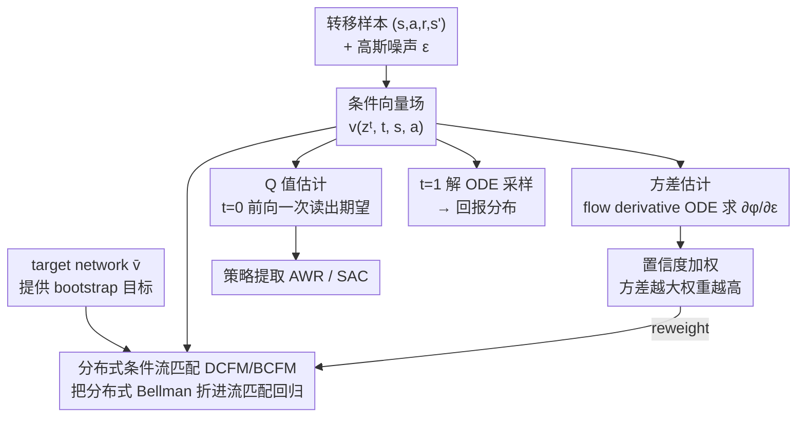

# Value Flows

**会议**: ICLR 2026  
**arXiv**: [2510.07650](https://arxiv.org/abs/2510.07650)  
**代码**: [GitHub](https://github.com/chongyi-zheng/value-flows)  
**领域**: 强化学习 / 分布式 RL / 生成模型  
**关键词**: distributional RL, flow matching, return distribution, uncertainty quantification, OGBench

## 一句话总结
Value Flows 首次将流匹配（flow matching）引入分布式 RL——学习一个向量场使生成的概率密度路径自动满足分布式 Bellman 方程，通过 flow derivative ODE 高效估计回报方差实现置信度加权优先学习，在 OGBench 62 个任务上平均 1.3× 成功率提升，回报分布估计精度比 C51/CODAC 好 3×+。

## 研究背景与动机
**领域现状**：标准 RL 将未来回报压缩为单个标量 Q 值。分布式 RL（C51、QR-DQN、IQN）建模完整回报分布，提供更强的学习信号并支持探索/安全 RL 应用。

**现有痛点**：
   - **C51**：将回报分布离散化为固定 bin → 分辨率有限、无法捕获细粒度分布结构
   - **IQN/QR-DQN**：用有限分位数近似 → 分位数间的分布信息丢失
   - **方差估计困难**：离散化方法难以精确估计回报方差，而方差是不确定性量化的关键
   - 现代生成模型（扩散/流匹配）已在轨迹/策略建模中成功，但尚未用于回报分布建模

**核心矛盾**：如何学习完整的连续回报分布（而非离散化近似），并从中高效提取期望、方差，用于改进策略学习？

**核心 idea**：用流匹配学习回报分布的向量场 $v(z^t | t, s, a)$——构造满足分布式 Bellman 方程的流匹配目标（DCFM loss），通过 flow derivative ODE 无需反向传播即可估计方差

## 方法详解

### 整体框架
Value Flows 要解决的是：怎么不靠离散化、直接学出一条状态-动作对应的**连续回报分布**，并从中顺手把期望和方差都拿出来用。它把这个问题交给流匹配——从一个标准高斯噪声 $\epsilon$ 出发，让一个条件向量场 $v(z^t | t, s, a)$ 驱动一条 flow ODE，沿着时间 $t$ 把噪声逐步搬运成回报样本；这条 ODE 诱导出一条概率密度路径 $p(z^t | t, s, a)$，在 $t=1$ 时恰好收敛到真正的回报分布 $p_{Z^\pi}(z | s, a)$。训练时不用任何采样轨迹的真值分布，而是构造一个像 TD 学习的回归目标（DCFM loss）让向量场自洽。

学出这个向量场后，同一套东西被分头复用：在 $t=0$ 前向一次就能读出期望（Q 值）当 critic；在 $t=1$ 解 ODE 采样得到整条回报分布；再并行解一条 flow derivative ODE 估出回报方差，并用这个方差给训练样本加权，把学习预算倾斜给不确定性高的转移——加权又回流到 DCFM 损失上，形成一个"估方差→重训练"的回环。

### 关键设计

**1. 分布式条件流匹配（DCFM）损失：把分布式 Bellman 方程变成可回归的流匹配目标**

最根本的痛点是没有回报分布的真值可以监督——回报分布本身就是要学的东西。Value Flows 的解法是把分布式 Bellman 算子 $\mathcal{T}^\pi$ 折进流匹配的更新里：构造下一轮的向量场 $v_{k+1}(z^t|t,s,a)$，让它生成的密度恰好等于对当前密度 $p_k$ 施加 $\mathcal{T}^\pi$ 之后的结果。落到损失上就是一个最小二乘回归

$$\mathcal{L}_{DCFM}(v, v_k) = \mathbb{E}_{(s,a,r,s') \sim D}\Big[\big(v(z^t|t,s,a) - v_k(\tfrac{z^t-r}{\gamma}|t,s',a')\big)^2\Big].$$

这里的妙处在于回归目标 $v_k(\frac{z^t-r}{\gamma}|t,s',a')$ 正好扮演 TD 学习里 bootstrap target 的角色——它对应标量 Q-learning 中的 $r + \gamma Q(s',a')$，只不过现在 bootstrap 的是整条分布而非单个标量：用下一状态当前估计的向量场，先在缩放平移过的输入上取值，再当作本状态的回归目标。论文用 Proposition 2 证明这个条件化的 DCFM 损失与理论上的分布式流匹配（DFM）损失梯度相同，这正是 CFM 之于 FM 那套"条件期望可省略"技巧的搬用，因此可以放心用单样本估计。为了避免自举把分布拉塌，实际训练用一个 target network $\bar v$ 提供 bootstrap 目标，得到的 bootstrapped 版本即 BCFM loss。

**2. Q 值估计（Proposition 3）：一次前向传播就能当 critic 用**

如果每次要 Q 值都得把 ODE 从 $t=0$ 积分到 $t=1$ 再求样本均值，这套东西在 actor-critic 里就太慢了。Proposition 3 给出一个捷径：回报的期望可以直接用 $t=0$ 处向量场对噪声的期望读出来，

$$\hat{\mathbb{E}}[Z^\pi(s,a)] \approx \mathbb{E}_{\epsilon \sim \mathcal{N}}\big[v(\epsilon \mid 0, s, a)\big].$$

也就是说，期望回报不需要解 ODE，只要在初始时刻对几个噪声样本前向传播一次再平均即可。这把 Value Flows 的 critic 计算成本压到和标准 Q 网络同级，完整的 ODE 求解只在确实需要整条分布（采样、估方差）时才动用，于是它可以无缝接进 advantage-weighted regression 或 SAC 这类 actor-critic 框架当 critic。

**3. 方差估计（Flow Derivative ODE）：让不确定性成为流匹配的免费副产品**

期望好拿，方差才是不确定性量化真正想要的，而离散化方法（C51/IQN）估方差往往要额外算二阶矩或上 ensemble。Value Flows 注意到方差信息其实藏在 flow 对初始噪声的敏感度里：定义一条与主 ODE 并行的 companion ODE

$$\frac{d}{dt}\Big(\frac{\partial \phi}{\partial \epsilon}\Big) = \frac{\partial v}{\partial z}\cdot \frac{\partial \phi}{\partial \epsilon},$$

其中 $\partial\phi/\partial\epsilon$ 是生成映射 $\phi$ 对初始噪声 $\epsilon$ 的导数。在 $t=1$ 时 $|\partial\phi/\partial\epsilon|$ 反映这一点局部密度被拉伸/压缩的程度——拉伸越剧烈说明分布越宽、方差越大。关键是这条 companion ODE 可以和主 ODE 一起前向积分（或用 forward-mode 自动微分），**完全不需要反向传播穿过 ODE solver**，所以方差几乎是搭主流程顺风车得到的，这是流匹配框架相对传统分布式 RL 的独特红利。

**4. 置信度加权训练：用方差把学习预算倾斜给高不确定性转移**

有了逐样本的方差代理 $|\partial\phi/\partial\epsilon|$，自然可以做有原理依据的优先回放。每个转移的训练权重取

$$w = \sigma\!\big(-\tau / |\partial\phi/\partial\epsilon|\big) + 0.5,$$

$|\partial\phi/\partial\epsilon|$ 越大说明局部密度变化越剧烈、回报越不确定，权重就越高。和经典 PER 不同的是，这里的优先级来自数据本身的 aleatoric uncertainty（环境随机性导致的回报分布展宽），而不是 bootstrapped TD error，因此在覆盖不均匀的数据上更稳、更指向真正难学的转移。

### 损失函数 / 训练策略
总损失是 BCFM loss（bootstrapped DCFM，结构上类似 fitted Q-learning）叠上面的置信度权重，target network 用 EMA 缓慢更新提供稳定 bootstrap 目标。策略提取沿用 advantage-weighted regression 或 SAC，整套方法同时支持纯 offline 与 offline-to-online 两种设置。

## 实验关键数据

### OGBench（62 个任务，37 state-based + 25 image-based）

| OGBench 领域 | BC | IQL | ReBRAC | FQL | **Value Flows** |
|---|---|---|---|---|---|
| cube-double-play | 2 | 6 | 12 | 29 | **69±4** |
| puzzle-3x3-play | 2 | 9 | 22 | 30 | **87±13** |
| scene-play | 5 | 28 | 41 | 56 | **59±4** |
| **平均成功率** | — | — | — | — | **1.3× 提升** |

### 回报分布估计精度

| 方法 | 1-Wasserstein 距离 ↓ |
|------|---------------------|
| C51 | ~0.09 |
| CODAC | ~0.06 |
| **Value Flows** | **~0.02** |

Value Flows 的分布估计精度比 C51 好 4.5×，比 CODAC 好 3×。

### 消融实验

| 配置 | 效果 | 说明 |
|------|------|------|
| 无置信度权重 | 性能下降 | 优先学习高不确定性转移的必要性 |
| 无 bootstrapped target | 退化/坍缩 | DCFM 单独使用不够稳定 |
| Q 值估计 vs ensemble average | Value Flows 更准 | 单网络估计就够好 |
| Offline-to-online fine-tune | 进一步提升 | 方差估计自然支持在线探索 |

### 关键发现
- 流匹配提供了比离散化方法（C51）和分位数方法（IQN）**显著更精确**的回报分布估计
- Q 值估计只需 $t=0$ 处前向传播——计算成本与标准 Q 网络相当（不需要完整 ODE 求解）
- 置信度加权带来一致的性能提升，特别在数据覆盖不均匀的 play 数据集上
- Image-based 任务上也有效（25 个 image 任务全面提升），说明方法与 vision backbone 兼容
- Offline-to-online 设置中，方差估计自然提供探索信号，无需额外探索策略

## 亮点与洞察
- **流匹配 ↔ 分布式 Bellman 的优雅对应**：DCFM loss 是分布式 TD learning 的连续生成模型版本——向量场是"critic"，flow ODE 是 "rollout"。这个理论联系非常自然且优美
- **方差作为副产品**：传统分布式 RL 的方差估计需要额外手段（如 ensemble、二阶矩网络），Value Flows 通过 flow derivative ODE 自然获得——是流匹配框架的独特优势
- **一次前向传播得 Q 值**（Proposition 3）是关键实用特性——意味着推理时不比标准 Q 网络更慢，ODE 求解只在需要完整分布时使用

## 局限与展望
- 无法区分认知不确定性（epistemic，来自数据不足）和随机不确定性（aleatoric，来自环境随机性）——置信度权重只反映 aleatoric
- ODE 求解增加训练和分布采样时的计算开销（但 Q 估计不需要）
- 仅在连续控制上测试（OGBench + D4RL），无 Atari 等离散动作空间基准
- 1D 回报标量的生成模型相对简单——流匹配的优势在这里可能已经接近上限
- 缩放到更大的动作空间和更长的 horizon 时是否仍然有效需要验证

## 相关工作与启发
- **vs C51**：将回报离散化为 51 个 bin + KL 散度优化；Value Flows 用连续流匹配直接建模密度，精度高 4.5×
- **vs IQN**：用有限分位数近似；Value Flows 学习完整连续分布
- **vs CODAC**：用 ODE 建模分布但不基于流匹配框架；Value Flows 理论更自然、精度高 3×
- **对生成模型 + RL 的启示**：继轨迹生成（Diffuser）、策略生成（DDPO）之后，Value Flows 展示了生成模型在 critic 端（值函数）的应用——完成了 actor-critic 的"生成模型化"

## 评分
- 新颖性: ⭐⭐⭐⭐⭐ 流匹配 + 分布式 RL 的全新组合，理论联系优雅
- 实验充分度: ⭐⭐⭐⭐⭐ 62 个任务（state + image）× 8 seeds × 多基线 × 分布估计精度 × 消融
- 写作质量: ⭐⭐⭐⭐⭐ 理论推导严谨，从 DFM → DCFM → BCFM 的逐步简化很清晰
- 价值: ⭐⭐⭐⭐⭐ 为分布式 RL 开辟了生成模型的新路径，方差估计的副产品特性有广泛应用前景

<!-- RELATED:START -->

## 相关论文

- [\[ICLR 2026\] ReFORM: Reflected Flows for On-support Offline RL via Noise Manipulation](reform_reflected_flows_for_on-support_offline_rl_via_noise_manipulation.md)
- [\[ICLR 2026\] From Ticks to Flows: Dynamics of Neural Reinforcement Learning in Continuous Environments](from_ticks_to_flows_dynamics_of_neural_reinforcement_learning_in_continuous_envi.md)
- [\[ICLR 2026\] Relative Value Learning](relative_value_learning.md)
- [\[ICLR 2026\] Universal Value-Function Uncertainties](universal_value-function_uncertainties.md)
- [\[ICLR 2026\] Offline Preference-based Value Optimization](offline_preference-based_value_optimization.md)

<!-- RELATED:END -->
