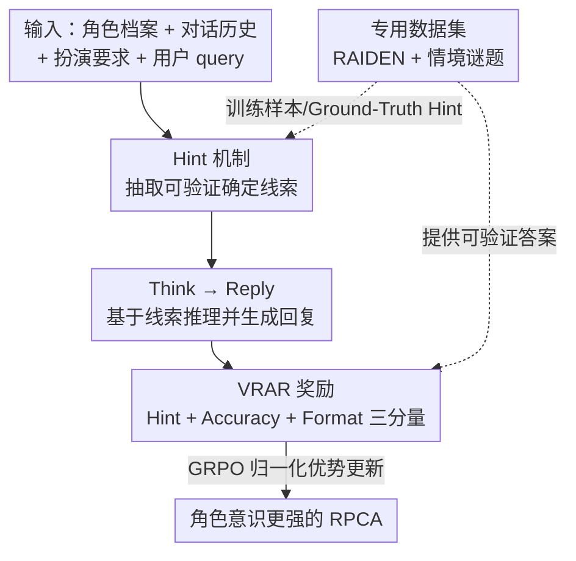

# VeriRole: Verifiable Role-Awareness through Hint-Guided Reinforcement Learning

**会议**: ICLR 2026  
**OpenReview**: [https://openreview.net/forum?id=lW7kMpMj9K](https://openreview.net/forum?id=lW7kMpMj9K)  
**代码**: https://github.com/FrontierLabs/VeriRole  
**领域**: 对齐RLHF / 强化学习 / 角色扮演  
**关键词**: 角色扮演对话、可验证奖励、Hint 机制、GRPO、role-awareness

## 一句话总结
针对角色扮演这种"没有标准答案、难以设计可验证奖励"的开放式任务，本文用一个 **Hint 机制**先从角色档案/对话历史/扮演要求中抽取确定性线索，再以此为锚设计 **可验证角色意识奖励（VRAR）** 做 GRPO 训练，让 Qwen2.5-32B 在 RAIDEN 上平均分提升 18.9%、CharacterEval 提升 4.55%，同时保住角色扮演的创造性与文风多样性。

## 研究背景与动机
**领域现状**：角色扮演对话智能体（RPCA，如 Character.ai、Talkie）已是工业级应用，主流提升路线一是合成更高质量的对话语料做数据驱动训练，二是借鉴 OpenAI-o1 / DeepSeek-R1 的 Chain-of-Thought（CoT）来增强推理，从而在误导性提问、复杂上下文下维持"角色意识"（role-awareness）。

**现有痛点**：把 CoT/RL 直接搬到角色扮演上会撞两堵墙。其一是**非可验证性**——角色扮演是开放式生成，同一个 query 往往没有唯一正确答案（论文 Figure 1 的例子：用户错误地说哈利波特 11 岁学会守护神咒，模型可以为了叙事流畅接受错误前提、可以给出枯燥但事实正确的回答、也可以既准确又有创意），这让 RL 无法定义客观奖励信号。其二是**推理反噬文风**——已有研究发现用通用任务训练出来的推理能力反而会损害角色扮演表现，过于正式、冗长的思维链会牺牲风格表达和回复质量（本文实验也复现了这点）。

**核心矛盾**：可验证性（要客观奖励就得有确定答案）和创造性（角色扮演的灵魂是文风多样、情感丰富）之间存在直接 trade-off——纯按"标准答案"打分会把模型逼成八股，放任创造性又没法做 RL。

**本文目标**：设计一种**专门针对角色扮演的推理形式**，既能提供可验证的奖励信号去做 RL，又不牺牲风格多样性这类创造性要素。

**切入角度**：作者观察到，角色扮演虽然鼓励多样回复，但仍受一批**不可协商的事实约束**——角色传记、档案设定、扮演边界要求等。这些事实是"确定的、可对照原文校验的"。如果先把这些确定线索单独抽出来，就能在这部分上施加可验证奖励，而把开放生成的部分留给宽松约束。

**核心 idea**：在 thinking 和生成之前插入一个 **Hint 预推理步骤**，从上下文里抽取可验证线索（要求尽量是原文精确片段，方便用 ROUGE 等客观指标打分），把推理锚定在可验证事实上，再围绕 Hint 设计 VRAR 奖励，用 GRPO 优化。

## 方法详解

### 整体框架
VeriRole 把一次角色扮演回复改造成 **Hint → Think → Reply** 的结构化生成：给定角色信息（Profile + 对话历史 + 扮演要求）和用户 query，模型先在 `<hint>...</hint>` 里抽出与 query 直接相关的确定性线索，再在 `<think>...</think>` 里基于线索做简短推理，最后产出符合人设的回复。训练时，系统把模型输出按这套结构拆开，用 **VRAR（可验证角色意识奖励）** 从 Hint 质量、答案正确性、格式三个维度打分，三者求和后送入 **GRPO** 做策略优化。整条管线的关键在于：奖励只对"可验证的 Hint 与确定答案"严格打分，而对最终开放回复施加轻量、宽松的约束，从而在可验证性和创造性之间解耦。

### 关键设计

**1. Hint 机制：把开放式角色扮演锚定到可验证线索**

这是整个框架的核心，直接对准"非可验证性"痛点。Hint 机制是一个**预推理步骤**，在 thinking 和生成之前，从三类来源抽取线索：角色档案（profile）、对话历史（dialogue history）、扮演要求（role-playing requirements）。比如用户问福尔摩斯办公室地址，理想 Hint 是 `<hint>[profile] 221B Baker Street</hint>`，精确匹配档案原文；用户问跳出人设的（OOC）时尚问题，则应抽取扮演要求里"回答需尊重角色边界"这类线索。Hint 必须满足两条性质：**可验证性**——优先是源文本的精确拷贝，这样才能用 ROUGE 这类客观指标算奖励；**上下文特异性**——像"保持人设一致"这种放之四海皆准的通用指令不算有效 Hint，机制只挑与当前上下文真正相关的线索。这一步的价值在于把"该参考哪条事实"显式化、可校验化，从而为 RL 提供抓手，同时不去约束最终回复的措辞。

**2. 两个专用数据集：RAIDEN + 情境谜题（海龟汤）互补**

为支撑 Hint 模块训练，作者构建了两类样本。第一类来自 **RAIDEN** 角色扮演基准——它每个对话轮都标注了评测目标，作者据此挑了 7 个类别并对齐到 Hint 来源：SBK（剧本知识）、SCK（剧本矛盾知识）、CM（对话记忆）对应"档案/历史"类 Hint；RCB（角色认知边界）、TS（话题转移）、TA（话题推进）对应"扮演要求"类 Hint；CC（闲聊）则用来教模型在没有约束时输出**空 Hint**。为保证 Hint 精度，先过滤掉 baseline（Qwen2.5-14B）能轻松答对的简单样本，再用多步精炼（Question-Type Filtering 只留 WH 问句、Entity-Type Validation、Cardinality Constraint 保证恰好一个有效关键词），并要求关键词在 GPT-4/MiniMax/Baichuan-NPC/GPT-3.5 多个模型参考答案里一致出现才算有效。第二类是新构建的**情境谜题数据集**（"海龟汤"，靠 yes/no 提问还原完整叙事）：它有唯一最终解，因此能提供可验证的回答正确性奖励，且对复杂推理要求更高。该数据由人工双标注（讲述者+解谜者）多轮对话生成，再用 LLM 抽取"直接导向最终解的关键提问"作为 Ground-Truth Hint，最后做角色扮演适配（把解谜者设成有人设的当代角色，避免历史人物面对现代谜题的 OOC 风险）。两个数据集互补：情境谜题主攻逻辑/事实类技能（SBK/CM/SCK），RAIDEN 则在所有维度上都有增益。

**3. VRAR 可验证角色意识奖励：Hint / Accuracy / Format 三分量**

VRAR 是把"非可验证"任务变成"可量化信号"的关键，由三部分相加：$r_i = R_{hint} + R_{acc} + R_{format}$。

**Hint 奖励**评估模型 Hint 与 Ground-Truth Hint 的对齐，分三步：先做**抽取与结构匹配**（从 `<hint>` 标签里取出 $H_{gen}$，抽取失败直接 0 分；再检查是否覆盖 Ground-Truth 里出现的所有线索来源类型，缺任一来源该项即 0）；再做**逐来源内容评估**，对每个结构正确的来源算复合分

$$R_{source} = P_{len}(H_{gen}, H_{gt}) \times \big(\alpha \cdot Sim_{cos}(H_{gen}, H_{gt}) + (1-\alpha)\cdot S_{ROUGE}(H_{gen}, H_{gt})\big)$$

其中 $S_{ROUGE} = \beta\cdot\text{ROUGE-1} + (1-\beta)\cdot\text{ROUGE-L}$ 度量字面精确匹配（保证可验证性），$Sim_{cos}$ 是句向量余弦相似度（让"语义对但措辞不同"的 Hint 也能拿部分分），$P_{len}=1-\frac{||H_{gen}|-|H_{gt}||}{||H_{gen}|-|H_{gt}||+|H_{gt}|}$ 惩罚长度偏差。最后做**聚合与离散化**：N 个来源取均值 $R_{avg}=\frac{1}{N}\sum R_{source,i}$，再按步长 $1/D$ 离散化 $R_{hint}=\text{round}(R_{avg}\times D)/D$，避免模型为可忽略的微小分差强行排序、提升稳定性。

**Accuracy 奖励**评估最终回复正确性：RAIDEN 中 SBK/SCK/CM 这类有确定答案的子类用**关键词匹配**（$K_{gt}\in A_{gen}$ 给 1.0，否则 0.0）；情境谜题答案是复杂叙事，改用 **LLM-as-judge** 三档评分（Correct=1.0 / Partially Correct=0.3 / Incorrect=0.0）。注意 RCB/TS/TA 这类开放回复**不计**正确性奖励，以保留创造性。**Format 奖励**强制 `Hint-Think-Answer` 结构：满足主结构给基础分 0.6，但若违反"标签唯一性"或"无多余 HTML 标签"等约束则降到 0；上限设 0.6 是为了给结构学习足够信号又不盖过更关键的 Hint/Accuracy 奖励。

**4. GRPO 优化：用组内相对优势把可验证信号转成策略梯度**

框架用 **GRPO** 优化。对每个 query 采样一组 $G$ 个输出，先把每条总奖励 $r_i$ 在组内归一化得到优势 $A_i = \frac{r_i - \text{mean}(\{r\})}{\text{std}(\{r\})}$，再用带 clip 的 PPO 式目标加 KL 正则 $-\gamma D_{KL}(\pi_\theta\|\pi_{ref})$ 优化。选择 GRPO 而非 PPO，免去单独的 value 网络、靠组内相对比较给优势；相比 SFT，它用显式奖励信号教抽象技能（如话题推进、维持一致性），而不是只模仿数据集文风——这正是后文 SFT 在 TA 上崩盘、GRPO 大幅领先的根因。

### 损失函数 / 训练策略
训练目标为最大化 GRPO 目标函数（公式 10），由 VRAR 三分量之和驱动。训练数据配置：RAIDEN 训练集取 CM/SBK/SCK 共 2197 条（带"角色信息/对话历史" Hint）、RCB/TS/TA 共 567 条（开放回复，不计 accuracy 奖励）、CC 闲聊 500 条；情境谜题取 737 条（源自 328 个在线谜题，平均每个 2.24 段人工标注对话）。Hint 复合分超参默认 $\alpha=\beta=0.5$。情境谜题的 accuracy 奖励用 Claude 3.5 评判。

## 实验关键数据

### 主实验
基线为 Qwen2.5-14B/32B-Instruct、Qwen3-32B、Qwen3-30B-A3B-Instruct，外加专门训过角色扮演的 Peach-9B。评测用 RAIDEN（483 条未训练样本，Claude 3.5 + GPT-4o 双判）+ CharacterEval 补充。

| 模型 | RAIDEN Avg | 相对基线 |
|------|-----------|----------|
| Qwen2.5-32B-Instruct | 0.6953 | — |
| Qwen2.5-32B-GRPO（本文） | **0.8268** | **+18.9%** |
| Qwen2.5-14B-Instruct | 0.6302 | — |
| Qwen2.5-14B-GRPO（本文） | **0.7725** | 大幅提升 |
| Peach-9B-Raw | 0.3611 | — |
| Peach-9B-GRPO（本文） | **0.6183** | +71% |

CharacterEval 上 Qwen2.5-32B-GRPO 平均分 3.482 vs 基线 3.330（**+4.55%**），尤其 Persona Consistency（3.092→3.295）和 Engagingness（3.276→3.514）提升明显。

### 消融实验

| 配置（基于 Qwen2.5-32B-GRPO） | RAIDEN Avg | 说明 |
|------|---------|------|
| Full model | 0.8268 | 完整模型 |
| w/o Hint Reward | 0.6598 | 去掉 Hint 机制及相关奖励，掉到最低，TA 严重崩塌 |
| w/o Accuracy Reward | 0.8061 | 去掉答案正确性奖励，SBK/CM 掉点最明显 |
| RAIDEN-Only | 0.8143 | 只用 RAIDEN，各维度都涨 |
| Situation-Puzzle-Only | 0.7111 | 只用海龟汤，主提升逻辑/事实(SBK/CM/SCK)，抽象维度(RCB/TA)几乎不动 |
| SFT-reply | 0.6809 | SFT 只学回复，TA 仅 0.2835 |
| SFT-hint-and-reply | 0.7179 | SFT 学 Hint+回复，仍远逊 GRPO |

### 关键发现
- **Hint 机制贡献最大**：去掉 Hint 奖励平均分从 0.8268 跌到 0.6598，且 TA（话题推进）这类抽象会话技能急剧下滑——说明 Hint 不只管事实检索，还在引导抽象对话能力。
- **GRPO 完胜 SFT**：SFT 能模仿文风但学不会抽象技能，TA 仅 0.2835；GRPO 凭显式奖励把 TA 拉到 0.6865。在心理治疗师角色 post-training 实验里，GRPO 模型 SFT 后角色扮演能力几乎不掉，而 Instruct 基线掉得很厉害，证明鲁棒性。
- **两数据集互补**：海龟汤补逻辑/事实，RAIDEN 补全维度，合用最佳。
- **泛化性强**：在已训练过角色扮演的 Peach-9B、自带推理的 Qwen3-32B、MoE 的 Qwen3-30B-A3B 上都涨；且 Qwen3 自带的推理并不改善角色扮演（甚至无益），印证"通用推理反噬角色扮演"的动机。
- **超参稳健**：$\alpha,\beta$ 在 [0.3, 0.9] 区间表现平稳，默认 0.5 时 Qwen2.5-32B 取得最高 0.798（GPT-4o 评）。
- **Hint 分数与最终准确率正相关**：Hint Reward Score 越高，RAIDEN 上 GPT-4o 评的准确率越高（Figure 4b）。

## 亮点与洞察
- **把"无标答"任务拆成"可验证锚点 + 开放生成"两层**：核心巧思是不强求整条回复可验证，而是只把确定线索（Hint）单拎出来做严格可验证奖励，开放回复给宽松约束——优雅地化解了可验证性 vs 创造性的 trade-off。这个"先抽可验证子结构再施加客观奖励"的范式可迁移到任何缺乏唯一答案的生成任务（创意写作、共情对话）。
- **要求 Hint 是源文本精确拷贝**，使 ROUGE 这种古早字面指标重新派上用场，让 RL 奖励既客观又便宜（不必处处依赖 LLM judge）。
- **借海龟汤注入可验证推理**：用有唯一解的谜题作为"自带 ground-truth 的推理训练场"，再做角色化适配，是一个很省事的可验证推理数据来源。
- **空 Hint 设计**让模型学会"没有约束时不要硬编线索"，避免过度抽取。

## 局限与展望
- **依赖高质量标注与多模型一致性过滤**：Hint 的 Ground-Truth 靠多步精炼 + 4 个模型参考一致才算有效，海龟汤靠人工双标注，构建成本不低，难以快速扩展到任意新角色/新领域。
- **可验证性偏向"事实可对照"的场景**：对纯情感、纯风格类、没有任何可抽取线索的开放对话，Hint 机制能提供的抓手有限，VRAR 此时主要退化为 Format 奖励。
- **TA 指标的可比性 caveat**：Qwen3 系列 GRPO 后 TA 略降，作者归因于原模型爱生成长回复+反问（恰好讨好 TA 评测），GRPO 让回复变短所致——说明部分指标受回复长度风格影响，跨模型横比 TA 高低需谨慎。
- **LLM-as-judge 评测**：RAIDEN 与海龟汤正确性大量依赖 Claude 3.5 / GPT-4o 评判，评测器偏好可能引入系统性偏差。
- 改进方向：自动化 Hint 标注（减少人工）、把可验证锚点机制推广到多模态/更长程记忆的角色扮演。

## 相关工作与启发
- **vs 通用 CoT / o1-R1 式推理**：它们在数学/代码这类有标答任务上奏效，但本文实验证实把通用推理直接用于角色扮演无益甚至有害（文风变正式冗长）；VeriRole 设计的是角色扮演专用的 Hint-Think-Answer 结构化推理。
- **vs SFT 角色扮演（CharacterGLM 等数据驱动路线）**：SFT 只能模仿语料文风、学不会维持一致性/引导对话等抽象技能（本文 SFT 在 TA 上仅 0.28）；VeriRole 用 GRPO + 显式可验证奖励直接优化这些技能，并在 post-training 后更抗遗忘。
- **vs 直接对开放回复做 RL 打分**：开放回复无客观标准，奖励噪声大；VeriRole 把奖励主要施加在可验证的 Hint 与确定答案上，奖励信号更干净、更稳定。

## 评分
- 新颖性: ⭐⭐⭐⭐⭐ "Hint 可验证锚点 + VRAR"巧妙化解角色扮演 RL 的非可验证性，范式有迁移价值。
- 实验充分度: ⭐⭐⭐⭐ 覆盖 5 个不同规模/架构基线、双 benchmark、完整消融与超参分析，但评测重度依赖 LLM judge。
- 写作质量: ⭐⭐⭐⭐ 动机—方法—实验链条清晰，公式定义完整；个别图表说明略简。
- 价值: ⭐⭐⭐⭐⭐ 直击工业级 RPCA 的角色一致性痛点，数据已开源，实用性强。

<!-- RELATED:START -->

## 相关论文

- [\[ICLR 2026\] LongRLVR: Long-Context Reinforcement Learning Requires Verifiable Context Rewards](longrlvr_long-context_reinforcement_learning_requires_verifiable_context_rewards.md)
- [\[ICLR 2026\] From Verifiable Dot to Reward Chain: Harnessing Verifiable Reference-based Rewards for RL of Open-ended Generation](from_verifiable_dot_to_reward_chain_harnessing_verifiable_reference-based_reward.md)
- [\[ICLR 2026\] RLVMR: Reinforcement Learning with Verifiable Meta-Reasoning Rewards for Robust Long-Horizon Agents](rlvmr_reinforcement_learning_with_verifiable_meta-reasoning_rewards_for_robust_l.md)
- [\[ICLR 2026\] Rubrics as Rewards: Reinforcement Learning Beyond Verifiable Domains](rubrics_as_rewards_reinforcement_learning_beyond_verifiable_domains.md)
- [\[ICLR 2026\] Towards High Data Efficiency in Reinforcement Learning with Verifiable Reward](towards_high_data_efficiency_in_reinforcement_learning_with_verifiable_reward.md)

<!-- RELATED:END -->
