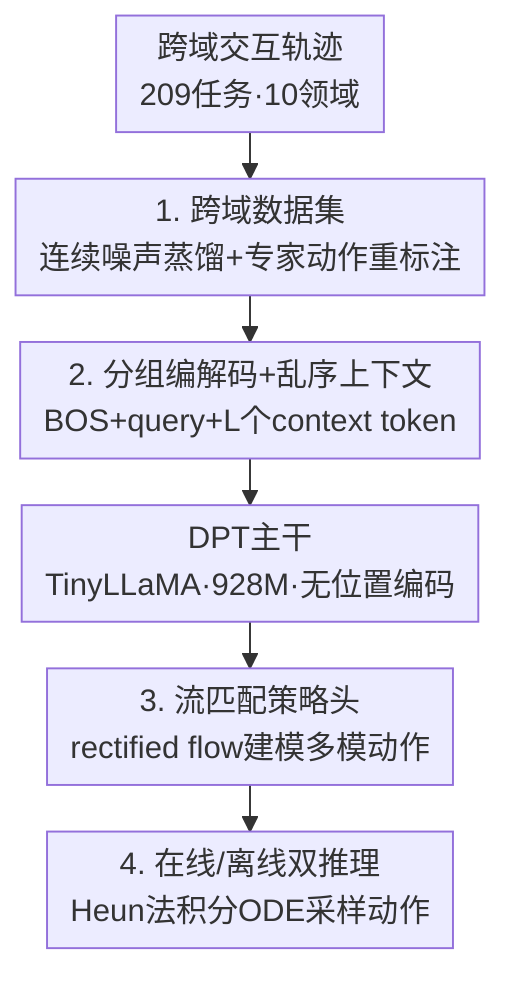

# Vintix II: Decision Pre-Trained Transformer is a Scalable In-Context Reinforcement Learner

**会议**: ICLR 2026  
**OpenReview**: [https://openreview.net/forum?id=t6roJiPN6Y](https://openreview.net/forum?id=t6roJiPN6Y)  
**代码**: 待开源（论文承诺 rebuttal 阶段向审稿人提供，并最终开源数据与代码）  
**领域**: 强化学习 / In-Context RL  
**关键词**: 上下文强化学习, Decision Pre-Trained Transformer, 流匹配, 后验采样, 通用智能体

## 一句话总结
本文把 Decision Pre-Trained Transformer（DPT）从简化离散环境扩展到 10 个领域、209 个任务的跨域连续控制场景，用 rectified flow（流匹配）策略头替换高斯头来建模多模态动作分布、同时保留 DPT 作为「贝叶斯后验采样」的解释，训出一个 928M 参数、可在线/离线两种模式同时工作的通用 Large Action Model，在 46 个未见任务上显著超越此前的 Vintix 与 REGENT。

## 研究背景与动机

**领域现状**：构建跨任务的通用智能体是 AI 的核心目标。在 NLP/CV 上靠「Transformer + 离线大数据预训练」已经取得很大进展，但 RL 领域的 Large Action Model 仍落后——主流做法是像 LLM 那样在离线轨迹上训练 Transformer（Gato、JAT），再用检索增强（REGENT）在推理时扩展，但这些系统**几乎不利用 reward 这个外部信号做实时策略修正**。

**现有痛点**：In-Context RL（ICRL）想把 LLM 的「给几条示例就能换行为、无需更新参数」迁移到 RL。两条旗舰路线各有短板：Algorithm Distillation（AD）被 Vintix（Polubarov 2025）扩到多域后，训练任务上很强但**对未见任务泛化有限**；DPT 理论上更优雅（它把上下文学习解释成对动作的后验采样），在简化域里 ICRL 能力更强，**但从没被验证能 scale 到多域连续控制**。

**核心矛盾**：随着任务多样性上升，需要更有表达力的策略类来蒸馏越来越多模态的行为。可原版 DPT 及其变体主要面向离散动作（采样直接 argmax 即可），少数做连续动作的版本用高斯头——而**高斯头无法刻画多模态动作后验，造成 likelihood 失配**，结果只是中等水平。

**本文目标**：把 DPT 扩到跨域连续控制，既要能在线零样本自我修正，又要能离线靠少量专家示例适配未见任务及其参数变体。

**切入角度**：连续、多模态的动作分布恰好是流匹配/扩散这类生成模型擅长的；而流匹配天然支持推理时采样，又能保留 DPT「从后验里抽动作」的语义。

**核心 idea**：用一个 **rectified-flow 策略头**替换 DPT 的高斯头，配上 3.2 倍扩容（700M+ transitions、209 训练任务、46 未见任务）的跨域数据集，从而把后验采样式 ICRL 真正 scale 起来。

## 方法详解

### 整体框架
Vintix II 的输入是一批跨域交互轨迹，输出是一个能直接根据上下文产动作的通用策略。整条 pipeline 分四步串起来：先用「连续噪声蒸馏」采集覆盖好/坏状态的数据并按 DPT 规范用专家最优动作重标注；再把每个任务按动作-观测结构分组、各自用 MLP 编解码，拼成「BOS + query + L 个乱序 context token」喂进无位置编码的 TinyLLaMA 主干；主干的隐状态去条件化一个流匹配策略头，用 rectified flow 目标训练它把噪声搬运到专家动作；推理时在线（滑动 FIFO 上下文）或离线（固定专家 prompt）两种模式下，从高斯噪声出发用 Heun 二阶方法积分 ODE 解出动作。

### 关键设计

**1. 跨域数据集：用连续噪声蒸馏覆盖坏状态、再按 DPT 重标注最优动作**

DPT 的训练范式要求把「query 观测 + 上下文 + 该 query 下的最优动作」三元组喂给模型，让它学会从上下文里推断后验最优。但只有专家轨迹会让模型从没见过失败状态，泛化差。本文沿用 Vintix 的 **Continuous Noise Distillation（CND）**：对 demonstrator 策略逐步注入动作噪声，让数据覆盖从随机到专家的整段质量谱，从而大幅扩大所访问 $\{s,a,r\}$ 元组的分布；采集完后再把这些（可能次优的）状态-动作对**统一用 demonstrator 的最优动作重标注**，满足 DPT「上下文可任意质量、监督信号永远是最优动作」的要求。数据集相对 Vintix 扩了 3.2 倍——700M+ transitions、209 个训练任务横跨机器人操控、HVAC 控制、PDE 优化、自动驾驶等 10 个领域，另留 46 个任务（此前仅 15 个）做验证。覆盖坏状态正是「在线零样本时模型能自我纠错」的数据前提。

**2. 分组编解码 + 乱序上下文：用结构强制模型依赖上下文而非记任务 ID**

不同领域的动作/观测维度天差地别，没法用一套编码器。本文把所有任务按「相同动作-观测结构」切成互不重叠的组，每组配自己的 MLP 编码器和解码器，使模型在**组内是 task-agnostic 的**——它无法靠输入维度区分具体任务，只能从上下文推断当前在哪个任务。输入序列由一个 BOS token、一个 query token 和 $L$ 个**随机置换**的 context token 组成，每个 context 元素是 $(o_i,a_i,r_i)$（与原版 DPT 不同，本文实验发现去掉 next-observation $o'$ 不掉点，于是省略）。乱序是关键：它打掉时间顺序线索，逼模型把上下文当成「无序的任务证据集合」做后验推断，而不是当成一条可外推的轨迹，这正对应 DPT 的后验采样语义。

**3. 流匹配策略头：用 rectified flow 取代高斯头，原生采样多模态动作**

这是全文的核心。给定主干在某位置输出的隐状态 $h\in\mathbb{R}^d$，本文用一个时间编码器 $\gamma$ 和 MLP $v_\eta$ 参数化一个**上下文相关的向量场** $u(t,h,x_t):[0,1]\times\mathbb{R}^d\times\mathbb{R}^a\to\mathbb{R}^a$，它定义的流 $\psi(t,h,x_0)$ 是 ODE $\dot{x}_t=v(t,h,x_t)$ 的解，终端 $t=1$ 处即策略 $\pi(\cdot\mid h)=\psi(1,h,\cdot)$。训练用 rectified-flow matching 目标，在线性插值路径 $x_{t,j}=(1-t_j)x_{0,j}+t_j a^\star$ 上回归直线速度：

$$\mathcal{L}_{RF}=\mathbb{E}_{t_j\sim U(0,1),\,x_{0,j}\sim\mathcal{N}(0,I_a)}\big\|v_\eta(h_j,x_{t,j},\gamma(t_j))-(a^\star-x_{0,j})\big\|_2^2$$

时间用可学习频率的正弦编码 $\gamma(t_j)=[\sin(t_jf);\cos(t_jf)]$，频率向量 $f$ 在 $[f_{\min},f_{\max}]$ 上按对数初始化。相比高斯头只能输出单峰分布、对多模态后验存在似然失配，流匹配头能把任意复杂的动作后验显式建模成「从噪声搬运到目标」的过程，从而保住 DPT 的表达力上限。监督施加在所有 $L+1$ 个位置，让每个上下文长度下的预测都被训练。

**4. 在线/离线双推理：同一模型既能零样本自纠错，又能靠 prompt 适配未见任务**

推理时给定任务组 $g$（动作维 $g_a$），从基分布 $x_0\sim\mathcal{N}(0,I_{g_a})$ 采样，用 **Heun 二阶 Runge–Kutta 法**以 $M$ 个均匀步 $\Delta t=1/M$ 积分学到的向量场 $v_\eta$ 从 $t=0$ 到 $t=1$，得到的 $x_1$ 即动作；向量场条件化在最后一个 Transformer token 的隐状态 $h_L$ 上。两种部署模式共用这套解码：**在线**从空上下文出发，边交互边把 $(o_q,a,r)$ 追加进上下文，超过最大长度 $L$ 就 FIFO 丢最旧的（等价于一个滑动注意力窗口），实现部署期自我修正；**离线**则固定一组 demonstrator 示例当上下文、全程不变。据作者所知，这是首个能同时在两种模式下工作的 Large Action Model。

### 损失函数 / 训练策略
唯一训练目标是上面的 rectified-flow matching 损失 $\mathcal{L}_{RF}$。主干为 TinyLLaMA 实现的因果 Transformer，**移除全部位置编码**（DPT 不需要），16 层、24 头、embedding 1536、FFN 隐层 6144，共 928M 参数；在 8 张 H100 上以 batch 64、序列长 4096 训练。

## 实验关键数据

评测指标为按随机/专家归一化的 episode return：$\text{score}_{\text{norm}}=\frac{\text{score}_{\text{raw}}-\text{score}_{\text{rand}}}{\text{score}_{\text{demo}}-\text{score}_{\text{rand}}}$，域级聚合用 IQM（inter-quartile mean）。基线为 Vintix（AD 多域版）和 REGENT（检索增强）。

### 主实验

**未见任务（46 个 held-out）离线评测**——同一 prompt 预算下与基线对比的关键提升：

| 对比 | 领域 / 拆分 | Vintix II 相对提升 |
|------|------------|----------|
| vs Vintix (prompted) | Bi-DexHands | +17% |
| vs Vintix (prompted) | MuJoCo（参数变体） | +4% |
| vs Vintix (prompted) | Meta-World ML45 | +63% |
| vs REGENT (25 demos) | Meta-World ML45（5 未见任务） | +8.2% |

在未见任务上，Vintix II 离线模式在 MetaDrive / CityLearn / SinerGym / ControlGym 分别达到 **102% / 78% / 92% / 100%** 的归一化分（即≥75% demonstrator 水平）。在线零样本（空上下文起步）方面，Meta-World **ML1** 拆分下不给任何示例即拿到 **85%** 归一化分，比手握 100 条专家 episode 的 REGENT 还高 **3%**。

### 消融实验

| 配置 / 分析 | 现象 | 说明 |
|------|------|------|
| 训练任务在线 vs 离线 | 离线平均 +4.1% | 训练任务在线已近 demonstrator，加 2500 transitions prompt 仍在全 10 域进一步涨 |
| 上下文长度 0→500 | 动作分布熵单调下降 | 短上下文宽而不确定，长上下文收敛成尖峰，符合后验采样收缩 |
| demo 数 500→4000 transitions | Meta-World/Industrial-Benchmark/SinerGym 随 prompt 增长，其余稳定 | 加示例「涨或至少不掉」，受 4096 上下文长度限制 |

### 关键发现
- **流匹配头是泛化跃升的来源**：作者将未见任务上「全参数化 in-context 模仿」的涌现归因于 flow-based DPT 提供的强归纳偏置，是相对此前 action model 大幅提升的主因。
- **后验采样行为被实证**：用 Truncated SVD 把不同上下文长度下的动作样本投到 2D，KDE 显示分布随上下文变长从宽到窄、熵单调下降，与 DPT 理论预测的 in-context 后验采样（Thompson 采样在 MDP 上的推广）一致。
- **在线零样本 = 部署期自纠错**：Kinetix / ControlGym / MuJoCo / MetaDrive 上首个 episode 就近 demonstrator，说明 DPT 推断出了强先验，仅需几个 episode 修正。
- **难点集中在高维/目标适配**：Meta-World ML45 与 Bi-DexHands ML20 上零样本明显落后 prompted——前者被认为无额外信息时本就难适配，后者控制维度高、观测/动作结构可变且训练任务少。

## 亮点与洞察
- **「保留后验采样语义」的换头**：把高斯头换成 rectified flow 不只是为了表达力，更是因为流匹配的「噪声→动作」采样恰好能延续 DPT「从后验抽动作」的解释——动机选型自洽，不是随手套生成模型。
- **乱序上下文 + 分组编解码的组合拳**：靠「打乱时间 + 抹掉维度线索」两个结构约束，从两个方向逼模型只能依赖上下文证据做推断，这套设计可迁移到任何想做 in-context 推断、又怕模型走捷径记 ID 的多任务场景。
- **首个在线/离线双模 LAM**：同一权重既能零样本自纠错又能 prompt 适配，省掉 REGENT 那种额外检索模块，推理设计更少、更纯参数化。
- **数据覆盖坏状态是在线纠错的隐性前提**：CND 让模型见过失败状态，才有能力在部署时从坏状态往回修——把「自我修正」拆解成了可被数据工程支撑的能力。

## 局限与展望
- **训练严重 under-token**：即便扩容 3.2 倍，token/参数比仍 < 1，而大模型 scaling law 建议约 20，意味着远未喂饱，亟需更大数据与针对 Large Action Model 的 scaling law 研究。
- **零样本探索弱**：demonstration-less 评测仍落后 prompted，说明 ICRL 模型「会利用、不会探索」，test-time exploration 能力有限。
- **维度不可知尚未解决**：模型仍靠分组编解码处理异构空间，无法迁移到结构全新的未见领域，限制了真正的跨域泛化与落地。
- 自评：横向比较需谨慎——不同领域任务难度、prompt 预算（本文 2500 vs Vintix 5000 transitions）与 episode 长度不同，归一化分的绝对大小不宜直接横比。

## 相关工作与启发
- **vs Vintix (Polubarov 2025)**：同属「把离线 memory-based Meta-RL scale 到跨域」路线，但 Vintix 用 AD（蒸馏学习历史里的策略改进），本文用 DPT（在重标注最优动作的示例上做后验采样）+ 流匹配头；Vintix 未见任务泛化有限，本文在多个共享域上 +4%～+63%。
- **vs REGENT (Sridhar 2025)**：REGENT 是半参数化、靠额外检索模块在推理时扩展；本文全参数化、推理设计更少，且在 Meta-World ML45/ML1 上分别 +8.2%/+3%（后者本文还不给示例）。
- **vs 原版/高斯 DPT (Lee 2023; Dong 2025)**：原版面向离散动作、连续变体用高斯头只拿到中等结果；本文用 rectified flow 头解决多模态动作的似然失配，首次把 DPT 验证为可 scale 的跨域连续控制 backbone。
- **vs VLA 流策略（π0 等）**：同样用流匹配当 action expert，但 VLA 条件化在视觉-语言表示上、靠模仿；本文条件化在 in-context 交互历史上、靠 reward 驱动的后验采样自纠错。

## 评分
- 新颖性: ⭐⭐⭐⭐ 流匹配头与 DPT 后验采样语义的契合点抓得准，把 DPT 首次 scale 到跨域连续控制
- 实验充分度: ⭐⭐⭐⭐ 10 域、209+46 任务、在线/离线双模 + 后验收缩与 demo 数消融，覆盖面广；但仅对比 2 个基线
- 写作质量: ⭐⭐⭐⭐ 动机链条清晰、设计选型自洽，公式与协议交代到位
- 价值: ⭐⭐⭐⭐ 开源 700M+ 跨域数据集 + 双模 LAM，对 ICRL 通用智能体方向有推动

<!-- RELATED:START -->

## 相关论文

- [\[ICLR 2026\] Scalable In-Context Q-Learning](scalable_in-context_q-learning.md)
- [\[ICLR 2026\] The State of Reinforcement Finetuning for Transformer-based Agents](the_state_of_reinforcement_finetuning_for_transformer-based_agents.md)
- [\[ICLR 2026\] Reward is Enough: LLMs are In-Context Reinforcement Learners](reward_is_enough_llms_are_in-context_reinforcement_learners.md)
- [\[ICLR 2026\] In-Context Compositional Q-Learning for Offline Reinforcement Learning](in-context_compositional_q-learning_for_offline_reinforcement_learning.md)
- [\[ICLR 2026\] LongRLVR: Long-Context Reinforcement Learning Requires Verifiable Context Rewards](longrlvr_long-context_reinforcement_learning_requires_verifiable_context_rewards.md)

<!-- RELATED:END -->
