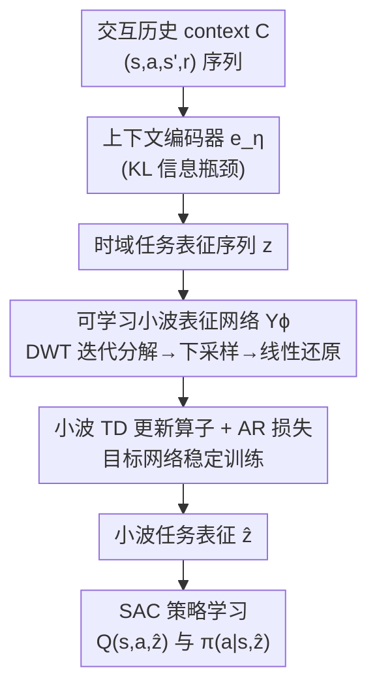

# Wavelet Predictive Representations for Non-Stationary Reinforcement Learning

**会议**: ICLR 2026  
**OpenReview**: [https://openreview.net/forum?id=UPEwYJn2mm](https://openreview.net/forum?id=UPEwYJn2mm)  
**代码**: https://github.com/MinWangcs/WISDOM  
**领域**: 强化学习  
**关键词**: 非平稳强化学习, 小波变换, 任务表征, 时序差分, 元强化学习

## 一句话总结
WISDOM 把非平稳 RL 中"任务随时间演化"的序列当作一段非平稳信号，用一个可学习的小波表征网络把任务表征序列变换到小波域，再配合小波 TD 更新算子和自回归损失捕捉多尺度演化趋势，从而让策略在带随机周期、突变剧烈的环境里快速适应，样本效率和最终性能都显著超过现有基线。

## 研究背景与动机

**领域现状**：现实世界天生是非平稳的（天气、车流、病人饮食都在变），非平稳强化学习（NSRL）就是要训练能跟上一连串不同 MDP 的智能体。主流做法建立在上下文式元强化学习（context-based meta-RL）之上：用一个上下文编码器从历史转移里推断出任务表征 $z$，再把 $z$ 喂给策略 $\pi(a|s,z)$，并对 $z$ 序列的演化做建模来预测趋势。

**现有痛点**：现有方法大多假设任务按"规律的、固定周期"的模式演化。一类工作（Xie et al. 2021; Ren et al. 2022）把任务演化显式建模成一阶马尔可夫链，只能处理平滑缓变的任务，遇到突变就会累积预测误差；另一类（Poiani et al. 2021; Chen et al. 2022）假设历史依赖的演化过程，用高斯过程（GP）或隐空间规划近似，但 GP 的非平稳核需要先验知识、还引入大量参数。它们普遍忽视了任务之间的**时序相关性**，因此在高动态场景里表现很差。

**核心矛盾**：真实非平稳任务的周期/频率是**时变的**（有随机周期），可现有方法只会处理固定周期的规律模式。更关键的是，论文用一个启发例子点出：三段均值方差都几乎相同的非平稳信号在时域里无法区分；傅里叶谱虽能看出主频不同，却**丢失了"每个频率在何时出现"的时间信息**——把序列倒过来（快→慢变成慢→快）会得到完全相同的傅里叶谱。也就是说傅里叶变换无法刻画"频率随时间怎么变"。

**本文目标**：找到一种既能保留时间信息、又能分离多尺度频率趋势的表征方式，去跟踪并预测带随机周期的非平稳任务演化，进而让策略提前调整、快速适应。

**切入角度**：小波变换（WT）天生擅长处理非平稳信号——它同时保留时频信息，并通过逐层分解迭代地把不同频率的特征剥离开：低频近似系数反映整体演化趋势，高频细节系数反映局部快变。而且根据采样定理，每次分解都把序列长度减半，在不丢失基本特征的前提下压缩数据量。这正好对上"任务演化是带随机频率的非平稳信号"这个观察。

**核心 idea**：第一个提出"在小波域里感知任务演化过程"来解非平稳 RL——把任务表征序列变换到小波域获取多分辨率特征，并设计一个可证明收敛的小波 TD 更新算子来显式跟踪 MDP 结构变化，最后把还原回时域的小波任务表征注入策略学习。

## 方法详解

### 整体框架

WISDOM 的整条管线由三个模块串起来，输入是智能体与一连串 MDP $M_{\omega_0}, M_{\omega_1}, \dots, M_{\omega_H}$ 交互产生的转移历史（context $C$，每条转移 $c=(s,a,s',r)$），输出是一个能随非平稳趋势提前调整的策略。**模块 A** 先用上下文编码器把历史转移推断成时域任务表征序列 $z=[z_0,\dots,z_T]$；**模块 B** 用可学习的小波表征网络 $Y_\phi$ 把 $z$ 变换到小波域、分离出多尺度演化特征再还原回时域，得到更本质的小波任务表征 $\hat z$；**模块 C** 把 $\hat z$ 注入基于 SAC 的策略迭代，让 Critic 和 Actor 都以预测的演化趋势为条件。模块 B 的训练由两个目标协同——**小波 TD 损失**（带目标网络的显式 TD 更新）和**自回归（AR）损失**——共同优化 $Y_\phi$。

### 关键设计

**1. 可学习小波表征网络 $Y_\phi$：把任务演化序列搬进小波域**

这一步针对"傅里叶丢时间、马尔可夫链处理不了突变"的痛点。WISDOM 把任务表征序列 $z$ 看成一段多元非平稳信号（$z_i$ 的每一维相当于一条变量序列），用 $Y_\phi$ 对它做离散小波变换（DWT）。$Y_\phi$ 由两个膨胀因果卷积网络 Conv1、Conv2 加一层线性层构成，以递归卷积实现 DWT：

$$g_m = \text{Conv1}(u_{m-1}, y_1; M),\quad u_m = \text{Conv2}(u_{m-1}, y_0; M),\quad u_0=z$$

其中 $y_0$ 是低通滤波器（可用 Haar 小波 $y_0=[1/\sqrt2,\,1/\sqrt2]$ 初始化，相当于对相邻元素取平均、平滑序列），让近似系数 $u_m$ 捕捉整体演化趋势；$y_1$ 是高通滤波器（Haar 下 $y_1=[1/\sqrt2,\,-1/\sqrt2]$，取差分、突出局部变化），让细节系数 $g_m$ 捕捉快变细节。和传统固定基函数不同，这里的卷积核是**可学习**的——以经典小波为起点，再在训练中自适应调整。每次分解都对 $u_m$ 下采样、只保留最近的细节系数 $\tilde g_m$（既去高频噪声又保留快速任务变化），最后做 $M$ 层分解后用线性层把 $\tilde g_{1:M}$ 和 $u_M$ 还原回时域，得到更具表达力的小波任务表征 $\hat z$。这样一来，带随机周期的不同演化模式被自然分解到一系列不同分辨率/频率上，模型就能据此动态调整行为。

**2. 小波 TD 更新算子 + AR 损失：一个保证收敛、一个抑制误差累积**

光把 $z$ 变换到小波域还不够，$Y_\phi$ 怎么学才能稳定地跟踪结构变化是关键。论文在 Conv2（记作 $W$ 网络）学到的小波特征上定义了一个 TD 式更新算子 $\mathcal F W(z_t)=z_t+\Gamma\,\mathbb E_\pi[W(z_{t+1})]$（$\Gamma$ 是对角矩阵形式的折扣因子），类似后继特征满足 Bellman 方程；**Theorem 1 证明 $\mathcal F$ 是压缩映射**，从而保证小波表征更新收敛、训练稳定一致。和大多数"用价值函数上的 TD 损失隐式更新表征网络"的做法不同，这种显式 TD 更新**不会忽略低回报但关键的特征**——即使奖励稀疏或延迟，学到的表征仍然更稠密、更有信息量。整体优化目标把小波 TD 损失和 AR 损失合在一起：

$$J_\phi = \alpha_Y\,\mathbb E_{c\sim B}\!\Big[\tfrac12\big(W_\phi(z_t)-(z_t+\Gamma\,\mathbb E_\pi[W_{\bar\mu}(z_{t+1})])\big)^2\Big] - \mathbb E_{\hat z\sim Y_\phi}\Big[\log\textstyle\prod_{t=0}^{T} P(\hat z_t|\hat z_{<t})\Big]$$

其中 $W_{\bar\mu}$ 是用参数指数滑动平均（EMA）维护的目标网络（类比 DQN）。两个损失各司其职：小波 TD 损失只依赖单步未来表征 $z_{t+1}$，目标更简洁，靠延迟更新的目标网络缓解误差传播、稳定优化；AR 损失则施加更严格的时序约束，防止可学习滤波器放松正交性后导致趋势在时间上错位，并强化长程依赖、赋予 $Y_\phi$ 预测能力。$Y_\phi$ 用膨胀因果卷积实现，保证第 $i$ 个输出只依赖前 $i$ 个输入，维持了 AR 建模所需的条件依赖。

**3. 用小波任务表征驱动 SAC 策略：让策略提前对准演化趋势**

最后把 $Y_\phi$ 预测出的 $\hat z$ 注入策略迭代，建立"策略提前调整"与"非平稳趋势"之间的紧密关系。WISDOM 以 Soft Actor-Critic 为骨架（也能换成任意下游 RL 算法）：上下文 Critic $Q_\upsilon(s,a,\hat z)$ 最小化平方残差 $J_\upsilon=\mathbb E[\tfrac12(Q_\upsilon(s,a,\hat z)-Q_{\text{target}})^2]$，目标值 $Q_{\text{target}}=r+\gamma\,\mathbb E[Q_{\bar\zeta}(s',a',\hat z)]$（目标 Critic 同样用 EMA 更新并停止梯度回传）；上下文策略 $\pi_\theta$ 优化 $J_\theta=\mathbb E[\alpha\log\pi_\theta(a|s,\hat z)-Q_\upsilon(s,a,\hat z)]$。论文进一步给出两条理论支撑：**Theorem 2** 表明小波域特征的性能差能控制对应策略的性能差（小波特征是策略性能的有效指示器），**Theorem 3** 证明还原回时域的 $\hat z$ 在策略迭代中带来策略改进（$J_{\text{WISDOM}}\ge J_{\pi_h}$）。直觉上，小波变换通过分离不同频率提升信噪比，$\hat z$ 滤掉任务无关信息、让策略聚焦在本质的非平稳特征上，给出更清晰的优化方向。

### 损失函数 / 训练策略
- 上下文编码器 $e_\eta$：以 KL 散度作为信息瓶颈的变分近似训练，$J_\eta=\mathbb E_{C\sim B}[D_{KL}(e_\eta(z|C)\|p(z))]$，$p(z)$ 为高斯先验。
- 小波表征网络 $Y_\phi$：小波 TD 损失 + AR 损失联合优化（见上式），$\alpha_Y$ 平衡两者，目标网络 $W_{\bar\mu}$ 用 EMA 更新。
- 策略：标准 SAC 的 Critic/Actor 目标，均以 $\hat z$ 为条件，目标 Critic 用 EMA + 停梯度。

## 实验关键数据

### 主实验

在三类基准上评测：Meta-World（50 个机器人操作任务，目标位置随时间连续变化、与奖励相关）、Type-1 Diabetes（按饮食变化调节胰岛素控血糖）、MuJoCo（参数化非平稳，如 Walker-Vel 改奖励、Cheetah-Damping 改动力学）。随机周期 $T_h$ 从均值 60、方差 20 的高斯分布采样。对比 NSRL 基线 CEMRL / TRIO / SeCBAD / COREP，以及 SAC / PEARL / RL2。下表为 Meta-World 收敛测试成功率（%，6 个随机种子）的部分环境：

| 方法 | Door-Unlock | Button-Press | Plate-Slide | Plate-Slide-Back |
|------|------|------|------|------|
| CEMRL | 4.08 | 1.83 | 0.00 | 0.00 |
| TRIO | 3.92 | 10.42 | 6.42 | 0.20 |
| PEARL | 10.25 | 39.42 | 73.50 | 82.50 |
| SeCBAD | 11.58 | 36.58 | 71.50 | 79.53 |
| COREP | 67.50 | 96.83 | 64.17 | 43.00 |
| SAC | 1.67 | 62.83 | 50.00 | 90.03 |
| **WISDOM** | **91.58** | **99.42** | **96.50** | 90.57 |

WISDOM 在多数环境取得最高成功率且方差最小，尤其在最难的 Door-Unlock 上从次优的 67.5% 拉到 91.6%。在 Type-1 Diabetes 和 MuJoCo 上，WISDOM 也展现出更快的收敛和更高的最终性能；其中 MuJoCo 因任务分布更窄、状态维度更低，COREP 等基线优势不如在 Meta-World 明显，但 WISDOM 仍稳定领先。

### 消融实验

| 配置 | 效果 | 说明 |
|------|------|------|
| Full (WISDOM) | 最优 | MLP 编码器 + Y 网络 + 小波 TD + AR |
| w/o Y 网络 | 显著掉点 | 去掉小波表征网络，证明小波表征确实反映非平稳趋势 |
| w/o AR 损失 | 收敛变慢、最终性能下降 | AR 损失加速收敛、提升性能 |
| w/o 小波 TD 损失 | 训练不稳、方差变大 | 小波 TD 损失稳定训练、降低方差 |
| RNN 编码器 | 更差 | 易遗忘历史变化、梯度消失 |
| VWE（逐变量编码） | 收敛更慢、最终更差 | 各变量独立做 DWT，破坏跨变量交互依赖 |

### 关键发现
- **Y 网络（小波表征）是性能主力**：去掉后显著掉点，说明小波域多尺度特征确实捕捉到了非平稳演化趋势。
- **两个损失分工明确**：AR 损失负责加速收敛、抬高上限；小波 TD 损失负责稳训练、降方差——二者互补。
- **非平稳越剧烈越能体现优势**：在 Meta-World/MuJoCo/Type-1 设定的非平稳度 0.99/0.97/0.7 下，多数模型性能随非平稳度上升而下滑，WISDOM 却保持稳定适应。
- **抗噪鲁棒**：往状态注入 $\mathcal N(0,1)$ 高斯噪声后，基线收敛变慢、性能下降，WISDOM 仍保持最高成功率，得益于小波表征既抑噪又保留快变任务信号、提升信噪比。
- **换 RL 骨架仍稳**：换不同 RL 算法都能快速适应收敛（DDPG 因探索受限易陷局部最优）。

## 亮点与洞察
- **把"任务演化"重新表述成"非平稳信号处理"**：这是最妙的视角迁移——一旦承认任务序列是带随机频率的非平稳信号，小波多分辨率分析就成了天然工具，比硬套马尔可夫链或高斯过程更贴合"时变周期"的本质。
- **可学习小波核**：以经典 Haar 等基函数初始化、再在训练中自适应微调，既保留小波的归纳偏置又不失灵活性，是"传统信号处理 + 深度学习"的干净结合。
- **显式小波 TD 更新而非隐式价值 TD**：直接在表征上做 TD 更新并证明压缩映射收敛，避免稀疏/延迟奖励下丢掉低回报但关键的特征，这个思路可迁移到其他需要稠密表征学习的 RL 场景。
- **理论与实践闭环**：Theorem 1（算子收敛）+ Theorem 2（小波特征指示策略性能）+ Theorem 3（策略改进）给方法提供了较完整的理论支撑，而非纯经验堆叠。

## 局限与展望
- 作者承认存在局限（原文提到"紧致性/compactness"相关，⚠️ 具体表述以原文为准），方法的紧凑性与某些设定可能受限。
- 小波分解层数 $M$、TD 损失权重 $\alpha_Y$ 等超参可能需要按基准调整，论文未充分展开敏感性分析的全部细节。
- 评测集中在 Meta-World / MuJoCo / Type-1 Diabetes 三类仿真基准，是否能迁移到真实机器人或更高维观测（如视觉输入）尚待验证。
- 可学习滤波器放松了正交性，虽用 AR 损失补救时序错位，但放松到什么程度才安全、对极端突变的极限在哪，仍是开放问题。

## 相关工作与启发
- **vs 一阶马尔可夫链建模（Xie et al. 2021 / Ren et al. 2022）**：他们把任务演化显式建模成一阶马尔可夫链，只能处理平滑缓变、遇突变累积误差；WISDOM 在小波域用多分辨率分解同时刻画全局趋势和局部快变，对随机周期/突变更鲁棒。
- **vs 高斯过程类（Poiani et al. 2021 / Chen et al. 2022 / SeCBAD）**：他们用 GP 或奖励函数近似历史依赖演化，GP 非平稳核需先验、引参多，且 SeCBAD 仅靠奖励判定演化时刻在复杂任务里失灵；WISDOM 用可学习小波网络直接在小波域跟踪结构变化，不依赖奖励判定。
- **vs 高斯混合 / 因果图（CEMRL / COREP）**：CEMRL 聚类复杂任务分布易表征坍缩，COREP 用因果图在低维 MuJoCo 优势不明显；WISDOM 的频域分解对任务分布的形状不做聚类假设，泛化更稳。
- **vs 时间序列里的小波网络**：本文把时序预测领域成熟的小波分解/小波注意力思路引入 NSRL 表征学习，并配上 RL 特有的 TD 更新算子，是跨领域方法迁移的范例。

## 评分
- 新颖性: ⭐⭐⭐⭐⭐ 首个用小波域任务表征解非平稳 RL，视角清新且自洽。
- 实验充分度: ⭐⭐⭐⭐ 三类基准 + 多基线 + 充分消融与鲁棒性分析，但偏仿真、缺真实高维场景。
- 写作质量: ⭐⭐⭐⭐ 动机的傅里叶 vs 小波例子讲得清楚，理论与方法衔接顺畅。
- 价值: ⭐⭐⭐⭐ 给非平稳 RL 提供了可迁移的频域表征学习范式，理论+代码开源。

<!-- RELATED:START -->

## 相关论文

- [\[ICLR 2026\] Predictive CVaR Q-Learning](predictive_cvar_q-learning.md)
- [\[ICML 2026\] Tracking Drift: Variation-Aware Entropy Scheduling for Non-Stationary Reinforcement Learning](../../ICML2026/reinforcement_learning/tracking_drift_variation-aware_entropy_scheduling_for_non-stationary_reinforceme.md)
- [\[NeurIPS 2025\] Forecasting in Offline Reinforcement Learning for Non-stationary Environments](../../NeurIPS2025/reinforcement_learning/forecasting_in_offline_reinforcement_learning_for_non-stationary_environments.md)
- [\[ICLR 2026\] Model Predictive Adversarial Imitation Learning for Planning from Observation](model_predictive_adversarial_imitation_learning_for_planning_from_observation.md)
- [\[ICML 2026\] Space-sampled Value Decay: Forgetting Mechanisms for Non-stationary Deep Reinforcement Learning](../../ICML2026/reinforcement_learning/space-sampled_value_decay_forgetting_mechanisms_for_non-stationary_deep_reinforc.md)

<!-- RELATED:END -->
