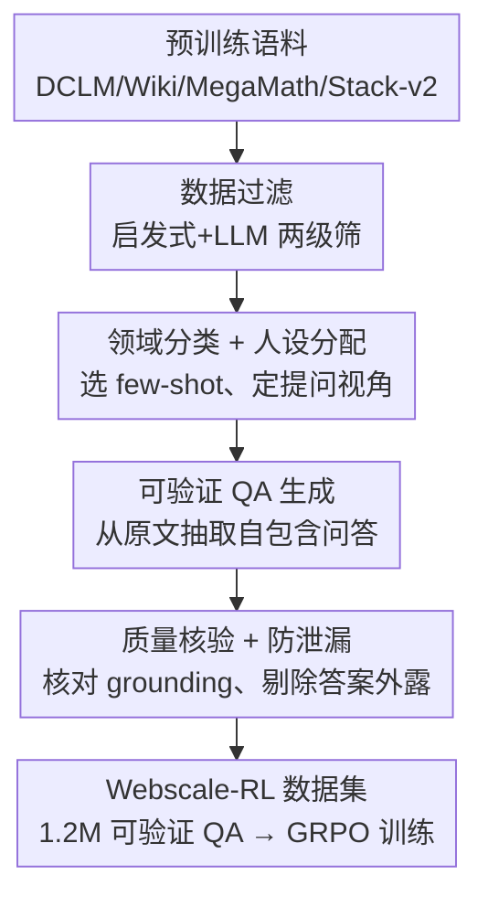

# Webscale-RL: Automated Data Pipeline for Scaling RL Data to Pretraining Levels

**会议**: ICLR 2026  
**论文**: [OpenReview](https://openreview.net/forum?id=webscale-rl)（⚠️ 链接以原文为准）  
**代码**: https://github.com/SalesforceAIResearch/PretrainRL-pipeline  
**数据集**: https://huggingface.co/datasets/Salesforce/Webscale-RL  
**领域**: 强化学习 / RL 数据合成 / LLM 训练  
**关键词**: RL 数据扩展, 可验证 QA, 预训练语料转换, 数据多样性, GRPO

## 一句话总结
本文提出 Webscale-RL 自动化数据管线，把万亿级预训练语料系统地转换成上百万条「可验证问答对」用于 RL 训练，构建出含 120 万条、覆盖 9+ 领域的 RL 数据集，用它做 GRPO 训练在多项 benchmark 上显著超越继续预训练与各种数据精炼基线，并且用最多少 100× 的 token 就能达到继续预训练的效果。

## 研究背景与动机
**领域现状**：当前 LLM 的主流训练范式（next-token 预训练 + SFT）本质都是「模仿学习」——让模型去拟合静态离线语料的下一个 token 分布。这种 teacher-forcing 方式让模型只见过「标准答案」、没见过自己生成时会进入的分布。

**现有痛点**：模仿学习带来两个结构性问题：一是 **distribution shift**（模型推理时一旦偏离标准轨迹就越错越远），二是 **训练-生成鸿沟**（训练时永远喂 ground-truth 前缀，生成时却要靠自己续写）。结果是模型在复杂推理上不够鲁棒。RL 通过「自己生成 + 在线奖励反馈」天然能弥合这条鸿沟，而且数据效率更高。

**核心矛盾**：RL 虽好，但被一个**数据瓶颈**死死卡住——预训练语料动辄 1T+ token，而现有 RL 数据集小了好几个数量级（通常 <10B token），且领域极度集中在数学和代码。根因是：构造「可验证 QA 对」成本极高，要么靠人工标注（如竞赛题），要么靠强 teacher 模型蒸馏（质量上限被 teacher 锁死、query 来源有限难以扩展）。这导致 RL 只能用在 post-training 阶段的少数推理任务上，无法发挥其提升通用能力的潜力。

**本文目标**：在**不牺牲 web 数据多样性**的前提下，把 RL 训练数据扩展到预训练规模。

**切入角度**：作者的关键观察是——预训练语料本身就藏着海量可被提问的事实和知识，与其花大价钱让强模型「解题」生成答案，不如让生成模型从原文里**抽取**出「问题 + 可验证短答案」。这样答案天然 grounded 在原文，既便宜又可靠，还能跟着语料规模一起线性扩展。

**核心 idea**：用一条「过滤 → 领域+人设分配 → 可验证 QA 生成 → 质量核验」的四阶段自动管线，把叙述性预训练文档批量转成可验证问答对，让 RL 数据规模与多样性都对齐预训练语料。

## 方法详解

### 整体框架
Webscale-RL 是一条数据工厂式的流水线：**输入**是跨多领域的原始预训练语料（DCLM、Wikipedia、MegaMath、Stack-v2 等约 100 万篇文档），**输出**是 120 万条「自包含问题 + 可验证短答案」的 RL 训练样本。它不训练任何新模型本身，而是用现成 LLM（GPT-4.1 / GPT-4.1-mini）当工具，分四个阶段把文档逐步「精炼」成 RL-ready 数据。

设计上贯穿两条提升多样性的主线：① 维护一个**领域专属示范库**，给每个领域准备不同的 few-shot 例子来引导生成；② 给每篇文档分配**多个人设（persona）**，让同一篇文档从不同视角被提问，榨取更多信息。最终每条样本配一个二元奖励（答案匹配 ground-truth 给 1，否则 0），所以每条都是可验证的。

### 关键设计

**1. 数据过滤：只删噪声、最大限度保留多样性**

这一阶段针对的痛点是：要让下游能产出可验证的高质量问题，得先去掉「没法出题」的文档；但传统数据精炼管线往往按难度、格式、推理痕迹等多个维度严格筛，**筛着筛着就把原始语料的多样性也筛没了**。作者反其道而行：过滤只为「服务后续阶段」，不为「提纯」。具体是两级——先用启发式规则删掉过短文档（<50 token），再用 LLM 做细粒度过滤，但 LLM 只负责剔除两类：(i) 大部分内容是模板样板（网页导航、页眉页脚等）的无信息页面，(ii) 缺乏上下文、无法据以验证答案的「非自包含」片段。除此之外尽量都留下。这样保证留下来的文档既有信息量、又可转成可验证 RL 数据，同时不破坏 web 语料原有的领域广度。

**2. 领域分类 + 人设分配：用领域定 few-shot、用人设造视角，双管齐下提多样性**

预训练数据多样性极高，如果对所有文档用同一套 few-shot 例子去生成问题，生成出的题会「水土不服」、风格单一。本设计先用 LLM 分类器把每篇文档归入具体领域（commerce / healthcare / social science 等），领域标签的作用是**到领域专属示范库里取对应的 few-shot 例子**，保证生成的问题在该领域内是恰当且可验证的——这是已有管线所缺的。在此基础上，再给每篇文档分配**最多 3 个人设**，人设定义了「谁会关心这内容、从什么视角提问」。例如一篇 healthcare 文档可能被分配「医学专家 / 患者 / 健康记者」三个人设，同一篇文档便能从不同信息需求出发被提多种问题，从而在源文档内部进一步榨取信息、丰富数据多样性。

**3. 可验证 QA 生成：从原文「抽取」答案，而非向强模型「蒸馏」答案**

这是全管线的灵魂。条件给定（源文档 + 领域标签 + 选定人设），LLM 生成器先从领域示范库采样 few-shot，再按提示模板生成问答对。两个刻意的设计：其一，问题不仅可以「抽取原文里已有的问题」，还能「提出原文能回答的新问题」；并且由于 RL 训练时模型看不到源文档，生成器被要求在问题里补足必要上下文，保证问题**自包含**。其二，答案只要求一个**简短、可验证的 ground-truth**（一个数字、一个名字、一个短语），而不是强 LLM 写的长篇推理。这一刀切下去的意义在于：生成任务从「让强模型把题解出来」退化成「从文档里把答案找出来」，大幅降低生成复杂度与对后端强模型的依赖，因此可以用更便宜的 LLM 来跑、还能扩展到 GPT-OSS / DeepSeek 等开源模型；更关键的是，答案 grounded 在原文，数据质量上限不再被 teacher 模型能力锁死，能随语料规模自然扩展。

**4. 质量核验 + 防泄漏：双重 LLM 核验，确保奖励信号干净**

即便大部分生成质量不错，仍可能有错误或幻觉，而 RL 对奖励信号的噪声很敏感（错误 ground-truth 会喂给模型错误奖励）。本阶段用 LLM 验证器做多级检查：① **正确性核验**——不同于以往按「答得对不对」做后处理，这里核验的是「抽取的 QA 是否被源文档支撑（grounded）」，这种判定更少受后端 LLM 偏好影响，能有效压低 RL 训练中的错误奖励；② **防泄漏**——确保问题本身没把答案直接写出来（ground-truth 不能 trivially 嵌在 prompt 里），否则模型只是在「复述/检索 prompt」而非真正调用知识或推理。不达标的 QA 对被直接过滤掉。最后还用 lm-eval-harness 做去污染，移除与评测集的重叠。

### 一个完整示例
以一篇被分类为「healthcare」的预训练文档为例走一遍管线：① **过滤**——文档 >50 token、内容自包含、非样板，保留；② **领域+人设**——分类为 healthcare，取该领域 few-shot，分配「医学专家 / 患者 / 健康记者」3 个人设；③ **QA 生成**——以「患者」视角生成「某药物的常见副作用是什么？」并在问题里补足背景，答案抽取为原文中的短语（如「头晕、恶心」），保证自包含；④ **核验**——验证器确认该答案确由原文支撑、且问题没把答案直接写出，通过。这样一篇文档最多产出 3 条不同视角的可验证 QA，最终汇入 120 万条数据集，再采样 150K 条做 GRPO 训练。

## 实验关键数据

### 主实验
基座为 Qwen2.5-3B，用 GRPO 在 Webscale-RL 上训练，对比继续预训练（Cont. Pretrain）及三种数据精炼基线（QuRating / ProX / GDR）。为消除指令跟随带来的评测偏差，所有 baseline 都额外用 10K 高质量样本做 SFT。

| 方法 | MMLU-pro | BigBench | GPQA-D | MATH500 | GSM8K | MBPP | EvalPlus | 平均 |
|------|----------|----------|--------|---------|-------|------|----------|------|
| Qwen2.5-3B (base) | 37.8 | 41.2 | 20.8 | 47.6 | 74.2 | 54.6 | 57.3 | 47.6 |
| Cont. Pretrain | 39.9 | 45.1 | 18.6 | 44.0 | 77.4 | 55.2 | 57.8 | 48.3 |
| QuRating | 39.7 | 44.9 | 19.4 | 44.6 | 76.8 | 54.8 | 57.6 | 48.3 |
| ProX | 40.0 | 46.0 | 19.5 | 44.4 | 77.3 | 54.2 | 57.5 | 48.4 |
| GDR（最强基线） | 39.9 | 46.0 | 20.8 | 44.4 | 77.4 | 55.0 | 57.6 | 48.7 |
| **Webscale-RL** | **43.7** | **48.3** | **23.2** | **58.0** | **78.5** | 55.0 | 57.8 | **52.1** |
| Qwen2.5-7B（参考） | 48.3 | 58.7 | 29.6 | 60.8 | 84.4 | 63.4 | 62.2 | 58.2 |

平均比最强基线 GDR 高 **3.4** 分；并把 3B 与 7B 的平均差距从 10.6 分收窄到 6.1 分。MATH500 从 47.6 直接跳到 58.0（逼近 7B 的 60.8）。

### 数据集多样性对比

| 数据集 | 类型 | 规模 | 领域 | 来源 | 可扩展性 |
|--------|------|------|------|------|----------|
| DeepScaler | RL | 40K | Math | 竞赛+数学数据 | 低（靠人工标注） |
| OpenR1-Math | SFT/RL | 220K | Math | 蒸馏 DeepSeek-R1 | 中 |
| OpenThoughts3 | SFT | 1.2M | Math/Code/Science | 蒸馏 QwQ-32B | 中 |
| Nemotron | SFT/RL | 3.9M | Math/Code/Science | 多模型蒸馏 | 中 |
| **Webscale-RL** | RL | 1.2M | **Multi-domain (9+)** | **从预训练语料转换** | **高** |

关键差异：其它大规模数据要么靠人工、要么靠蒸馏（质量被 teacher 锁死、query 来源有限难扩展）；Webscale-RL 的问与答都从预训练文档转换并对原文核验，可随语料规模自然扩到预训练级别。UMAP 可视化也显示其问题嵌入比 Nemotron 分布更均匀、更分散，覆盖话题更广。

### 关键发现
- **数据效率惊人**：在 MMLU-pro 上，RL 用约 10M token 就达到继续预训练 1B token 的效果，即 >100× 的数据效率提升；相同 100M token 下 RL 比 base 提升 4.4%，而继续预训练几乎无提升。
- **收益最大在通用知识/推理任务**（MMLU-pro、BigBench、GPQA-D），正得益于数据继承自预训练的广度与多样性。
- **数学提升显著**（MATH500 +10.4），印证 RL 比模仿更能激励数学推理；GSM8K 提升小是因为 base 已近饱和。
- **代码提升偏小**，反映预训练语料中代码占比低——作者把这列为已知局限。
- RL 的优势并非只来自指令跟随改善（已用 SFT 对齐 baseline），而源于奖励驱动的在线学习信号；且 RL 随训练规模上升曲线更陡，扩展性优于 teacher-forcing。

## 亮点与洞察
- **「抽取而非蒸馏」的范式转换**：把 QA 生成从「让强模型解题」降级为「从文档抽答案」，一刀同时解决了成本、可靠性、可扩展性三个问题——这是最巧妙的一笔，因为它让数据质量不再被 teacher 能力封顶。
- **多样性当一等公民**：过滤阶段刻意「只删噪声不提纯」，加上领域 few-shot + 多人设，从机制上保住了 web 数据的广度，直击现有 RL 数据「窄」的痛点。
- **grounding-based 核验降噪**：用「是否被原文支撑」而非「答得对不对」来核验，巧妙绕开后端 LLM 偏好对奖励信号的污染，这个思路可迁移到任何需要可验证奖励的 RL 数据构造。
- **可迁移性**：这套「文档 → 可验证 QA」管线不限于通用语料，换成代码仓库、医学文献等垂域语料即可定向增强对应能力。

## 局限与展望
- 作者承认的局限：当前数据集在**代码等领域覆盖不足**，导致代码 benchmark 提升小；未来可按目标应用重新平衡领域分布（如引入 repo 级代码数据）。
- 奖励模型用的是生成式二元反馈，虽稳定但**引入大量额外推理开销**，成为扩展到更大模型/数据的瓶颈；未来需更高效的奖励模型。
- 自己发现的局限：实验只验证到 Qwen2.5-3B 规模，更大模型上「100× 效率」是否成立未知；二元奖励对「需要长推理链」的开放任务可能过于粗糙（短答案 grounding 的设计本身就偏向事实抽取型问题）。
- 管线高度依赖 GPT-4.1 系列做生成与核验，虽声称可换开源模型，但换模后数据质量稳定性需另行验证。

## 相关工作与启发
- **vs 蒸馏式数据（OpenThoughts3 / Nemotron / NaturalReasoning）**：它们用强 teacher 生成答案，质量与上限被 teacher 锁死、query 来源有限难扩展；本文从原文抽取并核验，可随语料自然扩展、且不依赖强 teacher。
- **vs 数据精炼基线（QuRating / ProX / GDR）**：它们仍在「精炼文本 + 继续预训练（模仿）」框架内，本文把同样的源数据转成 QA 用 RL 训练，证明「奖励驱动的在线学习」比「在更干净文本上继续模仿」收益更大。
- **vs 人工/竞赛 RL 数据（DeepScaler）**：靠人工标注，规模与领域都受限；本文自动化转换，规模与多样性都对齐预训练。

## 评分
- 新颖性: ⭐⭐⭐⭐ 「抽取而非蒸馏」的转换视角与把 RL 数据推到预训练规模的目标都很有冲击力，单个组件偏工程组合。
- 实验充分度: ⭐⭐⭐⭐ 多 benchmark + 多基线 + 数据效率/多样性分析齐全，但只在 3B 上验证、缺更大规模与更多基座。
- 写作质量: ⭐⭐⭐⭐ 动机链条清晰、四阶段管线讲得明白，图表支撑到位。
- 价值: ⭐⭐⭐⭐⭐ 数据集与管线均开源，直击 RL 数据瓶颈，对社区有很强的实用与方向性价值。

<!-- RELATED:START -->

## 相关论文

- [\[ICLR 2026\] APC-RL: Exceeding Data-Driven Behavior Priors with Adaptive Policy Composition](apc-rl_exceeding_data-driven_behavior_priors_with_adaptive_policy_composition.md)
- [\[ICLR 2026\] AutoTool: Automatic Scaling of Tool-Use Capabilities in RL via Decoupled Entropy Constraints](autotool_automatic_scaling_of_tool-use_capabilities_in_rl_via_decoupled_entropy_.md)
- [\[ICLR 2026\] Towards High Data Efficiency in Reinforcement Learning with Verifiable Reward](towards_high_data_efficiency_in_reinforcement_learning_with_verifiable_reward.md)
- [\[ICLR 2026\] Prosperity before Collapse: How Far Can Off-Policy RL Reach with Stale Data on LLMs?](prosperity_before_collapse_how_far_can_off-policy_rl_reach_with_stale_data_on_ll.md)
- [\[ICLR 2026\] R-Zero: Self-Evolving Reasoning LLM from Zero Data](r-zero_self-evolving_reasoning_llm_from_zero_data.md)

<!-- RELATED:END -->
