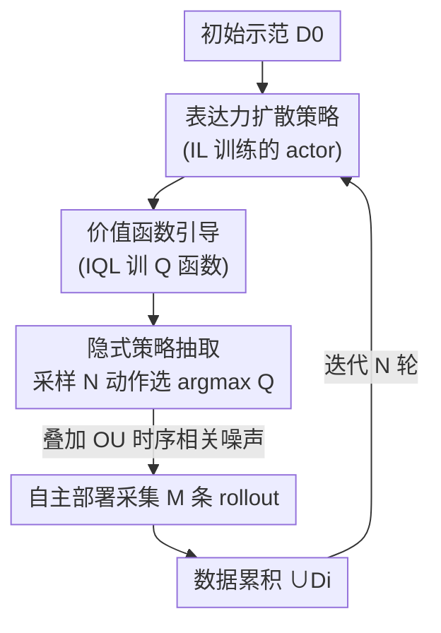

# What Matters for Batch Online Reinforcement Learning in Robotics?

**会议**: ICLR 2026  
**OpenReview**: [https://openreview.net/forum?id=usw1NVkczu](https://openreview.net/forum?id=usw1NVkczu)  
**代码**: https://pd-perry.github.io/batch-online-rl/ (项目页，承诺开源)  
**领域**: 强化学习  
**关键词**: 批量在线RL, 机器人自改进, 价值函数引导, 隐式策略抽取, 扩散策略

## 一句话总结
这是一篇系统性实证研究：作者把"机器人用自己采集的大批数据迭代自改进"（batch online RL）拆成算法类别、策略抽取方式、策略表达力三个轴做控制变量实验，得出一套配方——用价值函数（IQL）引导 + 隐式策略抽取（采样多个动作选 Q 值最高的）+ 表达力强的扩散策略，再叠加一点时序相关噪声，在 6 个仿真操作任务上比模仿学习类方法最高提升 2×，真机挂胶带任务 3 轮迭代成功率提升 30%。

## 研究背景与动机

**领域现状**：机器人学习长期受困于"数据少"——人工采集示范成本极高。一个诱人的替代方案是让机器人**自改进**：用初始策略部署、自主采集大批 rollout，再离线训练精炼策略，如此迭代。作者把这种"冻结策略部署一整批 → 离线更新 → 再部署"的范式称为 **batch online RL**。它介于纯离线 RL（不采新数据）和纯在线 RL（边执行边更新）之间，避免了在线 RL 在真机上"训练与执行耦合、过程中可能出现不稳定/不安全行为"的工程难题。

**现有痛点**：以往做 batch online RL 的工作几乎都用模仿学习（IL）或过滤式模仿学习（filtered-IL，只保留成功轨迹重训）。这两类方法直观但效果差：纯 IL 会把自主 rollout 里的失败轨迹也照单全收地拟合；filtered-IL 虽有初期提升，但很快收敛到次优点，而且**随自主数据量增加几乎不再提升**（饱和）。

**核心矛盾**：自主采集的数据里**有用信号大量藏在次优/失败轨迹中**，而 IL/filtered-IL 只会"复制成功"——它们既不能从失败里学到"哪些状态-动作其实是好的"，采集出的轨迹本身也缺乏多样性。要真正用好自主数据，策略必须既能**采集多样轨迹**，又能**从这种多样性里学习**。

**本文目标**：不发明某个新算法，而是回答一个工程上更迫切的问题——到底**哪些组件**才让 batch online RL 真正奏效？作者把方法空间拆成三个可独立消融的轴：(i) 算法类别（IL / filtered-IL / 价值类 RL）、(ii) 策略抽取方式（显式 / 隐式）、(iii) 策略表达力（高斯 / 扩散），逐一做控制变量实验。

**核心 idea**：用**价值函数**判别"哪怕在失败轨迹里也存在的好状态-动作"，从而把失败数据也变成学习信号；并且只在**部署时**用 Q 函数从策略分布里挑最优动作（隐式抽取），把价值学习和策略训练解耦以保证稳定。三者合成一套可复现的配方。

## 方法详解

### 整体框架

batch online RL 的骨架（论文 Algorithm 1）很简单：先用初始离线数据集 $D_0$ 训出策略 $\pi_0$（和价值函数 $Q_0$）；然后进入循环——第 $i$ 轮用上一轮策略 $\pi_{i-1}$ 在部署中采集 $M$ 条 rollout 组成 $D_i$，把它并入累积数据集 $\cup_i D_i$，在上面重新训练价值函数 $Q_i$ 和策略 $\pi_i$；如此重复 $N$ 轮。本文的贡献不在这个骨架，而在于把骨架里两个被前人随意填的空——`UpdatePolicy`（用什么算法、什么表达力的策略）和 `Rollout`（怎么从 Q 函数抽取动作）——通过系统实验找到正确填法，凝练成配方：**用 IL 训练一个表达力强的扩散策略当 actor，用 IQL 在自主数据上训 Q 函数，部署时用隐式策略抽取（采样多个动作、选 Q 值最高者）去采 rollout**，可选再叠加一点时序相关噪声增强多样性。

### 关键设计

**1. 价值函数引导：用 Q 函数把失败数据也变成学习信号**

第一个轴是算法类别。IL/filtered-IL 的根本缺陷是只会"复制成功"，无法利用次优数据；作者主张换成**价值类 RL**——在累积数据上训一个 Q 函数，让它判断"哪些状态-动作是值得追求的，哪怕它们出现在失败轨迹里"。本文主要采用 IQL（Implicit Q-Learning）的价值目标：用期望分位数回归拟合价值函数 $V_\psi$ 只在数据支撑内估计，再用它去更新 $Q_\phi$：

$$L_Q(\phi) = \mathbb{E}_{(s,a,r,s')\sim D}\big[(r + \gamma V_\psi(s') - Q_\phi(s,a))^2\big]$$
$$L_V(\psi) = \mathbb{E}_{(s,a)\sim D}\big[L_2^\tau(Q_{\phi'}(s,a) - V_\psi(s))\big],\quad L_2^\tau(x)=|\tau - \mathbb{1}(x<0)|\,x^2$$

其中 $\tau$ 是期望分位数超参，$\tau$ 越大价值函数越逼近 Q 的上界。实验上价值类 RL 全面碾压 IL/filtered-IL：状态访问热力图显示它采集到的成功轨迹**多样性显著更高**，而且**随每轮数据量增大持续提升**，而 IL/filtered-IL 会饱和。直觉是 Q 函数能从失败轨迹里识别出好的状态-动作，让策略从更广的数据（含失败）里学习。但作者强调价值类 RL 是**必要而非充分**——这也是为什么前人偶尔试过价值类 RL 却没看到好处，因为另外两个轴没选对。

**2. 隐式策略抽取：只在部署时挑动作，把价值与策略训练解耦**

第二个轴是怎么从价值函数得到用于 rollout 的策略。**显式抽取**（offline RL 的传统做法，以 AWR 为代表）会离线地优化一个目标 $J_\pi(\theta)=\mathbb{E}_{(s,a)\sim D}[e^{\beta(Q(s,a)-V(s))}\log\pi_\theta(a|s)]$，把 Q 的优势信号"烤进"策略参数里。**隐式抽取**则不单独训一个抽取策略，而是在**部署采样时**从基础策略里采多个动作 $\{a_i\}$、用 Q 函数现场选 $\arg\max_{a_i} Q(s,a_i)$。

实验给出一个反直觉但关键的结论：显式抽取在初始策略上几乎总是更强，但跑完 batch online RL 后**隐式抽取显著胜出，且显式抽取在所有任务上都没能改进策略**。原因在于——显式抽取虽然给策略更多价值信号，但当每轮新增的多样数据导致动作分布漂移时，被"烤死"在参数里的策略无法跟着调整；而隐式抽取把价值函数和策略训练**解耦**，每轮只是换个 Q 来挑动作，对分布漂移天然更鲁棒、学习更稳定。

**3. 表达力强的扩散策略：既要采得出多样，又要装得下多样**

第三个轴是策略类别的表达力，对比高斯策略与扩散策略（两者都用 IL 监督目标 + IQL 价值目标）。高斯策略只建模 $\pi(a|s)$ 的均值方差，推理快、在纯在线 RL 里够用；但**扩散策略**用马尔可夫加噪/去噪过程建模行为分布，能刻画多峰动作分布，且天然适配隐式抽取（表达力强才能采样出真正多样的候选动作）。

实验中扩散策略+隐式抽取全面优于高斯策略；即便给高斯策略也配上隐式抽取（控制抽取方式这个混杂因素），它虽比高斯+显式有提升，但整体仍明显逊于扩散策略。作者给出一个精准的解释，区分了纯在线与 batch online 的本质差异：纯在线 RL 里 $\pi(a|s)$ 每步都在变，总会冒出新动作，所以初始模型**不需要**很好地建模动作分布；而 batch online RL 里策略在一整批部署中是**冻结**的，要想让后续学习用上多样性，初始模型必须先**捕获足够好的专家动作分布**，才能采到有用的轨迹——这正是表达力在此设定下不可或缺的原因。

**4. 时序相关噪声：用 OU 过程低成本再榨一点多样性**

三个轴有个共同主题：更好地利用自主采集的多样性。作者据此加了一个简单可选的增量——在部署 rollout 时给动作叠加一点**时序相关噪声**（用 Ornstein–Uhlenbeck 过程建模，这一招在传统在线 RL 里早被验证有效）。它在**每个数据量级**上都带来更高性能，但**不改善数据缩放曲线**——因为相关噪声的作用是扩大策略所学的分布，而这种扩大本可以靠更多数据自然达到。所以这是个锦上添花的实用小技巧，配方并不依赖它。

### 损失函数 / 训练策略
价值函数用 IQL 的 $L_Q$、$L_V$ 双目标训练（期望分位数 $\tau$）；策略 actor 用扩散模型的 IL（行为克隆）目标训练；部署时隐式抽取（采 $N$ 个动作选 $\arg\max Q$）。这套实例化在单轮迭代下恰好等价于 IDQL（Implicit Diffusion Q-Learning），但配方本身定义的是一类方法，可换用其它表达力策略、隐式抽取方式或 Q 函数目标。仿真中 $D_0$ 取 5–100 条示范（控制初始成功率在 30–65%，留出改进空间），每轮 $M=200$ 条 rollout，跑 $N=10\!-\!20$ 轮。

## 实验关键数据

### 主实验

6 个连续控制操作任务：Robomimic 的 Lift / Can / Square，MimicGen 的 Threading / Stack，Adroit 的 Pen。指标为归一化回报（3 seeds × 每轮 100 次评估）。

| 对比维度 | 较弱选择 | 本文配方选择 | 结论 |
|----------|----------|--------------|------|
| 算法类别 | IL / filtered-IL | 价值类 RL（IQL） | 价值类 RL 显著更优，且随数据量持续提升不饱和 |
| 策略抽取 | 显式（AWR） | 隐式（采样选 $\arg\max Q$） | 显式跑完后零改进；隐式显著胜出 |
| 策略表达力 | 高斯策略 | 扩散策略 | 扩散全面更优；高斯即便配隐式抽取仍逊色 |
| 整体配方 | 此前方法 | 配方（+OU 噪声） | 6 任务上最高 **2×** 性能提升与更好缩放 |

真机任务（7-DoF Franka 抓胶带挂钩，RGB+本体感觉输入，ResNet-18 视觉骨干）：$D_0=5$ 条示范，$N=3$ 轮、每轮 $M=30$。

| 方法 | 真机结果 |
|------|----------|
| 本文配方 | **3 轮内成功率较初始策略提升 30%** |
| filtered-IL | 未能改进（初始策略已充分拟合 $D_0$ 动作分布） |
| steering（Q 引导但不重训策略，改编自 Nakamoto 2024） | 最差，说明必须在新 rollout 上重训策略 |

### 消融实验

| 配置 | 关键发现 | 说明 |
|------|---------|------|
| 价值类 RL vs filtered-IL | 状态访问热力图更分散 | 价值类 RL 采集/消化的轨迹多样性显著更高（Lift / Square 末端执行器 3D 分布） |
| 隐式 vs 显式抽取 | 显式初始更强、最终零改进 | 显式被分布漂移"卡死"，隐式靠解耦保持可调 |
| 高斯+隐式 vs 扩散+隐式 | 高斯+隐式 > 高斯+显式但 << 扩散 | 证明增益不只是抽取方式，表达力本身关键 |
| +OU 噪声 vs 无噪声 | 各数据量级性能↑、缩放曲线不变 | 噪声扩大分布≈更多数据自然达到，故不改善缩放 |

### 关键发现
- **三轴并非平权**：价值类 RL 是"必要而非充分"——它解释了为何前人偶尔试价值类 RL 却没看到好处（抽取方式和策略类没选对）。三者要配齐才有 2× 提升。
- **隐式 > 显式的反直觉点**：显式抽取初始更强却跑不动，根因是 batch online RL 每轮注入的新数据造成动作分布漂移，烤进参数的显式策略无法适应。
- **表达力为何在此设定特别重要**：策略在一整批部署中冻结，初始模型必须先装得下足够好的专家动作分布，才能采到供后续学习的多样轨迹——这是 batch online 区别于纯在线 RL 的本质。

## 亮点与洞察
- **把"配方"当贡献**：不发明新算法，而是用严格控制变量把含糊的设计空间收敛成一句可执行的话（表达力策略 + 价值引导 + 隐式抽取）。这种"什么真正 matters"的实证范式对工程落地价值很高，单轮恰好退化为已知的 IDQL，可信度强。
- **隐式抽取把价值与策略解耦**：部署时现场用 Q 挑动作，而不把信号烤进策略参数，使方法对每轮的分布漂移天然鲁棒——这个解耦思想可迁移到任何"数据分布会随迭代漂移"的离线/半在线学习设定。
- **OU 噪声的诚实定位**：作者明确指出它提性能但不改善缩放，并解释"扩分布≈更多数据"，没有把锦上添花包装成核心贡献，结论自洽。

## 局限与展望
- **仅限连续动作空间**：作者承认离散动作或动作离散化后，Q 函数性质、策略抽取方式、"表达力策略"的定义都会变，配方未必直接迁移。
- **依赖一个"还行"的初始策略**：实验里初始成功率被刻意控制在 30–65%，留有改进空间；如何从一个**完全不成功**的初始策略冷启动 batch online RL 仍是开放问题。
- **OU 噪声非普适**：直接给动作加噪在某些部署场景不适用（虽然作者测得小噪声仅边际改变成功率）。
- **Q 函数与抽取仍有上限**：作者自己提出开放问题——offline RL 里的悲观式 Q 学习是否最优？隐式抽取除了"选最高 Q 动作"能否更好？这些都留给未来。

## 相关工作与启发
- **vs IL / filtered-IL（Liu 2023、Ahn 2024、Mirchandani 2024）**: 他们靠复制成功轨迹改进，本文用 Q 函数从失败数据里也提取信号，区别在于能否利用次优数据；本文优势是随数据量持续提升不饱和。
- **vs steering / value guidance（Nakamoto 2024）**: 他们只用价值函数引导冻结的基础策略、不重训策略，本文每轮在新 rollout 上重训策略；真机实验里本文显著更好，证明"必须重训策略"。
- **vs offline-to-online 微调（Cal-QL、AWAC、IQL 在线微调）**: 那类方法边执行边更新、受分布漂移与灾难性遗忘困扰；本文把数据采集与训练**解耦**（冻结策略采一整批、再离线精炼），规避了在线微调的不稳定性。
- **vs IDQL（Hansen-Estruch 2023）**: 本文配方单轮迭代恰好退化为 IDQL，但把它推广成"一类方法"并验证了其在多轮自改进/缩放下的优越性。

## 评分
- 新颖性: ⭐⭐⭐⭐ 不发明新算法，但"系统拆三轴找配方"的实证贡献扎实、洞察反直觉
- 实验充分度: ⭐⭐⭐⭐ 6 仿真任务三轴控制变量 + 真机验证，3 seeds×100 评估；缺更大规模/更多真机任务
- 写作质量: ⭐⭐⭐⭐⭐ 问题分解清晰，每个结论都配机制解释，诚实区分必要/充分与锦上添花
- 价值: ⭐⭐⭐⭐⭐ 给机器人自改进提供了直接可落地的配方，工程指导意义强

<!-- RELATED:START -->

## 相关论文

- [\[ICLR 2026\] Learning What Matters Now: Dynamic Preference Inference under Contextual Shifts](learning_what_matters_now_dynamic_preference_inference_under_contextual_shifts.md)
- [\[ICLR 2026\] Who Matters Matters: Agent-Specific Conservative Offline MARL](who_matters_matters_agent-specific_conservative_offline_marl.md)
- [\[AAAI 2026\] Where and What Matters: Sensitivity-Aware Task Vectors for Many-Shot Multimodal In-Context Learning](../../AAAI2026/reinforcement_learning/where_and_what_matters_sensitivity-aware_task_vectors_for_many-shot_multimodal_i.md)
- [\[ICLR 2026\] Stackelberg Coupling of Online Representation Learning and Reinforcement Learning](stackelberg_coupling_of_online_representation_learning_and_reinforcement_learnin.md)
- [\[ICLR 2026\] The Sample Complexity of Online Reinforcement Learning: A Multi-Model Perspective](the_sample_complexity_of_online_reinforcement_learning_a_multi-model_perspective.md)

<!-- RELATED:END -->
