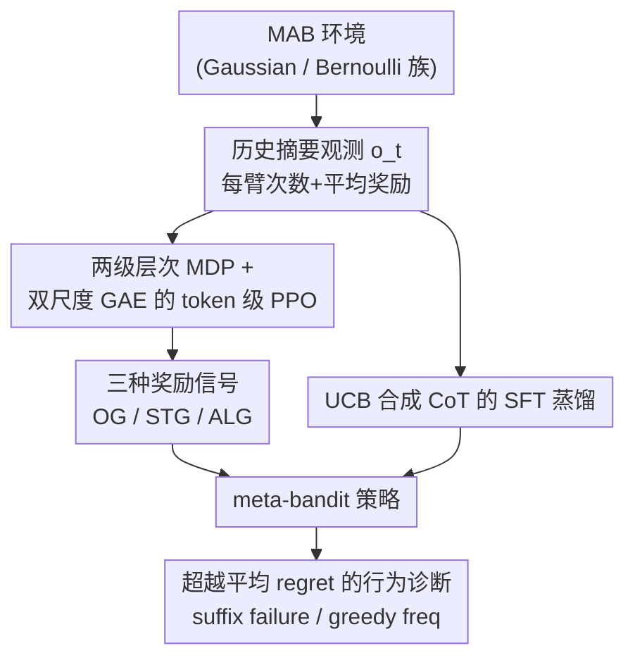

# When Greedy Wins: Emergent Exploitation Bias in Meta-Bandit LLM Training

**会议**: ICLR 2026  
**论文**: [OpenReview](https://openreview.net/) ⚠️ 以原文为准  
**代码**: https://github.com/sanxing-chen/meta-bandit-llm  
**领域**: LLM推理 / 强化学习 / In-Context RL  
**关键词**: 多臂老虎机, 探索-利用, meta-bandit, SFT vs RL, 奖励设计

## 一句话总结
作者把 LLM 训练成多臂老虎机（MAB）的 meta-bandit agent，系统对比 SFT 与三种奖励的 RL，发现它们都能把累积 regret 压到接近 UCB/Thompson Sampling 的水平并能泛化到 6× 长 horizon；但行为分析揭示这些"进步"很大程度来自学到了更精明却更贪婪的利用策略——agent 比预训练模型更容易过早放弃探索（suffix failure 升高），甚至能靠"偷懒地变贪婪"反超它模仿的 UCB 老师。

## 研究背景与动机
**领域现状**：序列决策的核心是探索-利用权衡，多臂老虎机（MAB）是研究这个权衡的经典 testbed。把 LLM 放进 MAB、让它在交互历史上做决策，就构成了 In-Context RL（ICRL）。当训练分布与测试实例不同分布时，训练出来的 LLM 实际上是一个 **meta-bandit agent**——学到的是一套能在新环境里探索的元策略，而非记住某个具体环境的最优臂。

**现有痛点**：预训练 LLM 在 MAB 上表现很差，倾向于短视的贪婪行为，过度利用已知奖励而牺牲探索。为改善这点，已有两条训练路线：SFT（模仿 UCB 等专家轨迹）和 RL（直接从环境奖励学策略）。但此前工作只比"谁的 in-distribution regret 更低"（结论是 SFT 更稳），没人讲清楚两种范式在**机制上**到底把策略塑造成了什么样，以及它们能不能泛化到更长 horizon、跨分布环境。

**核心矛盾**：平均 regret 这个聚合指标会掩盖行为细节——一个高风险、容易灾难性失败的策略，也可能因为运气好而拿到更低的平均 regret。所以"平均 regret 更低"并不等于"学到了稳健的探索策略"。

**本文目标**：在统一框架下回答三件事——(1) SFT 与 RL 诱导的策略是否机制不同？(2) 它们如何泛化到更长 horizon 和 OOD 环境？(3) 低平均 regret 背后，agent 学到的到底是稳健探索还是更精明的利用？

**切入角度**：除了直接用平均 regret，还引入 Krishnamurthy et al. (2024) 的代理统计量（suffix failure rate 等）去诊断长期探索失败，把"性能提升"和"行为质量"拆开看。

**核心 idea**：用 token 级 PPO + 一套精心设计的奖励信号训练 meta-bandit LLM，并**超越平均 regret 做行为审计**——结果发现训练带来的增益往往源自"涌现的利用偏差"，即 When Greedy Wins。

## 方法详解

### 整体框架
每一回合 $t$，LLM agent 拿到把历史压缩成"每臂被拉次数 + 平均奖励"的充分统计观测 $o_t$（而不是原始 action-reward 序列，后者已被证明更难学），在 `<think>` 里做 CoT 推理、在 `<answer>` 里给出要拉的臂 $a_t$，环境返回随机奖励 $r_t\sim R_{a_t}$，历史更新 $o_{t+1}=f(o_t,a_t,r_t)$，重复 $T$ 回合。由于 agent 要在历史上建立对环境（分布族、方差）的信念，整个过程是一个 POMDP，可用 on-policy RL 训练出一套摊销（amortized）的探索策略。

训练侧有两条范式平行：**RL**（token 级 PPO，配三种可选奖励 OG/STG/ALG）和 **SFT**（在 UCB 合成 CoT 上做监督蒸馏）。训出来的 meta-bandit 策略再送进**行为诊断**模块，用 suffix failure 等代理统计量审计其探索质量。整条 pipeline 如下：

### 关键设计

**1. 两级层次 MDP + 双尺度 GAE 的 token 级 PPO：让 PPO 同时尊重"句内 token"与"回合间"两套动力学**

LLM agent 不像传统 RL 直接出动作，而是在 token 空间里生成整段回复 $s_t$ 才得到一个外部奖励 $r_t$，这造成 credit assignment 困难。作者把问题转成**两级层次 MDP**：高层策略在回合级选一个"局部策略"（即整段回复），低层策略在 token 级把它实现出来，token 概率为 $\pi_\theta(s_{t,j}\mid o_t,s_{t,<j})$。奖励 $r_t$ 只挂在该回合最后一个 token $J_{t,\text{end}}$ 上，中间 token 无奖励。关键在于用**双 $(\gamma,\lambda)$ 的 GAE**——句内（intra-turn）和回合间（inter-turn）用不同的折扣与 trace-decay 系数。TD 误差据此分两种情况：

$$\delta_{t,j}=\begin{cases}\gamma_{\text{intra}}V(h_{t,j+1})-V(h_{t,j}) & J_{t,\text{start}}\le j<J_{t,\text{end}}\\ r_t+\gamma_{\text{inter}}V(o_{t+1})-V(h_{t,j}) & j=J_{t,\text{end}}\end{cases}$$

末位 token 的误差吸收外部奖励 $r_t$ 并用 $\gamma_{\text{inter}}$ 从下一回合初始状态 $V(o_{t+1})$ bootstrap，token 级优势再沿整段 episode 累积这些 TD 误差，最后喂给标准 clipped PPO 目标。作者特意**省掉了 KL 散度项**，因为没有学习式 reward model 时它没必要。这样设计让一个回合内的长推理链和跨回合的长 horizon 探索能用不同时间尺度被正确归因。

**2. 三种奖励信号 OG / STG / ALG：用不同奖励直接攻 credit assignment 难题**

观测 $o_t$ 绑定了随机 bandit 奖励无法改，但 PPO 用的奖励信号可以换。作者给出三档：(a) **RL-OG** 直接用原始随机奖励，最自然但因内在随机性导致 credit assignment 难、学得慢；(b) **RL-STG 策略奖励**基于即时 regret $\Delta_t=\mu^*-\mu_{A_t}$ 做归一化，$\tilde r_t=1-\Delta_t/\Delta_{\max}=\dfrac{\mu_{A_t}-\min_i\mu_i}{\mu^*-\min_i\mu_i}\in[0,1]$，直接优化动作的效用、简化归因——这相当于一种 baseline 减法 / 控制变量，理论上不改变收敛到的最优策略但能降方差（方差越小时 STG 退化为 OG，所以在低方差 Bernoulli 上两者趋同）；(c) **RL-ALG 算法奖励**绕开环境奖励，直接拿 UCB 这种最优算法当 oracle，agent 动作匹配 oracle 决策 $\pi_{\text{oracle}}(o_t)$ 时 $r_t=1$ 否则 $0$。因为 UCB 是反应式（reactive）算法，这个 myopic 奖励足以做 on-policy 学习、彻底回避基于 return 的归因，是三者中最稳的。三档都额外加了"解析不出合法动作就给 0 奖励"的格式整形项（OG 因奖励可能为负，无效回复扣 0.5）。

**3. UCB 合成 CoT 的 SFT 蒸馏：把 UCB 的算术推理显式写进监督信号**

SFT 分支在"观测-回复"对上做全量微调，回复是**合成的 CoT 演示**：显式算出每臂的 UCB 值（均值 + 不确定性 bonus $\sqrt{\ln(t)/N}$）再比较选臂（见原文 Figure 2），rationale 和 action 都被直接监督。由于状态来自 UCB 策略的 rollout，这是 off-policy 学习，最小化交叉熵。它的好处是 in-domain 能逼近 UCB；隐患是高度依赖 UCB"分布无关"的算术能力——一旦 OOD（如训练没见过的负奖励），基础算术会灾难性遗忘，UCB 值算错后 agent 连自己的计算都不信，导致 worst-case regret 飙升。

**4. 超越平均 regret 的行为诊断：用代理统计量审计"低 regret 背后是不是真稳健"**

这是本文真正的 payload。作者不只看 regret，而是引入三个诊断长期探索失败的代理量：**SuffixFail@t**（$t$ 之后再也不选最优臂的频率，直指过早放弃探索）、**GreedyFreq@t**（截至 $t$ 选贪婪臂的相对频率）、**MinFrac@t**（任一臂被选的最小比例，按 $K$ 缩放到 $[0,1]$，持续偏大表示均匀式不收敛失败）。诊断发现：所有微调过的 agent 的 suffix failure 都比预训练模型和理论最优策略**更高**，且最优臂选择频率从预训练的近正态分布变成**双峰分布**（要么几乎总选最优臂、要么几乎不选——这正是 Greedy 行为的特征）。更耐人寻味的是 RL-ALG 反超 UCB 老师的机制：随 episode 推进 UCB 的不确定性界收缩、自身越来越贪婪，此时"模仿 UCB"在目标上高度等价于"奖励利用"，agent 干脆直接挑贪婪臂、不再忠实内化老师的探索逻辑，并在 98% 的 rationale 里写出一个把探索项分子从 $\log(t)$ 换成 $\log(N_t(a)+1)$ 的 UCB 变体——这个变体会让某个臂被短期不满意后**永久弃用**，短期收益更高、长期却可能踩坑。

### 损失函数 / 训练策略
- **RL**：基于 VeRL 框架，每轮采 64 个随机环境、每个 rollout 长度 $T=50$，共 $64\times 50$ 条 transition 做 PPO 更新；用上文双尺度 GAE，无 KL 项。
- **SFT**：在从 UCB rollout 采的 32k 条 transition 上训 6 epoch，沿训练 horizon 均匀采样，全量微调最小化交叉熵。
- **基座**：Qwen 2.5 3B / 7B Instruct；训练分布选 `Bernoulli5_Uniform` 与 `Gaussian5_Var1_MeanN0` 两个，用于测 OOD 泛化。

## 实验关键数据

### 主实验
在 `Gaussian5_Var1_MeanN0` 上训练的 7B 策略，in-distribution 关键分析指标（节选自原文 Table 2，奖励为绝对值，其余为百分比）：

| 策略 | AvgReward@300 | BestArmFreq@300 | SuffixFail@150 | 说明 |
|------|------|------|------|------|
| Pretrain | 0.79 | 63.1 | 0.0 | 预训练，regret 线性、近随机 |
| UCB (teacher) | 1.04 | 80.6 | 4.7 | 理论最优 oracle |
| SFT | 1.05 | 81.3 | 6.2 | 蒸馏 UCB，in-domain 强 |
| RL-OG | 1.01 | 79.8 | 4.7 | 原始随机奖励 |
| RL-STG | 1.01 | 81.1 | 6.2 | 策略奖励，降方差 |
| **RL-ALG** | **1.05** | **85.7** | 9.4 | 算法奖励，最稳且反超老师 |

要点：SFT 与 RL 均把 regret 压到接近 UCB/TS；RL-ALG 的 BestArmFreq 甚至超过 UCB 老师，并能泛化到 6× 长 horizon（50→300）和 10 臂等 OOD 设置，而预训练模型在 10 臂下 best-arm 频率早早停滞、退化到近随机。

### 行为分析 / 范式对比

| 现象 | 观察 | 含义 |
|------|------|------|
| Suffix failure | 所有微调 agent 都 > 预训练与最优策略 | 训练引入了过早放弃最优臂的利用偏差 |
| 最优臂频率分布 | 预训练近正态 → 微调后双峰 | 学到了 Greedy 式"全有或全无"行为 |
| RL vs SFT 跨分布 | RL（尤其 RL-ALG）OOD 更稳；SFT 易因算术遗忘崩 | RL 策略迁移更可靠 |
| 小模型 | 3B 在 RL-OG/STG 上停滞，但有老师（RL-ALG/SFT）能学 | 无教师的环境奖励对小模型长 horizon 归因太难 |
| RL-ALG vs UCB | 匹配率 < SFT，却 regret 更低 | 靠"sub-UCB 变体"变贪婪反超老师 |

### 关键发现
- **贡献最大的奖励是 RL-ALG（算法奖励）**：UCB 的二元匹配信号最易归因，in/out-of-distribution 都最稳；RL-OG 因随机性最难学。
- **strategic reward 只在高方差环境有用**：Gaussian 训练里 RL-STG 明显优于 RL-OG，但在低方差 Bernoulli 上两者趋同（STG→OG）。
- **SFT 的泛化很脆**：依赖 UCB 的分布无关算术，遇到训练没见过的负奖励会系统性算错并灾难性遗忘基础算术，worst-case regret 飙升；RL-ALG 不受此影响。
- **小模型必须有老师**：3B 在纯环境奖励下学不动，只有蒸馏/算法奖励才行。

## 亮点与洞察
- **"反超老师"被讲透了**：模仿 UCB 的学生反而比 UCB 强，不是因为更聪明，而是因为 RL 把"模仿"在 episode 后段悄悄等价成了"奖励利用"，于是 agent 学了个偷懒的贪婪变体——这种把"指标涨"和"行为退化"解耦的分析非常 insightful。
- **双尺度 GAE 是可复用 trick**：把"句内 token 链"和"回合间长 horizon"用不同 $(\gamma,\lambda)$ 分别归因，可迁移到任何"一回合 = 一段长推理 + 一个外部奖励"的 agentic RL 设置。
- **评估方法论的警示**：平均 regret 会骗人，suffix failure / best-arm 直方图的双峰性才暴露真实探索质量——这套诊断可直接搬到其它序列决策 agent 的评测。
- **奖励设计 > 范式选择**：与其纠结 SFT 还是 RL，不如设计能简化 credit assignment 的奖励（算法奖励 / regret 整形奖励）。

## 局限与展望
- 任务局限在 MAB（含附录的 contextual bandit），未验证更复杂的 RL/agentic 环境是否也涌现同样的利用偏差。
- 基座只有 Qwen 2.5 3B/7B 两档，更大模型或不同家族是否同样"越训越贪"未知。
- oracle 固定为 UCB（$C=0.5$），换用更强/更具探索性的 oracle 是否还会被学生"偷懒反超"值得追问。
- 行为诊断揭示了问题，但**没给出修复方案**——如何在保持低平均 regret 的同时抑制 suffix failure（如显式惩罚过早弃臂、或对 long-horizon 稳健性加正则）是直接的后续方向。
- 评估只在 64 episodes / 64 seeds 上做分布图，作者承认 LLM 推理成本高、无法像传统 bandit 那样跑数万 rollout，结论是"典型表现"而非严格期望。

## 相关工作与启发
- **vs Nie et al. (2024) / Schmied et al. (2025)**：前者用 SFT 蒸馏专家轨迹、后者用 RL，分别报告 in-distribution 结果。本文统一比较两范式，并新增 strategic / algorithmic 两种奖励，且首次做超越平均 regret 的行为审计，指出"性能涨 ≠ 探索稳"。
- **vs 经典 UCB / Thompson Sampling**：作者不把"打败 baseline"当核心目标，唯一例外是"模仿学习 agent vs 其 UCB 老师"——这一对比恰恰是全文最反直觉的发现来源。
- **vs Krishnamurthy et al. (2024)**：复用其 suffix failure / MinFrac 等代理统计量诊断长期失败，把它们从"评估预训练 LLM"扩展到"评估训练后策略"。

## 评分
- 新颖性: ⭐⭐⭐⭐ 不是新模型，但"训练涌现利用偏差 + 学生反超老师"的机制解释很新。
- 实验充分度: ⭐⭐⭐⭐ 双基座、跨分布、长 horizon、多代理统计量都覆盖；但仅限 bandit。
- 写作质量: ⭐⭐⭐⭐ 把行为分析讲得清晰，奖励设计与诊断指标定义到位。
- 价值: ⭐⭐⭐⭐ 对 agentic RL 的奖励设计与评估方法论有直接警示意义。

<!-- RELATED:START -->

## 相关论文

- [\[ICML 2026\] Turning Bias into Bugs: Bandit-Guided Style Manipulation Attacks on LLM Judges](../../ICML2026/reinforcement_learning/turning_bias_into_bugs_bandit-guided_style_manipulation_attacks_on_llm_judges.md)
- [\[ICLR 2026\] When Is Diversity Rewarded in Cooperative Multi-Agent Learning?](when_is_diversity_rewarded_in_cooperative_multi-agent_learning.md)
- [\[ACL 2026\] Semantic-Space Exploration and Exploitation in RLVR for LLM Reasoning](../../ACL2026/reinforcement_learning/semantic-space_exploration_and_exploitation_in_rlvr_for_llm_reasoning.md)
- [\[ICLR 2026\] Prompt Curriculum Learning for Efficient LLM Post-Training](prompt_curriculum_learning_for_efficient_llm_post-training.md)
- [\[ICLR 2026\] How Far Can Unsupervised RLVR Scale LLM Training?](how_far_can_unsupervised_rlvr_scale_llm_training.md)

<!-- RELATED:END -->
