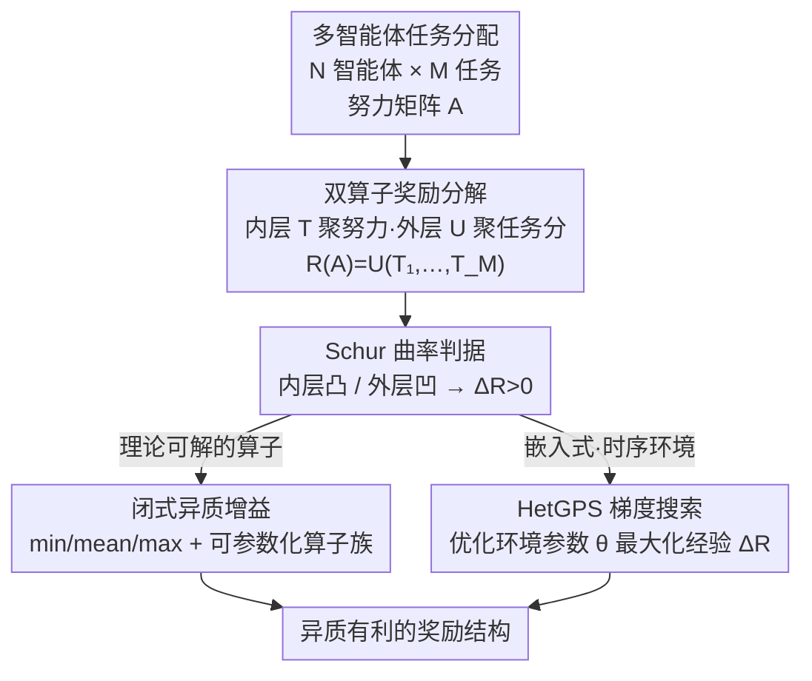

# When Is Diversity Rewarded in Cooperative Multi-Agent Learning?

**会议**: ICLR 2026  
**OpenReview**: [https://openreview.net/forum?id=uJCGMBO6Qx](https://openreview.net/forum?id=uJCGMBO6Qx)  
**代码**: https://sites.google.com/view/hetgps  
**领域**: 强化学习 / 多智能体  
**关键词**: 多智能体强化学习, 行为异质性, 任务分配, Schur 凸性, 奖励设计

## 一句话总结
这篇论文把"多智能体团队什么时候需要分工"这个老问题，归结成奖励函数的曲率判据——把团队奖励拆成"内层算子聚合各智能体在单个任务上的努力、外层算子聚合各任务得分"两步，并证明只要内层算子 Schur-凸（或外层 Schur-凹），异质团队就严格优于最优同质团队；进一步用一个基于可微仿真器的梯度搜索算法 HetGPS 在嵌入式 MARL 环境里自动找出"最需要异质性"的奖励结构，结果和理论预测完全吻合。

## 研究背景与动机
**领域现状**：从机器人集群到昆虫社会，协作团队往往呈现两种组织形态——所有成员行为一致的**同质团队（homogeneous）**，或者成员各司其职、专精不同角色的**异质团队（heterogeneous）**。在多智能体学习里，这对应"所有 agent 共享同一套行为"还是"agent 行为分化"的建模选择，异质性可以通过独立策略网络（neural heterogeneity），也可以通过共享策略+不同输入（如角色编码）来实现。

**现有痛点**：异质性确实能解锁角色专精和非对称信息利用，但它同时带来额外的协调成本、表示开销和学习复杂度。直觉上"分工更好"，但学界一直缺一个**原则性的判据**来回答：到底在什么条件下，异质团队才会真的打败最优的同质 baseline？过去多是经验观察（某个环境里分工有用），没有可证明、可迁移的标准。

**核心矛盾**：异质性的收益不是普适的——它取决于**任务的奖励结构**本身。同一批 agent，换一个奖励聚合方式，分工可能从"必需"变成"毫无意义"。问题的根本在于：奖励函数如何把"各 agent 在各任务上的努力"映射成"团队标量回报"，这个聚合过程的曲率决定了一切，但没人把它形式化。

**本文目标**：(1) 在一个干净的、非空间、瞬时的任务分配模型里，给出"何时 $\Delta R > 0$（异质增益为正）"的充要型判据；(2) 把判据迁移到真实的、嵌入式、时序展开的 MARL 环境；(3) 提供一个算法，能在理论难以直接套用的复杂环境里自动发现"奖励分工"的配置。

**切入角度**：作者观察到，许多任务分配问题的团队奖励都能写成 $R(A) = U\big(T_1(a_1), \dots, T_M(a_M)\big)$ 这种"两层聚合"的结构——内层算子 $T_j$ 把 $N$ 个 agent 在任务 $j$ 上的努力聚成一个任务得分，外层算子 $U$ 把 $M$ 个任务得分聚成全局奖励。一旦写成这个形式，"分工是否有利"就变成了一个关于 $T$、$U$ 曲率的数学问题。

**核心 idea**：用**Schur-凸/凹性**作为统一判据——内层算子 Schur-凸（奖励偏好"不均衡的努力分布"）就需要异质性，Schur-凹（偏好"均匀"）就不需要；并用梯度法直接在环境参数空间里搜索，验证并外推这一理论。

## 方法详解

### 整体框架
本文不是提出一个新模型，而是先建一套**理论判据**，再配一个**算法搜索器**来验证它。整体逻辑是：把多智能体任务分配的团队奖励统一抽象成"内层 $T$ + 外层 $U$"的双算子分解，用 Schur 凸性给出"何时异质增益 $\Delta R > 0$"的定理；在 $\{\min, \text{mean}, \max\}$ 这类典型算子和可参数化算子族（Softmax / Power-Sum）上推出闭式增益；最后对理论覆盖不到的嵌入式时序环境，用 HetGPS 这个梯度搜索器去优化环境参数 $\theta$，自动逼出"最需要分工"的奖励结构，看它是否回到理论预测的"内凸外凹"区域。

### 关键设计

**1. 双算子奖励分解与 Schur 曲率判据：把"是否需要分工"变成可证明的曲率问题**

痛点是过去"分工是否有利"全靠经验，没有统一判据。本文先把团队奖励统一写成两层聚合 $R(A) = U\big(T_1(a_1), \dots, T_M(a_M)\big)$，其中 $A = [r_{ij}]$ 是 $N \times M$ 的努力矩阵，$r_{ij} \ge 0$ 且每个 agent 的努力满足预算约束 $\sum_j r_{ij} \le 1$；内层 $T_j$ 把任务 $j$ 那一列努力 $a_j = [r_{1j}, \dots, r_{Nj}]^\top$ 聚成任务得分，外层 $U$ 把 $M$ 个得分聚成标量奖励。同质策略要求所有 agent 行用同一行 $r_{ij} = c_j$，最优同质奖励记 $R_\text{hom}$；异质策略允许每个 agent 独立选努力，最优记 $R_\text{het}$。**异质增益** 定义为 $\Delta R = R_\text{het} - R_\text{hom}$，刻画"允许分工"能比"强制一致"多拿多少奖励。

关键洞察是 $\Delta R$ 的符号完全由 $T$、$U$ 的曲率决定，而曲率用 **Schur 凸性** 刻画：若 $x$ 通过"把质量从大坐标搬向小坐标使其更均匀"能得到 $y$（即 $x$ majorize $y$，$x \succ y$），则 Schur-凸函数满足 $f(x) \ge f(y)$（随不均衡而增大），Schur-凹则随均匀而增大。论文证明了三条核心定理：**定理 3.1**——内层 $T_j$ 严格 Schur-凸且外层 $U$ 坐标单调递增，则除非最优同质解是平凡的（所有 agent 把全部预算压到同一个任务），否则 $\Delta R > 0$；**定理 3.2**——内层 $T_j$ Schur-凹则 $\Delta R = 0$（分工无益）；**定理 3.3**——在任务得分总和恒定（$\sum_j T_j = C$）的约束下，外层 $U$ 严格 Schur-凸则 $\Delta R = 0$。合起来就是一句话：**内层凸 + 外层凹 → 偏好异质**。直觉上，内层凸意味着"一个任务集中投入比分摊更值"（鼓励 agent 各自专精），外层凹意味着"所有任务都得照顾到、不能落下"（鼓励 agent 分散到不同任务），两者叠加正好逼出分工。

**2. min / mean / max 与可参数化算子族：把抽象判据落成可算的奖励工具箱**

光有曲率判据还不够直观，作者把它具体化到工程上最常见的算子。$\{\min, \text{mean}, \max\}$ 是天然的三个极点：$\min$ 是"最大程度 Schur-凹"，$\max$ 是"最大程度 Schur-凸"，$\text{mean}$ 既凸又凹（边界情形）。对内外算子的全部 9 种组合，论文在连续努力（$r_{ij} \in [0,1]$）和离散努力（$r_{ij} \in \{0,1\}$）两种设定下都推出了**闭式异质增益**（如 $U = \min, T = \max$ 的连续情形 $\Delta R_F = (M-1)/M$），这让"某个奖励结构要不要分工、能多拿多少"变成一次简单计算。

更重要的是**可参数化算子族**：很多算子族 $\{f_t(\cdot)\}_{t \in \mathbb{R}}$ 可由一个标量 $t$ 连续调节曲率，从而在 Schur-凹和 Schur-凸之间平滑过渡。典型的是 Softmax 聚合器 $\sum_i \frac{\exp(t \cdot r_{ij})}{\sum_\ell \exp(t \cdot r_{\ell j})}$，由温度 $t$ 控制：$t < 0$ 时严格 Schur-凹、$t > 0$ 时严格 Schur-凸。这把"奖励设计"变成了"在一个低维参数空间里调曲率"，既给理论提供了可扫描的连续谱，也为后面的 HetGPS 圈定了一个有意义的搜索空间。

**3. HetGPS：用可微仿真器的梯度，直接搜出"最需要分工"的环境**

理论判据在干净的瞬时模型上漂亮，但真实 MARL 环境是嵌入式、部分可观测、时序展开的，努力 $r_{ij}^t$ 要靠 agent 在时间上的运动逐步实现，曲率分析不一定直接套得上。为此作者提出 **Heterogeneity Gain Parameter Search（HetGPS）**：把环境建成一个**参数化 Dec-POMDP（PDec-POMDP）**，其观测/转移/奖励都依赖参数 $\theta$，于是回报 $G_\theta(\pi)$ 对 $\theta$ 可微。定义经验异质增益为异质团队（独立参数策略 $\pi_\text{het}$）与同质团队（共享参数 $\pi_\text{hom}$）的回报差 $\text{HetGain}_\theta = G_\theta(\pi_\text{het}) - G_\theta(\pi_\text{hom})$，然后在可微仿真器里对时间反传，用梯度上升 $\theta \leftarrow \theta + \alpha \nabla_\theta \text{HetGain}_\theta$ 去最大化它（梯度下降则可反过来找"同质就够"的环境）。

整个过程是**双层迭代优化**：每轮先用当前 $\theta$ 分别滚动异质和同质团队收集 batch、算增益，再更新环境 $\theta$；agent 策略则用任意 on-policy MARL 算法（如 MAPPO）单独训练（环境用一阶梯度、策略用零阶 policy-gradient，刻意分开以避免陷入局部极小）。训练调度有"交替式"和"并发式"两种。它和 PAIRED 这类自动课程方法形似（都在设计对一方有利的环境），但关键区别在于：HetGPS 用**可微仿真器直接对环境做 regret 梯度反传**而非用 RL 训练环境设计者，效率更高且绕开了 RL 的探索低效和奖励信号依赖；而且对抗双方是**两支独立的多智能体团队**，不是单个 agent。

### 损失函数 / 训练策略
HetGPS 的环境侧目标就是经验异质增益 $\text{HetGain}_\theta(\pi_\text{het}, \pi_\text{hom}) = G_\theta(\pi_\text{het}) - G_\theta(\pi_\text{hom})$，对 $\theta$ 做梯度上升（最大化分工优势）或下降（最小化）；agent 侧用标准 MARL（MAPPO）训练。矩阵游戏实验取 $N = M = 4$、训练 12M 步；嵌入式环境（Multi-goal-capture、Tag）训练 30M 帧；HetGPS 在 Multi-goal-capture 上跑 90M 帧、13 个随机种子。

## 实验关键数据

实验分三阶段层层递进：**瞬时矩阵游戏 → 嵌入式时序环境 → HetGPS 自动奖励设计**，目标都是验证"内凸外凹偏好异质"这条曲率理论。

### 主实验

| 实验阶段 | 环境 | 设置 | 关键结论 |
|--------|------|------|----------|
| 矩阵游戏 | 单步无观测任务分配 | $N=M=4$，9 种 $\{\min,\text{mean},\max\}$ 组合，12M 步，9 seeds | 学到的策略的异质增益**精确吻合**理论闭式预测（Fig. 2）|
| Multi-goal-capture | 嵌入式连续努力导航 | $U,T \in \{\min,\text{mean},\max\}$，30M 帧，9 seeds | 仅 $U=\min,T=\max$ 和 $U=\text{mean},T=\max$（凹-凸）出现 $\Delta R > 0$，与理论一致 |
| 2v2 Tag | 嵌入式离散努力追逃 | 稀疏奖励，30M 帧，9 seeds | 离散努力的理论预测精确命中哪些算子 $\Delta R > 0$ |
| Football | VMAS 连续控制 | $R(A)$ 仅是全局奖励的一部分 | 理论在"奖励只占一部分"时仍高度可预测 |
| HetGPS | Multi-goal-capture 参数化奖励 | Softmax / Power-Sum 算子，90M 帧，13 seeds | 自动学到 $T$ 变 Schur-凸、$U$ 变 Schur-凹，**重新发现**理论最优奖励结构 |

### 消融 / 分析实验

| 配置 | 现象 | 说明 |
|------|------|------|
| Softmax 初始化 $\tau_1=\tau_2=0$（均为 mean）| 训练后 $\tau_1$ 拉大、$\tau_2$ 压小 | HetGPS 把内层推向 Schur-凸、外层推向 Schur-凹 |
| Power-Sum 初始化 $\tau_1=\tau_2=1$（均为 sum），约束 $[0.3,6]$ | 同样收敛到内凸外凹 | 换一族可参数化算子结论不变，说明发现的是结构而非算子特例 |
| 提高 agent 观测丰富度 | 经验异质增益逐渐消失 | 富观测让"共享网络的同质 agent"也能表现出行为异质，复现了已有发现 |

### 关键发现
- **三阶段一致性**：从瞬时矩阵游戏到嵌入式时序环境，曲率理论始终能预测"哪些算子组合 $\Delta R > 0$"，说明判据不是干净模型里的玩具结论，而是能迁移到真实 MARL 的。
- **HetGPS 反向验证理论**：在完全不告诉它"内凸外凹"的情况下，纯梯度搜索自己收敛到了理论预测的最优奖励结构，双向印证了算法有效性和理论正确性。
- **可观测性-异质性权衡**：异质性分"神经异质（不同网络）"和"行为异质（行为不同）"两层，本文关心的是后者。当同质 agent 的观测变丰富（能感知彼此），它们用同一套网络也能产生行为异质，于是 $\Delta R$ 消失——这提醒"是否需要独立网络"取决于观测设计。
- **算子有现实语义**：如 $U=\max,T=\min$ 表示"所有 agent 去同一个目标"，$U=\min,T=\max$ 表示"每个 agent 去不同目标且所有目标都要覆盖"——后者天然是分工场景，理论也正好判它需要异质。

## 亮点与洞察
- **把"要不要分工"还原成一个曲率判据**：最漂亮的地方是用 Schur 凸性把一个模糊的设计直觉变成可证明、可计算的充要型条件——"内层凸 + 外层凹 = 需要异质"，一句话就能指导奖励设计，这种"理论压缩"非常有迁移价值。
- **理论与算法互为验证**：HetGPS 不被告知答案却梯度搜出理论最优结构，是"理论预测—算法发现"闭环的漂亮范例；这种"用搜索器反向确认理论"的实验设计本身就值得借鉴。
- **可微环境设计的新用法**：把 PAIRED 式的对抗环境设计从"RL 训练环境设计者"改成"对可微仿真器直接反传 regret 梯度"，效率更高且免奖励信号，这个 trick 可迁移到任何"想自动搜索某种环境属性"的任务（如找最难/最易、最公平/最不公平的环境）。
- **澄清神经异质 vs 行为异质**：指出异质性收益其实是行为层面的，富观测能让同质网络变行为异质——这对实践中"到底要不要给 agent 独立网络"是很实在的指导。

## 局限与展望
- **理论建立在干净的努力-分配抽象上**：把 agent 贡献抽象成标量"努力" $r_{ij}$、奖励写成双算子聚合，是个理想化模型；真实任务里努力难以这样干净定义，定理 3.1 的"非平凡最优同质解"等前提也未必总满足。
- **$\Delta R > 0$ 在 MARL 里只是证据不是保证**：作者明确说，在嵌入式环境里 $\Delta R > 0$ 表示"最优异质策略优于最优同质策略"，但学习 agent 未必收敛到最优，所以这是经验证据而非形式化保证。
- **定理 3.3 依赖恒定和约束**：外层 Schur-凸 → 无增益这条，需要任务得分总和恒定的假设，限制了其适用范围。
- **HetGPS 依赖可微仿真器**：核心效率来自对环境反传梯度，非可微环境需退回零阶方法（附录讨论），实际部署门槛较高。
- **改进方向**：把判据推广到努力相互依赖、非可加的奖励结构，或在更大规模、更异构的真实多机器人任务上验证迁移性。

## 相关工作与启发
- **vs PAIRED（自动课程环境设计）**：PAIRED 用 RL 训练一个环境设计者，让对抗 agent 成功、protagonist 失败，从而生成难度适中的环境；HetGPS 形式相近但目标换成"对异质团队有利、对同质团队不利"，且改用可微仿真器直接反传 regret 梯度（更高效、免奖励信号），对抗双方是两支多智能体团队而非单 agent。
- **vs 行为异质性的经验研究（Bettini et al. 2023 等）**：以往工作多在具体环境里经验观察"分工有没有用"，本文给出可证明、可迁移的曲率判据，并解释了诸如"min 算子（要求只有一个 agent 去某目标）为何天然需要异质"这类经验现象的数学根因。
- **vs 富观测诱导异质性（Leibo et al. 2019）**：本文复现并解释了"富观测让同质网络也能行为异质"的发现，把它纳入"神经异质 vs 行为异质"的统一框架，指出本文判据针对的是行为异质。

## 评分
- 新颖性: ⭐⭐⭐⭐⭐ 用 Schur 凸性给"何时需要分工"一个可证明的充要型判据，并配可微环境搜索算法双向验证，视角新颖。
- 实验充分度: ⭐⭐⭐⭐ 矩阵游戏到 Football 三阶段、多算子多种子，覆盖广；但都在仿真，缺真实机器人验证。
- 写作质量: ⭐⭐⭐⭐⭐ 理论与实验逻辑清晰，定理-算子-算法层层递进，直觉解释到位。
- 价值: ⭐⭐⭐⭐⭐ 给多智能体奖励设计提供了可直接套用的曲率判据，对何时上异质策略有实操指导。

<!-- RELATED:START -->

## 相关论文

- [\[ICLR 2026\] Potentially Optimal Joint Actions Recognition for Cooperative Multi-Agent Reinforcement Learning](potentially_optimal_joint_actions_recognition_for_cooperative_multi-agent_reinfo.md)
- [\[CVPR 2026\] TaskForce: Cooperative Multi-agent Reinforcement Learning for Multi-task Optimization](../../CVPR2026/reinforcement_learning/taskforce_cooperative_multi-agent_reinforcement_learning_for_multi-task_optimiza.md)
- [\[ICLR 2026\] Multi-Agent Guided Policy Optimization](multi-agent_guided_policy_optimization.md)
- [\[ICML 2026\] LLM-Guided Communication for Cooperative Multi-Agent Reinforcement Learning](../../ICML2026/reinforcement_learning/llm-guided_communication_for_cooperative_multi-agent_reinforcement_learning.md)
- [\[ICLR 2026\] SocialJax: An Evaluation Suite for Multi-Agent Reinforcement Learning in Sequential Social Dilemmas](socialjax_an_evaluation_suite_for_multi-agent_reinforcement_learning_in_sequenti.md)

<!-- RELATED:END -->
