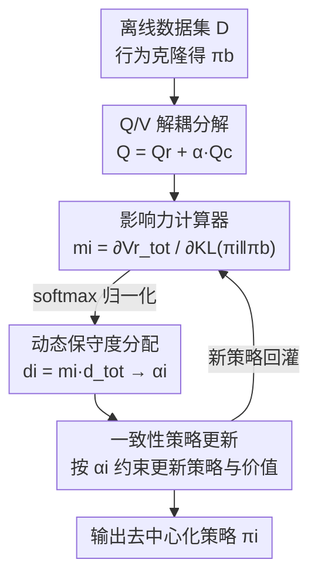

# Who Matters Matters: Agent-Specific Conservative Offline MARL

**会议**: ICLR 2026  
**OpenReview**: [https://openreview.net/forum?id=oWzLIDYime](https://openreview.net/forum?id=oWzLIDYime)  
**领域**: 强化学习 / 离线多智能体  
**关键词**: 离线 MARL, 保守度分配, 价值分解, 异质智能体, 信用分配

## 一句话总结
针对离线多智能体强化学习里"所有智能体被一刀切地施加相同保守度"的问题，本文提出 OMCDA：先把 Q 函数解耦成"回报"和"策略偏离"两部分，再用每个智能体对系统回报的影响力动态地给它分配保守度，让高影响力智能体敢于偏离行为策略、低影响力智能体保持谨慎，在 MuJoCo 和 SMAC 上一致超过现有离线 MARL 方法。

## 研究背景与动机

**领域现状**：离线强化学习（Offline RL）让智能体只从静态数据集学策略、训练阶段不与环境交互，特别适合交互成本高或有安全风险的场景。它的核心难点是对分布外（OOD）动作的 Q 值高估，主流解法是"保守"（conservatism）——惩罚数据集里没充分支撑的动作，把学到的策略约束在行为策略附近。扩展到多智能体（Offline MARL）后，通常在 CTDE 框架下结合价值分解（如 QMIX、VDN）与离线保守来稳定训练。

**现有痛点**：现有方法几乎都对所有智能体施加**统一**的保守度。但真实多智能体系统里，不同智能体角色和能力不同，对系统整体表现的影响天差地别。论文用足球队打比方：前锋应该被鼓励做高风险、有创造性的动作以追求进球，后防则必须保持纪律、规避风险。如果对二者施加同样强度的保守约束，会**过度约束**关键智能体（限制前锋发挥）、又**约束不足**次要智能体（让后防暴露在高代价错误下），最终破坏协作。

**核心矛盾**：保守度本该随智能体的角色、不确定性和潜在影响而变，但统一保守把"安全 vs 探索"这个 trade-off 在所有智能体身上压成了同一个值。更麻烦的是，在带正则的离线 RL 里，Q 函数把"回报"和"偏离行为策略的约束"两项纠缠在一起，根本无法干净地度量某个智能体的偏离到底对系统回报有多大贡献——没有这个度量，就无从谈"按影响力分配"。

**本文目标**：(1) 提供一种能干净度量"单个智能体策略偏离对系统回报影响"的机制；(2) 据此把一个固定的总保守度自适应地拆给各智能体，并保证拆分后局部最优与全局最优一致、信用分配前后一致。

**切入角度**：既然纠缠是障碍，那就先把 Q 函数（和 V 函数）拆成"回报项 $Q^r$"与"保守/偏离项 $Q^c$"。$Q^r$ 隔离了保守约束，能直接反映策略偏离对系统回报的敏感度，进而定义每个智能体的"影响力"。

**核心 idea**：用"$V^r_{tot}$ 对该智能体 KL 偏离的偏导"作为影响力 $m_i$，把总保守度按影响力 softmax 分配给各智能体——谁对系统回报更重要，谁就被允许更大幅度地偏离行为策略。

## 方法详解

### 整体框架

OMCDA（Offline MARL with Conservative Degree Allocation）建立在 QMIX 式的 CTDE 价值分解之上，核心是把"统一保守"换成"按影响力动态分配的保守度"。整体可以看成一条闭环：从离线数据集出发，先做行为克隆得到行为策略 $\pi_b$ 并把全局 Q/V 解耦成回报与保守两路；然后一个**影响力计算器**读入各智能体当前策略、回报型状态价值 $V^r_{tot}$ 和 $\pi_b$，算出每个智能体的影响力 $m_i$；接着从固定的总保守度 $d_{tot}$ 里按 $m_i$ 切出每个智能体的局部保守度 $d_i$，再换算成保守强度 $\alpha_i$；最后把 $\alpha_i$ 作为网络更新的约束注入策略与价值函数的更新，得到下一轮策略，再回到影响力计算，如此动态滚动。

### 关键设计

**1. Q/V 函数解耦分解：把"挣回报"和"守规矩"拆开算**

带正则的离线 RL 里，Q 函数 $Q(o,a)=\mathbb{E}[\sum_t \gamma^t(r_t-\alpha D_{KL}(\pi_t\|\pi_b))]$ 把回报和 KL 偏离惩罚揉在一起，导致无法判断"某智能体偏离行为策略"究竟对系统回报是好是坏。受 BOPAH 启发，本文把它拆成两路：$Q(o,a)=Q^r(o,a)+\alpha\cdot Q^c(o,a)$，其中 $Q^r:=\mathbb{E}[\sum_t\gamma^t r_t]$ 只算回报、$Q^c:=\mathbb{E}[-\sum_t\gamma^t D_{KL}(\pi_t\|\pi_b)]$ 只算偏离；V 函数同理拆成 $V^r+\alpha V^c$，并给出各自的 Bellman 回填算子。扩展到多智能体时，在 QMIX 框架下全局 Q 写成 $Q_{tot}=Q^r_{tot}+\sum_i \alpha_i Q^{c,i}$，回报项 $Q^r_{tot}=\sum_i w^r_i Q^r_i+b^r$ 通过价值分解把全局回报派发给各智能体，保守项 $Q^{c,i}=\sum_j w^{c,i}_j Q^c_j+b^{c,i}$ 则是对所有智能体保守值的加权和。

这步是后续一切的基础：只有把回报从保守约束里隔离出来，$V^r_{tot}$ 才能"纯净地"反映策略偏离对系统回报的影响，影响力度量才有意义。

**2. 影响力驱动的动态保守度分配：谁更重要谁就更敢偏**

有了干净的 $V^r_{tot}$，本文定义每个智能体的影响力为系统回报对其 KL 偏离的敏感度：$m_i=\dfrac{\partial V^r_{tot}(o)}{\partial D_{KL}(\pi_i\|\pi_i^b)}$。直觉是：若某智能体稍微偏离行为策略就能显著抬高系统回报，说明它影响力大、应被允许更大偏离；反之偏导小则该收紧约束以规避风险。实际计算时用链式法则拆成 $m_i=\dfrac{\partial V^r_{tot}}{\partial \pi_i}\big(\dfrac{\partial D_{KL}(\pi_i\|\pi_i^b)}{\partial \pi_i}\big)^{-1}$，前项捕捉策略变化的系统影响、后项度量对行为策略的偏离。由于总保守度约束 $\sum_i d_i=d_{tot}$ 固定，本文对所有 $m_i$ 做 softmax 归一化，再令 $d_i=m_i\cdot d_{tot}$，最后通过 $\min_{\alpha_i}(\alpha_i d_i-\alpha_i D_{KL}(\pi_i\|\pi_i^b))$ 把分到的保守度换算成可用于更新的保守强度 $\alpha_i$。

这正是论文与 CFCQL 等方法的关键区别：CFCQL 只按"行为策略偏离"决定保守度，OMCDA 进一步考虑"该智能体对系统表现的影响"，从而在保守与灵活之间做出更优的、随角色而异的权衡。

**3. 局部—全局一致性保证：每个智能体单独调 $\alpha_i$ 仍不破坏全局最优**

动态地给每个智能体不同的 $\alpha_i$ 带来一个隐患：会不会破坏 CTDE 下"局部最优拼起来等于全局最优"的可分解性？本文用一组命题与定理把这点钉死。Proposition 3.1 给出离线 MARL 全局最优策略形式 $\pi^*_{tot}(a|o)=\pi_b(a|o)\exp(\frac{1}{\alpha}(Q^*-V^*))$；Proposition 3.2 把联合策略分解为各智能体策略之积，并推出每个智能体的最优策略 $\pi^*_i$ 含 $\frac{w^r_i}{\alpha_i}(Q^{r*}_i-V^{r*}_i)+(Q^{c,i*}-V^{c,i*})$ 的指数形式；Theorem 3.3 证明在为各智能体分配**各自的** $\alpha_i$ 的情况下，局部最优 $\pi^*_i$ 与全局最优 $\pi^*_{tot}$ 仍然一致。最后 Proposition 3.4 给出基于"局部策略归一化 $\sum_{a_i}\pi^*_i=1$"约束推导出的保守价值函数 $V^c_i$ 更新目标。这套推导保证了"个性化保守"不是把团队拆散，而是在保持一致信用分配的前提下让异质智能体更好协作。

### 损失函数 / 训练策略

训练目标可统一为最大化全局回报型状态价值 $\max_\pi \mathbb{E}[V^r_{tot}(o)]$。每轮先用解耦后的 $V^r_{tot}$ 估影响力 $m_i$ 并 softmax 得 $d_i$、解出 $\alpha_i$，再按 Proposition 3.4 的目标更新保守价值函数 $V^c_i$（式 25），同时用带 $\alpha_i$ 的 Bellman 算子更新 $Q^r/Q^c$ 并更新策略。行为策略 $\pi_b$ 由离线数据集行为克隆得到，总保守度 $d_{tot}$ 是需调的关键超参（实验中在 MuJoCo 取 0.3/1.2/3、SMAC 取 0.6/1.8/3 等档位上扫描）。

## 实验关键数据

### 主实验

在 Multi-Agent MuJoCo（Hopper / Ant / HalfCheetah，每个含 expert / medium / medium-replay / medium-expert 四个质量档）与 SMAC（hard 图 5m_vs_6m，super hard 图 corridor、6h_vs_8z，每个含 good / medium / poor 三档）上评测，对比 7 个离线 MARL 基线，5 个随机种子。

| 环境 | 任务设置 | 对比基线 | 结论 |
|------|----------|----------|------|
| Multi-Agent MuJoCo | Hopper/Ant/HalfCheetah × 4 档质量 | BCQ-MA, CQL-MA, ICQ, OMAR, CFCQL, OMIGA, ComaDICE | OMCDA 平均回报一致领先 |
| SMAC | 5m_vs_6m / corridor / 6h_vs_8z × 3 档质量 | 同上 7 个基线 | OMCDA 在 hard / super hard 图均取得最高平均回报 |

> ⚠️ 原文主结果以柱状图（Figure 2）呈现，逐任务的均值/方差在附录给出；上表为定性归纳，精确数值以原文为准。

### 消融实验

在 HalfCheetah 与 6h_vs_8z 上做三组消融，验证两大创新各自的作用：

| 配置 | 改动 | 结果 |
|------|------|------|
| OMCDA（Full） | 完整模型 | 最优，一致优于所有消融版本 |
| OMCDA-w/o-CDA | 所有智能体共享同一 $d_i$，取消按影响力分配 | 保守度失衡、性能明显下降 |
| OMCDA-w/o-dq | 保留动态分配但去掉 Q 函数解耦，回报与偏离重新纠缠 | 学习被削弱，目标耦合导致回报变差 |
| OMCDA-rd | 给每个智能体随机分配 $d_i$ | 忽略智能体真实影响差异，表现更差 |

### 关键发现

- **影响力与回报正相关**：Figure 3 在 Ant / Hopper 上显示，个体回报 $V^r_i$ 越高的智能体被分到越大的影响力 $m_i$，从而获得更大偏离空间去进一步贡献系统回报——这正面验证了"按影响力分配保守度"的合理性。
- **两大创新缺一不可**：去掉动态分配（w/o-CDA）会失衡、去掉解耦（w/o-dq）会因目标纠缠而退化、随机分配（rd）证明"策略性分配"本身才是关键，三者共同表明动态分配 + Q 解耦是离线多智能体协作与高效学习的必要条件。
- **总保守度 $d_{tot}$ 敏感**：在 MuJoCo（0.3/1.2/3）与 SMAC（0.6/1.8/3）上扫描显示性能对 $d_{tot}$ 取值敏感，需按环境调参。

## 亮点与洞察
- **"解耦才能度量"是核心洞见**：把回报项从保守约束里拆出来，看似只是数学技巧，实则解锁了"用偏导度量单个智能体影响力"这一整套机制——没有干净的 $V^r_{tot}$，影响力就无从定义。这种"先解耦再度量"的思路可迁移到任何需要在纠缠目标里归因单元贡献的场景。
- **把"信用分配"和"保守度分配"统一起来**：影响力 $m_i$ 既衡量谁对回报贡献大，又直接决定谁的约束该放松，相当于让信用分配和保守强度共用同一把尺子，逻辑自洽。
- **理论上证明个性化不破坏可分解性**：Theorem 3.3 用一致性保证回应了"每个智能体单独调 $\alpha_i$ 会不会破坏 CTDE"的疑虑，这是该方法敢于"因人而异"的底气。

## 局限与展望
- **依赖 $V^r$ 偏导的影响力度量**：$m_i$ 需要对 $V^r_{tot}$ 关于 KL 偏离求偏导并用链式法则近似，其稳定性和计算精度在智能体数量很多或价值函数估计噪声大时可能受影响。
- **总保守度 $d_{tot}$ 仍需手调**：实验显示性能对 $d_{tot}$ 敏感，方法把"如何分配"自动化了，但"分配总量"仍是依赖环境的超参，没有自适应给出。
- **实验范围**：评测集中在 MuJoCo 连续控制与 SMAC 合作博弈，是否在竞争性、更大规模或部分奖励异质的多智能体场景下同样有效仍待验证。
- **共享全局奖励假设**：方法建立在所有智能体共享同一全局奖励的合作设定上，对个体奖励不同的混合动机场景需要进一步扩展。

## 相关工作与启发
- **vs CFCQL**：CFCQL 仅按"行为策略偏离"确定保守度，OMCDA 额外引入"智能体对系统表现的影响力"，因此能在保守与灵活间做更有针对性的权衡，区别在于把"重要性"纳入了约束强度。
- **vs FOP / ADER**：二者是在线方法、用动态熵正则，但自适应只作用于策略更新，对 Q/V 更新仍施加全局统一或无约束；OMCDA 把动态保守同时注入策略与价值函数，且专为离线、异质、按智能体分配约束而设计，更贴合缓解离线 OOD 问题。
- **vs OMIGA / OMAR / ICQ 等统一保守的离线 MARL**：这些方法对所有智能体一刀切保守，OMCDA 的核心增量在于"个性化保守度 + 一致性保证"，把异质性从被忽略的因素变成被显式利用的资源。

## 评分
- 新颖性: ⭐⭐⭐⭐ 把"按影响力分配保守度"做成可度量、可证一致的框架，角度新颖
- 实验充分度: ⭐⭐⭐⭐ 覆盖 MuJoCo + SMAC 多档质量、7 个基线、三组消融，但主结果以图呈现、逐项数值需查附录
- 写作质量: ⭐⭐⭐⭐ 动机（足球队类比）和方法推导清晰，理论命题完整
- 价值: ⭐⭐⭐⭐ 异质智能体的个性化保守是离线 MARL 的真实痛点，思路有迁移价值

<!-- RELATED:START -->

## 相关论文

- [\[ICLR 2026\] What Matters for Batch Online Reinforcement Learning in Robotics?](what_matters_for_batch_online_reinforcement_learning_in_robotics.md)
- [\[ICLR 2026\] Learning What Matters Now: Dynamic Preference Inference under Contextual Shifts](learning_what_matters_now_dynamic_preference_inference_under_contextual_shifts.md)
- [\[ICLR 2026\] Peng's Q($\lambda$) for Conservative Value Estimation in Offline Reinforcement Learning](pengs_qlambda_for_conservative_value_estimation_in_offline_reinforcement_learnin.md)
- [\[ICLR 2026\] Trajectory Generation with Conservative Value Guidance for Offline Reinforcement Learning](trajectory_generation_with_conservative_value_guidance_for_offline_reinforcement.md)
- [\[ICLR 2026\] Triple-BERT：在网约车派单上我们真的需要 MARL 吗？](triple-bert_do_we_really_need_marl_for_order_dispatch_on_ride-sharing_platforms.md)

<!-- RELATED:END -->
