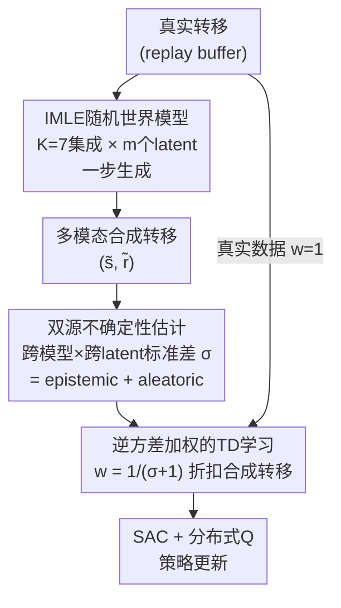

# WIMLE: Uncertainty-Aware World Models with IMLE for Sample-Efficient Continuous Control

**会议**: ICLR 2026  
**arXiv**: [2602.14351](https://arxiv.org/abs/2602.14351)  
**代码**: 无（Apex Lab, SFU）  
**领域**: 强化学习  
**关键词**: 基于模型的强化学习, IMLE, 不确定性估计, 多模态世界模型, 样本效率, 连续控制

## 一句话总结
WIMLE将隐式最大似然估计（IMLE）扩展到model-based RL，学习能捕获多模态转移动力学的随机世界模型，通过ensemble+latent采样估计预测不确定性，用不确定性加权合成数据的RL目标，在40个连续控制任务上实现超越模型-free和model-based强基线的样本效率和渐近性能。

## 研究背景与动机

**领域现状**：Model-based RL通过学习世界模型生成合成数据增强策略训练，理论上应大幅提升样本效率。但实际中MBRL长期难以一致超越强model-free基线。

**现有痛点**：(1) 标准预测模型在同一state-action对产生不同/冲突监督信号时（部分可观测、接触丰富、固有随机性）会平均化多模态→regression to the mean，产生非物理的预测；(2) 缺乏不确定性感知→世界模型在数据不足或动力学复杂的区域过度自信，误导策略学习。

**核心矛盾**：需要多模态世界模型但不能太慢（diffusion model迭代采样慢不适合online RL），需要不确定性加权但不能改变Bellman不动点。

**本文目标**：(1) 如何高效学习多模态世界模型？(2) 如何估计和利用预测不确定性？(3) 不确定性加权是否影响value function收敛？

**切入角度**：用IMLE——一步生成、mode-covering、低数据高效——替代Gaussian或diffusion世界模型，通过ensemble+多latent采样估计总预测方差，逆方差加权synthetic transitions。

**核心 idea**：IMLE世界模型提供多模态mode-covering预测 + ensemble×latent不确定性估计 + 逆方差加权保证最优Bellman收敛。

## 方法详解

### 整体框架
WIMLE 想解决的是一个老问题：基于模型的强化学习（model-based RL, MBRL）理论上该比 model-free 更省样本，实际却长期追不上强 model-free 基线，根因在于世界模型一遇到多模态、随机的动力学就把多个可能未来平均成一个非物理的"中间态"，还对自己的错误预测过度自信。WIMLE 在 SAC + 分布式 Q-learning（distributional Q-learning）的骨架上挂三个互相咬合的部件来破解：一组用隐式最大似然估计（implicit maximum likelihood estimation, IMLE）训练的随机世界模型集成，负责"敢于猜出多种可能未来"，生成多模态合成转移；一个基于集成与 latent 双重采样的不确定性估计器，给每条合成转移打一个方差分数；最后用逆方差权重把这些转移喂进 TD 学习目标，按可信度折扣这些猜测。整条链路从真实转移出发、经合成与打分、回到策略更新，让合成数据既丰富又不误导策略。

### 关键设计

**1. IMLE随机世界模型：用一步生成捕获多模态动力学，避开均值回归**

标准回归式世界模型在同一 $(s_t,a_t)$ 对应多个冲突后继时（接触丰富、部分可观测、固有随机）会把这些模态平均掉，预测出根本不存在的"中间态"，这正是 MBRL 追不上 model-free 的隐患。WIMLE 改用条件随机生成器 $(\tilde{s}_{t+1}, \tilde{r}_t) = g_\theta(s_t, a_t, z),\ z \sim \mathcal{N}(0, I)$，让噪声 $z$ 去对应不同模态。训练交替两步：先做无梯度的 assignment，为每个数据点从 $m$ 个候选 latent 中挑出预测最近的那个

$$z_i^* = \arg\min_{1 \leq j \leq m} \|g_\theta(s_i, a_i, z_j) - y_i\|^2$$

再做梯度下降的 update，只对这个最近样本回传 $\theta \leftarrow \theta - \eta \nabla_\theta \frac{1}{|B|}\sum_{i \in B}\|g_\theta(s_i, a_i, z_i^*) - y_i\|^2$。这套"先匹配再拉近"的 IMLE 目标保证 mode coverage——每个真实后继都至少被一个生成样本覆盖，从而不会像 Gaussian 模型那样回归到均值；而相比 diffusion 世界模型的迭代采样，IMLE 是一步生成，吞吐量足以支撑 online RL 的高频 rollout。生成器本身用 3 个残差块（Dense + ReLU + L2 normalization）实现，输入 $(s_t, a_t, z)$，奖励与后继状态走分离的输出 head。

**2. 双源不确定性估计：把模型分歧和随机性拆开同时量化**

要按可信度折扣合成数据，先得知道每条预测有多不确定，而单一来源会漏掉一半。WIMLE 训练 $K=7$ 个 IMLE 模型组成集成，每个模型再采样 $m$ 个 latent，把预测方差定义为跨模型与跨 latent 的总标准差 $\sigma(s,a) = \text{std}_{k,j}[g_{\theta_k}(s,a,z_j)]$。它可按全方差公式分解为

$$\sigma^2 = \underbrace{\text{Var}_k[\mathbb{E}_z[g_{\theta_k}]]}_{\text{epistemic}} + \underbrace{\mathbb{E}_k[\text{Var}_z[g_{\theta_k}]]}_{\text{aleatoric}}$$

前一项是模型间分歧（数据不足区域的认识论不确定性 epistemic），后一项是 latent 采样的变异性（动力学固有的偶然不确定性 aleatoric）。两者同时被捕获，意味着即便世界模型已经完美（只剩纯 aleatoric），加权仍能避免随机性给 value 估计引入偏差。

**3. 逆方差加权的TD学习：让加权既软又不破坏收敛**

有了 $\sigma$ 之后怎么用，是个微妙问题——硬阈值截断 rollout 会丢数据，乱加权又可能改变 Bellman 不动点。WIMLE 取逆方差软权重 $w(s,a) = \frac{1}{\sigma(s,a) + 1} \in (0, 1]$，真实数据令 $w=1$，合成数据按上式计算，再把权重塞进 critic 损失 $\mathcal{L}_{\text{critic}} = \mathbb{E}[w_i \cdot \delta_i^2]$，不确定的远步预测自然被压低影响而非粗暴丢弃。这一选择有两条理论支撑：Lemma 1 证明任何正权重都不改变 Bellman 不动点，所以加权只影响收敛速度不改变收敛目标；Lemma 2 进一步说明在线性 critic 下，逆方差加权正是最小协方差（minimum-covariance）的无偏估计（Gauss-Markov 定理），即在所有无偏加权里方差最小。这让"按不确定性折扣"从一个启发式变成有最优性保证的原则做法，也解释了为何 WIMLE 在 rollout horizon 拉长时仍稳定。

## 实验关键数据

### 主实验（40个任务，10个seed）

**DMC Dog & Humanoid（7个任务）**：WIMLE IQM显著领先所有基线
- Humanoid-run：WIMLE比最强竞争者样本效率提升 **>50%**

**DMC全套（16个任务）**：WIMLE IQM最高

**MyoSuite（10个任务）**：WIMLE渐近性能与已接近满分的强基线持平

**HumanoidBench（14个任务）**：

| 方法 | 解决任务数 |
|------|----------|
| BRO | 4/14 |
| SimbaV2 | 5/14 |
| **WIMLE** | **8/14** |

### 消融实验

| 配置 | 效果 |
|------|------|
| WIMLE (full) | 最优 |
| 去掉不确定性加权 (w=1) | 早期可能不如model-free，验证了不确定性加权的关键性 |
| Gaussian替代IMLE世界模型 | 显著更差，验证了多模态建模的价值 |
| Rollout H=1→4→6→8 | H增大持续提升，H=8仍稳定（传统MBRL在长horizon退化） |

### 权重演化分析
- IMLE：训练初期权重低（不确定性高），随数据增加权重上升（confidence增强）
- Gaussian：权重始终平坦，反映calibration不足

### Wall-clock比较
- WIMLE与MBPO相当，显著快于TD-MPC2和DreamerV3

## 亮点与洞察
- **IMLE在MBRL中的首次应用**：mode-covering特性天然适合多模态动力学，one-step生成保证rollout速度
- **理论严谨性**：Bellman不动点保持+逆方差最优性的双重理论保证，使不确定性加权不仅是启发式而是有原则性的
- **长horizon稳定性**：传统MBRL在rollout变长时退化，WIMLE通过不确定性加权自然降低远步预测的影响，实现稳定的长horizon rollout
- **全方差分解**：同时捕获epistemic和aleatoric不确定性，即使完美世界模型（纯aleatoric）也能通过加权避免随机性引入的bias

## 局限与展望
- Ensemble of 7 models增加了计算和内存开销（虽然并行训练高效）
- IMLE的assignment step虽然无梯度但增加了实现复杂度
- Rollout horizon作为超参需per-task调整
- 在已接近满分的MyoSuite任务上提升空间有限
- 目前仅处理state-based输入，视觉输入的扩展值得探索

## 相关工作与启发
- **vs MBPO**: WIMLE本质上可视为IMLE升级版MBPO——替换Gaussian ensemble为IMLE ensemble + 加入不确定性加权
- **vs DreamerV3**: Dreamer使用latent space世界模型+learned reward，WIMLE在state space操作，更透明
- **vs Infoprop**: Infoprop用信息论度量truncate rollout，WIMLE用逆方差soft-weight——更平滑，不丢弃任何数据
- **vs BRO/SimbaV2**: 这些是model-free方法，WIMLE的MBRL范式在HumanoidBench上解决了更多任务

## 评分
- 新颖性: ⭐⭐⭐⭐ IMLE首次引入MBRL，理论保证完善，但整体思路是"更好的世界模型+更好的利用方式"
- 实验充分度: ⭐⭐⭐⭐⭐ 40个任务、4个benchmark suite、10个seed、详细消融、wall-clock对比
- 写作质量: ⭐⭐⭐⭐ 清晰的动机-方法-理论-实验结构，算法伪代码规范
- 价值: ⭐⭐⭐⭐⭐ 在MBRL领域的实质性突破，HumanoidBench 8/14的结果令人印象深刻

<!-- RELATED:START -->

## 相关论文

- [\[ICLR 2026\] Learning Massively Multitask World Models for Continuous Control](learning_massively_multitask_world_models_for_continuous_control.md)
- [\[ICLR 2026\] Sample-efficient and Scalable Exploration in Continuous-Time RL](sample-efficient_and_scalable_exploration_in_continuous-time_rl.md)
- [\[ICLR 2026\] From Observations to Events: Event-Aware World Models for Reinforcement Learning](from_observations_to_events_event-aware_world_models_for_reinforcement_learning.md)
- [\[ICLR 2026\] Object-Centric World Models from Few-Shot Annotations for Sample-Efficient Reinforcement Learning](object-centric_world_models_from_few-shot_annotations_for_sample-efficient_reinf.md)
- [\[ICML 2026\] DR.Q: Debiased Model-based Representations for Sample-efficient Continuous Control](../../ICML2026/reinforcement_learning/debiased_model-based_representations_for_sample-efficient_continuous_control.md)

<!-- RELATED:END -->
