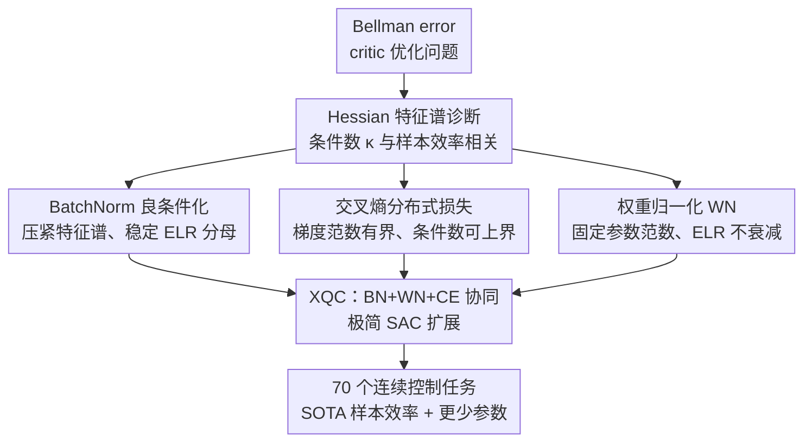

# XQC: Well-Conditioned Optimization Accelerates Deep Reinforcement Learning

**会议**: ICLR 2026  
**论文**: [OpenReview](https://openreview.net/forum?id=xqc)（⚠️ 链接以原文为准）  
**代码**: https://danielpalenicek.github.io/projects/xqc  
**领域**: 强化学习  
**关键词**: 样本效率, 优化景观, 条件数, BatchNorm, 分布式 Critic

## 一句话总结
XQC 不靠堆大模型/复杂架构，而是从 critic 损失景观的"条件数"出发，证明 BatchNorm + 权重归一化 + 交叉熵分布式损失这一组合能把 Hessian 条件数压低几个数量级、把梯度范数天然封顶，从而在 70 个连续控制任务上用 ~4.5× 更少参数达到 SOTA 样本效率。

## 研究背景与动机
**领域现状**：近年深度 RL 的样本效率提升，主流路线是"做大做复杂"——更大的网络、更高的 update-to-data (UTD) 比、各种 exotic 架构（SIMBA-V2、BRO、BRC 等）。这些改进大多由经验性能驱动，把架构当成"为了能稳定地 scale up"的工具。

**现有痛点**：这条"bigger is better"路线代价高昂——算力开销大、参数多，而且它回避了一个更本质的问题：是不是非得加复杂度才能提性能？很多架构选择（用 LayerNorm 还是 BatchNorm、要不要权重归一化、用 MSE 还是交叉熵损失）在 RL 里都是靠启发式经验拍的，缺乏原理性解释。

**核心矛盾**：RL 的 critic 训练本质上是在非平稳目标（bootstrap 的 TD target 一直在变）下做梯度优化。如果损失景观本身是病态的（ill-conditioned，即 Hessian 条件数很大），固定学习率的梯度下降就会因为各维度曲率差异悬殊而收敛极慢——这是样本效率差的一个被忽视的根因。

**本文目标**：不加复杂度，而是直接改善 critic 优化问题的"条件性"，并给出可量化的二阶分析（特征谱、条件数、有效学习率）来解释"为什么某些架构更好"。

**切入角度**：把监督学习里用 Hessian 特征值分析 BatchNorm 收益的工具，第一次系统搬到深度 RL 的 Bellman error 上。作者假设：critic 的 Hessian 条件数越低，样本效率越高。

**核心 idea**：用"良条件优化"代替"加规模"——找到 BN + WN + 交叉熵损失这个能协同压低条件数、稳定有效学习率的组合，据此搭一个极简的 SAC 扩展 XQC。

## 方法详解

### 整体框架
XQC 的工作分两段：先是**诊断**（第 3 节），系统地把 12 种 critic 架构组合（归一化 ∈ {BN, LN, Dense} × 是否 WN × 损失 ∈ {MSE, CE}）放到高维 DMC dog-trot 任务上，用随机 Lanczos 算法估计 critic Hessian 的特征谱与条件数 $\kappa$，并把 $\kappa$、最大特征值与 1M 步回报做相关性分析，得出"低条件数 → 高回报"的强趋势；再是**落地**（第 4 节），把诊断出的三个有利组件（BN、WN、交叉熵损失）合成一个极简的 actor-critic 算法 XQC，它只是在 SAC 上换 critic 架构与损失，没有任何 exotic 组件。

整个方法的因果链是：架构组件 → 损失景观条件数 → 梯度范数 / 有效学习率 (ELR) 的稳定性 → 可塑性 (plasticity) → 样本效率。下图展示从诊断到算法的流向：

### 关键设计

**1. Hessian 条件数诊断：把"好架构"从玄学变成可测的二阶量**

RL 里选 BN/LN、选损失函数长期靠经验直觉，没人说得清"为什么这个更好"。XQC 把答案落到优化理论上：损失局部可用二次近似 $L(\theta+\delta\theta)\approx L(\theta)+\nabla_\theta L\,\delta\theta+\tfrac{1}{2}\delta\theta^\top \nabla_\theta^2 L\,\delta\theta$，Hessian $\nabla_\theta^2 L$ 的特征值刻画各方向曲率。定义条件数 $\kappa(H)=\max_i|\lambda_i|/\min_i|\lambda_i|$：$\kappa$ 越大，各维度曲率差异越悬殊，固定学习率的梯度下降越低效（论文用一个二维二次例子直观展示 $\kappa$ 从 1 涨到 1000 时收敛速度逐级变慢）。作者在 dog-trot 上对 12 种架构各跑 5 seed、1M 步、20 个 checkpoint 用随机 Lanczos quadrature 估特征谱，发现 BN 架构的特征谱始终紧凑无离群、$\kappa$ 比非 BN 低一个数量级，且 $\kappa$ 与 1M 步 IQM 回报呈强负相关——这就为后面的组件选择提供了原理依据，而不是又一次经验调参。

**2. 交叉熵分布式损失：让梯度范数天然封顶、条件数可被上界**

MSE 回归损失的梯度 $\|\nabla_{\hat y}\,\tfrac12\|y-\hat y\|_2^2\|=\|y-\hat y\|$ 是无界的（命题 1），在非平稳的 bootstrap 目标下，TD 误差一大梯度就炸，景观条件数也无法被上界。XQC 改用 C51 式分类 critic（101 个 atom，输出 categorical 分布 logits），把 Bellman error 当分类问题、用交叉熵损失。命题 2 证明此时梯度对 logits 有硬上界：$\|\nabla_{\hat y}\,l(t,\hat y)\|_2=\|t-\mathrm{Softmax}(\hat y)\|_2\le\sqrt 2$。更进一步，命题 4 在 Hessian 特征值有界假设下证明交叉熵损失（配权重衰减 $\mu^2$）的条件数有有限上界 $\kappa(\nabla_\theta^2 L)\le(4\lambda^f_m+L_f^2+\epsilon)/\epsilon$，而 MSE 对应的条件数（命题 3）无法被上界。这从理论上解释了第 3 节"为什么 CE 的条件数总是比 MSE 小得多"的经验现象。配合奖励归一化 $\hat r_t=r_t/\sigma(R)$ 把 Q 值约束到 categorical critic 的支撑区间内。

**3. BatchNorm + 权重归一化协同：把有效学习率 (ELR) 钉成常数、保住可塑性**

对尺度不变函数，真正起作用的是有效学习率 $\tilde\eta=\eta/\|\theta\|_2^2$（定义 1）：若参数范数 $\|\theta\|_2$ 随训练增长，ELR 会衰减到 0，网络逐渐失去可塑性。XQC 用两招稳住它。其一，把 BN 直接放在网络输入和每个线性层之后（且把"归一化在 ReLU 之前"的顺序调换为归一化在激活之前，这样 BN 的尺度不变性对任意激活函数都成立，不止齐次激活；同时用 joined forward pass 在 $(s,a)$ 与 $(s',a')$ 联合分布上算 BN running statistics，才能把 BN 稳定地塞进 RL 循环）。其二，借助 BN 带来的尺度不变性，每步梯度更新后把每层权重投影回单位球面（WN），从而把 ELR 的分母 $\|\theta\|_2$ 固定住。两者叠加后参数范数被稳住，再叠加设计 2 的有界梯度，ELR 在整个训练过程中几乎恒定（论文 Figure 8），可塑性得以维持——这反过来允许 XQC 安全地给 Adam 加学习率调度。BN、WN、CE 三者各自独立改善条件性，组合后协同效应最强、性能最好。

### 损失函数 / 训练策略
critic 用 C51 式 categorical 交叉熵 Bellman 损失（101 atoms），奖励按回报标准差归一化 $\hat r_t=r_t/\sigma(R)$；critic 网络 4 个隐层、每层 512 神经元，仅由 Linear + BN + ReLU 三种标准组件构成；每步更新后对各 dense 层做权重单位球投影（WN）；优化器 Adam 配学习率调度；视觉任务沿用 DRQ-V2 原始图像编码器，仅改动后续 MLP，保证对比公平。全部 70 个任务共用一套超参。

## 实验关键数据

### 主实验
覆盖 5 个 benchmark suite、共 70 个连续控制任务（DMC、HumanoidBench、MyoSuite、MuJoCo 的 55 个本体感知任务 + 15 个视觉 DMC 任务），主实验每环境 10 seeds、1M 步，报告 IQM 与 90% SBCI，聚合用归一化回报曲线下面积 (AUC)。

| 评测设置 | 指标 | XQC | 最强对手 | 结论 |
|----------|------|------|----------|------|
| 55 本体感知任务（4 benchmark） | IQM AUC 归一化回报 | SOTA | SIMBA-V2 持平/略胜 | 在最难的 HB、DMC-hard 上优势最明显 |
| 15 视觉 DMC 任务 | IQM AUC | 显著领先 | DRQ-V2 | humanoid 任务上提升最大 |
| 参数量 | #params | 基准 | ~4.5× of SIMBA-V2 | XQC 参数约为 SIMBA-V2 的 1/4.5 |
| 计算量 | FLOP/S | 基准 | ~5× (SIMBA-V2/BRO)、>100× (BRC) | 训练 FPS 高 60% |

### 消融实验
消融每配置 5 seeds，逐一移除 XQC 三大组件（Figure 10 右列）：

| 配置 | 相对完整 XQC | 说明 |
|------|--------------|------|
| Full XQC (BN+WN+CE) | 基准（最佳） | 三组件协同 |
| w/o WN | 显著下降 | 参数范数增长、ELR 衰减到 0，失可塑性 |
| MSE 替换 CE | 显著下降 | 梯度无界、ELR 与梯度范数随训练涨约一个数量级 |
| LN 替换 BN | 显著下降 | 特征谱出现大离群值、曲线尖锐、训练不稳 |

### 关键发现
- **三组件缺一不可且协同**：BN、WN、CE 各自独立改善条件性，但只有三者组合才同时拿到最低条件数和最高性能；移除任一个都显著掉点。
- **条件数直接预测性能**：在 dog-trot 上，架构的 IQM 条件数 / 最大特征值与 1M 步回报呈强负相关——更平滑、更良条件的景观是深度 RL 性能的关键驱动。
- **ELR 与梯度范数耦合**：用 WN 的所有架构里 ELR 几乎正比于梯度范数；XQC 的 CE 损失把梯度范数钉住，ELR 因而在整个训练中保持平稳且小好几个数量级。
- **越难越强**：XQC 在 HB、DMC-hard、视觉 humanoid 这些景观最病态的任务上提升最大，印证"良条件"对处理非平稳目标和 bootstrap 误差更关键。
- **稳定可扩展**：随 UTD、网络宽度、深度增大，XQC 性能稳定提升或保持，且对 batch size、weight decay、action repeat 等鲁棒。

## 亮点与洞察
- **把"架构选择"从经验调参变成可证明的优化问题**：用 Hessian 条件数当统一标尺解释 BN>LN、CE>MSE，这套二阶分析方法本身就可迁移到其他 RL 架构设计上。
- **交叉熵损失的"梯度封顶"被讲透**：以往用分布式 critic 多强调"建模完整回报分布"的表示优势，本文从优化角度给出 $\le\sqrt 2$ 的硬上界，并接到 ELR 稳定性，是更本质的解释。
- **极简却 SOTA**：critic 只用 Linear+BN+ReLU 三种组件、4 层，却在 70 个任务上用 1/4.5 参数打平/超过复杂的大模型基线，"少即是多"的有力反例。
- **三个看似独立的 trick 形成闭环**：BN 提供尺度不变性 → 使 WN 合法 → WN 固定 ELR 分母；CE 固定 ELR 分子（梯度范数）→ ELR 恒定 → 可塑性保住，逻辑自洽。

## 局限与展望
- **理论假设与实践有 gap**：命题 3/4 的条件数上界依赖权重衰减保证 Hessian 正定，但作者承认实践中不用权重衰减性能更好，此时 Hessian 并不总是正定——理论只提供"直觉"而非严格保证。
- **分析任务单一**：Hessian 特征谱诊断主要在 DMC dog-trot 单任务上做，是否在所有任务上都成立有待更广验证。
- **仅限连续控制 + off-policy actor-critic**：方法基于 SAC，未验证在离散动作、on-policy 或 model-based 设置下是否同样有效。
- **视觉任务编码器未改**：为公平对比沿用 DRQ-V2 编码器，良条件设计只作用于 MLP；若把同样原理推到视觉编码器，可能有进一步收益（作者未探索）。

## 相关工作与启发
- **vs SIMBA-V2 / BRO / BRC（"做大做复杂"路线）**：它们靠更大网络、更高 UTD、更复杂架构提样本效率；XQC 反其道而行，靠良条件优化用 ~4.5× 更少参数、~5× 更少 FLOP 达到相当或更好的性能，把"复杂度"换成"条件性"。
- **vs CrossQ+WN (Palenicek et al., 2025)**：同样关注 BN 与 WN 在 RL 里的作用，但 XQC 进一步换上交叉熵分布式损失、并补齐 Hessian 条件数的系统分析与理论上界，把组件选择从经验升级为原理。
- **vs 分布式 RL / C51 (Bellemare et al., 2017)**：沿用其 categorical critic，但动机从"建模回报分布的表示优势"转到"优化景观条件性 + 梯度有界性"，给分布式损失一个新的、优化视角的辩护。

## 评分
- 新颖性: ⭐⭐⭐⭐⭐ 首次把 Hessian 条件数分析系统用于深度 RL critic，并给出 CE 损失条件数可上界的理论。
- 实验充分度: ⭐⭐⭐⭐⭐ 70 任务、5 benchmark、10 seeds、IQM+SBCI 规范评测，含完整组件消融与 scaling 分析。
- 写作质量: ⭐⭐⭐⭐ 因果链（组件→条件数→ELR→可塑性→样本效率）清晰，理论与实证衔接紧密。
- 价值: ⭐⭐⭐⭐⭐ 提供"少即是多"的可落地极简高效 RL 算法 + 一套可迁移的优化诊断方法论。

<!-- RELATED:START -->

## 相关论文

- [\[ICLR 2026\] Multistep Quasimetric Learning for Scalable Goal-Conditioned Reinforcement Learning](scaling_goal-conditioned_reinforcement_learning_with_multistep_quasimetric_dista.md)
- [\[ICLR 2026\] Understanding and Improving Hyperbolic Deep Reinforcement Learning](understanding_and_improving_hyperbolic_deep_reinforcement_learning.md)
- [\[ICLR 2026\] Local Reinforcement Learning with Action-Conditioned Root Mean Squared Q-Functions](local_reinforcement_learning_with_action-conditioned_root_mean_squared_q-functio.md)
- [\[ICLR 2026\] Robust Deep Reinforcement Learning against Adversarial Behavior Manipulation](robust_deep_reinforcement_learning_against_adversarial_behavior_manipulation.md)
- [\[ICLR 2026\] Occupancy Reward Shaping: Improving Credit Assignment for Offline Goal-Conditioned Reinforcement Learning](occupancy_reward_shaping_improving_credit_assignment_for_offline_goal-conditione.md)

<!-- RELATED:END -->
