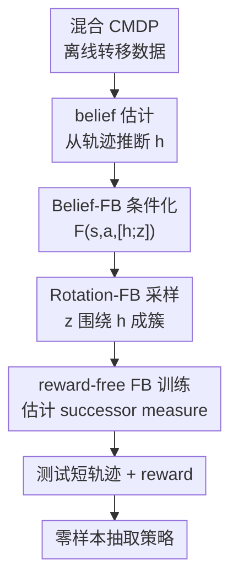

# Zero-Shot Adaptation of Behavioral Foundation Models to Unseen Dynamics

**会议**: ICLR2026  
**OpenReview**: [https://openreview.net/forum?id=dBDBg4WF4F](https://openreview.net/forum?id=dBDBg4WF4F)  
**代码**: 待确认  
**领域**: 强化学习 / 行为基础模型 / 零样本适配  
**关键词**: 行为基础模型、零样本强化学习、Forward-Backward 表征、隐变量动力学、上下文 belief 估计

## 一句话总结

本文指出基于 Forward-Backward 表征的行为基础模型在混合动力学离线数据上会把不同环境的未来占用分布平均到一起，因而无法适配未见过的动力学变化；作者提出用 transformer 估计隐藏动力学 belief，并用 belief 对 FB 的前向表征与任务向量采样进行条件化，使模型在 FourRooms、PointMass、AntWind 和 OGBench Scene 等环境上显著超过 vanilla FB、LAP、HILP 等零样本 RL 基线。

## 研究背景与动机

**领域现状**：行为基础模型（Behavioral Foundation Models, BFMs）希望像语言或视觉基础模型一样，从无任务标签的离线交互数据里学到一族可复用行为。典型代表是 Forward-Backward（FB）表征：训练时不需要具体 reward，只学习 successor measure 的低秩分解；测试时给定一个新 reward，就可以通过 backward 表征推断任务向量 $z$，再用 $\arg\max_a F(s,a,z)^\top z$ 提取对应策略。

**现有痛点**：这个设定默认环境动力学基本一致。一旦离线数据来自多个隐藏动力学配置，例如网格迷宫门的位置变了、点质量环境的障碍布局变了、Ant 受到不同方向的风，vanilla FB 会把来自不同 CMDP 的转移混在一个 successor measure 里估计。结果不是学到“在这个布局下走这扇门、在另一个布局下走另一扇门”，而是学到一个对所有布局都不太对的平均未来。

**核心矛盾**：零样本 RL 想在测试时不更新参数，但适配动力学变化又需要知道“当前我处在哪个环境配置”。如果这个隐藏上下文没有显式进入 FB 表征，策略编码空间 $Z$ 里的不同方向会同时承担任务差异和动力学差异，两类因素纠缠后就会产生 policy interference：同一个状态下，不同环境的最优行动方向互相冲突。

**本文目标**：作者要解决的不是“如何在测试时继续训练一个新策略”，而是在保持 BFM 零样本特性的前提下，让从离线混合数据学到的 FB 模型能够根据一小段无 reward 轨迹识别当前动力学，并对训练中见过和没见过的动力学配置都抽取更合理的策略。

**切入角度**：论文把多动力学数据形式化为 Contextual MDP。当上下文 $c$ 不可观测时，问题等价于 POMDP，需要从历史 $H=\{(s_t,a_t,s_{t+1})\}$ 中估计 belief $b(c\mid H)$。这给了一个自然接口：不改变测试任务 reward 的输入方式，而是给 FB 的 successor feature 估计补上“当前动力学 belief”。

**核心 idea**：用一个自监督 transformer 从短轨迹中估计隐藏动力学向量 $h$，再让 FB 的前向表征和任务向量采样围绕 $h$ 组织，从而把“任务是什么”和“当前环境怎么转移”在 latent space 里分开。

## 方法详解

### 整体框架

整套方法可以看成对 vanilla FB 的两个补丁：先用 Belief-FB（BFB）把隐藏动力学编码成上下文向量 $h$，再用 Rotation-FB（RFB）让任务向量 $z$ 不再均匀撒在整个超球面上，而是围绕对应的 $h$ 形成动力学相关的局部锥形区域。训练仍然是 reward-free 的离线训练，测试时只需要一小段无 reward 探索轨迹和一个任务 reward，就能零样本抽取策略。

具体流程是：离线数据包含多个隐藏环境配置下的转移；先训练 dynamics encoder $f_{dyn}$，输入一组无序转移集合，输出表示当前动力学的向量 $h$；随后训练 FB 时把 $h$ 与任务向量 $z$ 拼接，只条件化 forward network $F$，而 backward network $B$ 保持跨环境共享；RFB 进一步把 $z$ 从以 $h$ 为中心的 von Mises-Fisher 分布中采样，使不同动力学的策略方向在几何上分开。

### 关键设计

**1. 先证明 FB 的失败不是调参问题，而是 successor measure 的动力学平均问题**

论文首先用 Randomized-Doors 这类离散环境做了一个很直观的诊断：同一个观测状态在不同 layout 下，通向目标的正确门可能完全不同。FB 训练时对随机任务方向 $z_{FB}\sim \mathrm{Unif}(S^{d-1})$ 估计 $F(s,a,z)^\top B(s^+)$，本质是在同一个函数类里拟合所有训练环境的 discounted future occupancy。当转移函数 $T_c$ 随隐藏上下文变化，而模型输入里没有 $c$ 或 belief，来自不同 layout 的未来分布只能被压到同一个表示里。

作者用 latent direction 可视化展示了这个干扰：如果 FB 分别在单个 layout 上训练，多数 $z$ 会指向一致的最优动作；如果在混合 layout 数据上训练，同一状态的颜色方向混在一起，策略会选择一种“平均动作”，甚至对训练时见过的 layout 也不对。理论上，论文把多 CMDP 下的最坏 successor approximation error 写成 $\epsilon_k^*=\inf_{F,B}\max_{i\le k}\|M^{\pi_i}-F(\cdot,\cdot,z_i)^\top B(\cdot)\|_{L_2(\rho)}$，并给出 regret bound：

$$
\mathbb{E}_{(s,a)\sim \rho_{test}}[Q_r^*(s,a)-Q_r^{\pi_{\hat z}}(s,a)] \le \frac{3R}{1-\gamma}(\epsilon_k^*+\Delta_{est}).
$$

这里的关键信息不是常数，而是 $\epsilon_k^*$ 随纳入的动力学配置数变大时不会自动变小。数据更多可能降低估计误差 $\Delta_{est}$，但如果函数表示必须把互相冲突的未来压在一起，模型类误差会成为瓶颈。

**2. Belief-FB：用无 reward 轨迹估计隐藏动力学，并只条件化 forward 表征**

BFB 的核心是 dynamics encoder $f_{dyn}$。它接收一段或一组转移 $\{(s_t,a_t,s_{t+1})\}_{t=1}^N$，输出一个上下文向量 $h\in\mathbb{R}^d$。这个输入不含 reward，也不依赖任务标签，所以 $h$ 被迫关注“同样的状态和动作会转移到哪里”这类动力学线索，例如迷宫墙和门的位置、风向、摩擦系数，而不是某个具体任务目标。

作者把 $f_{dyn}$ 设计成 permutation-invariant transformer encoder，因为隐藏环境配置在一个 episode 内是静态的，转移集合的顺序不是关键。训练时用自监督目标：一方面让 $h$ 服从高斯先验并在同一轨迹内共享，另一方面用投影头结合 $(s_t,a_t,h)$ 预测 $s_{t+1}$。预训练完成后，在 FB 中使用

$$
\hat M^{\pi_z}(s_t,a_t,s_{t+1}) = F(s_t,a_t,[h;z_{FB}])^\top B(s_{t+1}).
$$

一个重要细节是作者只把 $h$ 注入 forward network $F$，不注入 backward network $B$。他们观察到条件化 $B$ 会让 Q 函数变得过度平滑，性能下降。直观地说，$B$ 更像 task reward 到 latent task vector 的共享字典，而 $F$ 才需要根据当前动力学解释“从这里采取这个动作会到达哪些未来状态”。

**3. Rotation-FB：让任务方向围绕动力学 belief 成簇，减少策略编码空间里的互相覆盖**

即便有了 $h$，如果任务向量 $z$ 仍然在整个超球面上均匀采样，不同动力学下的策略方向还是可能在 $Z$ 空间中交叉。RFB 的想法是把 $h$ 不只是作为条件输入，而是作为当前动力学的“方向轴”：对某条轨迹先计算 $h=f_{dyn}(H)$，再从以 $h$ 为均值方向的 von Mises-Fisher 分布采样任务向量：

$$
z_{h+FB}\sim \mathrm{vMF}(\mu=h,\kappa).
$$

$\kappa$ 控制分布集中程度。$\kappa$ 太小，不同动力学的锥形区域会重叠，干扰仍然存在；$\kappa$ 太大，单个环境内可表达的任务多样性会塌缩。实现上作者先从一个简单基向量附近采样 vMF 噪声，再用 Householder reflection 把样本旋转到 $h$ 的方向，最后投影回半径为 $\sqrt d$ 的超球面。

理论上，RFB 相当于把任务方向空间划分为围绕不同 context direction 的不相交 cones。在 block-separable 假设下，原先 regret bound 里依赖总环境数 $k$ 的 approximation term，可以替换成最大 cluster 大小 $k_{max}$。这解释了为什么 RFB 在混合环境数增加时更稳：模型不再要求一个全局 FB 因子同时解释所有冲突动力学，而是在每个 context cone 内局部拟合 successor measure。

**4. 测试时仍保持零样本：只用短探索轨迹识别动力学，不做策略更新**

本文的“适配”容易被误解成 meta-RL 那种测试时继续学习。实际上 BFB/RFB 的测试流程仍然是 zero-shot：给定一个 unseen context 下的短 reward-free 轨迹，先通过 $f_{dyn}$ 得到 $h$；给定任务 reward $r$，再用 $B$ 推断任务向量 $z_r\approx \mathbb{E}_{s\sim\rho}[r(s)B(s)]$；最后执行 $\pi(s)=\arg\max_a F(s,a,[h;z_r])^\top z_r$。

这个设计的代价是它依赖测试短轨迹能暴露足够的动力学信息。论文实验显示，context length 小于一个 episode 时性能明显不足，因为局部轨迹可能只覆盖局部墙面或短期运动趋势；当长度达到单个 episode 规模后，继续加长收益很小，说明 $f_{dyn}$ 已经捕获主要隐藏配置。

### 一个完整示例

可以用 Randomized Four-Rooms 来理解整个方法。训练数据来自 30 个不同迷宫布局，每个布局门的位置不同，但观测只有 agent 的 $(x,y)$ 坐标；测试时给一个新的布局和一个目标位置，agent 需要到达目标房间。

Vanilla FB 看到状态 $(1,1)$ 和动作“向右”时，训练集中有些 layout 里这一步会通向可达路径，有些 layout 里后续会撞墙或绕路。由于没有 layout belief，它估计的 successor feature 是这些未来的平均，抽取策略时可能朝墙走。BFB 会先用一段随机探索轨迹识别“哪些坐标之间可通、哪些方向被墙挡住”，把这个信息编码成 $h$，再让 $F(s,a,[h;z])$ 对这个具体 layout 估计未来占用。RFB 进一步让属于这个 layout 的任务方向围绕 $h$ 聚在一起，因此“去左上房间”和“去右下房间”仍是不同任务，但它们共享同一个 layout cone，不会和另一个 layout 的策略方向互相覆盖。

### 损失函数 / 训练策略

训练分两阶段更稳定。第一阶段预训练 $f_{dyn}$：从离线数据中采样长度为 $T$ 的转移序列，encoder 输出均值和方差参数，通过重参数化得到 $h$，再用 predictor $g_{pred}(s_t,a_t,h)$ 预测 $s_{t+1}$。对应上下文损失可概括为

$$
\mathcal{L}_{context}=\frac{1}{BT}\sum_{i=1}^{B}\sum_{t=1}^{T}\|\hat s_{i,t+1}-s_{i,t+1}\|_2^2.
$$

第二阶段训练 FB。BFB 中 forward 输入改为 $(s,a,[h;z])$，backward 仍为 $B(s^+)$；RFB 中 $z$ 的采样由均匀超球面改成围绕 $h$ 的 vMF 分布。FB 训练仍沿用 successor measure 的 anchor regression / Bellman identity，使用 target networks 和 DDPG-style actor 处理连续动作。主要超参包括 latent dimension 离散环境 100、连续环境 150，学习率 $10^{-4}$，batch size 1024，discount 在普通环境为 $0.99$、maze 为 $0.98$，RFB 的 $\kappa$ 在 PointMass 上取 100，其余实验常用 50。

## 实验关键数据

### 主实验

论文比较了 Random、Vanilla-FB、LAP、HILP、Contextual-FB、Oracle-ID、BFB 和 RFB。环境覆盖离散部分可观测迷宫、连续点质量、MuJoCo Ant 风向变化以及 OGBench Scene 摩擦变化。表中数值越高越好。

| 环境 | 指标 | RFB (本文) | BFB (本文) | 最强非本文基线 | Vanilla-FB |
|------|------|------------|------------|----------------|------------|
| FourRooms Train | return / success | 0.85 ± 0.04 | 0.70 ± 0.07 | Oracle-ID 0.90 ± 0.03 | 0.25 ± 0.05 |
| FourRooms Test | return / success | 0.61 ± 0.05 | 0.40 ± 0.06 | HILP 0.20 ± 0.05 | 0.15 ± 0.04 |
| PointMass Train | return / success | 0.88 ± 0.04 | 0.76 ± 0.07 | Oracle-ID 0.92 ± 0.02 | 0.20 ± 0.05 |
| PointMass Test | return / success | 0.55 ± 0.05 | 0.45 ± 0.06 | HILP 0.25 ± 0.05 | 0.10 ± 0.03 |
| AntWind Train | return | 740 ± 40 | 680 ± 60 | Oracle-ID 780 ± 30 | 390 ± 40 |
| AntWind Test | return | 640 ± 40 | 550 ± 50 | HILP 410 ± 40 | 250 ± 30 |
| OGBench Scene Test | return | 0.55 ± 0.05 | 0.45 ± 0.06 | Contextual-FB 0.40 ± 0.07 | 0.20 ± 0.05 |

这个表里最有说服力的是 Oracle-ID 的反差：它在训练环境上几乎最强，因为直接拿到了 one-hot 环境 ID；但在 OOD 测试环境上几乎崩掉，例如 FourRooms test 只有 0.10、AntWind test 只有 50。这说明“记住训练环境编号”不是泛化。BFB/RFB 没有显式 ID，却能从轨迹里恢复动力学结构，因此在未见过的 layout、风向和摩擦上更稳。

### 消融实验

| 配置 / 因素 | 关键指标 | 说明 |
|-------------|----------|------|
| Vanilla-FB | FourRooms test 0.15 ± 0.06，PointMass test 0.10 ± 0.10 | 在混合动力学数据上近似随机，说明 successor feature 平均化严重 |
| BFB | FourRooms test 0.40 ± 0.02，PointMass test 0.45 ± 0.05，AntWind test 550 ± 50.5 | 加入 belief encoder 后，模型能按隐藏环境配置条件化 successor measure |
| RFB | FourRooms test 0.61 ± 0.02，PointMass test 0.55 ± 0.05，AntWind test 640 ± 30.7 | 在 BFB 基础上组织 $z$ 空间，进一步减少 policy direction 干扰 |
| Context length < 单个 episode | train/test 表现较差 | 短轨迹只暴露局部动态，难以区分完整 layout 或风向 |
| Context length 达到约 100 steps | FourRooms / PointMass 表现明显提升后趋于平台 | 一个 episode 已包含足够动力学线索，继续加长带来冗余 |
| 训练环境数从 10 增至约 25-30 | BFB/RFB 快速提升 | 更多 CMDP 提供更完整的动力学变化覆盖 |
| 继续增加环境数到 50 | 提升变小，甚至平台化 | 当 $f_{dyn}$ 已覆盖主要变化模式，额外数据收益小于表示瓶颈 |
| RFB 中 $\kappa$ 太小 | 性能较低、方差较大 | 不同 context 的任务向量 cones 重叠，干扰仍在 |
| RFB 中 $\kappa$ 提高到合适范围 | train/test return 提升 | 任务向量更贴合对应 $h$，不同动力学区域分离更清楚 |

### 关键发现

- belief 估计是 FB 适配隐藏动力学的关键缺口。没有 $h$ 时，FB 和 LAP 在 FourRooms、PointMass 上甚至无法稳定超过随机策略；加入 $h$ 后，BFB 在所有测试环境都明显优于这些基线。
- RFB 通常强于 BFB，说明“把动力学作为输入”还不够，任务向量的采样先验也会影响 FB 如何组织策略空间。围绕 context direction 成簇能缓解相同状态下不同未来互相抵消的问题。
- $f_{dyn}$ 学到的向量确实对应环境隐藏属性，而不是只记轨迹噪声。论文可视化显示 Randomized-Doors 的不同 layout 在 PCA 空间里形成不重叠簇，AntWind 的 embedding 在圆上按风向排列，并能平滑外推到 held-out 风向。
- Q 函数可视化进一步印证机制：Vanilla-FB 会忽略墙体结构，策略朝障碍物方向走；BFB/RFB 的 Q 函数能尊重 wall positions，在训练和测试 layout 上都更接近实际可达路径。

## 亮点与洞察

- 论文没有只提出一个“给 FB 加上下文”的工程改法，而是先把失败现象落到 successor measure 的 averaging 和 latent direction interference 上。这个解释对很多混合离线 RL 数据集都很有启发：数据多样性不一定自动带来泛化，如果不同动力学在表示里互相冲突，更多数据可能只是更精确地学到一个平均错误。
- 只条件化 $F$、不条件化 $B$ 是一个很实用的设计。它保留了 backward representation 作为 reward 到 task vector 的共享接口，同时允许 forward dynamics-sensitive；这比简单把 context 拼到所有网络里更符合 FB 分解本身的语义。
- RFB 的几何视角很清楚：让每个动力学 belief 变成 latent sphere 上的局部坐标系。这样任务多样性和动力学多样性不再争抢同一批全局方向，适合迁移到其他 successor feature、goal-conditioned RL 或无监督技能发现方法里。
- Oracle-ID 的失败提醒很重要：在训练环境上表现好不代表学会了动力学泛化。真正有价值的是从转移历史中恢复连续或组合式隐藏变量，而不是把离散训练环境编号当作捷径。

## 局限与展望

- 实验环境仍偏受控，主要是迷宫布局、风向、摩擦这类相对低维的动力学变化。真实机器人或多 embodiment 数据里的接触、传感延迟、形态差异和控制频率差异会更复杂，$f_{dyn}$ 是否还能靠短轨迹稳定推断仍需验证。
- 方法依赖测试时的随机探索轨迹。如果探索没有访问到区分动力学的关键区域，例如迷宫中没碰到关键门、机器人没经历能暴露质量或摩擦差异的动作，belief 会不可靠。作者也指出未来可以结合更聪明的 epistemic exploration。
- BFB/RFB 继承了 vanilla FB 的限制，包括 reward 需要能被 backward representation 线性表达、FB 训练的收敛和函数逼近误差仍难完全保证。它解决的是多动力学干扰，不是 successor-measure BFM 的全部问题。
- RFB 引入了 $\kappa$ 等额外超参，并且性能对 cluster 分离程度敏感。真实大规模数据中隐藏动力学可能是连续多因子叠加，如何自动调节 concentration 或学习非球面结构，是后续值得做的方向。
- 论文没有在 Open X-Embodiment 这类真实大规模机器人数据上验证，虽然动机多次提到 robotics。若能在跨 embodiment 行为基础模型上展示同样的 zero-shot dynamics adaptation，会更直接支撑应用价值。

## 相关工作与启发

- **vs Vanilla FB / successor measure BFM**: 原始 FB 学一套跨任务 successor measure 分解，适合动力学固定、reward 变化的零样本 RL；本文指出当动力学也变化时，FB 会把未来占用分布平均化，并用 belief-conditioned $F$ 与 context-aligned $z$ 采样来分离不同动力学。
- **vs Contextual-FB**: Contextual-FB 通过 importance weighting / 分类器估计 train-test transition discrepancy，通常需要针对新 layout 训练分类器；BFB/RFB 直接从无 reward 轨迹 amortize 出上下文向量，因此更接近一次训练、多环境零样本复用。
- **vs Meta-RL belief methods（如 VariBAD）**: Meta-RL 通常关注测试时通过交互逐步适应任务或动力学；本文保留 zero-shot RL 设定，测试阶段不更新策略参数，只用短轨迹推断 belief 并抽取已有 BFM 中的策略。
- **vs HILP / LAP**: HILP 和 LAP 更偏状态表示或图结构学习，能在部分环境中超过随机，但没有显式建模隐藏动力学 belief，因此在复杂 layout 或 unseen dynamics 上仍容易输出平均方向。本文的优势是把“当前是哪种转移规律”变成策略抽取的显式条件。
- **启发**: 对大规模 offline RL / robot foundation model 而言，混合数据不应只按任务或 reward 组织，也应按动力学因素组织 latent space。未来可以把 BFB/RFB 的 belief encoder 接到 diffusion policy、world model 或 in-context RL transformer 上，让 foundation policy 在不微调的情况下识别 embodiment、载荷、摩擦和环境几何。

## 评分

- 新颖性: ⭐⭐⭐⭐☆ 不是从零发明 FB 或 belief learning，但把 successor-measure BFM 的多动力学干扰讲清，并用 RFB 的 latent-space partition 给出很有针对性的改造。
- 实验充分度: ⭐⭐⭐⭐☆ 覆盖离散、连续、POMDP 和 OOD dynamics，表格与可视化都支持主张；不足是还没有真实机器人或大规模混合 embodiment 数据验证。
- 写作质量: ⭐⭐⭐⭐☆ 论文结构清楚，失败机制、方法、理论和实验基本闭环；个别公式和 theorem 编号在正文与附录之间略显粗糙，但不影响核心理解。
- 价值: ⭐⭐⭐⭐⭐ 对零样本 RL 和行为基础模型非常有价值，因为它指出“任务泛化”和“动力学泛化”不能混为一谈，并给出一个保持零样本性质的实用方向。

<!-- RELATED:START -->

## 相关论文

- [\[ICLR 2026\] TD-JEPA: Latent-predictive Representations for Zero-Shot Reinforcement Learning](td-jepa_latent-predictive_representations_for_zero-shot_reinforcement_learning.md)
- [\[NeurIPS 2025\] Dynamics-Aligned Latent Imagination in Contextual World Models for Zero-Shot Generalization](../../NeurIPS2025/reinforcement_learning/dynamics-aligned_latent_imagination_in_contextual_world_models_for_zero-shot_gen.md)
- [\[ICLR 2026\] Task Tokens: A Flexible Approach to Adapting Behavior Foundation Models](task_tokens_a_flexible_approach_to_adapting_behavior_foundation_models.md)
- [\[ICLR 2026\] Optimistic Task Inference for Behavior Foundation Models](optimistic_task_inference_behavior_models.md)
- [\[ICML 2026\] Unlocking Zero-Shot Geospatial Reasoning via Indirect Rewards](../../ICML2026/reinforcement_learning/unlocking_zero-shot_geospatial_reasoning_via_indirect_rewards.md)

<!-- RELATED:END -->
