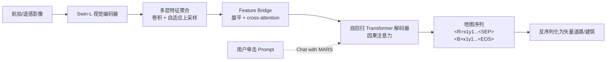

# MARS - A Foundational Map Auto-Regressor

**会议**: ICLR 2026  
**OpenReview**: [https://openreview.net/forum?id=QV4sV5cbLl](https://openreview.net/forum?id=QV4sV5cbLl)  
**代码/数据**: [MAP-3M 数据集](https://huggingface.co/datasets/bag-lab/MAP-3M) ／ [在线 Demo](https://huggingface.co/spaces/bag-lab/MARS)  
**领域**: 遥感 / 矢量地图生成  
**关键词**: 地图生成, 自回归, 矢量化, 道路提取, 建筑提取, 基础模型, 人在回路  

## 一句话总结
把矢量地图（点 / 折线 / 多边形）当作一种"语言"，用一个统一的视觉编码器 + 自回归解码器端到端生成道路网络与建筑轮廓，无需任何分割后处理，配套发布了迄今最大的多类地图数据集 MAP-3M（约 3M 张图）。

## 研究背景与动机
**领域现状**：从航拍 / 遥感影像自动生成地图，本质是把栅格像素转成矢量几何图元——点、折线、多边形，对应道路、建筑、水体等地图要素。但当下绝大多数视觉生成模型（SAM、扩散模型）都是栅格化的，输出像素网格；而地图要素是几何的、矢量的，往往是一组数量可变、无固定结构的点和线段。这种**结构性错配**让通用生成架构很难直接用在地图生成上。

**现有痛点**：主流做法是"两阶段流水线"——先做像素级分割，再做矢量化后处理（关键点提取、边连接、NMS 去重等）。这带来两个致命问题：（1）**泛化性差**：后处理是启发式的，道路网络（带交叉口 / 环岛的多折线）和建筑（互不重叠的多边形）所需的后处理逻辑差异巨大，导致一个模型往往只能处理一种地图要素；（2）**性能受限**：生成不是在统一架构里端到端学出来的，还引入了一堆需要手调的超参（NMS IoU 阈值、边连接置信度阈值等），误差和复杂度在每个阶段层层累积。

**核心矛盾**：要做"地图基础模型"，就必须用一个统一架构同时处理道路和建筑这两类几何形态截然不同的要素，并去掉所有手工后处理——但矢量数据的非结构化特性恰恰是通用生成架构最难啃的骨头。

**本文目标**：提出首个**地图基础模型**，用单一端到端模型统一生成多折线道路网络和多边形建筑，不依赖任何中间步骤或后处理。

**核心 idea**：**把矢量地图图元当作一种"形式语言"**——借鉴自回归语言建模的成功经验，先用一套 map-to-sequence 框架把所有矢量图元（道路、建筑等）转成统一的序列表示，再用一个视觉编码器 + 自回归 Transformer 解码器做 sequence-to-sequence 学习，像 GPT 生成文本一样"生成地图"。

## 方法详解

### 整体框架
MARS 由两大部分组成：（1）一个 **map-to-sequence 转换算法**，把任意矢量地图数据无损地变成一条带类别标记的 token 序列；（2）一个**端到端自回归架构**——Swin Transformer 视觉骨干提取影像上下文特征，再经 cross-attention 喂给自回归 Transformer 解码器，逐 token 自回归地吐出"地图序列"。训练用 teacher forcing + 交叉熵，推理时从 `<SOS>` 一路解码到 `<EOS>`。

### 关键设计

**1. Map-to-Sequence：把三类几何图元统一成一句"地图话"。** 所有地图对象都可归为三种基本类型——点、折线、多边形，并用顶点序列表达：点是 $[x,y]$；折线是 $[x_1,y_1,x_2,y_2,\dots]$；多边形是首尾闭合的折线，序列以起点收尾。多个对象之间靠**类别 token** 串联：$[\langle P\rangle, x,y, \langle B\rangle, \dots, \langle R\rangle, \dots, \langle W\rangle, \dots]$，其中 $P/B/R/W$ 分别标记点 / 建筑 / 道路 / 水体。这样一张矢量地图瓦片就被编码成一条可供自回归学习的 token 序列，彻底绕开了"图元数量可变、结构不固定"的难题。

**2. Stroke-based 道路解构：把交叉路网拆成可序列化的单折线。** 多折线道路网是序列化里最难啃的部分——交叉口、合流、环岛让它构成高度复杂的图，标准图遍历方法很难兼顾道路的语义连续性与可分性。MARS 采用 stroke-based 算法：先在**度数 > 3 的交叉点**处把所有路段打断，再把夹角在容差内（如 $< 30°$）的相邻路段合并成一条"道路"。这样复杂的多折线路网就被拆成多条符合真实世界定义的单折线道路，每条都能套用统一的序列格式（用 $R$ 标记），让自回归解码器有迹可循。

**3. 共享词表 + 螺旋排序：把语义与坐标塞进同一个解码空间。** 解码器建在 vanilla Transformer 上，用单向因果注意力逐 token 预测语义类别和坐标。为了统一表达类别与位置，MARS 构造一个共享词表 $D \in \mathbb{R}^{B_o + B_c}$，其中 $B_o$ 是本体里的语义类别数、$B_c$ 是图像高/宽方向上的像素位置数（如 224），$x$ 与 $y$ 共享同一套坐标 token，再额外加上 `<SOS>`、`<SEP>`、`<PAD>`、`<EOS>` 等特殊 token；类别 token 与离散坐标 token 都用同一个交叉熵损失监督。为了让解码顺序可复现，MARS 把所有对象按到图像质心的距离排序、距离相近时再按顺时针角度排序，形成一致的**螺旋顺序**，避免同一张图有多种合法标注顺序导致训练信号混乱。

**4. Chat with MARS：自回归天然带来的人在回路编辑能力。** 因为 teacher-forcing 训练让每个 token 都条件于此前所有 token，MARS 自然涌现出"prompt-following"能力，用户单击就能介入解码，分三种模式：（i）**SOS 对话**——给出首个对象的起点 $[\langle SOS\rangle, B, x_1^1, y_1^1, \dots]$，在影像模糊 / 域外、首顶点容易预测失准导致全序列漏检时尤其有用；（ii）**MOS 对话**——道路预测漂移时，用一次点击的 $(x,y)$ 替换掉漂移的 token，把后续生成"拉回"正轨，且限制新 token 只在当前对象内生效（撞到下一个类别 token 即停），不影响其他对象；（iii）**EOS 对话**——遗漏小对象时，去掉 `<EOS>` 再补一个新对象的类别 + 坐标 token 续写，从而提升召回。三种模式还能混合成多轮对话，做交互式地图编辑与纠错。

## 实验关键数据

### 主实验
**道路提取（TOPO 拓扑指标，Cityscale / SpaceNet）**：

| 模型 | Cityscale P/R/F1 | SpaceNet P/R/F1 |
|------|------------------|------------------|
| RNGDet++ (2023) | 85.65 / 72.58 / 78.44 | **91.34** / 75.24 / **82.51** |
| SamRoad (2024) | **90.47** / 67.69 / 77.23 | 93.03 / 70.97 / 80.52 |
| **MARS** | 84.28 / **81.53** / **82.88** | 79.68 / **84.56** / 82.05 |

MARS 在 Cityscale 上 F1 从 78.44 提到 **82.88**，并在两数据集上都拿到最高召回；SpaceNet F1 仅比最强专用模型低 0.46，但 MARS 是**通用架构**，其余全是道路专用模型。

**建筑提取（AICrowd-V1）**：MARS 取得 AP 87.30 / AR 97.94，与专用 SOTA（GeoFormer AP 91.5）接近且 AR 反超，但**无需任何超参与后处理**。

### 消融实验
**单类 vs 多类（Table 2）**：同一架构只需加类别 token 就能从单类扩到多类，性能几乎不掉——道路 F1 87.7（单）vs 83.1（多）、AICrowd IoU 95.0（单）vs 97.3（多），证明本体可扩展性。

**MAP-3M 预训练的重要性（Table 5）**：

| 设置 | SpaceNet F1 | AICrowd IoU |
|------|-------------|-------------|
| 无预训练 | 70.45 | 95.09 |
| **MAP-3M 预训练** | **82.05** | **95.24** |

SpaceNet F1 从 70.45 暴涨到 82.05——自回归模型对数据稀缺更敏感、更难从小数据优化，大规模预训练是基础模型的关键。

**Chat with MARS（Table 6）**：一次点击在所有数据集上稳定提升 P/R/F1/IoU（Cityscale F1 82.88→83.79），两次点击进一步到 84.13。

### 关键发现
- **范式对比**：自回归 MARS 普遍高召回，分割式模型（如 SamRoad）则高精度低召回；MARS 在平均 F1 上更均衡。
- **MAP-3M 规模**：约 3M 图、512×512、覆盖 294,069 km²，比此前最大数据集图像数 10×、空间覆盖 100×，且同时含建筑 + 道路两类。

## 亮点与洞察
- **"地图即语言"的视角迁移很干净**：把点 / 折线 / 多边形统一成序列，让一个 GPT 式架构同时吃下几何形态完全不同的道路与建筑，真正做到"无 bells and whistles"的端到端，去掉了所有手调后处理超参。
- **Chat with MARS 是自回归架构的"免费红利"**：人在回路编辑能力不是额外设计的模块，而是 teacher-forcing 训练天然涌现的 prompt-following，三种 SOS/MOS/EOS 对话模式直接对应"补漏 / 纠偏 / 提召回"三类真实地图维护需求，很有产品想象力。
- **数据贡献扎实**：MAP-3M 在量级和地理覆盖上都是数量级提升，且双类标注，本身就是社区资产。

## 局限与展望
- **计算效率**：自回归解码本质串行，比一次性分割方法开销更大；作者寄望于 KV-cache、并行解码等加速技术，但本文未给出实测推理速度对比。
- **困难场景仍易失败**：复杂交叉口（模型可能只顾主路忽略细路）、树冠 / 阴影遮挡导致漏顶点；这些是矢量化方法的共性难题。
- **类别仍偏少**：当前只做建筑 + 道路两类，水体、停车场等虽可用同一表示但被略去；扩到细粒度分类（高速 vs 人行道）是明确的下一步。
- **序列排序依赖启发式**：螺旋顺序虽保证可复现，但是否是最优解码顺序、对极端密集场景是否稳健，值得进一步探究。

## 相关工作与启发
- **承接自回归生成范式**：直接把 GPT / seq2seq（Radford et al., 2018）的思想搬到地图矢量生成，与"把检测 / 分割也当作序列生成"（如 Pix2Seq 系列）一脉相承。
- **对比两阶段分割 + 后处理**：相对 SAM + 后处理（SamRoad、建筑勾勒）和 RNGDet++ 等图检测方法，MARS 的卖点是**统一 + 无后处理**，而非单点指标登顶。
- **启发**：这条"结构化输出 → 序列化 → 自回归"的路线，对任何需要生成可变长度、非结构化几何 / 图结构的任务（电路图、矢量插画、CAD、场景图）都有借鉴价值；而 Chat 式人在回路则提示我们，自回归架构的可中断特性本身就是产品化交互的天然接口。

## 评分
- **新颖性**: ⭐⭐⭐⭐ 首个统一道路 + 建筑的端到端矢量地图自回归基础模型，"地图即语言"视角清晰，Chat with MARS 巧妙利用自回归特性，思路新颖。
- **实验充分度**: ⭐⭐⭐⭐ 覆盖四个数据集、道路 + 建筑双任务、单/多类与预训练消融、人在回路评测，较完整；但缺推理效率实测与更大规模消融。
- **写作质量**: ⭐⭐⭐⭐ 动机—方法—实验逻辑顺畅，序列化与 Chat 三模式讲得清楚，图表丰富。
- **价值**: ⭐⭐⭐⭐ 同时贡献统一架构、超大数据集 MAP-3M 与可交互范式，为地图生成基础模型立了一个可扩展的原型，落地与社区价值都高。

<!-- RELATED:START -->

## 相关论文

- [\[CVPR 2026\] WHU-MARS: A Multispectral Aerial-Ground Benchmark Towards Any-Scenario Person Re-Identification](../../CVPR2026/remote_sensing/whu-mars_a_multispectral_aerial-ground_benchmark_towards_any-scenario_person_re-.md)
- [\[ICML 2025\] MapEval: A Map-Based Evaluation of Geo-Spatial Reasoning in Foundation Models](../../ICML2025/remote_sensing/mapeval_a_map-based_evaluation_of_geo-spatial_reasoning_in_foundation_models.md)
- [\[ICCV 2025\] SMARTIES: Spectrum-Aware Multi-Sensor Auto-Encoder for Remote Sensing Images](../../ICCV2025/remote_sensing/smarties_spectrum-aware_multi-sensor_auto-encoder_for_remote_sensing_images.md)
- [\[CVPR 2026\] ACPV-Net: All-Class Polygonal Vectorization for Seamless Vector Map Generation from Aerial Imagery](../../CVPR2026/remote_sensing/acpv-net_all-class_polygonal_vectorization_for_seamless_vector_map_generation_fr.md)
- [\[ICLR 2026\] Object Fidelity Diffusion for Remote Sensing Image Generation](object_fidelity_diffusion_for_remote_sensing_image_generation.md)

<!-- RELATED:END -->
