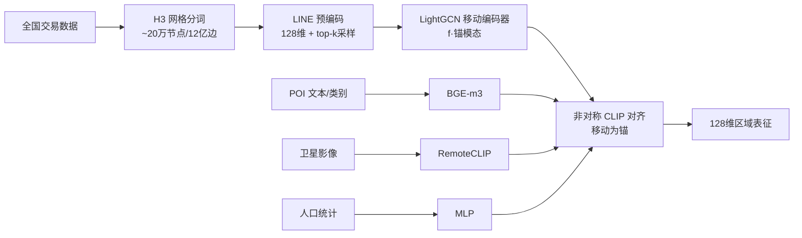

# MoRA: Mobility as the Backbone for Geospatial Representation Learning at Scale

**会议**: ICLR 2026  
**OpenReview**: [https://openreview.net/forum?id=IlBr5JJsCj](https://openreview.net/forum?id=IlBr5JJsCj)  
**代码**: [https://github.com/ylzhouchris/MoRA](https://github.com/ylzhouchris/MoRA)  
**领域**: 地理空间表示学习 / 多模态对齐 / 自监督  
**关键词**: 人类移动图, 地理空间表示, 多模态对比学习, 空间分词, GNN, 标度律  

## 一句话总结
MoRA 把人类移动（mobility）图当作多模态融合的"骨架锚点"，用 CLIP 式非对称对比学习把 POI、卫星影像、人口统计三种辅助模态对齐到十亿边级移动图上，在 9 个社会经济下游任务上以 128 维表征平均超越 SOTA 12.9%，并首次给出地理空间表示学习的标度律证据。

## 研究背景与动机
**领域现状**：地理空间智能（GeoAI）的核心是把一个"位置"压成低维稠密向量。当前分裂成两大流派——以 Google AlphaEarth、SatCLIP、GeoCLIP 为代表的 **Earth observation（物理状态）流派**，靠卫星/遥感影像刻画地表"长什么样"；以及 **human-centric（人本）流派**，靠移动数据、人口统计建模社会经济动态。

**现有痛点**：物理流派擅长描述地表外观，却看不见非视觉的社会经济语义（房价、犯罪、消费）；人本流派多在单城市上分别训练，跨城迁移性能大幅下降，且缺乏统一的多模态融合原则与人本任务的综合 benchmark。最接近本文的 PDFM 也只用简单 concat 融合、且只依赖地理邻近的静态邻域图，错过了区域间动态、非局部的高阶关联。

**核心矛盾**：地理空间数据天然多模态且异构，但"以谁为锚来融合"一直没有有原则的答案——用坐标或影像做锚都丢掉了最关键的**功能性关系信号**。

**本文目标**：学到既含物理属性、又含人类活动模式的"全画像"位置表征，且能在国家尺度上规模化、跨任务迁移。

**核心 idea**：**【移动即地理空间的"句法"】** 作者类比 LLM——一个词的语义不来自其本身，而来自上下文共现；类比 ViT 把连续地理空间离散成网格 cell 当作"空间 token"，把人类移动序列（从一个 cell 到另一个 cell）当作给 token 提供上下文的"句子"。于是一个 cell 的表征被移动序列里的潜在共现结构深刻丰富。由此提出 **mobility-as-backbone**：让移动图做结构骨架，其余三模态都被"透过人类动态这副眼镜"来解读。

## 方法详解

### 整体框架
MoRA 由三块拼成：**空间分词 + GNN 移动编码器 + 非对称 CLIP 对比对齐**。先用 H3 网格把地理空间切成 cell（level 6，约 36 km²/cell），从全国级交易数据建出约 20 万节点、12 亿边的移动图；移动模态经 GNN 编码作为唯一**锚模态**，POI（文本）、卫星影像（视觉）、人口统计（表格直方图）三种辅助模态各用专用编码器编码，再通过对比损失全部对齐到移动锚上，最终输出 128 维区域表征。

### 关键设计

**1. 移动图作骨架（mobility-as-backbone）：用功能关系而非地理邻近做锚** 这是全文的理论支点。以往方法用坐标或单一影像融合模态，只能编码"物理邻近"；而人类活动经常跨越地理边界（通过交通或数字网络），把移动数据建成空间图的"边"，恰好捕获这些非局部模式。作者主张移动图才是多模态融合与对齐的骨架，让所有其他模态都被解读为"对人类动态的注解"。消融里把移动图换成只连直接相邻 cell 的简单邻域图，平均掉 12.2%，直接证明这种"功能邻近"（functional adjacency）带来的长程关联无法被几何邻接替代。

**2. 空间分词 + LINE 预编码 + top-k 采样：把稀疏交互整理成可学的图** 原始空间交互在时空上稀疏且错位，逐坐标建图过于碎片、反映不出主流。借鉴 ViT 切 patch 的思路用 H3 网格在 cell 级建图（H3 比 Geohash、Google S2 失真更小）。再用 LINE（二阶邻近）把全图预编码成每个 H3 cell 的 128 维 embedding 作为节点初始化。配合**按比例阈值的 top-k 采样**只保留每个节点流量最高的链接（主实验取 10%），专门应对地理研究里"少数区域超高流量、多数区域极低流量"的长尾分布，从而用极小计算量保住全图信息。

**3. LightGCN 移动编码器：只留邻域聚合的极简消息传递** 移动锚的编码器选 LightGCN——砍掉特征变换与非线性激活，只保留最本质的邻域聚合。$L$ 层传播得到 $L+1$ 个 embedding，逐层求和成最终节点表征：
$$e_i = \sum_{k=0}^{K} e^{(k)}_i, \quad e^{(l+1)}_i = \sum_{j \in N_i} \frac{1}{\sqrt{|N_i|}} e^{(l)}_j$$
节点初始化用上一步的 LINE embedding。消融显示把 GNN 换成普通 MLP（w/o Mob Graph Encoder）掉得最多，说明正是图结构在捕获非局部关系；而把 LINE 换成随机初始化只掉 1–2%，说明图结构本身比预编码更有信息量，但 LINE 仍有互补价值。

**4. 非对称 CLIP 对齐：以移动为唯一锚的多模态拉齐** 四模态都投到共享空间，但只有移动当锚，其余三模态各自单独又同时向移动对齐。对每个 grid 构造模态元组 $(M, I, T, D)$，移动特征 $f(m_i)$ 由 GNN 给出，辅助特征 $g(x_i)$ 由预训练 FM（POI 用 BGE-m3、影像用 RemoteCLIP）或 MLP（人口统计）给出，损失为三对辅助↔移动对称项之和：
$$\mathcal{L} = \frac{1}{|\{I,t,d\}|}\sum_{X\in\{I,t,d\}}(\mathcal{L}_{M,X}+\mathcal{L}_{X,M}), \quad \mathcal{L}_{M,X}=\frac{1}{2N}\sum_{i=1}^{N}-\log\frac{\exp(\langle f(m_i),g(x_i)\rangle/\tau)}{\sum_{j=1}^{N}\exp(\langle f(m_i),g(x_j)\rangle/\tau)}$$
即让同 grid 的移动特征与其 POI/影像/人口特征相似度最大、与 batch 内其他 grid 最小，$\tau$ 为温度。这种"星型对齐"保证三辅助模态都被统一到人类动态的语义坐标系里，而不是彼此对称融合。

## 实验关键数据

### 主实验表格
预训练数据：来自腾讯电子支付生态的全国移动流（54 周、5000 万门店聚合成 H3 level-6 图，约 20 万节点/12 亿边）；100M+ 腾讯地图 POI（445 类）、Google 10m 卫星影像、WorldPop 人口统计。下游 9 任务覆盖社会（POP/EDU/ELD/HSR/CRI）与经济（NTL/HOU/ENE/COS）两域、point/grid/county/city 四种空间尺度，用 LightGBM 回归，指标 R²。

与公开预训练位置编码器对比（China 全境，部分任务）：

| Model | Dim | POP | EDU | ELD | HSR | CRI | NTL | HOU | ENE | COS |
|---|---|---|---|---|---|---|---|---|---|---|
| AlphaEarth | 64 | 0.80 | 0.77 | 0.71 | 0.68 | 0.71 | 0.63 | 0.63 | 0.47 | 0.81 |
| SatCLIP | 256 | 0.52 | 0.63 | 0.68 | 0.74 | 0.39 | 0.33 | 0.66 | -0.07 | 0.44 |
| GeoCLIP | 512 | 0.41 | 0.66 | 0.66 | 0.69 | 0.32 | 0.24 | 0.65 | 0.11 | 0.32 |
| CSP | 256 | 0.55 | 0.65 | 0.62 | 0.68 | 0.39 | 0.29 | 0.62 | 0.20 | 0.46 |
| Siren | 1024 | 0.51 | 0.66 | 0.69 | 0.74 | 0.39 | 0.33 | 0.66 | -0.14 | 0.44 |
| **MoRA** | **128** | **0.83** | **0.85** | **0.81** | **0.81** | **0.76** | 0.62 | **0.70** | **0.72** | **0.91** |
| ∆ | | +4.1% | +10.5% | +13.9% | +9.5% | +6.9% | -1.7% | +6.1% | **+54.5%** | +12.1% |

MoRA 仅 128 维即在 9 任务里 8 项最佳，平均提升 **12.9%**（社会 +10.8%、经济 +16.0%），平均 R²≈0.78。最亮眼是 city 级能耗（ENE）：baseline 大多在 0 附近抖动，MoRA 达 0.72，超第二名 54.5%，凸显其在粗尺度上仍能抓住区域特征。唯一略输的是 NTL（夜光，-1.7%），因夜光与遥感视觉特征本就强相关。

方法类 baseline（江苏省，与需训练的城市级方法公平对比）MoRA 同样平均超第二名 **20.9%**（HREP/ReCP/ReFound）。

### 消融实验表格
辅助模态消融（去掉某一模态后的平均 R²）：

| 变体 | AVG R² |
|---|---|
| w/o POI | 0.765 |
| w/o Image | 0.762 |
| w/o Demo | 0.748 |
| **MoRA (full)** | **~0.78** |

去掉**人口统计（Demo）**掉得最多，说明它对人本特征贡献独特；POI、影像各自也带来必要增益。

结构消融：去 CLIP 对齐只剩移动模态 → 平均 -6.5%；去 GNN 换 MLP → 掉最多；LINE 换随机初始化 → 仅 -1~2%；移动图换几何邻域图 → -12.2%；锚模态从移动换成其他（如 demo-anchored）→ 移动锚仍领先 16.8%。

### 关键发现
- **标度律首证**：在 Jiangsu(3,904 cells)→East China(28,855)→China(195,574) 三种嵌套空间覆盖上预训练、均在江苏测试，下游性能随预训练数据规模增大而提升；Jiangsu→East China 增益大，East China→China 边际收益递减——与 LLM/视觉的标度行为一致，首次为地理空间表示学习提供经验证据。
- **功能邻近 > 几何邻近**：移动图的长程关联是性能核心来源。
- **蒸馏可部署**：训练 MLP 把连续坐标直接映射到 MoRA 的 grid 输出，得到隐私保护、"坐标进-向量出"的即用工具，推理时无需外部数据与 H3 查表。

## 亮点与洞察
- **理论叙事漂亮且自洽**："移动是地理空间的句法"这一 LLM/ViT 类比把"为什么用移动做锚"讲成了第一性原理，而非工程拼凑。
- **以移动为唯一锚的星型对齐**是与 PDFM（concat + 静态邻域图）最本质的区别，把"非局部、动态、高阶"的区域关联显式建模进了骨架。
- **规模真的拉满**：12 亿边图 + 100M POI + 全国影像，且仅用单张 A100 训 1 小时（得益于 LINE 预编码 + top-k 采样的工程取舍），证明大规模地理表示学习的可行性与必要性。
- **128 维打败 512/1024 维 baseline**，紧凑表征 + 全面性能，实用价值强。

## 局限与展望
- **数据强依赖腾讯生态**：移动流、POI、消费均来自腾讯支付/地图，COS（线下消费）、ENE 部分数据未公开，复现与跨平台迁移受限；移动图本身也带有支付用户的人群偏差。
- **仅在中国验证**：H3 level-6、城市形态、人口分布都是中国语境，跨国可迁移性未验证。
- **夜光等物理主导任务略逊**：当目标与遥感视觉强相关时，纯人本锚反而不占优，提示理想方案或需自适应地权衡物理/人本锚。
- **静态聚合移动**：把 54 周流量聚合成单图，丢失了时间动态（季节、节假日、突发事件），未来可引入时序移动图。
- **标度律仅做到国家级**：East China→China 边际收益已递减，更大尺度（跨洲/全球）是否继续成立、瓶颈在数据还是架构尚不明。

## 相关工作与启发
- **Earth observation 流派**：AlphaEarth（多源传感器统一表征）、SatCLIP/GeoCLIP/CSP（坐标-影像对比）擅长物理状态但缺非视觉语义。
- **人本/基础模型流派**：PDFM（人口动态基础模型，concat + 静态邻域图）是概念最近的对照；ReFound（蒸馏通用 FM + 域目标，但数据仅五城市）、HREP、ReCP 多为城市级。
- **位置编码函数**：Space2Vec、NeRF、Sphere2Vec、Siren 等无学习位置编码，需任务特定监督。
- **启发**：① "把某种关系图当骨架、其余模态做星型对齐"是一种可迁移的多模态融合范式，可推广到生物网络、社交网络等含强关系信号的领域；② 用 LINE/采样把十亿边图压进单卡训练，是大规模图表示学习的实用工程模板；③ 蒸馏成"坐标进-向量出"的隐私保护 utility，给学术成果转落地提供了好范式。

## 评分
- **新颖性**: ⭐⭐⭐⭐ — "移动即句法/移动作骨架"的理论框架优雅且与 LLM/ViT 类比自洽，星型对齐区别于 concat 融合；虽各组件（H3、LINE、LightGCN、CLIP）均为成熟件，但组合与定位有原创性。
- **实验充分度**: ⭐⭐⭐⭐ — 9 任务×多尺度、两类 baseline、辅助/结构/锚模态多重消融，外加首个标度律证据，覆盖全面；但仅中国单一地域、部分数据不公开略减分。
- **写作质量**: ⭐⭐⭐⭐ — 叙事线索清晰（双范式分裂→移动作锚→规模验证），图表完整、类比讲得通透。
- **价值**: ⭐⭐⭐⭐ — 128 维超 SOTA 12.9% + 可部署蒸馏工具 + 标度律洞察，对 GeoAI 社会经济预测落地价值高。

<!-- RELATED:START -->

## 相关论文

- [\[CVPR 2026\] GeoSANE: Learning Geospatial Representations from Models, Not Data](../../CVPR2026/remote_sensing/geosane_learning_geospatial_representations_from_models_not_data.md)
- [\[CVPR 2026\] Data Leakage Detection and De-duplication in Large Scale Geospatial Image Datasets](../../CVPR2026/remote_sensing/data_leakage_detection_and_de-duplication_in_large_scale_geospatial_image_datase.md)
- [\[CVPR 2026\] TESSERA: Temporal Embeddings of Surface Spectra for Earth Representation and Analysis](../../CVPR2026/remote_sensing/tessera_temporal_embeddings_of_surface_spectra_for_earth_representation_and_anal.md)
- [\[ICLR 2026\] Towards Faithful Reasoning in Remote Sensing: A Perceptually-Grounded Geospatial Chain-of-Thought for Vision-Language Models](towards_faithful_reasoning_in_remote_sensing_a_perceptually-grounded_geospatial_.md)
- [\[AAAI 2026\] Machine Learning for Sustainable Rice Production: Region-Scale Monitoring of Water-Saving Practices in Punjab, India](../../AAAI2026/remote_sensing/machine_learning_for_sustainable_rice_production_region-scale_monitoring_of_wate.md)

<!-- RELATED:END -->
