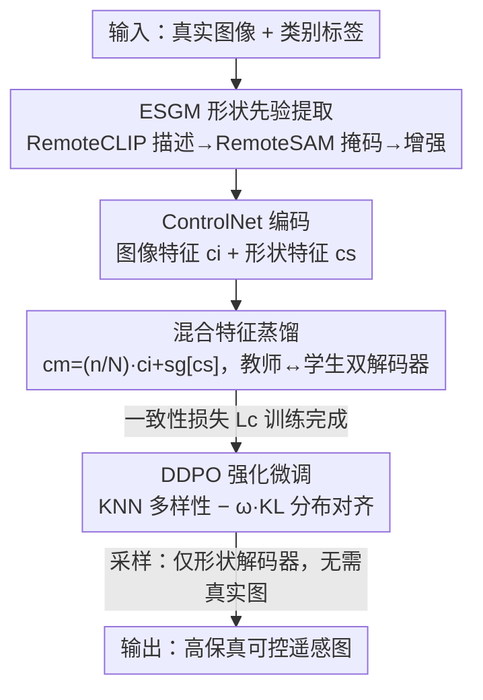

# Object Fidelity Diffusion for Remote Sensing Image Generation

**会议**: ICLR 2026  
**OpenReview**: [https://openreview.net/forum?id=ngfIm9aPsH](https://openreview.net/forum?id=ngfIm9aPsH)  
**代码**: https://github.com/VisionXLab/OF-Diff  
**领域**: 遥感图像生成 / 扩散模型 / 布局到图像  
**关键词**: Layout-to-Image、遥感、形状先验、在线蒸馏、DDPO

## 一句话总结
OF-Diff 用类别标签直接提取遥感目标的"形状掩码先验"来约束扩散生成，再用一个"在线蒸馏"框架把含真实图像信息的混合特征蒸馏进只依赖形状的解码器，使得推理时**不再需要真实图像参考**也能生成高保真、布局一致的遥感图，最后用 DDPO 强化微调进一步对齐真实分布，下游检测中飞机/船/车等类别 mAP 提升 4–8%。

## 研究背景与动机
**领域现状**：遥感目标检测长期受标注数据稀缺所困，因此"可控合成训练数据"成为热点。生成范式上，相比文本到图像（T2I），布局到图像（L2I，以边界框为条件）能提供更精确的空间控制，更适合给检测器做数据增强。遥感领域代表方法是 AeroGen（粗粒度布局条件）和 CC-Diff（实例级、参考真实图像 patch）。

**现有痛点**：作者把现有 L2I 在遥感上的失败归纳为四类（图 1）：① **控制泄漏（Control Leakage）**——内容溢出指定布局框外；② **结构畸变（Structural Distortion）**——目标形态扭曲、长得不像；③ **稠密生成崩塌（Dense Generation Collapse）**——密集场景下数量/位置失控；④ **特征级失配**——CC-Diff 这类方法生成图的分布更贴近其预训练语料风格，而非真实遥感分布（t-SNE 上明显偏离）。根因在于：纯边界框只给了"在哪、多大"，缺乏**细粒度形状信息**；而实例级方法虽然保真度高，却**重度依赖真实图像 patch 的质量与数量**，泛化和灵活性都受限。

**核心矛盾**：高保真（需要真实图像的丰富外观先验）与高可控+可泛化（只想用标签、不依赖真实参考）之间存在 trade-off——含真实图像信息的分支保真但不灵活、采样时还得有真实图；只靠形状的分支灵活可控但容易收敛到低保真局部最优。

**本文目标**：在**采样阶段不依赖任何真实图像参考**的前提下，同时拿到高形状保真度和布局一致性，并真正提升下游检测。

**切入角度**：作者观察到遥感目标具有"准不变形状"——球场是矩形、烟囱/油罐是圆形、飞机是带机头机尾的左右对称体。这种形状一致性意味着可以用**类别标签直接生成形状掩码**作为强可控先验，而不必像自然图像那样为透视/尺度变化建模。

**核心 idea**：用"标签→形状掩码先验"取代"真实图像 patch 参考"做控制信号，并用在线蒸馏把"混合特征教师"的保真能力迁移到"只看形状的学生"，再用 DDPO 强化对齐真实分布。

## 方法详解

### 整体框架
OF-Diff 建在 Stable Diffusion 1.5 + ControlNet 之上，核心是一个**双解码器在线蒸馏**结构。训练时同时喂真实图像和标签：先用 ESGM 从"图像+标签"提取目标形状掩码；图像与掩码经 ControlNet 得到图像特征 $c_i$ 和形状特征 $c_s$，二者融合成混合特征 $c_m$。SD 这边把图像压进隐空间 $z_0$、加噪成 $z_t$，过编码器后送入两个解码器：**混合特征解码器**（条件 $c_m$，含真实图像信息，当教师）和**形状特征解码器**（条件 $c_s$，只靠形状，当学生）。在线蒸馏用一致性损失把教师预测当作 stop-gradient 锚点，拉着学生往高保真最优走。采样时**只保留冻结的 ControlNet + 形状特征解码器**，用任意标签先验即可生图，彻底甩掉真实图像参考。最后用 DDPO 对训练好的扩散做强化微调，提升多样性与分布一致性。

### 关键设计

**1. ESGM 增强形状生成模块：把"类别标签"翻译成可控形状掩码**

针对"纯边界框缺形状、结构易畸变"的痛点，ESGM 利用遥感目标形状准不变的特性，把标签升级为强形状先验。对图像 $x_i$ 中类别 $j$ 的边界框 $y_i^j$，先用 RemoteCLIP 为框内目标生成文字描述，再把描述+原图喂给 RemoteSAM 得到对应形状掩码 $\{x_i^j\}$。随后做形状增强：把每个掩码按框裁剪、随机旋转、贴回空白画布，形成"形状增强掩码"。训练阶段直接用真实图像的形状；采样阶段则从训练中收集的轻量掩码池里挑选增强形状来合成多样掩码——这样推理时也无需真实图像。消融显示 ESGM 单加就能把 YOLOScore 提升 10% 以上，是贡献最大的模块。

**2. 混合特征 + stop-gradient：给保真度造一个稳定的"锚"**

只靠形状特征 $c_s$ 训练容易掉进低保真局部最优，而真实图像特征 $c_i$ 又信息更丰富。作者把两者按训练进度融合成混合特征：

$$c_m = \frac{n}{N}\cdot c_i + \mathrm{sg}[c_s]$$

其中 $n$ 是当前迭代数、$N$ 是总迭代数，所以图像信息的权重随训练逐步加大。关键是对形状特征 $c_s$ 施加 **stop-gradient**（$\mathrm{sg}[\cdot]$）：让混合特征条件下的预测充当一个"稳定锚点"，从而提升生成的形态保真度，而不会让梯度反过来扰动形状分支。这个 $c_m$ 之后专门作为在线蒸馏里的教师输入。

**3. 在线蒸馏一致性损失：把教师的保真力迁移给只看形状的学生**

混合特征解码器（教师）预测准但需要真实图、限制多样性；形状特征解码器（学生）支持任意标签控制但易低保真。为同时拿两者的好处，作者让两个解码器分别算重建损失 $L_s=\mathbb{E}[\|\epsilon_\theta^s-\epsilon\|^2]$、$L_m=\mathbb{E}[\|\epsilon_\theta^m-\epsilon\|^2]$，再加一个一致性损失把教师当 stop-gradient 锚点：

$$L_c = \mathbb{E}\big[\|\epsilon_\theta^s - \mathrm{sg}[\epsilon_{\theta'}^m]\|^2\big]$$

总目标为 $L = L_s + L_m + \lambda L_c$（实现中 $\lambda=1$）。教师 $\epsilon_{\theta'}^m$ 在参数空间里把学生 $\epsilon_\theta^s$ 拽向高保真最优。这样采样时丢掉教师、只留学生（形状解码器），既保住高保真又摆脱真实图像依赖——这正是 OF-Diff 相比 CC-Diff 的核心区别。

**4. DDPO 强化微调：用 KNN 多样性 − KL 一致性的奖励对齐真实分布**

为进一步提升多样性并贴近真实遥感分布，作者在后训练阶段引入 DDPO，把扩散去噪视作多步 MDP，用策略梯度优化。奖励函数同时鼓励多样、惩罚分布偏离：

$$r(x_0, c) = \mathrm{KNN}(x_0, x_0) - \omega\,\mathrm{KL}(x_0, x_0')$$

其中 KNN 项（在 CLIP 图像编码器的低维嵌入空间里计算，$k=50$）度量生成数据的多样性，KL 项度量生成与真实数据 $x_0'$ 的分布一致性，$\omega=2$ 平衡两者。这一步解决了"生成图偏向预训练风格、和真实遥感分布失配"的特征级痛点。

### 损失函数 / 训练策略
总损失 $L = L_s + L_m + \lambda L_c$（$\lambda=1$）；DDPO 奖励 $r = \mathrm{KNN} - \omega\,\mathrm{KL}$（$k=50$，$\omega=2$）。基于 SD 1.5，只微调 ControlNet 和形状特征解码器，其余冻结；AdamW，学习率 1e-5，全局 batch 64，训练 100 epoch，DIOR/DOTA 各自单独训练。

## 实验关键数据

### 主实验
数据集：DIOR-R（20 类，旋转框）、DOTA-v1.0（15 类，密集小目标，裁成 512×512）、HRSC2016（船，附录）。对比 LayoutDiffusion、GLIGEN（自然图）与 AeroGen、CC-Diff（遥感），全部按统一设置重训。13 个指标覆盖生成保真、布局一致、形状保真、下游效用四方面。

| 数据集 | 指标 | OF-Diff | 次优 | 说明 |
|--------|------|---------|------|------|
| DIOR | FID↓ | 24.92 | 27.78 (AeroGen) | 保真最佳 |
| DIOR | CMMD↓ | 0.312 | 0.447 (LayoutDiff) | 显著领先 |
| DIOR | YOLOScore↑ | 58.99 | 55.38 (AeroGen) | 布局一致最佳 |
| DIOR | mAP50 | 54.44 | 53.48 (CC-Diff) | 下游最佳 |
| DOTA | FID↓ | 20.84 | 21.73 (LayoutDiff) | 保真最佳 |
| DOTA | YOLOScore↑ | 55.68 | 49.62 (CC-Diff) | 大幅领先 |
| DOTA | mAP50 | 67.89 | 67.09 (AeroGen) | 下游最佳 |

形状保真（Canny 边缘图，表 2）OF-Diff 在 IoU/Dice/CD/HD/SSIM **五项全 SOTA**：DOTA 上 IoU 0.1205（次优 0.0863）、SSIM 0.2938（次优 0.2261），形态相似度优势明显。

下游检测（数据翻倍增强）：DIOR/DOTA 的 mAP 较 baseline 分别提升 2.2% / 1.94%；分类别 AP50 提升尤为突出——DIOR 上飞机 +8.3%、船 +7.7%、车 +4.0%，DOTA 上游泳池 +7.1%、小型车 +5.9%、大型车 +4.4%，即多形态/小目标类受益最大。

### 消融实验

| ESGM | $L_c$ | DDPO | FID↓ | YOLOScore↑ | mAP50↑ |
|------|------|------|------|-----------|--------|
| ✗ | ✗ | ✗ | 42.59 | 41.20 | 52.13 |
| ✓ | ✗ | ✗ | 24.87 | 55.08 | 52.76 |
| ✓ | ✓ | ✗ | 24.98 | 57.83 | 54.31 |
| ✓ | ✗ | ✓ | 25.78 | 58.26 | 54.17 |
| ✓ | ✓ | ✓ | 24.92 | 58.99 | 54.44 |

### 关键发现
- **ESGM 贡献最大**：单独加入就把 FID 从 42.59 砍到 24.87、YOLOScore 从 41.20 飙到 55.08（+10% 以上），说明形状先验是保真与可控的主引擎。
- **三模块互补**：$L_c$ 在线蒸馏主要提布局一致（YOLOScore→57.83）和下游 mAP50，DDPO 进一步把 YOLOScore 推到 58.99；三者齐上取得最佳综合。
- **Caption 的副作用**：加 caption 让图更符合语义和人类审美，但保真度下降、分布偏向预训练语料而非真实遥感数据——因此消融统一在无 caption 下做。
- **未知布局鲁棒**：在训练时未见过的布局上，OF-Diff 仍取得最佳保真与一致性，下游 mAP 比次优高 1.54%。

## 亮点与洞察
- **"形状即强先验"的遥感专属洞察**：抓住遥感目标形状准不变这一特性，把模糊的边界框升级为可控形状掩码，绕开了自然图像里"形状无唯一几何模型"的难题——这是为什么同一思路在遥感比自然图更奏效。
- **在线蒸馏解耦"训练要真实图、推理不要真实图"**：教师吃真实图像信息、学生只吃形状，stop-gradient 一致性把保真力转移过去，让 CC-Diff 那种"采样时还要真实 patch"的依赖被彻底去掉，这个解耦范式可迁移到其他"训练有特权信息、推理无特权信息"的可控生成任务。
- **奖励里显式写"多样性 − 分布距离"**：DDPO 用 KNN（CLIP 空间）+ KL 直接把"别塌成单一模式"和"别漂离真实分布"写进目标，比单纯 FID 微调更有针对性。

## 局限与展望
- 依赖 RemoteCLIP + RemoteSAM 两个外部大模型生成形状掩码，掩码质量上限受这些模型在遥感域的表现约束；新类别若缺乏好的文字描述/分割可能退化。
- "准不变形状"假设对规则目标（球场、油罐、飞机）成立，但对形态高度可变或柔性目标可能不再适用。
- 每个数据集单独训练，跨数据集/跨传感器的泛化未充分验证。
- 采样阶段从训练期掩码池挑形状，形状多样性受池子覆盖度限制；DDPO 奖励超参（$\omega$、$k$）的敏感性只做了 $\lambda$ 的分析。

## 相关工作与启发
- **vs CC-Diff（实例级遥感 L2I）**：CC-Diff 靠引用真实实例 patch 提升保真，但采样依赖真实数据、分布偏向预训练风格；OF-Diff 用形状先验 + 在线蒸馏在推理时甩掉真实图像，形状保真五项全面反超。
- **vs AeroGen（粗布局条件遥感 L2I）**：AeroGen 只用粗布局，空间与形状控制有限；OF-Diff 引入形状掩码与 DDPO，YOLOScore 与下游 mAP 明显更高。
- **vs LayoutDiffusion / GLIGEN（自然图 L2I）**：它们以布局为模态或门控注意力做控制，缺细粒度形状，直接搬到遥感会出现控制泄漏/畸变；OF-Diff 针对遥感稠密、任意朝向、大背景的特点专门设计。

## 评分
- 新颖性: ⭐⭐⭐⭐ 形状先验 + 在线蒸馏去真实图依赖 + DDPO 对齐，组合在遥感 L2I 上有清晰针对性。
- 实验充分度: ⭐⭐⭐⭐⭐ 三数据集、13 指标四维度、未知布局与逐类别 AP、模块全消融，相当扎实。
- 写作质量: ⭐⭐⭐⭐ 失败模式归纳清晰、图 2/3 把范式差异讲明白，公式记号略密。
- 价值: ⭐⭐⭐⭐ 直接服务遥感检测数据增强，小目标/多形态类提升显著，实用性强。

<!-- RELATED:START -->

## 相关论文

- [\[CVPR 2026\] ChangeBridge: Spatiotemporal Image Generation with Multimodal Controls for Remote Sensing](../../CVPR2026/remote_sensing/changebridge_spatiotemporal_image_generation_with_multimodal_controls_for_remote.md)
- [\[CVPR 2026\] Remote Sensing Image Super-Resolution for Imbalanced Textures: A Texture-Aware Diffusion Framework](../../CVPR2026/remote_sensing/remote_sensing_image_super-resolution_for_imbalanced_textures_a_texture-aware_di.md)
- [\[CVPR 2026\] Prompt-Free Unknown Label Generation for Open World Detection in Remote Sensing](../../CVPR2026/remote_sensing/prompt-free_unknown_label_generation_for_open_world_detection_in_remote_sensing.md)
- [\[CVPR 2026\] ORSATR-X: A Foundation Model based on Differential-and-Excitation Networks for Optical Remote Sensing Object Recognition](../../CVPR2026/remote_sensing/orsatr-x_a_foundation_model_based_on_differential-and-excitation_networks_for_op.md)
- [\[ICLR 2026\] Towards Faithful Reasoning in Remote Sensing: A Perceptually-Grounded Geospatial Chain-of-Thought for Vision-Language Models](towards_faithful_reasoning_in_remote_sensing_a_perceptually-grounded_geospatial_.md)

<!-- RELATED:END -->
