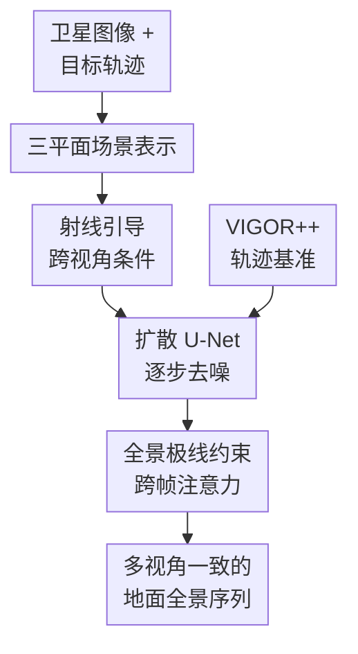

# SatDreamer360: Multiview-Consistent Generation of Ground-Level Scenes from Satellite Imagery

**会议**: ICLR 2026  
**OpenReview**: [https://openreview.net/forum?id=wmQoigkqUt](https://openreview.net/forum?id=wmQoigkqUt)  
**代码**: 待发布  
**领域**: 遥感跨视角生成 / 卫星到地面场景生成  
**关键词**: 卫星到地面生成、多视角一致性、全景图生成、三平面表示、极线约束注意力  

## 一句话总结
SatDreamer360 从单张卫星图像和预设地面相机轨迹出发，用三平面场景表示、逐像素射线注意力和全景极线约束时序注意力，在扩散模型中生成几何对齐且跨帧一致的 360° 地面全景序列，并在新构建的 VIGOR++ 基准上优于 Sat2Density、ControlS2S 和 EscherNet。

## 研究背景与动机
**领域现状**：卫星图像覆盖范围大、获取成本低，因此很多工作希望把俯视图转换成街景或地面全景，用于自动驾驶仿真、数字孪生城市、3D 重建和数据增强。早期方法多把它看成一对一的图像翻译，用 cGAN 或几何投影从卫星图合成单张地面图；近期扩散模型进一步提升了真实感，也允许同一张卫星图对应多种可能的地面外观。

**现有痛点**：真正的应用通常不是只要一张街景，而是要沿着一条道路连续生成多个地面视角。现有卫星到地面方法大多只优化单帧质量，缺少跨帧几何约束，结果可能在相邻全景之间出现道路、建筑、树木位置跳变。另一类方法依赖高度图、多角度卫星图、手工投影或两阶段自回归流程，这些先验要么难以大规模获取，要么会把误差传到后续帧。

**核心矛盾**：卫星图和地面全景之间的视角差异极大。卫星图能看到道路拓扑、屋顶和场景布局，却看不到立面、树干、路边细节；地面全景需要这些被遮挡的信息，并且同一卫星图对应的地面外观天然是一对多的。若只靠全局条件或普通 cross-attention，模型很难知道某个地面像素应该从卫星图的哪个空间位置取信息；若用全帧时序注意力维持一致性，又会把无关像素也混在一起，计算量高且容易引入噪声。

**本文目标**：作者希望在只给单张卫星图和一组 4-DoF 地面相机位姿 $p_i=[t_i,\psi_i]$ 的情况下，生成沿轨迹变化的连续 360° 地面全景 $G_i$。这个目标可以拆成两个子问题：第一，如何让每一帧和卫星图中的道路、建筑布局保持几何对齐；第二，如何让不同帧之间在结构、天气、光照和局部细节上保持一致。

**切入角度**：SatDreamer360 的观察是，跨视角生成不能只把卫星图当成一张条件图，而要把它转成可查询的 3D 场景表示；多帧一致性也不应做无差别的全图注意力，而应利用已知相机相对位姿，把注意力限制在全景极线约束允许的位置上。这样，扩散模型仍然负责补全一对多的地面外观，但几何关系由显式结构来约束。

**核心 idea**：用三平面表示承载卫星场景，用逐像素射线注意力把每个地面全景像素关联到 3D 空间特征，再用全景极线约束注意力在相邻帧和首帧之间传递一致信息，从而把单张卫星图扩展成多视角一致的地面全景序列。

## 方法详解

### 整体框架
SatDreamer360 建立在 latent diffusion model 上。输入是一张卫星图 $S$ 和一条由多个地面相机位姿组成的轨迹，输出是对应位姿处的一组地面 360° 全景图；训练时地面图先经 VQ-VAE 编码到 latent，扩散 U-Net 学习在条件 $c=(S,p_i)$ 下预测噪声 $\epsilon$。

整个方法有两条几何主线：一条负责卫星到地面的跨视角条件，先把卫星图编码成三平面场景特征，再对每个地面像素沿其全景射线查询三平面；另一条负责地面帧之间的一致性，在 U-Net 多层特征里按全景极线约束做跨帧注意力。论文还构建了 VIGOR++，把 VIGOR 扩展成带轨迹和连续街景序列的大规模评测集。

扩散训练目标仍是标准噪声预测：给定地面 latent $z_0$、条件 $c$、扩散步 $t$ 和噪声 $\epsilon$，模型优化 $\|\epsilon-\epsilon_\theta(\sqrt{\bar{\alpha}_t}z_0+\sqrt{1-\bar{\alpha}_t}\epsilon,t,c)\|^2$。论文的创新不在于改写扩散目标，而在于把条件 $c$ 做成几何可查询、跨帧可约束的形式。

### 关键设计
**1. 三平面场景表示：把单张卫星图变成可查询的 3D 条件**

卫星图直接输入扩散模型时，模型只能依赖图像级或 patch 级语义，难以回答“这个全景像素对应卫星图中哪条道路、哪栋建筑附近”这样的问题。SatDreamer360 采用 triplane 表示，用 $XY$、$XZ$、$YZ$ 三个正交平面表示场景，其中 $XY$ 平面与地面平行，天然对应卫星俯视图；任意 3D 点的特征通过投影到三个平面并求和获得：$F_{xyz}=F_{xy}\oplus F_{xz}\oplus F_{yz}$。

这个设计比纯 BEV 更适合地面全景，因为地面视角会看到垂直结构，只有 $XY$ 平面无法表达立面和高度相关信息；它又比 voxel 表示轻量，适合插入扩散模型。为了让三个平面互相补充，作者用 Cross-view Hybrid Attention 让 $XY$、$XZ$、$YZ$ 之间交换局部 3D 上下文，例如 $XY$ 平面上的点会沿 $Z$ 方向参考来自 $XZ$ 和 $YZ$ 平面的特征。这样卫星图提供的俯视布局被扩展成一个粗略但可查询的空间场景，而不是一张静态条件图。

**2. 射线引导跨视角条件：让每个全景像素沿自己的 3D 视线取信息**

普通 cross-attention 往往把 ground latent 的像素和整张卫星特征做软匹配，缺少真实相机几何，容易在道路边界、建筑朝向和复杂转角处产生错位。SatDreamer360 改成 ray-based pixel attention：对全景图中位置 $(u,v)$ 的像素，先用等距柱状投影把它转成 yaw 和 pitch，$\psi_{u,v}=(u-W/2)/W\times 2\pi$，$\theta_{u,v}=(H/2-v)/H\times \pi$，从而得到相机坐标系中的一条 3D 射线。

沿这条射线，模型均匀采样 $K$ 个深度点，再结合当前相机位姿投到全局 3D 坐标，在三平面中查询对应特征。注意力并不是固定采样：每个 head 会学习采样点附近的偏移 $\Delta x_{k,j}$ 和权重 $A_{k,j}$，最终得到该像素的条件特征 $F_g(u,v)=\sum_j W_j\sum_k A_{k,j}F(x_{u,v,k}+\Delta x_{k,j})$。这相当于把“从卫星图推断地面像素”变成“沿这个像素的可能空间射线聚合卫星场景线索”，既尊重相机位姿，又允许扩散过程动态细化对应关系。

**3. 全景极线约束注意力：用相机位姿约束跨帧信息流**

多视角一致性不能只靠视频扩散里的时序模块，因为 ground panorama 的相邻帧并不是普通视频帧：相机沿道路移动，视角变化大，且投影是 equirectangular panorama。SatDreamer360 将 pinhole 图像中的极线约束扩展到全景图。对帧 $m$ 的像素 $g^m_{u,v}$ 和帧 $n$ 的候选像素 $g^n_{u',v'}$，若它们来自同一个空间点，则需要满足 $(P^{-1}(g^n_{u',v'}))^\top \hat{t}_{mn}R_{mn}(P^{-1}(g^m_{u,v}))=0$，其中 $R_{mn}$ 和 $t_{mn}$ 是相对旋转和平移，$P$ 是全景投影。

有了这个约束，帧 $m$ 的一个 query 不必和帧 $n$ 的所有像素做全 cross-attention，只需关注落在全景极线曲线附近的候选点。复杂度从 $O(NHW\times NHW)$ 降到 $O(NHW\times NM)$，其中 $M\ll HW$ 是极线候选采样点数。更重要的是，它减少了跨帧错误匹配：道路边缘不会随意从天空或建筑区域吸信息，相邻帧的结构连续性因此更稳。

**4. 稀疏参考帧策略与 VIGOR++：让方法能评测、能扩展到序列**

为了兼顾长序列的一致性和计算成本，SatDreamer360 没有让每一帧关注所有帧，而是采用稀疏参考帧：每个目标帧只参考序列第一帧和前一帧。第一帧提供全局锚点，帮助维持天气、光照和整体风格；前一帧提供局部几何连续性，避免道路和建筑在相邻帧之间漂移。这个策略看似简单，但很符合街景轨迹的性质：远距离帧相关性弱，强行密集互看反而会带来噪声和显存压力。

论文还构建了 VIGOR++ 来支撑这个任务。原始 VIGOR 主要是卫星图和单张地面图的对应，无法评测连续生成。VIGOR++ 把卫星覆盖范围从 $70m\times70m$ 扩到 $160m\times160m$，新增 Atlanta、Bismarck、Kansas、Nashville、Orlando、Phoenix 等城市，并从 Google Street View 中抽取同一卫星区域内的连续全景，通过天空颜色直方图、图像 embedding 相似度、连通图搜索和人工修正组成轨迹。最终得到 90,000 多对卫星-地面视频样本，其中 84,055 对训练、7,443 对测试，大多数轨迹包含 7 到 16 帧。

### 一个完整示例
假设输入是一张覆盖城市路口的卫星图，轨迹上有 5 个地面位姿，从道路南侧逐步转向东侧。传统单帧卫星到街景模型可以为每个位姿分别生成一张全景，但每张图可能独立采样：第一帧道路左侧有树，第二帧变成建筑墙，第三帧路口标线位置又偏了。

SatDreamer360 会先把卫星图编码成三平面。对第一帧全景中的一个像素，如果它位于图像中部的道路方向，模型根据该像素的 yaw/pitch 得到一条从相机出发的射线，沿射线在三平面中查询道路、路缘、建筑边界等空间线索，再把这些特征送入扩散 U-Net。到第二帧时，相同路缘在全景投影中移动到另一个位置，极线约束会告诉模型：第二帧的这个区域应该主要参考第一帧中满足相对位姿几何关系的候选像素，而不是整张图乱取信息。这样生成序列时，路面布局随相机运动连续变化，天气和光照也由首帧锚定，不会每帧重新随机漂移。

### 损失函数 / 训练策略
训练分为多个阶段。首先在单图生成任务上微调 300 epoch，重点让 ray-guided cross-view conditioning 学会把卫星几何和单张地面全景对齐；随后加入 Epipolar-Constrained Temporal Attention，在连续序列上再训练 300 epoch，先用 3 帧序列预热时序注意力，再进一步微调整体模型，最后用 5 帧序列训练长序列能力。由于原始 autoencoder 只面向单图，作者还在 decoder 中加入 3D convolution temporal module，并在 VIGOR++ 上训练 40 epoch，以减轻序列解码中的闪烁。

实验设置中，卫星图输入分辨率为 $256\times256$，生成地面全景为 $128\times512$。模型基于 Stable Diffusion 1.5 微调，默认射线采样点数 $K=8$，极线候选点数 $M=4$，推理采用 50 步 DDIM。训练使用 AdamW，学习率 $7.0\times10^{-5}$，在 4 张 NVIDIA L40 GPU 上完成。

## 实验关键数据

### 主实验
论文在 VIGOR++ 上比较了连续卫星到地面全景序列生成，指标覆盖感知质量、语义一致性、像素相似度和多视角稳定性。数值上，SatDreamer360 在 Depth、Palex、FID、DINO、FVD、CLIPSIM 等多个指标上取得最好结果，说明它不是只牺牲单帧质量换取时序平滑，而是同时提升了卫星对齐和跨帧一致性。

| 方法 | Depth↓ | FID↓ | DINO↓ | SegAny↓ | SSIM↑ | FVD↓ | CLIPSIM↓ |
|------|--------|------|-------|---------|-------|------|----------|
| Sat2Den | 0.4584 | 133.6 | 4.437 | 0.3729 | 0.3892 | 8.405 | 7.671 |
| EscherNet | 0.5581 | 84.21 | 4.942 | 0.3845 | 0.2587 | 8.250 | 10.50 |
| ControlS2S | 0.4433 | 29.48 | 4.567 | 0.3753 | 0.3718 | 10.81 | 6.651 |
| SatDreamer360 | 0.3955 | 27.41 | 4.156 | 0.3563 | 0.3964 | 6.820 | 5.623 |

在单张卫星到地面全景生成上，作者使用 CVUSA 和 VIGOR 来隔离 ray-guided conditioning 的作用。VIGOR 上，SatDreamer360 相比 ControlS2S 在 Depth、LRCE、FID、DINO、SegAny、SSIM、PSNR 等指标均有提升，说明三平面 + 射线注意力不仅服务于序列，也能提升单帧跨视角几何对齐。

| 数据集 | 方法 | Depth↓ | LRCE↓ | FID↓ | DINO↓ | SegAny↓ | SSIM↑ | PSNR↑ |
|--------|------|--------|-------|------|-------|---------|-------|-------|
| CVUSA | ControlS2S | 0.3192 | 0.4323 | 21.30 | 4.807 | 0.3612 | 0.3753 | 13.67 |
| CVUSA | SatDreamer360 | 0.3146 | 0.4255 | 17.00 | 4.807 | 0.3602 | 0.3812 | 13.88 |
| VIGOR | ControlS2S | 0.2729 | 0.3770 | 28.01 | 4.335 | 0.3529 | 0.4228 | 13.80 |
| VIGOR | SatDreamer360 | 0.2598 | 0.3469 | 21.36 | 4.287 | 0.3471 | 0.4385 | 14.08 |

### 消融实验
关键消融集中在三平面、射线注意力、极线注意力和稀疏跨帧策略。结果显示，纯 BEV 缺少垂直结构信息，vanilla cross-attention 缺少射线几何，full cross-attention 虽然能传递跨帧信息但成本高、噪声多；SatDreamer360 的各个模块都在对应痛点上带来明确收益。

| 配置 | 关键指标 | 说明 |
|------|----------|------|
| BEV 表示 | VIGOR DINO 4.408, SSIM 0.4134, Depth 7.061 | 只用 $XY$ 平面，缺少垂直结构 |
| Triplane 表示 | VIGOR DINO 4.287, SSIM 0.4385, Depth 6.727 | 三平面保留更多 3D 结构，内存只小幅增加 |
| Vanilla Condition | VIGOR DINO 5.425, SSIM 0.3174, Time 120.28s | 全局 cross-attention 缺少几何约束，慢且错位多 |
| Ray-guided condition | VIGOR DINO 4.287, SSIM 0.4385, Time 39.64s | 沿像素射线查询三平面，几何对齐更好 |
| w/o Epipolar-Att | VIGOR++ FVD 3.439, CLIPSIM 10.20, AUR(seq) 0.174 | 缺少显式跨帧几何，序列一致性弱 |
| Full Cross-Att | VIGOR++ FVD 2.150, CLIPSIM 7.516, AUR(seq) 1.136 | 有跨帧交互但成本更高，仍有无关匹配 |
| Epipolar-Att | VIGOR++ FVD 2.101, CLIPSIM 6.820, AUR(seq) 1.690 | 极线候选过滤提升一致性与用户偏好 |

### 关键发现
- 射线注意力是单帧跨视角质量的关键来源。与 vanilla conditioning 相比，Ray-Based Pixel Attention 在 VIGOR 上把 DINO 从 5.425 降到 4.287、SSIM 从 0.3174 提到 0.4385，同时推理时间从 120.28s 降到 39.64s，说明几何约束既提升质量也减少无效注意力。
- 全景极线约束主要解决序列连续性。相较没有该模块的版本，Epipolar-Att 把 FVD 从 3.439 降到 2.101，CLIPSIM 从 10.20 降到 6.820，用户序列排序 AUR 从 0.174 提到 1.690，视觉上能减少道路和建筑结构跨帧漂移。
- 稀疏参考帧比密集参考帧更适合这个任务。在 30 帧生成时，dense strategy 需要 120.75s 和 40520MB，而 sparse strategy 只需 32.71s 和 35142MB；同时 sparse 的 FVD 2.101 优于 dense 的 2.253，说明远距离帧并不总是有益。
- 轨迹长度和采样间隔仍会影响质量。轨迹超过 60m 或帧间距大于 10m 时，CLIPSIM、Depth 等指标变差，说明训练序列长度和数据采样密度仍限制长距离连续生成。

## 亮点与洞察
- SatDreamer360 最巧妙的地方是没有把“卫星图条件”停留在 2D 图像层，而是先转成三平面，再通过地面像素射线逐点查询。这让跨视角生成从语义对齐向几何对齐迈了一步，特别适合道路、建筑边界这类空间结构敏感的场景。
- 全景极线约束注意力是一个很自然但很关键的迁移：室内或 pinhole 多视角生成里常用极线几何，本文把它改写到 equirectangular panorama 上，直接服务街景序列。它说明生成模型里的 attention 不一定越全越好，有时先用几何排除不可能的匹配，反而能让扩散模型更稳定。
- VIGOR++ 本身也有价值。过去卫星到地面生成常被单帧指标主导，无法衡量沿轨迹的连续性；这个数据集把任务定义成 satellite-to-ground video generation，为后续方法比较提供了更接近仿真和数字孪生需求的基准。
- 下游 cross-view localization 的实验说明合成数据不只是好看。用 SatDreamer360 生成的数据增强 G2SWeakly 后，VIGOR 上 aligned error 从 5.22 降到 4.99，unaligned error 从 5.33 降到 5.11，表明几何一致的生成样本能提供可迁移的训练信号。

## 局限与展望
- 生成内容仍主要是静态场景。论文明确指出模型没有显式处理车辆、行人等动态对象，因此生成序列可能缺少真实交通环境中的动态行为；若用于自动驾驶仿真，后续需要结合可控动态对象建模。
- VIGOR++ 依赖 Google Maps 和道路网络覆盖，测试虽包含不同区域，但仍偏向可被街景车辆采集的城市道路。狭窄巷道、非道路区域、越野场景或街景覆盖较弱地区可能泛化不足，论文的失败案例也提到窄巷中会生成错误结果。
- 长轨迹生成仍受训练和显存限制。实验显示超过 60m 的轨迹质量下降，作者目前只能在有限帧数上训练；未来可以用更高效的记忆机制、分块一致性约束或递增式场景表示更新来支持更长路径。
- 虽然方法不需要高度图或多角度卫星图，但三平面本身仍是从单张俯视图推断出的隐式结构，无法真正恢复被遮挡的立面细节。对安全关键应用，生成结果应被视为合成先验或仿真素材，而不是可靠的真实街景替代。
- 生成式卫星到地面模型存在误用风险。论文在 broader impact 中也提醒，这类系统可能被用来制造误导性视觉内容，实际部署时需要水印、使用许可和合成内容披露机制。

## 相关工作与启发
- **vs Sat2Density**: Sat2Density 用密度或 NeRF 风格的表示做卫星到地面生成，更偏向单帧跨视角重建；SatDreamer360 面向连续全景序列，用三平面和极线注意力同时处理单帧几何对齐与跨帧一致性，在 VIGOR++ 上明显优于 Sat2Density。
- **vs ControlS2S**: ControlS2S 也是扩散式 satellite-to-street-view 方法，重点在可控单帧生成和位姿对齐；本文继承扩散模型的真实感优势，但用 ray-based pixel attention 替代更粗的条件注入，并增加全景极线时序注意力，因此在单帧和序列指标上都更稳。
- **vs EscherNet**: EscherNet 是通用多视角扩散模型，适合给定参考视图和相对位姿做 view synthesis；但卫星图近似正射、地面全景视角差异极大，普通参考视图假设不够。SatDreamer360 针对卫星-地面域差设计了三平面空间表示和射线查询，所以比直接把卫星图当参考视图更有效。
- **vs StreetScape / Sat2GroundScape**: 这类方法更接近连续街景生成，但可能需要高度图、多视角卫星图或两阶段流程。SatDreamer360 的输入更轻，只用单张卫星图和轨迹，实际部署门槛更低；代价是被遮挡结构仍由模型推断，真实性上需要谨慎。
- **启发**: 对遥感到地面、BEV 到车载相机、地图到仿真视频等任务，可以把本文思路概括为“结构条件先 3D 化，跨视角查询按射线做，跨帧传播按几何约束筛”。这比单纯加更大的 diffusion backbone 更有针对性，也更容易解释生成结果为什么对齐或为什么失败。

## 评分
- 新颖性: ⭐⭐⭐⭐⭐ 把三平面射线条件和全景极线注意力组合到单卫星图到连续地面全景生成中，任务定义和几何建模都比较完整。
- 实验充分度: ⭐⭐⭐⭐⭐ 主实验覆盖 VIGOR++ 序列生成、CVUSA/VIGOR 单帧生成、模块消融、超参、长轨迹、随机种子、用户研究和下游定位增强，证据链较全。
- 写作质量: ⭐⭐⭐⭐ 方法动机清楚，图和公式能支撑理解，但部分指标命名和表格方向需要读者自行确认，个别文字有拼写和排版小问题。
- 价值: ⭐⭐⭐⭐⭐ 对遥感生成、城市数字孪生、自动驾驶仿真和跨视角定位都有直接参考价值，尤其是 VIGOR++ 和几何约束注意力为后续工作提供了可复用基线。

<!-- RELATED:START -->

## 相关论文

- [\[CVPR 2026\] WRIVINDER: Towards Spatial Intelligence for Geo-locating Ground Images onto Satellite Imagery](../../CVPR2026/remote_sensing/wrivinder_towards_spatial_intelligence_for_geo-locating_ground_images_onto_satel.md)
- [\[ICLR 2026\] Object Fidelity Diffusion for Remote Sensing Image Generation](object_fidelity_diffusion_for_remote_sensing_image_generation.md)
- [\[CVPR 2026\] Spectrally Distilled Representations Aligned with Instruction-Augmented LLMs for Satellite Imagery](../../CVPR2026/remote_sensing/spectrally_distilled_representations_aligned_with_instruction-augmented_llms_for.md)
- [\[CVPR 2026\] ACPV-Net: All-Class Polygonal Vectorization for Seamless Vector Map Generation from Aerial Imagery](../../CVPR2026/remote_sensing/acpv-net_all-class_polygonal_vectorization_for_seamless_vector_map_generation_fr.md)
- [\[ICLR 2026\] TAMMs: Change Understanding and Forecasting in Satellite Image Time Series with Temporal-Aware Multimodal Models](tamms_change_understanding_and_forecasting_in_satellite_image_time_series_with_t.md)

<!-- RELATED:END -->
