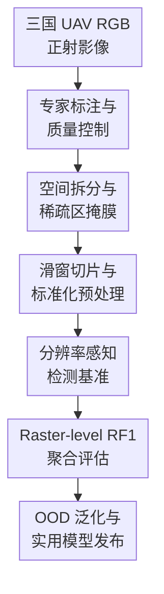

# SelvaBox: A high-resolution dataset for tropical tree crown detection

**会议**: ICLR2026  
**OpenReview**: [https://openreview.net/forum?id=GH7z1RURL6](https://openreview.net/forum?id=GH7z1RURL6)  
**代码**: https://github.com/hugobaudchon/CanopyRS；https://github.com/hugobaudchon/geodataset  
**领域**: 遥感 / 热带森林树冠检测数据集  
**关键词**: 热带森林, 树冠检测, 无人机遥感, 多分辨率训练, Raster-level F1  

## 一句话总结
SelvaBox 构建了目前最大规模的开放热带森林高分辨率无人机 RGB 树冠检测数据集，并用统一的多分辨率检测基准证明：高分辨率输入、DINO-Swin 检测器和跨数据集训练能显著提升热带树冠检测的域内与零样本泛化表现。

## 研究背景与动机
**领域现状**：热带森林监测里，单棵树的冠幅位置与数量是估计生物量、碳储量、死亡率和森林结构变化的关键入口。传统地面样方调查虽然精确，但在热带森林中耗时、昂贵且危险；卫星遥感覆盖范围大，却通常只有 0.3 到 0.5 米级分辨率，在密集、重叠、云雾频繁的热带冠层里很难分清单棵树冠。无人机 RGB 影像可以达到厘米级地面采样距离（GSD），因此成为热带树冠检测更现实的高分辨率数据源。

**现有痛点**：问题不只是模型不够强，而是开放数据太少、评测也不够贴近应用。已有树冠检测数据集大多来自温带森林、城市树木或人工林，真正覆盖天然热带森林的标注规模很小；例如 Detectree2 和 BCI50ha 的热带标注量只有几千级，而热带森林树种多样、树冠大小跨度极大、相互遮挡和交织明显，这些特性很难靠温带数据外推。另一方面，很多论文只在切好的 image tile 上报告 mAP 或 mAR，但实际生态监测要的是整幅正射影像上的树冠地图，tile 边界截断、重叠滑窗重复检测和 NMS 后处理都会影响最终树木计数。

**核心矛盾**：热带森林树冠检测同时需要“看得足够细”和“评得足够真实”。如果分辨率太低，小树冠和相邻冠层会糊在一起；如果只在小 tile 上训练或评估，模型又容易在边缘树冠、超大树冠和重复预测上失真。更麻烦的是，不同无人机、飞行高度、相机和数据集带来的 GSD 差异会造成分辨率域偏移，导致一个数据集训练出的模型在另一个地区或另一个采集设置下掉得很厉害。

**本文目标**：作者想同时补上数据和基准两块短板。第一，发布一个足够大的、开放的热带森林树冠检测数据集，覆盖多个国家、多个森林类型和多种无人机采集条件。第二，建立一个从 raster 切片、训练、预测聚合到 raster-level 指标的标准化 benchmark。第三，系统回答模型架构、输入分辨率、空间范围和多分辨率训练对树冠检测到底有什么影响。第四，检验只用 SelvaBox 或联合多个公开数据集训练的模型，能否在未见过的热带与非热带数据集上泛化。

**切入角度**：这篇论文的观察很直接：热带森林数据集的稀缺已经限制了模型研究本身，而单纯换检测器无法解决数据分布缺失和评测错位。作者因此没有把贡献包装成一个复杂新模型，而是把重点放在“高质量大规模标注 + 分辨率感知的训练评测流程 + 可复现实用工具链”上。这个角度有价值，因为生态遥感最终需要的是可部署、可迁移、可在整片森林影像上工作的检测系统。

**核心 idea**：用一个覆盖 3 个新热带国家、8.3 万余个专家标注树冠框的高分辨率 UAV RGB 数据集，配合 raster-level RF1 评估和多分辨率训练，把热带树冠检测从小规模 tile benchmark 推向更接近真实森林监测的统一基准。

## 方法详解

### 整体框架
这篇论文的方法主线可以理解为一条“数据集构建 + 标准化训练评测 + 泛化验证”的遥感 benchmark pipeline。输入是巴西、厄瓜多尔和巴拿马的高分辨率无人机 RGB 正射影像；中间经过专家标注、空间拆分、AOI 掩膜、滑窗切片、多分辨率训练和 raster-level 聚合评估；输出既包括 SelvaBox 数据集，也包括一组树冠检测模型、预处理库 geodataset、训练/推理/benchmark 代码 CanopyRS，以及对热带树冠检测泛化能力的系统结论。

具体来说，SelvaBox 首先从 14 幅 RGB orthomosaic 出发，覆盖巴西 96.6 ha、巴拿马 96 ha、厄瓜多尔 318.1 ha，GSD 约为 1.2 到 5.1 cm/px。五位受训生物学专家用 ArcGIS Pro 对可可靠辨认的单棵树冠画 bounding box，并经过多轮扫描式质检，最终得到 83,137 个手工树冠框。作者随后在 raster 空间上定义 train/valid/test AOI，避免同一地理区域的像素同时出现在训练和测试中，从源头降低 geospatial autocorrelation 带来的虚高性能。

在模型侧，论文没有提出全新的检测网络，而是在统一 pipeline 下比较 Faster R-CNN、DeepForest、Detectree2 和 DINO 检测器，重点考察 CNN 与 transformer、ResNet-50 与 Swin-L backbone、40m/80m tile 空间范围、4.5/6/10 cm GSD 与输入像素尺寸之间的关系。最后，作者把 tile 上的预测坐标映射回原始 raster 坐标，做置信度过滤和 NMS，再用 RF175 衡量整幅 raster 上的 F1，而不是只看单 tile 的 COCO-style mAP。

### 关键设计
**1. 大规模热带树冠框标注：把缺失的数据分布补到模型能真正学习的量级**

SelvaBox 的核心价值首先来自数据覆盖本身。论文收集了 14 幅高分辨率无人机 RGB 正射影像，地点跨越巴西 Central Amazon 的 ZF-2、厄瓜多尔 Yasuní Biosphere Reserve 的 Tiputini Biodiversity Station，以及巴拿马 Agua Salud 的原生树种种植区和次生林。这样的组合不是简单扩大样本数，而是刻意把不同土壤、气候、树种多样性、森林类型和无人机采集条件放进同一个 benchmark 中，让模型面对热带森林真实的冠层异质性。

标注部分也很关键。五位受训生物学专家耗费 1,284 person-hours，标出 83,137 个树冠 bounding boxes，树冠直径从小于 2m 到大于 50m。论文特别强调，热带森林里实地验证会受到 GNSS 遮挡、多路径误差、树干与冠层不垂直、密集植被和天气风险的限制；LiDAR 虽然有帮助，但成本和专业门槛较高。因此作者选择 RGB photo-interpretation，并用 60m × 60m 网格式检查、多轮补标、专家复核和 DSM 辅助区分相邻冠层。这个选择并不是退而求其次，而是在“规模、开放性、成本和热带地区可复用性”之间做了一个更适合社区扩展的数据生产方案。

**2. 空间拆分与稀疏标注掩膜：避免把地理泄漏和漏标噪声当成模型能力**

遥感数据最容易出现的假象是随机切 tile 后训练集和测试集来自同一片连续区域，模型等于在看高度相似的邻近像素。SelvaBox 用手工 AOI 在 raster 空间中划分 train、validation 和 test，确保 split 之间没有 pixel overlap，并且测试 AOI 选择在视觉重建质量较好、标注更密集完整的区域。最终 split 大约包含 61.4k、9.6k 和 10.6k 个框，这种空间分离比普通随机划分更接近真实外推场景。

另一个细节是稀疏标注区的处理。作者承认部分巴西和厄瓜多尔 raster 中存在难以分辨、标注不完整的区域。如果直接把这些区域当作负样本，检测器会因为预测了真实但未标注的树冠而被错误惩罚。SelvaBox 的做法是在 AOI 中给这些区域打 hole，把对应像素 mask 掉；切 tile 时，模型不需要在这些像素上学习“这里没有树”。这比 Detectree2 那种只保留树冠覆盖率超过某阈值的 tile 更精细，因为它把“未标注”从“背景”里分离出来，减少了训练噪声。

**3. 分辨率感知检测基准：把 GSD、地面范围和输入尺寸拆开看清楚**

这篇论文的 benchmark 不只是“拿几个检测器跑一遍”。作者专门设计了分辨率和空间范围实验：标准 tile 是 80m × 80m，在 4.5 cm/px 下对应 1777 × 1777 像素，能让直径超过 50m 的大树冠在测试阶段 75% overlap 的滑窗中完整出现；同时也测试 40m × 40m tile，因为小 tile 中目标数量少、任务更容易，但对超大树冠覆盖不足。固定地面范围时，论文比较 4.5、6、10 cm/px；固定 GSD 时，也比较不同输入像素尺寸，从而区分“更高空间细节”和“更大网络输入”各自的作用。

实验说明，DINO 系列整体优于 Faster R-CNN，Swin-L backbone 又明显优于 ResNet-50；更低 GSD，也就是更高空间分辨率，通常带来更好的 mAP、mAR 和 RF175。这个结论对热带树冠检测很有实际意义：在卫星或无人机任务中，分辨率不是一个可以随便降采样的工程细节，它直接决定小冠层、重叠冠层和纹理边界是否还可分辨。另一方面，DINO-Swin-L 在某些高输入尺寸设置下收益趋于饱和，提示继续堆像素并不总是划算，模型容量、显存和地面范围需要一起调。

**4. Raster-level RF175 与多分辨率训练：让评测目标对齐真实森林制图**

传统 COCO-style mAP 在 tile 上计算，适合通用目标检测，但不完全适合大幅遥感 raster。树冠检测的最终产品往往是一整片森林的树冠地图，tile 边界附近的半棵树、重叠滑窗产生的重复框、NMS 阈值和置信度阈值都会改变最终树木数量。作者提出 RF175：先把所有 tile 预测聚合回 raster 坐标，过滤掉靠近 tile 边缘的预测，按验证集调 NMS IoU 阈值 $\tau_{nms}$ 和最小置信度 $s_{min}$，再用严格的 $IoU \ge 0.75$ 贪心匹配计算每幅 raster 的 precision、recall 和 F1，最后按真实框数量加权平均。其核心形式可以写成 $F1 = 2PR/(P+R)$，其中 $P = TP/(TP+FP)$、$R = TP/(TP+FN)$；RF175 则是在 raster 级、$IoU=0.75$ 条件下的加权 F1。

多分辨率训练则解决另一个部署问题：不同数据集和不同无人机任务的 GSD 不一致。论文用随机 crop 加随机 resize 做 domain augmentation。以 [30,120]m 配置为例，训练时从大 tile 中随机裁出不同地面范围，再随机 resize 到 [1024,1777] 像素范围；crop 改变看到的地面范围，resize 改变有效 GSD。这样一个模型会在训练中经历不同空间尺度和分辨率，不需要为每个 GSD 单独训练。实验显示，多分辨率模型在 SelvaBox 上与最佳单分辨率模型处于标准差范围内，同时能更好支持跨数据集训练和 OOD 测试。

### 损失函数 / 训练策略
这篇论文的训练策略以标准检测器训练为主，核心不在新 loss。Faster R-CNN 使用 ResNet-50 backbone，DINO 使用 ResNet-50 或 Swin-L-384 backbone，DeepForest 和 Detectree2 作为已有树冠检测方法基线。所有自训练模型从 COCO 预训练权重初始化，并使用 crop、resize、水平/垂直翻转、旋转、亮度、对比度、饱和度和 hue 等增强。

单分辨率实验中，模型通常在固定空间范围和固定 GSD 下训练，只加入小幅 crop 扰动。多分辨率实验中，DINO 5-scale Swin-L-384 使用随机 crop range，例如 [36,88]m、[30,100]m、[30,120]m，再随机 resize 到 [1024,1777] 像素。主要优化配置包括 SGD 或 AdamW、CosineLR 或 MultiStepLR、5000-step warmup；DINO-Swin-L 的大输入、多分辨率和多数据集设置通常需要 4 张 48GB GPU，以每 GPU 一张图训练。推理阶段，作者在验证集上网格搜索 $\tau_{nms}$ 和 $s_{min}$，并将最优设置应用到测试集和不同 random seeds。

## 实验关键数据

### 主实验
SelvaBox 的域内实验首先比较了不同模型、GSD 和空间范围。最有代表性的结论是：在 80m × 80m raster-level 评测中，DINO 5-scale Swin-L-384 在 4.5 cm/px 下达到最高 RF175；同样条件下 Faster R-CNN 明显落后，DINO-ResNet50 处在中间。40m × 40m 设置下 RF175 往往略高，但不能简单说明小 tile 更好，因为它改变了目标数量和空间边界；真正可比的是最终 raster-level RF175。

| 设置 | 模型 | GSD / 输入 | mAP50:95 | mAR50:95 | RF175 |
|------|------|------------|----------|----------|-------|
| SelvaBox 80m | Faster R-CNN ResNet50 | 4.5 cm / 1777 px | 28.74 | 41.27 | 37.52 |
| SelvaBox 80m | DINO 4-scale ResNet50 | 6 cm / 1777 px | 33.62 | 50.85 | 44.18 |
| SelvaBox 80m | DINO 5-scale Swin-L | 10 cm / 1333 px | 34.22 | 50.76 | 45.64 |
| SelvaBox 80m | DINO 5-scale Swin-L | 6 cm / 1333 px | 37.12 | 53.56 | 47.81 |
| SelvaBox 80m | DINO 5-scale Swin-L | 4.5 cm / 1777 px | 37.79 | 54.66 | 49.38 |
| SelvaBox 40m | DINO 5-scale Swin-L | 4.5 cm / 888 px | 37.78 | 56.30 | 49.76 |

OOD 实验更能体现 SelvaBox 的数据价值。现有方法 Detectree2-resize 和 DeepForest 在 SelvaBox 零样本上 RF175 只有 13.14 和 6.08，说明已有数据和模型无法覆盖 SelvaBox 的热带冠层分布；而只用 SelvaBox 训练的 DINO-Swin-L 在 BCI50ha 零样本上达到 41.91 RF175，超过 Detectree2-resize 的 34.97。加入 N/Q/O/S 多数据集后，DINO-Swin-L 在多个热带与非热带数据集上通常排名第一或第二。

| 评测数据集 | 方法 / 训练集 | 是否 OOD | mAP50:95 | mAR50:95 | RF175 |
|------------|---------------|----------|----------|----------|-------|
| SelvaBox | Detectree2-resize / D | 是 | 8.62 | 15.47 | 13.14 |
| SelvaBox | DeepForest / N | 是 | 4.70 | 9.08 | 6.08 |
| SelvaBox | DINO-Swin-L / NQO | 是 | 20.85 | 39.87 | 30.81 |
| SelvaBox | DINO-Swin-L / S | 否 | 37.77 | 54.69 | 48.60 |
| SelvaBox | DINO-Swin-L / NQOS | 否 | 36.95 | 53.71 | 47.63 |
| BCI50ha | Detectree2-resize / D | 是 | 32.11 | 48.18 | 34.97 |
| BCI50ha | DINO-Swin-L / S | 是 | 36.87 | 60.30 | 41.91 |
| BCI50ha | DINO-Swin-L / NQOS | 是 | 33.13 | 58.36 | 39.39 |

### 消融实验
多分辨率训练的消融显示，它在 SelvaBox 上几乎不牺牲域内性能，同时让一个模型覆盖多个有效 GSD 和地面范围。单分辨率 80m 模型在测试 GSD 变化时容易受分辨率域偏移影响，而 [30,120]m 这样的 multi-resolution crop range 可以让 10、6、4.5 cm/px 的 RF175 都保持在强基线附近。

| 配置 | 测试 GSD | mAP50:95 | mAR50:95 | RF175 | 说明 |
|------|----------|----------|----------|-------|------|
| 单分辨率 80m | 10 cm | 33.90 | 50.29 | 44.64 | DINO-Swin-L 固定 80m 训练 |
| 单分辨率 80m | 6 cm | 37.12 | 53.56 | 47.81 | 固定分辨率下的强基线 |
| 单分辨率 80m | 4.5 cm | 37.79 | 54.66 | 49.38 | 域内最高之一 |
| 多分辨率 [36,88]m | 4.5 cm | 38.19 | 54.90 | 49.16 | 几乎不损失高分辨率表现 |
| 多分辨率 [30,100]m | 6 cm | 36.46 | 52.99 | 47.96 | 与单分辨率 6 cm 接近 |
| 多分辨率 [30,120]m | 4.5 cm | 37.77 | 54.69 | 48.60 | 作为后续 OOD 的 SelvaBox-only 配置 |

RF1 阈值消融也支持 RF175 的选择。作者把 IoU threshold 从 0.50 到 0.95 画成曲线，发现 SelvaBox 上自训练 DINO-Swin-L 变体相对 DeepForest 和 Detectree2 的优势在各阈值下都稳定存在。75% IoU 是一个折中点：50% 对密集冠层过于宽松，90% 又容易被标注噪声和树冠边界模糊放大；未来可以设计类似 mAP50:95 的 RF150:95，用多个 IoU 阈值平均进一步稳定评估。

| 分析项 | 关键指标 / 现象 | 说明 |
|--------|------------------|------|
| RF1 vs IoU | DINO-Swin-L 在 SelvaBox 各 IoU 阈值均领先 | 优势不是只靠某个 NMS 或 IoU 阈值调出来的 |
| Detectree2 / BCI50ha | Detectree2-resize 在约 0.70 IoU 有局部峰值 | 小数据集上每阈值独立调 NMS 会带来更高方差 |
| SelvaBox 规模效应 | RF1 曲线更稳定 | 大规模标注减轻了偶然标注噪声和 crown-size 分布偏差 |
| RF175 选择 | $IoU=0.75$ | 在密集树冠中比 0.50 更严格，比 0.90 更现实 |

### 关键发现
- 高分辨率确实重要：从 10 cm 到 6 cm 再到 4.5 cm，DINO-Swin-L 的 RF175 整体提升明显，说明热带树冠检测不能简单把厘米级影像降采样成更粗的输入。
- Transformer 检测器更适合这个 benchmark：DINO 在 ResNet-50 backbone 下已经超过 Faster R-CNN，换成 Swin-L 后进一步提升，尤其在多尺度树冠和复杂纹理场景中更有优势。
- SelvaBox 暴露了现有模型的热带 OOD 短板：Detectree2 和 DeepForest 在 SelvaBox 上零样本表现很低，而 SelvaBox-only 模型能反过来在 BCI50ha 上取得强零样本结果。
- 多数据集训练不是简单越多越好，但 DINO-Swin-L 的 NQOS 组合在热带、温带和城市数据上整体最稳，适合作为一般应用的默认模型。
- RF175 更接近生态监测需求，因为它把 tile 预测聚合、NMS 和整幅 raster 上的漏检/误检都纳入评估，而不是只评单张切片。

## 亮点与洞察
- **把数据集论文写成可执行 benchmark**：SelvaBox 不只是发布图片和框，还同时发布 geodataset、CanopyRS、预训练权重、预处理后的外部数据和 RF175 评估流程。这样的工程闭环降低了后续研究的复现实验门槛，也让生态学和计算机视觉社区可以围绕同一套 benchmark 对齐。
- **强调 raster-level 评估非常准确**：树冠检测的产品是地理空间中的树冠清单，不是孤立 tile 分类成绩。RF175 把预测重新投影回 raster 后再算 F1，抓住了实际部署时最容易出问题的边界重复框、NMS 和树木计数误差。
- **多分辨率训练是简单但实用的 trick**：随机 crop + resize 看起来普通，但在无人机遥感里正好对应地面范围和 GSD 两个真实变化源。这个思路可以迁移到农田目标检测、城市树木制图、野生动物航拍计数等跨传感器任务。
- **数据分布本身就是模型能力的一部分**：SelvaBox-only 模型在 BCI50ha 上零样本超过已有热带方法，说明高质量、大规模、异质的热带标注能够带来比单纯在旧数据上调模型更强的跨区域泛化。
- **论文对标注噪声很诚实**：作者没有假装 RGB photo-interpretation 是完美真值，而是说明 GNSS、LiDAR 成本、漏标区域和边界 tightness 的限制，并通过 AOI hole、测试区选择和 RF1 阈值分析缓解这些问题。

## 局限与展望
- SelvaBox 仍然是 bounding box 检测数据集，而不是 instance segmentation 或 crown polygon 数据集。对于冠层面积、冠幅形状和生物量估计，框级标注只能提供近似位置与尺度，后续需要更细的 polygon、mask 或多模态 LiDAR/RGB 融合标注。
- 数据覆盖了三个新热带国家，但热带森林类型远不止这些区域。非洲、东南亚、干湿季变化更强的地区、不同飞行高度和不同传感器组合仍可能形成新的 domain shift。
- RGB-only 标注虽然更易扩展，但在相互交织的冠层里仍有不可避免的主观性。作者用 DSM 和专家质检增强可靠性，不过没有独立地面真值或 LiDAR 真值时，某些遮挡树冠和下层树很难被完全确认。
- RF175 比 tile-level mAP 更贴近应用，但它依赖验证集上调好的 NMS 和 score threshold。部署到新地区时，如果没有验证集，NMS 超参可能仍会影响树木计数，未来可以探索 soft-NMS、weighted boxes fusion 或阈值自适应策略。
- 计算成本不低。最强 DINO-Swin-L 在大输入、多分辨率、多数据集训练中需要多张 48GB GPU，对很多生态团队仍然偏重；后续可以蒸馏更小模型，或研究更轻量的遥感检测 backbone。
- 当前伦理讨论聚焦非法采伐和土地侵占风险是必要的，但开放模型如何在具体治理流程中防止被滥用，还需要结合访问控制、社区协作和本地机构参与来设计。

## 相关工作与启发
- **vs DeepForest**: DeepForest 是较早把 RetinaNet 类模型用于 RGB 树冠检测的开放工具，在 NeonTreeEvaluation 等温带数据上有影响力。SelvaBox 证明 DeepForest 的 released model 在热带高分辨率 OOD 场景下表现很弱，但 DeepForest 作为模型类别在 SelvaBox 或多数据集重新训练后仍有一定价值，差异关键在数据分布和训练流程，而不只是模型名字。
- **vs Detectree2**: Detectree2 关注热带 RGB 树冠实例分割/检测，并使用 Mask R-CNN 类方法。本文与它的区别在于数据规模大一个数量级，覆盖地区更多，并且强调 raster-level 统一评估；实验中 Detectree2-resize 在 BCI50ha 上是强基线，但在 SelvaBox 上零样本很低，也可能在自己数据集上存在 train-test split 不可恢复带来的解释限制。
- **vs OAM-TCD**: OAM-TCD 是全球多样的高分辨率树覆盖数据集，规模大但包含城市和 tree groups 等不同标注语义。SelvaBox 更聚焦天然热带森林中的 individual tree crown detection，并在外部数据预处理时对 OAM-TCD 的 tree group 区域做 mask，以保持单树检测任务一致。
- **vs NeonTreeEvaluation / QuebecTrees**: 这些数据集对温带森林树冠检测非常重要，但其 biome、树种、冠层结构与热带天然林不同。SelvaBox 的结果说明，温带数据训练出的模型可以提供基线，但不足以覆盖热带树冠长尾尺寸和复杂遮挡；反过来，SelvaBox 训练出的模型在 QuebecTrees 和 OAM-TCD 上也表现强，提示热带高异质性数据可能具备较好的外推训练价值。
- **对遥感 benchmark 的启发**: 这篇论文的最可迁移部分不是某个检测器，而是“地理空间拆分 + 标注稀疏区显式 mask + 多分辨率 crop/resize + raster-level 聚合指标”的评测范式。许多遥感目标检测任务，如农田树木、屋顶、道路损毁、船只或野生动物航拍，都可以借鉴这个流程来减少 tile-level 指标与真实应用之间的落差。

## 评分
- 新颖性: ⭐⭐⭐⭐ 数据集本身和 RF175 benchmark 组合很有价值，模型方法相对保守但问题定义扎实。
- 实验充分度: ⭐⭐⭐⭐⭐ 模型、分辨率、空间范围、多分辨率、OOD、RF1 阈值和外部数据集对比都覆盖得很完整。
- 写作质量: ⭐⭐⭐⭐ 论文结构清晰，附录细节充分；表格很多且信息密度高，读者需要花时间区分 tile-level 和 raster-level 指标。
- 价值: ⭐⭐⭐⭐⭐ 对热带森林遥感、生态监测和高分辨率目标检测社区都很实用，数据、代码和权重开放进一步放大了影响。

<!-- RELATED:START -->

## 相关论文

- [\[CVPR 2026\] YieldSAT: A Multimodal Benchmark Dataset for High-Resolution Crop Yield Prediction](../../CVPR2026/remote_sensing/yieldsat_a_multimodal_benchmark_dataset_for_high-resolution_crop_yield_predictio.md)
- [\[ICML 2026\] Localized, High-resolution Geographic Representations with Slepian Functions](../../ICML2026/remote_sensing/localized_high-resolution_geographic_representations_with_slepian_functions.md)
- [\[CVPR 2026\] ZoomEarth: Active Perception for Ultra-High-Resolution Geospatial Vision-Language Tasks](../../CVPR2026/remote_sensing/zoomearth_active_perception_for_ultra-high-resolution_geospatial_vision-language.md)
- [\[NeurIPS 2025\] Cloud4D: Estimating Cloud Properties at a High Spatial and Temporal Resolution](../../NeurIPS2025/remote_sensing/cloud4d_estimating_cloud_properties_at_a_high_spatial_and_temporal_resolution.md)
- [\[ICML 2025\] High-Resolution Live Fuel Moisture Content (LFMC) Maps for Wildfire Risk from Multimodal Earth Observation Data](../../ICML2025/remote_sensing/high-resolution_live_fuel_moisture_content_lfmc_maps_for_wildfire_risk_from_mult.md)

<!-- RELATED:END -->
