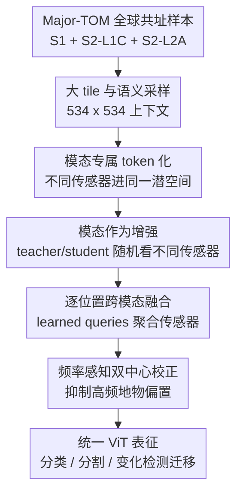

# TerraFM: A Scalable Foundation Model for Unified Multisensor Earth Observation

**会议**: ICLR2026  
**OpenReview**: [https://openreview.net/forum?id=cBxuzdUDNx](https://openreview.net/forum?id=cBxuzdUDNx)  
**代码**: https://github.com/mbzuai-oryx/TerraFM  
**领域**: 遥感 / 地球观测基础模型  
**关键词**: 遥感基础模型, 多传感器融合, Sentinel-1/2, 自监督学习, 语义分割  

## 一句话总结
TerraFM 面向多传感器地球观测数据，把 Sentinel-1 SAR 与 Sentinel-2 光学影像当作同一地点的天然增强视图，通过模态专属 patch embedding、逐位置 cross-attention 融合和面向长尾地表覆盖的 dual-centering DINO 训练，在 GEO-Bench 与 Copernicus-Bench 的分类和分割任务上取得了强泛化表现。

## 研究背景与动机
**领域现状**：遥感基础模型正在从单一光学影像预训练，走向跨传感器、跨地区、跨分辨率的统一表征学习。Sentinel-1 提供雷达观测，能补足云遮挡和光学条件变化下的信息；Sentinel-2 L1C/L2A 提供多光谱光学观测，覆盖地物光谱特征。近年的 AnySat、Galileo、Prithvi-EO、DOFA、Copernicus-FM 等方法已经证明，大规模自监督预训练可以迁移到地物分类、作物分割、云检测等任务。

**现有痛点**：问题不只是“数据还不够多”。遥感数据的困难来自三个层面：第一，传感器差异很大，SAR 的通道、噪声和成像机理与光学多光谱完全不同，RGB-centric ViT 的共享 patch projection 很难自然吃下这些输入；第二，很多模型要么把多模态拆成多个 encoder，要么只在 decoder 或重建目标里做融合，跨模态耦合不够直接；第三，全球地表覆盖分布天然长尾，森林、草地、海洋占比很大，城市、红树林、冰雪等类别稀少，普通 DINO 的全局 centering 会稳定训练，但不会主动修正这种语义采样偏置。

**核心矛盾**：遥感基础模型既要充分利用全球级大规模数据，又不能被“主流传感器、主流地物、局部纹理”牵着走。更大的 tile 能带来更宽的空间语义上下文，但也提高了建模和训练成本；更多传感器能带来互补信息，但如果输入侧没有模态意识，模型会把传感器差异当作噪声；自监督学习避免标注成本，却容易在长尾地物上学到偏向高频类别的原型。

**本文目标**：TerraFM 试图把这些矛盾放进一个统一框架里解决。它要在 Sentinel-1、Sentinel-2 L1C、Sentinel-2 L2A 三类共址数据上学习统一遥感表征；要让模型在单模态输入和多模态输入下都能工作；要用全球覆盖的大 tile 数据学习更宽的空间上下文；还要利用 ESA WorldCover 的地表覆盖频率信息缓解长尾类别对自监督表征的影响。

**切入角度**：作者的关键观察是，共址的多传感器影像不必只被看成“多路输入”，也可以被看成同一地理位置的天然增强视图。这个角度很适合 DINO 式 teacher-student 自监督：teacher 可以看一种模态的 global crop，student 可以看另一种模态的 local crop，只要它们来自同一地点，训练目标就会推动模型学到跨传感器一致的语义。

**核心 idea**：TerraFM 用“模态作为增强”的 DINO 预训练替代单模态遥感预训练，并在 encoder 入口处加入模态专属嵌入、跨模态注意力融合和频率感知 dual centering，让统一 ViT 同时具备多传感器适配、空间上下文建模和长尾地表覆盖鲁棒性。

## 方法详解

### 整体框架
TerraFM 的输入是同一空间网格单元上的 Sentinel-1 SAR、Sentinel-2 L1C 和 Sentinel-2 L2A 影像，每个网格单元还关联一个由 ESA WorldCover 派生的粗粒度地表覆盖类别。模型主体仍是 ViT teacher-student 框架，但输入端不再使用单个共享 RGB patch embedding，而是先按模态编码，再在需要时做逐空间位置的 cross-attention 融合，最后用 DINO 风格的多 crop 蒸馏目标训练统一表征。

论文的流程可以概括为四段：先从 Major-TOM 中筛出全球分布且三模态齐全的地理 tile；再把每种传感器输入变成可共享处理的 token；如果一次训练视图抽到多个模态，就用 cross-attention 在每个空间位置融合传感器信息；最后用 teacher-student 多 crop 损失对齐不同模态和不同尺度的视图，并用 dual centering 抵消高频地表覆盖类别的表征支配。

### 关键设计
**1. 大 tile 与语义采样：先让预训练数据覆盖真正有信息的全球地表**

TerraFM 的数据基础来自 Major-TOM。每个空间单元约覆盖 $10.68\,\text{km} \times 10.68\,\text{km}$，同时包含 Sentinel-1 RTC、Sentinel-2 L1C 和 Sentinel-2 L2A 三种共址影像。作者没有直接把所有网格都塞进训练，而是先过滤掉 98% 的 ocean-classified tile，只保留 2% 以维持海洋代表性，再按地表覆盖、气候区和 ESRI 世界区域做分布式采样。这样做的目的很具体：遥感图像里大量海洋或低信息区域会让模型学到过于单调的背景原型，训练规模变大反而会加重偏置。

每个保留下来的网格被切成四个不重叠的 $534 \times 534$ tile。这个尺寸比许多遥感 foundation model 使用的 96、128、224 tile 更大，能让模型在预训练时看到农田边界、城市-郊区过渡、植被-水体关系这类更宽的空间语义。最终数据规模约为 153 万个多模态样本、1870 万个 modality-specific training tiles，像素量约 23.32T。这里的 WorldCover 类别不作为监督标签喂给模型，而是用于统计高频类别，后面服务于 dual centering。

**2. 模态专属 token 化：让 SAR 与多光谱输入共享 ViT，但不强迫它们共享输入投影**

标准 ViT 的 patch embedding 通常是一个共享卷积投影，默认所有输入具有相同通道结构。这对 RGB 图像合理，但对 Sentinel-1 和 Sentinel-2 并不合理：S1 只有 VV/VH 两个雷达通道，S2 则包含多达 13 个光谱 band，且 L1C 与 L2A 的物理含义也不同。TerraFM 因此为每个模态 $m$ 设置独立的 patch embedding $f_{\theta_m}$，把输入 $x^{(m)} \in \mathbb{R}^{H \times W \times C_m}$ 映射为 token 序列 $\bar{Z}^{(m)} \in \mathbb{R}^{N \times D}$。

为了让共享 encoder 知道 token 来自哪个传感器，模型还给每个模态加上可学习的模态向量 $\epsilon^{(m)}$：$\tilde{Z}^{(m)} = \bar{Z}^{(m)} + \mathbf{1}_N (\epsilon^{(m)})^\top$。随后所有模态 token 通过共享投影 $\psi: \mathbb{R}^{D} \rightarrow \mathbb{R}^{d}$ 对齐到同一潜空间。这个设计的好处是，底层输入适配保留模态差异，高层 transformer 又能复用同一套参数学习跨传感器语义，不需要为每种传感器维护完全独立的 backbone。

**3. 模态作为增强与逐位置跨模态融合：把共址传感器变成自监督正样本关系**

TerraFM 最核心的训练观念是：同一地点的 S1、S2-L1C、S2-L2A 是对同一场景的不同观测，因此可以像颜色扰动、crop 一样作为自监督增强。预训练时，student 和 teacher 会随机选择模态，阈值为 0.5；例如 teacher 可能拿到 S1 的 global crop，student 则拿到 S2-L2A 的 local crop。DINO 损失会迫使 student 从局部、另一传感器的视角预测 teacher 的语义分布，从而把“同地不同传感器”对齐到一致表征。

当一次视图只选中一个模态时，模型走普通的模态专属 patch embedding 加共享 encoder；当选中多个模态时，TerraFM 在 encoder 前做 cross-attention fusion。具体来说，对每个空间位置 $n$，来自不同模态的 token 被堆成 $M$ 个 key/value，模型使用共享的 $N_q$ 个可学习 query 去 attend 这些传感器 token，得到 $N_q$ 个中间输出 $z'_n$，再通过可学习投影 $p_r$ 计算权重 $w=\operatorname{Softmax}(z'_n p_r)$，加权得到一个融合 token $z^{\text{fused}}_n = \sum_j w_j z'_n[j]$。论文最终使用 $N_q=5$。

这个融合是逐空间位置发生的，而不是把所有 token 全局混在一起。它保留了 ViT 的原始序列长度，也保留了各模态在同一地理位置上的可比性：某个位置如果光学被云影响，SAR 可能更可靠；某个位置如果雷达纹理弱，光谱 band 可能更有辨识度。fusion block 学到的是“在这个位置、这些传感器里该相信谁”，后续 transformer 再负责空间交互。

**4. 频率感知双中心校正：在 DINO 稳定性之外显式处理地表覆盖长尾**

DINO 里常用 center $c$ 对 teacher logits 做平移，避免输出坍缩到少数原型。TerraFM 保留这个全局 center，但指出遥感数据还有一个普通 DINO 没处理的问题：训练 tile 的地表覆盖类别高度不均衡，tree cover、grassland、open seas 等频繁类别会在 teacher 输出里反复出现，导致原型空间偏向高频地物。为此，作者额外引入一个高频类别中心 $c_h$，只用 batch 中属于高频 LULC 类别的样本通过 EMA 更新。

训练时 teacher logits 不是只减全局 center，而是减去两类中心的加权组合：$\hat{g}(x)=g_{\theta_t}(x)-\alpha c-(1-\alpha)c_h$，其中 $\alpha \in [0,1]$，实验中取 $\alpha=0.8$。这个式子不是监督分类损失，也不会把 WorldCover 类别作为输入标签；它更像一个频率感知的表征正则项，用高频类别的输出统计给 teacher 分布“降温”，减少模型把过多样本吸到常见地物原型上的倾向。附录分析显示，dual centering 会提高稀有类别的 softmax entropy 和 top-k prototype diversity，尤其对 mangroves、herbaceous wetland、built-up 等尾部类别更明显。

### 一个完整示例
假设一个训练样本来自热带沿海地区，同一 $534 \times 534$ tile 同时有 S1、S2-L1C 和 S2-L2A。数据采样阶段会先确认它不是被大量海洋背景主导的低信息样本，并记录 WorldCover 主类别用于频率统计。进入训练后，teacher 可能从 S2-L2A 中取两个 global crop，student 可能从 S1 和 S2-L1C 中取多个 local crop。

对 student 的某个 local crop，如果只抽到 S1，模型会走 S1 专属 patch embedding，并加上 S1 模态向量；如果同时抽到 S1 和 S2-L1C，同一空间位置上的两个 token 会作为 key/value 被 learned queries 融合成一个 token。之后 student 输出要和 teacher 的 global optical view 对齐。这样，一个局部 SAR 纹理、一个局部大气顶光学视图、一个全局地表反射率视图会在同一 DINO 目标下被拉到一致语义附近。

如果这个样本的主类别属于训练集中非常高频的 tree cover 或 grassland，dual centering 会把高频类别中心纳入 teacher logits 的校正，避免它继续强化“常见植被原型”对输出空间的支配。结果是模型既学会跨传感器一致性，也不至于只服务于训练集中最常见的地物。

### 损失函数 / 训练策略
TerraFM 采用 DINO 式 teacher-student 训练。student 用梯度更新，teacher 用 student 参数的 EMA 更新：$\theta_t \leftarrow \lambda_e \theta_t + (1-\lambda_e)\theta_s$，其中 $\lambda_e$ 使用 cosine schedule 从初始动量逐渐增大。teacher 只处理两个 global crops，student 同时处理 global crops 和 local crops，训练目标是在所有不同视图对上最小化 teacher 分布和 student 分布之间的 cross-entropy。

多 crop 设置为：global crop 从原 tile 的 $[0.25,1.0]$ 比例采样并 resize 到 $224 \times 224$，local crop 从 $[0.05,0.25]$ 比例采样并 resize 到 $96 \times 96$，patch size 为 $16 \times 16$。TerraFM-B 训练 150 epochs，batch size 1024，64 GPUs 上约 92 小时；TerraFM-L 训练 200 epochs，batch size 2048，约 183 小时。projection head 的输出维度 $K=65{,}536$，teacher temperature 从 0.04 线性升到 0.06，teacher momentum 从 0.996 开始，drop path 为 0.1，fusion query 数 $N_q=5$，dual centering 权重 $\alpha=0.8$。

## 实验关键数据

### 主实验
论文主要在 GEO-Bench 和 Copernicus-Bench 上评估，覆盖分类、分割、多标签分类等任务。GEO-Bench 部分既报告 kNN 这种不训练分类头的表征质量，也报告 fine-tuning / probing 的下游迁移；Copernicus-Bench 则覆盖 Sentinel-1/2 相关任务，包括 EuroSAT、BigEarthNet、Cloud-S2、DFC2020 等。

| Benchmark / 任务 | 指标 | TerraFM 最好结果 | 代表性强基线 | 提升 / 结论 |
|--------|------|------|----------|------|
| GEO-Bench kNN m-EuroSAT | Top-1 Acc | 95.1 | Galileo 93.0 | +2.1，说明冻结表征已经很强 |
| GEO-Bench kNN m-BigEarthNet | F1 | 69.4 | SoftCon 64.7 / Galileo 59.0 | 对多标签地物识别提升明显 |
| GEO-Bench fine-tune m-So2Sat | Top-1 Acc | 66.6 | Galileo 63.3 | 在输入通道少于预训练设置时仍稳健 |
| GEO-Bench probing m-Cashew-Plant | mIoU | 37.0 | Galileo 33.0 | +4.0，分割迁移优于现有 FM |
| GEO-Bench probing m-SA-Crop-Type | mIoU | 34.6 | CROMA 32.0 / Galileo 30.1 | 作物分割上取得最佳结果 |
| Copernicus-Bench Cloud-S2 | mIoU | 67.9 | SoftCon 66.9 / Copernicus-FM 66.7 | 云检测分割最佳 |
| Copernicus-Bench EuroSAT-S2 | OA | 99.1 | Copernicus-FM 97.9 | 光学分类接近饱和但仍有提升 |
| Copernicus-Bench DFC2020-S1 | mIoU | 55.4 | SoftCon 52.8 / Copernicus-FM 52.4 | SAR 分割迁移更强 |

从主结果看，TerraFM 的优势不是只出现在某一个任务上。它在 kNN 分类、fine-tuning 分类、linear/UPerNet segmentation probing 以及 Copernicus-Bench 的多种指标上都比较稳。尤其值得注意的是，TerraFM 与 Copernicus-FM 都使用 ViT-B/16 backbone，后者也是大规模 Copernicus 预训练模型，但 TerraFM 在大多数 Sentinel-1/2 任务上更好，说明输入融合和训练目标设计确实带来了额外收益。

### 消融实验
作者在 20 万样本子集上训练 TerraFM-B 150 epochs，逐步加入 modality augmentation、fusion 和 dual centering。表中 BEN 是 m-BigEarthNet，ES 是 m-EuroSat，CP 分别用 UPerNet probing 与 linear probing 评估 m-Cashew-Plantation segmentation。

| 配置 | BEN | ES | CP UPerNet | CP Linear | 说明 |
|------|---------|------|------|------|------|
| SS | 54.62 | 83.20 | 50.58 | 19.4 | 只有自监督 DINO 式训练 |
| SS + MAug | 57.63 | 87.70 | 59.17 | 24.8 | 把模态作为增强，分类和分割都大幅提升 |
| SS + MAug + Fus | 57.74 | 88.50 | 62.40 | 26.2 | 融合对 segmentation 特别有帮助 |
| SS + MAug + Fus + DC | 58.06 | 90.40 | 64.58 | 27.6 | dual centering 继续提升，尤其 ES 与 CP |

这组消融的逻辑很清楚：单纯自监督可以学到基本遥感表征；一旦把传感器当作增强，模型就能利用共址多模态关系，m-EuroSat 增加 4.50，m-Cashew UPerNet 增加 8.59；cross-attention fusion 对分割更关键，因为像素级任务更依赖局部传感器互补；dual centering 的提升幅度不算最大，但它在多个指标上稳定正向，和论文关于长尾地表覆盖偏置的分析一致。

| 融合策略 | m-BigEarthNet | m-EuroSat | 观察 |
|------|------|------|------|
| DINO (S2-L2A) | 54.6 | 83.2 | 单一光学模态基线 |
| Multi-Student-Teacher | 55.8 | 87.8 | 多网络对齐有效但结构更重 |
| CrossAttn (Q=196) Global | 52.0 | 77.1 | 全局 query 过重且缺少空间对齐归纳偏置 |
| TerraFM-B (Q=1) | 57.2 | 89.2 | 逐位置轻量融合已经明显更好 |
| TerraFM-B (ViT PatchEmb) | 56.9 | 87.2 | 更复杂 token extractor 未必更优 |
| TerraFM-B (Q=5) | 58.1 | 90.4 | 多个空间 query 带来最佳融合效果 |

### 关键发现
- 模态增强是最主要的增益来源之一。它让 teacher 和 student 经常看到不同传感器下的同一地理场景，因此训练目标天然逼迫模型学习 sensor-invariant 表征。
- Cross-attention fusion 对 segmentation 特别重要。m-Cashew-Plantation 的 UPerNet probing 从 59.17 提升到 62.40，说明局部传感器互补被更好利用。
- Dual centering 的收益不是只体现在一个单点数值上。附录可视化显示它提升了尾部类别的 softmax entropy 和 prototype diversity，表明模型不再过度复用高频地物原型。
- Scaling 结果显示，大模型更吃数据。TerraFM-L 从 20% 到 100% 预训练数据时，在 BigEarthNet 和 So2Sat 上都有 6.8 点增益，而 TerraFM-S 的增益明显较小。
- 跨分辨率泛化也不错。虽然预训练只用 Sentinel-1/2，TerraFM 在 AID、m-pv4ger、m-chesapeake-landcover 等低到高分辨率任务上也超过 Galileo，说明表征不只是记住了某个传感器的纹理。

## 亮点与洞察
- 把多传感器共址数据重新解释为自监督增强，是这篇论文最关键的思想。它避免了把多模态融合做成额外监督任务，也比“分别编码再对齐”更自然地融进 DINO 框架。
- 逐空间位置 fusion 比全局 cross-attention 更符合遥感数据结构。同一个地理位置上的 S1/S2 token 有天然对齐关系，让 query 在位置内选择传感器，比让 196 个全局 query 同时看所有模态 token 更有归纳偏置。
- Dual centering 是一个很实用的遥感自监督 trick。它不需要地物标签参与监督训练，只用类别频率统计调整 teacher logits，就能缓解高频地表覆盖类别的表征支配。
- 大 tile 的选择很务实。很多遥感任务不是单个局部纹理能解决的，作物类型、城市扩张、云影、海岸地带都需要周边上下文；$534 \times 534$ tile 给模型提供了更宽的地理语义窗口。
- 论文的消融没有只停留在“模块加了有提升”，还比较了多种 fusion 结构。CrossAttn (Q=196) Global 反而下降，说明跨模态融合不是越大越好，空间对齐和轻量设计更重要。

## 局限与展望
- TerraFM 主要围绕 Sentinel-1 和 Sentinel-2 展开，虽然在部分高分辨率 RGB 或 Landsat 任务上有迁移结果，但真正统一 Sentinel-3/4/5P、DEM、气象、时间序列等更广 EO 数据还没有完成。
- 论文把多模态作为共址增强，但没有深入处理时间维度。Major-TOM 每个 cell 有随机 4 个月窗口，能减少季节偏置，却不能显式建模作物生长、灾害前后变化或长期地表演化。
- Dual centering 依赖 WorldCover 派生的高频类别统计。这个设计很轻量，但如果 WorldCover 标签在某些地区存在系统误差，或者类别粒度和下游任务差异很大，频率中心的校正也可能带来偏移。
- 训练成本仍然不低。TerraFM-L 需要 64 GPUs 训练约 183 小时，虽然比 Prithvi-EO-v2.0 报告的 GPU-hour 更省，但对普通研究团队仍然是高门槛。
- 论文强调分类和分割泛化，但对部署层面的鲁棒性还可以更细，比如云遮挡极端场景、跨季节 shift、传感器缺失组合、地理区域 out-of-distribution 等。
- 后续可以探索把 TerraFM 的“模态作为增强”扩展到时序增强：同一地点不同季节、不同年份、灾害前后也可以形成自然视图，但需要更细的正负样本定义，避免把真实变化错误对齐掉。

## 相关工作与启发
- **vs Galileo**: Galileo 也是多遥感模态 foundation model，强调 global/local features 和多模态输入；TerraFM 的区别在于把 S1、S2-L1C、S2-L2A 作为 DINO teacher-student 里的天然增强，并在 encoder 前做逐位置 cross-attention fusion，GEO-Bench 多项结果超过 Galileo。
- **vs Copernicus-FM**: Copernicus-FM 使用 Copernicus 多源数据和 metadata-aware 设计，覆盖更广 Sentinel family；TerraFM 聚焦 S1/S2，但用大 tile、模态增强、dual centering 和轻量 fusion，在共享 ViT-B/16 backbone 的 Copernicus-Bench 多数任务上更强。
- **vs CROMA / SoftCon**: CROMA 和 SoftCon 都利用雷达-光学对比学习或软对比信号，已经证明 SAR/optical 对齐有价值；TerraFM 进一步把这种对齐放进 DINO 多 crop 蒸馏框架，并允许多模态输入在 encoder 侧融合。
- **vs Prithvi-EO-v2.0**: Prithvi-EO-v2.0 侧重多时相光学遥感预训练，模型规模很大；TerraFM 更强调 multisensor 统一和频率感知自监督，在 SAR/optical 混合任务与 segmentation probing 上表现更有优势。
- **vs DOFA / AnySat / msGFM**: 这些方法都试图处理跨分辨率、跨传感器或任意尺度输入；TerraFM 的启发在于，不一定要设计非常复杂的任意传感器接口，先把共址传感器视为增强，并用位置内 fusion 保留空间对齐，就能在常见 Sentinel-1/2 生态里得到很强结果。

## 评分
- 新颖性: ⭐⭐⭐⭐☆ 把 DINO、多模态遥感和长尾 centering 组合得很完整，其中“模态作为增强 + 逐位置 fusion”对 EO foundation model 很有启发。
- 实验充分度: ⭐⭐⭐⭐⭐ GEO-Bench、Copernicus-Bench、fusion 消融、组件消融、scaling、高分辨率迁移和变化检测都有覆盖，证据链比较扎实。
- 写作质量: ⭐⭐⭐⭐☆ 主文逻辑清晰，方法公式和实验表格足够完整；少量段落略显拥挤，部分实现细节需要看附录才能完全对上。
- 价值: ⭐⭐⭐⭐⭐ 对遥感基础模型非常有参考价值，尤其适合后续做多传感器预训练、遥感分割迁移和长尾地表覆盖表征学习的工作。

<!-- RELATED:START -->

## 相关论文

- [\[ICCV 2025\] Towards a Unified Copernicus Foundation Model for Earth Vision](../../ICCV2025/remote_sensing/towards_a_unified_copernicus_foundation_model_for_earth_vision.md)
- [\[ICCV 2025\] SkySense V2: A Unified Foundation Model for Multi-Modal Remote Sensing](../../ICCV2025/remote_sensing/skysense_v2_a_unified_foundation_model_for_multi-modal_remote_sensing.md)
- [\[ICLR 2026\] Earth-Agent: Unlocking the Full Landscape of Earth Observation with Agents](earth-agent_unlocking_the_full_landscape_of_earth_observation_with_agents.md)
- [\[ICCV 2025\] RS-vHeat: Heat Conduction Guided Efficient Remote Sensing Foundation Model](../../ICCV2025/remote_sensing/rs-vheat_heat_conduction_guided_efficient_remote_sensing_foundation_model.md)
- [\[CVPR 2026\] RAMEN: Resolution-Adjustable Multimodal Encoder for Earth Observation](../../CVPR2026/remote_sensing/ramen_resolution-adjustable_multimodal_encoder_for_earth_observation.md)

<!-- RELATED:END -->
