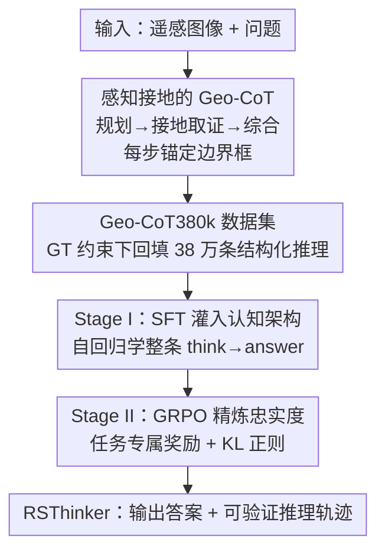

# Towards Faithful Reasoning in Remote Sensing: A Perceptually-Grounded Geospatial Chain-of-Thought for Vision-Language Models

**会议**: ICLR 2026  
**OpenReview**: [https://openreview.net/forum?id=lJ7zecny2e](https://openreview.net/forum?id=lJ7zecny2e)  
**代码**: 暂未发布（作者称将在论文发表后释放 Geo-CoT380k 数据集与 RSThinker 模型）  
**领域**: 遥感 / 多模态VLM / LLM推理  
**关键词**: 遥感、地理空间思维链、感知接地、视觉语言模型、GRPO

## 一句话总结
本文提出"感知接地的地理空间思维链"（Geo-CoT），让遥感 VLM 把分析过程拆成"规划→接地取证→综合"三步、每一步都用边界框把论断锚定到具体像素区域；通过构建 38 万条结构化推理数据集 Geo-CoT380k + 两阶段对齐（SFT 灌输认知结构、GRPO 精炼忠实度），训出的 RSThinker 在视觉定位、计数、检测、描述、VQA 等十余个遥感任务上大幅领先现有 SOTA。

## 研究背景与动机
**领域现状**：遥感视觉语言模型（GeoChat、EarthGPT、VHM、SkySenseGPT、EarthDial 等）近两年快速发展，普遍采用端到端范式，把"像素→最终文本答案"压成一个整体映射，在 VQA、场景分类、目标计数等下游任务上刷出高分。

**现有痛点**：这种端到端映射把中间推理过程当成一个潜在、不可访问的隐变量，缺乏过程透明性，容易生成"看似合理但事实上没有依据"的幻觉。而遥感的高风险应用（灾害响应、环境监测）恰恰要求结果**可验证**——不仅答案要对，产生答案的过程也要能被核查。即便有些工作尝试引入多模态思维链（MM-CoT），它们的推理步骤要么停留在抽象的语义解释（靠模型的世界知识做"高层演绎"，比如把体育场判断为震后避难点），要么把视觉证据写成无法定位的文本，没有指向具体像素区域的可验证链接。

**核心矛盾**：遥感图像与自然图像有本质的"感知错配"——遥感是大范围、非均匀、高密度小目标的俯视场景，缺乏自然图像里那种显著、边界清晰的实体；而现有 grounded CoT 框架都建立在"有显著大物体可推理"的假设上，迁到遥感就失灵。问题的根源是缺少**意图驱动的主动感知**：模型做的是对整幅场景一次性、被动的整体推断，而不是"先规划分析计划、再逐步系统性地取证、最后综合"。

**本文目标**：让遥感 VLM 把推理过程显式化、结构化，并且每一步都钉死在可核查的视觉证据上，从而把"不透明的感知"变成"结构化、可验证的推理"。

**切入角度**：作者认为遥感专家分析图像时本就遵循一套可外化的协议——任务规划、迭代取证、最终综合；只要把这套协议变成带边界框的结构化序列灌进模型，就能逼模型做"有条理的视觉审讯"而非"反射式的整体推断"。

**核心 idea**：定义"感知接地的地理空间思维链"（Geo-CoT），强制每一条分析论断都显式链接到具体空间参照；用一个大规模结构化推理数据集 + 两阶段对齐（先 SFT 灌结构、后 GRPO 精炼忠实度）把这套认知架构灌进模型。

## 方法详解

### 整体框架
方法要解决的是"如何让遥感 VLM 产出既正确、又过程可验证的推理"。整体思路是：先定义一种带空间接地的推理范式（Geo-CoT），把它实例化成一个大规模监督数据集，再用两阶段对齐把这种推理能力训进一个基座 VLM，最终得到模型 RSThinker。

输入是遥感图像 $I$ 加用户问题 $Q$，输出是 `<think>...</think><answer>...</answer>` 的结构——`<think>` 里是按"规划（Planning）→接地取证（Grounding）→综合（Synthesis）"展开的、每步带边界框坐标的可验证推理轨迹，`<answer>` 里是最终答案。基座选用 GLM-4.1V-9B-Base，其视觉编码器 Aimv2-Huge 通过动态位置编码（把 patch 坐标归一化到 $[-1,1]$ 后对预训练位置表做双三次插值）天然支持遥感图像的可变分辨率与宽高比。围绕这个基座，训练分两阶段：第一阶段用 Geo-CoT380k 做监督微调（SFT）灌入"任务分解 + 迭代接地 + 综合"的认知骨架；第二阶段用群体相对策略优化（GRPO）以任务专属奖励把推理策略推向事实正确。

### 关键设计

**1. 感知接地的 Geo-CoT：把每条论断钉到具体像素区域**

这一设计针对的痛点是现有遥感推理"要么是抽象语义猜测、要么是无法定位的文本证据"。作者定义的 Geo-CoT 是一种强制性的认知协议：分析必须按"规划 → 迭代接地取证 → 最终综合"三步走，且**核心原则是严格的感知接地**——任何抽象论断都要被替换成显式链接到具体空间参照（边界框坐标）的断言。比如"图里有几座桥"，规划阶段先确定"桥多沿水系/道路分布"的搜索策略，接地阶段逐个把候选写成 `a bridge [183,558,276,762] across the water` 这样带坐标的证据条目，综合阶段再据此给出可核查的计数。

为什么这样有效：把证据写成"可证伪的空间参照"后，每一步推理都暴露在可核查之下，模型不能再用"看似合理"的文本蒙混过关；同时"先规划搜索策略再系统扫描"天然适配遥感"大范围 + 高密度小目标"的特性，把单次整体识别变成有条理的序列搜索，在密集场景下能更完整地枚举目标、减少漏检与重复计数。

**2. Geo-CoT380k：用 GT 强约束回填可验证推理的数据集**

SFT 的成败取决于有没有大规模、结构化、且忠实的推理语料，但让模型凭空生成推理极易产生幻觉。作者的做法是设计一条可扩展的标注流水线，用通用大模型 GPT-4V 来生成推理，但**关键在于强条件约束**：不让它做开放式推理，而是把已验证的边界框、图像描述、思维链范例一并喂给它，让它"照着 GT 把可验证的推理理由回填上去"，从而最大限度压低幻觉风险。最终得到 Geo-CoT380k，含 384,591 条结构化推理，覆盖 VQA、图像描述、场景分类、视觉定位、目标计数、目标检测六大任务，数据源自 VRSBench、DOTAv2（切成 800×800 patch）、HRRSD、NWPU-RESISC45 等公开遥感基准。这是遥感领域第一个大规模思维链 SFT 数据集，也是整套方法能把"接地推理"教会模型的物质基础。

**3. Stage I — SFT 灌入认知架构**

光有数据还不够，得让模型把"分解—接地—综合"的工作流内化成自己的推理习惯。第一阶段用标准自回归目标，对每条结构化输出 $o_i$（即 `<think>...</think><answer>...</answer>`）最大化其对数似然：

$$\mathcal{L}_{\text{SFT}}(\theta) = -\sum_{t=1}^{|o_i|} \log p(o_i,_t \mid o_{i,<t}, I, Q; \theta)$$

作者强调这一步不是简单的任务微调，而是从根本上重塑模型内部的推理过程，让它显式建模 Geo-CoT 的分解、接地、综合三步。消融显示这一步至关重要：同样是 SFT，带 CoT 的版本（SFT w/ CoT）相比不带 CoT 的版本（SFT w/o CoT），在目标检测 mAP@0.5 上从 49.36 跳到 74.03，VQA 从 63.57 升到 74.20——监督模型"计算过程本身"而非"最终输出"，能解锁一个本质更高的性能层级。

**4. Stage II — GRPO 以任务专属奖励精炼忠实度**

SFT 灌入了结构模板，但其 token 级最大似然目标仍可能给"局部看起来合理、但证据与论断之间链接不忠实"的推理轨迹打高分。第二阶段用 GRPO（一种只看推理轨迹最终输出来给奖励的结果导向 RL）来修这个序列级缺陷。对每个输入 $(I,Q)$ 采样 $k$ 条输出，奖励 $R$ 按任务的标准评测指标设计（VQA/分类用 1.0/0.6/0.0 的三档正确性，视觉定位用 IoU，计数用 $1-\alpha\times\text{MAE}/\max(|\text{Ans}|,|\text{GT}|)$，检测用 mAP@0.5，描述用 BLEU-4/METEOR/CIDEr/ROUGE-L 的加权和），再归一化成群体相对优势 $\hat{A}_i = (R_i - \text{mean}(R))/\text{std}(R)$，用带裁剪的代理目标更新策略：

$$\mathcal{L}_{\text{GRPO}}(\theta) = -\mathbb{E}\Big[\sum_{i=1}^{k}\sum_{t=1}^{|o_i|} \min\big(r_{t,i}(\theta)\hat{A}_i,\ \text{clip}(r_{t,i}(\theta),1-\epsilon,1+\epsilon)\hat{A}_i\big)\Big] + \beta D_{\text{KL}}(\pi_\theta \| \pi_{\text{ref}})$$

其中参考策略 $\pi_{\text{ref}}$ 由 SFT 检查点初始化。这里 KL 正则不是可有可无的——作者发现去掉它会导致学到的推理格式"灾难性崩溃"（输出退化成重复乱码直到截断）。两阶段是共生关系：SFT 必须先建好认知骨架，GRPO 才能在其上把生成策略推向事实正确；反过来若跳过 CoT 直接对无理由数据做 SFT+GRPO，则不足以灌入必要的认知脚手架。

### 一个例子：数飞机
问"图里有几架飞机"。RSThinker 先进入**规划**：意识到机场通常在跑道/航站楼附近停多架飞机，决定系统性地逐区检查——主航站楼区、相邻跑道区。再进入**接地取证**：在航站楼中心区识别到多架平行停放的飞机，明确"一侧三架、对侧两架、跑道远端一架"。最后**综合**：确认这些目标都具备机翼、机身、尾翼等飞机特征，累计得出共 6 架，写进 `<answer>There are a total of 6 airplanes.</answer>`。整条轨迹把总数拆成可核查的子组（"一侧三架、对侧两架"），让最终结论成为透明过程的产物而非黑箱输出。

## 实验关键数据

### 主实验
基座为 GLM-4.1V-9B-Base，对比涵盖闭源商业模型（Claude-sonnet-4、Gemini-2.0-flash、ChatGPT-5）、开源通用 VLM（Qwen2.5-VL、MiniGPT-v2）、开源推理 VLM（GLM-4.1V-Thinking、Kimi-VL-Thinking）、开源遥感 VLM（GeoChat、VHM、SkySenseGPT、EarthDial）。

| 任务 | 数据集 / 指标 | RSThinker | 次优基线 | 说明 |
|------|--------------|-----------|----------|------|
| 视觉定位 | VRSBench-VG mAP@0.5 | 90.4 | 63.8（GLM-4.1V-Thinking） | 大幅领先 |
| 视觉定位 | DIOR-RSVG mAP@0.5 | 93.1 | 60.8（SkySenseGPT） | 零样本外泛化强 |
| 目标计数 | HRRSD Acc / MAE↓ | 85.26 / 0.242 | 61.45 / 0.871（EarthDial） | MAE 大幅降低 |
| 目标计数 | DOTAv2-val Acc | 43.93 | 36.20（ChatGPT-5） | — |
| 场景分类 | RESISC45 Acc | 96.89 | 91.33（VHM） | — |
| 图像描述 | NWPU-Cap BLEU-4 | 85.12 | 67.14（EarthDial） | — |
| VQA | VRSBench Existence Acc | 92.36 | 88.89（ChatGPT-5） | 存在性核查最受益 |

RSThinker 在视觉定位、计数、检测三类细粒度感知任务上优势最直接——因为这些任务的正确性与"能否定位空间证据"强相关；而结构化推理并未损害整体场景理解，分类与描述同样领先。

### 消融实验

| 配置 | VG (mIoU) | OC (MAE↓) | Det (mAP@0.5) | IC (BLEU-4) | SC (Acc) | VQA (Acc) |
|------|-----------|-----------|----------------|-------------|----------|-----------|
| Base (GLM-4.1V-9B-Base) | 56.26 | 10.81 | 3.56 | 10.99 | 69.78 | 8.16 |
| + SFT (w/o CoT) | 81.80 | 3.272 | 49.36 | 31.14 | 93.33 | 63.57 |
| + SFT (w/ CoT) | 87.70 | 2.932 | 74.03 | 33.31 | 96.67 | 74.20 |
| + SFT (w/o CoT) + GRPO | 86.47 | 4.510 | 56.77 | 30.87 | 97.56 | 74.09 |
| + SFT (w/ CoT) + GRPO（完整） | **89.02** | **2.728** | **77.06** | **33.96** | 96.89 | **77.24** |

### 关键发现
- **CoT 监督是性能跃迁的关键**：SFT w/ CoT 相比 w/o CoT，检测 mAP 从 49.36 → 74.03、VQA 从 63.57 → 74.20，说明监督"计算过程本身"远比只监督"最终输出"更有效。
- **SFT 与 GRPO 是共生关系**：跳过 CoT 直接做 SFT+GRPO（w/o CoT + GRPO），检测仅 56.77、计数 MAE 反而恶化到 4.510，证明 GRPO 必须建立在 CoT 认知骨架之上才有效。
- **KL 正则不可或缺**：去掉 KL 惩罚会让推理格式灾难性崩溃（输出退化为重复 token 直到截断），KL 起到稳定学到的推理格式的作用。
- **细粒度感知任务最受益**：定位、计数、检测这类"答案正确性 = 能否定位证据"的任务收益最大，因为 Geo-CoT 强制把证据落到可核查的边界框。

## 亮点与洞察
- **把"可验证性"做成输出格式的硬约束**：不是事后解释，而是要求模型在推理轨迹里把每条证据写成可证伪的边界框坐标——这种"强制接地"思路可迁移到任何需要过程可核查的高风险视觉任务（医学影像、工业质检）。
- **用 GT 强约束 + GPT-4V 回填造高保真 CoT 数据**：绕开了"让模型凭空生成推理必幻觉"的死结，通过把已验证的框/描述/范例喂给标注模型，让它"照着答案补理由"，是一条可扩展、可控幻觉的合成推理数据路线。
- **"规划—接地—综合"对遥感密集小目标的适配**：把单次整体识别变成系统性序列搜索，天然缓解了俯视密集场景的漏检与重复计数，这点对遥感尤其重要。
- **两阶段分工清晰**：SFT 管"认知结构"、GRPO 管"事实忠实度"，把架构挑战与策略挑战解耦，这一范式直接借鉴了大语言模型（DeepSeek-R1 等）的训练经验并迁到遥感。

## 局限与展望
- **依赖 GPT-4V 与 GT 标注的数据流水线**：Geo-CoT380k 的推理质量受限于 GPT-4V 在严格条件下的生成能力与底层 GT 框的覆盖；GT 没标到的目标，回填的推理也无从接地。
- **代码与数据尚未释放**：作者称"论文发表后公开"，复现性暂时存疑，文中部分实现细节（训练协议、超参）下放到附录。
- **强结构推理的开销**：每个任务都要输出完整的规划—接地—综合轨迹，相比端到端单次推断的推理成本与延迟更高，论文未深入讨论效率/部署代价。
- **奖励工程依赖任务专属设计**：GRPO 的奖励函数对每个任务手工设计（计数里的 $\alpha$、描述里的多指标权重 $w_m$ 等），换新任务需重新设计奖励，泛化到未见任务类型时的可扩展性待验证。

## 相关工作与启发
- **vs 端到端遥感 VLM（GeoChat / EarthGPT / VHM / SkySenseGPT / EarthDial）**: 它们把推理过程当成不可访问的隐变量、只优化"像素→文本"映射；本文显式外化"规划—接地—综合"轨迹并把每步钉到边界框，优势是过程可验证、细粒度任务大幅领先，代价是推理更重。
- **vs 通用 Grounded CoT（Visual CoT / VoCoT / Argus / V\*）**: 它们在自然/医学图像上靠显著大物体做接地推理，迁到遥感"大范围 + 高密度小目标"就失灵；本文提供了遥感专属的数据底座与认知架构，使接地推理在俯视场景下真正可用。
- **vs 已有遥感推理工作（SegEarth-R1 / RemoteReasoner / SkySense-O / Ringmo-Agent）**: 它们的推理步骤多停留在抽象文本、缺乏到空间区域的可验证链接，且推理过程缺少有条理的认知架构；本文是首个把"感知接地 + 系统认知计划"同时结构化进遥感推理的框架。

## 评分
- 新颖性: ⭐⭐⭐⭐⭐ 首次把"感知接地的可验证思维链"系统化引入遥感，并配套首个大规模遥感 CoT 数据集。
- 实验充分度: ⭐⭐⭐⭐⭐ 覆盖六大类十余个基准、对比四类基线，消融清晰隔离了 CoT、GRPO、KL 各自的因果贡献。
- 写作质量: ⭐⭐⭐⭐ 动机与方法论证扎实、图文配合好；个别处行文偏冗长华丽。
- 价值: ⭐⭐⭐⭐⭐ 对灾害响应/环境监测等高风险遥感应用"过程可验证"的刚需直击要害，数据集+模型若如期开源价值更大。

<!-- RELATED:START -->

## 相关论文

- [\[CVPR 2026\] ZoomEarth: Active Perception for Ultra-High-Resolution Geospatial Vision-Language Tasks](../../CVPR2026/remote_sensing/zoomearth_active_perception_for_ultra-high-resolution_geospatial_vision-language.md)
- [\[CVPR 2026\] GeoDiT: A Diffusion-based Vision-Language Model for Geospatial Understanding](../../CVPR2026/remote_sensing/geodit_a_diffusion-based_vision-language_model_for_geospatial_understanding.md)
- [\[CVPR 2025\] Think and Answer ME: Benchmarking and Exploring Multi-Entity Reasoning Grounding in Remote Sensing](../../CVPR2025/remote_sensing/think_and_answer_me_benchmarking_and_exploring_multi-entity_reasoning_grounding_.md)
- [\[CVPR 2026\] GeoCoT: Towards Reliable Remote Sensing Reasoning with Manifold Perspective](../../CVPR2026/remote_sensing/geocot_towards_reliable_remote_sensing_reasoning_with_manifold_perspective.md)
- [\[CVPR 2026\] AVION: Aerial Vision-Language Instruction from Offline Teacher to Prompt-Tuned Network](../../CVPR2026/remote_sensing/avion_aerial_visionlanguage_instruction_from_offli.md)

<!-- RELATED:END -->
