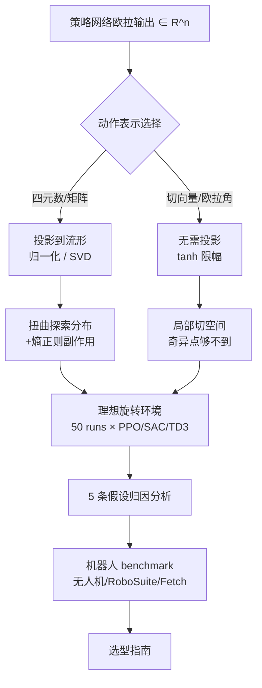

# A Primer on SO(3) Action Representations in Deep Reinforcement Learning

**会议**: ICLR 2026  
**OpenReview**: [https://openreview.net/forum?id=g4ZrpMQL1Z](https://openreview.net/forum?id=g4ZrpMQL1Z)  
**代码**: [amacati.github.io/so3_primer](https://amacati.github.io/so3_primer)  
**领域**: robotics, reinforcement learning  
**关键词**: SO(3), 旋转动作表示, 连续控制, PPO/SAC/TD3, 探索动力学, 切空间动作  

## 一句话总结
本文系统评估了 SO(3) 旋转动作在深度强化学习里的各种参数化方式（欧拉角 / 四元数 / 旋转矩阵 / 李代数切向量），通过对 PPO、SAC、TD3 在稠密与稀疏奖励下的大规模实验，证明"局部坐标系下的切空间增量动作（delta tangent vector）"几乎在所有算法和任务上最稳健，并给出一套可直接落地的旋转动作选型指南。

## 研究背景与动机
- **领域现状**：机器人操作、无人机姿态控制等任务的策略动作空间天然包含 SO(3) 旋转。但 SO(3) 是一个紧致、弯曲、非交换的流形，不存在既全局光滑、又最小、又无奇异的参数化。常见表示各有取舍——欧拉角最小直观但有顺序依赖、角度环绕、万向锁奇异；四元数光滑数值稳定但双重覆盖 SO(3)（$q$ 和 $-q$ 表示同一旋转）；旋转矩阵唯一光滑但 9 维过参数化、需正交化；李代数切向量局部光滑但大角度处有奇异。
- **现有痛点**：这些取舍在**监督学习**（如旋转估计）里已被研究得很透（Zhou 2019、Geist 2024 给了完整推荐），但**强化学习里把旋转当作"动作"时的影响完全没人系统研究过**。动作表示和观测表示是两回事——动作要经过随机策略采样和探索噪声，还要受执行器约束做裁剪，这些都与 RL 特有的探索动力学深度耦合。
- **核心矛盾**：前序工作要么只针对窄场景给特定方案（Alhousani 2023），要么只测了单一算法单一奖励设置（Schuck 2025 只测了 DDPG + 稀疏奖励）。"哪种 SO(3) 动作表示在 RL 里最好"始终悬而未决。
- **本文目标**：横跨三大主流连续控制算法（PPO/SAC/TD3）、稠密与稀疏奖励，系统刻画动作表示如何塑造探索、如何与熵正则交互、如何影响收敛稳定性，最终蒸馏出"工程上怎么选、怎么用"的简明指南。
- **核心 idea**：**【表示诱导的几何】** 性能差异的根源不是抽象的"光滑性/唯一性"，而是**从欧拉网络输出投影到 SO(3) 的那个映射**——它扭曲了探索分布、放大了熵正则的副作用。**【切空间增量胜出】** 把动作看作局部坐标系下的小幅切向量增量，能让奇异点和不连续点永远落在策略够不到的区域，从而绕开所有麻烦。

## 方法详解

### 整体框架
本文不是提一个新算法，而是一套**受控对比实验 + 假设驱动的归因分析**：固定网络结构、训练预算、观测空间、奖励定义，只切换策略的动作表示，逐一验证 5 条关于"为什么不同表示性能不同"的假设。整个研究分两层：先在只有纯旋转动力学的**理想化环境**里隔离动作表示的影响（第 3 节），再到**无人机 / 机械臂三大真实机器人 benchmark** 上验证可迁移性（第 4 节）。

### 关键设计

**1. 全局动作 vs 增量动作的视角切换：把 SO(3) 的群结构用起来**。同一个旋转动作有两种解读：一是当作全局坐标系 $E$ 下的**目标姿态** $R_a$，由底层控制器把智能体导向它；二是利用 SO(3) 的群结构当作**相对当前状态的增量旋转**，如 $R_{t+1}=R_t \Delta R_{\Delta a}$。增量视角让动作脱离全局坐标系、可能利于泛化，但代价是智能体必须额外学会"当前姿态与目标的相对关系"而非直接盯着目标。环境转移用测地线最短路建模——以最大步长 $\alpha_{max}$ 朝目标 $R_a$ 转，测地距离 $d(R_1,R_2)=\arccos\frac{\mathrm{tr}(R_1^\top R_2)-1}{2}$。这个 $\alpha_{max}$ 是后文一切结论的关键：它把切空间动作限制在"唯一、无不连续、Exp 映射近似线性"的小邻域里。

**2. 投影层与"在欧氏空间采样、环境内再投影"的折中**。前馈策略的输出不满足流形约束：四元数要 $\|q\|=1$，矩阵要 $R^\top R=I,\det R=1$。四元数靠归一化 $q=x/\|x\|$ 投影；矩阵靠 SVD 投到最近旋转 $R=U\,\mathrm{diag}(1,1,\det(UV^\top))\,V^\top$；切向量和欧拉角则**不需要可行性投影**，只要用 tanh 把幅值限到 $|\tau|<\pi-\epsilon$。难点在随机策略：把投影作用到每个采样动作虽保证落在流形上，却会扭曲动作分布、让 log 概率不可解析，而 PPO/SAC 严重依赖准确的 log 概率。本文的工程折中是——**网络内只对均值做投影、在环境的欧氏空间里采样、采样到的离流形动作在环境里再投影一次**，既兼容标准 log 概率计算，又保证执行时的可行性。

**3. 单位旋转居中（unit-rotation centering）：让"不动"成为零点**。策略网络初始化时输出是零中心的，但四元数 / 矩阵的投影会把零附近的输出映射成**一大片旋转**——这对增量动作尤其致命，因为智能体得先费劲学会"什么输出对应不旋转（单位旋转）"。补救办法是定制策略网络，把常数单位旋转直接加到动作均值上。实验表明这一招对 PPO 下的四元数 / 矩阵增量动作有明显提升（图 3），对 SAC/TD3 结果混杂；而切向量和增量欧拉角天生就以单位操作为中心，不受影响。

**4. 动作缩放：切向量天生好缩放，几何缩放有暗坑**。物理系统（机械臂、无人机）角速率有界，所以希望限制每步旋转幅度。局部切向量增量 $s\tau\in\mathbb{R}^3$ 缩放最简单——直接限制输出范数即可，还顺带把环绕 / cut-locus 奇异挡在动作空间外。四元数 / 矩阵可以用几何缩放 $\tilde R=\mathrm{Exp}(\alpha\,\mathrm{Log}\,R)$ 把旋转限到最大角 $\alpha$，但会引入分支选择和 $\theta=\pi$ 处的非光滑点。增量欧拉角最难缩放，因为旋转幅度依赖当前姿态，要么过度保守要么需要复杂的姿态相关归一化。结论：切空间带范数控制是最干净的缩放机制。把切向量缩放到允许角度范围，在 PPO/SAC/TD3 上稳定带来约 $-1.5$ 的性能改善（对应去掉 cut locus 不连续）。

> 5 条假设的归因结论可浓缩为：**唯一性和光滑性确实有益，但不必全局成立**——只要 $\alpha_{max}$ 把奇异 / 不连续挡在动作空间够不到的地方（如局部切空间），表示就够好；投影会扭曲探索分布（欧拉角和四元数受害最重、矩阵其次、切空间最轻）；提高熵正则会把动作推向更大范数却**不增加矩阵 / 四元数的实际多样性**，反而把欧拉角吸向奇异点。

## 实验关键数据

### 主实验表格（理想化纯旋转环境，越接近 0 越好，蓝/粗为前二，50 runs 均值）

| 表示 | PPO 稠密 | SAC 稠密 | SAC 稀疏 | TD3 稠密 | TD3 稀疏 |
|---|---|---|---|---|---|
| 矩阵 $R$（全局） | -5.4 | -4.7 | -29.4 | -4.7 | -6.4 |
| 增量矩阵 $\Delta R$ | -12.3 | -5.1 | -31.0 | -4.9 | -20.7 |
| 四元数 $q$（全局） | -11.5 | -5.0 | -30.2 | -5.3 | -9.2 |
| 增量四元数 $\Delta q$ | -22.1 | -5.0 | -29.3 | -5.2 | -21.6 |
| 李代数切向量 $E\tau$ | -8.4 | -7.1 | -33.5 | -6.4 | -30.3 |
| **局部切向量 $s\tau$** | **-5.4** | **-2.9** | **-7.9** | **-3.5** | **-6.9** |
| 欧拉角 $(\phi,\theta,\psi)$ | -10.8 | -5.5 | -35.2 | -7.3 | -16.2 |
| 增量欧拉角 | -7.9 | -5.8 | -15.7 | -7.4 | -31.2 |

**局部切向量 $s\tau$ 几乎全表最优**，方差还最小；全局矩阵稳居第二（但 SAC 稀疏奖励下崩盘到 -29.4）；其余表示尤其在稀疏奖励下普遍糟糕（即便用了 HER）。SAC 稀疏奖励下切向量 -7.9 对比四元数 -30.2，差距悬殊。

### 消融实验（5 条假设的关键归因）

| 假设 | 结论 |
|---|---|
| H1 光滑+唯一→更优 | 仅部分成立。增量矩阵虽光滑却因需学相对关系而逊于全局矩阵；切向量虽有奇异却因 $\alpha_{max}$ 把奇异挡在外面而最优 |
| H2 表示影响探索分布 | 成立。投影把高斯探索压缩到小区域；欧拉角样本聚集到奇异点附近（图 2），切空间分布最均匀 |
| H3 熵正则导致次优策略 | 仅 PPO/SAC。熵最大化把动作推向大范数但不增加矩阵/四元数多样性；缩放切向量可缓解 |
| H4 单位居中改善增量动作 | PPO 明显改善，SAC/TD3 不明确，切向量/欧拉角天生居中不受影响 |
| H5 缩放到允许角度范围 | 三算法均改善约 $-1.5$，去掉 cut locus 不连续，提升稳定性 |

### 关键发现
- **无人机控制（PPO）**：trajectory tracking 和 drone racing 两个任务上，局部切向量收敛最快奖励最高；**欧拉角意外排第二**（因为无人机不能偏离直立太多，恰好停在欧拉角表现良好的区域）；全局四元数 / 矩阵因初始化时高度随机导致快速坠机。
- **RoboSuite 机械臂（SAC 稠密，9 任务）**：稠密奖励补偿了探索问题，全局动作表现好，**四元数在多个任务上反超矩阵**；切向量有竞争力但未超四元数——说明此时奖励设计和任务难度才是主导因素。
- **Fetch 位姿目标（TD3 + HER）**：reach 任务上矩阵和切向量都快速收敛、四元数次之、欧拉角垫底；更难的 pick-and-place 上**局部切向量以 69.8% 成功率显著领先**（矩阵 54.1% / 四元数 46.7% / 欧拉角 32.3%），覆盖大范围 SO(3) 时表示差距被放大到 2 倍。

## 亮点与洞察
- **把"为什么"讲透了**：不止给出"切向量最好"的结论，更归因到投影映射对探索分布的扭曲这一根本机制，五条假设逐条证伪 / 证实，方法论上极其扎实。
- **$\alpha_{max}$ 是点睛之笔**：揭示了"全局无奇异"并非必要——只要奇异点落在策略每步能到达的范围之外，局部表示就既享受低维又规避奇异，这是 RL 动作（区别于监督学习）特有的结构性优势。
- **稠密 vs 稀疏奖励的放大效应**：稠密奖励能掩盖表示缺陷，稀疏奖励则把缺陷暴露放大——这解释了为什么前序单一奖励研究会得出片面结论。
- **直接可落地**：给出 5 条工程指南（优先局部切空间增量、稀疏奖励要特别小心、注意四元数/矩阵的零中心初始化陷阱、全局表示在少量固定姿态任务可反超、增量欧拉角虽好于绝对欧拉角但仍是差选择），是真正面向 practitioner 的"primer"。

## 局限与展望
- **仅限状态观测和小网络**：观测理论上不影响动作空间，结论应仍成立，但缺乏图像观测 / 大网络的经验证据。
- **未涉及离散动作算法**：离散化方案、SO(3) 覆盖密度等问题完全打开了新维度。
- **缺乏全 SO(3) 控制的标准 benchmark**：作者扩展的 HER 环境可作为起点，但社区仍缺需要控制完整 SO(3) 流形的标准任务集。
- **扩散策略未覆盖**：模仿学习里广泛采用的扩散策略需要类似的表示选型研究，可能得出不同结论。

## 相关工作与启发
- **监督学习侧的 SO(3) 表示**：Zhou 2019（连续 6D 表示）、Peretroukhin 2020、Brégier 2021、Geist 2024（最权威的综述与推荐）奠定了"哪种表示好学"的认知，本文把这套讨论第一次系统迁移到 RL 动作侧。
- **李群 / SO(3) 理论**：Solà 2018 的李理论综述、Macdonald 2011、Barfoot 2017 提供了 Exp/Log 映射与流形几何的数学基础。
- **RL 表示的前序尝试**：Alhousani 2023（窄场景特定方案）、Schuck 2025（DDPG + 稀疏奖励）是最接近的工作，本文在算法广度（PPO/SAC/TD3）和奖励设置（稠密+稀疏）上做了完整覆盖。
- **启发**：任何涉及流形动作（不止 SO(3)，也包括 SE(3)、单位球面等）的策略学习，都应优先考虑"局部切空间增量 + 范数控制"这一范式，并警惕投影层对探索分布的隐性扭曲。

## 评分
- **新颖性**: ⭐⭐⭐⭐ —— 不是新算法，但第一次系统填补"SO(3) 动作表示在 RL 里"这块空白，$\alpha_{max}$ 视角的归因有真正洞察。
- **实验充分度**: ⭐⭐⭐⭐⭐ —— 三算法 × 八表示 × 稠密/稀疏 × 50 runs 的理想化研究 + 三大真实机器人 benchmark，假设驱动消融严谨完整。
- **写作质量**: ⭐⭐⭐⭐⭐ —— 名副其实的 "primer"，从数学性质到工程陷阱层层递进，结论清晰可操作。
- **价值**: ⭐⭐⭐⭐⭐ —— 给所有做位姿控制 RL 的研究者和工程师一份可直接照做的选型手册，省去大量踩坑成本。

<!-- RELATED:START -->

## 相关论文

- [\[NeurIPS 2025\] Time Reversal Symmetry for Efficient Robotic Manipulations in Deep Reinforcement Learning](../../NeurIPS2025/robotics/time_reversal_symmetry_for_efficient_robotic_manipulations_in_deep_reinforcement.md)
- [\[ICLR 2026\] Partially Equivariant Reinforcement Learning in Symmetry-Breaking Environments](partially_equivariant_reinforcement_learning_in_symmetry-breaking_environments.md)
- [\[ICLR 2026\] APPLE: Toward General Active Perception via Reinforcement Learning](apple_toward_general_active_perception_via_reinforcement_learning.md)
- [\[ICLR 2026\] From Embedding to Control: Representations for Stochastic Multi-Object Systems](from_embedding_to_control_representations_for_stochastic_multi-object_systems.md)
- [\[ICML 2025\] Learning to Stop: Deep Learning for Mean Field Optimal Stopping](../../ICML2025/robotics/learning_to_stop_deep_learning_for_mean_field_optimal_stopping.md)

<!-- RELATED:END -->
