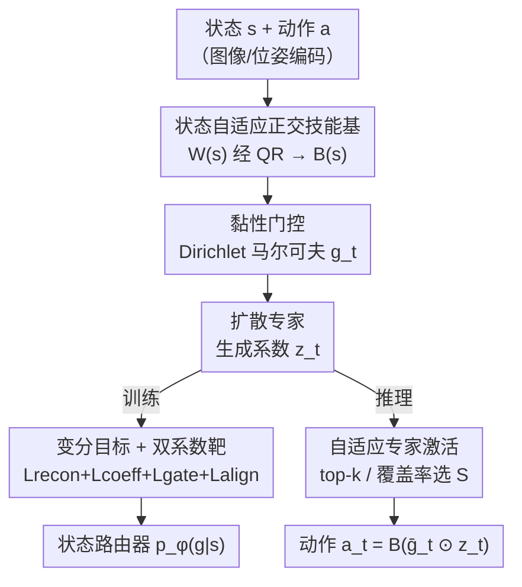

# Abstracting Robot Manipulation Skills via Mixture-of-Experts Diffusion Policies

**会议**: ICLR2026  
**OpenReview**: [https://openreview.net/forum?id=VSWjHIveqZ](https://openreview.net/forum?id=VSWjHIveqZ)  
**代码**: 待确认  
**领域**: 机器人 / 具身智能  
**关键词**: 扩散策略, 混合专家, 技能抽象, 双臂操作, 正交基

## 一句话总结
SMP（Skill Mixture-of-Experts Policy）把扩散策略的动作生成拆解到一组**状态自适应的正交技能基**上，用缓变的「黏性」门控只激活少数与当前阶段相关的专家，从而在中等模型规模下实现可复用、可迁移的多任务双臂操作，并把推理时的激活参数压到约自身的 30%（约为 RDT 的 7%），成功率反而高于大扩散基线。

## 研究背景与动机
**领域现状**：扩散策略（Diffusion Policy）把动作生成建模成去噪过程，在单任务机器人操作里成功率高、训练稳定，已经成为主流范式。要把它推广到多任务，社区的常见做法是「把网络做大」——靠 scaling law 让大模型在没见过的任务间插值。

**现有痛点**：单纯放大模型代价极高。一方面超大模型推理慢，难以满足实时控制；另一方面任务多样性上升时所需示范数据近乎指数增长。论文里 RDT 把参数堆到 DP 的 10×，多任务成功率却只涨了 19%，说明朴素扩容回报很低。

**核心矛盾**：要在「中等模型规模 + 低采样延迟」的约束下做多任务泛化。另一条路是技能抽象——从示范里抽出任务无关的可复用技能再跨任务重组，但已有方法各有短板：信息论的技能发现（DIAYN）和分层 RL 主要为稀疏奖励下的探索设计，不擅长操作技能抽象；近期把 MoE 接到扩散策略上的工作（Sparse Diffusion Policy）只是用小专家替换大前馈骨干，**并没有显式地解耦并表示可复用技能**，导致专家纠缠、门控频繁跳变、双臂角色不可解释。

**本文目标**：让策略学到「干净分离、相位一致、跨任务可复用」的技能，并在推理时只算需要的那几个专家。

**切入角度**：作者观察到无约束专家输出的混合是**不可辨识**的——很多不同的系数组合能复原出同一个动作，造成路由和训练不稳定。如果在每个状态下把每个技能映射到动作空间里一个互不重叠的方向，混合就变成可辨识、良条件的，专家的贡献天然可加。

**核心 idea**：在一个**局部白化（正交）的动作空间**里做技能抽象——用状态自适应的正交基 $B(s)$ 把动作分解成若干一维子空间，再配上缓变的黏性门控，让每个状态只稀疏激活几个技能。

## 方法详解

### 整体框架
SMP 要解决的是「多任务双臂操作下，怎么用不大的模型学到可复用、可迁移的技能并实时执行」。它的核心转变是：不再让一堆无约束专家自由叠加，而是把动作 $a_t\in\mathbb{R}^d$ 通过一个正交技能基 $B=[b_1,\dots,b_K]$ 解码，

$$a_t = B\,(g_t \odot z_t)$$

其中 $K\ll d$ 是技能数，$g_t\in\Delta^{K-1}$ 是门控（单纯形上的权重），$z_t\in\mathbb{R}^K$ 是每个技能的系数，$\odot$ 为逐元素积，且 $B^\top B = I_K$。因为基正交，第 $i$ 个技能只贡献子空间 $\mathrm{span}\{b_i\}$ 里的秩一向量 $b_i(g_{t,i}z_{t,i})$，各技能效果可加、梯度解耦。

训练时（图 2a）：原始观测先编码成状态特征，由一个轻量网络生成无约束矩阵 $W(s)$，经可微 QR 收缩投影到 Stiefel 流形得到状态自适应正交基 $B(s)$；门控由摊销后验 $q(g_t\mid s_t,a_t)$ 给出；系数 $z$ 由扩散专家生成；动作按 $\hat a_t=B(g_t\odot z_t)$ 重建，用重建、扩散、门控正则、路由对齐四项损失联合优化。同时蒸馏一个**只看状态**的路由器 $p_\phi(g_t\mid s_t)$ 供部署。推理时（算法 2）：查状态路由器估计每个专家的重要度，用 top-k 或覆盖率贪心选出一个紧凑活跃集 $S$，只对 $S$ 内的系数去噪，再解码出动作，实现稀疏低延迟控制。

### 关键设计

**1. 状态自适应正交技能基：用动随状态转动的正交坐标系消除专家的不可辨识性**

直接混合无约束专家会重叠：多种系数组合复原同一动作，路由与训练都不稳。SMP 的对策是在每个状态都构造一个正交坐标系，把每个技能钉在一个互不重叠的方向上，使各技能贡献可加、解混良条件。但机器人动作几何会随状态变化（臂位、接触），固定的全局基不够用，于是基本身做成状态相关 $B(s)$。具体地，先用轻量网络生成无约束 $W(s)\in\mathbb{R}^{d\times K}$，再用带符号稳定的可微薄 QR 收缩投影到 Stiefel 流形：

$$W(s)=\tilde B U,\quad D=\mathrm{diag}\big(\mathrm{sign}(\mathrm{diag}(U))\big),\quad B(s)=\tilde B D$$

其中 $\tilde B$ 是 QR 的正交因子，$U$ 上三角，$D$ 是消除列符号歧义的对角符号矩阵——它防止基向量在相邻状态间发生方向突然翻转，让 $B(s)$ 随 $s$ 连续演化。训练时把 $B(s)$ 当前向映射，更新 $W(s)$ 并通过自动微分反传过 QR 收缩。这样得到一个「随任务几何移动的正交标架」，配合门控提供相位一致性。从 MoE 角度看，这个解码器恰好是局部技能基里的加性 MoE：$a_t=\sum_i g_{t,i}b_i z_{t,i}$，第 $i$ 个专家就是秩一映射 $f_i=b_i z_{t,i}$，正交性保证各专家作用在一维子空间、梯度解耦，top-k 路由让混合稀疏。

**2. 黏性门控：让技能像「相位」一样缓慢切换而非逐步抖动**

操作过程通常经历准稳态的阶段（抓取、移动、放置），所以门控 $g_t$ 应该缓慢变化、而不是每步乱跳，同时又不能塌缩到极少数技能。作者把这一直觉形式化成「黏性」Dirichlet 马尔可夫动力学：

$$\vartheta\sim\mathrm{Dir}(\alpha\mathbf 1),\quad g_1\sim\mathrm{Dir}(\alpha_0\vartheta),\quad g_t\sim\mathrm{Dir}(\kappa g_{t-1}+\alpha_0\vartheta),\ t\ge 2$$

其中 $\vartheta$ 是刻画整体技能使用率的全局向量；$g_1$ 在 $\vartheta$ 附近采样；之后每个 $g_t$ 把「对上一时刻的持续性」与「向全局使用率的轻微拉力」混合。三个超参各司其职：$\kappa$ 控制时间黏性（越大段落越长越像相位），$\alpha_0$ 把过程锚向 $\vartheta$ 防退化，$\alpha$ 设定全局先验的弥散度（越大使用越均衡）。结果是分段常数的技能激活——既相位一致、又在任务间保持广泛但非均匀的利用，对应论文里观测到的「门控切换少、段落长、跨任务复用同一批专家」。

**3. 变分目标与双系数靶 + 状态路由器：在白化空间里给每个专家稳定监督**

SMP 用变分推断统一训练。把潜变量分成门控/全局使用率 $(\vartheta,g_{1:T})$ 与系数 $z_{1:T}$，对 ELBO 应用 Jensen 不等式得到三块：重建项 $\mathcal L_{recon}$、门控/全局使用正则 $\mathcal L_{gate}$、系数正则 $\mathcal L_{coeff}$。关键技巧在于**用两个系数靶分离「哪些梯度能回流到基 $B$」**：

$$\hat z^{sg}_{0,t}=\frac{\bar B^\top a_t}{\mathbb E_q[g_t]+\epsilon}\ (\text{停梯度，喂扩散}),\qquad \hat z^{rec}_{0,t}=\frac{B^\top a_t}{\mathbb E_q[g_t]+\epsilon}\ (\text{带梯度，回流 }B)$$

其中 $\bar B=\mathrm{sg}[B]$ 是停梯度副本。扩散代理损失 $\mathcal L_{coeff}=\mathcal L_{diff}(z;\hat z^{sg}_{0,1:T})$ 不会更新 $B$；而重建 $\mathcal L_{recon}=\frac{1}{2\sigma_a^2}\sum_t\|a_t-\hat a^{rec}_t\|_2^2$ 用带梯度的 $\hat z^{rec}_{0,t}$，让梯度经投影 $B^\top a_t$ 和解码 $B(\cdot)$ 回流到基。这样「动作一致性」和「逐专家的稳定系数监督」兼得，且只有重建项更新技能基。门控正则展开成全局使用、初始门、黏性门三个 KL 项；额外的对齐损失 $\mathcal L_{align}=\sum_t \mathrm{KL}\big(q(g_t\mid s_t,a_t)\,\|\,\mathrm{Dir}(\tilde\beta_\phi(s_t))\big)$ 把一个**只依赖状态**的路由器 $p_\phi(g_t\mid s_t)$ 对齐到训练期门控后验——这样部署时不用动作也能路由，与训练保持一致。

**4. 自适应专家激活：推理时只算少数重要专家**

在每个状态评估全部专家既贵又没必要，因为通常只有几个技能方向重要。部署时用状态路由器的均值 $\bar g_t=\mathbb E[g_t\mid s_t]$ 估计每个专家的重要度，在正交基下定义专家 $i$ 的质量 $m_i=\bar g_{t,i}^2$。给任意活跃集 $S$ 打分 $F(S)=\sum_{i\in S}m_i$；由于 $F$ 可加，最优集就是把专家按 $m_i$ 排序后取 (i) top-k，或 (ii) 满足覆盖率 $\frac{\sum_{i\in S}m_i}{\sum_j m_j}\ge\tau_m$（$\tau_m\in[0.9,0.95]$）的最短前缀。选定 $S_t$ 后只对 $z_{t,S_t}$ 去噪（其余置零），解码 $a_t=B(\bar g_t\odot z_t)$。这个简单的排序规则等价于对可加目标 $F$ 的贪心最大化，产出稀疏、状态相关的激活，在保精度的同时显著降推理成本——多个小专家还能并行去噪，而 FFN-MoE 每步要跨专家同步，加速有限。

### 一个完整示例
以双臂任务「把卡片放进抽屉」（图 1）为例走一遍：整段轨迹被门控自动切成 pick → adjust → reach → release 几个相位，每个相位只有少数专家亮起。开始抓卡时，pre-grasp 阶段组合「平移 + 旋转」专家做精确对齐（左臂的平移/旋转由一组专家稳定负责）；grasp 阶段交给「夹爪」专家；move/pre-release 主要调用「平移」专家把卡片送到抽屉口；release 阶段再由夹爪专家松开。门控随时间呈现稀疏、相位一致的激活——每步只有几个专家活跃，且左右臂、不同相位的角色在多个任务间被同一批专家复用（图 3 的 gate trace 印证了「切换少、段落长、跨任务复用」）。

### 损失函数 / 训练策略
总目标为 $\mathcal L_{\text{SkillMoE}}=\mathcal L_{coeff}+\mathcal L_{recon}+\mathcal L_{gate}+\mathcal L_{align}$。训练每轮（算法 1）：采一条轨迹 → 用符号稳定 QR 正交化 $B=\mathrm{qrf}(W)$ → 算摊销门控后验 → 构造停梯度/带梯度两个系数靶 → 用 DDPM 损失算 $\mathcal L_{coeff}$、用带梯度靶重建算 $\mathcal L_{recon}$ → 算门控正则与路由对齐 → 联合更新 $W$、扩散专家、摊销器与路由器。$\mathcal L_{coeff}$ 沿用标准 DDPM 的噪声预测损失。

## 实验关键数据

### 主实验
在两个双臂基准 RoboTwin-2（6 任务联合，跨臂技能复用）和 RLBench-2（4 任务紧耦合协作）上做多任务学习，每个结果在 100 个 episode 平均。

| 基准 | 指标 | SMP | 最强基线 | 说明 |
|------|------|------|----------|------|
| RoboTwin-2 | 平均成功率 | **0.54** | RDT 0.48 | SMP 高 6 个点，且参数活跃量远低于 RDT |
| RLBench-2 | 平均成功率 | **0.18** | RDT 0.17 | 紧耦合协作任务下仍领先 |
| RoboTwin-2 | DP / DP3 / ACT | 0.29 / 0.33 / 0.34 | — | 普通扩散/Transformer 在双臂多任务下欠拟合多模态分布 |

计算成本（全任务平均）：

| 方法 | 总参数 $N_p$(M) | 激活参数 $N_p^{act}$(M) | 推理时间 $T_{inf}$(ms) |
|------|------|------|------|
| DP | 132.5 | 132.5 | 120.3 |
| RDT | 1200 | 1200 | 183.1 |
| Sparse DP | 154.4 | 110.1 | 148.3 |
| **SMP (ours)** | 258.9 | **80.2** | **107.3** |

SMP 总参数虽不小，但推理时只激活约 30% 的自身参数（约 RDT 总量的 7%），激活参数与推理延迟都是表中最低，且多个小专家可并行去噪。

### 消融 / 迁移实验
论文没有标准 w/o 消融表，而是用迁移实验验证「干净分离的技能可重组」这一核心主张。

少样本迁移（RoboTwin-2 上对 4 个新任务各 10-shot 全量微调，100 episode 平均）：

| 配置 | Div. | Mic | Roller | Box | Avg. | 说明 |
|------|------|------|------|------|------|------|
| DP | 0.06 | 0.13 | 0.18 | 0.16 | 0.13 | 大骨干里旧行为仍是隐变量，10-shot 调不动 |
| RDT | 0.14 | 0.26 | 0.21 | 0.18 | 0.20 | 扩容也难少样本迁移 |
| Disc. Policy | 0.17 | 0.38 | 0.44 | 0.25 | 0.31 | 能复用部分离散码 |
| **SMP** | **0.22** | **0.49** | **0.49** | **0.31** | **0.38** | 只激活并微调相关专家，把 10-shot 数据集中到稀疏子集 |

技能组合（冻结专家与技能基、只微调路由器，10 demo/任务）：

| 配置 | Skillet-Fries | Bottle-Cab. | Avg. | 说明 |
|------|------|------|------|------|
| SDP | 0.11 | 0.38 | 0.25 | 层级门控耦合专家，路由微调难隔离技能 |
| **SMP** | **0.15** | **0.44** | **0.30** | 技能干净分离，仅更新路由器即可重组左右臂取放 |

### 关键发现
- **结构化技能确实学出来了**：左右臂行为由不同专家承担，轨迹自动组织成 pick / move / place 相位，move/pre-release 主要调平移专家、grasp/release 由夹爪专家负责、pre-grasp 组合平移+旋转做对齐——这些跨任务复用的模式是成功率提升的来源。
- **朴素扩容回报递减**：RDT 参数比 DP 大 10×，成功率只涨 19%，反衬出技能抽象路线的效率优势。
- **「只调路由器就能换任务」是最有说服力的证据**：在技能组合实验里冻结所有专家、仅微调路由器即可重组出新任务行为，说明 SMP 学到的是真正可复用的技能模块，而 SDP 的层级门控让专家跨扩散步耦合、路由微调无法隔离技能（出现犹豫的抓取、错位的放置）。
- **激活预算是一个清晰的精度-延迟旋钮**：加大激活预算重建略好但延迟上升，论文在验证集上选了平衡点。

## 亮点与洞察
- **把「MoE 的可解释性」做成几何性质**：用状态自适应正交基让每个专家钉在一维子空间，从根上消除无约束混合的不可辨识性——这比事后加正则去鼓励专家分化要干净得多，而且天然导出加性 MoE 的等价形式。
- **停梯度/带梯度双系数靶**很巧：同一份动作投影出两个靶，一个喂扩散（不污染基）、一个做重建（回流更新基），精准控制了「谁来更新技能基」，避免扩散损失把好不容易学到的正交结构带歪。
- **黏性 Dirichlet 门控**把「操作分相位」这一物理直觉直接写进先验，得到分段常数激活，既稳又省——这个先验设计可迁移到任何「行为分段、需要稀疏稳定路由」的序列控制任务。
- **训练用动作后验、部署用状态路由器**的蒸馏对齐，解决了扩散策略部署时拿不到动作还要路由的现实问题。

## 局限与展望
- 作者承认实验用的扩散骨干相对小、且只聚焦双臂操作，尚未验证在更大模型/数据集、单臂与移动操作上的表现。
- 缺少对黏性路由、自适应激活各超参（$\kappa$、$\alpha_0$、$\tau_m$、$k$）的系统消融，目前对「成功率-延迟」权衡的量化偏少，作者把这列为未来工作。
- 自定义指标如门控翻转率（flip-rate）、技能复用度在正文里多为定性描述，缺乏统一的数值表，读者难以横向复核（⚠️ 具体定义以原文 Appendix 为准）。
- RLBench-2 上整体成功率都很低（SMP 也只有 0.18），说明紧耦合协作仍是难点，绝对性能离实用尚远。

## 相关工作与启发
- **vs Sparse Diffusion Policy（FFN-MoE 扩散）**：两者都用 MoE，但 SDP 只是把大前馈骨干换成小专家、缺乏几何上的技能解耦，门控跨扩散步耦合、采样时频繁跳变引入动作抖动；SMP 在正交基里显式解耦技能、黏性路由让激活分段稳定，因此在精度任务和技能重组上都更好，且小专家可并行加速。
- **vs RDT（扩散基础模型）**：RDT 靠扩容追求泛化，参数 10× 于 DP 但少样本迁移仍差；SMP 走「学一次可复用技能、按需激活、快速适配」的路线，在更低激活成本下取得更高的多任务与迁移成功率。
- **vs Discrete Policy / DIAYN / 分层 RL**：DIAYN 等用互信息做无奖励技能发现、分层 RL 学时序扩展动作，主要面向稀疏奖励探索；SMP 面向从示范里高效抽象操作技能，且把技能落到连续正交动作子空间而非离散码本，重组更灵活。
- **vs SkillDiffuser 等扩散技能抽象**：同样追求可解释的技能，但 SMP 的创新在于「状态自适应正交基 + 黏性门控 + 自适应激活」三件套同时解决了可辨识性、相位稳定性和推理效率。

## 评分
- 新颖性: ⭐⭐⭐⭐⭐ 把技能抽象转成「状态自适应正交基 + 黏性 Dirichlet 门控」的几何/概率框架，思路自洽且少见。
- 实验充分度: ⭐⭐⭐⭐ 仿真+真机、多任务+两类迁移覆盖到位，但缺核心超参的系统消融，部分自定义指标只给定性。
- 写作质量: ⭐⭐⭐⭐ 方法推导清晰、动机层层递进；个别记号（双系数靶、门控正则）较密，需要对照公式细读。
- 价值: ⭐⭐⭐⭐⭐ 给「中等模型规模下做可迁移多任务操作」提供了一条实用且可解释的路径，对实时双臂控制有直接意义。

<!-- RELATED:START -->

## 相关论文

- [\[ICLR 2026\] Contractive Diffusion Policies](contractive_diffusion_policies.md)
- [\[ICLR 2026\] M³E: Continual Vision-and-Language Navigation via Mixture of Macro and Micro Experts](m3e_continual_vision-and-language_navigation_via_mixture_of_macro_and_micro_expe.md)
- [\[CVPR 2026\] REACH: Explicit Recovery Behavior for Diffusion Policies](../../CVPR2026/robotics/reach_explicit_recovery_behavior_for_diffusion_policies.md)
- [\[ICML 2026\] From Imagined Futures to Executable Actions: Mixture of Latent Actions for Robot Manipulation](../../ICML2026/robotics/from_imagined_futures_to_executable_actions_mixture_of_latent_actions_for_robot_.md)
- [\[ICML 2026\] Online Self-Training for Co-Adaptation in Hierarchical Diffusion Policies](../../ICML2026/robotics/online_self-training_for_co-adaptation_in_hierarchical_diffusion_policies.md)

<!-- RELATED:END -->
