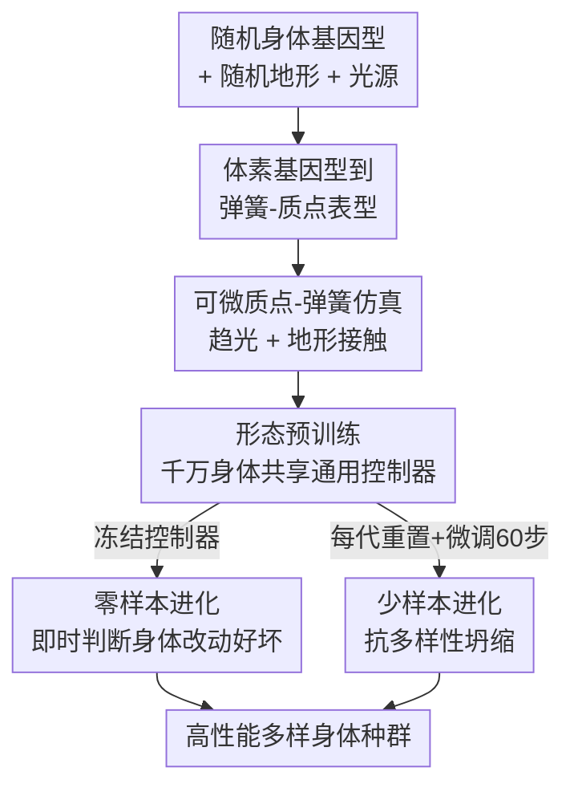

# Accelerated co-design of robots through morphological pretraining

**会议**: ICLR2026  
**OpenReview**: [https://openreview.net/forum?id=WVliGyFwZv](https://openreview.net/forum?id=WVliGyFwZv)  
**代码**: 项目网站提供视频与代码（论文末页链接）  
**领域**: 机器人 / 形态-控制协同设计  
**关键词**: 协同设计, 可微仿真, 形态预训练, 通用控制器, 进化算法

## 一句话总结
本文提出"形态预训练"：先用可微仿真把一个与形态无关的通用控制器在上千万个机器人身体上一次性训练好，再用这个冻结的控制器零样本（或少量微调）评估任意身体改动的好坏，从而把机器人"身体+大脑"协同设计的速度提升一个数量级，同时首次让进化里的"杂交重组"真正产出比父代更优的后代。

## 研究背景与动机
**领域现状**：机器人协同设计（co-design）要同时优化身体形态（morphology）和神经控制器（control）。主流做法是用强化学习（RL）为每一个候选身体单独学一个控制策略，因为每换一个形态，控制策略的梯度就完全不同。

**现有痛点**：RL 在不可微仿真里逼近控制策略需要海量交互数据；而进化过程中形态不断变化，每变一次就要重新学一个控制器，代价叠加爆炸。结果三十年来这个方向几乎停滞——绝大多数工作只能在"少于一打部件的刚性火柴人"上探索几千个形态，软体机器人虽然部件多但电机少、几乎没有感知智能，很多还被限制在二维世界里。

**核心矛盾**："为每个身体单独学控制器"这件事本身就是瓶颈：它让形态搜索（外层、离散、不可微）和控制学习（内层、需要大量数据）嵌套耦合，外层每走一步都要付内层一整轮训练的代价。更隐蔽的是，如果硬要"同时从零协同学一个通用控制器"，种群会发生**多样性坍缩**（diversity collapse）——所有个体收敛成相似身体，因为相似身体更容易被同一个共享控制器驾驭，协同设计退化成"给单一设计训控制器"。

**本文目标**：(1) 让控制器对形态"免疫"，一次训练后无需为新身体重训；(2) 因此能即时评估增删、重组身体部件这类不可微改动的好坏；(3) 解决/利用多样性坍缩，让进化既高性能又保持形态多样。

**切入角度**：借鉴 CV/NLP 大规模预训练的成功经验——既然语言模型能在海量语料上预训练出通用能力，控制器为什么不能在海量身体上预训练出"通用驾驶能力"？关键钥匙是**可微仿真**：它直接给出控制器参数的梯度，让"在上千万个身体上平均梯度"这件事变得可行，而 RL 因为缺梯度信息做不到这种规模。

**核心 idea**：用可微仿真把一个与形态无关的通用控制器预训练在 1000 万+ 身体上得到"先验大脑"，之后把它冻结来做**零样本进化**（直接判断身体改动好坏），或每代微调几十步做**少样本进化**，从而把控制学习从形态搜索的内循环里彻底解耦出去。

## 方法详解

### 整体框架
方法分三大块串起来：先在一个统一的"身体空间→物理实体→可微环境"管线里定义机器人怎么编码和被仿真；然后在上千万随机身体、随机地形、随机光源上**预训练**一个共享的通用 MLP 控制器，使其学会驱动几乎任意形态朝光源移动（趋光性 phototaxis）；最后把这个控制器当先验，用一个普通遗传算法演化身体种群——冻结控制器就是**零样本进化**，每代重置并微调 60 步就是**少样本进化**。整条管线的输入是"随机身体基因型 + 随机环境"，输出是"一群高性能且多样的进化后身体 + 一个能统一驾驶它们的控制器"。

### 关键设计

**1. 体素基因型到弹簧-质点表型：让"身体"既离散可进化又可微可仿真**

身体被编码成 $6\times6\times4$ 的二值体素基因型 $G$，每个被占用的体素映射成物理表型 $P$ 里一个 $10\,\text{cm}^3$ 立方单元——八个角各放一个质点（mass），单元棱上和面对角线上连弹簧（spring），相邻体素共享接口处的质点和弹簧，保证连通的基因型映射成内聚的弹簧-质点网络。整个 $6\times6\times4$ 工作空间最多容纳 $|M|=245$ 个质点位、$|S|=1648$ 根弹簧。这套设计的巧妙在于把矛盾的两面缝合到一起：基因型层面是**离散的、可做位翻转/异或重组的**（适合进化），表型层面是**连续的弹簧-质点物理体**（适合可微仿真）。作者还对基因型定义了考虑平移和对称（绕 z 轴 90° 旋转、x/y 轴镜像）的等价关系，用字典序最小形式去重，避免把同一个身体当成多个。

**2. 形态无关的通用控制器：用输入/输出掩码把"任意身体"塞进同一个 MLP**

控制器是个朴素 MLP（输入 250 维 = 245 质点光感 + 5 路 CPG 中央模式发生器正弦波，三层 256 隐藏层，输出 1648 维对应所有弹簧，共 620,912 参数）。难点是不同身体的传感器/电机数量都不同，怎么共用一个网络？做法是把输入维设成最大质点数 $|M|$、输出维设成最大弹簧数 $|S|$，**某个身体没有的传感器/电机就把对应信号掩码成 0**——这通过观测空间和动作空间的 masking 提供了一种"隐式形态条件化"，网络从"哪些通道是活的"里就读到了身体结构。光感读数还会减去该身体所有活跃传感器的均值，给出一个零中心、具身的辐照度梯度（embodied irradiance gradient）。弹簧按胡克定律 $F=k(L-L_0)$ 出力，静止长度 $L_0$ 可在初值 $\pm20\%$ 间被驱动。

**3. 大规模形态预训练：可微仿真上跨千万身体平均梯度**

控制器在 1000 万+ 不同身体上预训练 1400 步，每个样本 = 一个随机身体 + 一个随机地形 + 一个随机光源，且**只见一次**。优化目标是最小化批均值 $d_1/d_0$，其中 $d_0$、$d_1$ 是机器人到目标光源的初始与最终距离——这种相对距离形式既不惩罚初始离得远的个体，又同样激励初始离得近的个体做精细控制。仿真用 Taichi 实现，对 1000 步物理（$dt=0.004\text{s}$）端到端反向传播，把控制器梯度跨身体、世界、目标三种变化做平均（8 张 H100、batch 8192）。这正是 RL 做不到的：因为有解析梯度，才能在如此大规模上"一次性"学出通用驾驶能力，57 分钟收敛、损失从 1.0 降到约 0.3（即平均走完到光源初始距离的 70%）。

**4. 零样本 / 少样本进化：把控制学习从形态搜索的内循环里解耦**

有了预训练控制器作先验，进化变成纯粹的身体搜索。**零样本进化**：冻结控制器，用普通遗传算法演化 8192 个体——25% 做位翻转变异（翻转概率 $p=1/N,\ N=6\times6\times4$）、75% 做基因型异或（XOR）**重组（crossover）**，后处理只保留最大连通分量并居中落地，每代评估后取父代+子代前 50%。因为控制器不变，任何身体改动的好坏可以**立刻**判断，不用为新身体重训。但零样本会落进多样性坍缩——进化只会堆出"最合预训练模型胃口"的近亲克隆。**少样本进化**针对性地解决它：每代开始把控制器权重**重置回预训练值**、重置优化器，再对当前种群微调 60 步（父代 30、子代 30）。这个"每代重置+轻微调"出人意料地不仅保住多样性，反而**显著提升**多样性同时拿到更优性能——因为控制器被持续拉回去适配"当前真实种群"，而不是反过来让种群去迁就一个固定控制器。作为对比基线的**同时从零协同设计**（Li et al. 2025 的算法，跨代继承而非重置控制器、每代只训 2 步）则照样坍缩，证明坍缩的根源正是"让种群迁就控制器"。

### 损失函数 / 训练策略
预训练损失为相对距离比 $d_1/d_0$ 的批均值；优化用 Adam（$\beta_1=0.9,\beta_2=0.999$，梯度范数裁剪 1.0），学习率用带重启的余弦退火（初始 $1\mathrm{e}{-3}$、最小 $1\mathrm{e}{-5}$、周期从 10 步起每次重启翻倍、每周期起始学习率乘衰减 0.7）。少样本微调用初始/最小 $3.5\mathrm{e}{-4}/3.5\mathrm{e}{-5}$、周期 100 但截断到 60 步（有效最小 $1.5\mathrm{e}{-4}$），因每代都重置预训练权重故周期起始不再衰减。同时协同设计基线把起始衰减从 0.7 调到 0.65 以稳住跨周期重启。

## 实验关键数据

### 主实验
三种协同设计范式的性能与多样性对比（多样性 = 基因型空间上归一化的种群平均成对汉明距离）：

| 范式 | 是否预训练 | 收敛代数/时间 | 性能 | 多样性 |
|------|-----------|--------------|------|--------|
| 形态预训练 | — | 1400 步 / 57 min | 损失 1.0→0.3（提升 70%） | 覆盖大量异质身体 |
| 零样本进化 | 是（冻结） | 100 代 / 17 min | 快速接近最优 | 坍缩（趋同近亲克隆） |
| 少样本进化 | 是（每代重置微调 60 步） | 约 18 代 / 53 min | 最优且持续提升 | 显著上升并维持 |
| 同时协同设计（基线 Li et al. 2025） | 否 | <180 代 / 109 min（360 训练步） | 训练损失相近 | 快速坍缩 |

关键对照：少样本进化在第 6 代（G6）、零样本在第 31 代（G31）的平均损失就已追平/超过同时协同设计跑到第 180 代（G180）的结果。

### 消融实验
"同时从零协同设计"本质就是去掉预训练（和微调）的消融，用来隔离预训练的作用：

| 配置 | 性能 | 多样性 | 说明 |
|------|------|--------|------|
| 少样本（完整） | 最优 | 显著提升并维持 | 预训练 + 每代重置微调 |
| 零样本（去微调） | 快速接近最优 | 坍缩 | 仅预训练、控制器冻结 |
| 同时协同（去预训练+去微调） | 较慢、需 G180 才追平 | 快速坍缩 | 对应 Li et al. 2025 |

### 关键发现
- **多样性坍缩是协同设计的内在病理**：只要让种群去迁就一个共享控制器（冻结或同时从零学都算），进化就会塌成单一物种；本文首次命名并刻画了它。
- **"每代重置+微调"是解药**：让控制器反过来适配当前种群，多样性不靠任何显式选择压就自发升高——这是相当反直觉的正面结果。
- **预训练控制器解锁了真正有效的杂交重组**：因为冻结控制器从一开始就很强，零样本里观察到的后代变好可明确归因于身体重组本身，而非控制器在偷偷变强——这是机器人进化里"重组产生优于父代后代"长期缺乏的确凿证据（图 5：父代损失 0.257/0.593 → 后代 0.073）。
- **强鲁棒与跨任务泛化**：平均失效 1/4 电机、半数以上传感器仍保功能；把连续地形换成离散平台、把趋光换成趋磁（磁感受器+磁场），零样本进化都能不微调地重塑身体去适配新分布并超过预训练性能。
- **涌现新步态**：通用控制器没学成走路/慢行，而是发现了类似袋鼠的**跳跃（saltation）**——协调肌肉发力后进入腾空相，和为单一身体定制的步态明显不同。

## 亮点与洞察
- **把"预训练范式"搬进机器人协同设计**：核心洞见是"换身体重训控制器"才是三十年瓶颈，而可微仿真让"一次预训练通吃千万身体"成为可能——这是 RL 路线因缺梯度根本做不到的规模，思路本身可迁移到任何"外层离散搜索套内层昂贵训练"的问题。
- **掩码即形态条件化**：用输入/输出 masking 把任意身体塞进同一个固定维度 MLP，简洁到几乎"作弊"，却让一个 62 万参数的朴素 MLP 驾驭上千个复杂身体，提示很多"必须为每个实例定制网络"的场景其实可以共享主干 + 掩码。
- **发现并命名一个新病理再给出解法**：多样性坍缩 + "每代重置微调"这一对"问题-解药"是本文最有"啊哈"感的部分，且解法极轻量（只是每代把权重拉回预训练值）。
- **"控制器适配种群"vs"种群适配控制器"的方向性**：谁迁就谁决定了多样性的存亡，这个视角可迁移到任何共享模型 + 演化群体的设定（如群体机器人、population-based training）。

## 局限与展望
- **作者承认**：只考虑了单一材料（软体）、单一感知（光）、单一执行器（线性弹簧）、单一任务（趋光地面移动）；扩展到多任务/多材料/多模态感知（操作物体、与他机协作）可能需要逐步复杂化网络架构、并用潜在基因组（latent genome）替代直接的基因型-表型映射。
- **未做 sim-to-real**：仿真设计未迁移到真实机器人，可能需要更高分辨率仿真或改进接触/光/感知模型、加噪防止策略钻仿真漏洞；不过作者认为通用控制器对身体/世界变化本就不敏感，或有助于缩小 sim-real gap。
- **多样性度量单一**：只用了基因型汉明距离一种形态多样性指标，行为层面或潜在空间的其他多样性度量尚未探索，也可作为约束/额外目标纳入算法。
- **依赖可微仿真**：整套方法要求有（或能造出）可微仿真器，对操作类、流体/空中等更复杂接触场景未必总可行，单一通用控制器驾驭多样末端执行器形态甚至可能不可解。

## 相关工作与启发
- **vs 同时从零协同设计（Li et al. 2025）**：他们跨代继承控制器、同时学身体和大脑；本文先大规模预训练再冻结/重置微调。区别在于"谁适配谁"——前者让种群迁就控制器导致坍缩，本文让控制器适配种群从而保多样、且把控制学习从形态内循环解耦，G6/G31 即追平对方 G180。
- **vs RL 通用控制器（MetaMorph/Huang et al./Gupta et al. 等）**：他们用 RL 在小规模已设计或同时协同的形态集上逼近通用策略，但 RL 缺梯度信息无法做大规模预训练；本文靠可微仿真的解析梯度把预训练扩到千万身体量级。
- **vs 可微仿真协同设计（Strgar et al. 2024 等）**：前人也用可微仿真一阶梯度加速协同设计，但仍要为每个形态学定制控制器、行为也只是直线移动；本文产出单一形态无关控制器，支持自适应、传感引导的复杂行为，并把 2D 质点-弹簧仿真扩展到带外感受（光）的 3D。

## 评分
- 新颖性: ⭐⭐⭐⭐⭐ 把预训练范式引入机器人协同设计，并发现/命名+解决"多样性坍缩"，思路开辟新方向
- 实验充分度: ⭐⭐⭐⭐ 三范式对照 + 预训练消融 + 失效/跨地形/跨任务鲁棒性，但全为仿真、无真实迁移
- 写作质量: ⭐⭐⭐⭐⭐ 动机-方法-结果逻辑清晰，图示与机制叙述到位
- 价值: ⭐⭐⭐⭐⭐ 把"换身体重训控制器"这一三十年瓶颈一举打通，规模与效率提升显著，且方法论可迁移

<!-- RELATED:START -->

## 相关论文

- [\[CVPR 2026\] Spatial-Aware VLA Pretraining through Visual-Physical Alignment from Human Videos](../../CVPR2026/robotics/spatial-aware_vla_pretraining_through_visual-physical_alignment_from_human_video.md)
- [\[ICLR 2026\] Disentangled Robot Learning via Separate Forward and Inverse Dynamics Pretraining](disentangled_robot_learning_via_separate_forward_and_inverse_dynamics_pretrainin.md)
- [\[ICLR 2026\] MetaVLA: Unified Meta Co-Training for Efficient Embodied Adaptation](metavla_unified_meta_co-training_for_efficient_embodied_adaptation.md)
- [\[ICLR 2026\] BOLT: Decision‑Aligned Distillation and Budget-Aware Routing for Constrained Multimodal QA on Robots](bolt_decisionaligned_distillation_and_budget-aware_routing_for_constrained_multi.md)
- [\[ICLR 2026\] Virtual Community: An Open World for Humans, Robots, and Society](virtual_community_an_open_world_for_humans_robots_and_society.md)

<!-- RELATED:END -->
