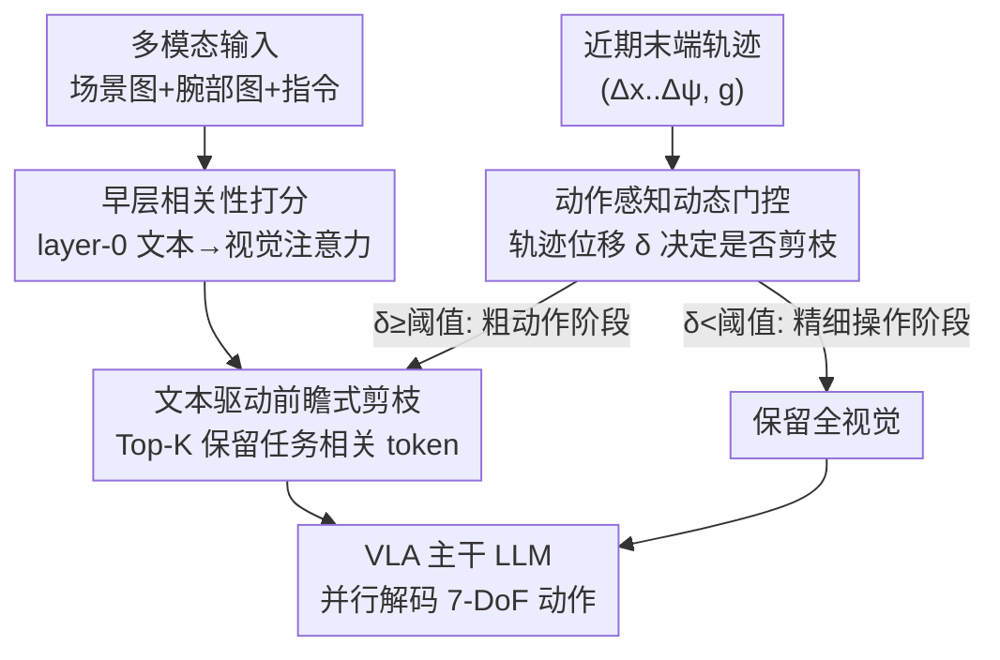

# Action-aware Dynamic Pruning for Efficient Vision-Language-Action Manipulation

**会议**: ICLR 2026  
**OpenReview**: [https://openreview.net/forum?id=ea6j8k8Rnw](https://openreview.net/forum?id=ea6j8k8Rnw)  
**代码**: 待确认（论文标注 Project 页可用）  
**领域**: 机器人 / 具身智能 / VLA 效率  
**关键词**: VLA 模型, 视觉 token 剪枝, 动作感知, 推理加速, 机器人操作

## 一句话总结
针对 VLA（视觉-语言-动作）模型推理时视觉 token 太多、算力被注意力吃光的问题，本文提出 ADP（Action-aware Dynamic Pruning）：用文本相关性挑出任务相关的视觉 token 做前瞻式剪枝，再用机器人末端执行器的近期运动幅度当门控信号——粗动作阶段（位移大）激进剪枝省算力、精细操作阶段（位移小）恢复全视觉保精度，在 LIBERO 上把 OpenVLA-OFT 加速到 1.35× 而成功率几乎不掉，真机延迟降到 1.49×。

## 研究背景与动机
**领域现状**：主流 VLA 流程是「视觉编码器产出稠密视觉 token → projector 对齐到语言空间 → LLM 融合多模态并自回归（或并行）生成机器人动作」。一帧往往有场景相机 + 腕部相机两路图像，编码后视觉 token 数量很大，远多于文本和动作 token。

**现有痛点**：这些视觉 token 里很多与当前操作只是弱相关，却实打实地拉长了输入序列，推高了 FLOPs、显存和延迟，还会稀释注意力对真正关键线索的关注。已有加速工作分两类：训练相关的轻量化/结构化剪枝（RoboMamba、DeeR-VLA、Mole-VLA）和免训练的缓存复用 / 注意力剪枝（VLA-Cache、EfficientVLA、FastV）。

**核心矛盾**：这些方法几乎都用「单层启发式」或「静态规则」对所有时间步一刀切地剪枝，忽视了机器人操作各阶段的冗余度并不一样。本文的关键观察是：**视觉冗余是「动作感知」的**——在粗粒度阶段（如搬运、移动），全局位移主导、局部细节不重要，token 可以大胆剪；而在精细阶段（如抓取、对齐），局部几何和细节决定成败，剪多了就失败，且误差会累积传播导致整条任务崩盘。静态规则要么剪太少（省不了多少），要么剪太多（掉精度），在多视角场景下尤其糟。

**本文目标**：让剪枝同时对「指令语义」和「即时动作状态」敏感——既挑对 token，又在对的时机决定剪不剪。

**切入角度**：视觉 patch 的相关性不仅由文本条件决定（指令语义），还由动作条件决定（末端执行器的瞬时运动和夹爪状态）。运动幅度本身就是一个免费的、能区分粗/精阶段的信号。

**核心 idea**：用「文本驱动选 token」+「轨迹运动幅度当门控开关」组合成即插即用的动态剪枝——大动作时剪、小动作时不剪。

## 方法详解

### 整体框架
ADP 是一个挂在 VLA 主干 LLM 之前的即插即用模块，整体走两条并行的判断链：一条是**内容选择**——在多模态序列进入 LLM 之前，用文本对视觉 token 算相关性，只保留最相关的一批；另一条是**时机控制**——读取机器人近期末端轨迹的运动幅度，决定这一步「到底要不要剪」。两条链汇合后，要么把剪枝后的短序列喂给 LLM（省算力），要么保留全视觉序列（保精度），LLM 再并行解码出 7 自由度动作。剪枝发生在 embedding 阶段、LLM 之前，所以缩短的序列对全部 Transformer 层都受益。

### 关键设计

**1. 文本驱动的前瞻式剪枝：让指令来挑视觉 token**

痛点是稠密视觉 token 里大量与当前指令无关，既费算力又分散注意力。ADP 的做法是在 token 进入 LLM 深层融合之前，就用文本去给视觉 token 打「相关性分」。具体地，取某一层隐状态 $H^{(l)}$，拆成视觉子集 $H^{(l)}_{vis}$ 和文本子集 $H^{(l)}_{txt}$，用投影矩阵得到文本的 query 和视觉的 key：$Q^{(l)}=H^{(l)}_{txt}W^{(l)}_Q$，$K^{(l)}=H^{(l)}_{vis}W^{(l)}_K$，算缩放点积相似度 $A^{(l)}=Q^{(l)}(K^{(l)})^\top/\sqrt{d}$，每一项衡量「某个文本 token 对某个视觉 patch 的关注度」。再对所有注意力头和所有文本 query 取平均，得到每个视觉 token 的全局重要性分：

$$\Phi^{(l)}(v)=\frac{1}{N_h\cdot L_{txt}}\sum_{h=1}^{N_h}\sum_{t=1}^{L_{txt}}A^{(l)}_{h,t,v}$$

然后按比例 $\rho$ 做 Top-K 保留：$k=\lfloor\rho\cdot L_{vis}\rfloor$。被丢掉的 patch 直接从序列里移除，剩下的 token 再与 `[BOS]`、文本、本体感知、动作占位等拼回去喂给 LLM。多视角场景下（场景相机 + 腕部相机各贡献一部分 patch），用权重向量 $\alpha$（$\sum_c\alpha_c=1$）把保留配额分配到各视角，$k_c=\lfloor\alpha_c\cdot k\rfloor$，实测主相机:腕部相机用 4:6——这让剪枝在两路相机间按重要性不均匀分配，而不是各砍一半。「前瞻式（anticipatory）」指的是这一步在深层融合发生**之前**就裁掉冗余，节省波及全部 Transformer 层。

**2. 动作感知的动态门控：用运动幅度决定剪不剪**

光会挑 token 还不够——并非每个阶段都适合只靠剪枝后的稀疏集合，精细操作时丢了局部细节会直接失败、误差还会累积。这一设计的核心是把「机器人在干粗活还是细活」量化成一个标量门控信号。把每个解码出的动作 chunk 当成一个时间窗 $[b_i,e_i]$，窗内每步动作 $a^c_{i,u}=[\Delta x,\Delta y,\Delta z,\Delta\phi,\Delta\theta,\Delta\psi,g]^\top$ 包含平移、旋转增量和夹爪指令。通过窗内前向运动学把这些增量积分成末端执行器轨迹位置 $p_t$，再算窗内的欧氏位移总和作为该窗的运动幅度：

$$\delta_i=\sum_{t=b_i}^{e_i-1}\lVert p_{t+1}-p_t\rVert_2$$

有了 $\delta_i$ 就定义二值状态 $s_i\in\{0,1\}$（0=全视觉、1=剪枝），用阈值规则切换。最朴素的是「跑动均值」规则：$s_{i+1}=1$ 当 $\delta_i\ge\bar\delta_i$，否则 0，其中 $\bar\delta_i=\frac{1}{i}\sum_{j=1}^i\delta_j$ 是历史平均运动尺度。论文实际采用更灵敏的**相邻极值规则**：取最近 $\tau$ 个窗的最大值 $U^{(i)}$ 和最小值 $V^{(i)}$，$\delta_i\ge U^{(i)}$ 则剪、$\delta_i\le V^{(i)}$ 则全视觉、落在中间则沿用上一个状态 $s_i$，从而能快速响应局部粗/精切换。直觉很干净：大幅运动 = 粗操作 = 冗余多 = 剪枝省 FLOPs；运动幅度下降 = 进入精细操作 = 保留完整视觉。为防误差累积，还加了几条稳定性约束：**冷启动**（前两个窗强制全视觉）、**连续剪枝熔断**（连剪三个窗后下一窗强制全视觉）、以及在相邻极值规则的「中间档」实现里把状态确定性置 1 以进一步省 FLOPs。

**3. 早层（layer-0）打分：相关性信号在浅层反而更干净**

一个反直觉但关键的选择是：重要性分 $\Phi$ 在**第 0 层**算，而不是大家默认的深层。常识认为文本-视觉对齐集中在深层多模态层、应该去那里取相关性，但本文测量发现并非如此（尤其对并行解码 VLA）。可视化显示 layer-0 的视觉自相似矩阵呈现清晰的高对比块状结构，文本→视觉子矩阵在很多视觉 token 上有明显的峰谷、信噪比高；而越深的层越趋于对角带状，把非局部相关性压没了，token 重要性曲线变得尖锐并出现长尾甚至塌缩，使 Top-K 排序对局部噪声更敏感。消融（Table 3b）也证实 layer-0 给出最佳精度-算力平衡（96.3% / 6.43 FLOPs，优于 layer-1 的 95.5%、layer-4 的 95.8%），且越深 FLOPs 越高。所以在第 0 层一次性打分、一次性剪枝，既准又省。

### 损失函数 / 训练策略
ADP 是**免训练（training-free）**的即插即用推理期方法，不引入额外可学习参数、不需要重训 VLA 主干，只在 embedding 阶段插入打分 + 门控逻辑。论文给了复杂度分析：单层 Transformer FLOPs 近似 $F(S;D,M)\approx 2S^2D+8SD^2+6SDM$，剪枝把序列从 $S$ 缩短到 $S'=1+k+L_{prop}+L_{txt}+L_{act}+1$，打分本身的开销 $F_{score}=2L_{txt}D^2+2L_{vis}D^2+2N_hL_{txt}L_{vis}d$ 相对轻量。设一次任务执行共 $T$ 次前向、其中比例 $\gamma$ 走剪枝路径，则期望复杂度 $E[F_{episode}]=T(\gamma F_{ADP}+(1-\gamma)F_{base})$，期望节省 $E[\Delta F_{episode}]=T\gamma\Delta F_{ADP}$。

## 实验关键数据

### 主实验
在 LIBERO 四个 suite（Spatial / Object / Goal / Long）上，基座是 OpenVLA-OFT（7B，并行解码）。ADP 通过调节保留比例 ρ 在精度和算力间平滑取舍：

| 方法 | 保留比 | 平均 SR | FLOPs↓ | 加速↑ |
|------|--------|---------|--------|-------|
| OpenVLA-OFT（base） | 100% | 97.1% | 7.91 | 1.00× |
| FastV(+OFT) | — | 86.8% | 6.37 | 1.24× |
| VLA-ADP | 30% | 94.4% | 5.85 | 1.35× |
| VLA-ADP | 40% | 94.8% | 6.14 | 1.29× |
| VLA-ADP | 50% | 96.3% | 6.43 | 1.23× |
| VLA-ADP | 70% | 96.3% | 7.03 | 1.13× |

保留比 50–70% 时平均成功率仅掉 ≤0.9% 却已有最高 1.23× 提速；压到 30–40% 仍保住 94.4–94.8%、拿到 1.29–1.35× 加速。对比之下同等保留的 FastV 平均只有 86.8%（Long 任务从 94.8% 暴跌到 73.0%），随机丢弃 50% 在 Object/Long 上只有 73.0%/76.2%——说明 ADP 的「挑得准 + 剪得对时机」确实有效。

真机实验（Jaco2 平台，pick/place/wipe 四个任务）：

| 方法 | 平均 SR | 延迟↓ | 加速↑ |
|------|---------|-------|-------|
| OpenVLA-OFT（base） | 85.8% | 76.9 | 1.00 |
| VLA-ADP（ours） | 88.3% | 51.8 | 1.49× |

真机上不仅没掉、反而把成功率从 85.8% 提到 88.3%，延迟降到 1.49×。

### 消融实验

| 配置 | 平均 SR | ρavg | FLOPs↓ | 说明 |
|------|---------|------|--------|------|
| ADP（完整） | 96.3% | 0.22 | 6.43 | 文本剪枝 + 动作门控 |
| w/o D | 93.45% | 0.25 | 6.23 | 去掉动态门控（静态剪枝） |
| w/o D + PS | 89.9% | 0.50 | 4.55 | 换成手工周期切换 |

### 关键发现
- **动态门控是核心**：去掉它（w/o D）平均掉 2.85 个点而算力几乎不变；换成手工周期切换（w/o D + PS）更差，Object 任务暴跌到 81.4%（ADP 是 98.0%，+16.6 点），说明「按运动状态自适应切换」比「固定周期循环」关键得多——前者能在精细操作时避免过度剪枝。
- **早层打分最优**：layer-0 给出最佳精度-算力平衡（96.3% / 6.43 FLOPs），越深的层 FLOPs 越高且 SR 略降，印证了「深层注意力过度局部化、对噪声更敏感」的分析。
- **粗/精阶段冗余度确实不同**：Spatial 这种相对简单的空间操作场景下 ADP 拿到 99.4% 成功率，说明它在简单场景能大胆剪冗余、同时保住关键信息。

## 亮点与洞察
- **把「机器人在干什么」直接变成剪枝信号**：用末端执行器轨迹位移当门控开关，这是非常机器人本位的洞察——视觉冗余度和动作动力学强相关，运动幅度是免费且物理可解释的「粗/精阶段探测器」，比纯靠注意力分数判断更稳。
- **反直觉的早层打分**：挑战了「文本-视觉对齐在深层」的常识，用可视化和消融论证 layer-0 的相关性信号信噪比反而最高，既省算力又更准，这个发现本身可迁移到其他多模态剪枝场景。
- **完全免训练、即插即用**：不动主干权重、不需重训，挂上去就能给现成 VLA 提速，工程落地成本极低。
- **稳定性工程细节扎实**：冷启动 + 连续剪枝熔断 + 多视角 4:6 配额，这些小约束专门对付「精细阶段误差累积」这一机器人操作的致命问题。

## 局限与展望
- **门控规则偏手工**：阈值用跑动均值或相邻极值，$\tau$、冷启动窗数、连剪熔断阈值都是手调超参，换平台/换任务可能要重调；运动幅度只用了平移欧氏位移，旋转和夹爪状态没显式进门控（虽然轨迹积分用到了）。
- **依赖动作可微/可积分**：门控建立在能从动作 chunk 积分出末端轨迹之上，对非 7-DoF 笛卡尔增量参数化、或动作语义不同的 VLA 需要改造前向运动学定义。
- **加速幅度受限于剪枝位置**：剪枝只在 LLM 前的视觉 token 上做，加速主要来自序列变短；视觉编码器和 projector 的开销没碰，FLOPs 下限受此约束（base 7.91 → 最激进 5.85）。
- **评测规模**：真机只有 4 个任务、模拟集中在 LIBERO，更长程、更高自由度或双臂场景下「运动幅度判粗/精」是否依然成立有待验证。

## 相关工作与启发
- **vs EfficientVLA / FastV**：它们也靠注意力分数剪视觉 token，但用单层启发式 + 静态规则，对所有时间步一刀切；ADP 的区别是加了「动作感知的动态门控」，按操作阶段自适应开关剪枝，因此在 Long 这类长程任务上不像 FastV 那样崩（73.0% → 84.2%+）。
- **vs VLA-Cache**：VLA-Cache 靠复用相邻步的 KV 缓存省算力，是「时间维度复用」；ADP 是「空间维度选择 + 时机门控」，两者正交，理论上可叠加。
- **vs DeeR-VLA / Mole-VLA / RoboMamba**：这些是训练相关的结构化剪枝 / 条件层激活 / 架构轻量化，要重训或改架构；ADP 完全免训练、即插即用，部署成本更低，但加速上限也更受限于不动主干。

## 评分
- 新颖性: ⭐⭐⭐⭐ 「视觉冗余是动作感知的」这一观察 + 用末端轨迹当门控信号是新颖且物理直觉强的切入点。
- 实验充分度: ⭐⭐⭐⭐ LIBERO 全 suite + 真机 + 多比例/分量消融齐全，但真机任务数偏少、基座集中在 OpenVLA-OFT。
- 写作质量: ⭐⭐⭐⭐ 动机-观察-方法链条清晰，复杂度分析和可视化到位；部分公式排版（如旋转复合）需对照原文。
- 价值: ⭐⭐⭐⭐ 免训练即插即用、真机 1.49× 加速且成功率不降，对 VLA 实时部署有直接实用价值。

<!-- RELATED:START -->

## 相关论文

- [\[ICML 2026\] SpecPrune-VLA: Accelerating Vision-Language-Action Models via Action-Aware Self-Speculative Pruning](../../ICML2026/robotics/specprune-vla_accelerating_vision-language-action_models_via_action-aware_self-s.md)
- [\[ICLR 2026\] Hybrid Training for Vision-Language-Action Models](hybrid_training_for_vision-language-action_models.md)
- [\[ICLR 2026\] UniVLA: Unified Vision-Language-Action Model](unified_vision-language-action_model.md)
- [\[ICLR 2026\] TwinVLA: Data-Efficient Bimanual Manipulation with Twin Single-Arm Vision-Language-Action Models](twinvla_data-efficient_bimanual_manipulation_with_twin_single-arm_vision-languag.md)
- [\[ICLR 2026\] Vision-Language-Action Instruction Tuning: From Understanding to Manipulation](vision-language-action_instruction_tuning_from_understanding_to_manipulation.md)

<!-- RELATED:END -->
