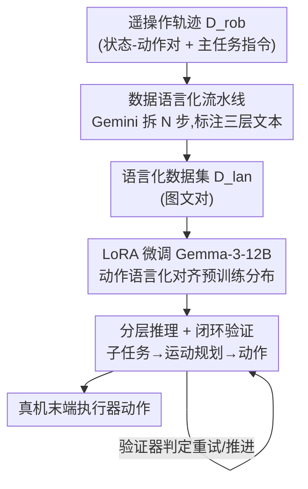

# Actions as Language: Fine-Tuning VLMs into VLAs Without Catastrophic Forgetting

**会议**: ICLR 2026  
**OpenReview**: [https://openreview.net/forum?id=sFO9d6XSlf](https://openreview.net/forum?id=sFO9d6XSlf)  
**代码**: 无  
**领域**: 机器人 / 具身智能 / 多模态VLM  
**关键词**: VLA, 灾难性遗忘, LoRA, 动作语言化, 分层推理

## 一句话总结
把机器人末端执行器的低层动作直接写成自然语言文本喂给 VLM，让微调数据落回预训练分布，从而只用 LoRA 就能把 Gemma-3-12B 变成机器人策略（VLA），在 800+ 次真机实验中保留 85%+ 的 VQA 能力并实现多语言指令、开放世界语义的零样本泛化。

## 研究背景与动机

**领域现状**：把预训练好的视觉-语言模型（VLM）在机器人遥操作数据上微调成「视觉-语言-动作」模型（VLA），是当前训练通用机器人策略的主流范式。代表工作如 OpenVLA、π0、RT-2 把连续动作离散化成 token，或者外挂一个 diffusion/flow-matching 的动作头来直接回归连续动作。

**现有痛点**：这两条主流路线都要**改 VLM 的架构或词表**，再配合**全参数微调**。结果是模型严重过拟合到狭窄的机器人数据，把预训练时学到的通用世界知识冲掉了——也就是「灾难性遗忘」。文中一张对比图很直观：问「机器人去清理台面对人安全吗？」普通 VLM 会回答「不安全，有撞到人的风险」，而普通 VLA 只会吐出一串动作向量 `[0.1, 0.4, ...]`，完全丧失了语义推理能力。下游表现就是泛化差：换个没见过的物体、换种语言指令、加几个干扰物就崩。

**核心矛盾**：作者把病根归结为**分布失配**——机器人遥操作数据里的低层动作空间（连续向量、被映射到任意 token）与 VLM 互联网级预训练语料（图文）之间隔着一条鸿沟。正是这条鸿沟逼着研究者用全参数微调去硬拟合，进而触发遗忘。已有的缓解手段（与海量非机器人数据 co-training、MoE 加 stop-gradient、冻结再分阶段训练）要么贵、要么要精调数据混合比例，治标不治本。

**本文目标**：在**不做 co-training、不改架构**的前提下，既学会机器人控制，又保住 VLM 的世界知识。

**切入角度**：作者的关键观察是——参数高效方法（如 LoRA）本来就能避免灾难性遗忘，但它生效的前提是**微调数据足够贴近模型已有的表示空间**。既然如此，与其去改模型迁就动作数据，不如反过来**在数据层面消除失配**。一张关键图（Fig. 3）佐证了这个直觉：还没微调的 Gemma-3-12B 给「用语言描述的动作」分配的对数概率，显著高于「映射到最不可能 token 的动作」。

**核心 idea**：把低层动作**直接表示成自然语言文本**（如「向前移动 4.2 厘米」当成普通字符串），让 VLA 微调数据回落到 VLM 预训练分布上，于是只靠 LoRA 就能完成适配，从根上避开灾难性遗忘。

## 方法详解

### 整体框架

VLM2VLA 是一套「数据流水线 + 训练范式」，核心只有一句话：**先在数据层面把机器人轨迹翻译成自然语言，再用 LoRA 微调，不动 VLM 主干**。

整条管线分两段。**离线数据侧**：拿一批人类遥操作轨迹（用 Bridgev2 子集），每条轨迹是状态-动作序列 $\tau=\{(o_t,a_t)\}_{t=0}^{T}$ 外加一句主任务指令 $L$；用 Gemini 2.5 把每条轨迹自动拆成 $N$ 步，每步配上「子任务描述 $l_i$ / 运动规划 $m_i$ / 动作块 $\bar a_i$」三层自然语言标注，得到新数据集 $D_{lan}$。这一步把「状态-动作对」变成了「图文对」，于是机器人控制被改写成一个**标准的监督微调任务**。**模型侧**：用 LoRA（作用在所有线性层）+ 交叉熵损失微调 Gemma-3-12B-IT，让它学会三层推理链。**推理侧**：测试时模型按「子任务 → 运动规划 → 动作」三级自回归生成文本，并由一个 Gemini 2.5 Pro 验证器在闭环里判断「当前子任务是否要重试 / 是否进入下一个子任务」。

### 关键设计

**1. 动作语言化：把低层动作写成文本，消除数据分布失配**

这是全文的地基，针对的正是「连续动作 / 任意 token 与 VLM 图文分布失配」这个病根。以往 VLA 有两条路——离散化（把动作向量映射到词表里最不可能的 token）和外挂动作头（新增随机初始化参数）——前者制造了一堆 VLM 从没见过的「乱码 token」，后者引入的新参数会污染预训练表示。VLM2VLA 走第三条路：把高层与低层动作**都用 VLM 已有词表里的自然语言**表达，比如「move forward by 4.2 centimeters」就是一个普通文本串。这样做的妙处在于直接复用了 VLM 对**数值大小**的内在理解，把它接地到物理空间。为什么有效有量化依据：微调前 Gemma 给语言化动作的平均对数概率显著高于 token 化动作（Fig. 3），说明语言化动作本就处在模型表示空间的高概率区，于是 LoRA 这种小扰动就够用，主干权重几乎不被改动，遗忘自然被避开。

**2. 三级分层推理 + 闭环验证器：把动作预测拆成 VQA 式推理链**

光把动作写成文本还不够，作者把动作预测建模成一个**三阶段层次化推理**过程，对应分解式分布：

$$p_\theta(\bar a_i, m_i, l_i \mid \bar o_i, L) = \underbrace{p_\theta(l_i \mid \bar o_i, L)}_{\text{子任务预测}} \; \underbrace{p_\theta(m_i \mid l_i, \bar o_i)}_{\text{运动规划}} \; \underbrace{p_\theta(\bar a_i \mid m_i, l_i, \bar o_i)}_{\text{动作生成}}$$

**高层子任务 $l_i$**：给定观测和指令，先描述当前要完成哪个即时子任务；**中层运动规划 $m_i$**：在子任务条件下生成只含方向的粗粒度规划（如「向左」「向下并略向前」）——故意做粗，是为了吃 VLM 本就擅长的潜在空间推理；**低层动作生成 $\bar a_i$**：在子任务和运动规划条件下，输出可变长的动作块（一个 list of list，每个内层 list 是各平移自由度的文本命令）。实践中模型一次性根据初始观测 $\bar o_0$ 生成全部 $N$ 个子任务并固定下来。为提升鲁棒性，每个动作生成周期结束后用 **Gemini 2.5 Pro 当验证器**闭环判断该重试当前子任务还是推进到下一个，直到 $N$ 个子任务全部完成。这条推理链让模型在长程、组合任务上能先想清楚再动手，而不是纯反应式地猛冲。

**3. 数据再标注流水线：用 Gemini 把轨迹自动翻译成分层文本**

要教会 VLM 上面那条「空间接地的推理链」，得先有训练数据，而人工标注上千条轨迹不现实。VLM2VLA 用 Gemini 自动完成再标注：把每条原始轨迹 $\tau$ 分解成 $N$ 步，每步生成初始观测 $\bar o_i$、子任务 $l_i$、运动规划 $m_i$、动作块 $\bar a_i$，组装成 $\bar\tau=\{(\bar o_i,l_i,m_i,\bar a_i)\}_{i=0}^{N-1}\in D_{lan}$。这一步是整套范式能 scale 的关键——它把「需要专门动作解码器 / 复杂 co-training / 多阶段训练」的工程负担，转嫁成一次性的、可自动化的数据转换。一旦数据变成标准图文对，后续就是最普通的 SFT，无需对模型架构做任何手术。

### 损失函数 / 训练策略
对 Gemma-3-12B-IT 的所有线性模块施加 LoRA，用标准**交叉熵损失**在 $D_{lan}$ 上做监督微调。不引入任何动作解码器、不改词表、不做 co-training、不分多阶段——这正是「最小修改主干」的体现。

## 实验关键数据

实验回答三个问题：Q1 微调后是否保住多模态理解？Q2 真机操作是否competitive？Q3 保住的知识能否带来 OOD 零样本泛化？全部真机评测在 6-DoF WidowX 250S 机械臂的玩具厨房环境完成，共 800+ 次实验。

### 主实验

**多模态理解（VQA 基准，节选）**：对比基座 Gemma-3-12B-IT 与微调后的 VLM2VLA，以及发生灾难性遗忘的 token 化 VLA。

| 基准 | Gemma-3-12B (基座) | VLM2VLA (Ours) | OpenVLA | ECoT |
|--------|------|------|------|------|
| MMMU | 46.0 | 42.7 | 26.3 | 26.6 |
| MMStar | 46.3 | **48.0** | 0 | 0 |
| MME | 1182.3 | **1391.7** | 0 | 0 |
| OCRBench | 75.0 | 63.9 | 0 | 0.01 |
| MMB-en | 76.9 | 68.5 | 0 | 3.7 |
| TextVQA | 68.9 | 64.9 | 0 | 0 |
| DocVQA | 80.6 | 78.4 | 0 | 0 |

OpenVLA / ECoT 在多数基准上直接归零，是典型的灾难性遗忘；VLM2VLA 仅有轻微下降，保留 85%+ 基座性能，且在 MMStar、MME 上甚至略超基座。

**真机操作成功率（%，Fig. 5，每格 30 次试验，多语言任务 90 次）**：

| 任务 | OpenVLA | ECoT | VLM2VLA-AT | VLM2VLA |
|------|---------|------|-----------|---------|
| Pick Up（ID） | **78** | 52 | 57 | 62 |
| Pick, Place & Lift（组合） | 77 | 58 | 43 | 62 |
| Pick and Place（ID 长程） | 49 | 33 | 34 | **51** |
| Pick Up-T（多语言 OOD） | 1 | 5 | 28 | **53** |
| Pick Up-A（Ash Ketchum OOD） | 0 | 0 | 30 | **60** |

简单 ID 任务上 OpenVLA 最强（受益于在更大的 Open-X-Embodiment 上微调），VLM2VLA competitive（62）→ 回答 Q2；任务越复杂、越 OOD，VLM2VLA 优势越明显——多语言指令上 53% vs OpenVLA 1%，识别动漫角色「Ash Ketchum」上 60% 且是唯一拿到有意义成功率的模型 → 回答 Q3。

### 消融实验

核心消融 VLM2VLA-AT：保持一切相同，只把动作表示从「自然语言」换成「映射到 Gemma 最不可能的 10 个 token」。

| 配置 | 多语言 Pick Up-T | Ash Ketchum Pick Up-A | 说明 |
|------|------|------|------|
| VLM2VLA（语言化动作） | 53 | 60 | 完整方法 |
| VLM2VLA-AT（token 化动作） | 28 | 30 | VQA 接近，但 OOD 操作腰斩 |

### 关键发现
- **LoRA 是保 VQA 的必要条件，但不是充分条件**：VLM2VLA-AT 的 VQA 分数与 VLM2VLA 接近，说明「靠 LoRA 而非全参微调」才是不遗忘的主因；但要在下游机器人任务上真正泛化，**动作表示方式**才是分水岭。
- **动作语言化决定泛化**：token 化消融在简单 ID 任务上还行，一旦进入 OOD（多语言、开放语义）就掉一半（30% vs 60%），说明「VLM 潜在世界知识」与「微调后学到的动作 token」之间存在断层——语言化动作把这条断层接通了。
- **越难越拉开差距**：从 ID → 组合 → OOD，VLM2VLA 相对反应式策略（OpenVLA）的优势单调上升。

## 亮点与洞察
- **「不改模型迁就数据，改数据迁就模型」的视角翻转**：以往都在想怎么改架构去拟合动作，本文反过来把动作改成语言去贴合模型——一个纯数据层的改动就绕开了灾难性遗忘，简单到「model-agnostic、易实现」。
- **复用 VLM 对数值的内在理解**：把「移动 4.2 厘米」当文本串，直接借用 VLM 预训练里学到的数量级感知来做物理空间接地，比新造一堆乱码 token 优雅得多。
- **可迁移思路**：「把目标空间重写成预训练分布里的形式，从而只用 LoRA 微调」这个套路，可推广到任何「下游标签空间与基座预训练分布失配」的领域（如把结构化输出写成自然语言再轻量微调）。

## 局限与展望
- **推理慢**：自回归生成动作，单个动作生成周期中位耗时 6.1 秒且方差大，实时性差。
- **只做平移自由度**：当前只控制末端执行器的平移，运动规划粒度粗，无法处理需要旋转的灵巧操作；细粒度语言标注是下一步。
- **单一本体**：只在特定机器人上训练，关节角等其他低层控制方式不易映射到空间 affordance；作者认为「语言作为统一媒介」有望支持跨本体，但尚未验证。
- **依赖外部验证器**：闭环靠 Gemini 2.5 Pro 当验证器，进一步拖慢推理；未来希望把基座 VLM 自己训成验证器以省掉这一步。
- 个人观察：VQA 保留率用的是与基座的相对比较，但基座本身（Gemma-3-12B）VQA 并非最强（Molmo 多项更高），「保住基座能力」与「基座能力天花板」是两件事，做产品时要分清。

## 相关工作与启发
- **vs OpenVLA / RT-2（token 化）**: 它们把连续动作映射到词表最不可能的 token，制造 VLM 没见过的分布、逼出全参微调；本文用自然语言表示动作，落回预训练分布，只需 LoRA，避免遗忘。
- **vs π0 / MolmoAct（外挂动作头 + co-training）**: 它们靠新增 diffusion/flow-matching 动作头并混入大规模非机器人数据来抗遗忘，需精调混合比例且昂贵；本文不加任何解码器、不 co-training，纯数据层解决。
- **vs ECoT（具身思维链）**: 同样在 Bridgev2 上微调、也产生推理轨迹，但 ECoT 仍会灾难性遗忘且 OOD 时疑似靠「抓最近/最显眼物体」的启发式取巧；本文低层动作也语言化、纯 LoRA，OOD 上是真理解而非取巧。
- **vs Driess et al. / Zhou et al.（MoE + stop-gradient / 冻结分阶段）**: 它们用复杂训练机制屏蔽破坏性梯度；本文直接质疑这些机制的必要性——动作语言化后一个简单 LoRA 就够。

## 评分
- 新颖性: ⭐⭐⭐⭐⭐ 「动作即语言」是与离散化、外挂动作头并列的第三条动作表示路线，视角干净且有说服力
- 实验充分度: ⭐⭐⭐⭐ 800+ 真机实验 + 多 VQA 基准 + 清晰消融，但只在单一本体、平移自由度上验证
- 写作质量: ⭐⭐⭐⭐⭐ 动机—观察—方法逻辑闭环，Fig. 3 的对数概率证据很有力
- 价值: ⭐⭐⭐⭐⭐ 给「VLM→VLA 不遗忘」提供了一条简单、低成本、可复现的路径

<!-- RELATED:START -->

## 相关论文

- [\[ICLR 2026\] EVLP: Learning Unified Embodied Vision-Language Planner with Reinforced Supervised Fine-Tuning](evlp_learning_unified_embodied_vision-language_planner_with_reinforced_supervise.md)
- [\[NeurIPS 2025\] PROFIT: A Specialized Optimizer for Deep Fine Tuning](../../NeurIPS2025/robotics/profit_a_specialized_optimizer_for_deep_fine_tuning.md)
- [\[ICLR 2026\] Cosmos Policy: Fine-Tuning Video Models for Visuomotor Control and Planning](cosmos_policy_fine-tuning_video_models_for_visuomotor_control_and_planning.md)
- [\[ICLR 2026\] Vision-Language-Action Instruction Tuning: From Understanding to Manipulation](vision-language-action_instruction_tuning_from_understanding_to_manipulation.md)
- [\[ICLR 2026\] From Spatial to Actions: Grounding Vision-Language-Action Model in Spatial Foundation Priors](from_spatial_to_actions_grounding_vision-language-action_model_in_spatial_founda.md)

<!-- RELATED:END -->
