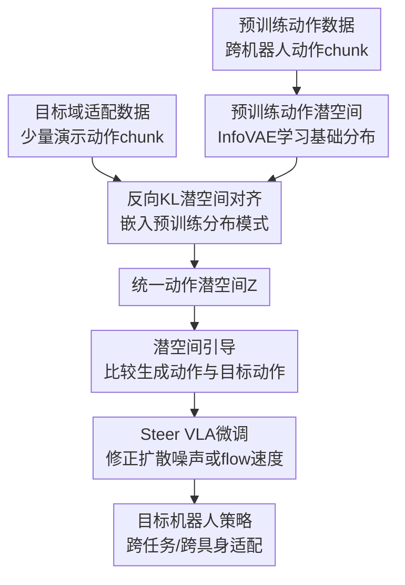

# Align-Then-stEer: Adapting the Vision-Language Action Models through Unified Latent Guidance

**会议**: ICLR 2026  
**OpenReview**: [https://openreview.net/forum?id=T3i7Ifeatk](https://openreview.net/forum?id=T3i7Ifeatk)  
**代码**: https://github.com/TeleHuman/Align-Then-Steer  
**领域**: 机器人 / VLA / 跨具身策略适配  
**关键词**: [VLA适配, 跨具身, 动作潜空间, 扩散策略, 流匹配]

## 一句话总结
ATE 先把预训练机器人动作和目标机器人动作对齐到同一个结构化潜空间，再用潜空间距离产生的梯度指导扩散式或流匹配式 VLA 微调，从而在有限演示数据下更快适配新具身和新任务。

## 研究背景与动机
**领域现状**：Vision-Language-Action 模型正在成为通用机器人操作的重要路线。典型 VLA 先在 Open X-Embodiment、DROID、ALOHA 等大规模跨机器人演示数据上预训练，再在目标平台和目标任务的小规模数据上微调；模型输入视觉观测、语言指令和本体状态，输出连续动作 chunk。近年的 RDT、Diffusion Policy、$\pi_0$ 等方法进一步把动作预测建模成扩散生成或 flow matching，因为机器人操作往往一条指令对应多种可行轨迹，生成式动作头更适合表达这种多模态连续分布。

**现有痛点**：预训练 VLA 真正落到新机器人上时，瓶颈不只是参数量或训练速度，而是动作标签本身变了。预训练数据可能来自单臂 6-DoF 机器人，目标平台却是双臂 7-DoF 机器人；即使还是同一机器人，任务布置、物体位置、动作尺度和执行节奏也会让目标动作分布偏离预训练分布。直接监督微调等于要求模型用少量数据把一个很大的动作分布错位硬拉回来，所以容易收敛慢、需要更多演示，甚至会破坏预训练阶段学到的视觉-动作先验。

**核心矛盾**：VLA 需要保留大规模预训练得到的通用 visuomotor prior，又必须贴近目标机器人的具体动作分布。只做轻量参数更新解决的是“改多少参数”的问题，没有直接回答“目标动作应该落在预训练动作空间的哪里”；只构造统一动作 token 或共享动作空间，也不一定处理预训练分布和适配分布之间的密度错位。本文把矛盾拆成两个层面：先让不同动作空间有一个可比较的共同坐标系，再在这个坐标系里显式把生成过程推向目标域。

**本文目标**：作者希望得到一种数据高效、架构无关、推理时无额外开销的 VLA 适配方法。它需要同时覆盖跨任务和跨具身场景，能接入扩散式 VLA 与 flow-based VLA，不要求修改原模型结构，也不依赖额外在线交互或奖励信号。

**切入角度**：论文观察到，动作分布错位可以先在低维潜空间中处理。若先用预训练动作训练一个动作 VAE 得到基础潜分布，再用目标域动作训练另一个 VAE，并用反向 KL 把目标潜分布压进预训练潜分布的某个高密度模式，就能形成一个“目标动作属于预训练动作流形内某个模式”的结构化表示。这样，后续微调不再只看原始动作误差，而可以利用潜空间距离告诉生成式动作头应该往哪个方向更新。

**核心 idea**：ATE 的核心是“先对齐，再引导”：先用双 InfoVAE 和反向 KL 把目标动作嵌入预训练动作潜空间，再用目标动作与当前生成动作的潜向量距离构造 classifier guidance，指导扩散 / flow VLA 朝目标机器人动作分布微调。

## 方法详解

### 整体框架
ATE 包含两个阶段。第一阶段是 alignment：分别训练预训练动作 VAE 与适配动作 VAE，把不同机器人、不同动作长度和不同动作表示压到统一动作潜空间 $Z$ 中；第二阶段是 steering：冻结已学好的适配动作编码器，用它把微调中的 noisy action chunk 和真实目标 action chunk 投到 $Z$，再用潜距离的梯度修正扩散噪声预测或 flow velocity 的训练目标。

这个框架的关键点在于，ATE 不替换原有 VLA，也不在推理时多跑一个控制器。两个轻量 VAE 只负责建立潜空间和训练时提供梯度信号，真正部署时仍然是原来的扩散式或流匹配式 VLA 直接输出动作。

### 关键设计
**1. 双 InfoVAE 潜空间对齐：把目标动作放进预训练动作流形的某个模式**

VLA 的动作 chunk 在不同阶段可能连维度和时间长度都不一样。论文没有强行把目标机器人动作重定向到预训练机器人的物理关节空间，而是训练两个动作 VAE：预训练 VAE $V_{pretrain}=\{E_\phi,D_\phi\}$ 处理预训练数据中的动作 chunk $\bar a_{t:t+H-1}$，适配 VAE $V_{adaptation}=\{E_\psi,D_\psi\}$ 处理目标域动作 chunk $\tilde a_{t:t+L-1}$。两个 VAE 都是 Transformer 编码器-解码器结构，编码器输出高斯潜变量，解码器从潜变量重建动作序列。

预训练 VAE 先学习基础潜分布 $q_\phi(z)$，其目标包含重建项、到单位高斯先验 $p(z)=\mathcal N(0,I)$ 的 KL 正则，以及 InfoVAE 的互信息约束。论文把目标写成近似的 InfoVAE 形式：

$$
\mathcal L(\phi)=\mathbb E[\log p_\phi(\bar a|z)]-(1-\alpha)D_{KL}(q_\phi(z|\bar a)\Vert p(z))-(\alpha-\lambda-1)D_{KL}(q_\phi(z)\Vert p(z)).
$$

适配 VAE 再用目标域少量动作训练，但它不是重新学一个孤立潜空间，而是被正则到预训练潜分布 $q_\phi(z)$：

$$
\mathcal L(\psi)=\mathbb E[\log p_\psi(\tilde a|z)]-(1-\alpha)D_{KL}(q_\psi(z|\tilde a)\Vert q_\phi(z))-(\alpha-\lambda-1)D_{KL}(q_\psi(z)\Vert q_\phi(z)).
$$

这里最重要的是 KL 方向。使用 $D_{KL}(q_\psi\Vert q_\phi)$ 会产生 mode-seeking 行为：目标域动作潜分布倾向于落到预训练潜分布的一个高密度模式里，而不是覆盖整个预训练分布。这很适合跨具身适配，因为目标机器人只需要找到“预训练动作先验中与自己相容的一块区域”，不必把所有预训练动作模式都解释一遍。实际实现中，作者用所有预训练动作 latent 的均值和协方差近似 $q_\phi(z)\approx\mathcal N(\mu_\phi,\Sigma_\phi)$，并用 MMD 替换最后一项 KL 以便优化。

**2. 潜空间 classifier guidance：用目标动作的 latent 距离指导生成式动作头微调**

只对齐潜空间还不够，因为 VLA 微调时仍然在原始动作空间里预测噪声或速度。ATE 的第二步把适配 VAE 编码器 $E_\psi$ 变成一个训练时的引导器：给定当前扩散 / flow 步的 noisy action chunk $\hat a^k_{t:t+h}$ 和同一条演示里的真实动作 $a^0_{t:t+h}$，分别编码为 $\hat z=E_\psi(\hat a^k_{t:t+h})$ 与 $z=E_\psi(a^0_{t:t+h})$，然后用潜空间距离定义一个 energy-based classifier：

$$
p_\psi(y|\hat a^k)\propto \exp(-\|E_\psi(\hat a^k)-E_\psi(a^0)\|^2).
$$

由此得到的 guidance 是

$$
g=\nabla_{\hat a^k}\log p_\psi(y|\hat a^k)\propto -\nabla_{\hat a^k}\|E_\psi(\hat a^k)-E_\psi(a^0)\|^2.
$$

直观地说，$g$ 不是告诉模型“动作坐标每一维要改多少”，而是告诉模型“这段动作在目标机器人动作流形里离演示动作还有多远，应该沿哪个方向靠近”。这比原始动作 MSE 更适合跨具身场景，因为不同机器人动作维度、物理含义和分布尺度差异很大，而潜空间已经先把它们压到了一个可比较的结构中。作者还强调，guidance 只在训练时使用，因为真实目标动作 $a^0$ 推理时不可得；因此 ATE 不增加部署延迟。

**3. 同一 guidance 同时接入扩散 VLA 与 flow VLA：只改训练目标，不改模型结构**

ATE 的 plug-and-play 性来自它把引导信号写进生成式动作头原有的损失，而不是重写策略网络。对扩散式 VLA，原模型预测噪声 $\epsilon_\theta(a^k,k,o,l)$，ATE 用 guidance 修正噪声学习目标：

$$
\mathcal L(\theta)=\mathbb E\left[\left\|\epsilon-\epsilon_\theta(a^k;k,o,l)+\sqrt{1-\bar\alpha_k}\,\lambda g\right\|^2\right].
$$

这等价于在每个噪声级别上把去噪轨迹往目标 latent 靠近。对 flow matching VLA，原模型学习 velocity $v_\theta(a^\tau;\tau,o,l)$，ATE 根据 flow score 与 velocity 的关系加入同一个 $g$：

$$
\mathcal L(\theta)=\mathbb E\left[\left\|v_\theta(a^\tau;\tau,o,l)+\frac{1-\tau}{\tau}\lambda g-(a^0-\epsilon)\right\|^2\right].
$$

这使 ATE 可以同时适配 RDT、Diffusion Policy 和 $\pi_0$ 这类不同动作生成范式。更细一点看，guidance scale $\lambda$ 控制“贴近目标动作流形”的强度：太小对齐不够，太大可能让动作 chunk 不够平滑；论文的敏感性实验显示 $\lambda=2$ 在若干 RoboTwin 任务上通常最好。

**4. 训练时约束在预训练潜空间内：提高样本效率，也减少破坏性微调**

直接微调的问题是，模型为了拟合少量目标演示，可能迅速离开预训练阶段学到的有效动作流形。ATE 的反向 KL 对齐和 latent guidance 形成了一个软约束：目标动作不是被当作孤立小数据集，而是被放进预训练动作分布的某个模式；微调时的生成轨迹也被持续拉向这个模式。这样模型既能学习目标平台的动作习惯，又不容易把预训练阶段学到的抓取、放置、双臂协调等通用先验抹掉。

这个机制也解释了论文中一些非主指标现象。例如真实机器人 Cook Bun 任务中，ATE 微调后的 $\pi_0$ 在放回蒸笼盖时六轴力曲线更平滑，x 方向尖峰更少。作者认为这不是额外训练了力控模块，而是因为策略被限制在更结构化的预训练动作潜空间中，微调后的动作更接近“自然且安全”的操作模式。

### 一个完整示例
以真实双臂 RealMan 机器人上的 Use Toaster 任务为例，目标演示可能包含“左手拿起远处面包片，交给右手，右手插入烤面包机；再处理第二片；最后按下按钮”。这个动作序列对预训练 VLA 来说有两层错位：一是单臂预训练数据很难直接覆盖双臂 7-DoF 协作，二是长程工具使用任务的动作节奏与常见 pick-and-place 不同。

ATE 先在预训练数据上训练 $V_{pretrain}$，得到跨机器人动作 chunk 的基础潜分布；再用少量 Use Toaster / Make Sandwich / Cook Bun 等目标平台演示训练 $V_{adaptation}$，通过反向 KL 把这些双臂动作嵌入基础潜分布的某个模式。微调 $\pi_0$ 时，每个训练 batch 中的真实动作 chunk 会被加噪成 $a^\tau$，$E_\psi$ 同时编码 noisy chunk 和 clean chunk。如果当前生成轨迹在潜空间里偏离目标演示，梯度 $g$ 会把 flow velocity 往目标 latent 方向修正。

从读者角度看，这相当于给 VLA 加了一个训练时“动作风格导航”：模型仍根据图像和语言输出动作，但每一步更新都被提醒“这个动作 chunk 应该像目标 RealMan 双臂演示，而不是像预训练数据里某个不匹配的单臂动作”。最终推理时没有额外导航器，策略已经在参数中吸收了这种目标域动作偏好。

### 损失函数 / 训练策略
训练分成三个轻量步骤。第一步训练预训练 InfoVAE，潜变量维度为 512，优化器为 Adam，学习率 $1\times10^{-4}$，batch size 64；不同 backbone 的动作 chunk 长度不同，例如 RDT 用 64，$\pi_0$ 用 50，Diffusion Policy 用 14 或 8。由于预训练动作数据较多，这一步大约需要 12 小时。

第二步训练目标域 InfoVAE。它结构与第一步一致，但只用少量目标域演示：RoboTwin 中 RDT 和 $\pi_0$ 通常每任务 50 或 100 条，真实机器人每任务 160 条左右。目标域 VAE 训练 200 epoch，论文称通常不到 0.5 小时。训练后冻结 $E_\psi$，用作 latent guidance 编码器。

第三步微调 VLA。RDT 在 RoboTwin 上训练 100k steps，batch size 64，学习率 $1.0\times10^{-4}$；$\pi_0$ 在 RoboTwin 上训练 60k steps，batch size 24，学习率 $2.5\times10^{-5}$；真实机器人上 $\pi_0$ 训练 120k steps，batch size 48。guidance scale 由超参 $\lambda$ 控制，附录中 $\lambda=2$ 在多个任务上整体最好。InfoVAE 本身在 policy fine-tuning 阶段冻结，因此额外开销集中在训练时的编码和梯度计算，推理时没有额外模块。

## 实验关键数据

### 主实验
论文在仿真和真实机器人两类设置中验证 ATE。仿真部分主要看 RoboTwin 1.0 的 17 个操作任务和 ManiSkill3 的两个 contact-rich 单臂任务；真实部分使用双臂 RealMan 7-DoF 机器人，评估 Cook Bun、Pick Bun、Make Sandwich、Use Toaster 等长程任务。

| 场景 | Backbone | 直接微调 | + ATE | 提升 |
|--------|------|------|----------|------|
| RoboTwin 1.0 17任务平均 | RDT-1B | 31.8% | 41.6% | +9.8 |
| RoboTwin 1.0 17任务平均 | $\pi_0$ | 36.1% | 44.8% | +8.7 |
| ManiSkill3 2任务平均 | RDT-1B | 36.4% | 46.6% | +10.2 |
| 真实双臂任务 120k steps 平均 | $\pi_0$ | 16.7% | 58.1% | +41.4 |
| LIBERO-10 | $\pi_0$ | 0.78 | 0.88 | +0.10 |

RoboTwin 的细粒度结果显示，ATE 对困难任务的收益尤其明显。例如 RDT-1B 在 Empty Cup Place 上从 22% 提到 61%，Put Apple Cabinet 从 20% 提到 45%；$\pi_0$ 在 Dual Bottles Pick Easy 上从 48% 提到 85%，Blocks Stack Easy 从 30% 提到 50%。也有少数任务下降，例如 RDT 的 Bottle Adjust 与 Tool Adjust，以及 $\pi_0$ 的 Pick Apple Messy，说明 latent guidance 不是无条件改善所有任务，目标动作模式和任务本身的匹配度仍然重要。

真实机器人结果更突出，因为这里具身差异最大。论文报告在 Cook Bun 中 ATE 到 90k steps 已达到 100% 成功率，而 baseline 只有 15%；Pick Bun 在 120k steps 达到 70%；Make Sandwich 和 Use Toaster 也在所有 checkpoint 上整体优于直接微调。作者还补充了 Make Yogurt Bowl 工具使用任务，ATE 从 15% 提到 25%，视觉干扰下从 0% 提到 20%。

### 消融实验
| 配置 | 关键指标 | 说明 |
|------|---------|------|
| $\pi_0$ 直接微调 | RoboTwin 17任务平均 36.1% | 没有潜空间对齐，也没有 latent guidance |
| $\pi_0$ + ATE | RoboTwin 17任务平均 44.8% | 完整双 InfoVAE + guidance |
| RDT-1B 直接微调 | ManiSkill3 平均 36.4% | Push Cube 65.2%，Pick Cube 7.6% |
| RDT-1B + ATE | ManiSkill3 平均 46.6% | Push Cube 78.4%，Pick Cube 14.8% |
| ATE 单步 InfoVAE | 图示中接近直接微调 | 只在目标任务上训练 VAE，缺少预训练潜分布对齐 |
| ATE 双步 InfoVAE | 图示中最高 | 先学预训练潜空间，再把目标动作嵌入其中 |
| $\lambda=1$ | Dual Bottles Pick Easy 82% | guidance 有效但略弱 |
| $\lambda=2$ | Dual Bottles Pick Easy 85% | 论文默认较优设置 |
| $\lambda=3$ | Dual Bottles Pick Easy 84% | 过强 guidance 对部分任务有副作用 |

论文还比较了 InfoVAE 与 vanilla VAE。以 Diffusion Policy 为例，Put Apple Cabinet 从 baseline 29% 到 vanilla VAE 42%，再到 InfoVAE 46%；Empty Cup Place 从 22% 到 34%，再到 37%。以 $\pi_0$ 为例，Blocks Stack Easy 从 30% 到 vanilla VAE 31%，再到 InfoVAE 50%；Dual Bottles Pick Easy 从 48% 到 81%，再到 85%。这说明 steering 模块并不绑定 InfoVAE，但更结构化的潜空间会让引导信号更可靠。

### 关键发现
- 对齐潜空间是 ATE 的核心，单纯把目标动作训练成一个小 VAE 不够。两步 InfoVAE 能让目标动作落在预训练潜分布的高密度模式里，消融中明显优于单步训练。
- ATE 在低数据场景更有价值。RoboTwin 上 $\pi_0$ 每任务 25 条演示时，直接微调平均 9.2%，ATE 达到 29.0%；在 Dual Bottles Pick Easy 上，25 条演示的 ATE 甚至超过 50 条演示的 baseline。
- guidance scale 需要适中。$\lambda=2$ 在 Mug Hanging Easy、Shoe Place、Dual Bottles Pick Easy 等任务上整体较好；过强 guidance 可能让动作 chunk 被过度拉向目标 latent，影响平滑性或任务特异动作。
- 真实泛化实验中，ATE 在光照、空间偏移、视觉干扰和人为扰动下多数优于 baseline。例如视觉干扰下 Pick Bun 为 75% vs 30%，空间泛化下 Cook Bun 为 40% vs 0%，这支持作者关于“保留预训练 visuomotor prior”的解释。
- 方法不是万能增益器。个别 RoboTwin 任务出现下降，说明若目标任务的可行策略与预训练潜空间中某些模式不一致，或 guidance 超参不适配，潜空间约束也可能限制探索。

## 亮点与洞察
- ATE 把 VLA 适配问题从“怎么更省参数微调”转成“目标动作分布如何嵌入预训练动作流形”。这个视角更直接命中跨具身难点，因为机器人换平台时最大的变化往往不是语义理解，而是动作标签分布。
- 反向 KL 的使用很巧妙。普通共享 latent space 只说明不同动作可以编码到同一坐标系，ATE 进一步要求目标域 latent 选择预训练分布的某个模式，从而形成“贴着预训练先验适配”的结构。
- latent guidance 的工程接口干净。它只需要一个冻结动作编码器和一个距离梯度，就能同时改写扩散噪声目标和 flow velocity 目标，不需要改 VLA 主干、动作头结构或推理代码。
- 论文把真实双臂长程任务作为主要证据之一，这比只在仿真中展示跨任务适配更有说服力。尤其是 Cook Bun、Make Sandwich、Use Toaster 这类任务包含双臂协作、工具交互和长时间序列，对 VLA 适配压力更接近真实部署。
- 一个可迁移的启发是：对任何生成式机器人策略，如果原始动作空间跨域差异太大，可以先学一个“目标域嵌入预训练流形”的 latent，再用 latent 距离指导微调。这个思路可扩展到灵巧手、移动操作、甚至多机器人协作策略。

## 局限与展望
- ATE 仍依赖目标域演示数据。它提高了样本效率，但不是零样本跨具身；真实机器人每个长程任务仍收集 160 条高质量轨迹，这对复杂硬件平台并不便宜。
- 潜空间质量决定上限。若预训练动作数据中缺少与目标具身相近的模式，反向 KL 的 mode-seeking 可能把目标动作压到不合适的模式里；过强的 $\alpha$ 消融中会显著伤害性能，例如 Block Handover 在 $\alpha=10$ 时从 baseline 80% 降到 37%。
- guidance 需要调参。$\lambda$、VAE 训练强度、动作 chunk 长度都可能影响不同任务表现。论文给了敏感性实验，但实际部署到新机器人时仍需要验证最佳范围。
- 目前 guidance 只在监督微调中使用，依赖真实动作标签作为目标 latent。未来可以探索把目标域成功判别器、力反馈、安全约束或任务奖励也映射成 latent guidance，让它兼顾动作分布对齐和任务级优化。
- 方法主要验证扩散和 flow-based VLA，对离散动作 token 或自回归 VLA 的适配还需要额外设计。若目标模型不是连续生成式动作头，ATE 的 guidance 形式不能直接套用。

## 相关工作与启发
- **vs 直接监督微调**: 直接微调只最小化目标域动作标签上的训练误差，ATE 则先建立预训练动作与目标动作的统一潜空间，再把生成轨迹向目标 latent 推进。优势是样本效率和跨具身稳定性更好，代价是多训练两个轻量 VAE。
- **vs LoRA / 动态层激活 / token caching 等高效微调方法**: 这些方法主要减少参数更新或计算开销，解决的是“训练更便宜”。ATE 解决的是动作分布错位，因此可以与这些方法互补，而不是同一层面的替代。
- **vs UniVLA / UniACT 等统一动作空间方法**: 这类方法学习共享动作 token 或行为码本，重点在构造通用动作表达。ATE 更关注适配阶段的分布对齐，即让目标动作嵌入预训练潜分布的某个模式，并用这个结构指导微调。
- **vs kinematic retargeting / 手工动作空间设计**: 运动学重定向对具体机器人结构和任务假设依赖更强，难以覆盖一般 VLA 预训练-后训练流程。ATE 避免显式写机器人之间的映射规则，用数据驱动潜空间处理动作表示差异。
- **vs DynaGuide / DSRL 等 guidance 或 RL 方法**: DynaGuide 偏测试时迭代引导，可能影响实时控制速度；DSRL 依赖价值估计，在有限离线专家数据中容易不稳定。ATE 把 guidance 放在训练目标里，保持监督学习范式，推理时零额外开销。

## 评分
- 新颖性: ⭐⭐⭐⭐⭐ 用反向 KL 把目标动作嵌入预训练动作潜空间，并把 latent guidance 写入扩散 / flow VLA 微调目标，抓住了跨具身适配的关键分布问题。
- 实验充分度: ⭐⭐⭐⭐⭐ 覆盖 RDT、$\pi_0$、Diffusion Policy，包含 RoboTwin、ManiSkill、LIBERO 和真实双臂机器人，并有低数据、guidance scale、KL 权重、VAE 类型等消融。
- 写作质量: ⭐⭐⭐⭐☆ 主线清楚，公式和算法完整；但实验结果分散在正文和多个附录表格中，读者需要来回查表才能拼出全部证据。
- 价值: ⭐⭐⭐⭐⭐ 对真实机器人部署很有实际意义，尤其适合已有大 VLA 需要迁移到新平台、新任务、少量数据场景的团队。

<!-- RELATED:START -->

## 相关论文

- [\[ICLR 2026\] From Language to Locomotion: Retargeting-free Humanoid Control via Motion Latent Guidance](from_language_to_locomotion_retargeting-free_humanoid_control_via_motion_latent_.md)
- [\[ICLR 2026\] villa-X: Enhancing Latent Action Modeling in Vision-Language-Action Models](villa-x_enhancing_latent_action_modeling_in_vision-language-action_models.md)
- [\[ICLR 2026\] HybridVLA: Collaborative Diffusion and Autoregression in a Unified Vision-Language-Action Model](hybridvla_collaborative_diffusion_and_autoregression_in_a_unified_vision-languag.md)
- [\[ICLR 2026\] UniVLA: Unified Vision-Language-Action Model](unified_vision-language-action_model.md)
- [\[ICLR 2026\] VLM4VLA: Revisiting Vision-Language-Models in Vision-Language-Action Models](vlm4vla_revisiting_vision-language-models_in_vision-language-action_models.md)

<!-- RELATED:END -->
