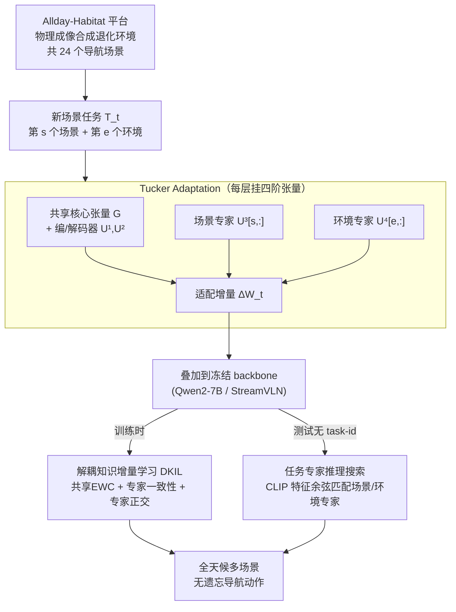

# All-day Multi-scenes Lifelong Vision-and-Language Navigation with Tucker Adaptation

**会议**: ICLR 2026  
**arXiv**: [2603.14276](https://arxiv.org/abs/2603.14276)  
**代码**: [https://ganvin-li.github.io/AlldayWalker/](https://ganvin-li.github.io/AlldayWalker/)  
**领域**: 机器人  
**关键词**: 终身视觉语言导航, Tucker分解, 参数高效微调, 灾难性遗忘, 多层级知识解耦  

## 一句话总结
提出Tucker Adaptation (TuKA)，将多场景多环境的多层级导航知识表示为高阶张量，用Tucker分解解耦为共享子空间（核心张量+编解码器）和场景/环境专家向量，配合解耦知识增量学习策略实现全天候多场景终身VLN，在24个导航场景上的SR和遗忘率均优于LoRA变体。

## 研究背景与动机

**领域现状**：VLN agent已从离散图导航发展到连续环境中的低层动作导航，但实际部署中agent会面对多种场景（卧室、客厅等）和多种环境条件（正常、低光、过曝、散射），需要持续学习适应。

**现有痛点**：在特定场景上微调后的VLN agent在切换到新场景时会灾难性遗忘旧场景的导航能力。现有LoRA/MoE-LoRA方法仅能表示"共享矩阵+特定矩阵"的二层级知识结构，无法解耦"场景知识"和"环境知识"这两个正交维度。

**核心矛盾**：导航知识具有多层级结构——核心导航技能（所有场景共享）、场景特定知识（如室内布局）、环境特定知识（如低光下视觉适应）——这三层知识需要同时独立学习和跨任务共享。

**本文目标**：形式化"全天候多场景终身VLN"（AML-VLN）问题，设计能解耦多层级知识的参数高效适应方法。

**切入角度**：利用Tucker张量分解天然的多模态分解能力——核心张量捕获共享知识，各因子矩阵的行分别编码场景/环境专家。

**核心 idea**：用四阶张量的Tucker分解同时编码共享核心导航技能、场景专家和环境专家，通过解耦增量学习实现无遗忘终身导航。

## 方法详解

### 整体框架
TuKA要解决的是"全天候多场景终身VLN"——一个导航agent得在不断切换的场景（卧室、客厅…）和环境条件（正常、低光、过曝、散射）里持续学习，而不能学了新场景就忘掉旧场景的本领。它的做法是在LLM backbone（Qwen2-7B）的每一层挂一个四阶张量 $\mathcal{X}^l \in \mathbb{R}^{a_l \times b_l \times M \times N}$，并用Tucker分解把它拆成共享部分和专家部分：核心张量 $\mathcal{G}$ 装所有场景共用的导航技能，$U^1, U^2$ 是共享的编/解码器，$U^3 \in \mathbb{R}^{M \times r_3}$ 的每一行是一个场景专家、$U^4 \in \mathbb{R}^{N \times r_4}$ 的每一行是一个环境专家。学第t个场景时，只取出对应的场景专家行 $U^3[s,:]$ 和环境专家行 $U^4[e,:]$，和共享组件组合出这一层的适配增量 $\Delta W_t$，backbone 全程冻结、只训这些张量因子。训练时用解耦知识增量学习（DKIL）约束三类知识各自更新；测试时没有 task-id，靠 CLIP 视觉特征自动路由到该用的专家组合。

### 关键设计

**1. Tucker Adaptation架构：用高阶张量分解替代LoRA的低秩矩阵分解**

LoRA 和 MoE-LoRA 把所有知识都压进二维矩阵（一个共享矩阵 + 若干特定矩阵），没法把"场景知识"和"环境知识"这两个正交维度分开建模。TuKA 改用四阶张量的 Tucker 分解，每层的适配增量按下式生成：

$$\Delta W_t = U^1 \cdot (\mathcal{G} \times_3 U^3[s,:] \times_4 U^4[e,:]) \cdot (U^2)^T$$

场景专家通过第3模选择（从 M 个里选第 s 个）、环境专家通过第4模选择（从 N 个里选第 e 个），于是天然张成了"场景×环境"的二维组合空间。维度对齐这一步做得很巧：从因子矩阵里只抽出一行向量参与张量收缩，把高阶张量降回二维权重，正好匹配 LLM backbone 的矩阵结构。这样"核心张量 + 因子矩阵"的多模结构就和"共享技能 + 场景专家 + 环境专家"的层级知识一一对应起来了。

**2. 解耦知识增量学习（DKIL）：让共享知识、旧专家、新专家各走各的更新节奏**

持续学习的真正难点在于三类知识的需求并不一样——共享知识要缓慢巩固、已学专家要原样保持、新专家要独立探索。DKIL 用三个损失分别对付它们。共享知识 EWC（$\mathcal{L}_{ewc}$）对核心张量和编解码器施加 Fisher 信息加权的二次约束，防止共享组件被新任务剧烈带偏，其中 Fisher 权重用指数移动平均递增更新；专家一致性（$\mathcal{L}_{co}$）对已经学过的场景/环境专家施加 L2 约束防止遗忘；专家正交性（$\mathcal{L}_{es}$）则强制新专家与已有专家正交，把新知识逼到一个独立子空间里去学，避免新旧专家挤在同一子空间里互相干扰。三者协同，恰好覆盖了"巩固—保持—探索"三种持续学习需求。

**3. 任务专家推理搜索：测试时没有 task-id，靠视觉特征自动路由到正确的专家组合**

实际部署时 agent 并不知道当前身处哪个场景、哪种环境，没法直接索引该用哪组专家。TuKA 在训练阶段为每个场景、每种环境各存一份 CLIP 视觉特征原型；测试时提取当前观察的 CLIP 特征，分别用余弦相似度匹配最近的场景专家和环境专家，再组合出 $\Delta W_t$。这让"场景×环境"的专家选择在无 task-id 的真实部署下也能跑通。

**4. Allday-Habitat 仿真平台：为 AML-VLN 问题造一个带物理退化环境的评测平台**

要训练和评测全天候导航，先得有一个能复现各种环境条件的地方。作者基于 Habitat 扩展出 Allday-Habitat：用三种成像模型（大气散射模型、低光噪声模型、过曝裁剪模型）从正常环境合成退化环境，最终构成 24 个导航场景（5 个仿真场景×4 种环境 + 2 个真实场景×2 种环境）。退化是按物理成像过程合成的，而非简单叠滤镜，所以环境变化更贴近真实部署。

## 实验关键数据

### 主实验（24个场景平均SR%）

| 方法 | 平均SR↑ | 平均F-SR↓ | 说明 |
|------|---------|----------|------|
| Seq-FT | 11% | 高 | 顺序微调，严重遗忘 |
| EWC-LoRA | 15% | - | LoRA+EWC |
| HydraLoRA | ~17% | - | MoE-LoRA |
| BranchLoRA | ~18% | - | 分支LoRA |
| **AlldayWalker (TuKA)** | **最佳** | **最低** | Tucker适应 |

TuKA在所有24个场景上的SR和SPL均一致优于LoRA变体基线，遗忘率显著更低。

### 消融实验

| 配置 | Avg SR | 说明 |
|------|--------|------|
| w/o 核心张量共享 | 下降 | 共享知识无法跨任务传递 |
| w/o EWC约束 | 明显下降 | 共享知识被新任务覆盖 |
| w/o 正交约束 | 下降 | 新专家与旧专家在同一子空间中干扰 |
| w/o 专家一致性 | 下降 | 已学专家被修改导致遗忘 |
| Full TuKA | **最佳** | 完整框架 |

### 关键发现
- 顺序微调（Seq-FT）在前期场景上SR几乎降为0（T1-T6均为0%），说明灾难性遗忘极其严重
- Tucker分解的第3/4模因子矩阵天然支持"场景×环境"的组合泛化——训练过的场景在未见环境下也有一定泛化能力
- 正交约束虽然简单但对新专家的独立学习至关重要
- 真实世界部署（两个真实场景）也验证了方法的有效性

## 亮点与洞察
- **用张量分解建模多层级知识**的思路非常优雅——Tucker分解的"核心张量+因子矩阵"结构与"共享技能+场景专家+环境专家"的知识结构恰好对应
- **维度对齐问题的解决**很巧妙：从因子矩阵中只选择一行向量，将高阶张量降维到二维权重矩阵，完美匹配LLM backbone的矩阵结构
- **DKIL策略中三层机制**（EWC巩固+一致性约束+正交探索）形成了持续学习的完整工具箱
- 构建的Allday-Habitat平台通过物理成像模型（而非简单滤镜）合成退化环境，增加了环境变化的真实感

## 局限与展望
- 目前仅涉及5+2=7个场景和4种环境，规模较小——大规模场景（数百个）下的可扩展性未知
- 专家数量M和N需要预设，无法动态扩展——真正的终身学习应该支持开放式增长
- 推理时的专家搜索依赖CLIP特征匹配，如果新环境与已有环境差异过大可能匹配失败
- 四种退化环境（正常/低光/过曝/散射）虽有物理依据但真实世界的环境变化更复杂（雨雾、运动模糊、遮挡等）
- 低秩设置 $r_1=r_2=8, r_3=r_4=64$ 的选择偏任意，缺乏对rank选择的敏感性分析

## 相关工作与启发
- **vs LoRA**: LoRA的两维矩阵分解无法解耦多维知识；TuKA扩展到四阶张量分解
- **vs HydraLoRA/BranchLoRA**: 这些MoE-LoRA方法只有"共享+特定"两层结构，TuKA有"共享+场景+环境"三层
- **vs EWC/LwF等持续学习方法**: 传统持续学习方法不考虑知识的层级结构；TuKA的DKIL对不同层级的知识施加不同策略
- **vs StreamVLN**: AlldayWalker基于StreamVLN的agent架构，TuKA作为参数高效适应层插入

## 评分
- 新颖性: ⭐⭐⭐⭐⭐ Tucker分解+多层级知识解耦的组合在VLN/持续学习中是首创，问题定义（AML-VLN）也是新的
- 实验充分度: ⭐⭐⭐⭐ 24个场景+真实世界部署+消融都有，但场景规模偏小
- 写作质量: ⭐⭐⭐⭐ 问题形式化清晰，方法图示直观
- 价值: ⭐⭐⭐⭐ 对VLN实际部署有直接意义，Tucker适应的思路可迁移到其他多维持续学习场景

<!-- RELATED:START -->

## 相关论文

- [\[ICLR 2026\] VITA: Zero-Shot Value Functions via Test-Time Adaptation of Vision–Language Models](vita_zero-shot_value_functions_via_test-time_adaptation_of_visionlanguage_models.md)
- [\[ICML 2026\] Turning Adaptation into Assets: Cross-Domain Bridging for Online Vision-Language Navigation](../../ICML2026/robotics/turning_adaptation_into_assets_cross-domain_bridging_for_online_vision-language_.md)
- [\[ICLR 2026\] On Robustness of Vision-Language-Action Model against Multi-Modal Perturbations](on_robustness_of_vision-language-action_model_against_multi-modal_perturbations.md)
- [\[ICLR 2026\] Uncertainty-Aware Gaussian Map for Vision-Language Navigation](uncertainty-aware_gaussian_map_for_vision-language_navigation.md)
- [\[ICLR 2026\] CoNavBench: Collaborative Long-Horizon Vision-Language Navigation Benchmark](conavbench_collaborative_long-horizon_vision-language_navigation_benchmark.md)

<!-- RELATED:END -->
