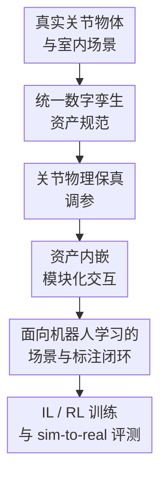

# ArtVIP: Articulated Digital Assets of Visual Realism, Modular Interaction, and Physical Fidelity for Robot Learning

**会议**: ICLR 2026  
**OpenReview**: [https://openreview.net/forum?id=SqPLEZ66BO](https://openreview.net/forum?id=SqPLEZ66BO)  
**代码**: https://huggingface.co/datasets/x-humanoid-robomind/ArtVIP  
**领域**: 机器人 / 具身智能  
**关键词**: 关节物体资产, 数字孪生, 机器人学习, 物理仿真, sim-to-real

## 一句话总结
ArtVIP 构建了一套 992 个高质量数字孪生关节物体和配套室内场景，通过统一建模规范、关节物理调参、资产内嵌交互行为与像素级 affordance 标注，让机器人学习算法能在更接近真实世界的仿真环境中训练、评测和迁移。

## 研究背景与动机
**领域现状**：机器人学习越来越依赖仿真环境来获得低成本、可重复、可扩展的数据。无论是 imitation learning 里的轨迹采集，还是 reinforcement learning 里的大规模探索，仿真都能避免硬件损耗和安全风险，也能把实验条件标准化。随着具身智能从简单抓取走向开柜门、拉抽屉、按按钮、推合烤箱门这类精细交互，仿真资产本身开始成为模型能力上限的一部分。

**现有痛点**：现有开放关节物体数据集的问题不是单纯数量不够，而是质量很难直接支撑机器人学习。PartNet-Mobility 数量较大，但很多模型外观粗糙、材质缺失、关节动力学不精确；BEHAVIOR-1K 视觉质量更好一些，却绑定 OmniGibson，资产被加密，物理参数也没有细调。对机器人来说，一个柜门看起来像不像真实柜门只是第一层问题，更关键的是它的碰撞体、关节阻尼、磁吸闭合、按钮触发等行为是否与真实物体一致。

**核心矛盾**：关节物体资产同时要满足视觉真实、物理可信、交互可复用和仿真友好，这四件事经常互相拉扯。高面数和高分辨率纹理能提升视觉真实，但会拖慢仿真；复杂碰撞网格能让接触更准确，却会增加计算开销；把交互逻辑写在任务代码里很灵活，但会让同一个资产在不同场景中难以复用。本文的判断是：当前瓶颈更偏向资产质量，而不是继续堆更多低保真模型。

**本文目标**：ArtVIP 试图给机器人学习社区提供一批可以直接用于 Isaac Sim 的高质量关节物体资产。具体目标包括：制作视觉上接近真实物体的数字孪生模型，调好碰撞体和关节动力学参数，把常见交互行为模块化地绑定到资产内部，补充像素级 affordance 标注和可直接运行的室内场景，并用真实机器人任务验证这些资产是否真的能降低 sim-to-real gap。

**切入角度**：作者没有选择用生成式方法批量合成资产，而是让专业 3D 建模师按照统一标准手工制作数字孪生模型。这个选择牺牲了规模扩张速度，但换来了可控的几何、材质、层级结构和物理参数。对于机器人学习而言，手工可控的物理与交互属性往往比“看起来有很多模型”更重要。

**核心 idea**：用统一生产规范打造视觉真实、物理可调、交互行为内嵌的关节物体数字资产，从资产层面把机器人学习所需的可见性、可碰撞性、可操作性和可迁移性绑定在一起。

## 方法详解

### 整体框架
ArtVIP 本质上是一条面向机器人学习的高质量仿真资产生产线。输入是真实世界中的家具、家电、工具等可交互物体，输出是 USD 格式的关节物体资产、可编辑室内场景、像素级 affordance 标注，以及在 imitation learning 和 reinforcement learning 中可直接调用的仿真环境。整套流程先解决“物体像不像”，再解决“动起来像不像”，最后解决“机器人能不能自然地用它”。

数据集最终包含 9 个大类、37 个子类、992 个关节物体，覆盖家具、厨具、家电、洁具、清洁工具、文具、储物箱、机械设备等日常交互对象。除了单物体资产，作者还提供 6 个 sim-ready 室内场景，例如厨房、儿童房、餐厅和客厅；这些场景中的固定家具和小物体也支持物理交互，用户还可以把 ArtVIP 的 992 个物体自由放入场景。

### 关键设计
**1. 统一数字孪生资产规范：先把“看起来真实”和“可用于仿真”放进同一套层级结构**

ArtVIP 的建模不是从网上抓一堆 OBJ 再修补，而是从真实物体出发做数字孪生。作者采用 assembly、module、mesh 三层结构：assembly 表示完整功能物体，module 表示可作为刚体运动的部件，mesh 则承载几何细节、材质、纹理、碰撞形状和质量等静态属性。建模时先把物体底部几何中心设为基坐标系，再根据 affordance、功能和关节位置切分出不同 Xform 类型模块，最后把 mesh 自底向上装配回 module 和 assembly。

这个层级结构的价值在于，它把视觉建模和机器人交互需要的刚体层级对齐起来。比如一个微波炉如果只是漂亮的整体网格，机器人很难在仿真里按按钮、拉门或观察门轴运动；而如果把门、按钮、灯、架子等交互部件拆成语义清楚的模块，后续关节、碰撞、标注和交互行为都能挂在正确的位置上。作者还要求高分辨率纹理、PBR 材质、UV 对齐和法线优化，从而减少低多边形表面、材质失真和贴图拉伸带来的视觉域差。

**2. 关节物理保真调参：不只给物体装关节，还要让关节的力学响应接近真实物体**

关节物体的 sim-to-real gap 很多时候来自“运动不像”。普通仿真里常见的关节驱动方程可以写成 $\tau = K(q) \cdot (q - q_{target}(q)) + D \cdot (\dot{q} - \dot{q}_{target}(q))$，其中 $q$ 和 $\dot{q}$ 是关节位置与速度，$K$ 是刚度，$D$ 是阻尼。ArtVIP 的关键改动是承认真实关节的刚度、目标位置、摩擦和阻尼并不总是常数，而会随着关节位置甚至速度变化。

例如抽屉接近闭合时阻尼会变大，冰箱门进入磁吸范围后会自动吸合，门闭门器在某个角度之后会突然加速关门，垃圾桶按钮释放后盖子会弹开。作者为这些情况设计了位置相关的 $K(q)$ 和 $q_{target}(q)$，也把静摩擦、最大静摩擦和动摩擦区分开。这样做的意义不是让公式更复杂，而是让机器人在仿真里遇到的接触反馈、开合轨迹和临界触发点更接近真实硬件，进而减少策略迁移时的动作偏差。

**3. 资产内嵌模块化交互：把可复用行为绑定在 USD 资产里，而不是散落在任务脚本里**

ArtVIP 最有工程味的创新是把交互行为直接嵌入资产。论文抽象出五类常见行为原语：latching / magnetic closure、damping、cross-asset effects、within-asset effects、hover / hold position。它们覆盖 394 个资产和 900 多个关节，能够表达冰箱门磁吸闭合、抽屉缓冲滑动、开关控制另一个物体、微波炉按钮弹门并点亮内部灯、烤箱门停在任意角度等效果。

这种设计把“物体是什么”和“物体如何被使用”放在同一个资产包里。研究者导入 USD 文件后，不需要在每个任务里重新写一遍按钮触发、门锁释放、阻尼变化或跨物体联动逻辑，就能获得和真实物体一致的 affordance。对机器人学习来说，这会显著降低构建任务环境的工程成本，也避免不同实验者为同一类物体写出互不兼容的交互逻辑。

**4. 面向机器人学习的场景与标注闭环：资产质量最终用下游训练和真实迁移来检验**

ArtVIP 不只发布单个物体模型，还补了像素级 affordance 标注、室内场景和机器人学习实验。像素级标注覆盖 handle、button、door、drawer、knob、pedal、wheel、rack 等功能部件，让视觉模型能够学习“哪里可交互”；室内场景把这些可交互物体放回真实生活语境，让机器人能在厨房、客厅等复合环境中执行任务。

更重要的是，作者没有停留在视觉对比，而是用 imitation learning 和 reinforcement learning 验证资产是否可用。IL 实验比较 real-only、sim-only 和 real-sim-mixed 数据；RL 实验则在仿真中训练视觉运动策略，再部署到真实世界。这样的闭环把资产质量从“建模师觉得好看”推到“策略训练是否受益”和“仿真成绩是否预测真实成绩”这两个更贴近机器人学习的问题上。

### 一个完整示例
以微波炉资产为例，传统数据集可能只提供一个有门轴的模型，门能旋转但按钮只是装饰，门的释放、内灯和真实开合轨迹需要任务开发者额外实现。ArtVIP 的处理方式会先把微波炉拆成机身、门、按钮、内部灯、架子等模块，给门和按钮配置关节，给可接触部件配置碰撞体和质量，并用 PBR 材质还原金属、玻璃和塑料表面。

当机器人在仿真里按下按钮时，按钮状态会触发 within-asset effect：门锁释放，门按调好的关节动力学弹开，同时内部灯打开。作者还用真实微波炉上的光学运动捕捉轨迹和仿真中的虚拟 marker 轨迹做对比，检查按钮触发后的门运动是否接近真实物体。这样一来，同一个微波炉资产既可以用于视觉感知数据生成，也可以用于按按钮、开门、放置物体等交互任务。

### 损失函数 / 训练策略
ArtVIP 本身不是一个训练新网络的数据驱动方法，因此没有统一的主损失函数。论文中的训练目标主要出现在下游 RL 应用里：作者扩展 EAGLE，在 CloseTrashcan 任务上采用两阶段训练。第一阶段用 PPO 训练能访问特权低维状态的 teacher policy，状态包括机器人 proprioception、垃圾桶盖关节值、垃圾桶与夹爪的 3D 相对位置等；第二阶段把 teacher 蒸馏成只看腕部相机图像和机器人状态的 visuomotor student。

EAGLE 的注意力 mask 学习目标写作 $L_{att} = L_{rec} + L_{ae} + \beta L_{ctl} + \lambda L_{sps}$，其中重建、自动编码、控制预测和稀疏项共同约束视觉注意区域。student policy 的蒸馏损失为 $\hat{L}(\pi_\theta) = \mathbb{E}_{(o,s)\sim D}[\|\pi_\theta(o_{aug}) - \pi_e(s)\|_2^2]$。CloseTrashcan 的奖励也被拆成接近盖子、方向对齐、关盖进度和平滑动作四项：$r_t = \lambda_1 r_{dst} + \lambda_2 r_{dir} + \lambda_3 r_{cls} + \lambda_4 r_{smth}$，权重分别为 $0.5, 0.125, 10, -0.01$。

## 实验关键数据

### 主实验
论文的主实验围绕两个问题展开：资产是否比已有数据集更真实，以及这些资产是否能帮助机器人策略从仿真迁移到真实世界。视觉方面，作者比较了 ArtVIP、BEHAVIOR-1K 和 PartNet-Mobility 的渲染质量、三角面数量、VGGT 重建效果和 CLIP 特征分布；物理方面，用光学运动捕捉记录真实抽屉、微波炉门、烤箱门的轨迹，再与仿真轨迹比较。下表选取机器人学习中最直接的 IL 结果。

| 任务 | 方法 | Real-Only | Sim-Only | Real+Sim 最好结果 | 主要结论 |
|------|------|-----------|----------|-------------------|----------|
| PullDrawer | ACT | 64% | 39% | 81% | 纯仿真已能零样本迁移，混合数据明显提升 |
| OpenCabinet | ACT | 34% | 12% | 46% | 开柜任务难，仿真数据单独不足，但能补强真实数据 |
| SlideShelf | DP | 44% | 18% | 59% | 横向滑动受接触和视角影响大，混合训练收益清楚 |
| CloseOven | DP | 66% | 28% | 78% | 弧形上推闭合动作在 real-sim mixed 下提升稳定 |

在与 PartNet-Mobility 的微波炉门拉开任务对比中，作者用 5 个 ArtVIP 微波炉和 5 个 PartNet-Mobility 微波炉分别采集仿真轨迹，并在一个未见过的真实微波炉上测试。ArtVIP 在 SO 和 RSM 设置下都优于 PartNet-Mobility，说明高质量几何、材质和关节配置不只是视觉上更好看，也确实能让策略学到更可迁移的动作。

| 方法 | 数据设置 | ArtVIP 成功率 | PartNet-Mobility 成功率 | 差距 |
|------|----------|---------------|--------------------------|------|
| ACT | Sim-Only | 41% | 32% | +9 个百分点 |
| ACT | Real+Sim | 79% | 68% | +11 个百分点 |
| DP | Sim-Only | 45% | 35% | +10 个百分点 |
| DP | Real+Sim | 83% | 70% | +13 个百分点 |

### 消融实验
严格说，ArtVIP 不是提出一个可逐项 ablate 的神经网络，而是一个资产系统；论文的“消融”更接近组件分析和对照实验。最有信息量的对照是资产能力维度、不同数据集质量、以及 RL baseline 的差异。

| 配置 / 对照 | 关键指标 | 说明 |
|-------------|----------|------|
| ArtVIP vs BEHAVIOR-1K vs PartNet-Mobility | 992 关节资产、2156 个 prismatic joints、1809 个 revolute joints；视觉和物理保真均标为 high | ArtVIP 数量少于 PartNet-Mobility，但强调高质量数字孪生和可直接交互 |
| ArtVIP 模块化交互 | 394 个资产、900+ 关节带行为原语 | 覆盖磁吸闭合、阻尼、跨资产触发、资产内触发、任意角度保持等行为 |
| EAGLE vs Vision-based PPO | 500k 迭代时 0.98 vs 0.24 成功率 | 在 CloseTrashcan 上，高保真资产配合更合适的视觉 RL 框架才能形成可靠策略 |
| 仿真与真实 RL 成绩相关性 | Pearson $r = 0.9886$ | 训练 checkpoint 的仿真成功率与真实成功率高度线性相关，说明仿真评测具有预测性 |

补充的性能分析也显示，ArtVIP 采用高三角面数并不意味着不可用。作者在 i7-13700、Nvidia 4090、64 GB 机器上测试，单物体场景约 90 FPS，在包含 65 个驱动关节的厨房场景中也能维持约 60 FPS 以上。这说明它选择的是“更高质量但仍能实时仿真”的折中，而不是无约束地堆网格细节。

### 关键发现
- ArtVIP 的 sim-only 数据已经能在真实世界取得非零成功率，例如 ACT 在 PullDrawer 上达到 39%，DP 在 CloseOven 上达到 28%；这说明资产的视觉和物理质量足以支撑一定程度的零样本迁移。
- real-only 仍然通常强于 sim-only，尤其 OpenCabinet 等精细接触任务差距明显，说明 ArtVIP 降低了 sim-to-real gap，但没有消除真实世界中的传感、摩擦、抓取误差和策略鲁棒性问题。
- real-sim mixed 是最稳定的收益来源：在四个 IL 任务中，加入 10 到 100 条仿真轨迹一般会逐步提升成功率，表明 ArtVIP 更适合作为真实数据的补充，而不是完全替代真实数据。
- 与 PartNet-Mobility 的微波炉对比很关键，因为任务、算法和真实测试对象一致，差别主要来自资产质量；ArtVIP 的提升支持论文“质量比数量更重要”的核心判断。
- RL 实验里的 Pearson $r = 0.9886$ 是一个很强的信号：如果仿真 checkpoint 排名能预测真实 checkpoint 排名，仿真环境就不仅能训练，还能用于模型选择和迭代评估。

## 亮点与洞察
- ArtVIP 把“数据集论文”写成了“仿真资产工程系统”：它不是只发布模型文件，而是同时给出建模层级、物理调参、交互原语、标注、场景和下游验证，这让数据集更接近机器人学习基础设施。
- 最巧妙的是把交互语义嵌入资产本身。很多仿真任务的隐性成本不在建模，而在反复写按钮、门锁、阻尼、联动等行为脚本；ArtVIP 把这些行为资产化之后，复用价值会明显更高。
- 论文对“视觉真实”和“物理真实”的评价比较克制。它没有只放漂亮 render 图，而是用了 CLIP feature t-SNE、VGGT 重建、光学 motion capture 轨迹和真实机器人成功率，从多个角度证明资产确实更接近真实世界。
- 这篇工作对生成式 3D / articulated reconstruction 方向也有启发：当前生成模型如果只追求形状可看，而不输出可靠碰撞体、关节轴、关节限制、材质和可复用行为，就很难成为机器人学习里的 sim-ready asset。
- 对实际做机器人学习的人来说，ArtVIP 的价值可能不只是 992 个物体，而是一套可复制的资产生产标准。未来即使用自动化生成方法扩展规模，也可以用这套标准作为质量验收清单。

## 局限与展望
- 最大局限是人力成本。论文附录给出很多类别的建模和物理调参时间，例如复杂橱柜、冰箱、洗衣机等都需要数小时级制作，扩展到更大物体分布会很慢。
- 数据集主要为 Isaac Sim 和 USD 生态优化，虽然作者提到可转换到 URDF 或 MJCF，但转换后能保留多少 PBR 材质、模块化交互和复杂关节行为还需要额外验证。
- 物体覆盖集中在室内日常场景，对工业、户外、医疗、实验室等专门环境的支持还有限；如果机器人任务分布差异很大，仍需要重新建模和调参。
- 论文展示了多种评测，但对于每类行为原语的独立贡献还没有严格拆开。例如磁吸闭合、阻尼、跨资产触发分别对策略迁移贡献多少，目前只能从整体结果推断。
- 未来值得把 ArtVIP 和自动化资产生成结合起来：用手工高质量资产训练或评估生成模型，再让生成模型输出满足 USD 层级、碰撞体、关节轴、材质和行为原语要求的 sim-ready 资产。

## 相关工作与启发
- **vs PartNet-Mobility**: PartNet-Mobility 的优势是规模大，包含 2347 个关节物体和更多关节数量，但很多模型视觉质量低、材质和物理参数不足。ArtVIP 数量更少，却强调数字孪生、PBR 材质、细调关节和模块化交互，更适合直接用于高保真机器人学习。
- **vs BEHAVIOR-1K**: BEHAVIOR-1K 面向日常活动和人类中心 embodied AI，视觉质量比 PartNet-Mobility 好，但资产加密并绑定 OmniGibson，物理参数也没有系统细调。ArtVIP 更开放，使用 USD 格式，并把资产可编辑、可复用和跨场景部署放在设计目标里。
- **vs RoboCasa**: RoboCasa 更像面向厨房任务的仿真 benchmark，建立在 MuJoCo 上，日常任务覆盖强，但关节物体数量很少。ArtVIP 则把重点放在关节物体资产本身，尤其是视觉/物理/交互三类保真。
- **vs Articulate-Anything / Real2Code / SplArt 等构建或生成方法**: 这些方法试图降低人工建模成本，但在真实图片上容易遇到网格破损、关节轴错误、材质缺失、内腔细节不足和过高三角面数等问题。ArtVIP 的启发是，自动生成能否进入机器人学习，不应只看重建 Chamfer Distance，还要看是否能稳定碰撞、实时仿真和触发正确交互。
- **对机器人数据工作的启发**: 高质量仿真资产可以作为真实数据的“结构化补充”。相比盲目增加真实轨迹，先把交互对象的关节、碰撞和 affordance 做准，可能更能提升复杂操作任务中的数据效率。

## 评分
- 新颖性: ⭐⭐⭐⭐☆ 把数字孪生、物理调参和模块化交互系统性整合到开放关节物体资产中，思路不是全新算法，但工程组织很有价值。
- 实验充分度: ⭐⭐⭐⭐⭐ 视觉、物理、IL、跨数据集对比和 RL 都有覆盖，尤其真实机器人实验让数据集价值更可信。
- 写作质量: ⭐⭐⭐⭐☆ 论文结构清楚，附录细节充分；不足是部分评测更像系统展示，组件级贡献拆解还可以更细。
- 价值: ⭐⭐⭐⭐⭐ 对需要高保真 articulated object simulation 的机器人学习研究很实用，也给后续自动化资产生成提供了质量标尺。

<!-- RELATED:START -->

## 相关论文

- [\[CVPR 2025\] DRAWER: Digital Reconstruction and Articulation with Environment Realism](../../CVPR2025/robotics/drawer_digital_reconstruction_and_articulation_with_environment_realism.md)
- [\[CVPR 2026\] RealAppliance: Let High-fidelity Appliance Assets Controllable and Workable as Aligned Real Manuals](../../CVPR2026/robotics/realappiance_let_high-fidelity_appliance_assets_controllable_and_workable_as_ali.md)
- [\[ICLR 2026\] Robotic Manipulation by Imitating Generated Videos Without Physical Demonstrations](robotic_manipulation_by_imitating_generated_videos_without_physical_demonstratio.md)
- [\[ICLR 2026\] Rodrigues Network for Learning Robot Actions](rodrigues_network_for_learning_robot_actions.md)
- [\[CVPR 2025\] RoboTwin: Dual-Arm Robot Benchmark with Generative Digital Twins](../../CVPR2025/robotics/robotwin_dual-arm_robot_benchmark_with_generative_digital_twins.md)

<!-- RELATED:END -->
