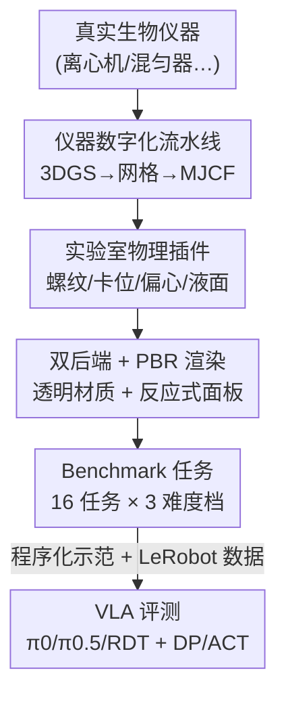

# AutoBio: A Simulation and Benchmark for Robotic Automation in Digital Biology Laboratory

**会议**: ICLR2026  
**OpenReview**: [https://openreview.net/forum?id=UUE6HEtjhu](https://openreview.net/forum?id=UUE6HEtjhu)  
**代码**: 待确认（作者承诺开源代码 + LeRobot 数据集到 GitHub / HuggingFace）  
**领域**: 机器人 / 具身智能（仿真与 Benchmark）  
**关键词**: VLA 模型, 生物实验室自动化, 机器人仿真, MuJoCo 物理插件, 透明材质渲染

## 一句话总结
AutoBio 把"生物实验室里机器人做实验"这件事做成了一套可仿真、可生成示范、可评测的 benchmark：它用 3D 高斯泼溅把真实仪器数字化、给 MuJoCo 补上螺纹/卡位/偏心/液面这些实验室专属物理、再用 Blender PBR 解决透明容器与液体的渲染，最终在 16 个分三档难度的生物实验任务上跑通 π0、π0.5、RDT 等主流 VLA，暴露出它们在精密操作、指令跟随和视觉推理上的明显短板。

## 研究背景与动机
**领域现状**：视觉-语言-动作（Vision-Language-Action, VLA）模型把视觉、语言、本体感觉三种模态拼到一起，端到端地直接吐出动作轨迹，被普遍看作通向"通用机器人策略"的一条路。RT-2、OpenVLA、RDT、π0/π0.5 等模型已经在收拾餐桌、叠衣服、家务抓取这类真实场景里展示了不错的结果。

**现有痛点**：但现有的机器人 benchmark 几乎全都困在家庭/仓库/工厂这类"日常粗操作"场景里——抓、放、叠，对精度和语言理解的要求都不高。专业的、面向科学的场景（尤其是生物实验室）几乎没人评测。而生物实验室恰恰是机器人自动化最有前途也最难啃的地方：实验有严格的协议流程（适合语言引导的机器人去解读执行），任务又重复又耗时（自动化能解放科研人员），但它对机器人智能提出了完全不同的挑战——长流程要和数字显示屏、控制面板、各种铰接机构打交道，插槽对齐这类精密操作无处不在，透明的液体和容器还让视觉推理变得很难。

**核心矛盾**：想评测 VLA 在生物实验室的能力，前提是先得有一个能仿真生物实验室的环境，而这件事本身就被卡住了。现有仿真器（robosuite、MuJoCo Playground、RoboTwin 等）基于 MuJoCo/Bullet/PhysX，主要面向开箱即用的刚体接触交互，缺三样实验室必需的能力：① 仪器资产建模（离心机、热循环仪、混匀器这些专用仪器没有现成模型）；② 实验室专属物理（拧盖的螺纹、旋钮的卡位、混匀器的偏心运动、容器里的液面晃动，物理引擎只给通用实现，这些细粒度交互要用户自己扩展）；③ 透明材质渲染（视觉是 VLA 的主输入，而透明容器+液体在传统 blend-mode 光栅化引擎里渲染得很糟）。

**本文目标**：先把"仿真生物实验室"这个底层能力补齐（资产、物理、渲染三方面都扩展），再在其上搭一套生物学有据可依的任务 benchmark，最后用它系统评测 SOTA VLA、找出它们的真实短板。

**切入角度**：作者从"生物实验=一组基础生物学操作原语（biological primitives）"这个观察出发——把复杂实验拆成转移、混合、测量、调节、保存、分离这六类"为什么做"的原语，再映射到机器人运动原语（reach & align、relocate、actuate）这些"怎么做"的层面，从而让一套通用机器人能力（精密控制、指令跟随、视觉推理）能被结构化地评测。

**核心 idea**：用"仪器数字化 + 实验室物理插件 + PBR 透明渲染"三件套把生物实验室搬进仿真，再蒸馏出分难度的 benchmark 任务，把生物实验室变成检验 VLA 通用能力的试金石。

## 方法详解

### 整体框架
AutoBio 由两层构成：底层是 **AutoBio 仿真器**（解决"能不能仿真生物实验室"），上层是 **AutoBio benchmark**（解决"怎么评测 VLA"）。

仿真器这一层做三件事，对应仿真三要素：**资产**——用一条数字化流水线把真实仪器变成可操作的仿真资产；**物理**——给 MuJoCo 写四个自定义插件，补上实验室常见但通用引擎不管的机械/流体行为；**渲染**——接 Blender PBR 管线处理透明材质，再加动态贴图渲染让仪器面板能交互。

benchmark 这一层把上面的能力蒸馏成 16 个"有生物学依据"的操作任务，分三档难度，配套提供随机化场景初始化、程序化专家示范生成、任务评测三件套，并打通和 VLA 模型的标准数据接口（LeRobot 格式）。最后拿 π0、π0.5、RDT 三个开源 VLA 跑 baseline，外加 Diffusion Policy、ACT 两个模仿学习对照。

下面这张图展示从真实仪器到 VLA 评测的整条管线：

### 关键设计

**1. 仪器数字化流水线：把真实仪器变成物理保真的可操作资产**

实验室仪器（离心机、热循环仪、混匀器、移液枪……）没有现成的高质量仿真模型，而手工建模既慢又难保证几何/视觉保真。AutoBio 设计了一条半自动流水线（图 2）：先对真实仪器做多视角视频采集，用 PGSR 算法重建出高质量 3DGS 资产，再抽出粗网格做表面重建；但 3DGS 直接出来的网格因为高斯泼溅的离散性质，往往顶点冗余、拓扑不规则，于是在 CAD 软件里精修成一个 watertight 的低面数版本，同时保留关键几何特征并标注铰接关系（articulation）。精修后的模型导出为 glTF，再过两个自研工具：纹理生成工具把高面数源网格的顶点颜色 UV 展开并 bake 到纹理图上（带 seam-aware padding、光照归一化、未匹配区域 masking 等特性）；`gltf2mjcf` 转换器把带纹理、带关节标注的 glTF 转成 MuJoCo 可直接用的 MJCF 文件。所有资产分四类——仪器（执行实验流程）、容器（盛放样品）、托架（放容器和工具）、机器人（UR5e / Aloha / Robotiq 夹爪 / DexHand）。关键之处是这条流水线不只追求好看，它把碰撞特性和铰接关系都保留下来，保证仿真里的物理交互保真。

**2. 四个实验室物理插件：补上 MuJoCo 不管的螺纹、卡位、偏心、液面**

通用物理引擎只给刚体接触的通用实现，但实验室操作里全是它管不了的细粒度行为。AutoBio 为 MuJoCo 写了四个插件（图 3）：

- **螺纹机构（Thread mechanism）**：模拟离心管盖-管身这类配合螺纹的装配。受 MuJoCo 把碰撞几何和视觉几何分离这一设计启发，作者提出用**圆螺旋线的符号距离函数（SDF）**来替代螺纹网格做碰撞检测——一对同轴、同螺距的螺旋线就能诱导出管和盖之间的碰撞，借助 MuJoCo 的 SDF 碰撞求解器，既能模拟旋拧运动，又能（靠合适的摩擦系数）模拟摩擦自锁现象。相比基于网格的碰撞检测，SDF 方法和形状是否凸无关，因此不需要对螺纹几何做凸分解，大幅降低碰撞处理的计算开销又保住物理保真。
- **卡位机构（Detent mechanism）**：模拟旋钮/手柄那种带离散"咔哒"档位的增量运动，通过和最近齿位的相对位移产生被动弹簧力，给出触觉反馈式的档位感。
- **偏心机构（Eccentric mechanism）**：通过离轴旋转产生振荡运动，真实地模拟混匀器（如涡旋混匀器）。它靠两个平行关节轴的负耦合旋转实现偏心轨道运动。
- **准静态液体（Quasi-static liquid）**：补 MuJoCo 流体建模的短板，但只做近似——把液面当成一个平面界面，忽略波传播和倾倒效果，这样液体形变只需两个状态描述：液面高度和表面法向量。表面法向的运动由一个**阻尼球摆系统**在容器外加速度作用下控制，作者用分析力学和欧拉-拉格朗日方程推出法向的常微分方程组；拿到法向后，液体几何取"定向半空间"与容器内表面的交集，再用体积守恒约束算出液面高度，从而在容器里生成液体几何。这种简化让透明容器里的液体晃动既可信又算得快。

**3. 双后端 + PBR 透明渲染 + 反应式面板：让视觉这个主输入靠谱**

视觉是 VLA 的主输入模态，而实验室里到处是透明材质，传统 blend-mode 光栅化处理透明性很糟。AutoBio 给出灵活的渲染策略（图 4）：**基础渲染**直接用 MuJoCo 原生 OpenGL 渲染器，快但有限——可视化嵌套透明物体（如装液体的透明管）时会因深度排序错误出现伪影，只能退而把某些表面标成不透明来换取有意义的结果；**高级渲染**把 MuJoCo 仿真状态桥接到 Blender 渲染管线，用其 PBR 着色器实现基于真实光行为的照片级材质，特别是容器相关任务里，能通过可配的透射系数、折射率、表面粗糙度等光学参数，准确渲染聚乙烯、玻璃、液体这些透明材质。此外**反应式用户界面**用动态加载的纹理图渲染仪器的控制面板和显示屏，为机器人操作提供视觉反馈（这对涉及数字界面的任务至关重要），且和上面两种后端都兼容。

**4. Benchmark 三件套：随机化初始化 + 程序化示范生成 + 任务评测**

光有仿真器还不能评测 VLA，需要把能力蒸馏成标准化任务并能批量产数据。AutoBio benchmark 用统一流程定义任务：① **随机化场景初始化**——每个任务用随机参数初始化环境（机器人初始关节角、任务相关物体的空间摆放，如 transfer 任务里离心管的起止位置都随机），还支持物理域随机化（注入控制噪声）和视觉域随机化（颜色、光照）来增强多样性；② **程序化示范生成**——专家示范由程序化策略生成，把每个任务拆成顺序子任务（如"拿起离心管"拆成 reach–grasp–lift），每个子任务定义一条以子任务初始状态和标注物体关键点为条件的末端执行器运动路径，再用逆运动学（IK）配合时间最优路径参数化（TOPP）算出关节空间轨迹，经 PD 控制执行，最后把子任务串成完整专家轨迹；③ **任务评测**——通过预定义状态检查（监控接触事件、物体位姿、任务专属指标）判断进度和成功，不满足成功标准的轨迹直接丢弃、不记入训练。这套流程让 benchmark 既能批量合成示范数据，又能给出标准化、可复现的评测。

### 损失函数 / 训练策略
本文是 benchmark 论文，没有自家训练目标。评测协议是：每个难度档选 3 个任务，每任务以 50 Hz 生成 100 条示范轨迹，存成 LeRobot 数据集（总计 79.2 万帧、约 4.4 小时连续录制）。除"操作热混匀器面板"用相对进度分（因为观察到该任务策略很难、二值分区分度不够）外，其余任务都用二值打分（成功 1、失败 0）。三个 VLA（π0.5、π0、RDT）各自适配数据（本体感觉维度、图像历史、归一化）后，从预训练 checkpoint（π0.5-base / π0-base / RDT-1B）用默认配置微调；为看数据 scaling 效应，每个模型分别在全量（100 条）和缩减（20 条）数据集上训练，每种配置三个随机种子、训练 30000 步、batch size 32，单次跑要 10–14 小时（NVIDIA H800），总计约 2000 GPU 小时。

## 实验关键数据

### 主实验
benchmark 含 16 个任务、分三档难度。下表对比 AutoBio 与现有机器人操作仿真器/benchmark 的能力覆盖（节选自原文 Table 1）：

| Benchmark | 目标领域 | 任务数 | 可交互仪器 | 螺纹物体 | 流体 | 反应式显示 | 渲染后端 | VLA 训练&评测 |
|-----------|---------|--------|-----------|---------|------|-----------|---------|--------------|
| Meta-world | - | 50 | × | × | × | × | MuJoCo | × |
| Robosuite | - | 9 | × | × | × | × | Isaac Sim | × |
| Factory | Factory | 8 | × | ✓ | × | × | Isaac Gym | × |
| ManiSkill 2 | - | 20 | × | × | × | × | SAPIEN | × |
| RoboTwin | - | 14 | × | × | × | × | SAPIEN | ✓ |
| Libero | Home | 130 | × | × | × | × | Isaac Sim | × |
| Chemistry3D | Chemistry | 5 | × | × | ✓ | × | Isaac Sim | × |
| **AutoBio (ours)** | Biology | 16 | ✓ | ✓ | ✓ | ✓ | Blender | ✓ |

可以看到 AutoBio 是唯一同时具备"可交互仪器 + 螺纹 + 流体 + 反应式显示 + VLA 训练评测"全套能力的 benchmark。

VLA 主评测（图 6，每任务 100 episode、三次 run 取均值，100 条示范训练）的定性结论：

| 模型 | 易任务 | 中/难任务 | 数据 scaling |
|------|--------|-----------|-------------|
| RDT（冻结编码器） | 较稳定 | 偏弱、视觉密集/指令重时受限 | 几乎不随数据增加而提升 |
| π0（~3B 可训练） | 好 | 在需视觉-语言 grounding/多步精密的任务上更强 | 多数任务随示范增多明显受益 |
| π0.5（最新） | 把"拿起离心管"推到接近 100%，易任务整体接近满分 | 与 π0 相近，**未**缩小中/难任务差距 | 同 π0 |

### 模仿学习对照

| 方法 | 参数量 | 表现 | 主要瓶颈 |
|------|--------|------|---------|
| Diffusion Policy (DP) | ~262M | 部分低/中难任务有竞争力 | 任务间状态空间异构（如 transfer 用 [row,col]、热混匀器用 [rpm,temp,time]），无法训统一模型 |
| ACT | ~52M | 同上 | 同上 |

DP/ACT 没有语言输入，要把从文本 prompt 抽出的任务参数（目标插槽下标、混匀器设置）当结构化数值观测喂进去；它们证明了"并非所有任务都需要高层语言 grounding"，但难以扩展到 AutoBio 全部任务的多样性。相比之下 VLA 把语言当成任务目标和环境状态的共享表示，单一策略就能泛化到结构差异极大的任务，更适合多任务扩展和长流程实验协议。

### 关键发现
- **失败有迹可循，且跨代际持续**：π0.5 把易任务刷到接近满分，却没堵上中/难任务的窟窿，说明作者识别出的失败模式是结构性的、不是靠换更新模型就能消除的。
- **三类可解释失败模式**：① 跨模态 grounding 错误——"转移离心管"会选错插槽、"操作热混匀器面板"要把文本指令对应到很小的 UI 元素，而当前 VLA 预处理的低输入分辨率进一步模糊了数字读数，导致目标选择不稳、学习曲线振荡；② 视觉推理短板——"移液枪吸液"需要液面推理、"装载离心机转子"需要维持对称，无记忆架构在关键视觉线索离开相机视野时就抓瞎；③ 缺闭环纠错——拧/松盖这类接触密集任务里策略常常 commit 到开环轨迹、出现微小偏差也不调整。这三条分别指向"时序连贯/思维链视觉推理""反馈条件策略/强化学习""自适应闭环控制"等未来方向。
- **数据 scaling 取决于可训练容量**：π 系列（~3B 可训练参数）随示范增多稳步提升，RDT 因静态预训练编码器适应性有限、加数据几乎无改善——架构设计（PaliGemma 式联合注意力 + 全参可训 vs 冻结编码器）直接决定了跨模态适应能力。

## 亮点与洞察
- **用螺旋线 SDF 替代螺纹网格碰撞**是最巧妙的工程点：拧盖在仿真里历来难做（要凸分解、计算量大），作者用一对同轴螺旋线的解析 SDF 一举绕开凸分解，还顺带能模拟摩擦自锁，是"用更聪明的几何表示换算力"的典范，可迁移到任何螺纹/螺杆类接触仿真。
- **准静态液体的"两状态"抽象**很务实：放弃波传播和倾倒、只用液面高度+表面法向，把流体晃动简化成阻尼球摆 ODE，既够真又算得起——对只关心"容器里有没有液、液面歪不歪"的操作评测来说，精度恰到好处。
- **把生物实验拆成"原语金字塔"**（生物学原语 the why → 运动原语 the how → VLA 能力 the enabler → 实验任务 the what）的框架，让一个看似很专的领域 benchmark 有了可推广的方法论：换个专业领域（化学、医学）也能照此搭建。
- 最让人"啊哈"的是结论：π0.5 把易任务刷满却堵不上中/难差距，等于直接证明"现有 VLA 的失败是结构性的"，这比单纯刷榜更有诊断价值。

## 局限与展望
- **作者承认**：基础渲染后端处理嵌套透明物体会有深度排序伪影，只能把部分表面标成不透明来 workaround；准静态液体忽略了波传播和倾倒效果，对真正涉及倒液的任务不适用。
- **评测覆盖有限**：16 个任务里只挑了 9 个（每档 3 个）做 VLA 评测，长流程实验协议只放在附录补充实验里，主评测仍是相对短的单步/少步任务，离"端到端跑完一整套生物实验协议"还有距离。
- **数字资产规模与开放性**：仪器数字化流水线半自动、依赖真机采集 + CAD 精修，扩到更多/更复杂仪器的成本不低；论文写作时代码和数据尚未开源（承诺后续放出）。
- **改进思路**：失败模式分析已经把路指明——给 VLA 补时序记忆/思维链视觉推理解决"线索离开视野就抓瞎"，引入反馈条件或强化学习解决接触密集任务的开环失败，提高输入分辨率解决数字读数模糊导致的 grounding 错误。

## 相关工作与启发
- **vs 自驱动实验室（A-Lab、Szymanski et al.；以及酶工程/药物筛选平台）**：那些平台为固定协议定制专用硬件、优先吞吐量，仍需人工设置维护；AutoBio 走互补路线，追求"像人一样灵活操作"——读数字指令、用合适工具、临场适应，目标是端到端处理新协议，而非造一次性专用机器。
- **vs Chemistry3D / BEHAVIOR-1K**：Chemistry3D 引入了化学实验的科学任务但只有 5 个、缺仪器交互与反应式界面，BEHAVIOR-1K 覆盖可变形场景但同样缺流体/数字界面/实验室级精度；AutoBio 专攻生物工作流，把流体处理、透明材质、可交互仪器 UI 三个前作缺失的挑战一并补上。
- **vs 通用机器人 benchmark（ManiSkill、Meta-World、robosuite、Libero、Factory）**：它们聚焦家庭/仓库/工厂的刚体操作（抓放、装配），AutoBio 则补上长流程、高精度、和数字界面交互这些它们很少评测的细粒度视觉-语言-动作推理。

## 评分
- 新颖性: ⭐⭐⭐⭐⭐ 首个面向生物实验室的 VLA benchmark，仪器数字化 + 四个实验室物理插件 + PBR 透明渲染的组合是实打实的系统性工作。
- 实验充分度: ⭐⭐⭐⭐ 三个 SOTA VLA + 两个模仿学习对照、约 2000 GPU 小时、含数据 scaling 与失败模式分析；但 VLA 主评测只用了 9/16 任务、长流程任务放在附录。
- 写作质量: ⭐⭐⭐⭐⭐ "原语金字塔"框架清晰，物理插件和失败模式讲得具体可信，图表组织到位。
- 价值: ⭐⭐⭐⭐⭐ 给"机器人做科学实验"这个被忽视的方向立了一个可复现、可扩展的标杆，失败模式分析对后续 VLA 研究有直接诊断价值。

<!-- RELATED:START -->

## 相关论文

- [\[CVPR 2025\] RoboTwin: Dual-Arm Robot Benchmark with Generative Digital Twins](../../CVPR2025/robotics/robotwin_dual-arm_robot_benchmark_with_generative_digital_twins.md)
- [\[ICLR 2026\] Differentiable Simulation of Hard Contacts with Soft Gradients for Learning and Control](differentiable_simulation_of_hard_contacts_with_soft_gradients_for_learning_and_.md)
- [\[ICLR 2026\] Memory, Benchmark & Robots: A Benchmark for Solving Complex Tasks with Reinforcement Learning](memory_benchmark_robots_a_benchmark_for_solving_complex_tasks_with_reinforcement.md)
- [\[NeurIPS 2025\] LabUtopia: High-Fidelity Simulation and Hierarchical Benchmark for Scientific Embodied Agents](../../NeurIPS2025/robotics/labutopia_high-fidelity_simulation_and_hierarchical_benchmark_for_scientific_emb.md)
- [\[ICLR 2026\] UrbanVerse: Scaling Urban Simulation by Watching City-Tour Videos](urbanverse_scaling_urban_simulation_by_watching_city-tour_videos.md)

<!-- RELATED:END -->
