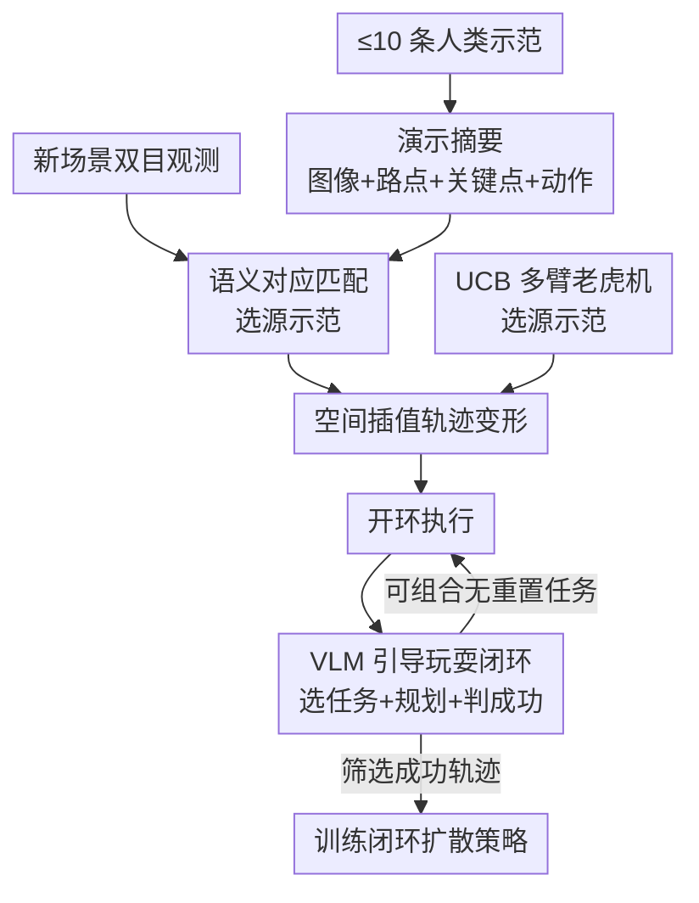

# Autonomous Functional Play with Correspondence-Driven Trajectory Warping

**会议**: ICLR2026  
**OpenReview**: [https://openreview.net/forum?id=FqDmvMZish](https://openreview.net/forum?id=FqDmvMZish)  
**代码**: 项目页 https://tether-research.github.io  
**领域**: 机器人 / 具身智能  
**关键词**: 自主数据生成, 关键点对应, 轨迹变形, 模仿学习, VLM 引导

## 一句话总结
本文提出 Tether：先用一个只需 ≤10 条示范、靠语义关键点对应把示范轨迹"变形"到新场景的开环策略，再把它放进一个由视觉语言模型（VLM）调度的"自主功能性玩耍"闭环里，让机器人在真实世界连续 26 小时、几乎无需人工干预地自动生成 1000+ 条专家级轨迹，用来训练闭环模仿策略，最终达到与人类遥操作采集数据相当的成功率。

## 研究背景与动机
**领域现状**：当前真实世界机器人操作主要靠模仿学习——人类遥操作采集大量示范，再训练 Diffusion Policy、π0 这类数据饥渴的神经策略。

**现有痛点**：人类示范的采集成本随人力线性增长，而这些策略架构要泛化得好，又恰恰需要在空间和语义上都高度多样的大数据集。于是出现一个死结：要泛化就要大数据，要大数据就要海量人力。已有的"少示范"路线（基础模型零样本、检索式、关键点条件策略）要么吞吐太低（如 Manipulate-Anything 多轮基础模型推理只攒了不到 50 条），要么在杂乱场景里抽不出任务相关特征。

**核心矛盾**：自主"玩耍"式数据生成需要同时满足两个互相牵制的条件——(1) 策略要对各种分布外的初始状态足够鲁棒、能从错误中恢复；(2) 整个流程要能持续不断地产出有用经验、且不需要人来重置环境。前者通常意味着大模型大数据，后者又要求人力近乎为零。

**本文目标**：在仅有每个任务少量示范的前提下，做出一个鲁棒到能撑起长时间无人值守玩耍的策略，并设计一套自动选任务、自动判成败、自动重置的闭环，把"少示范"滚雪球放大成"大数据"。

**切入角度**：作者借鉴发展心理学里的"功能性玩耍"（结构化、任务导向、重复练习），并押注近年语义图像关键点对应模型（DINOv2 + Stable Diffusion 特征）的飞跃——同一类物体在外观、尺寸大变时，对应关系依然能锚定到语义等价的区域（如水果中心、容器边缘）。

**核心 idea**：与其用关键点去喂一个点条件神经策略，不如更直接——用关键点对应在新场景里**选出最匹配的一条示范、再把它的轨迹几何变形过去**；再让 VLM 当"导演"驱动这个开环策略反复玩耍、筛出成功数据去训练更强的闭环策略。

## 方法详解

### 整体框架
Tether 由两大部分串成一条"少示范 → 大数据 → 强策略"的流水线。第一部分是**轨迹变形开环策略**（Section 3.1）：它是非参数的，把每条示范预处理成一个紧凑摘要（初始图像、路点、关键点、动作序列）；面对新场景观测时，先和所有示范做关键点对应匹配、按"原路点 vs 反投影目标路点"的偏差选出最像的源示范，再把这条源轨迹按空间几何线性插值变形到当前场景，开环执行。第二部分是**VLM 引导的自主功能性玩耍**（Section 3.2）：把上面的策略塞进一个迭代闭环——VLM 看场景图选一个该练的任务并给出可执行的任务计划，Tether 执行，另一次 VLM 查询判断是否成功，成功的轨迹经筛选用于下游训练 Diffusion Policy。任务集合被特意设计成"可组合、互为重置"，让玩耍能在没有人工重置的情况下无限滚下去。

### 关键设计

**1. 演示摘要：把每条示范压成 (图像, 路点, 关键点, 动作) 四元组**

策略是非参数的，测试时要直接访问示范，所以先把每条示范 $\tau_i$ 离线压缩成摘要 $\kappa_i = (o, W, K, a)$，做一次即可、之后原始示范可丢弃。其中 $o$ 是轨迹开头的双视角相机观测；$W=[w_1,\dots,w_T]$ 是任务关键的 3D 夹爪"路点"序列，实践中直接取夹爪开合状态发生切换的那些帧的位置（沿用前人选关键帧的惯例，对各类操作任务都通用）；$a=[a_1,\dots,a_M]$ 是完整动作序列（6 自由度夹爪位姿 + 开合）；$K=[k_1,\dots,k_T]$ 是把各路点投影回 $o$ 得到的视觉关键点。这个四元组同时承载了"语义锚点"（关键点）和"要复现的运动"（路点 + 动作），是后续匹配和变形的共同载体——它把"一条示范该怎么用"显式拆成了可对齐、可几何操作的几块，而不是塞进一个黑盒网络。

**2. 语义对应匹配与源示范选择：用反投影偏差给示范打分排序**

面对新观测 $o$，要先决定"复现哪一条示范"。对每个示范摘要 $\kappa_i$，在当前左右图像里分别搜索其关键点 $K_i$ 的对应像素 $\tilde{K}_i=[\tilde{K}_{i,\text{left}},\tilde{K}_{i,\text{right}}]$，对应用的是建立在 DINOv2 与 Stable Diffusion 特征之上的 SOTA 语义对应模型。再用标定外参把这些 2D 对应反投影成目标 3D 路点 $\tilde{W}_i$；若反投影射线无法相交，则判定该示范对当前场景不可行。对可行的示范，按原路点与目标路点的欧氏距离打分 $\text{score}_i(o)=\lVert W_i-\tilde{W}_i(o)\rVert_2$，分数越小越像，取最小者为源示范 $\kappa^*$。这一步妙在用"几何一致性"而非"图像相似度"来选示范：分数低意味着这条示范的运动结构能干净地落到当前场景，天然过滤掉那些语义上勉强对上、几何上却扭曲的匹配。

**3. 空间线性插值的轨迹变形：把源轨迹弯到新场景而保住空间关系**

选定源示范后，目标路点 $\tilde{W}^*(o)$ 只是搭好了骨架，还要填上路点之间的细粒度动作。对源示范里一段相邻路点 $[w_t, w_{t+1}]$（目标为 $[\tilde{w}_t, \tilde{w}_{t+1}]$），先算两端位移 $d_t=\tilde{w}_t-w_t$、$d_{t+1}=\tilde{w}_{t+1}-w_{t+1}$，再对这段内每个动作做插值。关键是**在空间而非时间上插值**：为 $w_t,w_{t+1}$ 定义一个把 $w_t$ 映到 0、$w_{t+1}$ 映到 1 的局部 1D 坐标，某动作 $a$ 的插值系数 $\alpha$ 就是它投影到这条线上相对 $w_t$、$w_{t+1}$ 的相对距离，于是它该承受的位移为

$$d_a = (1-\alpha)\,d_t + \alpha\,d_{t+1},\qquad a_{\text{new}} = a + d_a$$

拼接所有段得到完整动作计划 $\tilde{a}$。之所以按空间插值，是因为操作的成败取决于夹爪和物体的空间相对关系（比如靠近、对准），按时间插值会让"快慢节奏"主导而打乱这些关系；按空间插值则保证轨迹在被拉伸/弯折后，关键接触几何依旧对得上。方法虽简单，却在仅 10 条示范下扛住了分布外物体、毫米级精度、复杂接触等硬任务。

**4. VLM 引导的自主功能性玩耍闭环：选任务、做规划、判成败一气呵成**

把策略变成"持续产数据"的关键是这个迭代闭环。每一步：VLM 看场景图被问"现在该练哪个任务"，跑对应 Tether 策略并录制，再由另一次 VLM 查询评估成败。**任务选择**上，为了多攒稀有任务的数据，维护每个任务的累计成功计数，对"负成功计数"做 softmax 采样目标任务——越少成功的越被优先练。但稀有目标任务未必当场可执行（例如"把物体从架子搬到桌上"得先有物体在架子上），于是再让 VLM 给出一串可执行子任务组成的**任务计划**，本轮只执行计划里的第一个，类似滚动时域控制。**成功评估**则给 VLM 喂执行前后的左、右、腕三路相机图像判定成败；作者用专为具身推理训练的 Gemini Robotics-ER 1.5，在多相机全可观测设置下几乎零误判（玩耍中实测任务规划准确率 95.2%、成功判定精度 98.4%）。这三件事咬合起来，才让"无人值守地不断产出干净数据"成为可能——计划保证任务可执行、评估保证只有真成功才进数据集。

**5. 可组合无重置任务设计 + UCB 选源示范：让玩耍能滚下去、还越滚越好**

要无人重置地连续玩，任务集合被设计成"一个任务的终态是另一个任务的合法初态"（如"把菠萝放桌上"接得上"放架子上""放碗里"），即便失败也成立——这是对无重置学习里前向-后向任务的推广，让可达状态对任务分布近似"闭合"，且先前任务及其失误会自然把相关与背景物体的位姿随机化，相当于免费造出不断扩张的初始状态分布。此外，玩耍还要靠注入随机性来探索更优策略：不是每次都拿全部示范，而是先**子选 k 条**再变形其中最近的一条。但人类示范质量参差，于是把"选哪 k 条"建模成**多臂老虎机**——每条示范是一只臂、变形它执行后的二元成败是回报，用带上置信界（UCB）的策略在"多试探少测过的示范"和"多利用高成功率示范"之间权衡，从而自动甄别出稳健的好示范、避开诸如不牢靠指尖抓取那类坏示范。

### 损失函数 / 训练策略
下游训练用**筛选式行为克隆**（filtered behavioral cloning）：每 500 次玩耍尝试后，对每个任务用累计的成功轨迹训练一个 Diffusion Policy。VLM 判成功的高精度（98.4% 精度）是这一步的前提——只有把假阳性压到极低，被筛入的轨迹才都是专家级，行为克隆才有效。作者指出对次优轨迹做更充分利用（如离线 RL）是留待未来的方向。

## 实验关键数据

平台为 7 自由度 Franka Emika Panda（15 Hz），双标定 ZED 相机；每个任务仅给 10 条示范，语义对应跑在 1 张 A6000 上；玩耍中用 Gemini Robotics-ER 1.5 选任务和判成败。

### 主实验
12 个任务分三类：4 个桌面/架子搬运水果与容器（分布内）、4 个分布外物体（苹果/草莓/篮子/杯子换掉示范里的菠萝和碗）、4 个高难技能（擦白板、开柜门、挂胶带、插咖啡胶囊）。

| 对比项 | 数据量 | 表现概述 |
|--------|--------|----------|
| Tether（本文，10 示范） | 10 | 12 个任务全面超越各基线 |
| Diffusion Policy | 10 | 从头训练无内置先验，10 示范泛化失败 |
| π0 零样本 | 0 | 标准抓放尚可，复杂任务因指令理解/精度不足而失败 |
| π0 微调 | 10 | 严重过拟合崩溃，常不动或抓空，零成功 |
| KAT（关键点动作 token） | 10 | 杂乱场景抽不出任务相关特征，难以上下文学习，零成功 |

亮点：草莓体积仅示范菠萝的 1/4 且外观迥异、杯子直径仅碗的 1/2，Tether 靠语义对应仍能定位语义等价区域并精确抓取；插咖啡任务**不用腕部相机**也能完成 8 毫米误差容限的插入。

### 消融与自主玩耍统计

| 配置 / 指标 | 数值 | 说明 |
|------------|------|------|
| 示范数量消融 | 1 / 5 / 10 | 仅 10 条即稳健，数量减少性能可控下降 |
| 玩耍总时长 | ~26 小时（4 次） | 真实世界无重置连续运行 |
| 成功 / 尝试 | 1085 / 1946 | 6 个任务，累计成功率 55.8% |
| 吞吐 | 每 48 秒 1 次尝试 | 每 86 秒产出 1 条成功轨迹 |
| 人工干预 | 5 次 / 0.26% | 平均每 5.2 小时一次，合计约 1 分钟 |
| 任务规划准确率 | 95.2% | 对 1946 次尝试人工标注核对 |
| 成功判定 | 98.4% 精度 / 89.6% 召回 | 优先压低假阳性以防污染数据 |

### 关键发现
- 玩耍数据流持续提升下游策略：每 500 次玩耍重训一次，6 个任务的 Diffusion Policy 随玩耍数据增多稳定变强，多数最终逼近满成功率；提升主要体现在对不同物体位置的**空间鲁棒性**。
- 与等量（141–202 条/任务）人类采集数据训练的策略相比，Tether 数据训出的策略成功率相当、平均还略高；作者推测因为大规模玩耍带来的随机化更无偏，且变形轨迹占据专家分布中一个较窄但有效的模式、更易被策略拟合。
- Tether 策略本身对鲁棒玩耍不可替代：把人类数据 Diffusion Policy（141–202 示范）放回玩耍初态去跑，成功率明显不如 Tether（10 示范），后者对倾倒的碗、缠绕物体等更广的玩耍状态分布泛化得更好。
- 玩耍偶发"意外恢复"：碗被完全翻扣本不可单臂恢复（占多数干预），但有两次机器人靠把碗挤压回正而碰巧救回——大规模玩耍中巧合可能催生意外新行为。

## 亮点与洞察
- **"选 + 变形"比"喂点条件策略"更直接**：同样用关键点对应，本文不把点喂进神经策略，而是直接挑一条最像的示范几何变形过去，绕开了端到端策略的数据需求，10 条示范就能扛硬任务。
- **空间插值而非时间插值**是个易被忽略却关键的设计：操作成败由空间相对关系决定，按空间插值保住了接触几何，这个思路可迁移到任何"把一条参考轨迹搬到新位形"的场景。
- **用 VLM 当导演而非执行者**：VLM 只负责选任务、做计划、判成败这些它擅长的高层语义判断，底层动作交给鲁棒的开环策略，规避了"多轮基础模型推理拖垮吞吐"的老问题，把吞吐拉到每 48 秒一次尝试。
- **把示范质量筛选建模成多臂老虎机**：让玩耍过程自己用成败回报筛出靠谱示范、淘汰坏示范，是"边玩边自我提纯"的巧思。
- **任务集合互为重置**这一形式化，让"无人值守长时玩耍"在硬件层面成为可能，是整套系统能跑 26 小时只干预 5 次的底层支撑。

## 局限与展望
- **开环本质限制反应性**：作者明确承认 Tether 是开环策略，执行中无法实时纠错和恢复，因此它定位为"产数据的引导器"而非独立的终极策略，要靠它生成的数据去训练闭环策略。
- **依赖语义对应模型质量**：整套匹配/变形建立在 DINOv2 + SD 特征的对应模型上，对应失败或精度不足会直接传导到选示范与变形，论文未深入探讨对应模型失效时的表现。
- **下游只用了筛选式行为克隆**：对大量次优（失败）轨迹基本弃之不用，更充分利用次优数据（离线 RL 等）留作未来工作，当前数据利用率有提升空间。
- **不可恢复失败仍需人工**：碗翻扣等单臂无解状态构成主要干预来源，反映纯开环 + 单臂在某些失败模式下仍无自愈能力。
- **任务/场景规模有限**：实验集中在家庭式多物体搬运 + 几个高难技能、6 个任务做长时玩耍，更开放的任务空间下"可组合互为重置"的设计是否还成立有待验证。

## 相关工作与启发
- **vs KAT（关键点动作 token）**：两者都用关键点对应，但 KAT 把关键点喂给 LLM 做上下文动作生成，在杂乱多维模式（朝向变化、非线性速度、宽物体分布）下难以上下文学习而零成功；本文直接选示范 + 几何变形，避开了对 LLM 上下文能力的依赖。
- **vs π0 / Diffusion Policy（数据饥渴神经策略）**：它们靠大数据/预训练泛化，10 示范下要么过拟合崩溃（π0 微调）要么泛化失败（DP）；本文用非参数变形在极少示范下就鲁棒，并反过来给这些策略生产训练数据。
- **vs Manipulate-Anything（零样本基础模型自主采集）**：后者多轮基础模型推理严重拖累吞吐、只攒了不到 50 条且不考虑重置；本文把基础模型限定在高层调度、底层用快速开环策略，并设计互为重置任务，真实世界自动产出 1000+ 条。
- **vs 物体中心方法**：同样受益于场景理解、对干扰物鲁棒，但本文用关键点对应提供更高空间精度，且不依赖刚性"物体性"假设，因而能处理可形变的布、颗粒等。

## 评分
- 新颖性: ⭐⭐⭐⭐⭐ "选示范 + 空间变形 + VLM 导演玩耍"的组合在真实世界自主数据生成上是清晰的新范式
- 实验充分度: ⭐⭐⭐⭐⭐ 12 任务对比 + 26 小时真实玩耍 + 下游策略训练 + 人工标注核对 VLM 可靠性，链条完整
- 写作质量: ⭐⭐⭐⭐ 方法叙述清楚、公式到位，少量细节（对应模型失效行为）留在附录
- 价值: ⭐⭐⭐⭐⭐ 把"少示范"滚成"大数据"且质量媲美人类遥操作，对降低真实机器人数据成本有直接价值

<!-- RELATED:START -->

## 相关论文

- [\[CVPR 2026\] Scalable Trajectory Generation for Whole-Body Mobile Manipulation](../../CVPR2026/robotics/scalable_trajectory_generation_for_whole-body_mobile_manipulation.md)
- [\[CVPR 2026\] AffordGen: Generating Diverse Demonstrations for Generalizable Object Manipulation with Affordance Correspondence](../../CVPR2026/robotics/affordgen_generating_diverse_demonstrations_for_generalizable_object_manipulatio.md)
- [\[ICLR 2026\] AutoFly: Vision-Language-Action Model for UAV Autonomous Navigation in the Wild](autofly_vision-language-action_model_for_uav_autonomous_navigation_in_the_wild.md)
- [\[ICCV 2025\] Weakly-Supervised Learning of Dense Functional Correspondences](../../ICCV2025/robotics/weakly-supervised_learning_of_dense_functional_correspondences.md)
- [\[CVPR 2026\] DemoFunGrasp: Universal Dexterous Functional Grasping via Demonstration-Editing Reinforcement Learning](../../CVPR2026/robotics/demofungrasp_universal_dexterous_functional_grasping_via_demonstration-editing_r.md)

<!-- RELATED:END -->
