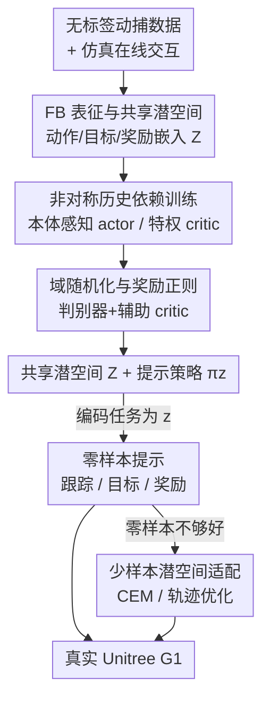

# BFM-Zero: A Promptable Behavioral Foundation Model for Humanoid Control Using Unsupervised Reinforcement Learning

**会议**: ICLR2026  
**OpenReview**: [https://openreview.net/forum?id=jkhl2oI0g5](https://openreview.net/forum?id=jkhl2oI0g5)  
**代码**: 项目页 https://lecar-lab.github.io/BFM-Zero/  
**领域**: 机器人 / 人形控制 / 无监督强化学习  
**关键词**: 行为基础模型, 人形机器人, 前向-后向表征, 无监督RL, sim-to-real

## 一句话总结
BFM-Zero 用在线 off-policy 无监督 RL（前向-后向表征 FB-CPR）把动作、目标、奖励统统编码进一个共享潜空间，训出一个可"提示"的人形全身控制通才策略，并首次在真实 Unitree G1 上实现免重训的零样本动作跟踪 / 目标到达 / 奖励优化，还能少样本快速适配。

## 研究背景与动机
**领域现状**：人形机器人全身控制目前主流是"仿真训练 + sim-to-real 迁移"的范式，几乎全靠 on-policy 策略梯度（典型是 PPO）配上显式的跟踪奖励，把策略训成专门模仿某段动捕片段或解决某个单一任务。操作类机器人那边已经有 VLA 这类基础模型，靠行为克隆从人类示范学习。

**现有痛点**：人形全身控制有个根本性的错配——它没有现成的关节级动作标签，也没有大规模遥操作数据集，所以无法直接照搬操作类的行为克隆思路。而现有 PPO 系方案有三个老毛病：① **任务特定**，一个策略只会模仿一段动作或解一个任务；② **不可适配**，训完就僵住，换新任务没法轻量微调或组合；③ **缺乏统一、可解释的接口**，人类操作者很难指定目标，也很难把已学技能拼成新行为。

**核心矛盾**：要做"一个策略应对多任务"的基础模型，就得有一个能把异质任务（奖励、目标、示范）统一表示的空间；但 on-policy RL 天生为单任务奖励优化设计，既学不出这种共享表示，也不支持免重训的零样本提示。多任务无监督 RL 用的恰恰是 off-policy 训练，而 off-policy 在真实人形 sim-to-real 上从没被验证过是否扛得住动力学差异和强扰动。

**本文目标**：验证 off-policy 无监督 RL 能不能训出真实人形的行为基础模型（BFM），让它在零样本下应对奖励、目标、示范指定的一大批下游任务，需要重训的任务也能高效后训练。

**切入角度**：作者押注前向-后向（Forward-Backward, FB）表征——它给出一个目标中心、可解释、平滑的潜空间，每个潜向量 $z$ 对应一个线性奖励 $r_z = \phi^\top z$ 及其最优策略 $\pi_z$，从而把"任务"变成"潜空间里的一个向量"，天然支持零样本提示。

**核心 idea**：在 FB-CPR（FB + 在线训练 + 动捕数据策略正则）的基础上，补上非对称历史依赖训练、域随机化和奖励正则三剂"sim-to-real 药"，把这套原本只跑在虚拟角色上的无监督 RL 第一次落到真实人形硬件上。

## 方法详解

### 整体框架
BFM-Zero 把真实人形控制建模成一个 POMDP $(S, O, A, P, \gamma)$：29 自由度的 G1，动作 $a \in \mathbb{R}^{29}$ 是各关节 PD 控制器目标，特权状态 $s \in \mathbb{R}^{463}$（含根高、姿态、速度等仿真可见信息），可观测状态 $o_t \in \mathbb{R}^{64}$ 只含本体感知（关节位置/速度、根角速度、投影重力）。整条流水线分三段：**无监督预训练** → **零样本推理** → **可选的少样本适配**。预训练阶段在仿真里做无奖励在线交互、配上一份无标签动捕数据集 $\mathcal{M}$，学出一个把动作、目标、奖励都嵌入的共享潜空间 $\mathcal{Z} \subseteq \mathbb{R}^d$ 和一个以 $z$ 为条件的提示式策略 $\pi_z$；推理阶段把下游任务编码成一个 $z$，直接让策略执行；适配阶段则在潜空间里用采样优化微调 $z$，应对零样本覆盖不到的难任务。

### 关键设计

**1. FB 表征与共享潜空间：把"任务"变成潜空间里的一个向量**

这是整个框架的地基，针对的是"PPO 系方案学不出统一多任务表示"这个根本痛点。FB 学的是策略长程动力学的一个有限秩近似：给定训练状态分布 $\rho$，学一对映射——前向 $F: S \times A \times \mathbb{R}^d \to \mathbb{R}^d$ 和后向 $B: S \to \mathbb{R}^d$，使得策略 $\pi_z$ 诱导的长程访问测度分解为

$$M^{\pi_z}(ds' \mid s, a) \simeq F(s, a, z)^\top B(s') \rho(ds')$$

其中 $M^{\pi_z}(s' \in X \mid s, a) := \sum_t \gamma^t \Pr(s_t \in X \mid s, a, \pi_z)$ 是折扣访问概率。由此 $F$ 恰是任务特征 $\phi(s) := (\mathbb{E}_\rho[B B^\top])^{-1} B(s)$ 的后继特征（successor features），而 $\phi$ 又诱导出一族线性奖励 $r_z(s) = \phi(s)^\top z$。关键在于：$F(s,a,z)^\top z$ 正好是策略 $\pi_z$ 在奖励 $r_z$ 下的 Q 函数，于是每个潜向量 $z$ 就对应一个任务 + 它的最优策略。和标准 RL 不同，这里"感兴趣的奖励集合"$\{r_z\}$ 不是人给的，而是学出来的，能覆盖一大片任务。作者在 FB 之上用 FB-CPR：引入一个潜条件判别器把无监督学习正则到"接近动捕示范行为"，并且全程在线 off-policy 训练，不需要全覆盖的离线数据集。

**2. 非对称历史依赖训练：用特权 critic 教本体感知 actor**

真实机器人只有本体感知（部分可观测），仿真却能拿到完整特权状态——这个信息差是 sim-to-real 的核心障碍。作者的做法是**非对称**：策略 $\pi$ 只吃可观测历史 $o_{t,H} = \{o_{t-H}, a_{t-H}, \dots, o_t\}$，而所有 critic（前向 $F$、后向 $B$、辅助 critic、判别器 critic）都额外吃特权信息 $(o_{t,H}, s_t)$。特权 critic 能给出更准的价值估计来指导训练，而把动作历史喂给 actor 则缩小了"本体感知 actor"与"特权 critic"之间的信息鸿沟，让策略在受限感知和域随机化下都更鲁棒、更可适配。FB 与辅助 critic 都用基于后继测度的 Bellman 残差做 TD 学习，例如 FB 目标

$$L(F, B) = \mathbb{E}\big[(F^\top \bar B - \gamma \bar F^\top \bar B)^2\big] - 2\mathbb{E}[F(o_{t,H}, s_t, a_t, z)^\top B(o_{t+1}, s_{t+1})]$$

（$\bar F, \bar B$ 为 stop-gradient）。这种 TD-based off-policy 训练正是真机能"摔倒后自然恢复、继续跟踪"的来源——策略像人一样从丰富技能库里临时取用恢复动作，而不只是靠扰动训练硬扛。

**3. 域随机化与奖励正则：判别器塑形 + 辅助 critic 上安全约束**

光有非对称训练还不够，仿真动力学和真机总有差，且无监督策略可能学出撞关节限位这类危险行为。作者补两件事：**域随机化（DR）** 随机化连杆质量、摩擦系数、关节偏置、躯干质心，并加扰动和传感器噪声，防止过拟合仿真动力学；同时配合大规模并行环境 + 大 replay buffer + 高 UTD（update-to-data）比，把 off-policy 无监督训练扩到上千环境还保持稳定。**奖励正则**则通过一个辅助历史特权 critic $Q_R$ 注入 $N_{aux}$ 个惩罚奖励（如关节限位惩罚），用标准 Bellman 残差学习，保证学到的行为守得住物理可行性和安全约束。此外判别器 $Q_D$ 用 GAN 式目标把训练拉向"类人"行为——它既是风格正则，也偏置在线探索；判别器奖励 $r_d = \frac{D}{1-D}$。三路 critic 汇成最终 actor 损失

$$L(\pi) = -\mathbb{E}\big[F(o_{t,H}, s_t, a_t, z)^\top z + \lambda_D Q_D + \lambda_R Q_R\big]$$

也就是同时优化"完成任务（FB 项）+ 像人（判别器项）+ 安全（辅助项）"。

**4. 零样本提示与少样本潜空间适配：推理时只动 $z$，不动网络**

预训练好后，下游任务全靠"找到对的 $z$"来解，免重训。对任意奖励 $r(s)$，由 $F^\top z$ 是 $\pi_z$ 的 Q 函数可推出最优提示 $z_r = \mathbb{E}_{s'\sim\rho}[B(s')r(s')]$，实践中用 replay buffer 子采样估计 $z_r = \frac{1}{N}\sum_i r(s_i) B(s_i)$；**目标到达**任务直接取 $z_g = B(s_g)$；**动作跟踪**则对序列 $\tau$ 生成一串提示 $z_t = \sum_{t'=t}^{t+H} B(s_{t'})$（$H$ 为前瞻窗口）。当零样本不够好时，再做**少样本潜空间适配**：在仿真里用在线交互优化 $J(z) = \sum_t (r_{task}(s_t) - \alpha_R \sum_k r_k)$——单姿态用 CEM 从 $z_0 = B(s_g, o_g)$ 出发优化；轨迹级则从已跟踪序列热启动，用 DIAL-MPC 式双层退火做零阶采样轨迹优化。整个适配只调潜提示 $z$，网络参数一动不动，却能补偿负载/摩擦变化带来的动力学漂移。

### 损失函数 / 训练策略
训练用 off-policy actor-critic：FB 表征 $L(F,B)$（后继测度 Bellman 残差）、辅助安全 critic $L(Q_R)$、GAN 式判别器 $L(D)$ 及其风格 critic $Q_D$、最终 actor 损失 $L(\pi)$ 联合优化。仿真用 IsaacLab 训 G1（仿真 200 Hz、控制 50 Hz），行为数据用重定向到 G1 的 LAFAN1（40 段数分钟动作）。扩展到上千并行环境 + 大 replay buffer + 高 UTD 保证扩展性与稳定。

## 实验关键数据

### 主实验
仿真零样本评测（Track 与 Pose 是平均关节位置误差 $E_{mpjpe}$，越低越好；Rwd 是 500 步平均回报，越高越好）：

| 模型 | 测试环境 | 测试数据 | Track ↓ | Rwd ↑ | Pose ↓ |
|------|---------|---------|---------|-------|--------|
| BFM-Zero-priv | Isaac (no DR) | LAFAN1 | 1.0749 | 299.3 | 1.0291 |
| BFM-Zero | Isaac (DR) | LAFAN1 | 1.1015 | 221.9 | 1.1387 |
| BFM-Zero | Mujoco (DR) | LAFAN1 | 1.0789 | 207.3 | 1.1041 |
| BFM-Zero | Mujoco (DR) | AMASS | 1.0342 | 207.3 | 1.4735 |

可部署版 BFM-Zero（带 DR）相对理想化的全特权版 BFM-Zero-priv，在跟踪 / 奖励 / 姿态到达上分别只差 **2.47% / 25.86% / 10.65%**，说明加了 sim-to-real 改动后学习动力学仍然正确、性能仍可接受。

### 消融实验

| 配置 | 关键结果 | 说明 |
|------|---------|------|
| 全特权 (no DR, Isaac) | 基准 | 不可部署的理想上界 |
| +DR (可部署) | 跟踪 -2.47% / 奖励 -25.86% / 姿态 -10.65% | 加 sim-to-real 药后的代价 |
| Sim-to-sim (Isaac→Mujoco) | 各项差异 <7% | 换动力学仍鲁棒 |
| OOD (AMASS 175 动作/10 姿态) | 成功泛化 | 训练未见的分布外任务 |
| 单姿态适配 (负载 +4kg) | 单腿站立 >15s（无适配 <5s 撞墙） | 仅优化 $z$ 即补偿负载漂移 |
| 轨迹适配 (变摩擦跳跃) | 跟踪误差 ↓ ~29.1% | 双退火轨迹优化 |

### 关键发现
- **奖励任务掉点最多（25.86%）**：作者归因于所考虑奖励函数偏稀疏，对次优行为更不宽容、会放大模型误差；DR 数据的随机性也让小子采样集上的奖励推断更脆弱（move-ego-0.0 偶尔出现极差实例）。
- **域随机化 + 历史组件共同换来鲁棒性**：sim-to-sim 全项 <7% 的差异，说明 DR 与 actor/critic 的历史依赖共同提供了对动力学变化的适应性。
- **真机零样本即用**：单一模型在真实 G1 上完成多风格行走、舞蹈、格斗、运动跟踪，被踢/推/拽倒后能自然恢复继续跟踪；目标到达对不可行目标也能平滑收敛到近似姿态，无需显式插值；奖励可线性组合出复合技能（如后退同时举臂）。
- **潜空间语义结构**：t-SNE 可视化显示潜空间按动作风格聚类，球面线性插值（Slerp）能零样本生成语义上有意义的中间技能、即时组合无需重训。

## 亮点与洞察
- **"任务即向量"的统一接口**：FB 表征把奖励、目标、示范三类异质任务都降到同一个 $z$ 上，零样本提示只是一次 $B(\cdot)$ 编码或一次子采样估计，这种目标中心、可解释、平滑的潜空间是 PPO 系方案给不了的，也是"可提示通才策略"的真正底座。
- **首次把无监督 RL 落到真实人形**：之前 FB / 无监督 RL 只在虚拟角色上跑，本文用"非对称历史训练 + DR + 奖励正则"三件套跨过 sim-to-real，是 first-of-its-kind。
- **恢复行为来自训练范式而非硬扛**：作者明确指出摔倒后的自然恢复主要来自 TD-based off-policy 训练 + GAN 类人奖励让策略能从技能库里临时取用恢复动作，而不只是扰动鲁棒性——这个洞察可迁移到其他需要"优雅失败"的控制任务。
- **推理时只动潜向量**：少样本适配（CEM / 轨迹优化）全在潜空间 $z$ 上做、不动网络参数，就能补偿 +4kg 负载或摩擦变化，提示级优化作为轻量适配手段很值得借鉴。

## 局限与展望
- **行为范围受训练动作集限制**：BFM-Zero 能表达的技能与质量都绑在训练用的动作数据上；作者呼吁研究数据规模、仿真数据量、架构与性能之间的关系，凝练成 scaling law 指导后续迭代。
- **复杂动作仍需更强在线适配**：历史 actor/critic + DR 缩小了 sim-to-real 差距，但作者认为要可靠表达更复杂动作还需要在线适应能力更强的算法。
- **快速适配理解尚浅**：测试时适配只做了初步探索，对 fast adaptation 和模型微调的系统理解还不够，限制了实用面铺开。
- **奖励推断脆弱性**（笔者补充）：稀疏奖励 + DR 数据下小子采样集的奖励推断偶发极差实例，部署到关键任务时可能需要多次重复推断取稳。

## 相关工作与启发
- **vs PPO 系 sim-to-real 跟踪（如 He et al. 2025、Zakka et al. 2025）**：他们用 on-policy PPO + 显式跟踪奖励训单任务专才，本文用 off-policy 无监督 RL 训多任务通才，区别在于"任务是学出来的潜空间向量"而非人给的固定奖励，优势是免重训零样本 + 可组合 + 可解释，代价是奖励任务上有掉点。
- **vs VLA 操作基础模型（如 OpenVLA、π0）**：它们靠人类示范行为克隆，本文指出人形全身控制缺关节级动作标签和大规模遥操作数据，因而走无监督 RL + 动捕正则的路线，不依赖动作标签。
- **vs FB-CPR（Tirinzoni et al. 2025）**：FB-CPR 是本文的算法底座（FB + 在线 + 动捕正则），但只在虚拟角色上验证；本文的增量是非对称历史训练、域随机化、奖励正则三项 sim-to-real 设计，把它第一次推上真实硬件。

## 评分
- 新颖性: ⭐⭐⭐⭐⭐ 首次把 off-policy 无监督 RL（FB 表征）落到真实人形，"任务即潜向量"的统一提示接口很有冲击力。
- 实验充分度: ⭐⭐⭐⭐ 仿真 + sim-to-sim + OOD + 真机零样本 + 少样本适配全链路验证，但缺与 PPO 基线的同台量化对比。
- 写作质量: ⭐⭐⭐⭐ FB 数学推导清晰、设计动机讲得透，真机定性结果丰富；部分附录引用缺失（如 Booster T1）。
- 价值: ⭐⭐⭐⭐⭐ 为可扩展、可提示的人形全身控制基础模型铺路，方向性强、复用价值高。

<!-- RELATED:START -->

## 相关论文

- [\[ICML 2026\] From Abstraction to Instantiation: Learning Behavioral Representation for Vision-Language-Action Model](../../ICML2026/robotics/from_abstraction_to_instantiation_learning_behavioral_representation_for_vision-.md)
- [\[CVPR 2026\] Humanoid Generative Pre-Training for Zero-Shot Motion Tracking](../../CVPR2026/robotics/humanoid_generative_pre-training_for_zero-shot_motion_tracking.md)
- [\[ICLR 2026\] Embodied Navigation Foundation Model](embodied_navigation_foundation_model.md)
- [\[ICLR 2026\] From Seeing to Experiencing: Scaling Navigation Foundation Models with Reinforcement Learning](from_seeing_to_experiencing_scaling_navigation_foundation_models_with_reinforcem.md)
- [\[CVPR 2026\] End-to-End Language-Action Model for Humanoid Whole Body Control](../../CVPR2026/robotics/end-to-end_language-action_model_for_humanoid_whole_body_control.md)

<!-- RELATED:END -->
