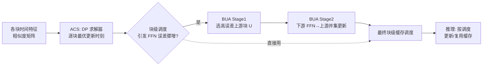

# Block-wise Adaptive Caching for Accelerating Diffusion Policy

**会议**: ICLR 2026  
**OpenReview**: [https://openreview.net/forum?id=c6ZWfQLOWD](https://openreview.net/forum?id=c6ZWfQLOWD)  
**代码**: [https://block-wise-adaptive-caching.github.io](https://block-wise-adaptive-caching.github.io)  
**领域**: 机器人 / 具身智能 · 推理加速  
**关键词**: Diffusion Policy, 特征缓存, 免训练加速, VLA, 动态规划, 误差传播  

## 一句话总结
BAC 把图像扩散里的"特征缓存"思路搬到 Diffusion Policy 上，用动态规划为每个 Transformer 子块单独排定缓存更新时刻、再用 Bubbling Union 算法掐断 FFN 块的块间误差传播，免训练即插即用地把扩散策略推理提速 3× 而几乎不掉成功率。

## 研究背景与动机
**领域现状**：Diffusion Policy 把机器人视觉运动控制建模成条件去噪采样过程，表达力强、已被大量 VLA 模型采用来做灵巧复杂操作。但它要跑 K 步迭代去噪，计算开销巨大——一个 6-DoF 机械臂做抓取，50 步去噪每步 1ms 就把动作更新率压到 10 Hz，远低于平滑实时控制需要的 30–50 Hz。

**现有痛点**：图像/视频扩散里已经有成熟的缓存加速方法（DeepCache、TeaCache、δ-DiT 等），靠去噪步间的时间冗余复用中间特征跳过重复计算。但这些方法**搬不到 Diffusion Policy 上**：① 早期方法只针对 U-Net 结构，迁不到 Transformer 骨干；② Transformer 版缓存大多用**统一调度**（所有块每隔固定间隔一起更新），粒度太粗；③ 少数细粒度方法要么需要额外训练，要么是为图像生成的特征模式量身定做，数据特性和模型结构都和动作生成对不上。

**核心矛盾**：Diffusion Policy 里特征相似度的时间动态是**非均匀**的，而且**不同块的相似度模式差异很大**（自注意力、交叉注意力、FFN 三类块各有各的变化曲线）。统一的均匀缓存调度无法贴合这种"块各不同、时段各不同"的冗余结构，导致激进缓存时成功率崩塌。

**本文目标**：设计一个为 Diffusion Policy 定制、**免训练**的特征缓存方法，在块级别自适应地决定何时更新、何时复用缓存，实现接近无损的动作生成加速。

**核心 idea**：**[块级自适应调度]** 把"选哪些时刻更新缓存"重写成一个以全局特征相似度为目标的动态规划问题，为每个块单独求最优更新时刻；**[误差传播截断]** 发现块级调度会在 FFN 块引发误差骤增（块间误差传播），用 Bubbling Union 算法强制高误差上游块先于下游 FFN 更新来掐断传播链。

## 方法详解

### 整体框架
BAC（Block-wise Adaptive Caching）由两个组件串联而成。先由 **Adaptive Caching Scheduler（ACS）** 为 DiT 解码器里每个块（SA / CA / FFN）单独算出一套最优缓存更新时刻表，把"复用导致的误差"压到最小；但单纯把调度细化到块级会在 FFN 块触发误差骤增，于是再由 **Bubbling Union Algorithm（BUA）** 修订调度，强制高误差上游块在下游 FFN 更新时一并更新，掐断块间误差传播。整个流程在推理前一次性算好（同一任务的 episode 高度同质），推理时几乎零额外成本。

### 关键设计

**1. Adaptive Caching Scheduler：把缓存排程写成动态规划。** DiT 每层含一个交叉注意力块、一个自注意力块、一个 FFN 块，层输出是三者残差之和 $h_k^{(l)} = h_k^{(l-1)} + \text{SA}_k^{(l)} + \text{CA}_k^{(l)} + \text{FFN}_k^{(l)}$。BAC 沿用"更新-复用"范式：在更新步 $k\in C$ 重新计算并刷新该块缓存 $b_k$，在复用步则直接复用最近一次更新的缓存。关键是怎么选更新集 $C$。作者用余弦相似度衡量相邻时刻特征的方向一致性 $s_k = \cos(b_k, b_{k-1})$，定义区间相似度 $\phi(i,j)=\sum_{k=i+1}^{j} s_k$（越大说明在 $[i,j]$ 上复用缓存的误差越小），把选 $M$ 个更新时刻的问题写成最大化 $\sum_{m=0}^{M}\phi(c_m, c_{m+1}-1)$。直接在指数级搜索空间里穷举不可行，于是把它**重构成动态规划**：状态 $\text{DP}[m][j]$ 表示"第 $m$ 次更新发生在时刻 $j$"时的最大累计相似度，转移为 $\text{DP}[m][j]=\max_{0\le i<j}\{\text{DP}[m-1][i]+\phi(i,j)\}$，配一个指针矩阵回溯出最优更新集 $C^*$。每个块在给定预算下各算各的 $C^*$，从而贴合块特异的相似度模式。

**2. 误差骤增现象与块间传播分析。** 把 ACS 天真地扩到块级反而会让性能崩溃——块级更新不降反增误差，在 FFN 块出现突然的误差骤增。作者拆解发现：缓存误差来自"复用"（缓存特征与漂移后的真值分布失配）和"更新"（上游块误差导致输入不准）两类；误差骤增正发生在 FFN 块的**更新步**，说明是更新过程被上游误差污染了。对 $\text{FFN}(X)=W_{out}\phi(W_{in}\text{LN}(X)+b_1)+b_2$ 做一阶展开（命题 3.1），给定上游误差 $\delta$，更新误差 $\Delta = W_{out}\,\text{diag}(\phi'(U))\,W_{in}(A-B)\delta + O(\|\delta\|^2)$，FFN 缺少中间归一化，会把上游误差线性吸收进来。Toy 实验里上游块（FFN.6）只用缓存、下游块（layer.7.FFN）全量计算，两者误差的 Pearson 相关系数高达 $r=0.9894$，强证了块间误差传播。

**3. Bubbling Union Algorithm：让高误差上游块先更新以截断传播。** 核心洞察是：如果某个 FFN 块要更新缓存，它那些误差大的上游块也应该一起更新，这样吸收进来的上游误差 $\delta$ 被压低，更新误差 $\Delta$ 随之缓解。算法分两阶段。**Stage 1 选高误差上游块**：用所有去噪时刻对之间特征的 $\ell_1$ 范数均值估计每个块的复用误差幅度 $\ell_j=\frac{1}{K^2}\sum_{t}\sum_{u}\|X_j^{(t)}-X_j^{(u)}\|_1$，取 $\ell_j$ 最大的 top-$n$ 个块构成集合 $U$。**Stage 2 自下游 FFN 向上游做更新时刻并集**：对每个上游块 $u\in U$，把它所有下游 FFN 块 $D(u)$ 的更新时刻并进自己，$C(u)=C(u)\cup\bigcup_{v\in D(u)} C(v)$，保证上游高误差块总在下游 FFN 之前更新，从而掐断误差传播链。作者刻意只处理复用误差、不管上游的更新误差（后者出现少、难可靠估计，且若都算会把所有 FFN 当上游、破坏效率精度权衡）。

## 实验关键数据

### 主实验表格（RoboMimic PH 数据，DP-T，成功率 = 最佳/末10均值，AVG/FLOPs/加速）

| 方法 | Square | Transport | Tool Hang | AVG | FLOPs | Speed× |
|---|---|---|---|---|---|---|
| Full Precision | 0.82/0.88 | 0.78/0.81 | 0.43/0.53 | 0.76 | 15.77G | – |
| Uniform(fastest) | 0.73/0.83 | 0.73/0.78 | 0.23/0.64 | 0.76 | 2.72G | 3.20 |
| TeaCache(fastest) | 0.67/0.82 | 0.77/0.52 | 0.44/0.38 | 0.72 | 2.78G | 3.14 |
| **BAC(S=10)** | **0.82/0.89** | **0.77/0.82** | **0.49/0.55** | **0.79** | 2.66G | 3.40 |

多阶段任务（Block-Pushing + Kitchen，最难的 Kitchen p4）：Uniform(fastest) AVG 仅 0.66、TeaCache 崩到 0.25，而 **BAC(S=10) 拿到 0.98**（持平全精度 0.98），加速 3.60×。

真实世界（Franka Research 3 抓软袋）：**BAC(S=7) 在 39.2 Hz 下 71% 成功率**；更激进 BAC(S=5) 达 45.1 Hz 仍保 63%。对比 DDPM(K=100) 只有 7.8 Hz/3%、DDIM(K=50) 52%、Uniform(S=20) 40%。

### 消融实验表格

| 变体 | 设计 | 最佳 AVG | 说明 |
|---|---|---|---|
| Uniform | 均匀间隔统一更新 | 基线 | 粗粒度 |
| Unified ACS | ACS 只算 layer0 SA，全块共用 | ↑ 优于 Uniform | 证明降复用误差有效 |
| Block-wise ACS | ACS 逐块各算各的 | ↓ 反低于 Unified ACS | 暴露误差骤增现象 |
| **Block-wise ACS + BUA** | 完整 BAC | **0.79（恢复全精度）** | 证明 BUA 截断传播有效 |

### 关键发现
- **块级调度不加 BUA 会反噬**：Block-wise ACS 性能反而低于 Unified ACS，实证了误差骤增；加上 BUA 后才在所有任务恢复全精度，最高 0.79。
- **难任务上优势最明显**：Kitchen p4 这类长程多阶段任务，Uniform/TeaCache 直接失效，BAC 仍能维持高成功率。
- **跨模型泛化**：在 RDT-1B VLA 上结合 DPMSolver，BAC 达 3.55× 加速且性能几乎无损（S=1 完全无损）。
- 多数任务上 BAC 稳定保持 3.4×+ 加速，甚至偶有小幅超过全精度（缓存平滑了部分噪声）。

## 亮点与洞察
- **问题重构得漂亮**：把"选缓存更新时刻"从指数搜索空间重写成动态规划，用相似度做分数、全局相似度做目标，一次预计算就拿到逐块最优解，利用 episode 同质性把开销摊到接近零。
- **诊断 + 对症下药**：不止提加速方法，还从理论（FFN 一阶展开）和实验（Pearson 0.9894、β 扰动）两头把"块级调度为何崩"定位到 FFN 缺中间归一化导致的块间误差传播，再用一个轻量并集操作精准截断，逻辑闭环。
- **真正面向实时控制**：不只报 FLOPs/加速，还在真机上量了推理频率和端到端延迟，揭示了 DDPM 因推理过慢导致"观测-动作失同步"的拖尾/回滚失败模式，把加速的实际价值落到可执行的控制频率上。
- **即插即用**：免训练、对 Transformer 版 Diffusion Policy 和 VLA 都通用，工程落地门槛低。

## 局限与展望
- **依赖 episode 同质性**：调度在推理前一次算好，假设同一任务内各 episode 特征模式相近；任务分布漂移大或在线适应场景下，固定调度可能失准，需要重算或在线更新机制。
- **只针对 Transformer 骨干**：方法基于 DiT 的 SA/CA/FFN 块结构，对 U-Net 版 Diffusion Policy 不直接适用。
- **BUA 是近似处理**：刻意忽略上游块的更新误差（出现少、难估计），在某些极端块间耦合下可能仍有残余传播；top-$n$ 的 $n$ 是手调超参（仿真 5、真机 3），自动化选取留作空间。
- **加速上限**：报告主要在 ~3× 区间，更激进缓存（S 更小）会开始掉点，离"任意预算下都无损"还有距离。

## 相关工作与启发
- **扩散缓存谱系**：DeepCache（U-Net 高层特征缓存）→ TeaCache / δ-DiT / 各类 Transformer 缓存（统一/均匀调度）→ 本文把它推进到"块级自适应 + 误差传播感知"，是缓存粒度演进的自然一步。
- **对加速研究的启发**：细粒度调度不是免费午餐——粒度变细会放大块间误差耦合，**先做误差传播分析再做调度**比盲目细化更重要；"用一次预计算的 DP 排程换运行时零开销"这一范式可迁移到其他迭代式推理（如一致性模型、级联生成）。
- **对机器人控制的启发**：实时性是 Diffusion Policy/VLA 落地的硬约束，把图像扩散的加速工具按动作生成的数据特性重新定制，是 VLA 工程化的一条务实路径。

## 评分
- **新颖性**: ⭐⭐⭐⭐ — 首个为 Diffusion Policy 定制的块级自适应缓存，DP 排程 + 误差传播截断的组合有原创性，虽然单个组件（缓存、DP）非全新，但问题重构和误差分析有真洞察。
- **实验充分度**: ⭐⭐⭐⭐ — 覆盖 RoboMimic(PH/MH)、Push-T、Block-Pushing、Kitchen、ManiSkill 多基准，仿真+真机+VLA(RDT-1B) 三层验证，消融清晰，理论命题 + Toy 实验支撑机理。
- **写作质量**: ⭐⭐⭐⭐ — 动机—观察—方法—诊断—修复的叙事闭环顺畅，图表（相似度矩阵、误差骤增、传播链）有效，公式与直觉解释配合到位。
- **价值**: ⭐⭐⭐⭐ — 免训练即插即用、3× 实时加速直击 Diffusion Policy 落地痛点，对机器人实时控制和 VLA 部署有直接实用价值。

<!-- RELATED:START -->

## 相关论文

- [\[ICLR 2026\] H$^3$DP: Triply-Hierarchical Diffusion Policy for Visuomotor Learning](h3dp_triplyhierarchical_diffusion_policy_for_visuomotor_learning.md)
- [\[ICLR 2026\] Unified Diffusion VLA: Vision-Language-Action Model via Joint Discrete Denoising Diffusion Process](unified_diffusion_vla_vision-language-action_model_via_joint_discrete_denosing_d.md)
- [\[CVPR 2026\] GraspLDP: Towards Generalizable Grasping Policy via Latent Diffusion](../../CVPR2026/robotics/graspldp_towards_generalizable_grasping_policy_via_latent_diffusion.md)
- [\[NeurIPS 2025\] VLA-Cache: Efficient Vision-Language-Action Manipulation via Adaptive Token Caching](../../NeurIPS2025/robotics/vla-cache_efficient_vision-language-action_manipulation_via_adaptive_token_cachi.md)
- [\[ICLR 2026\] Compositional Diffusion with Guided Search for Long-Horizon Planning](compositional_diffusion_with_guided_search_for_long-horizon_planning.md)

<!-- RELATED:END -->
