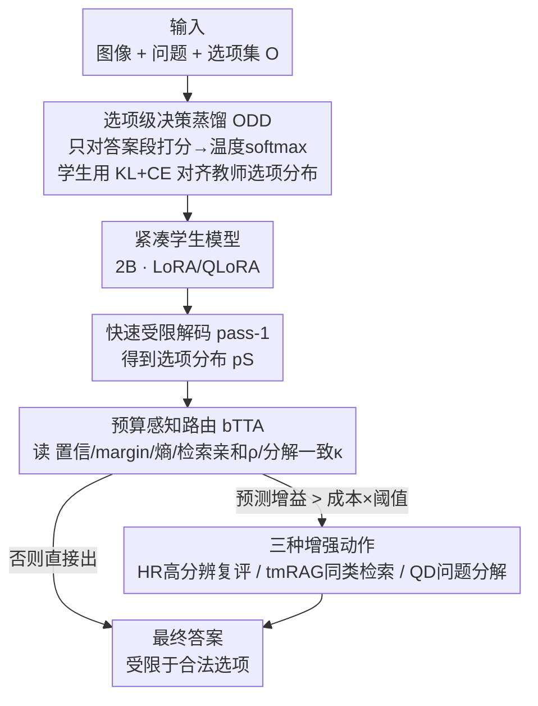

# BOLT: Decision‑Aligned Distillation and Budget-Aware Routing for Constrained Multimodal QA on Robots

**会议**: ICLR2026  
**OpenReview**: [https://openreview.net/forum?id=Vsy3nAnaX6](https://openreview.net/forum?id=Vsy3nAnaX6)
**代码**: https://github.com/A-leyenda/BOLT  
**领域**: VLM效率 / 知识蒸馏 / 自适应推理 / 机器人多模态问答  
**关键词**: 决策对齐蒸馏, 预算感知路由, 受限解码, 紧凑VLM, 校准

## 一句话总结
BOLT 把"机器人上的受限多选题问答"拆成训练期的**选项级决策蒸馏**（让 2B 小模型直接对齐 13B 教师在选项集上的偏好）和推理期的**预算感知路由**（只在便宜信号预示有正收益时才触发高分辨复评/同类检索/问题分解），用 2B 学生在 Robo2VLM-1 上做到 50.50% 准确率、反超 36.74% 的 13B 教师，同时把显存从 26.9GB 压到 3.8GB、能耗降 82.5%。

## 研究背景与动机
**领域现状**：机器人和嵌入式平台越来越想用视觉语言模型（VLM）做感知与决策。很多机器人 benchmark 采用"受限输出"形式——答案被框死在一个有限选项集里（颜色、箭头方向、A–E 选项、yes/no），因为这种确定性接口便于安全检查、便于实时控制回路。但大 VLM（如 LLaVA-1.5-13B）在边缘硬件上跑不动：延迟、显存、能耗都超预算。

**现有痛点**：把大模型能力搬到小模型上，主流有几条路，但都不对症。① **Token 级知识蒸馏**（从文本 LM 继承而来）在某个 prompt 模板下对齐"表面字符序列"，而不是受限解码真正用到的"选项集上的决策面"，导致学生脆弱、和评测脱节；它还把 prompt 模板的措辞差异和答案学习搅在一起，惩罚了评测时根本无关的用词。② **常开的测试时增强**（高分辨复评、检索增强提示）能涨点，但一律打开就违反预算，朴素的问题分解还可能引入和图像证据矛盾的伪步骤。③ 紧凑 VLM 普遍**校准不足**，让基于置信度的选择性计算/弃答失效；小模型**幻觉**仍严重，且可解释性差——常常说不清一个决策为什么这么做、靠的是哪条证据。

**核心矛盾**：要在"决策质量"和"延迟/显存/能耗预算"之间同时达标。现有方法要么对齐错了目标（token 而非选项决策面），要么用算力换精度时一刀切（常开增强）。很少有工作能在严格的端上预算下，**同时**提升决策准确率、提升可解释性、抑制幻觉。

**本文目标**：分解为两个子问题——训练期如何把教师的"选项级决策质量"忠实迁移到紧凑学生；推理期如何在显式算力预算下，只在划算时才加码计算。

**切入角度**：作者的关键观察是——受限多选题的本质是一个**决策面**（在选项集上的偏好排序）。既然评测就发生在这个决策面上，那训练就应该直接在选项层面对齐教师，推理就应该把额外算力**有选择地**花在这个决策面上最不确定的样本上。

**核心 idea**：训练用"选项级决策蒸馏"（只对答案段打分、对齐教师选项分布），推理用"预算感知的风险校准路由"（便宜信号预测正收益时才触发高成本增强），把决策对齐和选择性计算统一起来。

## 方法详解

### 整体框架
BOLT（Budgeted Option-Level Transfer）是一个面向机器人受限多模态问答的"决策中心"框架，目标是用小模型成本拿到大模型决策质量。它分两个阶段：**离线训练**用选项级决策蒸馏（ODD）把 13B 教师在选项集上的偏好灌进 2B 学生；**在线推理**先让蒸馏学生做一次快速受限解码（pass-1），再由一个预算感知路由器（bTTA）读取若干便宜信号，决定是否触发高分辨复评、同类检索、问题分解这三种增强。

问题设定：每个样本是 $(x, q, O, y)$，$x$ 是图像/面板布局，$q$ 是问题，$O=\{o_1,\dots,o_K\}$ 是有限选项集，$y$ 是真值索引。模型在受限解码下必须输出 $O$ 中恰好一个选项文本。关键技巧是只对"答案段"打分——固定一个 chat 模板把 $(x,q)$ 放 user 轮、答案放 assistant 轮，对选项 $o_k$ 的答案段 token 求对数似然之和：

$$s_M(k\mid x,q) := \sum_{t\in A(k)} \log p_M\!\left(a^{(k)}_{t-L_0}\mid z^{(k)}_{<t}\right)$$

这把 prompt 模板措辞从监督信号里剥掉，精确聚焦在受限解码真正评测的那一段。

### 关键设计

**1. 选项级决策蒸馏 ODD：把蒸馏目标从 token 换成选项决策面**

针对"token 级 KD 对齐错了目标"的痛点，ODD 不再逐 token 模仿，而是对每个选项只取答案段的对数似然之和作为该选项的分数，再用温度 softmax 把教师分数转成一个校准过的选项偏好分布：

$$p_T(k\mid x,q) = \frac{\exp(s_T(k)/\tau_{kd})}{\sum_{j=1}^{K}\exp(s_T(j)/\tau_{kd})}$$

教师分布 $\{p_T(k)\}$ 对所有训练样本**离线缓存**，训练时学生只和这个固定分布比，不用反复 query 教师；部署时更是完全不碰教师。学生用相同的 softmax 形式（不带温度）从自己的答案段分数构造选项分布 $p_S$，于是两个模型落在同一个"prompt 无关"的选项概率单纯形上。最终优化一个决策对齐损失——KL 把整个学生分布拉向教师，再加一个很小的交叉熵锚定真值：

$$\mathcal{L}_{ODD}(\theta) = \lambda_{KL}\,\mathrm{KL}(p_T\,\|\,p_S) + \lambda_{CE}\,\mathrm{CE}(\delta_y\,\|\,p_S)$$

直觉是 KL 项塑造学生的决策面（匹配教师对候选答案的偏好），小 CE 项做真值锚定、稳定训练、保住稀有选项召回、纠正教师在歧义样本上的偏差。这个目标对所有 $s_\theta(k)$ 同加常数不变、对良性 tokenization 变化鲁棒（因为序列对数似然之和不随 token 切分方式改变）；选项串长度差异大时还可做轻量长度偏置校正 $\tilde s_\theta(k)=s_\theta(k)-\gamma\log L_k$。它直接命中受限解码实现的决策面，避开了 token 级蒸馏里"prompt 和答案互相拉扯"的问题。学生只训 LoRA 适配器、底座用 QLoRA 量化，单卡即可。

**2. 预算感知路由 bTTA：把额外算力只花在划算的样本上**

针对"常开增强一律涨成本"的痛点，bTTA 把每个样本的额外计算建模成带成本的动作选择。蒸馏学生先做一次快速受限 pass-1，从选项分布 $p_S$ 抽出一组便宜的路由特征：置信 $p_{\max}=\max_k p_S(k)$、间隔 $\Delta=p_{(1)}-p_{(2)}$、熵 $H=-\sum_k p_S(k)\log p_S(k)$，再补上**同类检索亲和度** $\rho$（top-$K_r$ 同类型样本的余弦相似度均值，memory 只存同类型项以避免跨类干扰）和**短分解一致度** $\kappa$（多个独立分解之间 JS 散度的反向度量，越一致越大）。特征向量 $f=[p_{\max},\Delta,H,\rho,\kappa]$ 驱动路由。

每个动作 $a$ 有归一化成本 $C_a$ 和一个在验证日志上学到的增益模型 $g_\omega(f,a)\approx\Pr[\Delta\mathrm{Acc}_a=1\mid f]$，单样本决策解一个预算约束下的 0/1 背包：$\max_{\alpha_a}\sum_a \alpha_a g_\omega(f,a)W_a$ s.t. $\sum_a \alpha_a C_a\le B$。其拉格朗日松弛给出一个简单的近阈值规则：

$$\text{触发 } a \iff g_\omega(f,a)\,W_a \ge \tau\,C_a,\quad \text{累计成本} \le B$$

即"预测增益超过成本一个阈值 $\tau$ 才触发"，$\tau$ 在验证集上调以满足平均预算并最大化准确率；因为各动作收益递减，按净值贪心选择已是很强的近似。这比单信号的早退/HR 阈值基线更好，因为它同时决定"要不要加码"和"加码哪个增强"。

**3. 三种增强动作 HR / tmRAG / QD：各由对应信号门控**

三个动作各补一类短板，且实验诊断显示它们恰好被不同信号门控。**HR（高分辨复评）**把图像换成更大短边再做一次受限解码，修的是分辨率受限的错误，主要由熵 $H$ 门控。**tmRAG（同类检索范例）**按编码空间余弦相似度取 top-$K_r$ 个**同类型**范例 (desc, q, a) 拼进 prompt 让学生重答，补的是领域知识，主要由检索亲和度 $\rho$ 门控。**QD（问题分解）**用不同种子/few-shot 排列生成 $K_d$ 个短分解（两三个检查点），产出多个分布后投票聚合 $\hat p_S(\cdot)=\frac{1}{K_d}\sum_k p^{(k)}_S(\cdot)$，降的是难题上的推理方差，主要由一致度 $\kappa$ 门控，而 $\kappa$ 又反馈回路由去压制没用的分解。因为路由依赖概率，作者还在验证集上做温度缩放 $p^{cal}_S$ 来校准 $p_{\max}$/margin/熵。

**4. 受限解码：用接口本身消除字符级幻觉并提供可解释证据**

把输出强行限制在合法选项集，本身就**从设计上**消除了字符形式的幻觉（无效选项输出率 IOR=0），并把"none of the above"哨兵的误用从 zero-shot 的 1.08% 降到 ODD pass-1 的 0.37%、ODD+bTTA 的 0.22%。同时 tmRAG 暴露检索到的证据、QD 暴露分解轨迹，让决策有人可检查的证据链——可解释性不是额外加的模块，而是接口和增强动作的副产品。代价是 tmRAG 会引入检索驱动的幻觉（检索冲突率 RCR 21.73%），这是 RAG 类方法的通病。

### 损失函数 / 训练策略
训练只用 ODD 损失 $\mathcal{L}_{ODD}=\lambda_{KL}\mathrm{KL}(p_T\|p_S)+\lambda_{CE}\mathrm{CE}(\delta_y\|p_S)$，$\tau_{kd}$ 和 CE 权重在验证集上调。学生是 Qwen2-VL-2B-Instruct，用 LoRA/QLoRA 训注意力和 MLP 投影（可选多模态投影器），梯度只流过适配器路径，单卡可训。推理时三个动作的固定单次触发成本为 $(C_{HR},C_{tmRAG},C_{QD})=(0.50,0.30,0.35)$，基础受限 pass 成本 1.00，预算 $B$ 从 1.00 扫到约 2.00 时增益饱和。

## 实验关键数据

### 主实验
基准是 Robo2VLM-1（面板式机器人感知 QA，受限选项集），按图像唯一 id 切成 train-kd（只用来建教师选项分布缓存）/ val（路由校准+温度缩放）/ test 三个不重叠子集，检索 memory 和分解范例只从 train-kd 构造以防泄漏。

| 模型 | 参数量 | 准确率(%) |
|------|--------|-----------|
| LLaVA-1.5-13B（教师, zero-shot） | 13B | 36.74 |
| Qwen2-VL-2B（zero-shot） | 2B | 28.66 |
| 2B 学生（LLaVA-13B → Token-KD） | 2B | 37.58 |
| 2B 学生（LLaVA-13B → Token-KD）+ bTTA | 2B | 47.02 |
| **2B 学生（LLaVA-13B → ODD, 本文）** | 2B | **42.89** |
| **2B 学生（LLaVA-13B → ODD）+ bTTA** | 2B | **50.50** |

2B 学生光靠 ODD 就到 42.89%，**反超 36.74% 的 13B 教师**；加 bTTA 进一步到 50.50%。同设置下 ODD 比 Token-KD 高 5.31 点（42.89 vs 37.58），加 bTTA 后仍领先（50.50 vs 47.02）。跨教师（LLaVA-7B / Qwen2.5-VL-7B）和跨学生架构（PaliGemma2-3B）结论一致：ODD 都稳压 Token-KD。

### 消融实验

| 配置 | HR | tmRAG | QD | 准确率(%) |
|------|----|-------|----|-----------|
| ODD 学生（pass-1） | N | N | N | 42.89 |
| + tmRAG | N | Y | N | 44.31 |
| + QD | N | N | Y | 45.47 |
| + HR | Y | N | N | 46.64 |
| + HR + tmRAG | Y | Y | N | 48.25 |
| + HR + QD | Y | N | Y | 48.92 |
| + 全部三个 | Y | Y | Y | 50.50 |

三个增强的增益单调且近似可加，支持"只触发预测增益超成本的动作"的路由设计。系统开销上：2B 学生占 3,035 MB（比 13B 教师 26,878 MB 省 88.7%），开全部增强也只到 3,817 MB（仅多 782 MB，约为教师的 1/7）；端到端整条 BOLT 管线 50.50% 准确率、8.97s 延迟、1,522J 能耗，相对教师（36.74%、22.30s、8,697J）约 2.5× 加速、能耗降 82.5%、准确率提升 13.8 点。

### 关键发现
- **HR 单项贡献最大**（42.89→46.64），其次 QD（45.47）、tmRAG（44.31）；三者组合 50.50% 近似可加。
- **特征-动作对应清晰**：增益模型诊断显示 HR 主要被熵 $H$ 门控、tmRAG 被检索亲和度 $\rho$ 门控、QD 被一致度 $\kappa$ 门控，和路由设计自洽。
- **幻觉随增强下降**：受限接口令字符级幻觉 IOR=0，NOA 误用 1.08%→0.22%，高置信错误 OCW@0.7 从 4.18%→0.19%；路由让 26.71% 的标签相对 pass-1 翻转，纠正了不确定样本。残余风险主要来自检索质量（RCR 21.73%）。
- 预算 $B$ 从 1.00 扫到 ≈2.00 时准确率单调上升后饱和；相比单信号动态计算基线（HR 阈值、单分支早退），本文路由多 ~1.4–2.2 点、ECE/AURC 更低。

## 亮点与洞察
- **"对齐评测真正用到的决策面"这个视角很干净**：受限多选题评测发生在选项集上，那训练就该在选项层面对齐、只对答案段打分——一句话把 token 级 KD 的"prompt-答案拉扯"问题绕开了，且对 tokenization 鲁棒。
- **把测试时增强写成带成本的背包+近阈值规则**，可解释、可调预算：$g_\omega(f,a)W_a\ge\tau C_a$ 让"何时加码、加码哪个"变成一个能在验证集上调的策略，而不是一刀切常开。
- **三个增强动作恰好各被一个便宜信号门控**（熵→HR、检索亲和→tmRAG、一致度→QD），既是设计也是诊断结果，迁移性强：换个受限多选 QA 任务，这套"特征→动作"门控可以直接复用。
- **可解释性是接口和动作的副产品而非额外负担**：受限输出消除字符幻觉、tmRAG/QD 暴露证据与分解轨迹，对机器人这种要安全检查的场景很实用。

## 局限与展望
- 只在单一面板式机器人 VQA 基准 Robo2VLM-1 上评测——作者也承认机器人多选 VQA 数据集稀缺；方法虽声称模态无关，但跨数据集泛化未充分验证。
- **tmRAG 引入检索驱动幻觉**（RCR 21.73%）：当范例和查询不完全匹配时会和图像一致的答案冲突，是 RAG 管线通病。
- 当前算子点（8.97s/题、0.11 QPS）适合高层感知/规划回路，**严格实时的低层控制还做不到**，需进一步工程优化。
- 蒸馏是纯离线监督，未利用机器人交互日志；未来想做 on-policy 决策蒸馏、用冲突感知的范例过滤替换 tmRAG、把延迟/能耗作为显式优化目标。

## 相关工作与启发
- **vs Token 级知识蒸馏（Hinton 2015 / Kim&Rush 2016）**: 他们在 token/序列层面 logit 匹配，本文在选项决策面上对齐；区别在于剥离了 prompt 模板措辞、直接匹配受限解码真正评测的目标，实验上 ODD 稳压 Token-KD 4–5 点。
- **vs 常开测试时增强 / RAG（Lewis 2020 等）**: 他们一律打开高分辨/检索，本文用预算感知路由按样本门控，只在预测正收益时触发，换来更好的"准确率-预算"和"风险-覆盖"前沿。
- **vs 选择性预测 / 早退 / 自适应计算（Geifman&El-Yaniv 2017, Teerapittayanon 2016, Figurnov 2017）**: 他们多用单一置信信号决定弃答/早退，本文把不确定性、检索亲和、分解一致度耦合进一个多动作路由，既决定"要不要加码"也决定"加码哪个"。
- **vs 参数高效微调（LoRA/QLoRA）**: 本文复用它们降训练成本，但 PEFT 本身不解决决策对齐或预算化推理，ODD+bTTA 是正交补充。

## 评分
- 新颖性: ⭐⭐⭐⭐ "把受限多选 QA 重构成决策面对齐 + 预算化路由"的视角清晰，ODD 和 bTTA 都简洁有效
- 实验充分度: ⭐⭐⭐ 跨教师/跨学生架构、消融、校准、幻觉、能耗都覆盖了，但只在单一基准 Robo2VLM-1 上做，泛化证据偏弱
- 写作质量: ⭐⭐⭐⭐ 动机-方法-实验链路完整，公式和路由规则讲得明白
- 价值: ⭐⭐⭐⭐ 让 2B 学生反超 13B 教师且显存降 88.7%、能耗降 82.5%，对边缘机器人部署很实用

<!-- RELATED:START -->

## 相关论文

- [\[ICLR 2026\] VER: Vision Expert Transformer for Robot Learning via Foundation Distillation and Dynamic Routing](ver_vision_expert_transformer_for_robot_learning_via_foundation_distillation_and.md)
- [\[ICLR 2026\] Accelerated co-design of robots through morphological pretraining](accelerated_co-design_of_robots_through_morphological_pretraining.md)
- [\[NeurIPS 2025\] CogVLA: Cognition-Aligned Vision-Language-Action Model via Instruction-Driven Routing & Sparsification](../../NeurIPS2025/robotics/cogvla_cognition-aligned_vision-language-action_model_via_instruction-driven_rou.md)
- [\[ICLR 2026\] RRNCO: Towards Real-World Routing with Neural Combinatorial Optimization](rrnco_towards_real-world_routing_with_neural_combinatorial_optimization.md)
- [\[ICLR 2026\] Difference-Aware Retrieval Policies for Imitation Learning](difference-aware_retrieval_policies_for_imitation_learning.md)

<!-- RELATED:END -->
