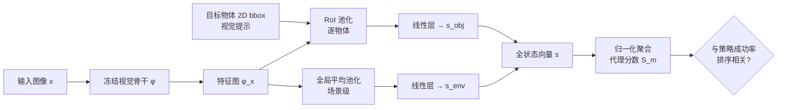

# Capturing Visual Environment Structure Correlates with Control Performance

**会议**: ICLR 2026  
**OpenReview**: [https://openreview.net/forum?id=AmczI1k3Yk](https://openreview.net/forum?id=AmczI1k3Yk)  
**代码**: 项目主页（论文 abstract 注明 Code and models available）  
**领域**: 机器人 / 具身智能（视觉表征选择）  
**关键词**: 视觉表征, 机器人操作, 状态预测, 代理指标, 仿真到现实, 世界状态建模  

## 一句话总结
作者提出用「从图像回归仿真器全状态（几何/物体结构/物理属性）」作为一个轻量代理任务，证明这个探测精度与下游机器人策略成功率高度相关，从而能在不跑 policy rollout 的情况下高效挑选视觉骨干网络。

## 研究背景与动机
- **领域现状**: 通用机器人操作策略严重依赖预训练视觉表征，但「哪个骨干网络最好」只能靠跑策略 rollout 来评估，即使在仿真里也极其昂贵且慢，成为制约迭代速度的瓶颈。
- **现有痛点**: 已有的代理指标（如 Burns et al. 2024 的分割精度、ImageNet 识别、shape bias、深度估计）都只刻画视觉世界的**某个狭窄侧面**（比如物体形状），导致它们在跨环境时泛化能力很差——在 RoboCasa 上有效的分割指标到了 MetaWorld 就失灵。
- **核心矛盾**: 控制任务真正需要的是对环境**完整物理状态**（位姿、几何、材质、关节、光照）的编码能力，而单一侧面指标抓不住这个整体性需求；但真实场景又拿不到这些状态标签。
- **本文目标**: 找到一个**便宜、policy-free、跨环境泛化**的代理指标，可靠预测某个视觉表征用于控制时的好坏。
- **核心 idea**: **【关键洞察】** 仿真器天然免费提供世界全状态标签，于是把「从图像解码环境全状态」当成探测任务——一个表征能多准地恢复底层物理状态，就是它对控制有多大用处的强信号。

## 方法详解

### 整体框架
方法把任意视觉骨干当作冻结特征提取器，外挂一个轻量「状态预测头」，让它从单张图像回归出仿真器提供的紧凑全状态向量；预测精度经归一化聚合成单一代理分数 $S_m$，再用排序相关性衡量它与策略成功率的吻合度。整条链路无需训练或评估任何 policy。

### 关键设计

**1. 统一低维全状态表示：把异构环境状态压成一个任务无关的向量**，这样回归误差就能直接反映表征捕获物理结构的能力，而不掺杂感知噪声。状态被拆成 $N_o$ 个物体级向量加 1 个场景级向量：每个物体 $s_{obj,i}=[p^i_{pose}, q^i_{pose}, s^i_{shape}, m^i_{mat}]\in\mathbb{R}^{3+4+3+M}$ 含 3D 位置、四元数朝向、包围盒尺寸和 one-hot 材质；场景级 $s_{env}=[\ell, q_J, p_{ee}]\in\mathbb{R}^{1+N_j+N_{ee}}$ 含光照类别、机器人关节角和末端执行器位姿。拼接成 $s\in\mathbb{R}^D$，$D=N_o(3+4+3+M)+(1+N_j+N_{ee})$。这种「物体级 + 场景级」的解耦既能逐物体分析（位姿/形状/材质），又能整体分析（光照/关节/末端），且对新仿真环境开箱即用。

**2. 视觉提示的单次前向状态预测：用 2D 包围盒消除多物体歧义**，让骨干知道「该看哪里」。对每个目标物体框 $b_i$，在特征图上做 RoI 平均池化 $u_i=\frac{1}{|b_i|}\sum_{(u,v)\in b_i}\phi(x)_{u,v}$ 再过单层线性映射到 $s_{obj,i}$；对场景级因素则做全局平均池化 $v=\frac{1}{HW}\sum_{u,v}\phi(x)_{u,v}$ 映射到 $s_{env}$。所有状态向量在一次前向里同时输出，不可见物体被 mask 掉，保证了代理指标的「轻量」属性。

**3. 离散/连续状态分而治之的编码与损失**：材质、光照、量化后的形状箱用 one-hot 表示、softmax 预测、交叉熵训练；位置 $p_{pose}$、旋转 $q_{pose}$、关节角、末端位姿这些与动作规划紧密相关的量则做逐维标准化 $z_i=\frac{x_i-\mu_i}{\sigma_i}$ 后用 L2 回归。这种区分让每类状态都用最合适的监督方式，回归误差才能真实反映表征质量。

**4. 排序相关性评估协议：用 MMRV 而非绝对数值衡量代理可靠性**。对类别状态取分类精度、连续状态取负 MSE，逐状态做 min-max 归一化后取均值得到代理分数 $S_m=\frac{1}{|A|}\sum_{a\in A}\frac{r_{m,a}-\min r_{\tilde m,a}}{\max r_{\tilde m,a}-\min r_{\tilde m,a}}$。再用 Mean Maximum Rank Violation 衡量它与策略成功率的排序一致性：先算成对违例 $\text{RankViolation}_{ij}=|R_i-R_j|\cdot\mathbb{1}[(S_i<S_j)\neq(R_i<R_j)]$，再取每个策略的最坏情况均值 $\text{MMRV}=\frac{1}{N}\sum_i \max_j \text{RankViolation}_{ij}$，并辅以 Pearson $r$。低 MMRV、高 $r$ 即代表代理能可靠替代昂贵的策略训练来给骨干排序。

## 实验关键数据

### 主实验：代理排序相关性（MMRV ↓ / Pearson r ↑）
在三类仿真环境（MetaWorld、RoboCasa、SimplerEnv 的 Google Robot 与 WidowX）上，对 9 个预训练骨干比较 7 种代理指标：

| 代理指标 | 平均 MMRV ↓ | 平均 Pearson r ↑ |
|---|---|---|
| Few-Shot（需评估策略） | 0.068 | 0.347 |
| Action MSE（需训练策略） | 0.089 | -0.294 |
| ImageNet 识别 | 0.141 | -0.020 |
| Shape Bias | 0.093 | -0.069 |
| Segmentation (Burns 2024) | 0.105 | -0.042 |
| Depth | 0.096 | -0.071 |
| **本文状态预测** | **0.035** | **0.753** |

本文 policy-free 代理在所有四个环境上 MMRV 全面最低，平均相关性 0.753 远超第二名，甚至胜过有特权（直接访问策略）的 Few-Shot 和 Action MSE。单环境最高相关达 SimplerEnv-G 的 $r=0.871$、MMRV=0.023。

### 消融：各状态维度的预测力（MMRV ↓）

| 环境 | $s_{shape}$ | $q_{pose}$ | $p_{ee}$ | Full $(S_m)$ |
|---|---|---|---|---|
| MetaWorld | 0.032 | 0.089 | 0.069 | **0.037** |
| RoboCasa | 0.011 | 0.017 | 0.027 | **0.010** |
| SimplerEnv (G) | 0.082 | 0.100 | 0.038 | **0.023** |
| SimplerEnv (W) | 0.126 | 0.032 | 0.048 | **0.069** |

不同环境对表征的需求不同：MetaWorld/RoboCasa 依赖 2D 物体定位（$s_{shape}$），SimplerEnv 更看重 3D 末端位姿 $p_{ee}$ 和物体朝向 $q_{pose}$；但回归**整个状态向量**的 Full 版始终最稳，是一个通用代理。

### 关键发现
- **没有万能表征**：MetaWorld（非真实感画面）偏好 ImageNet 骨干，CLIP/DINOv2 因分布偏移反而拉胯；RoboCasa 偏好擅长物体定位的 DINOv1/v2；SimplerEnv 偏好用真实机器人数据预训练的 R3M。
- **Sim 结论可迁到真实**：在物理 Xarm6 上复现两个 WidowX 任务，仿真状态预测精度与真实成功率的 MMRV/$r$ 和纯仿真结果相当，跨越了显著域差。
- **状态预测还能当训练目标**：联合优化 $L_{joint}=L_{policy}+\lambda L_{state}$ 后，ViT-IN/MoCoV3/MAE/CLIP/DINOv2 在 MetaWorld 上成功率一致提升（如 CLIP 0.765→0.801，DINOv2 0.767→0.795），说明「学会编码全状态」本身就是有益的表征学习信号。

## 亮点与洞察
- **把昂贵的策略评估换成一次廉价前向**：免费利用仿真器的全状态标签做探测，绕开了最贵的 policy rollout，是工程上极实用的「选骨干」工具。
- **「整体性」打败「单侧面」**：实验有力证明了刻画完整物理状态比单测分割/深度/形状更能跨环境泛化，从机制上解释了为何已有代理指标会失灵。
- **代理任务反过来成为训练目标**：状态预测既能选模型又能涨点，暗示了「预测式世界建模」是改进控制视觉表征的有前途方向。

## 局限与展望
- **强依赖仿真器全状态标签**：方法的代理打分必须在能提供 ground-truth state 的仿真环境里做，真实世界本身无法直接计算代理分数（只能靠 sim 代理 + 迁移假设）。
- **视觉提示需要 2D 包围盒**：多物体场景要先有目标框，引入了对检测/标注的额外依赖。
- **骨干与策略架构有限**：主实验用冻结骨干 + 多任务扩散策略，虽附录补了微调与其他 BC 算法，但结论对更大规模 VLA、更多策略族的稳健性仍待验证。
- **相关性≠因果**：高状态预测精度与成功率强相关，但在成功率接近的骨干间区分度下降（论文也承认误差主要来自此），作为细粒度排序工具仍有上限。

## 相关工作与启发
- **重建式预训练谱系**：MVP/RPT/R3M 等用掩码重建或对比学习从机器人视频学表征，本文的「全状态回归」可看作把「重建稀疏环境状态」这一思想显式化、可度量化。
- **表征分析谱系**：Qi et al. (2025) 发现 BC 训练的表征会向任务相关状态聚类，本文进一步在状态空间层面量化「哪些状态维度驱动操作性能」。
- **Sim-to-real 评估谱系**：延续 SimplerEnv（Li et al. 2024）「仿真能忠实代理真实排名」的思路，并把它从策略排名推广到表征排名。
- **启发**：这条「用免费仿真标签构造可度量代理，再验证其与真实下游强相关」的方法论，可迁移到导航、抓取、甚至非机器人的具身感知任务上。

## 评分
- **新颖性**: ⭐⭐⭐⭐ — 「全状态回归作为 policy-free 代理」视角清晰且反直觉地胜过有特权的基线，把分散的分析工作收敛到一个统一、可操作的指标。
- **实验充分度**: ⭐⭐⭐⭐ — 覆盖 3 类仿真 + 4 个域 + 9 个骨干 + 7 个对比代理 + 真机验证 + 训练目标增益，证据链完整；扣分在策略族略单一。
- **写作质量**: ⭐⭐⭐⭐ — 动机—方法—验证逻辑顺畅，图表（相关性散点、MMRV 表）支撑有力，公式定义清楚。
- **价值**: ⭐⭐⭐⭐ — 给「选视觉骨干」提供了便宜可靠的实用工具，并指向状态预测作为表征学习目标的新方向，对具身领域有直接落地价值。

<!-- RELATED:START -->

## 相关论文

- [\[ICLR 2026\] WorldGym: World Model as an Environment for Policy Evaluation](worldgym_world_model_as_an_environment_for_policy_evaluation.md)
- [\[ICLR 2026\] MolLangBench: A Comprehensive Benchmark for Language-Prompted Molecular Structure Recognition, Editing, and Generation](mollangbench_a_comprehensive_benchmark_for_language-prompted_molecular_structure.md)
- [\[CVPR 2026\] EgoRoC: Towards Egocentric Robotic Control via Task-Agnostic Visual Alignment](../../CVPR2026/robotics/egoroc_towards_egocentric_robotic_control_via_task-agnostic_visual_alignment.md)
- [\[ICLR 2026\] On Entropy Control in LLM-RL Algorithms](on_entropy_control_in_llm-rl_algorithms.md)
- [\[AAAI 2026\] Towards Reinforcement Learning from Neural Feedback: Mapping fNIRS Signals to Agent Performance](../../AAAI2026/robotics/towards_reinforcement_learning_from_neural_feedback_mapping_.md)

<!-- RELATED:END -->
