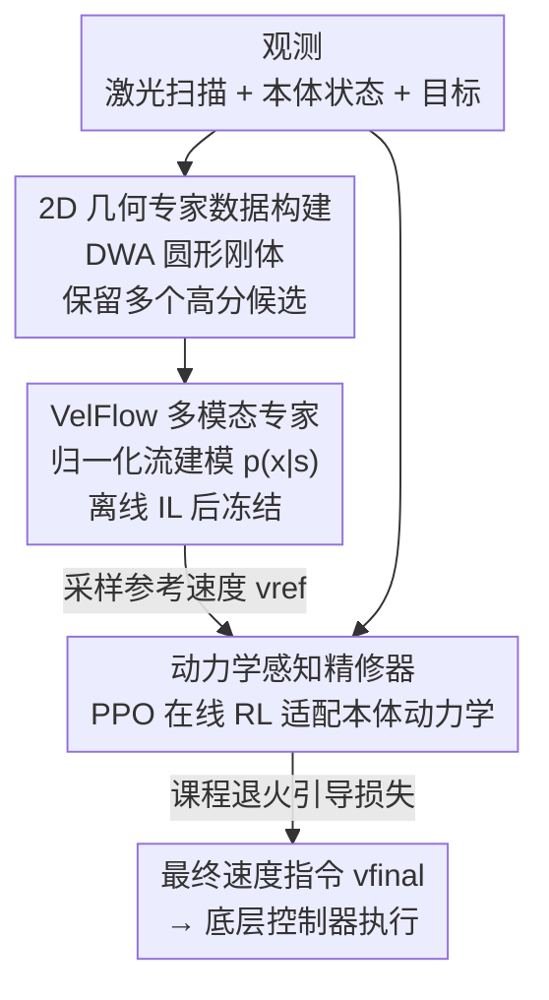

# CE-Nav: Flow-Guided Reinforcement Refinement for Cross-Embodiment Local Navigation

**会议**: ICLR2026  
**OpenReview**: [https://openreview.net/forum?id=apaLoTumdO](https://openreview.net/forum?id=apaLoTumdO)
**代码**: 待确认  
**领域**: 机器人 / 跨形态导航  
**关键词**: 跨形态导航, 归一化流, 模仿学习, 强化学习, 多模态决策

## 一句话总结
CE-Nav 用「先离线模仿学一个不依赖任何机器人本体、只懂几何避障的归一化流专家（VelFlow），再冻结它当先验、用轻量在线 RL 精修器去适配每个新机器人具体动力学」的两阶段框架，在四足/双足/四旋翼上都拿到 SOTA 导航性能，且把适配新机器人的训练时间从 50 小时压到 6 小时。

## 研究背景与动机

**领域现状**：让一个局部导航策略能跨不同形态的机器人（四足狗、双足人形、四旋翼）复用，是移动机器人的核心难题。当前学习类做法分两极：一端是端到端（E2E）策略，直接把传感器观测映射到底层关节指令，强但把高层规划和机器人具体动力学死死缠在一起，换平台就崩；另一端是分层方法，先规划出路点（waypoint）序列，把规划和控制解耦，但高层规划器是在一个理想化的控制器模型上做决策，无法补偿未建模的动力学和跟踪误差。

**现有痛点**：介于两者之间的「分层速度规划」（高层输出 $(v_x, v_y, v_{yaw})$ 体速度指令、底层控制器去跟踪）被认为是更稳的中间路线，但它有两个致命瓶颈。其一是**专家数据带本体偏置**：要么用某台真机采轨迹、要么用基于物理的仿真，数据天然偏向那台机器人，泛化和可扩展性都受限，且成本高。其二是**确定性学习范式**：把导航当成确定性回归任务，根本无法表达导航本身的多模态性——在 T 字路口左转还是右转都对，确定性模型会把两个正确动作平均成「直直撞上去」，论文称之为「灾难性平均（disastrous averaging）」。

**核心矛盾**：通用的几何推理（避障逻辑，跟谁开都一样）和本体专属的动力学适配（这台机器人响应慢、有跟踪误差）被混在一个模型里同时学，导致既学不好通用知识、又没法低成本迁移；同时多模态决策和确定性回归框架天然冲突。

**本文目标**：分解为两个子问题——（1）学一个完全不碰真机数据、能表达多模态决策的通用几何专家；（2）给任意新机器人，只用极少在线交互就把这个通用计划「翻译」成对它动力学可行的指令。

**切入角度**：作者观察到，几何避障这件事其实跟机器人是谁无关——把机器人抽象成一个 2D 圆形刚体，用经典规划器 DWA 就能在海量随机障碍场里生成几何上正确的避障决策，且这些决策本就是多模态的（DWA 评分接近最优的候选动作往往不止一个）。于是几何知识可以离线、廉价、无偏地学到；剩下「这台机器人实际跟踪得怎么样」才是需要在线学的少量增量。

**核心 idea**：用「IL-then-RL」两阶段彻底解耦——离线模仿学一个归一化流专家 VelFlow 建模动作的完整分布（解决灾难性平均），冻结它当几何先验，再用一个轻量 RL 精修器在线适配每个新本体的动力学。

## 方法详解

### 整体框架

CE-Nav 把高层导航策略 $\pi_{high}$ 的训练拆成两个串行阶段，两阶段共享「2D 激光雷达扫描 + 机器人本体状态 + 目标相对位置」这套观测，输出统一的体速度指令 $(v_x, v_y, v_{yaw})$，再交给任意本体自带的底层运动控制器 $\pi_{low}$ 执行。

**阶段一（离线 IL）**：在纯 2D 几何仿真里把机器人当圆形刚体，用经典规划器 DWA 在数万个随机障碍场里跑，收集 1000 万条状态-动作对，且**故意保留多个高分候选动作**（评分在最优分 10% 以内的都存下来），喂给归一化流网络 VelFlow，让它学到动作的完整条件分布 $p(x|s)$。训练完冻结。

**阶段二（在线 RL）**：换到 Isaac Sim 物理仿真，给某台具体机器人（带它真实的非理想底层控制器），冻结的 VelFlow 实时采样出一条参考速度 $v_{ref}$ 当引导先验，一个轻量精修器（actor-critic，用 PPO 训）以「状态编码 + $v_{ref}$」为输入，输出最终速度指令 $v_{final}$。关键奖励是基于机器人**实际走出来的轨迹**（而非指令速度）算的，逼着精修器去补偿底层控制器的延迟和跟踪误差。引导强度 $\lambda$ 按课程退火，从强引导逐步放手让精修器自主探索。

### 关键设计

**1. 两阶段 IL-then-RL 解耦：把「通用几何推理」和「本体动力学适配」彻底分家**

针对「通用知识和本体适配混在一个模型里同时学」这个核心矛盾，CE-Nav 把高层策略拆成离线学的通用专家 $\pi_{expert}$ 和在线学的精修器两块。专家只在几何/逻辑层面推理——怎么感知通路、怎么避障——这部分知识天然与本体无关，所以可以一次性离线学好、所有机器人共享；动力学适配（这台机器人响应特性、跟踪误差）则留给每台新机器人单独训一个轻量精修器。迁移到新机器人时只需冻结专家、训练那个小精修器，因此适配又快又稳（6 小时 vs 纯 RL 的 ~52 小时）。这种「冻结先验 + 轻量增量」的模块化设计，和把生成式策略整体端到端 RL 微调（容易出现激进的动力学梯度冲掉几何先验、即灾难性干扰）形成对比。

**2. VelFlow：用条件归一化流建模动作完整分布，治「灾难性平均」**

针对确定性回归把多个正确动作平均成错误动作的痛点，VelFlow 的目标是学专家动作的完整条件概率分布 $p(x|s)$ 而非单点映射。为什么选归一化流而不是扩散/流匹配？因为扩散策略和 flow matching 虽然采样多样，但要多步采样，对实时控制太慢；条件归一化流能在**单次前向传播**里对复杂多模态分布建模并采样，还能给出精确可计算的似然，对可解释性和稳定控制都友好。具体基于 Real-NVP 架构，12 个耦合层、隐藏维 512，把标准高斯基分布 $p_z(z)$ 映射到专家速度分布 $p_x(x|s)$，训练目标是最小化专家示范的负对数似然：

$$\mathcal{L}_{NLL} = -\mathbb{E}_{(s,x)\sim D_{expert}}[\log p(x|s)]$$

训练完后从基分布采样 $z$ 经网络变换即得多样且合理的参考速度 $v_{ref} = f_{VelFlow}(z; s)$。配套的状态编码器把 144 束 360° 激光扫描经三层 CNN、再和 7 维本体状态（归一化目标方向 3D + 线速度 2D + 角速度 1D + 到目标欧氏距离 1D）拼接，过两层 MLP 得到 256 维条件嵌入。消融里 VelFlow 是成败基石：换成等参量的 MLP 回归专家（CE-Nav$_{regr-rl}$）后，由于先验是「平均化、单模态」的，反而主动误导 RL，成功率比纯 RL 还差——「一个次优老师比没有老师更糟」。

**3. 动力学感知精修器 + 基于实际轨迹的奖励：在线补偿底层控制器的不完美**

针对「高层规划器假设底层是理想速度跟踪器、却补偿不了真实跟踪误差」的痛点，精修器被显式训成「对单条引导提案做动力学精修」的角色。它把状态分两路并行处理：一路喂进冻结的 VelFlow 得到 $v_{ref}$，一路过自己的编码器，两者拼成引导状态 $s_{guided}$ 喂给 actor/critic。动作上先预测归一化向量 $v_{norm}\in[0,1]$ 再缩放到速度上限 $v_{final} = V_{lim}\cdot(2\cdot v_{norm}-1)$。最关键的是：因为精修器是和具体 $\pi_{low}$ 闭环训练、奖励基于机器人**实际走出来的轨迹**而非指令速度算的，这就天然逼着它去学一个补偿策略，把底层控制器的系统延迟和跟踪误差吃掉。奖励含三类：效率/目标项（进度 $R_{distance}$、检查点 $R_{checkpoint}$、朝向 $R_{heading}$、到达大奖 $R_{goal}$）、平滑稳定项（抖动惩罚、过度倾斜惩罚）、安全项（基于激光的斥力势场 $R_{safety}$、碰撞大惩罚 $P_{collision}$）。

**4. 课程化引导损失「Principled Deviation」：在模仿与探索间动态退火**

精修器既要听专家的（稳定、快速 bootstrap），又不能死听（专家是短视的几何最优，可能不是物理世界里的真最优）。CE-Nav 用一个混合损失平衡二者：

$$\mathcal{L}_{guide} = \|\pi_{refiner}(s_{guided}) - scale\cdot v_{ref}\|^2, \quad \mathcal{L}_{total} = \mathcal{L}_{PPO} + \lambda\cdot\mathcal{L}_{guide}$$

其中 $\mathcal{L}_{PPO}$ 是标准 PPO 目标驱动其最大化环境奖励；$\mathcal{L}_{guide}$ 是辅助引导项，把精修器行为锚在专家提案附近当归纳偏置（$scale$ 是自动算出的本体专属缩放系数，把 $v_{ref}$ 放进合理范围）。核心是 $\lambda$ **不是静态的**而是课程退火：初期（0–1k 步，$\lambda=0.5$）强引导让精修器快速学到专家的基本导航逻辑；中期（1k–5k 步，$\lambda$ 从 0.5 指数衰减到 0.05）放手让它根据耦合系统动力学和奖励自主探索；末期（>5k 步，$\lambda=0.05$）弱引导只当正则项防止灾难性遗忘/策略漂移。消融显示固定 $\lambda=0.5$（恒定强引导）虽优于无引导，但显著差于课程退火——永远死守专家会扼杀探索，让 agent 学不到可能超越专家短视行为的更优策略。

### 损失函数 / 训练策略

阶段一 IL：负对数似然 $\mathcal{L}_{NLL}$，学习率 $5\times 10^{-4}$，训完冻结。阶段二 RL：PPO，actor/critic/共享特征提取器学习率分别 $5\times 10^{-4}$、$1\times 10^{-3}$、$1\times 10^{-3}$，总损失 $\mathcal{L}_{total}=\mathcal{L}_{PPO}+\lambda\mathcal{L}_{guide}$，$\lambda$ 按上述课程退火。训练在 Isaac Sim 用 1024 并行环境、单张 RTX 4090。

## 实验关键数据

### 主实验

在 Unitree Go2 上对比各类基线，报告四个测试环境的平均值（mSR=平均成功率，mSPL=路径效率加权成功率，ETT=适配新本体所需额外 RL 训练墙钟时间，小时）：

| 方法 | mSR ↑ | mSPL ↑ | ETT(h) ↓ |
|------|-------|--------|----------|
| DWA（经典规划器） | 0.6400 | 0.6022 | N/A |
| BC（行为克隆） | 0.0275 | 0.0253 | N/A |
| DP（扩散策略） | 0.0725 | 0.0644 | N/A |
| NavRL（端到端 RL SOTA） | 0.6925 | 0.6460 | 50 |
| **CE-Nav（本文）** | **0.8575** | **0.8190** | **6** |

CE-Nav 在成功率和路径效率上都大幅领先 SOTA 的 NavRL（mSR 0.86 vs 0.69），同时适配时间从 50 小时压到 6 小时。纯 IL 基线（BC/DP）几乎全崩（mSR<0.08），印证纯模仿存在严重的协变量偏移问题。

跨本体泛化（五种差异巨大的机器人，均报四环境平均）：

| 机器人平台 | mSR ↑ | mSPL ↑ |
|------------|-------|--------|
| Unitree Go2（四足） | 0.8575 | 0.8190 |
| Spot（四足） | 0.8325 | 0.7123 |
| MagicDog（四足） | 0.8600 | 0.8231 |
| Unitree H1（双足） | 0.7450 | 0.7223 |
| Hummingbird（四旋翼） | 0.8025 | 0.7491 |

横跨四足、双足、四旋翼三类截然不同的形态，CE-Nav 都保持 mSR≥0.74，验证了「冻结通用专家 + 换轻量精修器」的即插即用泛化能力。

### 消融实验

四种障碍密度（$N_o\in\{100,300,500,700\}$）下的消融（全在 Go2 上，SR 为成功率）：

| 配置 | $N_o$=100 SR | $N_o$=500 SR | $N_o$=700 SR | ETT(h) | 说明 |
|------|------|------|------|------|------|
| CE-Nav（完整） | 0.9796 | 0.7796 | 0.7167 | 6 | 完整模型 |
| CE-Nav$_{pure-rl}$ | 0.9452 | 0.5106 | 0.5179 | 52 | 去掉专家引导的纯 RL，~9× 训练时间且掉点严重 |
| CE-Nav$_{regr-rl}$ | 0.4215 | 0.2666 | 0.3320 | 7 | VelFlow 换 MLP 回归，比纯 RL 还差 |
| CE-Nav$_{dp-rl}$ | 0.9622 | 0.7231 | 0.6664 | 52 | VelFlow 换扩散策略，推理慢 8× 且不如 VelFlow |
| GE-Only$_{velflow}$ | 0.3675 | 0.0000 | 0.0000 | N/A | 只用专家不精修，密障下全崩 |
| CE-Nav$_{\lambda=0.5}$ | 0.9772 | 0.7019 | 0.6871 | 6 | 固定强引导，劣于课程退火 |

### 关键发现

- **多模态先验是基石**：VelFlow 换成 MLP 回归（CE-Nav$_{regr-rl}$）后成功率断崖式下降、甚至比纯 RL 更差——回归给出的是「平均化、单模态」先验，会主动误导 RL。这是全文最强的洞察：「一个次优老师比没有老师更糟」。
- **精修器不可或缺**：只用专家不做 RL 精修（GE-Only）在中高密度障碍下成功率几乎归零，暴露纯 IL 的协变量偏移，证明在线精修器是学习鲁棒恢复策略的关键。
- **扩散可行但不划算**：CE-Nav$_{dp-rl}$ 虽优于回归和纯 RL，但推理比 VelFlow 慢 8 倍且性能仍不及，说明单步采样的归一化流在实时控制场景下是更优选择。
- **课程退火 > 固定引导**：固定 $\lambda=0.5$ 虽好于无引导，但显著差于退火策略，因为永远死守专家会扼杀超越专家的探索空间。
- 图 4 可视化显示，100 个机器人过障碍时自然分成左右两群，专家的 $v_{ref}$ 呈双峰簇、精修器的 $v_{final}$ 在调整动力学的同时保留了这种双峰结构——直观证明多模态决策被成功保留。

## 亮点与洞察
- **「冻结几何先验 + 轻量动力学增量」的解耦哲学**：把「跟谁开都一样的避障逻辑」一次性离线无偏学好、所有本体共享，把「这台机器人怎么动」当成少量在线增量，既绕开真机数据成本，又把迁移成本压到 1/8。这套思路可迁移到任何「通用技能 + 本体/环境专属适配」的机器人任务。
- **用经典规划器当多模态数据源**：刻意保留 DWA 评分接近最优（10% 阈值内）的多个候选动作，把经典规划器天然的决策歧义变成训练多模态生成模型的免费多模态标注，巧妙地把「经典方法的多解性」从缺点变成资产。
- **奖励算在实际轨迹而非指令上**：一个看似小但很关键的设计——奖励基于机器人真正走出来的路而非发出去的速度指令，这就把「补偿底层控制器跟踪误差」这件事自动编码进了优化目标，不用显式建模控制器。
- **「次优老师比没老师更糟」的反直觉结论**：用质量不够的先验引导 RL 反而有害，提醒做引导式 RL / 离线到在线时务必保证先验的质量和模态完整性。

## 局限与展望
- **依赖 2D 速度接口抽象**：高层统一用 $(v_x,v_y,v_{yaw})$ 体速度指令，四旋翼被简化成固定高度的 2.5D 导航，对真正需要 3D 机动（如穿越不同高度障碍）的飞行器或需要全身控制的复杂地形适配可能不够。
- **几何专家来自 2D 圆形刚体假设**：把机器人抽象成圆形刚体在 2D 平面规划，对体型狭长、需要考虑朝向才能通过窄缝的机器人，或非平面地形，专家先验的几何假设可能失效。
- **仿真为主、真机验证规模有限**：主体实验在 Isaac Sim，虽有真机部署但论文给的真机定量数据较少，sim-to-real 在更复杂真实场景下的稳健性仍待更系统验证。
- 可改进方向：把高层动作空间扩展到更高维（含高度/姿态）、让几何专家也具备一定形态感知（如条件化于机器人外形包络），以及探索专家本身是否也能少量在线更新而非完全冻结。

## 相关工作与启发
- **vs 端到端（E2E）RL（如 NavRL）**: 他们直接把观测映射到底层指令、把规划和动力学缠在一起，换平台要海量本体随机化且训练慢（50h）；CE-Nav 分层解耦、只训轻量精修器（6h），且性能更高（mSR 0.86 vs 0.69）。
- **vs 纯模仿（BC / Diffusion Policy）**: 纯 IL 存在严重协变量偏移，在中高密度障碍下几乎全崩（mSR<0.08）；CE-Nav 用在线 RL 精修器学习鲁棒恢复策略，弥补了纯模仿的分布偏移。
- **vs 残差 RL（Residual RL）**: 残差 RL 用加性架构、隐含假设局部最优，当所需动力学动作显著偏离参考策略时难以做大幅修正；CE-Nav 用「条件精修」框架而非加性残差，显式学习偏离理想计划以适配未见本体动力学。
- **vs 确定性引导式 RL / 课程方法**: 传统 demo 引导 RL 常把多模态示范压成确定性策略（致平均化），课程方法常把先验当「ground truth」严格保留；CE-Nav 既用归一化流保留多模态「常识」，又用退火课程允许精修器有原则地偏离先验（Principled Deviation）。

## 评分
- 新颖性: ⭐⭐⭐⭐⭐ 把归一化流多模态专家嵌入「冻结先验 + 轻量精修」的 IL-then-RL 解耦框架，思路清晰且组合新颖。
- 实验充分度: ⭐⭐⭐⭐ 五种本体跨形态验证 + 多组关键消融 + 真机部署，扎实；真机定量数据可再多些。
- 写作质量: ⭐⭐⭐⭐⭐ 动机推导清楚、消融把每个组件的必要性都讲透，「次优老师更糟」等洞察很到位。
- 价值: ⭐⭐⭐⭐⭐ 把跨本体导航适配成本压到 1/8 且性能 SOTA，对实际多平台机器人部署有直接价值。

<!-- RELATED:START -->

## 相关论文

- [\[ICLR 2026\] Cross-Embodiment Offline Reinforcement Learning for Heterogeneous Robot Datasets](cross-embodiment_offline_reinforcement_learning_for_heterogeneous_robot_datasets.md)
- [\[ICLR 2026\] Scalable Exploration for High-Dimensional Continuous Control via Value-Guided Flow](scalable_exploration_for_high-dimensional_continuous_control_via_value-guided_fl.md)
- [\[CVPR 2026\] GraspGen-X: Cross-Embodiment 6-DOF Diffusion-based Grasping](../../CVPR2026/robotics/graspgen-x_cross-embodiment_6-dof_diffusion-based_grasping.md)
- [\[CVPR 2026\] GeniNav: Generative Model Driven Image-Goal Navigation via Imagination-Guided Consistency Flow Matching](../../CVPR2026/robotics/geninav_generative_model_driven_image-goal_navigation_via_imagination-guided_con.md)
- [\[ICLR 2026\] RFS: Reinforcement Learning with Residual Flow Steering for Dexterous Manipulation](rfs_reinforcement_learning_with_residual_flow_steering_for_dexterous_manipulatio.md)

<!-- RELATED:END -->
