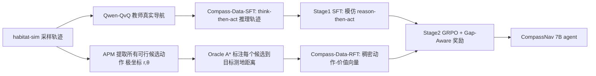

# CompassNav: Steering From Path Imitation to Decision Understanding In Navigation

**会议**: ICLR 2026  
**OpenReview**: [https://openreview.net/forum?id=eqcDckWHik](https://openreview.net/forum?id=eqcDckWHik)  
**代码**: [https://linengcs.github.io/CompassNav](https://linengcs.github.io/CompassNav)  
**领域**: 具身导航 / 视觉语言模型 / 强化微调  
**关键词**: Goal Navigation, LVLM, Decision Understanding, GRPO, Reward Design, Object-Goal  

## 一句话总结
CompassNav 把目标导航的训练范式从"模仿单条专家轨迹"转向"决策理解"——用 A\* 测地距离给每一步的所有候选动作打分构造稠密监督，再配一个 gap-aware 混合奖励做 GRPO 微调，让 7B 的 Qwen2.5-VL 学会评估"每个走法相对优劣"，在 HM3D/MP3D 上超过 GPT-4o 甚至 o4-mini。

## 研究背景与动机
**领域现状**：目标驱动导航（Goal Navigation，如"找一把椅子"）只给稀疏高层目标、不给逐步指令，要求 agent 在不确定下自主探索与空间推理。近年主流是用大视觉语言模型（LVLM）做端到端导航，避开模块化系统对显式建图的脆弱依赖，又天然能理解自然语言意图。

**现有痛点**：当前 LVLM 导航几乎全靠 **Path Imitation（路径模仿）**——把导航简化为对单条专家轨迹的序列复制，最小化与 ground-truth 的偏差。但真实环境里"可行路径几乎从不唯一"：严格模仿一条路会惩罚所有同样合理的备选路线，把导航当成记忆任务，学不到"为什么这个动作比那个好"的因果结构。配套的奖励也乏力——稀疏奖励长程不可解、欧氏距离类稠密启发式无视障碍、二元偏好奖励丢失"差距大小与模糊度"的细微信息。

**核心矛盾**：单一最优路径的稀疏监督 ↔ 真实导航的多路径、需相对价值判断的本质，二者错配导致 agent 只会"记路"不会"决策"。

**本文目标**：构建一个不是"跟着走"而是真正"理解怎么走"的 agent，在数据监督和奖励信号两端都从单路径转向全景式价值评估。

**核心 idea**：
- **决策理解范式（Decision Understanding）**：不再只标注最优动作，而是用 A\* 测地距离给当前状态下所有可行候选动作标注"到目标的距离"，构成稠密的"正确性梯度场"。
- **gap-aware 混合奖励**：根据"最优与次优的差距"自适应调节反馈——清晰场景给决断信号、模糊场景给细腻分数鼓励探索。
- **SFT-then-RFT recipe**：先 SFT 解决冷启动、注入"先想再动"结构，再 GRPO 强化微调把策略对齐到真正的决策理解。

## 方法详解

### 整体框架
CompassNav 由"数据"和"训练"两根支柱组成。数据侧产出 **Compass-Data-22k**：RFT 子集用 A\* Oracle 给每步所有候选动作标注测地距离（稠密价值向量），SFT 子集让 Qwen-QvQ 教师在 habitat-sim 里真实完成 ObjectNav、只保留成功 episode 的完整 think-then-act 推理轨迹。训练侧是两阶段：Stage 1 用 SFT 模仿教师的"先推理后选动作"结构、解决冷启动；Stage 2 在此初始化策略上用 GRPO + gap-aware 混合奖励做强化微调，把策略从"模仿"推向"决策理解"。

### 关键设计

**1. 稠密全景监督：Oracle A\* 标注所有候选动作。** 与只标注单一最优动作的传统数据不同，Compass-Data-RFT 先用 Action Proposal Module（APM）借助实时深度图与占据栅格识别出当前所有可行候选动作并离散为极坐标 $(r,\theta)$，再用 Oracle A\* Annotator 调用模拟器全局信息计算每个候选动作相对目标的最短测地距离，得到一个完整的"动作-价值向量"，相当于在决策空间上画出正确性的梯度场。为提升数据多样性，还引入回溯机制：agent 在"模糊点"（有多个可行选项的状态）主动回退去探索并记录备选轨迹，而非死守最短路。这把训练信号从"一条稀疏最优路"变成"全景式相对价值评估"。

**2. 冷启动初始化：知识蒸馏式 SFT。** 直接从基座 LVLM 跑 RFT 会因初始策略太差、奖励信号稀疏而低效。作者不为预设路径事后编造推理，而是让强教师 Qwen-QvQ 真去 habitat-sim 里跑 ObjectNav，只记录成功 episode 的完整推理与动作，格式化为 `<think>...</think><answer>k</answer>`，让 SFT 数据反映"涌现的有效探索策略"。SFT 用标准交叉熵覆盖整段教师序列 $\mathcal{L}_{SFT}(\theta)=\mathbb{E}\big[\sum_{u}-\log p_\theta(y_{t,u}\mid x_t,y_{t,<u})\big]$。为保证输出动作总是合法候选，采用 masked multiple-choice 解码——对 answer token 的 logits 做受限 softmax，只在合法候选索引集 $V_t$ 上归一化：$\pi_\theta(j\mid x_t)=\frac{\exp(z_j)}{\sum_{j'\in V_t}\exp(z_{j'})}$，确保每个生成动作都可执行，为后续 RFT 稳定性兜底。

**3. Gap-Aware 混合奖励：按决策确定性自适应。** 这是全文核心。奖励由"连续基础分"和"确定性调制的动态加成"组成。基础分对所有候选用距离的 softmax 给出连续评价，距离越短分越高：$s_t^{(i_j)}=\frac{\exp(-d_t^{(i_j)}/\tau)}{\sum_{k\in A_t}\exp(-d_t^{(k)}/\tau)}$，$\tau$ 控制分布锐度。确定性因子 $g_t$ 衡量最优与次优的归一化差距：$g_t=\mathrm{clip}\big(\frac{d_t^{(2)}-d_t^{(1)}}{|d_t^{(1)}|+\epsilon},0,1\big)$——$g_t$ 大表示选择清晰、小表示模糊。最终奖励只在选中最优动作 $i^*$ 时叠加被 $g_t$ 调制的加成：$r_t^{(i_j)}=s_t^{(i_j)}+\beta_{max}\cdot g_t\cdot\mathbb{1}[i_j=i^*]$，再裁剪到 $[0,1]$。这使奖励在"决断场景"（如距离 [1,2,4,8]）拉开 1.00 vs 0.12 的大间隔给强信号，在"模糊场景"（[1.00,1.01,1.03,1.10]）给相近非极端分鼓励探索，在"不可分场景"（[1,1,1,1]）诚实地给 0.25 低分而非误导性的满分，避免 agent 因瞎猜拿到虚高奖励。

**4. GRPO 对齐。** Stage 2 用 Group-wise Reward Policy Optimization：对同一 prompt 采样 $G$ 条输出、解析出各自选中的动作、用 gap-aware 奖励与预计算的 A\* 距离打分，归一化为优势 $A(y_j)$ 后优化 $\mathcal{L}_{GRPO}(\theta)=-\mathbb{E}\big[\sum_j A(y_j)\log\pi_\theta(y_j\mid x_t)\big]+\beta_{KL}\cdot\mathrm{KL}(\pi_\theta\|\pi_{SFT})$，其中冻结的 SFT 策略作为参考模型，KL 项稳定更新。

## 实验关键数据
训练数据在 habitat-sim 的 HM3Dv2 train split 生成，在 HM3Dv1/HM3Dv2/MP3D 三个完全held-out 验证集上评测 Object-Goal 与 Instance-Image-Goal 导航，指标为 SR（成功率）与 SPL（路径长度加权成功率）。基座为 Qwen2.5-VL-7B。

### 主实验表格

与模块化方法对比（HM3D / MP3D）：

| 方法 | 类型 | HM3D SR | HM3D SPL | MP3D SR | MP3D SPL |
|------|------|---------|----------|---------|----------|
| VLFM (ICRA'24) | 模块化+ME | 52.4 | 30.4 | 36.4 | 17.5 |
| SG-Nav (NeurIPS'24) | 模块化+ME | 54.0 | 24.9 | 40.2 | 16.0 |
| UniGoal (CVPR'25) | 模块化+ME | 54.5 | 25.1 | 41.0 | 16.4 |
| **CompassNav** | **E2E 无显式记忆** | **56.6** | **27.6** | **42.0** | **17.5** |

与开源/闭源 LVLM 对比（ObjNav + InsImageNav 平均）：

| 模型 | AVG SR | AVG SPL |
|------|--------|---------|
| Qwen2-VL-7B | 20.6 | 9.20 |
| GPT-4o | 41.1 | 18.4 |
| GPT-o4-mini | 46.5 | 20.1 |
| Base (Qwen2.5-VL-7B) | 32.6 | 11.4 |
| CompassNav (SFT) | 39.0 | 15.5 |
| **CompassNav (SFT+RFT)** | **48.6** | **21.3** |

7B 模型 AVG SR 48.6 超过 GPT-4o（41.1）与 o4-mini（46.5）。在 HM3D-OVON 上还超过并发工作 Nav-R1，且仅用其 1/10 训练数据、从通用 LVLM 而非 3D 专用模型起步。

### 消融实验表格

SFT 阶段必要性 & 奖励/超参消融：

| 配置 | SR | SPL |
|------|----|----|
| Base Model | 19.8 | 5.20 |
| SFT (Action only) | 17.9 | 5.78 |
| SFT (Full) | 23.3 | 7.90 |
| RFT (from Scratch) | 23.5 | 6.95 |
| **RFT (from SFT)** | **35.6** | **14.8** |

| 奖励函数 | SR | SPL |
|---------|----|----|
| Binary | 29.5 | 11.1 |
| Min-Max | 29.2 | 12.5 |
| **Gap-Aware (Ours)** | **35.6** | **14.8** |

超参：Max Bonus $B=1.0$（31.3/35.6/27.9 over 0.5/1.0/1.5）、Temperature $\tau=0.5$（33.2/35.6/33.7 over 0.2/0.5/0.8）均为最优。

### 关键发现
- **两阶段是协同的**：直接从基座 RFT 仅 +3.7 SR，而 SFT 初始化后再 RFT 额外 +12.3 SR；只教动作空间的 "SFT (Action only)" 反而劣于基座，说明在困难目标导航里"只学动作格式"会损害效果。
- **奖励对齐 > 奖励数值**：Binary/Min-Max 训练时分数虚高（只是完美模仿单一最优动作这个简单代理任务），gap-aware 绝对分更低却提供更有意义的信号，泛化更好。
- **决策理解可量化**：NavNuances benchmark 上 CompassNav 在垂直移动（VM）约 3× 超基座、甚至超 NavGPT-4V，证明学到了结构连通性与 3D 推理；但在 DC/NU 上仍逊于 GPT-4V（目标导向 vs 严格指令跟随的任务对齐差异 + 7B 在长上下文记忆任务易幻觉）。

## 亮点与洞察
- **范式转换叙事清晰**：把"path imitation → decision understanding"作为统领，数据侧（稠密 A\* 标注）和训练侧（gap-aware 奖励）两根支柱都服务于同一主张，逻辑自洽。
- **奖励设计是真亮点**：用归一化 gap 区分"决断/模糊/不可分"三类场景，并诚实地对不可分场景给低分，从机制上避免 agent 学会"瞎猜也能拿满分"，比 Binary/Min-Max 更贴合多路径导航的真实目标。
- **效率惊人**：7B 开源模型超过 GPT-4o/o4-mini，且仅用 Nav-R1 的 1/10 数据，对开源社区降低部署门槛有实际价值。
- **真机验证**：在物理机器人上实现鲁棒的真实世界目标导航，不止仿真。

## 局限与展望
- **指令跟随能力偏弱**：DC/NU 落后 GPT-4V，模型为目标导向探索优化，对 VLN 式严格逐步指令跟随不擅长。
- **长上下文记忆受限**：刻意排除历史帧以兼容外部记忆模块，NU（计数/序列记忆）较弱，7B 规模在记忆依赖任务易幻觉。
- **依赖模拟器 Oracle**：A\* 稠密标注依赖 habitat-sim 全局信息与 APM 的深度/占据栅格，真实场景下稠密价值标注的获取成本与噪声未充分讨论。
- **展望**：把历史记忆模块外接进来、扩大模型规模以补齐指令跟随，可能进一步缩小与大模型的差距。

## 相关工作与启发
- **vs 模块化导航（CogNav/UniGoal/VLFM）**：放弃显式建图与多模块拼接，避免误差传播与工程复杂度，把空间推理直接蒸馏进模型参数。
- **vs Path Imitation 的 RFT（Nav-R1 等）**：现有导航 RFT 仍奖励对单一参考轨迹的保真度，强化刚性复制；CompassNav 用稠密全景监督打破这一限制。
- **启发**：该"把单点监督升级为全候选价值向量 + 按确定性自适应奖励"的思路可迁移到其他需要在多个近似可行选项中做相对判断的序列决策任务（操作规划、对话动作选择等）。

## 评分
- 新颖性: ⭐⭐⭐⭐ 决策理解范式 + gap-aware 混合奖励的组合有清晰动机，奖励的"诚实低分"机制设计巧妙；底层 SFT-then-RFT + GRPO 框架沿用既有方法。
- 实验充分度: ⭐⭐⭐⭐ 三数据集、模块化/开源/闭源多组对比、NavNuances 原子能力评测、奖励与超参消融齐全，并有真机验证。
- 写作质量: ⭐⭐⭐⭐ 范式叙事统领全文，图示与三场景奖励对比直观；个别公式段落排版略乱。
- 价值: ⭐⭐⭐⭐ 7B 超 GPT-4o/o4-mini 且数据高效，对开源具身导航社区有实际推动力。

<!-- RELATED:START -->

## 相关论文

- [\[ICLR 2026\] RFS: Reinforcement Learning with Residual Flow Steering for Dexterous Manipulation](rfs_reinforcement_learning_with_residual_flow_steering_for_dexterous_manipulatio.md)
- [\[ICML 2026\] PSG-Nav: Probabilistic Scene Graph Navigation via Multiverse Decision Making](../../ICML2026/robotics/psg-nav_probabilistic_scene_graph_navigation_via_multiverse_decision_making.md)
- [\[ICLR 2026\] Geometry-Aware Policy Imitation](geometry-aware_policy_imitation.md)
- [\[ICLR 2026\] From Seeing to Doing: Bridging Reasoning and Decision for Robotic Manipulation](from_seeing_to_doing_bridging_reasoning_and_decision_for_robotic_manipulation.md)
- [\[ICLR 2026\] Vision-Language-Action Instruction Tuning: From Understanding to Manipulation](vision-language-action_instruction_tuning_from_understanding_to_manipulation.md)

<!-- RELATED:END -->
