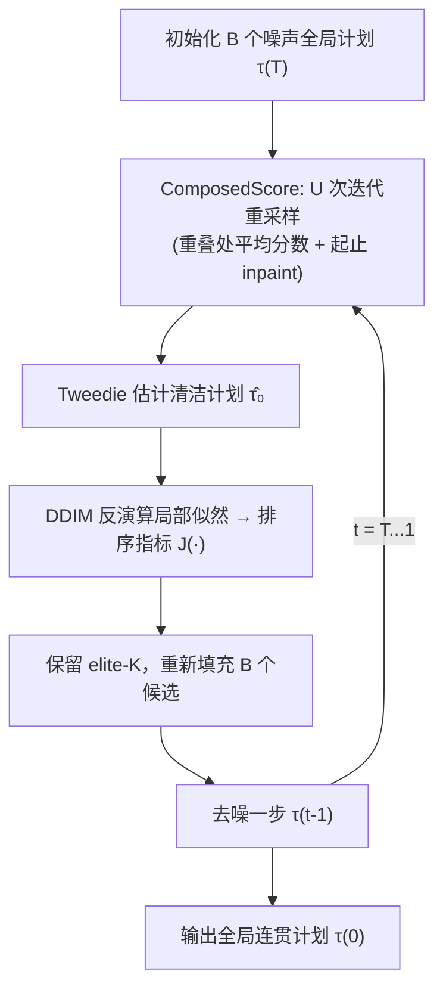

# Compositional Diffusion with Guided Search for Long-Horizon Planning

**会议**: ICLR 2026  
**OpenReview**: [https://openreview.net/forum?id=b8avf4F2hn](https://openreview.net/forum?id=b8avf4F2hn)  
**项目主页**: [https://cdgsearch.github.io/](https://cdgsearch.github.io/)  
**领域**: 机器人长程规划 / 组合式扩散 / 推理时搜索  
**关键词**: compositional diffusion, long-horizon planning, mode averaging, guided search, TAMP, inference-time scaling  

## 一句话总结
把"种群式搜索"直接嵌进扩散去噪过程，用迭代重采样做局部到全局的消息传递、用 DDIM 反演的似然做剪枝，从而让短程扩散模型组合出既局部可行又全局连贯的长程计划，在机器人规划、全景图、长视频上一套方法通吃。

## 研究背景与动机
- **领域现状**: 用生成模型（尤其扩散模型）做规划很火，而"组合式生成"——把多个局部、模块化的短程生成模型拼成长程分布——是绕开"长程数据昂贵、单体模型无法外推超出训练 horizon"这一痛点的主流路线，覆盖多步操作规划、全景图合成、长视频生成等。
- **现有痛点**: 当局部分布是**多模态**时，把短程局部计划拼成全局计划会继承"组合式多模态"——全局计划的每个模式对应一串不同的局部模式序列。现有方法（如 GSC）靠 score-averaging 组合局部模式，无法处理这种组合爆炸，会把**互不兼容的局部模式平均到一起**（mode averaging），产出既不局部可行也不全局连贯的无效计划。
- **核心矛盾**: 高似然的局部片段单独看都合理，但拼起来的模式序列可能彼此冲突；要解决就必须**联合推理局部模式间的兼容性**，并在指数级大的搜索空间里高效导航——而纯采样方法只会塌缩成不连贯的平均。
- **本文目标**: 找出一串相互兼容、能组合成全局连贯计划的局部模式，且全程在标准扩散去噪流程内完成、不需要长程训练数据、可即插即用跨域。
- **核心 idea**: **把经典搜索思想搬进扩散去噪**——在每个去噪步上对一批候选全局计划做种群式搜索：(i) **迭代重采样**增强局部-全局信息传递以提出全局可信的候选，(ii) **基于似然的剪枝**把因 mode-averaging 落入低似然区的不连贯候选删掉。

## 方法详解

### 整体框架
长程计划 $\tau=(x_1,\dots,x_N)$ 被表示成重叠局部分布构成的因子图，用 Bethe 近似把联合分布写成 $p(\tau)=\frac{\prod_j p(y_j)}{\prod_i p(x_i)^{d_i-1}}$，从而只用短程数据训练的局部分布 $p(y)$ 就能采样长程 $p(\tau)$；组合分数 $\nabla\log p(\tau)$ 按因子分数与变量分数加和得到（重叠变量取两侧条件分数的平均）。CDGS 在此之上把整个去噪过程改造成一次受引导的种群搜索：每个去噪步维护 $B$ 个候选全局计划，先用迭代重采样算组合分数、再用似然指标排序并保留 elite-$K$、重新填充种群后继续去噪。

直观理解（Fig.3 的 1D running example）：起点 $x_1$ 到目标 $x_7$ 有"走上"和"走下"两条可行路；朴素组合会出现"上面起、下面终"的混搭，中间因子被迫平均两端模式而产出红色的不可行转移；加迭代重采样降低 mode-averaging 频率，再加剪枝则彻底剔除带不可行转移的计划。

### 关键设计

**1. 把搜索嵌进去噪的种群式采样：用修正过的转移分布做交叉熵搜索。** CDGS 的骨架是在每个去噪步 $t$ 不再单纯从扩散转移 $p(\tau^{(t-1)}|\tau^{(t)})$ 采样，而是从一个被排序指标重塑过的分布 $p_J(\tau^{(t-1)}|\tau^{(t)})\propto p(\tau^{(t-1)}|\tau^{(t)})\exp\!\big(-J(\hat\tau_0^{(t-1)})/\beta_t\big)$ 采样，其中 $\hat\tau_0$ 是清洁计划的 Tweedie 估计，$\beta_t$ 控制探索-利用权衡。它用一个类似交叉熵方法（cross-entropy method）的蒙特卡洛过程近似：抽一批 $B$ 个候选、用 $J$ 排序、保留使 $J$ 最小的 elite-$K$ 个，再重新填充。elite 数 $K$ 是可调旋钮，问题越大越难就并行探索越多可能，天然带来"难任务多算"的自适应推理时计算特性。

**2. 用 DDIM 反演近似局部似然作为剪枝排序指标。** 关键洞察是"全局计划可行 ⟺ 它的所有局部转移都可行"，而局部模型 $p(y)$ 本就被训练去建模可行的短程行为，所以**高似然的局部片段就是局部可行的强信号**。但扩散模型精确似然不可解，作者改用 DDIM 反演来近似：把每个局部片段 $y$ 经学到的分数网络做前向加噪，高似然样本走低曲率轨迹、低似然样本则需高曲率才能把噪声拉回分布内。据此定义曲率平滑度 $g(y^{(0)})=\sum_{i=1}^{T}\big\|\tfrac{\partial \epsilon_\theta(y^{(i-1)},i)}{\partial i}\big\|^2$，并聚合所有局部片段得到全局排序指标 $J(\tau^{(0)})=\sum_{m=1}^{M}\exp(-g(y_m^{(0)}))$；$g$ 越大说明离 $p(y)$ 的最近模式越远、似然越低，对应 $J$ 越高的低质量计划在去噪过程中更容易被剪掉。

**3. 迭代重采样实现局部-全局消息传递。** 仅靠排序不够，还得让候选本身就全局连贯——但标准组合采样无法把长程依赖传过重叠的局部片段（一步去噪后 $y_1$ 对 $y_6$ 一无所知）。CDGS 借鉴 RePaint 式重采样：在算组合分数时反复交替"前向加噪 $\tau^{(t)}\sim p(\tau^{(t)}|\tau^{(t-1)})$ + 去噪"，并在每轮把起点/终点加噪后 inpaint 回去。数学上这等价于因子链上的置信传播：每个局部计划 $y_m$ 的置信通过与邻居的重叠被更新 $p(y_m|y_{m-1},y_{m+1})\propto p(y_m)\,p(y_m|y_m\cap y_{m-1})\,p(y_m|y_m\cap y_{m+1})$，$U$ 轮后信息就传遍整条长程序列，产出更全局连贯的候选。重采样步数 $U$ 与批大小 $B$ 都可随 horizon/搜索空间放大，构成可扩展的推理时算力。

## 实验关键数据

### 主实验：机器人规划（OGBench）
在 OGBench 的 Maze / Scene 上从 stitch / play 数据学习并 receding-horizon 控制，成功率（100 trials × 3 seeds）：

| 环境 | Size | HIQL | GSC | CompDiffuser | Ours w/o PR | Ours |
|---|---|---|---|---|---|---|
| PointMaze (Stitch) | Medium | 74 | 100 | 100 | 100 | **100** |
| PointMaze (Stitch) | Giant | 0 | 29 | 68 | 78 | **87** |
| AntMaze (Stitch) | Large | 67 | 66 | 86 | 86 | **88** |
| AntMaze (Stitch) | Giant | 21 | 20 | 65 | 82 | **85** |
| HumanoidMaze (Stitch) | Large | 31 | 70 | 72 | 70 | **74** |
| Scene (Play) | - | 38 | 8 | 13 | 36 | **51** |

要点：CDGS 以**训练-free**方式把朴素组合采样（GSC）拔高到**超过需要重叠监督训练的 CompDiffuser**，尤其在最难的 Giant 规模上优势明显。AntSoccer（17D 高维 stitch）上 CDGS 同样达到/超过基线（Arena 69 / Medium 18）。

### 主实验：TAMP 任务套件（成功率，50 trials）

| 方法 | 任务信息 | Hook Reach T1/T2 | Rearr. Push T1/T2 | Rearr. Memory T1/T2 |
|---|---|---|---|---|
| STAP CEM | PDDL 特权 | 0.66 / 0.70 | 0.76 / 0.70 | 0.00 / 0.00 |
| LLM-T2M (n=11) | LLM prompting | 0.0 / 0.48 | 0.72 / 0.06 | 0.0 / 0.0 |
| GSC (no task plan) | 仅 skill 级数据 | 0.18 / 0.04 | 0.00 / 0.00 | 0.07 / 0.00 |
| **CDGS (ours)** | 仅 skill 级数据 | **0.64 / 0.58** | **0.84 / 0.48** | **0.42 / 0.18** |

CDGS 不依赖符号搜索或 LLM/VLM 监督，却在 Rearrangement Memory 这类需要长程记忆的任务上**大幅超过特权方法**（特权 STAP CEM 直接 0.00）。

### 消融与跨域
- **消融（Ours w/o PR vs Ours）**: 去掉剪枝（pruning）+ 重采样后，TAMP 各任务普遍腰斩（如 Hook Reach T1 从 0.64→0.24）；缩放分析显示**单独加大 batch B 或单独加大重采样 U 都不够**，两者必须协同才能让长程运动规划成功。
- **全景图（SD2.0，512×4608）**: CDGS 在无显式感知损失下匹配 Sync-Diffusion，Intra-Style-L 1.38（vs Multi-Diffusion 2.96），CLIP-S 32.51 为最高，兼顾局部一致与全局上下文。
- **长视频（CogVideoX-2B → 350 帧 720p，7× 外推）**: 主体一致性 91.67、prompt 对齐 26.13 均优于 GSC，仅有轻微美学下降。

### 关键发现
朴素组合采样会"幻觉"出分布外转移（如 `place(hook)` 前置条件 inhand 从未满足、cube 为凑近目标而钻到 rack 下），CDGS 的剪枝目标保证去噪全程只留与短程转移模型同分布的可行计划。同时缩放分析（Fig.5c/d）显示：任务规划成功率随批大小单调上升、且重采样步数带来更大增益，而运动规划成功率只有在批量足够大时增加重采样才生效——印证两机制的协同性。

## 亮点与洞察
- **把"组合式生成的 mode-averaging"明确为一类一等公民问题**，并指出它源自全局分布继承的组合多模态，而非简单的采样噪声。
- **训练-free 即插即用**：不改训练、不需长程数据、不需重叠/任务骨架监督，仅在推理时改采样流程，就跨机器人规划/全景/长视频三域通用。
- **DDIM 反演曲率 ≈ 局部似然**这一代理巧妙绕开扩散似然不可解的难题，把"可行性判定"变成可批量算的排序信号。
- **自适应推理时算力**：难任务通过加大 $B$、$U$ 换取更高成功率，且实验证明两者必须协同——给"inference-time scaling 用于组合分布"提供了干净的范例。

## 局限与展望
- **推理成本随 $B\times U$ 上升**：种群搜索 + 多轮重采样 + 每片段 DDIM 反演带来显著推理开销，论文未给出与基线对齐的 wall-clock / FLOPs 对比。
- **依赖低维状态表示**：机器人实验用末端执行器与物体位姿的低维状态空间，真实部署需外部感知提供位姿，端到端从像素规划未验证。
- **似然代理的近似性**：DDIM 反演曲率只是似然的启发式近似，在局部模型本身欠拟合或分布尾部时排序可能失真。
- **长视频有美学-一致性权衡**：主体一致性提升以轻微美学下降为代价，是长视频组合生成的通病，未根治。

## 相关工作与启发
- **组合式规划/采样**: Diffusion-CCSP、GSC、GFC 等都做组合采样，但靠 task skeleton / 约束图等额外模式监督来回避 mode-averaging；CDGS 直接正面解决该问题。
- **推理时算力缩放**: 与 verifier-guided search、扩散推理时缩放同源，但 CDGS 独特地针对"从组合式分布链采样"这一场景的 mode-averaging 限制。
- **长程内容生成**: 与 outpainting / stitching（Multi-Diffusion、Sync-Diffusion、Gen-L-Video 等）同属"组合短程模型外推"路线，CDGS 把规划与生成统一在同一搜索框架下。
- **启发**: "用搜索修补生成模型的分布塌缩"是一条可迁移的思路——凡是把短程模块拼成长程结构、又受多模态困扰的场景（程序合成、长文档、轨迹优化）都可能套用"种群 + 似然剪枝 + 重采样消息传递"。

## 评分
- **新颖性**: ⭐⭐⭐⭐ 把 mode-averaging 提为核心问题并用"去噪内嵌种群搜索 + DDIM 反演似然剪枝 + 重采样消息传递"组合解法，视角清晰、机制新颖。
- **实验充分度**: ⭐⭐⭐⭐ 覆盖 OGBench 多套件 + TAMP 三套件 + 全景 + 长视频，含强基线、消融与缩放分析；但缺推理算力/时延对比、缺像素端到端验证。
- **写作质量**: ⭐⭐⭐⭐ 问题动机与 running example（Fig.3）讲得直观，算法伪代码与公式完整；少数排版符号（DDIM 反演式）阅读门槛偏高。
- **价值**: ⭐⭐⭐⭐ 提供一个训练-free、跨域通用的长程规划/生成推理范式，对组合式生成与具身规划社区有较强可迁移性。

> 资源：项目主页含交互演示与全景/长视频定性结果 [https://cdgsearch.github.io/](https://cdgsearch.github.io/)。

<!-- RELATED:START -->

## 相关论文

- [\[ICML 2026\] HDFlow: Hierarchical Diffusion-Flow Planning for Long-horizon Tasks](../../ICML2026/robotics/hdflow_hierarchical_diffusion-flow_planning_for_long-horizon_tasks.md)
- [\[ICLR 2026\] CoNavBench: Collaborative Long-Horizon Vision-Language Navigation Benchmark](conavbench_collaborative_long-horizon_vision-language_navigation_benchmark.md)
- [\[ICLR 2026\] SARM: Stage-Aware Reward Modeling for Long Horizon Robot Manipulation](sarm_stage-aware_reward_modeling_for_long_horizon_robot_manipulation.md)
- [\[ICLR 2026\] SLAP: Shortcut Learning for Abstract Planning](slap_shortcut_learning_for_abstract_planning.md)
- [\[ICLR 2026\] Block-wise Adaptive Caching for Accelerating Diffusion Policy](block-wise_adaptive_caching_for_accelerating_diffusion_policy.md)

<!-- RELATED:END -->
