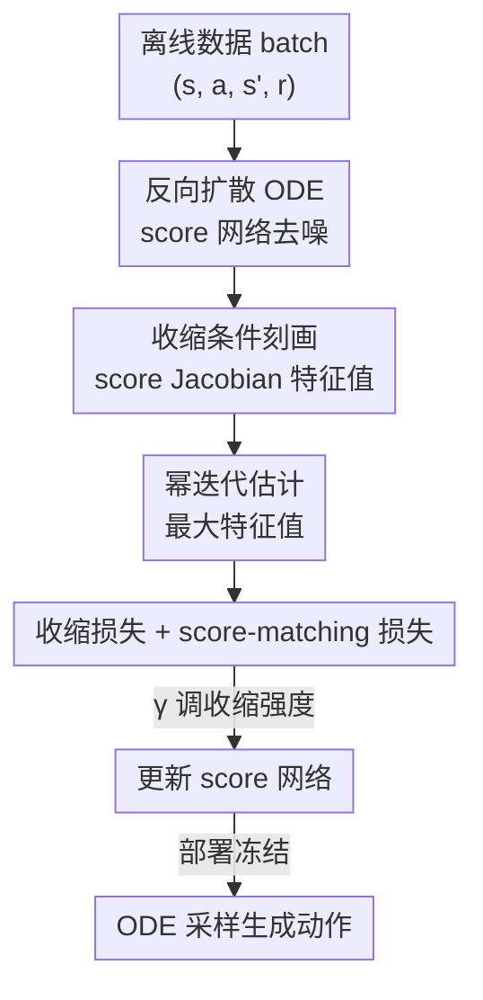

# Contractive Diffusion Policies

**会议**: ICLR2026  
**OpenReview**: [https://openreview.net/forum?id=iKJbmx1iuQ](https://openreview.net/forum?id=iKJbmx1iuQ)  
**代码**: contractive-diffusion.github.io（项目页）  
**领域**: 机器人 / 离线策略学习 / 扩散策略  
**关键词**: 扩散策略, 收缩理论, 离线强化学习, 模仿学习, score Jacobian

## 一句话总结
针对扩散策略在离线控制中"采样器误差 + score 估计误差会逐步累积、把动作推离数据支撑"的痛点，本文用收缩理论（contraction theory）把"让相邻去噪轨迹相互靠拢"这件事，转化成对 score 网络 Jacobian 最大特征值的可微惩罚，只加一个超参数和一项轻量损失就能塞进已有扩散策略，在数据稀缺时增益尤其明显。

## 研究背景与动机
**领域现状**：扩散策略（diffusion policy）已经成为离线策略学习——尤其是机器人和控制——的主流生成式方法。它把数据动作逐步加噪，再学一个以状态为条件的 score 函数，沿反向扩散 SDE/ODE 把噪声一步步去噪回动作。这种 score-based 的迭代采样让模型能刻画长时序、多模态的行为分布。

**现有痛点**：但同一套机制也带来代价。反向采样依赖 ODE/SDE 求解器，会在三处累积误差：(i) score 估计本身不准，(ii) 离散化误差，(iii) 数值积分误差。它们沿去噪步逐步叠加，还会让"同一个状态、采两次得到的动作不一致"。在图像生成里这点小偏差无所谓，但在控制里是致命的——动作稍微偏离数据分布就会复利式放大，最终把策略推出数据集支撑区，在真实机器人上还会引出安全问题。

**核心矛盾**：score-based 的迭代采样既是扩散策略能表达多样行为的来源，也是这些不准确性的来源。你不能简单地"让采样更确定"，因为那会牺牲多模态表达；但放任迭代误差累积又会让控制失败。已有的收缩式扩散概率模型（Tang & Zhao, 2024）证明强制收缩能压制 score-matching 和离散化误差，但它在全局强制收缩，可能压垮分布多样性、也不好高效地接进离线学习。

**本文目标**：在不破坏多模态表达、几乎不加计算量的前提下，让扩散采样过程具备"收缩"特性，从而抑制求解器与 score 误差、减少无谓的动作方差。

**切入角度**：作者引入收缩理论——它研究一个微分方程的解会不会随时间彼此收敛。一个收缩的 ODE 能很快"忘掉"初始条件里的小扰动，天然抑制误差增长。把这个视角搬到反向扩散 ODE 上，"收缩"恰好对应"把相邻去噪流往动作分布的主模态拉拢"。

**核心 idea**：把"促进采样收缩"严格地化约为"约束 score 网络 Jacobian 对称部分的最大特征值"，再用一项可微、可幂迭代高效估计的收缩损失去惩罚它，即插即用地装进现有扩散策略。

## 方法详解

### 整体框架
CDP 不改扩散策略的网络结构，只在训练目标上动手。给定离线数据集 $D=\{(s,a,s',r)\}$，扩散策略要学一个以状态为条件的 scaled score 网络 $\epsilon_\theta(a_t,s,t)\approx-\sigma_t\nabla_{a_t}\log p_t(a_t\mid s)$，部署时冻结网络、沿反向扩散 ODE 从噪声采出动作。本文的做法是：在标准 score-matching 损失之外，对每个 batch、在每个去噪步上额外算一次 score 的 Jacobian，并用一项"收缩损失"去惩罚它的最大特征值，逼着采样动力学变得收缩。最终训练损失只比原来多一项 $\gamma L_c$，多一个超参 $\gamma$。

为什么惩罚 Jacobian 就能控制收缩？作者先把反向扩散 ODE 重写成线性漂移项加 score 项的形式 $da_t=[f(t)a_t+h(t)\epsilon_\theta(a_t,s,t)]\,dt=F_\theta(a_t,t)\,dt$，再对动作求 Jacobian：

$$J_{F_\theta}=f(t)I+h(t)J_{\epsilon_\theta}.$$

这里 $f(t)I$ 和 $h(t)$ 由前向扩散的调度参数固定、不可训练，唯一可训练的是 score 的 Jacobian $J_{\epsilon_\theta}$——这正是可以下手的杠杆。整条管线如下：

### 关键设计

**1. 收缩条件刻画：把"采样收缩"翻译成对 score Jacobian 特征值的约束**

收缩理论给出一个充分条件：ODE $F(a_t,t)$ 收缩当且仅当其 Jacobian 对称部分负定，即 $\lambda_{\max}(J_F+J_F^\top)<0$。本文的核心定理 3.1 把它落到扩散 ODE 上：取对称部分 $J_{F_\theta}^{\mathrm{sym}}=f(t)I+h(t)J_{\epsilon_\theta}^{\mathrm{sym}}$，则 $F_\theta$ 收缩当且仅当

$$\lambda_{\max}(J_{\epsilon_\theta}^{\mathrm{sym}})<-f(t)\,h(t)^{-1},\quad \forall t\in[0,1].$$

这个式子很关键：漂移项 $f(t)I$ 往往本身就是收缩的、会在每个求解步把相邻流往一起拉；而 score 项局部可能扩张也可能收缩。定理保证只要 score Jacobian 的最大特征值被压到阈值以下，漂移项的收缩就能压住 score 的任何局部扩张。推论 3.1.1 进一步给出动作方差的上界——两条流的差 $\|\delta a_t\|\le\exp\!\big(\int_t^1\lambda_{\max}(J_{F_\theta}^{\mathrm{sym}}(\tau))\,d\tau\big)\|\delta a_0\|$，意味着收缩直接换来"对初始随机种子不敏感、相似状态下动作更稳"。和旧的全局收缩方法不同，这里把约束精确地锚在一个可训练量上，给后面"只约束该约束的、不过度收缩"留了空间。

**2. 幂迭代估计：让最大特征值惩罚便宜到能在每个去噪步上算**

直接算 $J_{\epsilon_\theta}^{\mathrm{sym}}$ 的全部特征值在每个去噪步、每个 state-action 对上都做，开销不可接受。作者用幂迭代近似最大特征值：从随机向量 $v_0\sim\mathcal N(0,I)$ 出发，反复做 $v_{k+1}=J_{\epsilon_\theta}^{\mathrm{sym}}v_k/\|J_{\epsilon_\theta}^{\mathrm{sym}}v_k\|_2$ 并取 $\hat\lambda_{k+1}=v_{k+1}^\top J_{\epsilon_\theta}^{\mathrm{sym}}v_{k+1}$，估计值以线性速率收敛到 $\lambda_{\max}$。每次迭代只需一次 Jacobian-向量积（可反传），实测 $K=3$ 或 $4$ 次就够稳定，计算和显存开销都很小。这一步是让整套理论从"漂亮但算不动"变成"能真正塞进训练循环"的关键工程点。

**3. 收缩损失：带 margin 的特征值惩罚，既促收缩又防模态坍塌**

有了高效估计就能写损失。逐样本收缩损失为 $L_c(\theta)=\max(-\beta,\ \hat\lambda_{\max}(J_{\epsilon_\theta}^{\mathrm{sym}})+f(t)h(t)^{-1})$，其中 $\beta>0$ 是期望的收缩裕量；作者也给了等价的 Frobenius 范数形式 $L_c(\theta)=\|J_{\epsilon_\theta}^{\mathrm{sym}}+\beta I\|_{\mathrm{Frob}}$（对称矩阵下 Frobenius 范数与特征值挂钩）。$\max(-\beta,\cdot)$ 这个截断很有讲究：它把"过度收缩"——特征值被压得过分负——挡在外面，从而避免把分开的、本应保留的多个动作模态硬挤成一个，防止模态坍塌。这正是它优于"全局强制收缩"旧方法的地方：只收缩到够用为止。

**4. 即插即用集成：一项损失、一个超参，独立于具体策略学习算法**

最终训练损失是 score-matching 损失 $L_d$ 加上 $\gamma L_c$：

$$L(\theta)=\mathbb E_{(a,s)\sim D}\Big[\mathbb E_{t,a_t}\big[\|\epsilon_\theta+\sigma_t\nabla_{a_t}\log p_t(a_t\mid s)\|_2^2+\gamma L_c(\theta)\big]\Big].$$

只多一个正超参 $\gamma$ 控收缩强度。这里 $L_d$ 的存在很重要：单独惩罚 Jacobian 会把模型推向一个"平凡收缩但没意义"的场，而 score-matching 同时要求 score 准确，两者一起逼出"既收缩又有意义的流"。因为收缩项只从扩散 ODE 算、和策略学习方式解耦，只要有可微 score 函数就能接——本文就分别建在 EDP（离线 RL）和 DBC（模仿学习）之上，实现几乎零改动。

### 损失函数 / 训练策略
训练 200k–500k 梯度步（按任务难度和观测模态而定），每个数据集用 10 个随机种子。$\gamma$ 在 $\{0.001,0.01,\dots,100\}$ 里朴素挑最优，最后统一直接设 $\gamma=0.1$；除 $\gamma$ 外对其他超参不敏感。幂迭代 $K=3\!\sim\!4$。

## 实验关键数据

### 主实验
离线 RL 在 D4RL 上对比扩散类方法（归一化回报，越高越好）：

| 数据集 | BC | DQL | EDP | IDQL | CDP |
|--------|----|-----|-----|------|-----|
| 全环境平均 | 35.1 | 58.8 | 61.2 | 60.3 | **65.7** |
| Hopper-MR | 18.9 | 50.4 | 55.1 | 51.5 | **63.5** |
| Walker2D-MR | 27.8 | 76.8 | 82.0 | 84.6 | **89.7** |
| Kitchen-Complete | 27.3 | 35.7 | 32.9 | 31.6 | **51.0** |

模仿学习在 Robomimic 上（成功率）：

| 任务 | BC-GMM | DP-DiT | DP-Unet | DBC-DiT | CDP-DiT | CDP-Unet |
|------|--------|--------|---------|---------|---------|----------|
| 平均 | 0.50 | 0.76 | 0.88 | 0.64 | 0.78 | **0.90** |
| Transport-L | 0.21 | 0.56 | 0.74 | 0.13 | 0.48 | **0.81** |
| Transport-H | 0.14 | 0.41 | 0.68 | 0.29 | 0.52 | **0.75** |

### 消融实验

| 配置 | 关键现象 | 说明 |
|------|---------|------|
| 数据减到 10%（D4RL / Robomimic） | CDP 大幅领先所有 baseline | 数据稀缺时 score 误差被放大，收缩的抑误差作用最突出 |
| 物理 Franka 臂（4 个 IL 任务，各跑 20 次） | 解决 3/4 任务、成功率高于 DBC | 在更难的 Slide、Peg 上优势明显 |
| 时间开销（100k 步） | RL 5236s vs EDP 4594s；IL 9056s vs DP-Unet 8210s | 收缩项带来的额外开销适中 |

### 关键发现
- **数据稀缺是 CDP 最大的甜区**：标准数据量下增益温和、个别近最优任务甚至会因额外鲁棒性轻微掉点，但减到 10% 数据时 CDP 决定性领先——印证"收缩压制的正是低数据下被放大的 score-matching 误差"。
- **超参鲁棒**：除收缩权重 $\gamma$ 外，对其他超参不敏感，统一 $\gamma=0.1$ 即可。
- **IL 里仍追不上 DP-Unet**：CDP 稳定超过它所基于的 DBC，但落后 UNet 版扩散策略，作者归因于 UNet 架构优势和更长动作序列生成能力——说明收缩是正交增益，挡不住骨干网络本身的差距。

## 亮点与洞察
- **把控制理论里的"收缩"精确地接到生成模型的 Jacobian 上**：定理 3.1 给出"采样收缩 ⟺ score Jacobian 最大特征值低于阈值"的充要条件，这个等价是整篇论文的支点，把一个模糊的"让采样更稳"诉求变成可优化的具体量。
- **$\max(-\beta,\cdot)$ 截断防模态坍塌**：很多收缩/正则方法的通病是过度压缩牺牲多样性，这里用一个 margin 把"收缩到够用为止"写进损失，思路可迁移到任何"想正则但怕坍塌"的生成式策略。
- **幂迭代 + Jacobian-向量积让二阶量变得可训练**：$K=3\!\sim\!4$ 次迭代、每次一个 JVP 就近似出最大特征值，这套"别算全谱、只追最大特征值"的工程范式在需要谱约束的场景里很值得复用。

## 局限与展望
- **增益不普适**：在所有方法都已近最优的任务上 CDP 只是持平，个别情况下额外鲁棒性反而轻微拖累——收缩是"低数据/高误差"场景的针对性药，不是万能增益。
- **追不上更强骨干**：IL 上落后 DP-Unet，说明收缩损失无法弥补网络架构与动作序列长度的差距，二者应结合而非替代。
- **每步都要算 Jacobian**：虽然单步便宜，但要在每个去噪步、每个 state-action 对上算，长 horizon / 大 batch 下累积开销仍非零；$\beta$、收缩裕量等仍需经验设定。
- **理论建立在 ODE 形式与若干步长界假设上**，与实际离散采样器之间的差距、以及更复杂多模态分布下的收缩-多样性权衡，仍值得进一步刻画。

## 相关工作与启发
- **vs 收缩式扩散概率模型（Tang & Zhao, 2024）**: 都用收缩压制 score-matching/离散化误差，但他们在全局强制收缩、可能压垮多样性也不便接进离线学习；本文用带 margin 的局部惩罚，只收缩到够用、保留分开的动作模态，并显式做成即插即用的离线学习组件。
- **vs 扩散离线 RL（DQL / EDP / IDQL）**: 这些方法在 score-matching 上叠加值最大化来平衡"贴近行为策略"与"高回报"，关注训练 pipeline；CDP 正交地改造采样动力学本身，可直接建在 EDP 上再涨点。
- **vs 扩散模仿学习（Diffusion Policy / DBC）**: 它们聚焦条件动作分布建模与多模态融合，把采样过程当黑箱；CDP 第一次把采样动力学的收缩性当作一等优化对象，因此能稳定超过 DBC。
- **vs 收缩自编码器（Rifai et al., 2011）**: 同样用 Jacobian 惩罚换取对输入扰动的鲁棒性，但那是在表示学习的编码器上；本文把这一思路搬到反向扩散 ODE 的时间动力学上，约束的是采样轨迹而非特征。

## 评分
- 新颖性: ⭐⭐⭐⭐⭐ 把收缩理论精确接到 score Jacobian 特征值、并做成即插即用损失，视角和落地都新。
- 实验充分度: ⭐⭐⭐⭐ D4RL + Robomimic + 物理 Franka 臂、10 seeds，覆盖 RL/IL/真机；但 IL 未超最强骨干、部分任务增益有限。
- 写作质量: ⭐⭐⭐⭐⭐ 理论推导清晰、从充要条件到高效实现到损失一气呵成，图示直观。
- 价值: ⭐⭐⭐⭐ 低数据离线控制场景下的实用增益，且与现有方法正交可叠加；非普适增益限制了上限。

<!-- RELATED:START -->

## 相关论文

- [\[ICLR 2026\] Abstracting Robot Manipulation Skills via Mixture-of-Experts Diffusion Policies](abstracting_robot_manipulation_skills_via_mixture-of-experts_diffusion_policies.md)
- [\[CVPR 2026\] REACH: Explicit Recovery Behavior for Diffusion Policies](../../CVPR2026/robotics/reach_explicit_recovery_behavior_for_diffusion_policies.md)
- [\[ICML 2026\] Online Self-Training for Co-Adaptation in Hierarchical Diffusion Policies](../../ICML2026/robotics/online_self-training_for_co-adaptation_in_hierarchical_diffusion_policies.md)
- [\[ICML 2026\] Lagrangian Perturbation Diffusion Steering: Latent Reinforcement Learning for Generative Policies](../../ICML2026/robotics/lagrangian_perturbation_diffusion_steering_latent_reinforcement_learning_for_gen.md)
- [\[ICLR 2026\] Difference-Aware Retrieval Policies for Imitation Learning](difference-aware_retrieval_policies_for_imitation_learning.md)

<!-- RELATED:END -->
