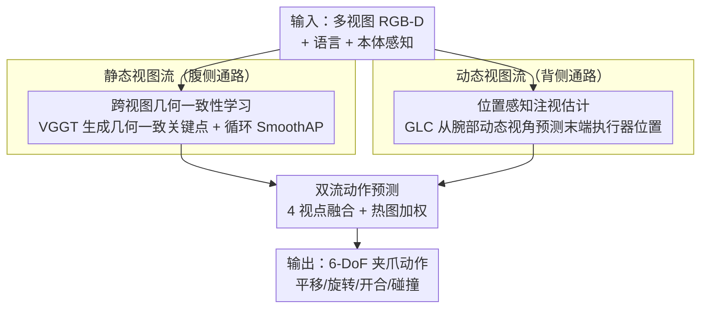

# Cortical Policy: A Dual-Stream View Transformer for Robotic Manipulation

**会议**: ICLR2026  
**OpenReview**: [https://openreview.net/forum?id=eWe8zqGvs5](https://openreview.net/forum?id=eWe8zqGvs5)  
**代码**: 待确认（补充材料含匿名源码）  
**领域**: 机器人 / 具身操作  
**关键词**: 视图 Transformer, 双流架构, 模仿学习, 跨视图几何一致性, 自我中心注视估计

## 一句话总结
受人脑视觉皮层"腹侧通路看静态场景、背侧通路看动态运动"的分工启发，本文提出 Cortical Policy——一个静态流（用 VGGT 监督跨视图几何一致性补 3D 空间推理）与动态流（用预训练注视估计模型从腕部动态视角预测末端执行器位置）并行的双流视图 Transformer，在 RLBench、COLOSSEUM 和真机任务上显著超越 RVT-2 等 SOTA（RLBench 平均成功率 81.0% vs 77.5%，COLOSSEUM +9.4%，动态扰动下真机 80% vs 静态法 0%）。

## 研究背景与动机
**领域现状**：视图 Transformer（RVT、RVT-2、VIHE 等）已成为语言条件机器人操作的主流架构。它们把机器人工作空间周围的多个静态相机视图（或由点云投影出的虚拟正交视图）渲染出来，配合语言指令和本体感知，预测 6-DoF 夹爪位姿、开合状态与碰撞标志，比显式 3D 表示方法更高效、更可扩展。

**现有痛点**：这类方法有两个反复出现的失败模式。其一是**空间推理不足**——它们只在每个视图内单独提 2D 特征再"朴素拼接"，并不建模跨视图关系，导致无法在 3D 中正确融合不同相机看到的同一场景。论文图 1 给的例子是"把方块放到两个瓶子中间"：RVT-2 因为没能把多视图正确融合到 3D，放错了位置。其二是**动态适应失败**——静态相机配置缺乏对运动的感知，当目标物体在机械臂接近途中被移动时，现有方法仍固执地沿原计划轨迹走，直到任务失败。

**核心矛盾**：现有视图 Transformer 提供的场景感知是"不完整的"。它把视觉表示当成一种静态、视图局部的东西来提取，既没有统一的 3D 几何先验，也没有任何随时间变化、面向动作的动态反馈通道。空间几何理解和动态运动适应这两件事，被单一的静态流强行揉在一起，结果哪件都没做好。

**切入角度**：作者把目光转向神经科学——人脑用两条皮层通路处理视觉。**腹侧通路**用以世界为中心（allocentric）的参考系处理静态视图，形成持久稳定的场景理解、支撑识别与规划；**背侧通路**用以身体为中心（egocentric）的参考系处理动态视图，把视网膜输入实时翻译成适应性的运动信号，估计目标物体属性并随时调整轨迹。两条通路功能可分、结构互补，都对精确运动控制不可或缺。

**核心 idea**：把这条皮层原则搬进计算框架——用**两条独立互补的并行流**替代单一静态流：一条静态流编码持久的环境结构（补 3D 空间理解），一条动态流从运动线索里推导动作（补动态适应），最后融合两者的视图表示来决定动作。

## 方法详解

### 整体框架
Cortical Policy 是一个模仿学习框架，核心是一个双流视图 Transformer。输入是某时刻 $t$ 的多视图 RGB-D 观测、语言指令和本体感知，输出是 6-DoF 夹爪动作（3-DoF 平移 + 3-DoF 旋转 + 开合状态 + 碰撞标志）。整条管线分三步走：**静态流**沿用 RVT-2 骨干，但在其特征提取器上加一个由 VGGT（一个强 3D 重建基础模型）监督的跨视图几何一致性目标，让特征在共享 3D 空间里对齐，把"持久的场景结构"学扎实；**动态流**则全新设计，用一个从自我中心注视估计模型（GLC）改造来的位置感知预训练模型，处理腕部动态视角的帧，估计末端执行器位置，产出面向动作的特征图和热图；最后一个**动作头**把两条流的互补表示融合，从中解码出精确动作。在具体实现里，某时刻场景由四个视点表示——三个静态视图 + 一个动态视图。

### 关键设计

**1. 静态视图流：用 VGGT 监督的跨视图几何一致性补 3D 空间推理**

针对"多视图只在 2D 内拼接、无法建模跨视图关系"这个痛点，静态流的做法是强制让不同视图在同一 3D 位置上的特征互相一致。它分两步。**3D 监督信号生成**：用 VGGT 预测 $N$ 个静态视图的深度图、置信图和相机参数，反投影出相机坐标系下的点图 $\{P_i\}_{i=1}^{N}$，再变换到世界坐标系下找出"共视 3D 点"；对第一个视点的共视点做非极大抑制，选出 $M$ 个最高置信度的点作为候选关键点集 $K_1$，再跨视点追踪得到几何一致关键点集 $\{K_i\}_{i=1}^{N}$。这些关键点主要落在物体或机器人表面，提供了任务相关的 3D 结构线索。**特征一致性优化**：在 RVT Encoder 后接一个可训练的 $3\times3$ 卷积细化特征分辨率，对每个关键点用双线性采样取特征 $f_i^{v_j}$，然后用 SmoothAP 损失优化跨视图特征排序——让"几何上对应同一 3D 点"的特征相似度排在前面：

$$\text{SmoothAP}(v_p \to v_q) = \frac{1}{|K_p|}\sum_{i=1}^{|K_p|} \frac{1 + \sum_{k_j \in K(i)} G(D_{ij})}{1 + \sum_{k_j \in K(i)} G(D_{ij}) + \sum_{k_j \in N(i)} G(D_{ij})}$$

其中正例集 $K(i)=\{k_i^{v_q}\}$ 是目标视点里的同一点，负例集 $N(i)=\{k_j^{v_q}\mid j\neq i,\ \|p_i-p_j\|_2>\zeta\}$ 是 3D 距离超过阈值 $\zeta$ 的其它点，$G(\cdot)$ 是 sigmoid。为抑制"按顺序两两匹配视图"带来的误差累积，作者进一步提出**循环几何一致性损失** $L_{cgc}$：把 $N$ 个视图连成闭环 $v_1\to v_2\to\cdots\to v_N\to v_1$，对每条相邻边求 SmoothAP 再取平均（$L_{cgc}=1-\frac{1}{N}\sum_p \text{SmoothAP}(v_p\to v_{p\oplus 1})$，$v_{p\oplus1}$ 在 $p=N$ 时回到 $v_1$）。闭环约束让特征从同一 3D 位置对齐，压低累积的动作估计误差，学到视点不变的表示。

**2. 动态视图流：把注视估计当动作推理，从腕部动态视角预测末端执行器位置**

针对"静态相机缺乏动态感知、目标移动就跟丢"这个痛点，动态流换了一种问法：不像已有自我中心动作预测那样问"发生了什么动作"，而是问"动作怎么执行"——直接预测夹爪平移这种运动学参数。作者的关键观察是，**预测末端执行器位置**这件事，在形式上和**自我中心注视估计**（从第一人称视频预测人的视觉注意力图）是同构的：都是从动态视角生成一张注意力/显著图。于是直接拿 SOTA 注视模型 GLC 当特征提取器。这条流有三个环节。**自我中心视频渲染**：要解决三个数据问题——人类头戴相机和机器人腕部相机的视场（FOV）差异、固定腕部相机投影出的末端执行器位置几乎不变（标注没信息量、易过拟合）、以及动态数据要与静态视图分布对齐。解法是用实时腕部相机外参在 RVT 渲染器里构造**动态虚拟相机**，既匹配人类自我中心数据的 FOV、又多样化末端执行器投影、还和静态视点对齐，同时保留自我中心运动动态；最终构建出 3,600 段带位置标注的视频（18 任务 × 100 episode × 2 阶段）。**位置感知预训练**：用 Ego4D 预训练权重初始化 GLC 骨干，再在自我中心视频上微调；每段视频切 5 秒片段、采 8 帧，GLC 生成时空连贯的显著图，每帧用最显著像素定位末端执行器，用 KL 散度损失训 15 个 epoch。GLC 靠两个机制保证鲁棒定位：捕捉动态帧里的时间注意力迁移，以及用专门的 Global-Local Correlation 模块显式建模全局与局部 token 的空间关联。**动态视图特征提取**：训练 Cortical Policy 时 GLC 冻结，从中抽两路表示——Gaze Encoder 出的视觉 token 经线性投影成视图特征图，Transformer Decoder 出的显著图当视图热图。特征图由最后一个 Encoder 块的 $F_{SA}$ 和 Global-Local Correlation 模块的 $F_{GLC}$ 沿通道拼接再投影得到：$F = \text{LP}([F_{SA}, F_{GLC}]_c)$，把 GLC 的 768 维 embedding 对齐到 RVT-2 的 token 空间；显著图经 resize 和 3D 卷积时间压缩，对齐到静态热图的尺寸。

**3. 双流动作预测：四视点融合 + 热图加权，让动作既几何扎实又动态适应**

两条流学好之后，动作头要把它们的互补表示合起来出动作。某时刻场景用四个视点表示：三个静态视图 + 一个动态视图。每个视点 $j$ 预测一张特征图 $F_j$ 和一张标示末端执行器像素坐标的热图 $H_j$。3-DoF 平移直接从反投影后的视图热图里选得分最高的 3D 点；3-DoF 旋转、夹爪开合和碰撞标志则沿用 RVT-2 的做法，同时用全局和局部特征。局部特征在热图坐标处从 $F_j$ 池化得到；全局特征向量则把静态流和动态流各自的 $\phi(F_j\odot H_j)$（热图加权后求和池化）与 $\psi(F_j)$（最大池化）拼起来。这里的关键是**热图加权规则** $F_j\odot H_j$：GLC 生成的动态视图热图 $H_4$ 能高亮任务相关的自我中心线索（如末端执行器位置），加权后产出高度聚焦的全局特征，把"该看哪"的动态信息注入决策。正是这一步让动态虚拟相机打破了已有视图 Transformer 严格正交相机配置的约束，却仍能提升性能。

### 损失函数 / 训练策略
总损失把动作预测损失和跨视图几何一致性损失合在一起：

$$L = L_{action} + \lambda L_{cgc}$$

其中 $L_{action}$ 是各动作分量交叉熵损失之和，权衡系数 $\lambda$ 设为 1。动态流的 GLC 在主训练阶段保持冻结（其位置感知预训练是单独的离线阶段，用 KL 散度损失训 15 epoch），只有静态流骨干和融合头随 $L$ 一起优化。

## 实验关键数据

### 主实验
RLBench 18 任务多任务设置（每任务 100 条示教，单一 checkpoint 评全部任务，每任务最多 25 步）。Cortical Policy 平均成功率最高，比最强 baseline RVT-2 绝对提升 3.5%，在 14/18 任务上拿到 top-1 或 top-2；在"stack cups""stack blocks"这类需要理解物体间空间关系的多物体任务上领先 1.3%–4.0%，验证了静态流注入 3D 先验的有效性。

| 数据集 | 指标 | 本文 | RVT-2 (之前 SOTA) | 提升 |
|--------|------|------|----------|------|
| RLBench (18 任务) | 平均成功率 ↑ | 81.0% | 77.5% | +3.5% |
| RLBench (18 任务) | 平均排名 ↓ | 1.8 | 3.5 | — |
| COLOSSEUM (4 任务 / 多扰动) | 平均成功率 ↑ | 69.9% | 60.5% | +9.4% |

COLOSSEUM 是 RLBench 的扰动扩展版（物体颜色/尺寸、光照、干扰物、相机位姿等未见扰动）。Cortical Policy 平均成功率最高，超 RVT-2 达 9.4%，在 14 个泛化设置里 9 个拿第一。消融显示**动态流是这份鲁棒性的主要驱动力**——在严重扰动下，它带来的增益明显大于 $L_{cgc}$。

### 消融实验
RLBench 上的逐组件消融（Table 2）。Arch.=单流/双流，Lcgc=循环几何一致性损失，Pre.=位置感知预训练，Heat.=动态视图热图。

| 配置 | Arch. | Lcgc | Pre. | Heat. | 平均成功率 | 说明 |
|------|-------|------|------|-------|-----------|------|
| A | 单流 | ✗ | – | – | 77.5% | 纯静态流（≈RVT-2 基线） |
| B | 单流 | ✔ | – | – | 80.1% | 静态流 + $L_{cgc}$，比 A 涨 2.6% |
| C | 双流 | ✗ | ✗ | ✔ | 77.6% | GLC 端到端联训、无预训练 |
| D | 双流 | ✗ | ✔ | ✗ | 73.3% | 动态流只用特征图、无热图 → 反而掉到单流以下 |
| E | 双流 | ✗ | ✔ | ✔ | 79.5% | 全动态流但无 $L_{cgc}$ |
| F (Ours) | 双流 | ✔ | ✔ | ✔ | 81.0% | 完整模型 |

### 关键发现
- **跨视图几何一致性 $L_{cgc}$ 普遍有效**：B 比 A 涨 2.6%、F 比 E 涨 1.5%，单流双流都受益，证明视点不变表示学习对操作有帮助。
- **位置感知预训练比端到端联训好**：冻结预训练 GLC（E）比把注视模型和策略端到端联训（C）高 1.9%，且跨任务更稳定。
- **热图是动态流的命门**：去掉热图、只用特征图的 D（73.3%）反而掉到单流之下，说明热图里"该看哪"的显式动作线索至关重要。
- **真机印证动态适应**：在"瓶子中间叠方块"的空间推理任务上，比 RVT/RVT-2 高 30%（比 3D-MVP 高 10%），印证 $L_{cgc}$ 增强几何理解；在目标/底座位移的动态任务上拿到 80% 成功率，而纯静态法完全失败（0%）——本文靠动态重规划轨迹成功，baseline 做不到。

## 亮点与洞察
- **把神经科学的"双通路"原则落成可训练的双流架构**：不是泛泛比喻，而是把腹侧/背侧的"持久静态场景 vs 实时动态运动"分工，具体映射成"VGGT 监督的几何一致性流 + 注视模型驱动的位置预测流"，每条流都有明确的损失和数据管线支撑。
- **发现"末端执行器位置预测 ≅ 自我中心注视估计"的同构**，这是最妙的一笔：让作者能直接复用 Ego4D 预训练的 GLC 模型和人类注视先验，把"人看哪→手往哪动"的时空定位知识迁移到机器人，省去从零训练动态感知。
- **动态虚拟相机**这个 trick 很实用：用实时腕部外参在渲染器里造虚拟相机，一举解决 FOV 域差、末端执行器投影不变性、与静态视图分布对齐三个数据难题，可迁移到任何需要把腕部相机数据"标准化"的具身学习场景。
- **循环（cyclic）一致性**而非链式两两匹配，用闭环约束抑制误差累积——这个思路在多视图/多帧对齐里普遍适用。

## 局限与展望
- 作者承认**零样本迁移到新任务仍困难**：未见的"close laptop lid"任务只有 24% 成功率，本文强的是任务内泛化（COLOSSEUM 扰动）而非组合泛化。展望是增强组合抽象能力（重组学到的感知与运动基元）。
- 框架依赖一个强 3D 基础模型（VGGT）和一个自我中心注视模型（GLC）作为外部先验来源，整体性能与这两个预训练模型的质量绑定；论文未充分讨论它们出错时的退化。
- 动态流目前只追踪末端执行器单一目标，作者也指出未来应扩展到追踪多种目标（特定物体、可供性点、多实体），以探索开放世界泛化。
- 自我中心视频数据集是在仿真渲染器里构造的（3,600 段、18 任务），动态流的位置感知能力多大程度依赖这种合成数据分布、能否覆盖真实世界更复杂的运动，仍待考察。

## 相关工作与启发
- **vs RVT-2 / VIHE（多阶段静态视图 Transformer）**：它们靠多阶段细化（VIHE 迭代渲染手内虚拟视图、RVT-2 先用三静态视图定位 ROI 再预测位姿）提升精度，但仍是单流静态处理、依赖预定义视点。本文保留 RVT-2 骨干（两阶段、视图内自注意力、视觉-语言协同注意力）但加了跨视图几何约束和一条全新动态流，直接补上它们缺的 3D 关系建模和动态适应。
- **vs 3D-MVP / SAM-E 等"用视觉基础模型增强静态视图"的方法**：它们也在强化静态视图表示，但本文的创新在于首次把 VGGT 的 3D 空间知识引入操作，用它的预测强制视图不变特征学习——而不只是换个更强的 2D 编码器。
- **vs 体素 / 点云 3D 方法（PerAct 等）**：体素法计算贵，点云法虽好处理遮挡但需要细粒度语义对齐或低效骨干。本文走多视角投影路线（高效），但通过显式建模视图间关系 + VGGT 几何先验，补上了多视角投影方法"抓不住跨视图关系"的短板。
- **vs 自我中心动作预测工作**：已有工作关注"发生什么动作"，本文转而预测"动作怎么执行"的运动学参数，并把它建模成注视估计式的注意力图生成——这个视角转换是动态流能复用注视模型的前提。

## 评分
- 新颖性: ⭐⭐⭐⭐⭐ 双流皮层架构 + "位置预测≅注视估计"的同构发现 + 首次把 VGGT 引入操作，思路新且自洽。
- 实验充分度: ⭐⭐⭐⭐⭐ RLBench + COLOSSEUM + 真机三档评测，消融拆到每个组件，结论清晰。
- 写作质量: ⭐⭐⭐⭐ 动机（神经科学映射）讲得透、图表完整；部分实现细节（FOV 对齐、热图压缩）较密，需对照原文。
- 价值: ⭐⭐⭐⭐ 在动态扰动下真机 80% vs 0% 的对比很有说服力，为视觉机器人控制提供了可迁移的动态感知范式。

<!-- RELATED:START -->

## 相关论文

- [\[ICLR 2026\] EquAct: An SE(3)-Equivariant Multi-Task Transformer for 3D Robotic Manipulation](equact_an_se3-equivariant_multi-task_transformer_for_3d_robotic_manipulation.md)
- [\[CVPR 2026\] DiffuView: Multi-View Diffusion Pretraining for 3D-Aware Robotic Manipulation](../../CVPR2026/robotics/diffuview_multi-view_diffusion_pretraining_for_3d_aware_robotic_manipulation.md)
- [\[ICLR 2026\] Masked Generative Policy for Robotic Control](masked_generative_policy_for_robotic_control.md)
- [\[ICML 2026\] Dual-Stream Diffusion for World-Model Augmented Vision-Language-Action Model](../../ICML2026/robotics/dual-stream_diffusion_for_world-model_augmented_vision-language-action_model.md)
- [\[CVPR 2026\] Learning to See and Act: Task-Aware Virtual View Exploration for Robotic Manipulation](../../CVPR2026/robotics/learning_to_see_and_act_task-aware_virtual_view_exploration_for_robotic_manipula.md)

<!-- RELATED:END -->
