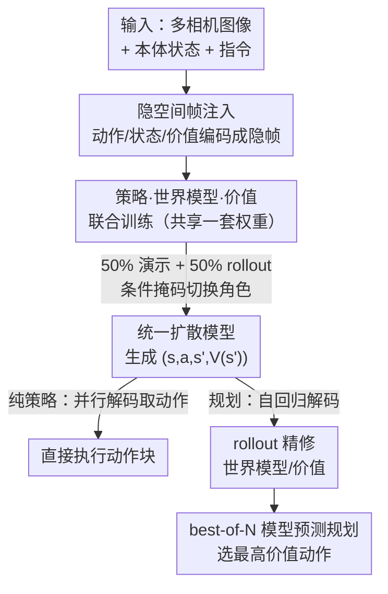

# Cosmos Policy: Fine-Tuning Video Models for Visuomotor Control and Planning

**会议**: ICLR2026  
**OpenReview**: [https://openreview.net/forum?id=wPEIStHxYH](https://openreview.net/forum?id=wPEIStHxYH)  
**代码**: https://research.nvidia.com/labs/dir/cosmos-policy/  
**领域**: 机器人 / 具身智能  
**关键词**: 视频基础模型, 视觉运动策略, 世界模型, 价值函数, 模型预测规划

## 一句话总结
本文把预训练视频生成大模型 Cosmos-Predict2-2B 当作底座，**不改任何网络结构、只用一阶段微调**，让它把机器人动作、未来状态、状态价值都"编码成隐空间视频帧"一起去噪生成，从而同时充当策略、世界模型和价值函数；在 LIBERO（98.5%）、RoboCasa（67.1%）和真实双臂 ALOHA 任务上都拿到 SOTA，并能用 best-of-N 规划再提升 12.5 分。

## 研究背景与动机
**领域现状**：把大模型当机器人策略底座是当下主流。一类是 VLA（vision-language-action）模型，如 RT-2、OpenVLA、π0.5，它们在「静态图文对」上预训练的视觉-语言模型上接动作头微调；另一类近期工作开始用视频生成模型，因为视频模型从海量视频里学到了时间因果、隐式物理和运动规律，这些时空先验对操作任务天然有价值。

**现有痛点**：现有「用视频模型做策略」的工作普遍很笨重——要么先在机器人数据上微调视频模型、再单独训练一个动作解码器或逆动力学模块（多阶段 + 新结构），要么干脆训一个统一的 video-action 模型但**不用预训练权重**（从头训），于是又丢掉了时空先验。两条路要么复杂、要么浪费了视频大模型最值钱的东西。

**核心矛盾**：想吃到视频大模型的时空先验，就得「原样复用它的结构和学习算法」；可机器人策略需要的输入输出（本体感知、动作块、多相机、状态价值）视频模型原生都不支持。要支持这些模态，过去的做法就是加结构、加阶段——结果又把先验稀释了。如何「零结构改动」地把这些异构模态塞进视频模型？

**本文目标**：(1) 把一个预训练视频模型一阶段微调成有效的机器人策略，不加任何新组件；(2) 让同一个模型同时是策略、世界模型和价值函数；(3) 利用 rollout 数据精修世界模型/价值函数，支持测试时的模型预测规划。

**切入角度**：作者的关键观察是——视频扩散模型本来就擅长建模复杂、高维、多峰的分布，还能生成上百帧时序连贯的内容，那它的学习算法**同样适合把动作和其他模态当作"帧"来建模**。既然如此，何不把动作块、本体状态、价值都"伪装"成隐空间里的视频帧，混进去一起扩散去噪？

**核心 idea**：用「隐空间帧注入（latent frame injection）」把动作 / 本体 / 未来状态 / 价值都编码成视频模型隐序列里的新帧，让原生的视频扩散目标一次性联合建模 $(s, a, s', V(s'))$，从而零结构改动地得到一个既是策略、又是世界模型、又是价值函数的统一模型。

## 方法详解

### 整体框架
Cosmos Policy 的底座是 Cosmos-Predict2-2B-Video2World——一个隐空间视频扩散模型，输入一张起始图 + 文本描述，用 Wan2.1 时空 VAE 把视频压成隐帧序列，再用 EDM 去噪目标 $L(D_\theta, \sigma) = \mathbb{E}_{x_0, c, n}\left[\|D_\theta(x_0 + n; \sigma, c) - x_0\|_2^2\right]$ 训练一个 diffusion transformer $D_\theta$ 去预测干净帧。VAE 把 $(1+T)\times H\times W\times 3$ 的视频压成 $(1+T')\times H'\times W'\times 16$ 的隐序列，其中首帧不做时间压缩，方便用单图作条件。

Cosmos Policy 做的事，是把机器人策略所需的全部模态都"翻译"成这个隐帧序列里的额外帧：原本只有图像帧，现在在图像帧之间插入「本体感知、动作块、未来状态值」这些新模态帧，并在图像层面插入多相机视图帧。整个序列按 $(s, a, s', V(s'))$ 的顺序排列，于是从左到右自回归解码就自然得到「动作 → 未来状态 → 未来价值」。训练时仍然只用一个视频扩散去噪目标，靠**条件掩码**决定序列里哪些帧是条件、哪些是要生成的目标，从而让同一个网络在不同样本上分别扮演策略 $p(a, s', V(s')\,|\,s)$、世界模型 $p(s', V(s')\,|\,s, a)$、价值函数 $p(V(s')\,|\,s, a, s')$。部署时可纯策略（只取动作、并行解码、丢掉后两项），也可开启规划（自回归解码出高质量未来状态/价值，再做 best-of-N 搜索）。

### 关键设计

**1. 隐空间帧注入：把异构模态全部伪装成视频帧，零结构改动接入新模态**

痛点直接对准「想用视频模型却要加结构」：视频模型原生不吃本体感知、不吐动作和价值、不支持多相机。作者不去改网络，而是把每个新模态填进一个 $H'\times W'\times C'$ 的隐帧体——具体做法是把本体状态、动作块、价值**归一化到 $[-1, +1]$ 后复制铺满**整张隐帧，多相机图像则直接在图像序列层面插入对应的视图帧。以「两台第三人称相机 + 一台腕部相机」的平台为例，隐序列含 11 帧：(1) 空白占位帧、(2) 本体感知、(3) 腕部图、(4)(5) 两张第三人称图、(6) 动作块、(7) 未来本体、(8)(9)(10) 三张未来图像、(11) 未来状态价值。这套排列恰好是 $(s, a, s', V(s'))$，让模型可以从左到右自回归解码。注入是灵活的：单相机的机器人去掉多视图帧就只剩 7 帧。整套机制不动一行结构代码，纯靠"把模态当帧"复用了视频模型的扩散学习算法去捕捉复杂动作分布。

**2. 策略 / 世界模型 / 价值函数的联合训练：一套权重三种角色，用条件掩码切换**

既然所有模态都在同一隐序列里，那"训练哪一项"就只取决于「哪部分当条件、哪部分当目标」。每个训练步采一批 $(s, a, s', V(s'))$ 元组：50% 来自演示数据训练策略 $p(a, s', V(s')\,|\,s)$，另外 50% 来自 rollout 数据、再对半分别训世界模型 $p(s', V(s')\,|\,s, a)$ 和价值函数 $p(V(s')\,|\,s, a, s')$。值得注意的是策略和世界模型都带**辅助目标**——策略不只学 $p(a|s)$ 而是连未来状态和价值一起学，世界模型不只学 $p(s'|s,a)$ 也连价值一起学；消融显示这种辅助监督实打实提升了策略性能。价值这里直接用 Monte Carlo 回报 $G_t = \gamma^{H-t} R(s_H, a_H)$ 作标签（稀疏奖励、末端给 $[0,1]$ 的奖励、用折扣 $\gamma$ 反传）。解码上支持并行（快、纯策略用）和自回归（质量高、可让策略与世界模型用不同 checkpoint，规划时用）两种模式。

**3. 从 rollout 学习 + 双模型部署：让世界模型见过失败，规划才靠谱**

只用演示数据训出来的世界模型/价值函数有个硬伤——演示几乎全是成功轨迹，状态-动作分布太窄，一旦策略走到分布外就预测不准，规划自然失灵。作者因此强调必须收集 rollout 数据（部署策略、记录轨迹和成败），再用它精修：精修时把 90% 的 batch 权重压到世界模型和价值函数、只留 10% 给策略。精修后做**双模型部署**——原始 checkpoint 当"策略模型"负责出动作，精修后的 checkpoint 当"规划模型"负责世界建模和价值预测，这样规划模型恰好是在原策略产生的 on-policy 数据上训的。价值函数还能通过输入掩码切成 $V(s')$（掩掉 $(s,a)$，需先预测未来状态）或 $Q(s,a)$（掩掉 $s'$，免世界模型的 model-free 变体），供规划实验对比。

**4. best-of-N 模型预测规划：想象多个未来、挑价值最高的动作执行**

有了策略模型和规划模型，规划就是一次「想象-排序-执行」：(1) 从策略采多个候选动作；(2) 用规划模型为每个候选预测未来状态和价值；(3) 选预测价值最高的那个去执行。为对抗价值预测的多峰和高方差，作者做集成——每个动作让世界模型查 3 次、每个未来状态让价值函数查 5 次，共 15 个价值预测，再用「多数均值（majority mean）」聚合：先按固定阈值判多数预测成功还是失败，只在多数那组里取均值，比朴素平均更抗离群点。搜索用 $N$ 张 GPU 并行加速，并且整块动作一次执行完（而非滚动 horizon 控制）以省算力。这一层规划在两个最难的 ALOHA 任务上平均再提升 12.5 分。

## 实验关键数据

### 主实验

LIBERO（单臂、6000 trials 平均）四个子任务套件成功率：

| 方法 | Spatial | Object | Goal | Long | 平均 |
|------|---------|--------|------|------|------|
| Diffusion Policy | 78.3 | 92.5 | 68.3 | 50.5 | 72.4 |
| π0.5 | 98.8 | 98.2 | 98.0 | 92.4 | 96.9 |
| OpenVLA-OFT | 97.6 | 98.4 | 97.9 | 94.5 | 97.1 |
| CogVLA | 98.6 | 98.8 | 96.6 | 95.4 | 97.4 |
| **Cosmos Policy（本文）** | 98.1 | **100.0** | 98.2 | **97.6** | **98.5** |

RoboCasa（24 个厨房任务、3600 trials 平均）——关键是 Cosmos Policy 只用 **50** 条演示就超过那些用 300~3000 条的方法：

| 方法 | 每任务演示数 | 平均成功率 (%) |
|------|------------|---------------|
| GR00T-N1 | 300 | 49.6 |
| π0 | 300 | 62.5 |
| GR00T-N1.5 | 300 | 64.1 |
| FLARE | 300 | 66.4 |
| **Cosmos Policy（本文）** | **50** | **67.1** |

真实双臂 ALOHA 四个任务（101 trials）上 Cosmos Policy 取得最高综合得分，并在其中三个任务超过所有对手；尤其在「往碗里放糖果」（高动作多峰）和「把糖果放进密封袋」（毫米级高精度）这两个最难任务上明显更稳——π0.5 常抓不牢密封袋滑块、OpenVLA-OFT+ 常往两颗糖果中间伸（L1 回归动作建不好多峰分布）。

### 消融实验

| 配置 | 相对平均成功率 | 说明 |
|------|--------------|------|
| 完整 Cosmos Policy | 基准 | 含辅助目标 + 视频先验 |
| w/o 辅助损失 | −1.5% | 去掉联合预测 $s'/V(s')$ 的辅助监督 |
| 从头训练（无视频先验） | −3.9% | 随机初始化、同等梯度步 |

ALOHA「叠衬衫」任务上，从头训练版本得分 80.8，比完整版（≈99.5）低 18.7 分，且动作抖动、长期部署可能损伤机器人，作者直接停掉了进一步评测。

### 关键发现
- **视频先验是大头**：从头训练掉 3.9%（仿真）、实机更掉 18.7 分，证明预训练视频模型给低层控制策略提供了强初始化，而且**不需要额外的动作标注机器人数据**。
- **辅助监督有用**：让策略/世界模型顺手预测未来状态和价值，比只预测动作更好（+1.5%），是"免费"的正则。
- **规划要 rollout 撑腰**：只靠演示数据的世界模型预测不出"丢掉滑块"这类失败；用 648 条 rollout 精修后，世界模型预测未来状态更准，best-of-N 规划在两个难任务上 +12.5 分。
- **model-based 优于 model-free**：$V(s')$（带世界模型）规划稳定优于 $Q(s,a)$（model-free）——后者在 rollout 数据有限、输入维度更高时更难学准、易过拟合。

## 亮点与洞察
- **"把一切当帧"是真优雅**：动作、本体、价值这些非图像模态全部归一化复制铺满成隐帧塞进扩散序列，零结构改动就让视频模型吃下机器人策略需要的所有 I/O——这是全文最"啊哈"的点，把"复用预训练先验"和"支持新模态"这对矛盾一次化解。
- **一套权重当三种东西**：靠条件掩码让同一个网络分别是策略、世界模型、价值函数，省掉了三个独立模块，还天然共享表示；这套"用掩码切角色"的思路可迁移到任何统一序列模型。
- **双模型部署的小巧思**：用原策略产生的 on-policy rollout 去精修出专门的规划模型，避免了世界模型在 off-policy 分布上"想当然"，是让规划真正有效的关键工程细节。
- **数据效率惊人**：RoboCasa 上 50 条演示打过别人 300~3000 条，说明时空先验能极大降低对动作标注数据的需求，对真实机器人采数成本敏感的场景很有吸引力。

## 局限与展望
- **规划很慢**：开启 model-based 规划后约 5 秒才出一个动作块，难用于动态/实时任务，如何加速搜索是重要方向。
- **规划吃 rollout 数据**：要让世界模型/价值函数在演示分布之外也准，得收集相当量的 rollout；如何从更少 rollout 学好，关系到方法的可及性。
- **搜索只有一层**：当前 best-of-N 只展开搜索树的一层；延长世界模型预测视野、做更深的多步规划有望进一步提升。
- **未用历史与多步未来**：$s$、$s'$ 只取 $t$ 和 $t+K$ 两个时刻的观测，不用输入历史、也不预测跨多个后续时刻的未来帧，可能限制了对长时依赖任务的建模（自评，以原文设定为准）。

## 相关工作与启发
- **vs 多阶段视频策略（Video Policy / UVA 等）**: 它们先微调视频模型再训独立动作解码器/逆动力学模块，多阶段 + 新结构；本文单阶段、零结构改动，直接在原生隐扩散里生成动作，更简洁也更省工程。
- **vs 统一 video-action 模型（UWM 等）**: 它们也联合预测帧和动作，但自定义结构、**不用预训练视频模型**，吃不到时空先验；本文从 Cosmos-Predict2 初始化，正是为了保住这份先验。
- **vs VLA（π0.5 / OpenVLA-OFT / CogVLA 等）**: VLA 底座是静态图文对预训练的视觉-语言模型；本文换成"预测未来帧"学来的视频模型底座，主张时空动力学先验比语义先验更适合低层控制，实机上确实在高多峰/高精度任务超过了见过大量动作数据的 VLA。
- **vs 经典世界模型/规划（Dreamer / TD-MPC / SAILOR / FLARE 等）**: 它们通常用策略、世界模型、价值函数三个独立模块且多从头训；本文用一套统一架构同时担三职、且从预训练视频模型初始化，是范式上的差别。

## 评分
- 新颖性: ⭐⭐⭐⭐⭐ 「把动作/价值当隐帧、零结构改动复用视频大模型」是干净而有洞察的范式。
- 实验充分度: ⭐⭐⭐⭐⭐ 仿真双 benchmark + 真实双臂，含 SOTA 对比、消融、规划分析与失败模式可视化。
- 写作质量: ⭐⭐⭐⭐ 思路讲得清楚，隐帧注入和联合训练的图示到位；部分实现细节散在附录。
- 价值: ⭐⭐⭐⭐⭐ 开源代码/模型/数据，数据效率高，给"视频模型即机器人策略底座"提供了强证据。

<!-- RELATED:START -->

## 相关论文

- [\[ICLR 2026\] EVLP: Learning Unified Embodied Vision-Language Planner with Reinforced Supervised Fine-Tuning](evlp_learning_unified_embodied_vision-language_planner_with_reinforced_supervise.md)
- [\[ICLR 2026\] H$^3$DP: Triply-Hierarchical Diffusion Policy for Visuomotor Learning](h3dp_triplyhierarchical_diffusion_policy_for_visuomotor_learning.md)
- [\[ICLR 2026\] Masked Generative Policy for Robotic Control](masked_generative_policy_for_robotic_control.md)
- [\[NeurIPS 2025\] PROFIT: A Specialized Optimizer for Deep Fine Tuning](../../NeurIPS2025/robotics/profit_a_specialized_optimizer_for_deep_fine_tuning.md)
- [\[ICLR 2026\] WMPO: World Model-based Policy Optimization for Vision-Language-Action Models](wmpo_world_model-based_policy_optimization_for_vision-language-action_models.md)

<!-- RELATED:END -->
